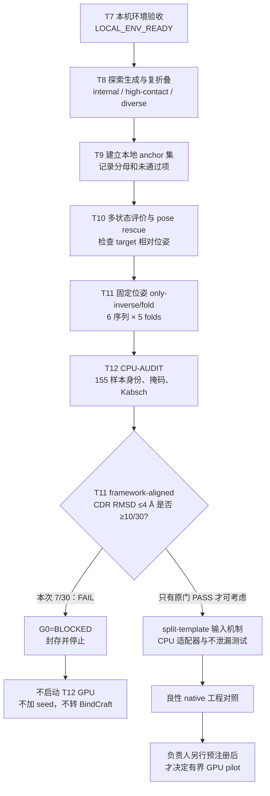

# T12 理论设计、结果分析与实验员审计交接

本文面向在同一台 Windows/WSL2 电脑上接收项目的研究生。它说明现有运行脚本、T8–T12 的推理逻辑、155 个历史折叠样本的审计结果、T12 split-template（拆分模板）机制设计，以及操作员与独立审计员应如何验收。本文是公开 GitHub 可提交的小型技术摘要，不包含模型权重、完整运行目录、令牌或私密数据。

> **当前终态：`C2=FAIL (7/30 < 10/30)`；`G0=BLOCKED`；`T12_GPU=NOT_STARTED`；`BINDCRAFT=NOT_STARTED`。**
>
> T12 的原授权带有 90 分钟硬上限，并明确“不自动转 BindCraft”。CPU 门失败后已按规则停止，没有放宽阈值、追加 seed、创建 T12 GPU attempt 或启动 BindCraft。

## 1. 接收人先记住的结论

1. T11 固定位姿逆折叠运行在工程上完成：6 条不同 CDR 序列、每条 5 个折叠样本，共 30 个有限数值样本，无 OOM，运行器退出码为 0。
2. 工程完成不等于科学目标通过。T11 的官方严格筛选为 0/6，target-aligned CDR RMSD ≤8 Å 为 0/30，hard-joint 命中为 0/30；当前 fixed-pose only-inverse/fold 协议已停止扩样。
3. T12 先做的 CPU 机制门是：T11 的 **framework-aligned CDR backbone RMSD ≤4 Å 必须达到至少 10/30**。独立复核结果是 7/30，因此门失败。
4. 30/30 都在 framework-aligned ≤8 Å、四臂合计 111/155 在 ≤4 Å，均不能替代预先固定的 T11 门槛 10/30。
5. 155 个样本的共同问题仍是 VHH 相对 target 的位姿漂移：四臂 target-aligned CDR RMSD 的最小值都大于 22 Å，合计 0/155 ≤8 Å。
6. 本轮可以把 CPU 审计脚本、split-template 输入适配器、单元测试和本摘要推送到 GitHub；这只表示分析和工程机制被公开，不表示 T12 推理已运行，更不表示实验结合成功。

## 2. 声明边界

- 本项目是 AI 创制大赛中的**理论设计和计算探索**。所有结果来自现成模型权重的推理或对推理产物的计算分析。
- 没有训练、微调或修改 BoltzGen 权重。
- 没有湿实验、结合实验、亲和力测量、选择性实验、安全性或成药性验证。
- iPTM、RMSD、接触数和模型排名都是计算代理指标，不能转述为“已结合”“有效”“特异”或“可用药”。
- 模型生成有随机性；本文给出的分母、seed 对应关系和停止规则只约束本次封存结果，不能替代独立复现。
- T11 结果对应的源码提交为 `d989db24066bda4652d48f4e14dd80e6409890aa`。后续提交只增加审计/输入机制资产时，不得把新的 Git HEAD 冒充为已运行 T11 时的源码。

项目的长期边界见仓库根目录的 `AGENTS.md` 和本目录的 [Windows owner 任务说明](WINDOWS_OWNER_TASKS_ZH.md)。需要单文件图表版时，可打开同一提交中的 [离线 HTML 交接手册](reports/t12_theoretical_design_20260902/T12_WINDOWS_RUN_LOGIC_AUDIT_HANDOFF_20260901.html)。

## 3. T8–T12 逻辑



| 阶段 | 做了什么 | 主要输出/结论 | 本文中的状态 |
|---|---|---|---|
| T7 | Windows/WSL2 检查 GPU、CUDA、BF16、原生算子、运行资产和磁盘 | `LOCAL_ENV_READY` 收据 | 已完成；不需 Mac 签发 |
| T8 | 生成候选并复折叠，形成 internal、high-contact、diverse 三臂 | 125 个历史 fold samples | 已完成的开发数据 |
| T9 | 从本地结果建立 anchor 集 | 固定后续比较对象 | 已完成的开发步骤 |
| T10 | 多状态评价、pose-anchored 输入和 pose rescue | 暴露 target-relative pose drift | 已完成；未解决位姿保持 |
| T11 | 对固定高接触 pose 只做 inverse-fold，再每序列折叠 5 次 | 6 序列、30 folds；官方严格通过 0/6 | 工程完成，科学目标失败 |
| T12 | 先重算 155 样本，再用 T11 的 10/30 门决定是否进入 split-template GPU pilot | CPU 门 7/30 | **门失败；GPU 未启动** |

## 4. 155 个历史样本的结果

### 4.1 四臂汇总

数值越低表示被评价的几何越接近参考。`≤4 Å` 和 `≤8 Å` 计数均使用 framework-aligned CDR backbone RMSD；最后两列专门展示 target-aligned 指标。

| 历史臂 | 样本数 | framework ≤4 Å | framework ≤8 Å | framework 中位数 (Å) | target-aligned 最小值 (Å) | target-aligned ≤8 Å |
|---|---:|---:|---:|---:|---:|---:|
| internal | 50 | 50/50 (100%) | 50/50 | 1.466 | 23.264 | 0/50 |
| high-contact | 50 | 34/50 (68%) | 50/50 | 2.898 | 22.052 | 0/50 |
| diverse | 25 | 20/25 (80%) | 25/25 | 1.295 | 25.327 | 0/25 |
| fixed-ifold（T11） | 30 | 7/30 (23.3%) | 30/30 | 5.980 | 29.899 | 0/30 |
| **合计** | **155** | **111/155 (71.6%)** | **155/155** | **1.725** | **22.052** | **0/155** |

T11 的 7 个 `≤4 Å` 样本分布为：`design_0=1/5`、`design_1=2/5`、`design_2=1/5`、`design_3=0/5`、`design_4=0/5`、`design_5=3/5`。单个候选 `design_5=3/5` 不能改变总门 `7/30 < 10/30`。

### 4.2 framework-aligned 与 target-aligned 到底差在哪里

**Framework-aligned CDR RMSD** 的步骤是：先用 VHH framework 的 364 个 backbone atoms 做 Kabsch 刚体对齐，再计算 CDR 的 120 个 backbone atoms 的 RMSD。它主要回答“把整个 VHH 的平移和旋转拿掉后，CDR 相对自身 framework 是否保持”。它不保留 VHH 相对 target 的整体位姿误差。

**Target-aligned CDR RMSD** 的步骤是：先用 target backbone 对齐，再看 CDR 在同一 target 坐标系中的位置。它回答“CDR 是否仍处于相对 target 的参考位姿”。VHH 整体从 target 旁边漂走时，这个指标会变大，即使 VHH 自身折得仍像原来。

因此，这两个指标不能互换：前三臂 framework-aligned 表现较好，而 target-aligned 全部失败，说明主要问题是**相对 target 的位姿漂移**；T11 又额外出现较弱的 VHH 内部 CDR 保持。T12 split-template 只能作为定位模板耦合机制的试验设计，不能预先宣称会修复这两个问题。

### 4.3 样本身份和掩码合同

- 一个 fold NPZ 的坐标形状为 `(5, Natom, 3)`；指标数组也有 5 项。第 `s` 个坐标必须只和同文件第 `s` 个指标绑定。
- 唯一样本身份是 `(arm, design_i, sample_index)`，其中 `sample_index` 为 0–4。不得把 aggregate CSV 的标量绑到另一个 writer-selected CIF。
- T11 输入共有 151 个 token：target 30、VHH 121；CDR 30、VHH framework 91。
- 当前 token 分段为 target `0..29`，VHH `30..150`，CDR `55..62`、`80..86`、`125..139`；其余 VHH token 属于 framework。
- 审计必须经 `atom_to_token` 和 resolved/backbone mask 得到原子集合，而不是假设每个残基一定有完整原子。
- 历史的四个 target-aligned minima（23.264、22.052、25.327、29.899 Å）被独立复现，作为样本绑定和 Kabsch 实现的交叉检查。

仓库中的相关既有实现可从 [多状态汇总器](scripts/summarize_owner_multistate.py) 和 [T11 验证器](scripts/validate_owner_only_inverse_fold.py) 开始阅读。本轮新增的 [T12 155 样本审计脚本](scripts/audit_t12_framework_aligned_cdr.py) 会在完整写出 JSON/TSV 后，以退出码 `42` 表示科学门失败；`42` 不是 Python 崩溃。

## 5. T12 split-template 理论设计

### 5.1 要隔离的机制

现有 BoltzGen 数据路径在 `target_templates=true`、`design_mask_templates=false` 时只给 target 模板。T12 的机制假设是：把 target 与 VHH framework 放进**不同的模板槽**，同时让 CDR 在两个槽中都不可见，避免用一个共同模板直接携带 target×framework 的相对几何，再观察模型是否能更合理地处理相对位姿。

这是机制隔离，不是候选有效性证明。由于 C2 已失败，当前只能实现/单测输入机制；不能启动 T12 GPU 推理。

### 5.2 适配器合同

本轮的 repo-owned 适配器和测试分别为 [owner_split_template_data.py](scripts/owner_split_template_data.py) 与 [test_owner_split_template_data.py](tests/test_owner_split_template_data.py)。核心掩码设计是：

```python
target_mask = ~chain_design_mask
cdr_mask = design_mask
framework_mask = chain_design_mask & ~design_mask

target_slot = template_from_tokens(tokenized, target_mask.numpy(), tdim=1)
framework_slot = template_from_tokens(tokenized, framework_mask.numpy(), tdim=1)
templates = concatenate([target_slot, framework_slot], dim=0)
```

以上伪代码假设输入只有一条 target 链和一条 design/VHH 链；真正实现必须先验证这一输入合同。T11 形状的预期是：

- 总 token `N=151`；target/CDR/framework 分别为 `30/30/91`；三者互斥且并集为全部 token。
- 模板维 `T=2`。槽 0 只显示 30 个 target token；槽 1 只显示 91 个 framework token；30 个 CDR token 在两个槽中都不可见。
- `template_restype` 预期为 `[2, N, 33]`；旋转、平移和坐标类张量为以 `[2, N, ...]` 开头的有限浮点张量；mask/query/visibility 为 `[2, N]`。
- 每个 slot 内的 target×framework pose-related geometry channels 应被遮蔽，不能出现 mask bleed。
- 对 VHH 做任意刚体变换后，split-template 的完整 preprojection feature 应保持刚体不变；作为反证的 coupled-template control 应发生变化。

一个重要措辞限制：模板的 residue-type 特征会在后续拼接，因此不能声称“target×framework 的所有 pair feature 都是零”。可验证、也只能声明的是：相关的跨组**位姿几何通道**被遮蔽，且完整 preprojection 特征通过刚体不变性测试。原始模板坐标在刚体变换后本来就会变化，不应拿原始坐标逐元素相等作为测试。

如负责人以后重新预注册并批准正对照，可考虑非病原性的鸡卵清溶菌酶–VHH 已知复合物（例如 PDB `6JB8`）做工程 sanity control。当前没有下载、运行或得到该对照结果，不能写成“正对照通过”。

### 5.3 当前可声明和不可声明的状态

| 项目 | 可以声明 | 不可以声明 |
|---|---|---|
| CPU adapter | 输入机制已被实现/单测（以本次提交的实际测试记录为准） | T12 模型已经按该机制推理 |
| 155 样本审计 | 已对历史 NPZ 按同索引重算并得到 7/30 | T12 新生成了 155 个样本 |
| C2 | 原门失败，GPU 被阻断 | “接近通过”、用 30/30≤8 Å 代替 10/30≤4 Å |
| native control | 仅有建议和预期合同 | 已下载、已运行、已通过 |
| BindCraft | 没有启动 | 自动转入、已有 BindCraft 结果 |
| 科学意义 | 支持“当前计算协议未保持目标位姿” | 实验结合、亲和力、选择性、安全性或成药性结论 |

## 6. Windows/WSL2 运行入口和脚本索引

### 6.1 从 Windows 进入主仓库

在 PowerShell 中只做身份检查：

```powershell
wsl.exe -d Ubuntu-24.04 -- bash -lc 'cd "$HOME/creator/GLP_" && git status --short && git branch --show-current && git rev-parse HEAD'
```

在 WSL2 中建立便于阅读的路径变量：

```bash
cd "$HOME/creator/GLP_"
OWNER_TASK=boltzgen/main/windows_single_owner_20260831
```

需要 NumPy、Gemmi、Hydra 或 BoltzGen 的 Python 脚本必须使用 `LOCAL_ENV_ACCEPTANCE.json` 中记录的 `python_bin`，不要默认使用 WSL 系统 `python3`。本机当前环境路径中的 `attempt_004` 只是环境构建的第 4 次 attempt；含义见第 9 节。

### 6.2 脚本索引

| 阶段 | 入口 | 作用 | 最小调用形式 |
|---|---|---|---|
| T7 | [verify_local_env.sh](scripts/verify_local_env.sh) | 新建一次本机环境验收收据 | `bash "$OWNER_TASK/scripts/verify_local_env.sh" "$HOME/creator" [PYTHON_BIN]` |
| T8 | [run_owner_exploratory_cell.sh](scripts/run_owner_exploratory_cell.sh) | 单 GPU、batch=1 的 adherence/diverse 探索运行 | `bash "$OWNER_TASK/scripts/run_owner_exploratory_cell.sh" WORKSPACE_ROOT CELL_ID SPEC CHECKPOINT NUM_DESIGNS` |
| T9 | [build_local_anchor_set.py](scripts/build_local_anchor_set.py) | 从源运行生成本地 anchor 清单 | `ACCEPTED_PY ... --source-run SOURCE_RUN --output OUTPUT [--anchor-count N]` |
| T10 输入 | [build_owner_multistate_inputs.py](scripts/build_owner_multistate_inputs.py) | 从 anchor、候选和状态建立多状态输入 | `ACCEPTED_PY ... --repo-root ... --anchor-set ... --output ... --runtime-root ...` |
| T10 预检 | [preflight_owner_multistate.py](scripts/preflight_owner_multistate.py) | 检查 run root、运行资产和坐标合同 | `ACCEPTED_PY ... --run-root ... --runtime-root ... --coordinate-contract ...` |
| T10 运行 | [run_owner_multistate.py](scripts/run_owner_multistate.py) | 有界多状态评价 | `ACCEPTED_PY ... --workspace-root ... --panel-id ... --anchor-set ...` |
| T10 汇总 | [summarize_owner_multistate.py](scripts/summarize_owner_multistate.py) | 绑定 sample 并生成多状态摘要 | `ACCEPTED_PY ... --run-root ... [--baseline-state ...]` |
| T10 pose spec | [build_owner_pose_anchored_spec.py](scripts/build_owner_pose_anchored_spec.py) | 由封存 pose 构建 pose-anchored spec | 先运行 `ACCEPTED_PY script --help`，再显式给出 spec bundle、anchor、candidate 和输出 |
| T11 | [run_owner_only_inverse_fold.sh](scripts/run_owner_only_inverse_fold.sh) | 固定 pose；只 inverse-fold；每序列 5 folds | `bash ... WORKSPACE_ROOT RUN_ID SEALED_SPEC NUM_SEQUENCES`，其中序列数 6–10 |
| T11 验证 | [validate_owner_only_inverse_fold.py](scripts/validate_owner_only_inverse_fold.py) | `preflight-spec`、`validate-inverse`、`validate-run` 三类独立检查 | `ACCEPTED_PY ... validate-run RUN_ROOT SPEC --sequences N --fold-samples 5` |
| T12 CPU | [audit_t12_framework_aligned_cdr.py](scripts/audit_t12_framework_aligned_cdr.py) | 读取四臂 NPZ、写 155 行 TSV/JSON 并执行 10/30 门 | 见下方命令模板；失败门的预期退出码为 42 |
| T12 输入机制 | [owner_split_template_data.py](scripts/owner_split_template_data.py) | CPU 侧生成两槽 split templates | 由单元测试和后续配置引用；当前不得据此启动 GPU |
| 经验库 | [append_owner_experience.py](scripts/append_owner_experience.py) | 把小型成功/失败事件追加到本地经验登记册 | `ACCEPTED_PY ... --registry REGISTRY --event EVENT` |

表中的 `ACCEPTED_PY ...` 表示“用验收收据中的 Python 解释器运行该行对应脚本”，不是字面命令。所有新运行必须使用新目录，禁止 `--reuse`。

T12 CPU 审计的接口为：

```bash
"$ACCEPTED_PY" "$OWNER_TASK/scripts/audit_t12_framework_aligned_cdr.py" \
  --internal-root INTERNAL_INTERMEDIATE_DESIGNS_INVERSE_FOLDED \
  --high-contact-root HIGH_CONTACT_INTERMEDIATE_DESIGNS_INVERSE_FOLDED \
  --diverse-root DIVERSE_INTERMEDIATE_DESIGNS_INVERSE_FOLDED \
  --fixed-ifold-root FIXED_IFOLD_INTERMEDIATE_DESIGNS \
  --output-json NEW_ATTEMPT/reports/t12_framework_aligned_cdr_audit.json \
  --output-tsv NEW_ATTEMPT/reports/t12_framework_aligned_cdr_samples.tsv \
  --framework-threshold-angstrom 4.0 \
  --fixed-ifold-min-pass 10
```

输出 JSON/TSV 属于新 attempt 的运行产物，不因脚本进入 GitHub 就自动提交。公开仓库只应提交小型、脱敏、确有必要的摘要；完整 NPZ、CIF、权重和运行目录继续保留在本机工作盘。

## 7. 实验员/操作员执行流程

这里的“实验员”指计算任务操作员，不表示已经进行湿实验。

### P0：接管和仓库身份

1. 确认 `WINDOWS_OWNER_MODE.json` 为 `ACTIVE`，authority 为 Windows owner，训练和权重修改均为禁止。
2. 记录 `git branch --show-current`、`git rev-parse HEAD` 和 `git status --short`。任何未知改动先隔离说明，不要覆盖。
3. 确认同一时间没有别的 GPU 主任务：`nvidia-smi --query-compute-apps=pid,process_name,used_memory --format=csv`。

### P1：输入闭合

1. 四臂应分别有 10、10、5、6 个 `design_i`，每个 fold NPZ 有 5 个 samples，总计 155。
2. 所有坐标和指标必须有限，无 NaN/Inf；缺文件、空文件、shape 不匹配时立即停止。
3. 不得从 CSV 或单个 CIF“补齐”缺失 NPZ 样本。

### P2：收据和哈希

1. 对已封存的小型收据，在其目录执行 `sha256sum --strict -c SHA256SUMS`。
2. 推理前后核对实际使用的权重文件未变化，但不要让每位复核人无目的地反复散列全部约 6 GB 资产。
3. 哈希一致只证明字节相同，不证明文件科学正确、模型有效或得到授权。

### C0/C1：CPU 独立复核

1. 先运行 [T12 审计单测](tests/test_audit_t12_framework_aligned_cdr.py)。
2. 再运行四臂审计命令，保留 stdout、stderr、UTC、命令行、JSON、TSV 和退出码。
3. 核对 token/atom 掩码、四个历史 target-aligned minima、每臂样本数和候选级 7 个通过样本。
4. 科学门失败时，脚本应先完整写出结果，再以 42 退出。不要把 42 改成 0，也不要只截取前面的“文件已写出”。

### C2/G0：停止决定

```text
若 fixed-ifold framework-aligned CDR RMSD ≤4 Å >=10/30：
    只能进入“提交负责人重新授权”的队列；仍不能自行启动 GPU。

若结果 <10/30（本次为 7/30）：
    CPU_GATE_FAIL -> G0=BLOCKED
    不创建 T12 GPU attempt
    不追加 seed
    不改阈值
    不自动转 BindCraft
```

### S0：封存和 GitHub 发布

1. 保存本轮命令、分母、阈值、退出码、时间、源码 HEAD 和结果摘要。
2. 确认 GPU compute process 为 0，确认没有新 T12 GPU attempt。
3. 只提交源码、测试、小型配置和本摘要；运行资产、大型原始数据、完整结果、Token、私钥和 `.env` 不进公开 GitHub。
4. 提交前检查 `git diff --check`，运行相关测试，审阅 staged diff，再提交和推送。

## 8. 独立审计员验收矩阵

独立审计员不应直接信任操作员的口头结论，应从封存输入重新运行只读检查。

| 编号 | 检查 | 通过条件 | 本次状态 | 不通过时动作 |
|---|---|---|---|---|
| A0 | owner、分支、HEAD、工作树 | 路径正确，身份有记录，未知改动为 0 | 按接收时重查 | 停止，不运行分析 |
| A1 | 四臂输入闭合 | 10/10/5/6 designs；每个 5 samples；总计 155 | PASS | `INPUT_CLOSURE_FAIL` |
| A2 | 样本索引绑定 | 坐标与指标使用同一个 0-based index | PASS | 丢弃统计并修审计器 |
| A3 | 掩码和 Kabsch | 30/30/91 tokens；120 CDR、364 framework backbone atoms；历史 minima 复现 | PASS | 不解释任何 RMSD |
| A4 | T11 CPU 门 | `≤4 Å` 至少 10/30 | **FAIL：7/30** | `CPU_GATE_FAIL` |
| A5 | GPU 启动许可 | A0–A4 全部通过且负责人另行批准 | **BLOCKED** | 不启动 launcher |
| A6 | T12/BindCraft 现场状态 | 0 compute process；无 T12 GPU attempt；BindCraft 未启动 | NOT STARTED | 隔离越门输出，不纳入结果 |
| A7 | 声明边界 | 理论/AI 结果；无实验声明 | 必须 PASS | 修改文案后再发布 |

建议签核记录：

```text
接收人：______________________  审计人：______________________
日期、时间、时区：__________________________________________
Windows 主机：________________  WSL distro：Ubuntu-24.04
当前 Git HEAD：________________________________________________
git status --short：空 / 非空（附说明）
四臂样本数：____ / ____ / ____ / ____；总数：________
fixed-ifold ≤4 Å：________ / 30；门槛：>=10/30
审计脚本退出码：________（本次预期 42）
GPU compute process：________
新 T12 GPU attempt：YES / NO
BindCraft started：YES / NO
最终判定：C2=FAIL / PASS；G0=BLOCKED / RELEASED
异常与处置：__________________________________________________
```

## 9. 容易混淆的术语

| 术语 | 在本项目中的具体含义 | 不代表什么 |
|---|---|---|
| `attempt_004` | 某一 stage 下的第 4 次尝试目录。当前接受的 Python 路径中，它是 `cu128_blackwell_candidate` 环境构建/验证的第 4 次 attempt。不同 stage 也可各自有同名 `attempt_004`，所以必须连同完整 stage 路径阅读。 | 不是 design_4，不是第 4 个生物候选，不是“第 4 次实验成功”，也不是科学结论。 |
| validator | 独立读取输入/输出并检查合同的程序，例如身份、文件闭合、shape、有限数、样本数、链角色、哈希和阈值。 | 不生成候选，不等于模型本身，不证明实验结合。 |
| SHA-256 / hash | 文件内容的字节指纹，用于发现复制或封存后的内容漂移。 | 不是数字签名、审批、科学正确性或安全性证明。 |
| manifest | 路径、大小、哈希或目录闭合的机器可读清单。 | 不是结果解释，也不能补回未列入清单的缺失数据。 |
| receipt | 一次运行/验收的状态、时间、参数和证据索引。 | 有 `COMPLETE` 不等于科学门通过。 |
| `sample_index` | NPZ 内 0-based 的具体折叠样本号。 | 不是候选排名，也不能跨文件混用。 |
| sealed attempt | 已写终态、清单并禁止继续混写的运行目录。 | 不是锁箱、不是实验注册，也不是外部批准。 |
| iPTM | 模型给出的界面置信代理指标。 | 不是亲和力或结合常数。 |
| RMSD | 两组坐标经指定对齐后的均方根偏差；必须同时说明对齐对象和原子集合。 | 单独一个 RMSD 不能证明功能、亲和力或选择性。 |

更通用的术语见 [Windows owner 术语表](GLOSSARY_ZH.md)。

## 10. T11 的 214 秒具体花在哪里

T11 封存记录从 `2026-08-31T20:14:39Z` 到 `20:18:13Z`，wall clock 为 214 秒。各阶段计时如下：

| 任务类型 | 秒 | 占 214 秒 |
|---|---:|---:|
| folding（30 个复折叠样本） | 129 | 60.3% |
| analysis | 35 | 16.4% |
| filtering | 14 | 6.5% |
| inverse folding（6 条序列） | 12 | 5.6% |
| configure | 5 | 2.3% |
| inverse gate | 1 | 0.5% |
| validation | 1 | 0.5% |
| 编排、文件 I/O、封存等未单列时间 | 17 | 7.9% |
| **合计** | **214** | **100.0%** |

结论很明确：T11 本次运行中耗时最多的是 folding（60.3%），不是 hash。封存日志没有把哈希单独计时，因此不能把未单列的 17 秒全部归到 SHA-256。用户看到的 2 小时或 7 小时级“项目回合”还包含代码审查、故障定位、修改、测试、审计重算、交互等待和提交等活动；除非这些活动也有逐段时间戳，不能把总回合时长伪装成纯 GPU 或纯哈希耗时。

## 11. 限制、后续决策和公开发布规则

### 已知限制

- 155 个样本来自既有开发运行，不是本轮新生成，也没有新的 seed 重复。
- 四臂规模不同（50/50/25/30），横向比例只用于诊断，不是随机对照实验。
- framework-aligned 门是为机制分流预先固定的工程门，不是公认的生物学成功阈值。
- target-aligned 0/155 支持“当前计算协议未保持参考相对位姿”，但不说明真实分子一定不结合。
- split-template adapter 的 CPU 单测只验证数据合同和不泄漏性质；没有 GPU 候选就没有模型效果结果。
- 良性 native control、GLP pilot 和 BindCraft 均未运行。

### 合规的下一步

1. 持久化并审阅 T12 CPU 审计脚本、单元测试和小型结果摘要。
2. 持久化 split-template CPU adapter 及不泄漏/刚体不变性测试，但保持 `T12_GPU=NOT_STARTED`。
3. 由负责人根据 7/30 的门失败明确选择：保留原门并更换结构约束/候选来源，或重新提出新的、事先写明依据与预算的探索协议。
4. 任何新协议都使用新 attempt、新分母和新停止规则；不能追认式修改本次 10/30 门。
5. BindCraft 只能在负责人以后明确选择时单独规划，不能作为失败后的自动 fallback。

### GitHub 中可以和不可以出现的内容

可以提交：本目录的源代码、测试、脱敏配置、聚合统计、方法说明和失败结论。

不得提交：模型权重、约 6 GB 运行资产、完整 GPU 运行目录、大型 NPZ/CIF 集、访问令牌、私钥、`.env`、个人材料或未经确认可公开的数据。GitHub 登录只解决账户访问，不改变本项目的科学声明边界。

---

本文应与实际提交 diff、测试记录和本机封存结果一起审阅。若文档与机器可重算结果冲突，以保留输入和独立重算为准，并先修正文档；不得为了匹配文档而改阈值或删除失败样本。
