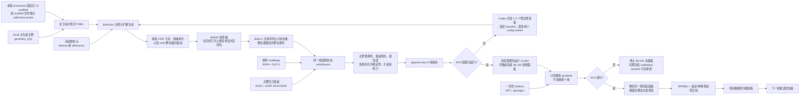
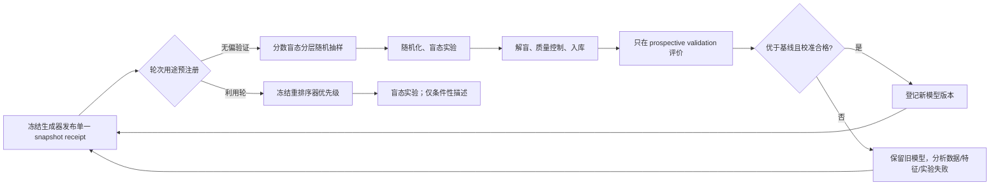

# BoltzGen × 活性 GLP-1 选择性 VHH：无上下文可执行实施方案

> 文档版本：1.1  
> 冻结日期：2026-08-26（Asia/Shanghai）  
> 项目根目录：`$PROJECT_ROOT`  
> 数据根目录：`$PROJECT_ROOT/data/boltzgen_data`  
> 适用软件基线：BoltzGen `v0.3.2`，Git 提交 `31d9d9b9c72245b4ed6fe8742d6fbf4e1a3552a0`  
> 本文定位：交给一个对历史对话完全不知情的执行代理，作为唯一任务上下文、数据索引、实施合同和验收清单。

---

## 0. 先读这一页：不可擅自改变的执行合同

### 0.1 项目目标

设计一组骆驼科单域重链抗体可变区（Variable domain of Heavy-chain-only antibody，首次简称 **VHH**），优先结合活性人胰高血糖素样肽-1（Glucagon-Like Peptide-1，首次简称 **GLP-1**）`GLP-1(7–36)NH₂`，并尽量降低对缺失 N 端 His7–Ala8 的 `GLP-1(9–36)NH₂` 以及相关挑战态的结合。

本项目中的“选择性”最终必须由配对实验测量定义，而不是由生成模型分数定义：

\[
pK_D=-\log_{10}\left(K_D/\mathrm{M}\right)
\]

\[
\Delta pK_D=pK_D\bigl(\mathrm{GLP\!\!-\!1}(7\!\!-\!36)NH_2\bigr)-pK_D\bigl(\mathrm{GLP\!\!-\!1}(9\!\!-\!36)NH_2\bigr)
\]

其中，`K_D` 是以摩尔为单位的平衡解离常数；`ΔpK_D` 越大，表示对正靶的偏好越强。任何未经过表面等离子共振（Surface Plasmon Resonance，简称 **SPR**）或生物层干涉（Bio-Layer Interferometry，简称 **BLI**）配对测量的候选，都不得写成“已证实结合”或“已证实选择性”。

### 0.2 当前正确路线

**当前不做 BoltzGen 基础模型全量训练，也不从新增目录名制造监督标签。** 当前路线固定为：

1. 先执行新增数据的 AIV0 资产门：冻结 `ai_validation_assets_v1` 清单，按 deposition/target identity 去伪重复，并把不完整结构、重复镜像和高风险 scaffold 隔离；
2. 冻结官方 BoltzGen 权重，以旧 12 个已检查 VHH scaffold 为不可变 baseline；新 17 包只作为 scaffold-admission source，完成 canonicalization、INSTANCE 冲突检查、风险处置和逐项 target-containing `boltzgen check` 后只可进入独立 admission probe；本版首轮 12,000 始终使用旧 12；
3. 按 10 → 240 → 2,400 → 12,000 的阶梯做冻结权重推理；6X18 为主正靶，1D0R models 10/12/19/20 为紧凑正靶构象面板，全 20 models 只作敏感性分析；
4. 对同一候选做跨目标 refold/score：9IVM GLP-1(9–36) 和 2L63 GLP-2 用于调参挑战，2B4N GIP 与 6LMK glucagon 作为配置冻结前不可见的 lockbox。Codex 只可依据正靶/调参挑战的完整证据包筛选失败类型、每轮最多批准 1–2 个预注册变量变化，并始终保留固定 baseline control；lockbox 只作一次性群体放行，不能触发同一 campaign 调参；
5. 每次 AI campaign 的成功、失败、配置差异、数据版本、随机状态可用性、逐构象结果和 Codex 决策写入 append-only AI 经验库。计算结果只能称结构鲁棒性或脱靶风险代理，不产生 binder/nonbinder 真值；
6. 只有 Step 13A 的 AIV4 放行门通过，才物化开箱前冻结的 96–192 条实验面板，进入正负靶配对实验闭环；若 AIV4 失败，只可另行批准同样预冻结的 8–16 条 calibration sentinel，不能冒充全面放行；首批实验只用于建立真值和误差分析；
7. 累计达到第 16.2 节标签门槛后，才训练项目级重排序器；只有跨轮次有足够、高质量、去泄漏的实验样本和结构监督后，才评估生成器有限继续训练。除非负责人书面修改本合同，不得启动基础模型从头预训练。

### 0.3 为什么不全量训练

- 当前项目只有 52 条唯一生成序列（主筛 48 条、独立深度探针 4 条），没有真实结合、亲和力、选择性、表达或聚集标签。
- BoltzGen 的公开大型训练配置依赖尚未完整公开的蒸馏数据；仅凭本项目 GLP-1 与 12 个骨架无法重建官方基础训练分布。
- 从头训练会消耗多卡图形处理器（Graphics Processing Unit，简称 **GPU**）资源，却没有足够项目监督信号，最可能得到过拟合或灾难性遗忘，而不是更好的 GLP-1 候选。
- 新增数据提供的是目标/挑战构象和 scaffold 条件，不是候选 VHH 的正负结合观测；监督标签数量仍为 0。
- 此阶段的目标是先用冻结推理消除明显输入、构象、界面和配置失败，再把经过 AI 风险分层的多样化候选送入实验；它不能以计算循环替代真实实验标签。

### 0.4 六条强制阻断规则

出现任意一条，执行代理必须停止对应阶段并记录 `BLOCKED`，不得猜测、跳过或自动覆盖：

1. **哈希阻断**：运行权重、目标或骨架的 SHA-256 校验失败。
2. **编号阻断**：设计规范使用作者编号 `auth_seq_id`，而不是 BoltzGen 要求的 1-based `label_seq_id`；或者 `boltzgen check` 结果与人工可视检查不一致。
3. **化学声明阻断**：把只包含标准聚合物坐标的目标文件写成“已原子级验证 C 端酰胺”；当前文件只能称为 `geometry_only`。
4. **标签阻断**：把 BoltzGen/Boltz-2 计算通过、置信度或距离代理写成 binder、`K_D` 或选择性真值。
5. **环境阻断**：本地项目脚本未使用 Step 0.1 的锁定解释器，Linux 权威分析环境缺少冻结测试依赖，或 lock/wheelhouse 的空环境重建不一致。
6. **数据语义阻断**：把 `binding`/`no_binding` 文件夹名、NMR conformer 数或重复副本当实验标签/独立样本，或者让调参挑战集与 lockbox 在配置冻结前串用。

### 0.5 规范性用语

- **必须**：缺失即失败。
- **应当**：除非在决策日志中写明理由，否则必须执行。
- **可以**：可选项，不影响当前阶段通过。
- 质量控制（Quality Control，简称 **QC**）是对数据、流程和结果完整性/合理性的检查，不是“高亲和力证明”。
- 本文所有标为 `bash` 的代码块都必须由 Bash 执行；在 Codex 中显式把 shell 设为 `/bin/bash`，不得让 macOS 默认 zsh 解释。Mac 本地段兼容 `/bin/bash` 3.2；含 `mapfile` 的 Step 12 只能在 Ubuntu 22.04 的 Bash 5.x 执行，进入该步前必须断言 Bash 主版本至少为 4。

### 0.6 Python 与 pip 外部环境硬门

任何会启动 Python/pip 的独立 shell 都必须在第一次启动前执行以下前导门；项目、GPU 和重排序器的 stage guard 也必须重复执行，不能依赖调用者“应该已经清理”。环境变量即使被设为空也拒绝，因为空路径项可能引入当前目录：

```bash
set -euo pipefail
if [ "${PYTHONPATH+x}" = x ] || [ "${PYTHONHOME+x}" = x ] || \
   [ "${PYTHONOPTIMIZE+x}" = x ]; then
  echo "BLOCKED_UNTRUSTED_PYTHON_ENV" >&2
  exit 70
fi
export PYTHONNOUSERSITE=1
export PYTHONDONTWRITEBYTECODE=1
```

每个锁定解释器在使用前还必须运行 `python -I -c 'import sys; sys.exit(0 if __debug__ else 70)'`；不能用会被 `-O` 删除的 `assert __debug__` 自检。可信的 manifest 生成器统一用 `-I -S`。在线 resolver 一律设置 `PIP_CONFIG_FILE=/dev/null`，先 `unset PIP_EXTRA_INDEX_URL PIP_FIND_LINKS PIP_TRUSTED_HOST PIP_NO_INDEX`，再在命令行显式给出本合同的 `https://pypi.org/simple`（GPU Torch 另加固定 PyTorch CUDA index）；离线生产安装只允许 `--no-index --find-links <已哈希 wheelhouse> --require-hashes`。任何脚本若检测到优化模式、用户 site、外部 Python path、额外 index/find-links 或未登记符号链接/孤立 `.pyc`，立即阻断。

---

## 1. 交付目标、预期效果与明确不承诺的事项

### 1.1 本实施方案的最终交付物

| 交付物 | 必须包含 | 验收方式 |
|---|---|---|
| 可重放数据快照 | 来源网址、快照日期、本地规范路径、SHA-256、用途、限制 | 清单中每个本地文件均存在且哈希通过 |
| 冻结的软件环境 | BoltzGen 标签和提交、Python/包版本、CUDA/驱动、GPU 型号、离线 wheel/完整 site-packages/native kernel 哈希 | `01_provenance/gpu/{pip_freeze.txt,requirements.production.lock.txt,requirements.boltzgen-wheel.lock.txt,wheelhouse.SHA256SUMS,installed_gpu_packages.SHA256SUMS,environment_provenance.SHA256SUMS,gpu_inventory.json,native_abi.txt}` |
| 12 个可执行设计规范 | 每个骨架的框架、三个互补决定区（Complementarity-Determining Region，简称 **CDR**）、正靶 His7/Ala8 位点 | 12/12 `boltzgen check` 通过并完成结构可视检查 |
| 冻结权重推理结果 | diverse 与 adherence 两个设计检查点分开运行、完整日志、中间文件、候选谱系 | 每个候选可追溯到输入、权重、命令和随机状态可用性；CLI 未暴露 seed 时明确记为未暴露 |
| 计算评价表 | 结构一致性、位点覆盖、置信度、不确定性、序列责任性、骨架分层 | 保留连续值；过滤配置版本化；不把通过写成真值 |
| AI 验证资产登记册 | 177 个源文件清单、112 个结构路径、重复/隔离规则、正靶与挑战态粒度、新旧 scaffold 去重 | `validate_assets.py --check` 返回 PASS；32 个可用 challenge/4 个来源组/0 个实验负标签不可漂移 |
| AI 验证与经验库 | 固定 baseline、campaign/config diff、候选×target×conformer 结果、失败码、Codex 决策、lockbox receipt | append-only；每轮只改变 1–2 个预注册变量；无 baseline/哈希/完整分母即不作决策 |
| 实验面板 | 96–192 条去重序列，覆盖骨架/簇/分数区间，含正负对照 | 面板选择脚本可重放；不只挑最高分 |
| 实验数据表 | 正靶与负靶配对测量、检测上下限、重复、批次、表达/单体/热稳定性 | 单位统一，删失信息未丢失，QC 状态明确 |
| 项目级重排序器 | 分组拆分、基线、训练日志、校准、前瞻验证 | 未来一轮盲测优于固定计算基线，否则不部署 |
| 复盘报告 | 输入、输出、流失漏斗、失败类型、科学边界、下一轮决策 | 报告中的数字可由机器清单重算 |

### 1.2 可合理预期的效果

| 阶段 | 可以预期 | 不能预期 |
|---|---|---|
| 12 骨架小规模试跑 | 发现输入、显存、路径、编号和过滤问题；建立吞吐标定 | 估算真实命中率或选择性 |
| AIV0 数据门 | 得到可审计的正靶构象、挑战态和 scaffold 状态清单 | 从目录名得到正负标签 |
| 10/240/2,400 阶梯 AI 验证 | 识别可复现失败类型，比较冻结 baseline 与有限配置变体 | 证明结合或用同一开发挑战集证明泛化 |
| 约 12,000 条首轮生成 | 获得更广的序列和构象采样；形成可实验筛选池 | 保证出现高亲和力 binder |
| 96–192 条实验面板 | 建立首批项目真值；估计表达和结合的基础分布 | 用一次小面板精确估计全空间成功率 |
| 200–300 条、且至少 30–50 个阳性 | 可训练探索性重排序器 | 稳健跨骨架泛化 |
| 500–1,000 条、且至少 100 个阳性 | 可训练更可靠的项目重排序器并做校准 | 自动替代后续实验 |
| 2,000–5,000 条多轮、跨骨架、含数百阳性和结构监督 | 才值得论证有限生成器适配 | 等同重训通用基础模型 |

上述样本量是项目规划阈值，不是自然定律；每次决策仍应报告置信区间、骨架覆盖和未来轮次盲测结果。

### 1.3 当前阶段完成定义

本方案当前第一里程碑是“AI 验证闭环完成并具备实验放行条件”，定义为：

- `ai_validation_assets_v1/validation_summary.json` 为 PASS，且新增数据粒度、重复、隔离和标签语义全部冻结；
- 在 Linux + NVIDIA CUDA 环境完成官方 `v0.3.2` 的旧 12 scaffold × 2 checkpoint baseline 阶梯推理；新 scaffold 只能按 Step 13A 的 admission probe 逐项验证，合格项记入下一版候选库，不得进入本版首轮 12,000 或把 raw 17 包整体冒充已验收输入；
- 10/240/2,400 三层均有完整谱系、逐 target-state 指标、失败分类和 baseline 对照；配置改动按经验库可回放；
- 只有 2,400 层的工程门和 AI 多状态门同时通过，才执行首轮 **12,000 个生成尝试**；
- 12,000 母集中所有唯一候选 U 均有完整谱系、16 态非锁箱指标和处置状态；只有开箱前冻结的 P=96–192 预面板获得 full20 sensitivity/lockbox 结果，AIV4 是 campaign-level 决策。PASS 后物化同一全面板；FAIL 最多进入另行批准的预冻结 8–16 条 calibration sentinel，均不得声称已获得实验 binder；
- 保留 Mac 结果作为工程回归基线，不与 NVIDIA 生产结果混合估计生物学效果。

---

## 2. 已有工作与当前事实基线

### 2.1 已完成的 Mac 工程试跑

规范目录：

`$PROJECT_ROOT/data/boltzgen_data/boltzgen_mac_enhanced_old12_glp1_20260820`

主筛事实：

- 12 个骨架 × 2 个设计检查点，共 24 个完整任务；
- 48 个候选；每候选 2 个复折叠样本，共 96 个复折叠样本；
- 480 个过滤明细；严格过滤通过 0/48；
- 45/48 失败于复折叠复合物均方根偏差（Root-Mean-Square Deviation，简称 **RMSD**）；
- 31/48 在复折叠前没有同时覆盖 His7/Ala8；
- 6/48 失败于设计 RMSD，1/48 失败于甘氨酸组成；
- Analysis 阶段与 Writer 阶段的最佳样本索引在 41/48 一致、7/48 不一致；两个公式和坐标来源必须分开解释；
- 独立 7XL0 深度探针另有 4 个候选、4 个单样本复折叠，严格通过 0/4，不并入 48 条主分母。

这些结果说明流程可运行，也暴露出采样与结构一致性问题；它们不能证明模型“失败”，更不能估算真实实验命中率。

### 2.2 当前数据缺口

| 缺口 | 影响 | 当前处置 |
|---|---|---|
| 无 SPR/BLI 配对标签 | 不能训练监督 binder/选择性模型 | 先完成 AIV0–AIV4 计算风险筛，再冻结并合成实验面板以建立真值 |
| 无表达、尺寸排阻色谱、聚集、热稳定性真值 | 不能训练可开发性模型 | 在同一候选 ID 下采集并保留缺失掩码 |
| C 端酰胺未在结构文件中完成原子级往返验证 | 不能声称模型看到了精确末端化学 | 结构输入标为 `geometry_only`；实验肽必须使用明确化学身份 |
| 9IVM 已提供完整 28/28 GLP-1(9–36) 几何，但末端化学不明确且无 VHH 非结合实验 | 可作 N 端截短 challenge，不能作 nonbinder 真值 | `experimental_negative=false`；与 9IVG 不完整结构分开登记 |
| 1D0R 提供 20 个完整构象，但来自一个 NMR deposition，且 k=3 silhouette=0.0773 | 支持构象压力测试，不支持 20 个独立阳性或三个清晰物理态 | 紧凑面板用 models 10/12/19/20；全 20 仅作敏感性；按 `PDB:1D0R` 聚合 |
| `no_binding` 可用 32 个 CIF 仅代表 4 个 target/source groups | 直接逐 CIF 平均会让 GIP/GLP-2 ensemble 获得伪权重 | 先在各 ensemble 内聚合；tuning/lockbox 分区；仅对同分区、预标准化后可比的 metric family 作宏汇总；GIP/glucagon 分别设门；实验负标签仍为 0 |
| 新 17 scaffold 是 raw source，与旧 12 重叠 4 个并含 altloc/未解析原子风险 | 不能按 29 个独立骨架计数，也不能直接生产 | 并集 25 个唯一 INSTANCE；四个重叠用旧 canonical；其余按 Step 13A 修复/隔离/check |

### 2.3 本轮固定决策

- 模态：VHH CDR 设计；协议使用 `nanobody-anything`，不是 `protein-small_molecule`。
- 正靶：6X18 派生的 `GLP-1(7–36)` 30 残基几何为主参考；1D0R models 10/12/19/20 为紧凑正靶构象压力面板。
- 核心识别位点：正靶规范中的 `label_seq_id` 1–2，即 His7/Ala8。
- 挑战态：9IVM GLP-1(9–36) 与 2L63 GLP-2 为 DEVELOPMENT 调参挑战；2B4N GIP 和 6LMK glucagon 是配置冻结前不可见的 lockbox；四类均为 `computational_challenge_unvalidated`。
- 骨架：旧 12 个清理后的 SD-H 衍生 VHH 包是本版唯一 production baseline；新 17 raw 包是 admission source。按 INSTANCE 去重后并集 25，任何新成员必须先 canonicalize 和逐项 check，合格后也只进入下一方案版本。
- CDR 长度：第一轮保持各骨架观察到的固定长度；不在本轮同时引入长度插入变量。
- 权重：diverse 与 adherence 分支分进程、分目录、分日志；合并只发生在分析阶段。
- 训练：第一轮是冻结权重推理，不更新模型参数。
- 调整：Codex 只能从完整、哈希闭合的 campaign bundle 形成下一轮决策，每轮最多改变 1–2 个预注册因素；固定 baseline arm 永远同批保留。lockbox 一旦解封，本轮配置立即冻结，后续不得再据其结果调参。

---

## 3. BoltzGen 的模型原理与本项目数据流

### 3.1 一张图看完整流程



### 3.2 输入到底是什么

BoltzGen 不接收一句自然语言“设计纳米抗体”，而接收以下机器合同：

1. **正靶 mmCIF 文件**：仅包含清理后的 GLP-1 肽几何；当前是 30 个残基、233 个重原子的单模型文件。
2. **VHH 骨架 mmCIF 文件**：只保留规范化 VHH 可变域，已删除无关抗原、轻链、溶剂和非目标实体。
3. **骨架 YAML**：明确写出固定框架、三个 CDR 的 `design` 范围和结构可见性；协议名本身不会自动识别 CDR。
4. **复合 YAML**：把靶标与一个骨架装配成同一设计任务，并显式标注 His7/Ala8 是 binding site。
5. **预训练检查点**：设计扩散、逆折叠、Boltz-2 复折叠三个阶段的权重。
6. **运行参数**：生成数、随机种子、采样步数、复折叠样本数、过滤配置、设备和软件版本。

所有 YAML 中的残基编号必须是 1-based `label_seq_id`。原始 PDB 作者编号 `auth_seq_id` 只能存在于映射表中，不能直接复制到设计掩码。

### 3.3 结构组为什么重要

VHH 框架和 GLP-1 靶标分别放在不同的可见结构组：

- 组内几何被条件化，意味着模型知道各自内部的结构；
- 组间相对位姿不被固定，意味着模型要生成 VHH 如何靠近 GLP-1；
- CDR 设为不可见设计区，意味着其原子坐标与氨基酸身份由模型生成；
- 固定框架不等于“整个 VHH 不动”，而是其已知几何作为条件输入；最终仍需复折叠检查序列是否支持该构象。

### 3.4 连续全原子扩散与残基身份

BoltzGen 以全原子三维坐标工作。对每个待设计残基使用固定 14 原子表示：前四个是主链 N、Cα、C、O，其余位置同时承担真实侧链原子或虚拟标记的角色。模型通过虚拟原子与特定主链原子的重合模式编码残基类型，因此结构和序列身份可在同一连续空间中生成，而不必在每一步混合一个离散氨基酸分类器。

用简化的方差扩张扩散表示，干净坐标为 \(X_0\in\mathbb{R}^{N\times3}\)，加入噪声后为：

\[
X_t=X_0+t\epsilon,\qquad \epsilon\sim\mathcal N(0,I)
\]

条件 \(z\) 来自靶标、固定框架、设计掩码、binding site、结构组和其他注释。去噪器 \(D_\theta\) 学习条件后验均值，概念性损失为：

\[
\mathcal L_{\mathrm{denoise}}
=\mathbb E_{X_0,t,\epsilon}\left[
w(t)\left\|D_\theta(X_t,t;z)-X_0\right\|_2^2
\right]
\]

官方实现还组合平滑局部距离差异测试（local Distance Difference Test）项，以及配置中的键长等几何项；实际权重以冻结配置为准，不得用本文简式替代源码。

采样从高噪声坐标开始，沿概率流常微分方程的反向方向逐步去噪。论文给出的核心形式可写为：

\[
\frac{dX}{dt}=-\frac{X-\mu_t(X)}{t},\qquad \mu_t(X)\approx D_\theta(X,t;z)
\]

每个随机种子都可能得到不同 CDR 几何、氨基酸身份和 VHH-靶标相对姿态，所以必须大规模采样，而不是把一次输出当确定答案。

### 3.5 主干网络与扩散模块

- 条件主干把残基/原子 token、元素、电荷、残基位置、是否设计、binding site 和结构模板编码为单体与成对表示。
- PairFormer 堆栈通过三角乘法、三角注意力和带成对偏置的 token 注意力传播几何关系。
- 主干不是字面上的“一次”：`recycling_steps=3` 时有初始前向加 3 次 recycling，共 4 次主干前向；但它属于每个结构生成的预计算/循环阶段，不会在每个扩散时间步重新跑一遍。扩散模块才在多个噪声等级反复运行。
- 扩散模块在原子层与 token 层之间聚合/展开表示，逐步输出所有原子的去噪坐标。
- 官方大配置包含 64 个 PairFormer 块和 24 层 token 扩散 Transformer；小配置分别为 12 和 8。生产推理使用已发布检查点，不在项目中重建这些权重。

### 3.6 从 VHH 骨架与 GLP-1 到候选蛋白的逐步逻辑

1. 解析正靶与骨架，建立原子、残基、链、设计掩码和结构组。
2. 固定 VHH 框架和 GLP-1 各自内部几何；不固定两者相对姿态。
3. 将三个 CDR 的残基身份和坐标掩蔽，用 14 原子占位表示。
4. 条件主干计算“哪些实体存在、哪些区域固定、应靠近哪个靶位点”的上下文表示。
5. 扩散模块从噪声联合生成三个 CDR 的几何、残基身份编码和结合姿态。
6. 解码虚拟原子，得到初始全原子设计；第一轮 CDR 长度由骨架 YAML 固定。
7. BoltzIF 在固定生成几何上重新采样设计区序列，提高序列对该几何的兼容性；`nanobody-anything` 默认避免在设计区新增半胱氨酸。
8. Boltz-2 使用候选序列与靶标做独立复折叠；不提供多序列比对，靶标模板只条件化靶标。
9. 比较生成结构与复折叠结构，计算 RMSD、预测模板建模分数、界面置信度、预测对齐误差、接触和责任性指标。
10. 过滤和多样性优化只产生“优先实验的候选”，不产生亲和力真值。

### 3.7 为什么本项目不能使用小分子亲和力头

`protein-small_molecule` 协议面向蛋白-小分子，才包含 Boltz-2 小分子 affinity 阶段。GLP-1 是肽，不是小分子。`nanobody-anything` 的官方流程跳过仅 binder 的 `design_folding`，也不运行小分子 affinity。任何把该 affinity 输出解释为 VHH–GLP-1 `K_D` 的做法都属于协议错误。

### 3.8 两个隐藏但必须显式修正的默认值

BoltzGen `v0.3.2` 中，`nanobody-anything` 只默认关闭最大疏水斑块指标并过滤设计半胱氨酸；它没有自动完成以下两件事：

```text
analysis.liability_modality = antibody
filtering.modality = antibody
filtering.filter_bindingsite = true
```

因此每条正式命令必须显式覆盖这三个参数。否则可能使用 peptide 责任性解释，或让不接触 His7/Ala8 的候选通过位点过滤。

---

## 4. 数据与模型资产总索引

### 4.1 根路径约定

执行时先定义并验证以下变量。不得把 `$HOME`、`~` 或未解析通配符用作运行/清理目标。

```bash
export PROJECT_ROOT="$PROJECT_ROOT"
export DATA_ROOT="$PROJECT_ROOT/data/boltzgen_data"
export ASSET_ROOT="$DATA_ROOT/mvp_assets_v0.3.2"
export SCAFFOLD_ROOT="$DATA_ROOT/sabdab2_vhh_scaffolds_v1"
export AI_ASSET_ROOT="$DATA_ROOT/ai_validation_assets_v1"
export MAC_BASELINE_ROOT="$DATA_ROOT/boltzgen_mac_enhanced_old12_glp1_20260820"
export RUN_ROOT="$DATA_ROOT/glp1_vhh_production_v1"

test -d "$PROJECT_ROOT" || exit 10
test -d "$DATA_ROOT" || exit 11
test -d "$ASSET_ROOT" || exit 12
test -d "$SCAFFOLD_ROOT" || exit 13
test -d "$AI_ASSET_ROOT" || exit 14
test -d "$MAC_BASELINE_ROOT" || exit 15
```

### 4.2 最小冻结推理资产

当前最小单靶运行输入为 5 个运行资产、1 个 6X18 派生正靶和 12 个骨架 CIF/YAML，约 `6,353,763,397 B`，即约 `5.9174 GiB`。已有文件通过 2026-08-22 只读复算；正式运行仍必须再次校验。

| 资产 | 输入/用途 | 官方或原始地址 | 规范本地路径 | 格式与规模 | SHA-256 | 状态与限制 |
|---|---|---|---|---|---|---|
| GLP-1(7–36) 正靶几何 | BoltzGen 正靶输入 | [RCSB 6X18 mmCIF](https://files.rcsb.org/download/6X18.cif) | `$MAC_BASELINE_ROOT/inputs/target/6X18_GLP1_7-36_geometry.cif`；规范衍生源 `$ASSET_ROOT/curated_project_inputs/glp1_complex_peptides/6X18_glp1_7-36NH2_labelE_authP.cif` | 单模型 mmCIF；30 residues；233 heavy atoms；17,614 B | `11b82b2633793e6799f1d56c19a88fd52828bec5d26d9366801753dfa72d2d53` | 只作 `geometry_only`；末端酰胺未原子级验证 |
| GLP-1 化学/状态注册表 | 定义正靶、反靶与挑战态；防止 FASTA 丢失末端化学 | [UniProt P01275 JSON](https://rest.uniprot.org/uniprotkb/P01275.json)；[PubChem CID 16133831](https://pubchem.ncbi.nlm.nih.gov/rest/pug/compound/cid/16133831/JSON) | `$ASSET_ROOT/curated_project_inputs/sequence_chemistry/GLP1_project_variants.fasta` 和 `.json` | 4 条序列；302 B + 6,427 B | FASTA `91f9490b902755b89b761b977d381182670ebfcb75595f106c28b8b71549757d`；JSON `caee7e0c8c15e72b53bf8481f81eefaafd0430433f7f3136dc35332d96345231` | FASTA 只有序列；末端化学必须读 JSON |
| UniProt P01275 原始快照 | 成熟肽、Arg127 酰胺注释溯源 | [FASTA](https://rest.uniprot.org/uniprotkb/P01275.fasta)、[JSON](https://rest.uniprot.org/uniprotkb/P01275.json)、[XML](https://rest.uniprot.org/uniprotkb/P01275.xml) | `$ASSET_ROOT/raw_sources/uniprot_P01275/` | 1 accession；4 files；124,270 B | FASTA `978e55115782c95eeff753eb411ea1502c6ae9bc1f79aa3ecb13b9103293b09b`；其余见 raw 清单 | 溯源/QC，不直接进结构模型 |
| PubChem CID 16133831 快照 | `GLP-1(7–36)amide` 化学身份参考 | [SDF](https://pubchem.ncbi.nlm.nih.gov/rest/pug/compound/cid/16133831/SDF) | `$ASSET_ROOT/raw_sources/pubchem_CID16133831/` | SDF/JSON/XML；409,459 B | SDF `a1b3821745d5785e16e75e7e37a3503a9eee2dd4db069dca1ee334e501e2e186` | 不是小分子训练样本 |
| BoltzGen diverse | 官方文件名为 `diverse` 的发布生成检查点 | [锁定 Hugging Face 下载](https://huggingface.co/boltzgen/boltzgen-1/resolve/c1be29e1f82ffcc72264f64b993c43fb4e0d17f0/boltzgen1_diverse.ckpt?download=true) | `$ASSET_ROOT/runtime_cache/boltzgen1_diverse.ckpt` | Lightning checkpoint；1,930,847,192 B | `360af8bd6e59527ff6ec25dd81253967f3bd3567d200053b10680634751f8e3c` | 预训练输出、推理输入，不是训练数据；不据文件名臆测训练集差异 |
| BoltzGen adherence | 官方文件名为 `adherence` 的发布生成检查点 | [锁定 Hugging Face 下载](https://huggingface.co/boltzgen/boltzgen-1/resolve/c1be29e1f82ffcc72264f64b993c43fb4e0d17f0/boltzgen1_adherence.ckpt?download=true) | `$ASSET_ROOT/runtime_cache/boltzgen1_adherence.ckpt` | Lightning checkpoint；1,930,858,014 B | `ac7078b3dc13064c68e0c3fd542e5bc538c33558bf6607f65e499eb336ca5e5d` | 与 diverse 分开进程运行；训练差异只按官方证据描述 |
| BoltzIF | 设计区逆折叠检查点 | [锁定 Hugging Face 下载](https://huggingface.co/boltzgen/boltzgen-1/resolve/c1be29e1f82ffcc72264f64b993c43fb4e0d17f0/boltzgen1_ifold.ckpt?download=true) | `$ASSET_ROOT/runtime_cache/boltzgen1_ifold.ckpt` | Lightning checkpoint；12,582,656 B | `dd4cf108c94471bdc3a326b7b180fa3854dc019110fae780208c30b50bd56578` | 推理输入 |
| Boltz-2 confidence/folding | 复折叠和结构置信度 | [锁定 Hugging Face 下载](https://huggingface.co/boltzgen/boltzgen-1/resolve/c1be29e1f82ffcc72264f64b993c43fb4e0d17f0/boltz2_conf_final.ckpt?download=true) | `$ASSET_ROOT/runtime_cache/boltz2_conf_final.ckpt` | Lightning checkpoint；2,087,255,089 B | `525a51ef306da7282a54d23a4a5b91212fc60d0ff6b23b56dd6351de3b387530` | 输出是计算代理，不是 `K_D` |
| 化学组分字典 | 解析标准/非标准化学组分 | [锁定 Hugging Face 下载](https://huggingface.co/datasets/boltzgen/inference-data/resolve/c3d36fd276e9caf098c75d4113c6d5eb320b1a4c/mols.zip?download=true) | `$ASSET_ROOT/runtime_cache/mols.zip` | ZIP；45,227 个 RDKit pickle；391,401,102 B，逻辑解压 1,820,698,819 B | `3d4f56ac4262e745bb3d09cfaa19099b1d01be208122d501667b952e45521e53` | 保持压缩；只从锁定可信源反序列化 |

原始 6X18 mmCIF 大小为 1,181,090 B，SHA-256 为 `cf18ce80abdffd6c791e4047da0a6fb2a80a3233561842188d9133d255b00d17`。不得用原始复合物文件直接替换清理后的单肽目标。

### 4.2A 新增 AI 验证资产登记册（AIV0）

新增数据不搬动、不覆盖；其规范用途由 `$AI_ASSET_ROOT` 的登记册控制。2026-08-26 已用 Gemmi `0.7.5` 和冻结解释器完成只读审计：177 个源文件、14,884,156 B、112 个 mmCIF 路径，112/112 可解析。`validation_summary.json.overall_status=PASS` 只代表资产身份、哈希、结构完整性、重复和用途规则闭合，不代表任何候选已结合或未结合。

| 数据族 | 路径/规模 | 规范统计粒度 | 当前用途 | 强制限制 |
|---|---|---|---|---|
| 1D0R 正靶构象 | `data/样本数据/binding-多构象`：20 models + 3 重复代表别名 | 1 个 deposition/实验 ensemble；20 个相关构象 | model 10 + medoids 12/19/20 作紧凑正靶鲁棒性面板；全 20 models 作敏感性分析 | `data/多构象-1` 为 23/23 字节级镜像；3 个代表文件不新增构象；不是 20 个阳性样本；末端仅 `geometry_only` |
| `no_binding` 挑战结构 | 两处共 36 个 prepared CIF | 4 个可用 target/source groups；不是 32 个独立样本 | 9IVM GLP-1(9–36) + 2L63 GLP-2 调参；2B4N GIP + 6LMK glucagon 锁箱 | 可用 32、隔离 4、实验负标签 0；目录名不是标签；先在各 ensemble 内聚合；tuning/lockbox 分区；仅同分区、预标准化可比 metric family 宏汇总；GIP/glucagon 分别设门 |
| 新 17 scaffold raw 包 | 73 files；checksums 72/72；manifest/YAML/CIF/parser 17/17 一致 | `INSTANCE` 为主键；PDB 不是唯一键 | canonicalization 后的 admission source | 与旧 12 重叠 4，唯一并集 25；15/17 含 altloc；2 个隔离、4 个修复/接受、7 个待规范化，不得整包直接生产 |

规范机器入口：

```text
$AI_ASSET_ROOT/cohort_registry.tsv
$AI_ASSET_ROOT/file_overrides.tsv
$AI_ASSET_ROOT/source_file_inventory.tsv
$AI_ASSET_ROOT/structure_inventory.tsv
$AI_ASSET_ROOT/duplicate_groups.tsv
$AI_ASSET_ROOT/cohort_summary.tsv
$AI_ASSET_ROOT/scaffold_comparison.tsv
$AI_ASSET_ROOT/validation_summary.json
$AI_ASSET_ROOT/validation_report.md
```

只读复验命令固定为：

```bash
set -euo pipefail
export PROJECT_ROOT="$PROJECT_ROOT"
export DATA_ROOT="$PROJECT_ROOT/data/boltzgen_data"
export AI_ASSET_ROOT="$DATA_ROOT/ai_validation_assets_v1"
AI_VALIDATOR_PY="$DATA_ROOT/mvp_run_001/env/bin/python"
test -x "$AI_VALIDATOR_PY"
"$AI_VALIDATOR_PY" -I -c 'import sys; sys.exit(0 if __debug__ else 70)'
"$AI_VALIDATOR_PY" -I "$AI_ASSET_ROOT/validate_assets.py" --check
```

日常执行只能使用 `--check`。只有数据源或登记政策经过书面审核、先保留旧版登记册后，才可运行 `--write` 生成新版本；不得用 `--write` 消除未经解释的漂移。

### 4.3 GLP-1 状态注册表

| target_id | 序列 | 长度 | 化学/角色 | 当前结构状态 |
|---|---|---:|---|---|
| `GLP1_7-36_NH2` | `HAEGTFTSDVSSYLEGQAAKEFIAWLVKGR` | 30 | His7 自由 N 端；Arg36 酰胺；正靶 | 6X18 提供受体结合几何；酰胺未原子级编码验证 |
| `GLP1_9-36_terminal_state_not_asserted` | `EGTFTSDVSSYLEGQAAKEFIAWLVKGR` | 28 | 只断言“删除 His7/Ala8”的序列；不借任一结构断言末端化学；实验阶段另建明确 `GLP1_9-36_NH2` target lot | 9IVM 提供 28/28 的受体结合挑战几何，但末端状态不明确、不是非结合真值；9IVG 仅 21/28，隔离 |
| `GLP1_7-37` | `HAEGTFTSDVSSYLEGQAAKEFIAWLVKGRG` | 31 | Gly37 羧基末端；挑战态 | 当前不进首轮生成 |
| `GLP1_9-37` | `EGTFTSDVSSYLEGQAAKEFIAWLVKGRG` | 29 | 删除 His7/Ala8；挑战态 | 当前不进首轮生成 |

AI 多状态验证补充：

- 1D0R 的 20 模型溶液核磁共振（Nuclear Magnetic Resonance，简称 **NMR**）构象集来自 [RCSB 1D0R](https://files.rcsb.org/download/1D0R.cif)。规范执行输入是 `$PROJECT_ROOT/data/样本数据/binding-多构象/all_conformers/1D0R_model01.cif` 至 `model20.cif`；`$PROJECT_ROOT/data/多构象-1/` 是字节级镜像，3 个 representative files 是 inactive coordinate aliases，二者均不运行。紧凑面板固定使用拆分 models 10/12/19/20；`$ASSET_ROOT/curated_project_inputs/glp1_1D0R_all_models/1D0R_glp1_7-36NH2_all20models.cif` 仅作来源溯源，当前解析器不会据一个 multi-model 文件自动创建 20 个任务。1D0R 是游离肽、单一 deposition，不能称结合阳性集合。
- 完整 GLP-1(9–36) 挑战几何固定为 `$PROJECT_ROOT/data/not_binding/GLP1_9_36/GLP1_9_36_reference_conf01.cif`（9IVM，28/28）。它是受体结合 reference，`label_status=computational_challenge_unvalidated`，不能称 nonbinder，且不能自动写成 9–36NH₂。
- 9IVG 观测片段 `$ASSET_ROOT/curated_project_inputs/glp1_complex_peptides/9IVG_glp1_9-36_labelA_authP_observed.cif` 仅 21/28 个声明残基有坐标，12,648 B，SHA-256 `e7e2288715e820028ce86d470d0b4d7daca05fa6b8fb36c05d98e34a1389d520`；状态固定为 `QUARANTINE_INCOMPLETE_21_OF_28`，不得用 FASTA 补坐标后冒充实验结构。

### 4.4 SAbDab2 SD-H 快照与骨架数据库

结构抗体数据库第二版（Structural Antibody Database 2，简称 **SAbDab2**）的 SD-H 表示单域重链范围，因此用于 VHH；SD-L 是单域轻链，不是本项目 VHH 骨架来源。

| 资产 | 官方地址 | 本地路径 | 规模 | SHA-256 | 说明 |
|---|---|---|---|---|---|
| SD-H 元数据快照 | `GET` [all-sd-h-summary](https://sabdab.opig.stats.ox.ac.uk/api/download/all-sd-h-summary) | `$SCAFFOLD_ROOT/raw_snapshot/sabdab_summary_all_sd_h.csv` | 4,508 antibody-instance rows；2,254,966 B | `3f0934c653227c30615913eeb18ae5cec88bc98b625de08ae7532bfc4cd64eff` | 2026-08-06；API 2.0.10；CC BY 4.0；HTTP HEAD 405 只表示端点要求 GET |
| SD-H 结构快照 | `GET` [all-sd-h-structures](https://sabdab.opig.stats.ox.ac.uk/api/download/all-sd-h-structures) | `$SCAFFOLD_ROOT/raw_snapshot/sabdab_all_sd_h_structures.tgz` | 2,391 unique PDB mmCIF；541,400,281 B | `bc07b85ebc118dc4046bb22f955950cf1c066ced58b80a00d5983c481445c409` | 仅用于重建/审计骨架；没有 GLP-1 标签 |
| 主数据库 | 同上，结合 RCSB 个体结构 | `$SCAFFOLD_ROOT/registry/scaffold_database.sqlite` | raw 4,508；metadata-qualified 1,227；hard-QC 703；best/SAbDab ID 333；unique framework 324；245 clusters；selected 12；19,451,904 B | `9407e2659f3caeeab7e3c5caa8f5abee2948c55c77954c52c2cfc86914255b6e` | 各表粒度不同，不可把 4,508 当 4,508 个唯一骨架 |
| 12 骨架注册表 | 同上 | `$SCAFFOLD_ROOT/registry/selected_scaffolds.tsv` | 12 rows；5,398 B | `5de25678bccc3596a3ecd9cb4187faaec432c48a4ebb9fafca13b8a9ebcfae8e` | 10 PRIMARY + 2 RESERVE |
| 机器可读导出索引 | 同上 | `$SCAFFOLD_ROOT/registry/export_artifacts.tsv` | 14,823 B | `1ccfe8ae5d6be52402c0ac999bd6b1e2e6c1dbecd8668b4b73a3c8c41f06bdc3` | 列出逐文件路径与哈希 |
| 完整骨架交付包清单 | 同上 | `$SCAFFOLD_ROOT/SHA256SUMS` | 覆盖整个冻结交付包；其中 `selected/` 为 12 个入选骨架包 | 清单自身 `b2f88152cbd91569bed84441e64de18b885577d355330f82a66e465893529e6c` | 完整清单 164 files / 589,200,211 B；`selected/` 子树 132 files / 7,503,831 B；2026-08-22 复算全部通过 |

每个 `selected/<package>/` 同时包含 `scaffold.cif`、`scaffold.yaml`、`residue_mapping.tsv`、`curation.json`、`qc.json`、`target.cif`、`check_spec.yaml` 和离线检查日志。RCSB 是原始结构入口；当前 `scaffold.cif` 是清理、重编号和规范化衍生物，禁止以原始 RCSB 文件直接替换后跳过映射/QC。

### 4.5 旧 12 个 VHH 骨架索引

下表 CDR 范围均来自各自 `scaffold.yaml` 的 1-based `label_seq_id`；“PASS”只表示 BoltzGen 输入合同可解析。

| rank/role | PDB-chain | 变量域长度；CDR1/2/3 长度 | CDR `label_seq_id` 范围 | 原始结构 | 本地规范 CIF | CIF SHA-256 | 特别说明 |
|---|---|---|---|---|---|---|---|
| 1 PRIMARY | 7XL0-A | 121；8/7/15 | 26..33；51..57；96..110 | [7XL0](https://files.rcsb.org/download/7XL0.cif) | `selected/01_pdb_00007xl0-A/scaffold.cif` | `68a4c9545a51c56f652c503c94e572e035556998bb3a83d78b99ad80ae1a97d2` | 连续性 benchmark；不代表 GLP-1 binder |
| 2 PRIMARY | 6APO-A | 116；8/7/11 | 24..31；50..56；95..105 | [6APO](https://files.rcsb.org/download/6APO.cif) | `selected/02_pdb_00006apo-A/scaffold.cif` | `5c7b992221555eac4629220a8a5bf718b389c4ac9679a4e5b941cb3b0f21394f` | 未证明结合/选择性 |
| 3 PRIMARY | 8V9X-A | 113；8/7/7 | 26..33；51..57；96..102 | [8V9X](https://files.rcsb.org/download/8V9X.cif) | `selected/03_pdb_00008v9x-A/scaffold.cif` | `578fb2b132815365f7821d43e4e3c58ec19fde76ce6dfd9ed76fc34bade13f58` | CDR3 较短 |
| 4 PRIMARY | 6XXO-A | 124；8/8/17 | 26..33；51..58；97..113 | [6XXO](https://files.rcsb.org/download/6XXO.cif) | `selected/04_pdb_00006xxo-A/scaffold.cif` | `657446745438967062874aa1012ac39a3212b1f784f152bd59b5fcfe15f296f6` | 未证明结合/选择性 |
| 5 PRIMARY | 5L21-B | 118；12/10/5 | 26..37；55..64；103..107 | [5L21](https://files.rcsb.org/download/5L21.cif) | `selected/05_pdb_00005l21-B/scaffold.cif` | `b3dcb0647cef3ccc4c82306c2ab2adb3ec67f50a7570f459435954843797bb04` | CDR1/2 较长、CDR3 很短 |
| 6 PRIMARY | 8FQ7-A | 118；8/8/11 | 26..33；51..58；97..107 | [8FQ7](https://files.rcsb.org/download/8FQ7.cif) | `selected/06_pdb_00008fq7-A/scaffold.cif` | `2f7cbef863086e04a60de4c89e951dc026eaa4723749be599b00082f068bad31` | 未证明结合/选择性 |
| 7 PRIMARY | 8E2N-B | 127；8/11/17 | 26..33；51..61；100..116 | [8E2N](https://files.rcsb.org/download/8E2N.cif) | `selected/07_pdb_00008e2n-B/scaffold.cif` | `614290ff365aae6a6dac8ded56bb86b51d5704a787e8d000ed3e1f6360445170` | 未证明结合/选择性 |
| 8 PRIMARY | 6XYM-A | 137；8/19/19 | 26..33；51..69；108..126 | [6XYM](https://files.rcsb.org/download/6XYM.cif) | `selected/08_pdb_00006xym-A/scaffold.cif` | `b84c88a8938f00cfb6e7381b8719c31e9a5b80e7c4a09b8abcedae05cb77cdb8` | CDR2/3 较长，必须单独分层审阅 |
| 9 PRIMARY | 8IM0-B | 121；8/7/15 | 26..33；51..57；96..110 | [8IM0](https://files.rcsb.org/download/8IM0.cif) | `selected/09_pdb_00008im0-B/scaffold.cif` | `7e347f7a9ea18381729170d3610780513f098fb36d58168b0262ac9de9218214` | 与 7XL0 同 CDR 长度但框架不同 |
| 10 PRIMARY | 3TPK-A | 120；8/8/14 | 26..33；51..58；97..110 | [3TPK](https://files.rcsb.org/download/3TPK.cif) | `selected/10_pdb_00003tpk-A/scaffold.cif` | `0b35284b55ff9f5e72142b5b9295486e25d6e3cf539138f776a67fdd3276ab98` | 未证明结合/选择性 |
| 11 RESERVE | 8GZ6-A | 119；8/8/13 | 25..32；50..57；96..108 | [8GZ6](https://files.rcsb.org/download/8GZ6.cif) | `selected/11_pdb_00008gz6-A/scaffold.cif` | `a587894157fdcfa7c49f3e2cbc1a639c6fbeb2f0e23963c8cb65b49d29ac4cfd` | reserve；不得悄悄当 primary |
| 12 RESERVE | 2XV6-B | 113；8/8/6 | 26..33；51..58；97..102 | [2XV6](https://files.rcsb.org/download/2XV6.cif) | `selected/12_pdb_00002xv6-B/scaffold.cif` | `ad12b89c2a9bffb4d2619dd61e1cb83facc7b3908877fcb2f342c94c02478e0e` | reserve；CDR3 很短 |

---

## 5. 代码出处、版本冻结与可复用本地代码

### 5.1 官方代码与论文

| 项目 | 冻结地址 | 本方案如何使用 |
|---|---|---|
| BoltzGen `v0.3.2` 源码 | [GitHub tag v0.3.2](https://github.com/HannesStark/boltzgen/tree/v0.3.2)，提交 `31d9d9b9c72245b4ed6fe8742d6fbf4e1a3552a0` | Linux + NVIDIA 正式推理的唯一 BoltzGen 源码基线 |
| 发行说明 | [v0.3.2 release](https://github.com/HannesStark/boltzgen/releases/tag/v0.3.2) | 版本核验 |
| 官方 README | [固定提交 README](https://github.com/HannesStark/boltzgen/blob/31d9d9b9c72245b4ed6fe8742d6fbf4e1a3552a0/README.md) | 安装、协议、输入 YAML、命令行、输出和训练入口 |
| 纳米抗体示例 | [penguinpox.yaml](https://github.com/HannesStark/boltzgen/blob/31d9d9b9c72245b4ed6fe8742d6fbf4e1a3552a0/example/nanobody/penguinpox.yaml)；[7xl0.yaml](https://github.com/HannesStark/boltzgen/blob/31d9d9b9c72245b4ed6fe8742d6fbf4e1a3552a0/example/nanobody_scaffolds/7xl0.yaml) | 仅作为 YAML 语法参考；不能替代项目清理后的 12 骨架 |
| SLURM 示例 | [固定提交 slurm-example](https://github.com/HannesStark/boltzgen/tree/31d9d9b9c72245b4ed6fe8742d6fbf4e1a3552a0/slurm-example) | 集群调度参考；资源数必须按本项目 pilot 标定 |
| CLI 与协议装配 | [boltzgen.py](https://github.com/HannesStark/boltzgen/blob/31d9d9b9c72245b4ed6fe8742d6fbf4e1a3552a0/src/boltzgen/cli/boltzgen.py) | 协议默认值、checkpoint、步骤配置和命令行事实来源 |
| 主模型与总损失 | [boltz.py](https://github.com/HannesStark/boltzgen/blob/31d9d9b9c72245b4ed6fe8742d6fbf4e1a3552a0/src/boltzgen/model/models/boltz.py) | 结构训练总损失与模型组装事实来源 |
| 扩散模块/损失 | [扩散模块](https://github.com/HannesStark/boltzgen/blob/31d9d9b9c72245b4ed6fe8742d6fbf4e1a3552a0/src/boltzgen/model/modules/diffusion.py)；[扩散损失](https://github.com/HannesStark/boltzgen/blob/31d9d9b9c72245b4ed6fe8742d6fbf4e1a3552a0/src/boltzgen/model/loss/diffusion.py) | 扩散过程、采样与训练损失实现 |
| 分析与 binding-site 指标 | [analyze.py](https://github.com/HannesStark/boltzgen/blob/31d9d9b9c72245b4ed6fe8742d6fbf4e1a3552a0/src/boltzgen/task/analyze/analyze.py) | 位点覆盖、结构与责任性指标语义 |
| 逐样本 RMSD/界面工具 | [analyze_utils.py](https://github.com/HannesStark/boltzgen/blob/31d9d9b9c72245b4ed6fe8742d6fbf4e1a3552a0/src/boltzgen/task/analyze/analyze_utils.py)；[rmsd_computation.py](https://github.com/HannesStark/boltzgen/blob/31d9d9b9c72245b4ed6fe8742d6fbf4e1a3552a0/src/boltzgen/data/rmsd_computation.py) | Step 13 严格复用的 RMSD、SASA、氢键/盐桥代理语义 |
| 坐标 Writer 与原子数据结构 | [writer.py](https://github.com/HannesStark/boltzgen/blob/31d9d9b9c72245b4ed6fe8742d6fbf4e1a3552a0/src/boltzgen/task/predict/writer.py)；[data.py](https://github.com/HannesStark/boltzgen/blob/31d9d9b9c72245b4ed6fe8742d6fbf4e1a3552a0/src/boltzgen/data/data.py) | Writer/Analysis 选中规则、Structure.from_feat 和 ATOM_MAP_V1 回程事实来源 |
| 过滤与排序 | [filter.py](https://github.com/HannesStark/boltzgen/blob/31d9d9b9c72245b4ed6fe8742d6fbf4e1a3552a0/src/boltzgen/task/filter/filter.py)；[filtering.yaml](https://github.com/HannesStark/boltzgen/blob/31d9d9b9c72245b4ed6fe8742d6fbf4e1a3552a0/src/boltzgen/resources/config/filtering.yaml) | 严格门、默认阈值和多样性选择 |
| 小模型训练配置 | [boltzgen_small.yaml](https://github.com/HannesStark/boltzgen/blob/31d9d9b9c72245b4ed6fe8742d6fbf4e1a3552a0/src/boltzgen/resources/config/train/boltzgen_small.yaml) | 只用于理解官方训练资源；当前不执行 |
| 大模型训练配置 | [boltzgen.yaml](https://github.com/HannesStark/boltzgen/blob/31d9d9b9c72245b4ed6fe8742d6fbf4e1a3552a0/src/boltzgen/resources/config/train/boltzgen.yaml) | 只用于架构/资源审计；当前不执行 |
| 仅 PDB 大配置 | [boltzgen.no_distillation.yaml](https://github.com/HannesStark/boltzgen/blob/31d9d9b9c72245b4ed6fe8742d6fbf4e1a3552a0/src/boltzgen/resources/config/train/boltzgen.no_distillation.yaml) | 研究分支参考；不等同官方大权重复现 |
| 逆折叠训练配置 | [inverse_folding.yaml](https://github.com/HannesStark/boltzgen/blob/31d9d9b9c72245b4ed6fe8742d6fbf4e1a3552a0/src/boltzgen/resources/config/train/inverse_folding.yaml) | 只用于理解 BoltzIF 训练；当前不执行 |
| 方法论文 | [bioRxiv v2](https://www.biorxiv.org/content/10.1101/2025.11.20.689494v2.full)，DOI `10.1101/2025.11.20.689494` | 模型原理、训练数据构成、生成管线和限制 |

官方仓库采用 MIT License；数据、结构和模型权重各自的许可证/使用条件仍需单独保留。`source_manifest.tsv.license` 只能按以下口径填写，不能把“可公开下载”写成许可证：

| 资产类别 | manifest `license` 值 | 权威依据与执行规则 |
|---|---|---|
| BoltzGen 代码 | `MIT` | 仓库 LICENSE；保留版权与许可文本 |
| BoltzGen 发布权重 | `MIT` | [Hugging Face model card](https://huggingface.co/boltzgen/boltzgen-1/blob/c1be29e1f82ffcc72264f64b993c43fb4e0d17f0/README.md) 的 `license: mit`；同时保留 model card revision |
| `inference-data/mols.zip` | `MIT` | [Hugging Face inference-data 固定 revision](https://huggingface.co/datasets/boltzgen/inference-data/tree/c3d36fd276e9caf098c75d4113c6d5eb320b1a4c) 元数据；保留 dataset revision |
| SAbDab2 快照 | `CC-BY-4.0` | SAbDab2 下载/快照声明；报告和再分发必须署名 |
| RCSB PDB archive/API 结构 | `CC0-1.0` | [RCSB Usage Policies](https://www.rcsb.org/pages/usage-policy)；仍建议引用原结构作者和 PDB ID |
| UniProt 可版权数据库内容 | `CC-BY-4.0` | [UniProt license](https://www.uniprot.org/help/license)；保留 accession 与快照日期 |
| PubChem CID 16133831 | `SOURCE_SPECIFIC_REVIEW_REQUIRED` | PubChem 汇集多贡献源，许可按内容元素来源；按 [PubChem downloads/provenance](https://pubchem.ncbi.nlm.nih.gov/docs/downloads) 记录本项目实际使用字段的 contributor 与许可，审查前不得笼统写 `public domain` |
| 本项目衍生表/结构 | `DERIVED_SEE_SOURCE_MANIFEST` | 同时记录所有 source asset ID、转换代码 SHA-256 与各源许可；不得用衍生文件掩盖署名/使用条件 |

未来若下载 `boltzgen1_train`，必须在下载时重新读取该冻结 revision 的 dataset card/license 并写入新 manifest；本表不预授权当前未下载的训练数据。

### 5.2 本地已有代码

以下脚本来自已完成的 Mac 工程运行，可复用“输入整理、日志、资源监控、指标解释和报告”思路，但不得直接当 Linux 官方生产实现：

| 本地脚本 | 作用 | 生产使用规则 |
|---|---|---|
| `$MAC_BASELINE_ROOT/scripts/prepare_mac_enhanced.py` | 整理目标、骨架和任务清单 | 只作派生参考；生产版必须新增 His7/Ala8 binding site 并生成独立清单 |
| `$MAC_BASELINE_ROOT/scripts/run_mac_enhanced.py` | Mac Metal Performance Shaders 运行编排 | 不能用于 Linux NVIDIA 生产；只参考任务状态、日志和幂等设计 |
| `$MAC_BASELINE_ROOT/scripts/monitor_resources.py` | 资源监控 | 可扩展为 NVIDIA System Management Interface（`nvidia-smi`）采样器 |
| `$MAC_BASELINE_ROOT/scripts/analyze_mac_enhanced.py` | 合并候选、复折叠样本、位点距离和过滤 | 可迁移指标语义；必须保留 Analysis/Writer 最佳样本差异 |
| `$MAC_BASELINE_ROOT/scripts/build_notebook.py` | 生成复盘 notebook | 可用于结果审计，不是科学真值生成器 |
| `$MAC_BASELINE_ROOT/scripts/build_report_artifact.py` | 生成 HTML 报告 | 可迁移报告结构；数字必须从本轮机器清单重算 |

Mac vendored 源码是实验性 Apple Metal Performance Shaders 分支，记录提交为 `592317f0f5582730b28c144267a15631c07fcb94`。它允许不受支持的算子回退到中央处理器，不等同于官方 Linux + NVIDIA CUDA 基线。不得把两套运行结果直接合并为同一性能或生物学分母。

本地还保留官方 `v0.3.2` 源码快照：`$PROJECT_ROOT/data/boltzgen_data/mvp_run_001/vendor/boltzgen_v0.3.2`。它可用于离线源码审计；Linux 正式环境仍应以 Git commit 校验为准。现有 Mac 脚本 SHA-256：

```text
prepare_mac_enhanced.py       068daea2c9c2c016a13339e3a01747c66b718858429964b9cc54a9f480892bd2
run_mac_enhanced.py           efea6377ea514cfb332565c990adf0f3525bfb6d57c22d35000d79c54ffeb8cf
monitor_resources.py          0c31f2a872cca2a1672893add1393f196c51baa1764357c8c3f76769272f09d3
analyze_mac_enhanced.py       e15d7d1252ae971db1fe64b2f9c30be90228329e363e93774b6ea43c70ea82b2
build_notebook.py             aa652bdeceb3e2ea94b426e74988cd48a7d9550e48af2953aa6a6d2842419c63
build_report_artifact.py      ba121f73ad069e8a0979cd595e530e8dcc7805646f487bba2a0df952d7041c68
```

### 5.3 本轮应新增的代码、实现状态及文件合同

所有新代码放在 `$RUN_ROOT/03_code/`，必须有模块级 docstring、函数注释、参数/返回值说明、输入 schema 校验、明确退出码和单元测试。建议文件：

| 文件 | 当前状态 | 单一职责 | 必测边界 |
|---|---|---|---|
| `$AI_ASSET_ROOT/validate_assets.py` | `IMPLEMENTED_AND_CHECKED_2026-08-26` | 只读复验新增源文件、结构、重复、隔离、粒度和标签语义 | 177 files、112 CIF parse、32 usable challenges/4 groups/4 quarantined、0 experimental negatives；任一漂移非零退出 |
| `build_input_manifest.py` | `TO_IMPLEMENT_AND_TEST_BEFORE_G0` | 从两份白名单、GLP-1 注册表和 selected_scaffolds 生成冻结输入清单 | 拒绝 raw_sources 自动入模；拒绝 9IVG 作为完整负靶；拒绝把目录名或构象数变成标签 |
| `canonicalize_scaffold_admission.py` | `TO_IMPLEMENT_AND_TEST_BEFORE_SCAFFOLD_ADMISSION_PROBE` | 以 INSTANCE 为实体键，冻结 altloc/缺失原子/额外 Cys 处置并生成新 scaffold canonical 包 | 同 INSTANCE 序列冲突即隔离；重叠 4 个复用旧 canonical；7OAO/9HO5 隔离；逐项 target-containing check |
| `build_scaffold_admission_matrix.py` | `TO_IMPLEMENT_AND_TEST_BEFORE_SCAFFOLD_ADMISSION_PROBE` | 为每个已规范化 INSTANCE 生成独立 2-cell admission matrix，不复用主线 12-scaffold builder | campaign_type/role 固定；2 checkpoints×10、budget2、batch1；输出根与 production 隔离 |
| `validate_scaffold_admission_probe.py` | `TO_IMPLEMENT_AND_TEST_BEFORE_SCAFFOLD_ADMISSION_PROBE` | 校验 20 候选、320 tasks/1,600 rows、baseline-envelope 比较并发布 admission receipt | 缺任一 checkpoint/state/sample、receipt/schema/hash 或出现 production lineage 污染即阻断 |
| `build_design_specs.py` | `TO_IMPLEMENT_AND_TEST_BEFORE_G0` | 为 12 个骨架生成复合 YAML，并显式标注 target 1..2 | 拒绝 `auth_seq_id`；框架/CDR 与 registry 不一致即退出 |
| `verify_specs.py` | `TO_IMPLEMENT_AND_TEST_BEFORE_G2` | 解析 `boltzgen check` 产物和人工 QC 表 | 12/12 缺一即失败；PRIMARY/RESERVE 角色不可丢失 |
| `build_task_matrix.py` | `EMBEDDED_IN_STEP_9` | 按 phase/attempt 生成 24/48/96 行冻结矩阵 | task_id 连续；笛卡尔积完整；路径与 basename 唯一；batch 整除 |
| `validate_cell_output.py` | `EMBEDDED_IN_STEP_8` | 核对 resolved config、逐阶段文件集合、analysis/filter manifest 与 5 个复折叠样本 | 每 cell 实际数等于请求数；analysis ID 完全一致；filter 表只允许为其去重子集且 final 表存在 |
| `run_cell.sbatch` | `EMBEDDED_IN_STEP_11` | pilot/diagnostic/production 共用的不可变 attempt 执行器 | Bash shebang；模型输入/资产哈希；监控先停再哈希；SUCCESS 最后发布 |
| `run_prospective_cell.sbatch` | `TO_IMPLEMENT_AND_TEST_BEFORE_NEXT_ROUND` | 复用 `run_cell.sbatch` 业务合同，但把 immutable software/env/input 与 round-scoped output root 分离 | 只读 base GPU work；所有 cell/output/log/receipt 必须位于指定 prospective remote round root |
| `verify_gpu_env_stage.sh` | `EMBEDDED_IN_STEP_6` | 对每次 GPU 业务尝试原子发布环境审计 | 失败不占最终 stage ID；site/wheel/provenance/hash 全闭合 |
| `submit_phase_once.sh` | `EMBEDDED_IN_STEP_11` | 以 intent/job-name/receipt 幂等提交 Slurm array | 调度接受后中断可 reconcile；不明确时阻断而非重复提交 |
| `retry_phase_once.sh` | `EMBEDDED_IN_STEP_11` | 验证逐 task 失败证据、幂等派生累计 reason、生成 retry matrix 并调用唯一提交器 | 五个中断切点同 attempt 可恢复；同 key 同 18 列 no-op，冲突/额外/重复阻断 |
| `resolve_successful_matrix.py` | `EMBEDDED_IN_STEP_11` | 要求每个逻辑 task 在全部 attempt 中恰有一个有效成功版本 | 递归核对失败证据、提交 intent/receipt、来源矩阵与输出清单；0 个或多个成功均阻断；逻辑参数不得漂移；选中 24/48/96 个唯一 basename |
| `summarize_phase.py` | `EMBEDDED_IN_STEP_11` | 汇总生成母集、过滤 attrition、资源与 go/no-go | 母集读 aggregate；Filter 的 CDR 去重不能改变 N 分母；非 GO 返回非零 |
| provenance 收集合同 | `EMBEDDED_IN_STEPS_1_6_7_8_11_12` | 收集命令、版本、设备、环境、哈希、随机状态、时间 | SUCCESS/selection provenance/lineage 任一断链即失败 |
| 合并/谱系校验代码 | `EMBEDDED_IN_STEP_12` | 官方 merge 后全序列去重、保留一对多谱系 | 不覆盖原始 run；不把重复候选当独立训练样本 |
| `compute_project_metrics.py` | `TO_IMPLEMENT_AND_TEST_BEFORE_AIV1` | 建 ATOM_MAP_V1，逐 sample 计算位点/RMSD/界面和候选聚合 | pad/resolved/Writer 原子回程；五 sample 不混接；算法 manifest |
| `build_ai_validation_matrix.py` | `TO_IMPLEMENT_AND_TEST_BEFORE_AIV1` | 从 `structure_inventory.tsv` 的显式 allowlist 生成 candidate × target identity × conformer × fold-run 任务矩阵 | 重复镜像/代表别名/隔离项不得入矩阵；tuning 与 lockbox 分离；ensemble 分母精确 |
| `run_multistate_ai_validation.py` | `TO_IMPLEMENT_AND_TEST_BEFORE_AIV1` | 对固定候选跨正靶构象与挑战态统一 refold/score，生成逐 sample 和分层聚合表 | 不把 iPTM/PAE/RMSD 换算亲和力；缺一 target/conformer 即候选不可排名；ensemble 内先聚合 |
| `freeze_ai_eval_spec.py` | `TO_IMPLEMENT_AND_TEST_BEFORE_AIV2` | 用 AIV1 只冻结 schema/公式/方向/缺失/聚合/bootstrap 与 baseline-envelope 生成算法；AIV2 baseline 后机械实例化 reference envelope | 单一 7XL0 cell 不定跨 scaffold 阈值；任何 config-variant 前冻结 envelope；不得读取 variant/AIV3/lockbox 后改规则 |
| `update_ai_experience_registry.py` | `TO_IMPLEMENT_AND_TEST_BEFORE_AIV1` | 向 append-only AI campaign/event/metric/decision 库登记配置、证据、成功与失败 | 不允许 UPDATE/DELETE 历史事实；同 operation receipt 幂等；所有决定可回放 |
| `build_codex_ai_decision_bundle.py` | `TO_IMPLEMENT_AND_TEST_BEFORE_AIV2` | 构建供 Codex 筛选的完整、盲态、固定 schema 证据包并核验配置 diff | baseline 必须存在；每轮仅 1–2 个预注册变量；无完整分母/不确定性/失败证据即不决策 |
| `select_experimental_panel.py` | `TO_IMPLEMENT_AND_TEST_BEFORE_AIV4` | 开箱前按非锁箱特征冻结 ordered 96–192 预面板、8–16 sentinel、exclusions/reasons；PASS 后只物化同一 membership | exact bytes/order/set hashes；覆盖骨架/簇/风险层/controls；lockbox 不能改变任何成员或选择字段 |
| `open_lockbox_once.py` | `TO_IMPLEMENT_AND_TEST_BEFORE_AIV4` | 内存构造 P×21 matrix hash，先提交不可回滚 OPENING_CONSUMED，再发布 matrix/stage CIF/运行或恢复 | 崩溃后访问仍计 1；只恢复同 intent；候选集/config/eval 任一变化阻断；P×21/P×105 分母闭合 |
| `build_aiv4_public_release_view.py` | `TO_IMPLEMENT_AND_TEST_BEFORE_AIV4` | 从权威 registry/receipts 生成仅含 campaign-level PASS 与 panel hash 的受限 Step14 输入 | 禁止 candidate ID×lockbox metric/value/rank；GIP/glucagon 必须各自 PASS；public view 哈希绑定 full receipt |
| `create_experiment_registry.py` | `TO_IMPLEMENT_AND_TEST_BEFORE_EXPERIMENT_IMPORT` | 从冻结 SQL migration 建 SQLite registry | 外键/唯一/check 约束开启；`PRAGMA user_version` 与 schema manifest 一致 |
| `register_experiment_round.py` | `TO_IMPLEMENT_AND_TEST_BEFORE_EXPERIMENT_IMPORT` | 在已有 registry 中新建 DEVELOPMENT/PROSPECTIVE 轮 | 拒绝重复 ID；只创建 DRAFT；不改历史轮 |
| `build_generation_analysis_input_spec.py` | `TO_IMPLEMENT_AND_TEST_BEFORE_EXPERIMENT_IMPORT` | 由显式冻结路径确定性生成 V1 input spec 和精确 source-cell manifest | 拒绝扫目录补文件、symlink、越界路径、非规范 JSON 和哈希/集合不闭合 |
| `project_round_panel_features.py` | `TO_IMPLEMENT_AND_TEST_BEFORE_EXPERIMENT_IMPORT` | 从 full computational features 生成面板 sequence 的 candidate-level projection | 强制 `P=Fp` 且 `P⊆A⊆C`；保留同 sequence 全部 candidate rows |
| `freeze_round_generation_analysis_bundle.py` | `TO_IMPLEMENT_AND_TEST_BEFORE_EXPERIMENT_IMPORT` | 冻结每轮 generation/analysis 全链、sequence sets 与 panel/sampling 绑定 | 禁止首轮路径回退、symlink、哈希漂移和 prospective score/label 污染 |
| `produce_prospective_generation_snapshot.py` | `BLOCKED_UNTIL_NEXT_ROUND` | 用冻结 Steps 8–13 代码在独立 GPU round root 生成、合并、分析并同步到 V1 namespace | 固定 12×2×4×125、5 fold samples 与 Slurm；禁复用首轮候选；receipt 绑定全部 cell/merge/analysis/sync/code 哈希 |
| `freeze_prospective_generation_snapshot.py` | `BLOCKED_UNTIL_NEXT_ROUND` | 在固定 round namespace 内验证并冻结未来轮 score-blind generation snapshot，生成单一 receipt | 只解析 V1 固定相对路径；缺件报 `BLOCKED_PENDING_FROZEN_PROSPECTIVE_GENERATION`；receipt 禁含 official-like/model/comparator/label |
| `seed_computational_registry.py` | `TO_IMPLEMENT_AND_TEST_BEFORE_EXPERIMENT_IMPORT` | 从本轮 bundle/panel 把计算谱系事务化种入指定轮 | bundle→candidate→sequence→run→sample 全外键；panel 键集精确 |
| `run_resumable_round_phase.py` / `verify_round_phase_receipt.py` | `TO_IMPLEMENT_AND_TEST_BEFORE_EXPERIMENT_IMPORT` | 用稳定 operation event 与原子 receipt 驱动 Step 15 分阶段续跑 | DB 已提交/receipt 缺失可重建；输入变更、跳态、重复 event 阻断 |
| `build_label_definition_bundle.py` | `TO_IMPLEMENT_AND_TEST_BEFORE_EXPERIMENT_IMPORT` | 验证 YAML 真值表/靶标身份并生成 bundle manifest | 规范 JSON 哈希、definition 子树哈希、禁止占位符 |
| `build_assay_plan_manifest.py` | `TO_IMPLEMENT_AND_TEST_BEFORE_EXPERIMENT_IMPORT` | 校验负责人批准的 plan 文件并生成闭合 manifest/SHA256SUMS | 靶标 lot/COA/LC-MS、SOP、仪器、buffer、block、candidate/control allocation 和 construct policy 缺一即阻断 |
| `freeze_label_definitions.py` | `TO_IMPLEMENT_AND_TEST_BEFORE_EXPERIMENT_IMPORT` | 在标签前事务化冻结 definition bundle 及 round 连接 | bundle/chemical identity/code 哈希；不可在 PANEL_FROZEN 后变更 |
| `seed_assay_plan.py` | `TO_IMPLEMENT_AND_TEST_BEFORE_EXPERIMENT_IMPORT` | 校验并事务化登记实验计划、靶标批次、仪器、协议、缓冲液、block 与两类 allocation | 结果不可见前冻结；每个 run 控制完整、执行槽位跨表唯一；禁止由 lab 交付覆盖 |
| `freeze_experiment_round.py` | `TO_IMPLEMENT_AND_TEST_BEFORE_EXPERIMENT_IMPORT` | 复算 panel/features 哈希并单向转入 PANEL_FROZEN | 同事务拒绝 0/2 个 primary kinetics 或任一 required endpoint 0/2 个 primary block；冻结后不可改 |
| `transition_experiment_round.py` | `TO_IMPLEMENT_AND_TEST_BEFORE_EXPERIMENT_IMPORT` | 按冻结状态机记录非 freeze 的合法单向转移 | 需要证据哈希；禁止跳态、回退或移动终态 |
| `validate_computational_seed.py` | `TO_IMPLEMENT_AND_TEST_BEFORE_EXPERIMENT_IMPORT` | 在 lab import 前复核 seed audit 和当前 DB 内容 | PASS/round/registry UUID/schema/哈希/行数全一致 |
| `ingest_experiment_data.py` | `TO_IMPLEMENT_AND_TEST_BEFORE_G7` | 从带哈希的表清单 staging 后事务导入原始实验和材料身份，派生 biological-unit map | 全有或全无；同生物单元同 lot、不同生物重复不同 lot；原始值不覆盖 |
| `derive_assay_control_qc.py` | `TO_IMPLEMENT_AND_TEST_BEFORE_G7` | 从冻结 control allocation/bridge plan 与 raw control observations 派生 bridge result 和 block QC | 每个 planned run 的 control allocation 必须一对一闭环；结果/member append-only；lab 不能导入派生结果 |
| `validate_experiment_table.py` | `TO_IMPLEMENT_AND_TEST_BEFORE_G7` | 校验实验单位、删失、重复、批次和 QC | 不得把检测边界转成精确值；正/负靶 pair/block 完整性 |
| `derive_experiment_labels.py` | `TO_IMPLEMENT_AND_TEST_BEFORE_G7` | 从只读 raw/QC 事实按冻结 bundle 确定性派生 FINAL 标签及完整 member 谱系 | raw→DRAFT→members→FINAL 单事务；三值真值表；禁止覆盖历史 FINAL |
| `export_registry_snapshot.py` | `TO_IMPLEMENT_AND_TEST_BEFORE_RERANKING` | 把指定轮和数据库状态导出为冻结快照 | 清单覆盖每个 TSV/Parquet；轮集合、DB/schema/code 哈希齐全 |
| `build_imgt_vocabulary.py` | `BLOCKED_BY_LABEL_GATE` | 从 12 个冻结 residue mapping 建位点词表 | insertion 排序、GAP/UNKNOWN、多 lineage mapping 冲突 |
| `build_feature_table.py` | `BLOCKED_BY_LABEL_GATE` | 按 sample→candidate→sequence 两级聚合计算与实验快照 | 不任选代表行；重复不扩增样本量；部署特征不含 batch/lot |
| `build_training_label_table.py` | `BLOCKED_BY_LABEL_GATE` | 把跨轮 PRIMARY block 派生标签按唯一 sequence 做一致性收敛 | 同序列全一致才保留；0/1 冲突显式 mask；输出行权重 1 与闭合 manifest |
| `freeze_prospective_holdout.py` | `BLOCKED_UNTIL_NEXT_ROUND` | 在未来轮标签导入前冻结 panel/feature manifest | panel freeze 必须早于 label import；拒绝开发集完整序列重复 |
| `validate_prospective_feature_coverage.py` | `BLOCKED_UNTIL_NEXT_ROUND` | 分两阶段冻结 input coverage 与最终 release keyset coverage | 前者证明 panel=raw feature 且无开发泄漏；后者证明 panel=feature=holdout=comparator=prediction |
| `freeze_score_blind_prospective_panel.py` | `BLOCKED_UNTIL_NEXT_ROUND` | 先冻结完整 eligible pool，再生成绑定 pool 哈希的独立随机种子 receipt，最后做分数盲态分层随机抽样 | 禁读任何模型/comparator/标签列；种子必须晚于 pool freeze；同 receipt 重放；score-selected 轮不得部署声明 |
| `build_post_sampling_official_like_view.py` | `BLOCKED_UNTIL_NEXT_ROUND` | Phase 3 后协调冻结 Linux + NVIDIA 环境直接执行官方 BoltzGen v0.3.2 Filter，并把官方输出按预冻结 representative map 展开为 full-sequence official-like table/manifest | 必须绑定 snapshot/panel/官方输入树/Filter 源码与 resolved config/官方原始输出/eval-spec/code 哈希；禁止 table-only 重写、禁止在 panel freeze 前运行或读取标签/项目模型 |
| `schemas/prospective_generation_materialization_receipt_v1.schema.json`、`schemas/prospective_generation_snapshot_receipt_v1.schema.json`、`schemas/official_like_view_manifest_v1.schema.json` | `TO_IMPLEMENT_AND_TEST_BEFORE_NEXT_ROUND` | 把 6.3.1–6.3.2 的 nested keyset、类型、路径、SHA-256、枚举和 `additionalProperties:false` 机器化 | 每个 required key 缺失、额外 key、错 type、非规范绝对路径、非 64 位小写十六进制哈希均拒绝；valid fixture 必须通过 |
| `freeze_comparator_scores.py` | `BLOCKED_UNTIL_NEXT_ROUND` | 在标签前按 EVAL_SPEC 物化四个对照分数 | 列/方向/seed/tie/missing 确定；面板键完整；不读标签 |
| `freeze_development_split_graph.py` | `TO_IMPLEMENT_AND_TEST_BEFORE_G7` | 在任何本轮标签进入数据库前，仅从结构身份构建并冻结图、连通分量和无标签 fold | SQLite authorizer 拒读实验/QC/标签表；冻结后不可按类别重分 |
| `validate_prospective_split_binding.py` | `TO_IMPLEMENT_AND_TEST_BEFORE_FORMAL_RELEASE` | 在 feasibility 前把 split graph 强制绑定当前零标签 prospective 轮 | round/role/snapshot/panel/development 集合/非空 eval group 任一不等即阻断 |
| `assess_training_readiness.py` | `BLOCKED_BY_LABEL_GATE` | 统计 FINAL/mask=1 标签与类别数，输出互斥训练动作 | 标签不足正常返回 `DESCRIPTIVE_ONLY`；不得调用训练或冻结 release |
| `assess_split_feasibility.py` | `BLOCKED_BY_LABEL_GATE` | 用 post-QC 标签只检查冻结 fold 的类别/覆盖可行性 | 不得重建图、换 seed、移动 component 或覆盖 assignments |
| `train_reranker.py` | `BLOCKED_BY_LABEL_GATE` | 分组拆分、训练、校准和输出模型卡 | 防 lineage 泄漏；先跑简单基线；未来轮盲测独立 |
| `freeze_model_release.py` | `BLOCKED_UNTIL_NEXT_ROUND` | 标签导入前冻结模型/预处理/校准/阈值与盲态预测 | 不可读 prospective 标签；全产物递归哈希 |
| `register_prospective_release.py` | `BLOCKED_UNTIL_NEXT_ROUND` | 在 live registry 单事务登记盲态 release 事件 | 必须早于首条实验结果；校验 release/prediction/comparator 哈希与零标签 |
| `authorize_prospective_assay.py` | `BLOCKED_UNTIL_NEXT_ROUND` | 在 release 登记后显式授权 prospective 实验执行 | 无 FROZEN release 不授权；授权时间先于所有 assay run |
| `evaluate_frozen_prospective.py` | `BLOCKED_UNTIL_PROSPECTIVE_LABELS` | 用解盲后标签只评价已冻结预测 | 禁止 fit/refit；输出成对 cluster bootstrap 与 PASS/UNDERPOWERED/FAIL |
| `record_model_evaluation.py` | `BLOCKED_UNTIL_PROSPECTIVE_LABELS` | 把一次冻结评价及其决定写入 append-only 状态机 | 只接受哈希闭合的评价；不得自动批准上线 |
| `approve_model_release.py` | `BLOCKED_UNTIL_OWNER_APPROVAL` | 对已通过且已评价的 release 记录负责人审批 | 仅 EVALUATED_PASS 可 APPROVED；审批者/时间/理由不可变 |
| `build_report.py` | `TO_IMPLEMENT_AND_TEST_AFTER_AIV4` | 生成最终 HTML/Markdown 复盘 | 报告数字可从 CSV/JSON 复算；科学限制固定展示 |

代码来源必须在每个脚本头部写成三选一：`official_unmodified`、`derived_from_local` 或 `project_original`；派生代码还要写源文件路径与源 SHA-256。

### 5.4 当前不下载的公开基础训练数据

这些资源只在未来“方法学复现/基础模型训练”分支使用，**不属于当前推理或项目重排序器训练输入**：

| 数据 | 官方地址 | 压缩大小 | 作用 | 当前决定 |
|---|---|---:|---|---|
| BoltzGen targets | [锁定 targets.zip](https://huggingface.co/datasets/boltzgen/boltzgen1_train/resolve/ff7d3bf150e4284bf8f05cf44db7f011e41cba37/targets.zip?download=true) | 75,009,352,113 B；SHA-256 `b632b09f180216d6bc2769bad93e81c68561dbb6ddfbacd269ae57722809da16` | 公开训练结构目标 | 不下载 |
| BoltzGen multiple-sequence alignments | [锁定 msa.zip](https://huggingface.co/datasets/boltzgen/boltzgen1_train/resolve/ff7d3bf150e4284bf8f05cf44db7f011e41cba37/msa.zip?download=true) | 106,436,285,736 B；SHA-256 `f5b9359cd639ff64ed3a047e78724a070d7680f8035e59e0fde22340e7841004` | 公开训练多序列比对 | 不下载 |
| 数据集索引 | [boltzgen1_train 锁定 revision](https://huggingface.co/datasets/boltzgen/boltzgen1_train/tree/ff7d3bf150e4284bf8f05cf44db7f011e41cba37) | 两个 ZIP 合计 181,445,637,849 B，约 168.99 GiB | 查看文件版本和元数据 | 只索引 |
| 结构预训练小模型 | [锁定 boltzgen1_structuretrained_small.ckpt](https://huggingface.co/boltzgen/boltzgen-1/resolve/c1be29e1f82ffcc72264f64b993c43fb4e0d17f0/boltzgen1_structuretrained_small.ckpt?download=true) | 下载后再记录 bytes 和 SHA-256 | 小模型继续训练起点 | 当前不下载 |

官方说明大型配置还期望未完整发布的 AlphaFold Protein Structure Database、蛋白-配体、核糖核酸和蛋白-脱氧核糖核酸蒸馏资产。因此即使下载上述 168.99 GiB，也不能声称复现官方大型训练。

---

## 6. 输出目录与不可变数据合同

### 6.1 推荐目录树

```text
glp1_vhh_production_v1/
├── 00_contract/
│   ├── implementation_plan.md
│   ├── decision_log.md
│   ├── external_prerequisites.md
│   ├── model_spec_v1.yaml
│   ├── eval_spec_v1.yaml
│   ├── label_definition_bundle_v1.yaml
│   ├── label_definition_bundle_v1.manifest.json
│   ├── label_definition_bundle_v1.SHA256SUMS
│   └── model_eval_specs.SHA256SUMS
├── 01_provenance/
│   ├── source_manifest.tsv
│   ├── model_inputs_SHA256SUMS
│   ├── gpu_return_mapping.tsv
│   ├── project_env/
│   │   ├── requirements.project.in
│   │   ├── requirements.project.lock.txt
│   │   ├── requirements.project.resolved.txt
│   │   ├── requirements.project.clean.observed.txt
│   │   ├── platform.json
│   │   ├── project_wheelhouse.SHA256SUMS
│   │   ├── installed_project_packages.SHA256SUMS
│   │   ├── verify_project_env_stage.sh
│   │   ├── stage_audits/<stage_id>/
│   │   ├── pip_check.authoritative.txt
│   │   ├── pip_check.clean_rebuild.txt
│   │   ├── environment_smoke.authoritative.txt
│   │   ├── environment_smoke.clean_rebuild.txt
│   │   ├── project_env_artifacts.SHA256SUMS
│   │   └── wheelhouse/
│   ├── gpu/
│   │   ├── pip_freeze.txt
│   │   ├── git_status.txt
│   │   ├── requirements.production.lock.txt
│   │   ├── requirements.boltzgen-wheel.lock.txt
│   │   ├── requirements.production.observed.txt
│   │   ├── requirements.clean_rebuild.observed.txt
│   │   ├── wheelhouse.SHA256SUMS
│   │   ├── installed_gpu_packages.SHA256SUMS
│   │   ├── installed_gpu_packages.production.SHA256SUMS
│   │   ├── installed_gpu_packages.clean_rebuild.SHA256SUMS
│   │   ├── verify_gpu_env_stage.sh
│   │   ├── environment_provenance.SHA256SUMS
│   │   ├── pip_check.production.txt
│   │   ├── pip_check.clean_rebuild.txt
│   │   ├── environment_smoke.production.txt
│   │   ├── environment_smoke.clean_rebuild.txt
│   │   ├── cuequivariance_kernel_smoke.production.txt
│   │   ├── cuequivariance_kernel_smoke.clean_rebuild.txt
│   │   ├── wheelhouse/
│   │   ├── gpu_inventory.json
│   │   ├── native_abi.txt
│   │   ├── nvidia_smi.txt
│   │   ├── gpu_return_SHA256SUMS
│   │   └── slurm_logs/
│   ├── reranker/
│   │   ├── requirements.reranker.in
│   │   ├── requirements.reranker.lock.txt
│   │   ├── requirements.reranker.resolved.txt
│   │   ├── requirements.reranker.clean.observed.txt
│   │   ├── platform.json
│   │   ├── reranker_wheelhouse.SHA256SUMS
│   │   ├── installed_reranker_packages.SHA256SUMS
│   │   ├── libomp--22.1.8.arm64_tahoe.bottle.tar.gz
│   │   ├── libomp.SHA256SUMS
│   │   ├── libomp_runtime/
│   │   ├── xgboost_otool_L.txt
│   │   ├── xgboost_loaded_libraries.production.txt
│   │   ├── xgboost_loaded_libraries.clean_rebuild.txt
│   │   ├── pip_check.production.txt
│   │   ├── pip_check.clean_rebuild.txt
│   │   ├── environment_smoke.production.txt
│   │   ├── environment_smoke.clean_rebuild.txt
│   │   ├── reranker_environment.SHA256SUMS
│   │   └── wheelhouse/
│   └── SHA256SUMS
├── env_project_resolver/
├── env_project/
├── env_project_clean_rebuild/
├── env_reranker_resolver/
├── env_reranker/
├── env_reranker_clean_rebuild/
├── 02_inputs/
│   ├── target/
│   ├── scaffolds/
│   ├── scaffold_registry/
│   ├── ai_validation/
│   │   ├── asset_registry_snapshot/
│   │   ├── positive_states/compact/
│   │   ├── positive_states/full_sensitivity/
│   │   ├── tuning_challenges/
│   │   ├── lockbox/SEALED
│   │   ├── scaffold_admission/
│   │   └── ai_input_manifest.tsv
│   ├── specs/
│   ├── check_outputs/
│   ├── check_review.tsv
│   └── spec_manifest.tsv
├── 03_code/
│   ├── *.py
│   ├── schemas/
│   │   ├── prospective_generation_materialization_receipt_v1.schema.json
│   │   ├── prospective_generation_snapshot_receipt_v1.schema.json
│   │   ├── official_like_view_manifest_v1.schema.json
│   │   └── scaffold_admission_probe_v1.schema.json
│   └── tests/
├── 04_pilot/
│   ├── smoke/
│   ├── gpu_runs/pilot/
│   ├── gpu_runs/diagnostic/
│   ├── scaffold_admission/<probe_id>/
│   │   ├── matrix/scaffold_admission_matrix.tsv
│   │   ├── cells/<checkpoint_task>/
│   │   ├── analysis/
│   │   └── SCAFFOLD_ADMISSION_PROBE_V1.receipt.json
│   └── pilot_summary.json
├── 05_production/
│   ├── cells/<phase_scaffold_checkpoint_shard_attempt>/
│   ├── task_matrices/
│   └── prospective_rounds/<round_id>/generation_snapshot_v1/
│       ├── generation/
│       ├── analysis/
│       ├── provenance/
│       ├── post_sampling/
│       ├── prospective_generation_snapshot.receipt.json
│       └── prospective_generation_snapshot.SHA256SUMS
├── 06_merged/
│   ├── production_12000_canonical/
│   │   ├── candidates_unique.csv
│   │   ├── sequence_lineage.tsv
│   │   └── lineage.tsv
│   ├── ranking_views/
│   ├── filter_controls/
│   ├── filter_logs/
│   └── manifests/
├── 07_analysis/
│   ├── atom_index_map.parquet
│   ├── structure_sample_metrics.parquet
│   ├── computational_features.parquet
│   ├── computational_features.manifest.json
│   ├── ai_validation/
│   │   ├── campaigns/<campaign_id>/
│   │   │   ├── config_snapshot/
│   │   │   ├── task_matrix.tsv
│   │   │   ├── sample_metrics.parquet
│   │   │   ├── ensemble_metrics.parquet
│   │   │   ├── target_macro_metrics.parquet
│   │   │   ├── failure_events.tsv
│   │   │   ├── codex_decision_bundle.json
│   │   │   └── campaign_receipt.json
│   │   ├── ai_experience_registry.sqlite
│   │   ├── ai_experience_events.jsonl
│   │   ├── ai_eval_spec.yaml
│   │   ├── reference_envelope_v1.json
│   │   ├── prelockbox_panel.tsv
│   │   ├── prelockbox_sentinel.tsv
│   │   ├── prelockbox_panel_exclusions.tsv
│   │   ├── prelockbox_panel.freeze.receipt.json
│   │   ├── lockbox_opening.intent.json
│   │   ├── lockbox_completion.receipt.json
│   │   ├── aiv4_public_release_view.json
│   │   └── AIV4_PASS.receipt.json
│   ├── analysis_SHA256SUMS
│   ├── metric_algorithm_manifest.json
│   ├── filter_long.csv
│   ├── attrition_by_scaffold.csv
│   ├── uncertainty.csv
│   └── figures/
├── 08_experiment/
│   ├── AI_GATE_REQUIRED
│   ├── panel.tsv
│   ├── panel.manifest.json
│   ├── construct_plan.tsv
│   ├── experiment_registry.sqlite
│   ├── assay_schema.json
│   ├── computational_seed/<round_id>/
│   ├── assay_plan/<round_id>/
│   ├── eligible_pools/<round_id>/
│   │   ├── eligible_pool.tsv
│   │   ├── eligible_pool.manifest.json
│   │   ├── sampling_seed_receipt.json
│   │   ├── panel.tsv
│   │   ├── panel.manifest.json
│   │   ├── panel_sampling.manifest.json
│   │   └── prospective_panel.SHA256SUMS
│   ├── import/
│   ├── raw/
│   ├── normalized/
│   ├── snapshots/<snapshot_id>/
│   └── qc/
├── 09_reranker/
│   ├── static/imgt_position_vocabulary_v1.tsv
│   ├── datasets/<registry_snapshot_id>/model_features.parquet
│   ├── splits/prelabel/<round_id>/
│   ├── splits/<registry_snapshot_id>/
│   ├── status/<registry_snapshot_id>/training.NOT_STARTED.json
│   ├── models/<registry_snapshot_id>/
│   ├── predictions/
│   ├── releases/
│   └── evaluations/
├── 10_reports/
└── logs/
```

### 6.2 不可变与可再生文件

- `01_provenance/`、`02_inputs/`、每个 cell 的原始 `config/`、`steps.yaml`、标准输出/错误日志和 BoltzGen 中间目录是不可变证据。
- `07_analysis/ai_validation/campaigns/<campaign_id>/`、`ai_experience_events.jsonl` 和每个 AIV receipt 是 append-only 证据；修正错误只能追加 superseding event，不能改写既有 campaign。SQLite 库必须开启外键和审计触发器，禁止业务脚本执行历史 `UPDATE/DELETE`。
- `06_merged/`、`07_analysis/` 和 `10_reports/` 是可再生派生物；重算时建立新版本目录，不覆盖旧版。
- 不使用 `rm -rf` 清理任何项目目录。空间不足时先生成文件清单与大小报告，再由任务负责人决定归档目标。
- 所有候选结构和指标以 `candidate_id` 连接；文件名不得成为唯一身份来源。

### 6.3 候选唯一身份与谱系 schema

每一条唯一候选至少包含：

```text
candidate_id
full_vhh_sequence
sequence_sha256
scaffold_id
scaffold_role
checkpoint_id
design_seed
inverse_fold_seed
fold_seed
rng_seed_status
target_id
target_geometry_sha256
design_spec_sha256
boltzgen_commit
design_checkpoint_sha256
inverse_fold_checkpoint_sha256
fold_checkpoint_sha256
run_cell_id
source_candidate_path
```

三个 `*_seed` 字段允许为空；官方 `v0.3.2` 推理命令行未暴露全局 seed 时必须写空值，并将 `rng_seed_status=NOT_EXPOSED_BY_CLI`，不得伪造数字。`fold_sample_index` 不属于 candidate 粒度，只能放在 `structure_sample`。同一生成候选的 5 个复折叠 sample 共用一个 `candidate_id`。

`candidate_id` 推荐由不含 sample index 的稳定字段规范 JSON 做 SHA-256 后取前 20 个十六进制字符；全序列相同但来自多个单元时，`candidates_unique.csv` 只保留一条唯一序列，`lineage.tsv` 保留全部来源。完整 VHH 去重必须使用 `aggregate_metrics_analyze.csv.designed_chain_sequence`；`ca_coords_sequences.pkl.gz.sequence` 是设计区/CDR 序列，不能冒充完整 VHH。

用于 prospective 分层的字段必须在 generation producer 内生成并随上述两个表冻结，不能等到抽样阶段猜测。`lineage.tsv` schema ID 固定为 `PROSPECTIVE_LINEAGE_V1_1`，必须是无 BOM、只有 LF 的 UTF-8 TSV，禁止额外、缺失或重排列，精确表头如下；表头含末尾 LF 的 SHA-256 为 `4bada5bcabd35d38905323ddf561c4d527de9dfbbb6615ff82b7d3deb09559cc`：

```text
merged_candidate_id	sequence_id	sequence_sha256	source_candidate_id	source_cell_relpath	scaffold_id	parent_scaffold_ref	cdr1_length	cdr2_length	cdr3_length	scaffold_role	checkpoint_name	shard	fold_npz_relpath
```

全表按 `(sequence_sha256,merged_candidate_id)` ASCII bytes 升序；`merged_candidate_id` 全局唯一，`(source_cell_relpath,source_candidate_id)` 也唯一。`sequence_sha256` 必须从对应规范化完整 VHH 序列重算。`parent_scaffold_ref == scaffold_id == source task/spec_manifest.scaffold_id`，并匹配 `^[A-Za-z0-9][A-Za-z0-9_.:-]*$`；三个长度是 `spec_manifest.tsv` 中对应 CDR 闭区间的正整数长度，且先与冻结 `selected_scaffolds.tsv` 的 `cdr1_length_aa,cdr2_length_aa,cdr3_length_aa` 交叉验证。两个 `*relpath` 都必须是无 `..`、无控制字符、无 symlink 的相对 POSIX 路径，并解析在 receipt 绑定的 source-cell tree 内。禁止从生成后的氨基酸内容重新猜 CDR 边界。

`candidates_unique.csv` schema ID 固定为 `PROSPECTIVE_CANDIDATE_REGISTRY_V1_1`，必须是 RFC 4180 quote-minimal、无 BOM、只有 LF 的 UTF-8 CSV，禁止额外、缺失或重排列，精确表头如下；表头含末尾 LF 的 SHA-256 为 `083cae896a2f962c88368b24a8adeb21791c3f5079982043ecbd9364d812e764`：

```text
sequence_id,sequence_sha256,full_vhh_sequence,source_candidate_count,representative_candidate_id,parent_scaffold_set,cdr1_length,cdr2_length,cdr3_length,cdr_length_tuple
```

全表按 `sequence_sha256` ASCII bytes 升序且每个 sequence 恰一行。`full_vhh_sequence` 必须已经 `strip().upper()`、只含 20 种标准氨基酸，其 UTF-8 SHA-256 等于 `sequence_sha256`；`sequence_id="SEQ_"+sequence_sha256[:20]` 且 80-bit 前缀无碰撞；`source_candidate_count` 等于全部对应 lineage 行数，`representative_candidate_id` 等于对应 `merged_candidate_id` 按 UTF-8 bytes 排序的最小值。其余规范派生规则为：

- `parent_scaffold_set` 取该 sequence **全部** lineage 行的 `parent_scaffold_ref`，去重后按原始 UTF-8 bytes 升序，使用 `json.dumps(values,ensure_ascii=True,separators=(",",":"))` 编成无空白 JSON 数组字符串；
- 同一 sequence 的三元 CDR 长度必须在全部 lineage 行完全相同，否则输出 `BLOCKED_SEQUENCE_CDR_TUPLE_CONFLICT` 并停止；`cdr_length_tuple` 是按 CDR1、CDR2、CDR3 顺序对三个正整数使用同一 compact JSON array 编码；三个独立整数列必须与解析后的 tuple 逐值相等；
- `stratum_key` 不存回 generation 表，而在 sampling manifest 中由解析后的两个数组构成 `{"parent_scaffold_set":...,"cdr_length_tuple":...}`，再执行 `json.dumps(object,sort_keys=True,ensure_ascii=True,separators=(",",":"))`；其 UTF-8 bytes 是唯一规范字节；
- seed receipt 的 64 位小写十六进制 seed 先以 `bytes.fromhex(seed_hex)` 解码成恰好 32 bytes 作为 HMAC key；message 恰为 64 位小写 `sequence_sha256.encode("ascii")`，不加前缀、分隔符或换行；`hmac.new(key,message,hashlib.sha256).hexdigest()` 作为 sampling manifest 的 `hmac_draw_digest`，同一 stratum 内按 `(hmac_draw_digest,sequence_sha256)` 升序抽取。不得把 seed 的 64 个 ASCII 字节当 key，也不得把 sequence digest 再 hex-decode。

两个 strata projection 的字节也固定：candidate projection 表头为 `sequence_id\tsequence_sha256\tparent_scaffold_set\tcdr1_length\tcdr2_length\tcdr3_length\tcdr_length_tuple\n`，表头哈希为 `77bdcb5605d83ab5bdd633b18a13f3720053781f5dcd653de18928cf0e724790`，按 `sequence_sha256` ASCII 升序逐行输出；lineage projection 表头为 `merged_candidate_id\tsequence_id\tsequence_sha256\tparent_scaffold_ref\tcdr1_length\tcdr2_length\tcdr3_length\n`，表头哈希为 `f4a07678324c0178f9a40a2d6398dfa0b4455204aa43c624ba67bd6d55d646bd`，按 `(sequence_sha256,merged_candidate_id)` ASCII 升序逐行输出。字段不得含 tab、换行或回车，文件恰以一个换行结尾；receipt 中的两个 projection row count 与 SHA-256 都从这些完整 UTF-8 bytes 重算，不允许只哈希表头或 dataframe 的内存表示。

固定 HMAC golden vector 也属于测试合同：`seed_hex="00"*32`、`sequence_sha256="11"*32` 时，`hmac_draw_digest` 必须精确等于 `08a55ef15743f3ba349804ebaebdf8f923dbfcf66d49ae2e50851b268cec94e2`；使用 ASCII seed、hex-decoded sequence 或任何额外字节都必须使测试失败。

以上完整语义定义 ID 为 `PROSPECTIVE_STRATA_DEFINITION_V1_1`。其 canonical JSON 必须由 `json.dumps(object,sort_keys=True,ensure_ascii=True,separators=(",",":"))` 得到下列**逐字** UTF-8 内容；定义哈希只覆盖这 1,043 bytes，不含末尾换行，SHA-256 固定为 `7493711eb623248ef6a713c764aca7366cbcea3cbe39d7c511d8dd992632ab78`。当该 JSON 作为 receipt/manifest 字段外的独立文件保存时，文件可以按总 JSON 文件合同带一个末尾 LF，但必须先解析并重建上述 1,043 bytes 再验证 definition hash，不能直接把带 LF 文件哈希冒充 definition hash：

```json
{"cdr_length_tuple":{"derivation":"all_lineage_rows_for_sequence_must_be_identical","encoding":"json_dumps_ensure_ascii_true_separators_comma_colon_array","item_contract":"base10_positive_integer","lineage_source_fields":["cdr1_length","cdr2_length","cdr3_length"]},"hmac_draw":{"algorithm":"HMAC-SHA256","key":"hex_decode_64_lowercase_seed_to_32_bytes","message":"ascii_64_lowercase_sequence_sha256","order":["stored_digest_ascending","sequence_sha256_ascending"],"stored_digest":"64_lowercase_hex"},"parent_scaffold_set":{"derivation":"unique_over_all_lineage_rows_for_sequence","encoding":"json_dumps_ensure_ascii_true_separators_comma_colon_array","item_pattern":"^[A-Za-z0-9][A-Za-z0-9_.:-]*$","lineage_source_field":"parent_scaffold_ref","order":"ascending_utf8_bytes"},"strata_columns":["parent_scaffold_set","cdr_length_tuple"],"stratum_key":{"encoding":"json_dumps_sort_keys_true_ensure_ascii_true_separators_comma_colon_utf8","object_fields":["parent_scaffold_set","cdr_length_tuple"]},"version":"PROSPECTIVE_STRATA_DEFINITION_V1_1"}
```

producer、snapshot freezer、eligible-pool freezer、sampler、holdout、release、registration、assay authorization、assay plan 与 evaluation 必须重算这个 canonical JSON 的哈希，并重算 candidate/lineage 的上述规范投影；不能只比较自报字符串。

#### 6.3.1 前瞻轮 generation snapshot 单一 receipt 合同

后续 prospective 轮不得写入或引用首轮固定的 `05_production/cells/`、`06_merged/production_12000_canonical/` 或 `07_analysis/`。冻结生成器必须把该轮 score-blind 生成与结构分析交付物物化到唯一 namespace：

```text
$RUN_ROOT/05_production/prospective_rounds/<round_id>/generation_snapshot_v1/
```

V1 固定相对路径只有下表这些；snapshot producer 禁止通过递归扫描、最新 mtime 或文件名猜测补齐输入：

| receipt artifact key | 固定相对路径 | 集合语义 |
|---|---|---|
| `canonical_manifest` | `generation/canonical.SHA256SUMS` | 本轮完整 canonical 交付清单 |
| `candidate_registry` | `generation/candidates_unique.csv` | 唯一候选注册表，定义 `C`；含 6.3 的规范 `parent_scaffold_set`、三个 CDR 整数列与 `cdr_length_tuple` |
| `lineage` | `generation/lineage.tsv` | 覆盖 `C` 的全部生成谱系；每行含 sequence identity、`parent_scaffold_ref` 与三个已验证 CDR 长度 |
| `selected_task_matrix` | `generation/task_matrix.selected.tsv` | 只含本轮成功 cell 的冻结矩阵 |
| `source_cell_root` | `generation/source_cells/`，树清单固定为 `generation/source_cells.SHA256SUMS` | selected matrix 精确引用的 cell 树 |
| `spec_manifest` | `generation/spec_manifest.tsv` | 本轮 spec 路径和哈希 |
| `selected_scaffolds` | `generation/selected_scaffolds.tsv` | 本轮 12 个 parent scaffold 与三个 CDR 长度的冻结注册表副本 |
| `model_input_manifest` | `generation/model_inputs_manifest.json` | 本轮模型输入、权重与 target/scaffold 哈希 |
| `structure_samples` | `analysis/structure_samples.parquet` | 本轮 full sample 粒度结构表 |
| `atom_index_map` | `analysis/atom_index_map.parquet` | 本轮 ATOM_MAP_V1 |
| `computational_features_full` | `analysis/computational_features_full.parquet` | 本轮 full 分析集合 `A` |
| `computational_features_full_manifest` | `analysis/computational_features_full.manifest.json` | full features schema、输入与代码哈希 |
| `metric_algorithm_manifest` | `analysis/metric_algorithm_manifest.json` | Writer/Analysis/指标算法身份 |
| `official_filter_input_root` | `generation/official_filter_input/`，树清单固定为 `generation/official_filter_input.SHA256SUMS` | 官方 Filter 的不可变 `design_dir`；不是预先计算的 comparator 输出 |
| `official_filter_input_manifest` | `generation/official_filter_input.manifest.json` | 输入树 schema、唯一 aggregate 文件、列/行序、设计区序列与结构文件闭合 |
| `official_filter_candidate_map` | `generation/official_filter_candidate_map.tsv` | full-sequence candidate 到官方 `designed_sequence` 首个代表行的一对一展开表 |
| `official_filter_runtime_manifest` | `provenance/official_filter_runtime.manifest.json` | 固定 commit、Filter/默认配置/归一化文件哈希和 Python 依赖版本 |
| `official_filter_reference_spec` | `generation/official_filter_reference_spec.yaml` | 仅供官方 `configure --steps filtering` 解析的固定 7XL0 reference spec |
| `generator_code_manifest` | `provenance/generator_code.SHA256SUMS` | 本轮冻结生成、merge 与分析代码清单 |
| `generation_materialization_receipt` | `provenance/generation_materialization.receipt.json` | 远端 96 个 selected cell、merge、分析与 rsync 映射的闭合 receipt |

这里的 namespace 不是要求操作者手工搬文件。唯一 producer 是 `produce_prospective_generation_snapshot.py`，它以 Mac 上已经冻结的 `$RUN_ROOT/02_inputs/spec_manifest.tsv`、`$RUN_ROOT/01_provenance/model_inputs_SHA256SUMS`、`model_inputs_manifest.sha256`、`gpu_runtime_scripts_SHA256SUMS`、`project_metrics_code_SHA256SUMS` 及 Step 6 的 GPU environment provenance 为输入，通过已批准的 `GPU_HOST/GPU_PROJECT_ROOT` 执行参数化的 Steps 8–13。远端根固定为 `$GPU_PROJECT_ROOT/boltzgen_glp1_v1/runs/prospective_rounds/<round_id>/`，本地目标固定为上述 V1 namespace；命令不得接收其他 remote/local output root。

producer 必须确定性建立 96 行 task matrix：12 个冻结 scaffold × `diverse/adherence` 两个 checkpoint × 4 shards，每 cell `num_designs=125,budget=25,diffusion_batch_size=5`，每 candidate 恰有 5 个 folding samples。`run_prospective_cell.sbatch` 的 base 输入固定为 `$GPU_PROJECT_ROOT/boltzgen_glp1_v1/{software,env,runtime_cache,project_input,provenance}`，只读复验与 `run_cell.sbatch` 相同的 model/spec/environment/code 哈希；其 `TASK_MATRIX`、cell output、Slurm log、submission/attempt receipt、merge 与 analysis root 则全部固定在 `$GPU_PROJECT_ROOT/boltzgen_glp1_v1/runs/prospective_rounds/<round_id>/`。它不得通过改写 `GPU_PROJECT_ROOT`、复制环境或 symlink 绕过这个双根合同。producer 在内部实现 `submit_phase_once.sh` 完全相同的 intent→sbatch→query→receipt 状态机，并复用 `resolve_successful_matrix.py` 的 `EXACTLY_ONE_VALID_SUCCESS_V1` 规则；不得直接调用硬编码首轮 root 的原 `run_cell.sbatch`。不得调用或读取首轮 `$BG_RUNS/production`、`production_12000_canonical`、ranking view 或 candidate 表。随后按 Step 12 的 full-sequence 去重/lineage 合同合并恰好 12,000 个原始候选，并按 Step 13 的 `ATOM_MAP_V1` 与五 sample 合同计算 full features。merge 时必须把 task 的 `scaffold_id/spec_path` 与冻结 `spec_manifest.tsv` 精确连接，把 `sequence_sha256,parent_scaffold_ref,cdr1_length,cdr2_length,cdr3_length` 写入每条 lineage，再按 6.3 的 V1.1 规则生成 candidate strata；不得由 Phase 1 另行扫描结构或推断边界。

producer 还必须把本轮 canonical `intermediate_designs_inverse_folded/` 逐字节物化为 `generation/official_filter_input/`。该树至少含且只能按 manifest 声明：恰好一个 `aggregate_metrics_*.csv`（固定名 `aggregate_metrics_analyze.csv`）、`ca_coords_sequences.pkl.gz`、aggregate 的 `file_name` 精确引用的根层 pre-refold structure，以及 `refold_cif/<file_name>`。树内不得含 `final_ranked_designs/`、既有 score/rank/comparator/实验标签、软链接或额外 `aggregate_metrics_*.csv`。producer **不得**运行 Filter；它只冻结官方 Filter 将来所需的原始输入、candidate expansion map、7XL0 reference spec 与 runtime identity。official-like 输出只能由 Phase 3 后的独立脚本产生。

远端闭合后，producer 用 `rsync --archive --checksum`（禁止 `--delete`）按上表一对一物化固定本地相对路径，逐项回算远端/本地 SHA-256，并原子发布 `provenance/generation_materialization.receipt.json`。`generator_code.SHA256SUMS` 必须至少覆盖 `produce_prospective_generation_snapshot.py`、`run_prospective_cell.sbatch`、作为等价基线的 `run_cell.sbatch/build_task_matrix.py/submit_phase_once.sh/resolve_successful_matrix.py`、merge/full-sequence-lineage 实现和 `compute_project_metrics.py`。materialization receipt 至少绑定 round ID、remote round root、96 行 selected matrix 与 selection provenance、96 个 cell SUCCESS/output manifest、canonical merge、candidate/lineage sequence sets、6.3 V1.1 strata definition hash 及 candidate/lineage 规范投影哈希、structure/feature/metric manifests、official-filter input tree/manifest/candidate map/reference spec/runtime identity、源 model/spec/environment/code 哈希、rsync itemized log 和 producer code SHA-256。已有完整 receipt 时只能全量复验并 no-op；部分远端 cell 只能走稳定 submission receipt 恢复；已有不同本地文件、不同输入哈希或不明确的 Slurm 提交状态立即阻断。已有完整本地 materialization receipt 时可离线全量复验而不要求 GPU 地址；否则 GPU 地址缺失写 `BLOCKED_EXTERNAL_INFRASTRUCTURE`。生成尚未闭合写 `BLOCKED_PENDING_FROZEN_PROSPECTIVE_GENERATION`，不得创建 snapshot receipt。

materialization receipt 与随后 snapshot receipt 的 `identity` 必须逐字段一致地包含：`strata_definition_id/hash`、`candidate_registry_schema_id/header_sha256/row_count`、`lineage_schema_id/header_sha256/row_count`、`candidate_strata_projection_row_count/sha256`、`lineage_strata_projection_row_count/sha256`、`spec_manifest_sha256` 与 `selected_scaffolds_sha256`。candidate projection 行数必须等于唯一 sequence 数，lineage projection 行数必须等于完整生成候选数；远端生产值、本地同步后重算值和 snapshot 值三方不等即阻断，freezer 不得原样抄录 producer 自报字段。

必须将下列 schema 逐字保存为 `$RUN_ROOT/03_code/schemas/prospective_generation_snapshot_receipt_v1.schema.json`：

```json
{
  "$schema": "https://json-schema.org/draft/2020-12/schema",
  "$id": "prospective_generation_snapshot_receipt_v1.schema.json",
  "type": "object",
  "additionalProperties": false,
  "required": [
    "schema_version", "status", "round_id", "round_role", "layout_version",
    "namespace", "artifacts", "identity", "producer", "official_like"
  ],
  "properties": {
    "schema_version": {"const": "PROSPECTIVE_GENERATION_SNAPSHOT_RECEIPT_V1"},
    "status": {"const": "FROZEN"},
    "round_id": {
      "type": "string",
      "pattern": "^[A-Za-z0-9][A-Za-z0-9_-]*(\\.[A-Za-z0-9][A-Za-z0-9_-]*)*$"
    },
    "round_role": {"const": "PROSPECTIVE"},
    "layout_version": {"const": "PROSPECTIVE_GENERATION_SNAPSHOT_LAYOUT_V1"},
    "namespace": {"$ref": "#/$defs/absolute_safe_path"},
    "artifacts": {
      "type": "object",
      "additionalProperties": false,
      "required": [
        "canonical_manifest", "candidate_registry", "lineage", "selected_task_matrix",
        "source_cell_root", "spec_manifest", "selected_scaffolds", "model_input_manifest", "structure_samples",
        "atom_index_map", "computational_features_full",
        "computational_features_full_manifest", "metric_algorithm_manifest",
        "official_filter_input_root", "official_filter_input_manifest",
        "official_filter_candidate_map", "official_filter_runtime_manifest",
        "official_filter_reference_spec",
        "generator_code_manifest", "generation_materialization_receipt"
      ],
      "properties": {
        "canonical_manifest": {"$ref": "#/$defs/file_artifact"},
        "candidate_registry": {"$ref": "#/$defs/file_artifact"},
        "lineage": {"$ref": "#/$defs/file_artifact"},
        "selected_task_matrix": {"$ref": "#/$defs/file_artifact"},
        "source_cell_root": {"$ref": "#/$defs/tree_artifact"},
        "spec_manifest": {"$ref": "#/$defs/file_artifact"},
        "selected_scaffolds": {"$ref": "#/$defs/file_artifact"},
        "model_input_manifest": {"$ref": "#/$defs/file_artifact"},
        "structure_samples": {"$ref": "#/$defs/file_artifact"},
        "atom_index_map": {"$ref": "#/$defs/file_artifact"},
        "computational_features_full": {"$ref": "#/$defs/file_artifact"},
        "computational_features_full_manifest": {"$ref": "#/$defs/file_artifact"},
        "metric_algorithm_manifest": {"$ref": "#/$defs/file_artifact"},
        "official_filter_input_root": {"$ref": "#/$defs/tree_artifact"},
        "official_filter_input_manifest": {"$ref": "#/$defs/file_artifact"},
        "official_filter_candidate_map": {"$ref": "#/$defs/file_artifact"},
        "official_filter_runtime_manifest": {"$ref": "#/$defs/file_artifact"},
        "official_filter_reference_spec": {"$ref": "#/$defs/file_artifact"},
        "generator_code_manifest": {"$ref": "#/$defs/file_artifact"},
        "generation_materialization_receipt": {"$ref": "#/$defs/file_artifact"}
      }
    },
    "identity": {
      "type": "object",
      "additionalProperties": false,
      "required": [
        "candidate_count", "candidate_unique_sequence_count", "analysis_unique_sequence_count",
        "candidate_sequence_set_sha256", "lineage_sequence_set_sha256",
        "analysis_sequence_set_sha256", "strata_definition_id", "strata_definition_sha256",
        "candidate_registry_schema_id", "candidate_registry_header_sha256",
        "lineage_schema_id", "lineage_header_sha256",
        "candidate_registry_row_count", "lineage_row_count",
        "candidate_strata_projection_row_count", "candidate_strata_projection_sha256",
        "lineage_strata_projection_row_count", "lineage_strata_projection_sha256",
        "spec_manifest_sha256", "selected_scaffolds_sha256"
      ],
      "properties": {
        "candidate_count": {"type": "integer", "minimum": 1},
        "candidate_unique_sequence_count": {"type": "integer", "minimum": 1},
        "analysis_unique_sequence_count": {"type": "integer", "minimum": 1},
        "candidate_sequence_set_sha256": {"$ref": "#/$defs/sha256"},
        "lineage_sequence_set_sha256": {"$ref": "#/$defs/sha256"},
        "analysis_sequence_set_sha256": {"$ref": "#/$defs/sha256"},
        "strata_definition_id": {"const": "PROSPECTIVE_STRATA_DEFINITION_V1_1"},
        "strata_definition_sha256": {
          "const": "7493711eb623248ef6a713c764aca7366cbcea3cbe39d7c511d8dd992632ab78"
        },
        "candidate_registry_schema_id": {"const": "PROSPECTIVE_CANDIDATE_REGISTRY_V1_1"},
        "candidate_registry_header_sha256": {
          "const": "083cae896a2f962c88368b24a8adeb21791c3f5079982043ecbd9364d812e764"
        },
        "lineage_schema_id": {"const": "PROSPECTIVE_LINEAGE_V1_1"},
        "lineage_header_sha256": {
          "const": "4bada5bcabd35d38905323ddf561c4d527de9dfbbb6615ff82b7d3deb09559cc"
        },
        "candidate_registry_row_count": {"type": "integer", "minimum": 1},
        "lineage_row_count": {"type": "integer", "minimum": 1},
        "candidate_strata_projection_row_count": {"type": "integer", "minimum": 1},
        "candidate_strata_projection_sha256": {"$ref": "#/$defs/sha256"},
        "lineage_strata_projection_row_count": {"type": "integer", "minimum": 1},
        "lineage_strata_projection_sha256": {"$ref": "#/$defs/sha256"},
        "spec_manifest_sha256": {"$ref": "#/$defs/sha256"},
        "selected_scaffolds_sha256": {"$ref": "#/$defs/sha256"}
      }
    },
    "producer": {
      "type": "object",
      "additionalProperties": false,
      "required": ["generator_code_sha256", "snapshot_producer_code_sha256"],
      "properties": {
        "generator_code_sha256": {"$ref": "#/$defs/sha256"},
        "snapshot_producer_code_sha256": {"$ref": "#/$defs/sha256"}
      }
    },
    "official_like": {
      "type": "object",
      "additionalProperties": false,
      "required": [
        "status", "algorithm_id", "input_artifact_key",
        "runtime_manifest_artifact_key", "candidate_map_artifact_key"
      ],
      "properties": {
        "status": {"const": "DEFERRED_UNTIL_SCORE_BLIND_PANEL_FROZEN"},
        "algorithm_id": {"const": "BOLTZGEN_V032_OFFICIAL_LIKE_ALPHA_0P001_V1"},
        "input_artifact_key": {"const": "official_filter_input_root"},
        "runtime_manifest_artifact_key": {"const": "official_filter_runtime_manifest"},
        "candidate_map_artifact_key": {"const": "official_filter_candidate_map"}
      }
    }
  },
  "$defs": {
    "sha256": {"type": "string", "pattern": "^[0-9a-f]{64}$"},
    "absolute_safe_path": {
      "type": "string",
      "pattern": "^/[^\\u0000-\\u001f\\u007f]+$"
    },
    "file_artifact": {
      "type": "object",
      "additionalProperties": false,
      "required": ["path", "sha256"],
      "properties": {
        "path": {"$ref": "#/$defs/absolute_safe_path"},
        "sha256": {"$ref": "#/$defs/sha256"}
      }
    },
    "tree_artifact": {
      "type": "object",
      "additionalProperties": false,
      "required": ["path", "tree_manifest_path", "tree_manifest_sha256"],
      "properties": {
        "path": {"$ref": "#/$defs/absolute_safe_path"},
        "tree_manifest_path": {"$ref": "#/$defs/absolute_safe_path"},
        "tree_manifest_sha256": {"$ref": "#/$defs/sha256"}
      }
    }
  }
}
```

#### 6.3.2 官方 Filter 输入与延后执行合同

`official_filter_input_root` 是**原始算法输入**，不是分数或 comparator 输出。其固定树为：

```text
generation/official_filter_input/
├── aggregate_metrics_analyze.csv
├── ca_coords_sequences.pkl.gz
├── <aggregate_metrics_analyze.csv.file_name 引用的全部 pre-refold CIF>
└── refold_cif/<同一组 file_name>
```

`official_filter_input.manifest.json` 必须固定并复验下列事实；不得靠实现者猜列名或扫描其他目录补件。列顺序与 ID 行序哈希统一为 `sha256(("\n".join(values)+"\n").encode("utf-8"))`，空表非法：

- `schema_version=BOLTZGEN_V032_OFFICIAL_FILTER_INPUT_V1`，BoltzGen commit 恒为 `31d9d9b9c72245b4ed6fe8742d6fbf4e1a3552a0`；
- 根中只有一个 `aggregate_metrics_*.csv`，固定为 `aggregate_metrics_analyze.csv`；记录文件 SHA-256、字节数、row count、原始列顺序和 `id` 按原始行序计算的 SHA-256；`id` 非空且唯一；
- aggregate 至少精确含有官方冻结路径会读取的列：`id,file_name,designed_sequence,designed_chain_sequence,num_design,GLY_fraction,ALA_fraction,CYS_fraction,VAL_fraction,LEU_fraction,GLU_fraction,bb_rmsd,bb_rmsd_design,min_interaction_pae,min_design_to_target_pae,design_iptm,design_iiptm,design_to_target_iptm,design_ptm,bindsite_under_8rmsd,plip_hbonds_refolded,plip_saltbridge_refolded,delta_sasa_refolded`；v0.3.2 的冻结 nanobody-anything Filter 路径不读取 `plip_hydrophobic_refolded`，因此该列可以存在但不得作为 V1 无条件输入；resolved `filter_designfolding=false`，所以本协议也不得把 `designfolding-bb_rmsd` 当作无条件输入；任一实际必需列缺失、非有限排序量或重复列名立即 `BLOCKED_OFFICIAL_FILTER_INPUT_SCHEMA`；
- `ca_coords_sequences.pkl.gz` 只能在冻结环境用 pandas 读取，必须恰有 `id,sequence`；`id` 唯一并与 aggregate `id` 集合精确相等，`sequence` 是设计区序列且逐行等于 aggregate 的 `designed_sequence`，不能冒充完整 Variable domain of Heavy-chain-only antibody（VHH）序列；
- aggregate 按原始行序对 `designed_sequence` keep-first 后必须至少有 2 行；1 行时官方 `quality_score=1-(rank-1)/(N-1)` 分母为零，必须以 `BLOCKED_OFFICIAL_FILTER_TOO_FEW_UNIQUE_DESIGN_SEQUENCES` 阻断，不能伪造分数；
- `file_name` 必须是无斜杠、无 `..`、无控制字符的安全 basename；每个值在根层和 `refold_cif/` 各恰有一个普通文件，两个实际 file-name 集合都与 aggregate 精确相等；禁止 symlink、额外 structure、缺件和大小写碰撞；
- `designed_chain_sequence` 必须逐行执行 `strip().upper()`，且只含 20 种标准氨基酸字母 `ACDEFGHIKLMNPQRSTVWY`；随后对每个 candidate 的规范化完整 VHH 序列按 UTF-8 字节计算 SHA-256。该哈希不只比较集合：必须按 aggregate `id` 分别与 candidate map 的 `candidate_instance_id→sequence_sha256`、lineage 的 `merged_candidate_id→sequence_sha256` 一对一相等；其唯一哈希集还必须等于 `candidate_registry` 的 `C`。aggregate `id` 集等于 lineage 的 candidate-instance 集；tree manifest 必须逐成员覆盖且不得覆盖自身；
- `official_filter_candidate_map.tsv` 固定列为 `candidate_instance_id,sequence_id,sequence_sha256,designed_sequence,aggregate_row_index,official_representative_candidate_instance_id,representative_row_index`。每个 aggregate `id` 恰一行；`sequence_id/sequence_sha256` 必须逐 candidate 与冻结 lineage 相等；representative 严格模拟官方 `drop_duplicates(subset="designed_sequence",keep="first")` 的**原始 CSV 行序**，不得按 ID 重排；同一设计区序列的所有行指向同一首行；map 的 sequence 集等于 `C`。

最后一条解决了官方 v0.3.2 先按 `designed_sequence` 去重、而本项目按完整 VHH 序列评价的粒度差异。Phase 4A 先原样取得官方代表行的 `quality_score`，再用预冻结 map 把该分数展开回所有 candidate instance；同一完整序列的多个 instance 仍按 16.4.1 固定规则取 finite max。展开不重新计算分数、不读取 panel membership，也不宣称 `ca_coords_sequences.sequence` 是完整 VHH。

`official_filter_runtime.manifest.json` 必须至少绑定下列**实际文件**及冻结环境；GPU 权威副本必须逐文件复算，不能只信 manifest 中的字符串：

| 字段 | 固定值或语义 |
|---|---|
| `boltzgen_commit` | `31d9d9b9c72245b4ed6fe8742d6fbf4e1a3552a0` |
| `cli_boltzgen_py_sha256` | `56b1f311b8499cbee43ae79a6b5a1435cebe907923e8a7418c9e74e7e487c01b` |
| `filter_py_sha256` | `b8aecfbb54a187125a9668239e813cf5e1454a6934b94292fc0fa82c7a29fdb1` |
| `filtering_yaml_sha256` | `b8c828d4cce7ca1cf1ce973ae18641eddf211b793d747138826a2c6b5b4fe86f` |
| `metrics_normalization_json_sha256` | `11da5140c946d65dd06a505ce2d2cb14440083ed120f7a9921bf7fb8631a5e34` |
| 环境 | `environment_provenance_sha256`、完整 sorted `pip freeze --all` SHA-256，至少显式记录 pandas、NumPy、Biopython 版本 |
| 其他绑定 | `model_input_manifest_sha256`、`reference_spec_sha256`、官方输入 tree-manifest SHA-256 |

`official_filter_reference_spec.yaml` 必须逐字节等于本轮 spec manifest 中固定的 `01_pdb_00007xl0-A/design.yaml`；它只让官方 `configure --steps filtering` 完成解析，不参与分数。任何 source hash、git clean、环境或 resolved config 不符都阻断，不能退回 table-only port。若未来确需另写纯表格实现，必须使用新的 algorithm ID，并先通过包含 duplicate/tie/NaN/单行/序列比对的逐行 golden parity fixture；本 V1 明确禁止该替代路径。

`freeze_prospective_generation_snapshot.py` 只有 `freeze` 和 `verify` 两个 mode；二者都只按上表固定相对路径解析，不接收逐 artifact 路径参数。`freeze` 必须先复验 `generation_materialization_receipt` 的 round/remote-root/96-cell/12,000-candidate/同步映射与 producer-code 哈希，再逐文件复算 SHA-256，验证 `canonical.SHA256SUMS`、source-cell 与 official-filter-input 两棵 tree manifest、selected task matrix 与所有 cell SUCCESS/output manifest 闭合，验证 candidate/lineage/official-filter-map 唯一 sequence 集完全相等且 `A⊆C`，并把 `generator_code_manifest` 文件 SHA-256 写成 `producer.generator_code_sha256`。sequence-set 哈希算法与 15.8 相同。所有路径必须是 `$RUN_ROOT` 下、上述 round namespace 内的规范绝对路径，任何 symlink、控制字符、额外 artifact key、预计算 score/rank/comparator、project-model、实验标签或结果 artifact 都阻断。receipt 不含时间戳，严格用 `json.dumps(payload,sort_keys=True,ensure_ascii=True,separators=(",",":"))+"\n"` 原子发布；同名输出只允许逐字节相同后复用。任一固定输入或 tree member 缺失时必须向 stderr 输出 `BLOCKED_PENDING_FROZEN_PROSPECTIVE_GENERATION`、列出缺失的固定相对路径并退出 68，不得产生部分 receipt。

`generation_materialization.receipt.json` 顶层除前述 cell、merge、analysis、同步和代码证据外，必须有 `schema_version=PROSPECTIVE_GENERATION_MATERIALIZATION_RECEIPT_V1,status=FROZEN,round_id,remote_round_root,official_filter_input`。其中 `official_filter_input` 的 keyset **恰好**为 `remote_root,local_root,tree_manifest_sha256,aggregate_metrics_sha256,ca_coords_sequences_sha256,candidate_instance_id_set_sha256,full_sequence_set_sha256,design_sequence_set_sha256,referenced_original_cif_count,referenced_refold_cif_count`。`remote_root` 必须逐字等于 `<remote_round_root>/generation/official_filter_input`；`local_root` 必须逐字等于 snapshot 中 `official_filter_input_root.path`；三个集合哈希统一为 `sha256(("\n".join(sorted(set(values)))+"\n").encode("utf-8"))`。Phase 4A 只能从这个已哈希 receipt 取得远端 `design_dir`，不得由 `GPU_PROJECT_ROOT`、当前目录或“最新”路径重新推导。

score-blind receipt 可以承诺并哈希绑定上述原始输入，但不得包含 official-like **输出**。Phase 1 的 audit hook/open allowlist 仍只能打开 `candidate_registry,lineage`，并必须有负向 fixture 证明打开 `official_filter_input_root`、candidate map、runtime manifest、full features 或任何 score 时立即失败。只有 Step 17 Phase 3 的 panel、sampling manifest 与总哈希全部冻结后，`build_post_sampling_official_like_view.py` 才能协调冻结 Linux + NVIDIA 环境直接执行上述官方 Filter。固定参数为 `alpha=0.001,budget=192,top_budget=10,random_state=0,modality=antibody,filter_bindingsite=true,filter_cysteine=true,filter_designfolding=false,filter_biased=true,from_inverse_folded=true,use_affinity=false,refolding_rmsd_threshold=2.5,metrics_override=null,size_buckets=[]`；`filter_designfolding=false` 来自 v0.3.2 的 nanobody-anything 协议展开，不能凭构造器默认值猜成 true；缺列或 resolved config 不等即阻断。panel/sampling 只作为“允许开始”的时间门和哈希绑定，panel 文件或 membership 不得同步给 Filter job、不得进入 score/filter/rank。

官方命令必须在冻结 GPU checkout 中执行，完整复用 Step 12 的 `boltzgen configure ... --steps filtering` 与 `boltzgen execute ... --steps filtering`；输入固定为 receipt 的 official-filter tree，禁止改读 `computational_features_full`。每个 attempt 的本地固定根为 `<generation snapshot>/post_sampling/official_like_v1/attempt_<attempt>/`，下设 `control/`、`view/`、`logs/`；三个目录分别生成不可变 tree manifest。其远端 view 根固定为 `<remote_round_root>/post_sampling/official_like_v1/attempt_<attempt>/view`。resolved 配置必须位于本地 `control/config/filtering.yaml`，其中 `_target_=boltzgen.task.filter.filter.Filter`、`design_dir=<materialization receipt 的 official_filter_input.remote_root>`、`outdir=<该 attempt 的远端 view 根>`。官方两个 CSV 的本地路径恰为 `view/final_ranked_designs/all_designs_metrics.csv` 与 `view/final_ranked_designs/final_designs_metrics_192.csv`；不得仅凭文件哈希接受别处同内容文件。`all_designs_metrics.csv` 的代表 ID 集必须等于 candidate map 的 representative ID 集，`final_designs_metrics_192.csv` 必须为其子集。展开后的 `official_like_view.parquet` 至少含 `candidate_instance_id,sequence_id,sequence_sha256,designed_sequence,official_representative_candidate_instance_id,final_rank,quality_score,pass_filters`，candidate-instance keyset 必须与 map 精确相等。

`OFFICIAL_LIKE_VIEW_MANIFEST_V1` 顶层固定含 `schema_version,status,round_id,algorithm_id,ordering_gate,source,runtime,execution,outputs,identity,producer_code_sha256,panel_membership_consumed_by_filter`；最后一项必须为 `false`。`ordering_gate` 绑定 snapshot/panel/panel-manifest/sampling-manifest/panel-hashes SHA-256，并证明 Filter started time 不早于 sampling freeze；`panel_sampling.manifest.json` 必须显式含 RFC 3339 UTC 字段 `frozen_at_utc`，不得从文件 mtime 代替。`source` 绑定 input artifact key/path/tree manifest、input manifest、candidate map 与 reference spec；`runtime` 逐项抄录并复验上述 commit/source/config/environment hash。

`execution` 的 keyset 恰好为 `status,exit_code,round_id,attempt,submission_id,generation,job_name_base,job_name,slurm_job_id,submission_contract,submission_intent,submission_receipt,scheduler_completion_receipt,resolved_filtering_yaml,remote_round_root,remote_official_filter_input_root,remote_view_root`；`attempt` 恰为三位十进制字符串且不为 `000`，`generation` 为 1–999 的整数，`status=SUCCEEDED,exit_code=0,submission_contract=RESUMABLE_INTENT_QUERY_RECEIPT_V1`。`submission_intent`、`submission_receipt` 和 `scheduler_completion_receipt` 都是 `{path,sha256}`，依次放在本地 `control/submission/official_filter.intent.kv`、`control/submission/official_filter.receipt.kv` 与 `control/submission/official_filter.completion.kv`。前两者使用无空行、无重复 key、末尾一个换行的 UTF-8 `key=value` 格式，并按下列顺序固定：intent 为 `schema_version,submission_contract,algorithm_id,round_id,attempt,submission_id,job_name_base,remote_round_root,remote_official_filter_input_root,remote_view_root,prospective_generation_snapshot_receipt_sha256,panel_sha256,panel_manifest_sha256,panel_sampling_manifest_sha256,panel_hashes_sha256,eval_spec_sha256,official_filter_input_tree_manifest_sha256,official_filter_runtime_manifest_sha256,official_filter_reference_spec_sha256,wrapper_script_sha256`；receipt 为 `schema_version,submission_contract,status,round_id,attempt,submission_id,intent_sha256,job_name_base,job_name,generation,job_id`。

intent 的 `schema_version=OFFICIAL_FILTER_SUBMISSION_INTENT_V1`、receipt 的 `schema_version=OFFICIAL_FILTER_SUBMISSION_RECEIPT_V1`，二者的 `submission_contract` 都为 `RESUMABLE_INTENT_QUERY_RECEIPT_V1`；receipt 的 `status=ACCEPTED`。逻辑 intent 不含 scheduler generation，故中断查询或重新提交时保持同一 intent SHA；`job_name_base` 必须等于 `bgf_` 加上“按上述顺序删除 `job_name_base` 行后的 intent core bytes”之 SHA-256 前 16 位，receipt 的 `generation` 为三位非零十进制字符串，`job_name=<job_name_base>_g<generation>`。round/attempt/submission 身份逐字段等于 execution，`job_id=slurm_job_id`，`intent_sha256` 必须由本地 intent 文件重算。intent 逐项绑定 snapshot、panel、sampling、evaluation spec、官方输入树、runtime、reference spec 与 wrapper；wrapper hash必须等于 `control/scripts/run_official_filter.sbatch` 的实际 SHA-256。查询到的 job 完成状态和 exit code仍由 execution 记录；提交接受状态不能冒充任务成功。

completion 的 key 顺序固定为 `schema_version,submission_contract,status,intent_sha256,submission_receipt_sha256,job_name,job_id,slurm_state,slurm_exit_code,sacct_evidence_sha256`，固定值为 `schema_version=OFFICIAL_FILTER_SCHEDULER_COMPLETION_V1,submission_contract=RESUMABLE_INTENT_QUERY_RECEIPT_V1,status=COMPLETED,slurm_state=COMPLETED,slurm_exit_code=0:0`。`sacct_evidence_sha256` 必须绑定同目录 `sacct.tsv`；该文件恰有表头 `JobIDRaw,State,ExitCode` 和一行数据，逐字段等于 completion 的 `job_id,slurm_state,slurm_exit_code`。只有这个 completion、submission receipt 和实际 evidence 三者闭合时，execution 才能写 `SUCCEEDED/0`。

`outputs` 的 keyset 恰好为 `official_like_view_parquet,all_designs_metrics_csv,final_designs_metrics_192_csv,control_tree,view_tree,log_tree`，只绑定官方两个 CSV、三棵树和展开 parquet，不重复存放 submission 文件。`identity` 的 keyset 恰好为 `input_candidate_instance_count,representative_candidate_instance_count,final_candidate_instance_count,expanded_candidate_instance_count,input_candidate_instance_id_set_sha256,representative_candidate_instance_id_set_sha256,final_candidate_instance_id_set_sha256,expanded_candidate_instance_id_set_sha256,input_full_sequence_set_sha256,representative_full_sequence_set_sha256,final_full_sequence_set_sha256,expanded_full_sequence_set_sha256,all_rows_equals_representative_keyset,expanded_candidate_keyset_equals_map,final_subset_of_all_rows`；所有计数、集合哈希和布尔关系都必须从绑定文件重算，不能只相信 manifest 自报。所有嵌套 object 必须由实现时保存的 JSON Schema 约束 required key、类型和 `additionalProperties:false`，并在读取字段前验证。输出 table 先原子 rename，manifest 最后作为 commit marker 发布；中断重进只能复验/恢复稳定 submission receipt 或补齐同一 manifest，同名不同内容阻断。它在 Phase 4B 才首次成为 generation/analysis input spec 的输入。

`test_build_post_sampling_official_like_view.py` 必须有 panel-isolation 负测：对同一 snapshot 和同一模拟官方 Filter 原始输出，分别绑定两个成员/行序不同但各自合法冻结的 panel；两次 `all_designs_metrics.csv`、`final_designs_metrics_192.csv` 与展开 parquet 的数据 SHA-256 必须完全相同，只允许 `ordering_gate` 与最终 manifest hash 改变。远端 staged-input allowlist 必须精确等于 official input tree、runtime/reference/model assets 和 wrapper/receipt，不得出现 panel 文件、panel sequence、项目分数或标签。还必须覆盖 aggregate 多文件、单一设计区序列、keep-first 重复、tie、NaN、unsafe file name、原始 CSV 重复 header、pickle ID/sequence 错配、**在两个 candidate ID 间交换完整 `designed_chain_sequence` 但保持集合不变**、map 中把单行 sequence identity 串到另一 candidate、缺可选 `plip_hydrophobic_refolded` 的合法输入、逐一删除真实必需列、resolved `_target_/design_dir/outdir` 任一偏移、intent/receipt/completion/sacct 身份或 hash 错配、nested manifest 缺/多 key 或错 type、部分 Slurm attempt 和 manifest-last 恢复；这些负向 fixture 都必须被拒绝，合法成功 fixture 必须实际执行完整 verifier 而不只是 `py_compile`。

### 6.4 数据白名单

基础生成输入白名单为：

`$ASSET_ROOT/curated_project_inputs/project_input_allowlist.tsv`

新增 AI 多状态验证的唯一机器白名单是：

`$AI_ASSET_ROOT/structure_inventory.tsv`

执行代码必须同时读取冻结的 `cohort_registry.tsv` 和 `file_overrides.tsv`，只选择明确允许的 `model_use_status`；不得因路径位于 `binding` 或 `no_binding` 目录而自动纳入。不得递归扫描 `$ASSET_ROOT/raw_sources/`、`data/样本数据/**/原始文件/`、两个 NMR 目录或新 scaffold raw 包来“发现更多样本”。以下边界写成自动测试：

- 6X18 正靶必须为 30 residues、233 heavy atoms、SHA-256 `11b82...d2d53`；
- 旧 12 个 scaffold ID、角色、CIF 哈希与 `selected_scaffolds.tsv`、`export_artifacts.tsv` 一致，并始终构成固定 baseline；
- 1D0R 只从规范目录取 model 10/12/19/20 进入 compact positive panel；全 20 models 只进 sensitivity branch；镜像目录和 3 个重复代表别名必须为 0 个执行任务；
- 9IVM 的 28/28 GLP-1(9–36) 可作 `primary_truncation_tuning_challenge`，但 `experimental_negative=false`、末端状态不得断言；
- 2L63 10 models 先在同一 GLP-2 ensemble 内聚合；2B4N 20 models 与 6LMK 只进密封 lockbox，配置冻结前不可读其分数；
- 9IVG、9N0E、6PHI、7DTY 四个不完整 prepared CIF 的任务数必须为 0；不得用 FASTA 补坐标后冒充实验结构；
- `no_binding` 全集实验负标签数必须恰为 0；禁止生成 binder/nonbinder 监督训练表；
- 新 17 scaffold 以 INSTANCE 去重；与旧 12 重叠的 4 个只使用旧 canonical；7OAO-FFF、9HO5-C 保持隔离，4I13-B/8Q95-B/8Q95-C/4X7F-C 未修复或书面接受前不得进入 production；
- 新 scaffold 只有在确定性 altloc policy、规范 CIF 哈希、风险处置和逐项 target-containing `boltzgen check` receipt 均存在时，才可升级为本版独立 admission-probe input；本版 production 输入仍为旧 12；
- checkpoint 和 `mols.zip` 是运行资产，archive member 数不得统计为训练样本；
- 既有 48+4 候选只能作回归基线或未标注池；监督标签必须来自实验。

每个 AI task matrix 必须同时声明 `independence_group`、`target_identity`、`conformer_id`、`data_partition`（`positive_compact|positive_sensitivity|tuning_challenge|lockbox`）和源 SHA-256。聚合顺序固定为 sample → conformer → ensemble/independence group → target identity；禁止把 10/20 个 NMR models 当作独立生物学重复或以文件数加权 target macro 指标。

特别注意：`$ASSET_ROOT/curated_project_inputs/vhh_provisional_scaffolds/` 中的 7EOW/7XL0 是早期或官方示例，只允许 smoke test；正式 7XL0 必须来自 `$SCAFFOLD_ROOT/selected/01_pdb_00007xl0-A/`，两者哈希不同。

---

## 7. 计算资源与 GPU 方案

### 7.1 官方明确给出的训练配置事实

| 配置 | 官方文件中的设备/精度 | 批与裁剪 | 结构规模 |
|---|---|---|---|
| BoltzGen small | 8 GPU；`bf16-mixed`；梯度累积 16 | batch 1/GPU；256 tokens；2,048 atoms；1,024 sequences | 12 PairFormer blocks；8 diffusion token layers |
| BoltzGen large | 8 GPU；`bf16-mixed`；梯度累积 1 | batch 1/GPU；512 tokens；5,120 atoms；4,096 sequences | 64 PairFormer blocks；24 diffusion token layers；激活检查点 |
| BoltzIF | 4 CUDA GPU；32-bit；5 epochs | batch 2/GPU；1,024 tokens；8,192 atoms；1 sequence | 2 PairFormer blocks；3 token layers |

官方配置没有指定 GPU 型号、每卡显存、总步数、GPU-hours 或完成时间。不得把工程估算写成官方要求。

### 7.2 本项目工程建议

| 工作 | 推荐硬件 | 原因与限制 |
|---|---|---|
| 数据校验、YAML 生成、合并、表格分析 | 当前 Mac CPU/内存 + Step 0.1 冻结的 `env_project` | 不加载大型生成检查点；禁止调用未锁定的系统 Python |
| Mac 工程 smoke | Apple Silicon + 实验 MPS 分支 | 已证明可跑小规模；慢且有 CPU fallback；不作生产基线 |
| NVIDIA 单元 smoke/pilot | 1×A100 40/80 GB 或 1×H100 80 GB | 工程建议，不是官方最小值；7XL0 跑 10 条流程验收，再以最大骨架 6XYM × 两检查点 × 10 条、batch=5 做显存探针 |
| 首轮 12,000 生成 | 4–8×A100/H100，优先 80 GB，按 96 个 cell 的 job array | 12×2×4 shards；并行缩短墙钟时间；每个任务仍只加载一个设计 checkpoint |
| 项目级表格重排序器 | CPU 即可；深度多任务模型可用 1×24 GB GPU | 数据量小，GPU 不是瓶颈 |
| BoltzGen small 继续训练 | 官方配置为 8 GPU；建议 80 GB 级并先做最大 crop 单步探针 | 仅在达到数据门槛后；显存与时间不能预先承诺 |
| BoltzGen large 从头训练 | 不推荐 | 数据不完整、成本和过拟合风险高 |

### 7.3 资源标定而不是猜时间

正式预算由 pilot 实测：

\[
T_{\mathrm{total}}\approx
\frac{N_{\mathrm{design}}\times t_{\mathrm{median/design}}}{N_{\mathrm{effective\ GPU}}}
\times(1+r_{\mathrm{retry}})
\]

其中 `t_median/design` 必须来自相同 GPU 型号、相同 scaffold/target 长度、相同采样步数的 pilot；`r_retry` 来自实际失败/抢占率。报告中同时给中位数、第 90 百分位、峰值显存和磁盘增量，不报没有实测依据的单点工期。

### 7.4 外部前置条件

正式 NVIDIA 执行前，需要任务负责人或基础设施提供：

```text
GPU_HOST               可登录的 Linux + NVIDIA 主机或集群
GPU_PROJECT_ROOT       该主机上的绝对、持久化项目路径
SCHEDULER              首轮完整 240/2,400/12,000 流程固定为 slurm
CUDA_DRIVER_POLICY     集群允许的驱动/CUDA 组合
STORAGE_QUOTA_GIB      持久化额度
```

这些值不得由代理猜测。缺少时，本地数据准备和文档/QC仍可继续，但 NVIDIA 运行状态必须记为 `BLOCKED_EXTERNAL_INFRASTRUCTURE`。裸 Linux 主机可人工执行 Step 8 单 cell 验收，但本版没有经过验证的并发锁/队列适配器；`SCHEDULER=none` 不得继续冒充已执行数组流程。若必须支持其他调度器，应建立新实现任务并复用同一 task matrix、cell contract 和 SUCCESS 协议。

实验阶段另需负责人提供并批准真实 target/control lot、COA、LC-MS raw、仪器资格、SOP、buffer recipe、construct policy 与 block 表。代理只能生成模板、schema 和校验报告，不能替人选择供应商 lot、伪造批准者或填充检测阈值；缺任一项时状态固定为 `BLOCKED_EXTERNAL_ASSAY_PLAN_APPROVAL`，不得进入 `PANEL_FROZEN` 或启动实验。

---

## 8. 端到端执行步骤

### Step 0：创建运行根并冻结本方案

在当前 Mac 项目中执行：

```bash
set -euo pipefail

export PROJECT_ROOT="$PROJECT_ROOT"
export DATA_ROOT="$PROJECT_ROOT/data/boltzgen_data"
export ASSET_ROOT="$DATA_ROOT/mvp_assets_v0.3.2"
export SCAFFOLD_ROOT="$DATA_ROOT/sabdab2_vhh_scaffolds_v1"
export AI_ASSET_ROOT="$DATA_ROOT/ai_validation_assets_v1"
export RUN_ROOT="$DATA_ROOT/glp1_vhh_production_v1"

test -d "$PROJECT_ROOT"
test -d "$ASSET_ROOT/runtime_cache"
test -d "$SCAFFOLD_ROOT/selected"
test -d "$AI_ASSET_ROOT"

mkdir -p "$RUN_ROOT/00_contract" \
         "$RUN_ROOT/01_provenance" \
         "$RUN_ROOT/01_provenance/project_env" \
         "$RUN_ROOT/02_inputs/target" \
         "$RUN_ROOT/02_inputs/scaffolds" \
         "$RUN_ROOT/02_inputs/ai_validation/asset_registry_snapshot" \
         "$RUN_ROOT/02_inputs/ai_validation/positive_states/compact" \
         "$RUN_ROOT/02_inputs/ai_validation/positive_states/full_sensitivity" \
         "$RUN_ROOT/02_inputs/ai_validation/tuning_challenges" \
         "$RUN_ROOT/02_inputs/ai_validation/lockbox" \
         "$RUN_ROOT/02_inputs/ai_validation/scaffold_admission" \
         "$RUN_ROOT/02_inputs/specs" \
         "$RUN_ROOT/02_inputs/check_outputs" \
         "$RUN_ROOT/03_code/tests" \
         "$RUN_ROOT/03_code/sql" \
         "$RUN_ROOT/03_code/schemas" \
         "$RUN_ROOT/03_code/gpu_runtime" \
         "$RUN_ROOT/04_pilot/smoke" \
         "$RUN_ROOT/04_pilot/gpu_runs/acceptance" \
         "$RUN_ROOT/04_pilot/gpu_runs/pilot" \
         "$RUN_ROOT/04_pilot/gpu_runs/diagnostic" \
         "$RUN_ROOT/04_pilot/scaffold_admission" \
         "$RUN_ROOT/05_production/cells" \
         "$RUN_ROOT/05_production/task_matrices" \
         "$RUN_ROOT/06_merged/production_12000_canonical" \
         "$RUN_ROOT/06_merged/ranking_views" \
         "$RUN_ROOT/06_merged/filter_controls" \
         "$RUN_ROOT/06_merged/filter_logs" \
         "$RUN_ROOT/06_merged/manifests" \
         "$RUN_ROOT/07_analysis/ai_validation/campaigns" \
         "$RUN_ROOT/07_analysis/figures" \
         "$RUN_ROOT/08_experiment/import" \
         "$RUN_ROOT/08_experiment/raw" \
         "$RUN_ROOT/08_experiment/normalized" \
         "$RUN_ROOT/08_experiment/computational_seed" \
         "$RUN_ROOT/08_experiment/snapshots" \
         "$RUN_ROOT/08_experiment/qc" \
         "$RUN_ROOT/09_reranker/static" \
         "$RUN_ROOT/09_reranker/datasets" \
         "$RUN_ROOT/09_reranker/splits" \
         "$RUN_ROOT/09_reranker/models" \
         "$RUN_ROOT/09_reranker/predictions" \
         "$RUN_ROOT/09_reranker/releases" \
         "$RUN_ROOT/09_reranker/evaluations" \
         "$RUN_ROOT/10_reports" \
         "$RUN_ROOT/logs"

if [ ! -e "$RUN_ROOT/00_contract/implementation_plan.md" ]; then
    cp "$DATA_ROOT/BoltzGen_GLP1_VHH_无上下文执行实施方案.md" \
       "$RUN_ROOT/00_contract/implementation_plan.md"
else
    cmp "$DATA_ROOT/BoltzGen_GLP1_VHH_无上下文执行实施方案.md" \
        "$RUN_ROOT/00_contract/implementation_plan.md" || {
        echo "BLOCKED: existing implementation plan differs" >&2
        exit 13
    }
fi
shasum -a 256 "$RUN_ROOT/00_contract/implementation_plan.md"
```

验收：目录存在；方案复制成功；哈希写入执行日志。若 `$RUN_ROOT` 已存在，先列出内容并复用，不得删除重建。

### Step 0.1：冻结 Mac 项目编排环境

Step 2–5、12、14–17 会解析 YAML/Parquet、运行测试并生成数据库或报告，不能依赖当前 shell 碰巧指向的 `python3`。本机系统 Python 当前不是本合同的运行时；唯一允许的基础解释器固定为 Codex 工作区随附的 CPython 3.12.13：

```text
${PROJECT_BASE_PY:-python3}
```

如果该绝对路径不存在、版本不是 3.12.13，或机器架构不是 `arm64`，停止为 `BLOCKED_PROJECT_PYTHON_BASE_MISSING`；不得静默改用 `/usr/bin/python3`、当前 PATH 中的 Python 或已有全局 site-packages。需要迁移时，新建 implementation-plan 版本并在新平台重新生成 lock、wheelhouse 和 environment ID。

执行代理先用 `apply_patch` 将下列内容**逐字**写入 `$RUN_ROOT/01_provenance/project_env/requirements.project.in`：

```text
pip==24.3.1
setuptools==75.6.0
wheel==0.45.1
pip-tools==7.4.1
numpy==2.0.2
pandas==2.2.3
pyarrow==18.1.0
PyYAML==6.0.2
pytest==8.3.4
```

这些包的版本入口分别是 [pip 24.3.1](https://pypi.org/project/pip/24.3.1/)、[setuptools 75.6.0](https://pypi.org/project/setuptools/75.6.0/)、[wheel 0.45.1](https://pypi.org/project/wheel/0.45.1/)、[pip-tools 7.4.1](https://pypi.org/project/pip-tools/7.4.1/)、[NumPy 2.0.2](https://pypi.org/project/numpy/2.0.2/)、[pandas 2.2.3](https://pypi.org/project/pandas/2.2.3/)、[PyArrow 18.1.0](https://pypi.org/project/pyarrow/18.1.0/)、[PyYAML 6.0.2](https://pypi.org/project/PyYAML/6.0.2/) 和 [pytest 8.3.4](https://pypi.org/project/pytest/8.3.4/)。随后执行完整的首次解析、带哈希下载和空环境离线重建：

```bash
set -euo pipefail
export PROJECT_ROOT="$PROJECT_ROOT"
export RUN_ROOT="$PROJECT_ROOT/data/boltzgen_data/glp1_vhh_production_v1"
if [ "${PYTHONPATH+x}" = x ] || [ "${PYTHONHOME+x}" = x ] || [ "${PYTHONOPTIMIZE+x}" = x ]; then exit 70; fi
export PYTHONNOUSERSITE=1
export PYTHONDONTWRITEBYTECODE=1
export PIP_CONFIG_FILE=/dev/null
unset PIP_EXTRA_INDEX_URL PIP_FIND_LINKS PIP_TRUSTED_HOST PIP_NO_INDEX

PROJECT_BASE_PY="${PROJECT_BASE_PY:-python3}"
PROJECT_PROV="$RUN_ROOT/01_provenance/project_env"
PROJECT_RESOLVER="$RUN_ROOT/env_project_resolver"
PROJECT_ENV="$RUN_ROOT/env_project"
PROJECT_REBUILD="$RUN_ROOT/env_project_clean_rebuild"

test -x "$PROJECT_BASE_PY"
"$PROJECT_BASE_PY" -I -c 'import platform, sys; sys.exit(0 if (__debug__ and sys.version_info[:3] == (3, 12, 13) and platform.machine() == "arm64") else 70)'
test -f "$PROJECT_PROV/requirements.project.in"
test ! -e "$PROJECT_RESOLVER"
test ! -e "$PROJECT_ENV"
test ! -e "$PROJECT_REBUILD"
test ! -e "$PROJECT_PROV/wheelhouse"

"$PROJECT_BASE_PY" -m venv "$PROJECT_RESOLVER"
"$PROJECT_RESOLVER/bin/python" -I -c 'import sys; sys.exit(0 if __debug__ else 70)'
"$PROJECT_RESOLVER/bin/pip" install --no-cache-dir --index-url https://pypi.org/simple \
  'pip==24.3.1' 'setuptools==75.6.0' 'wheel==0.45.1' 'pip-tools==7.4.1'
# resolver 只负责在线解析；后续任何项目命令都不得使用它。
"$PROJECT_RESOLVER/bin/pip-compile" \
  --resolver=backtracking --generate-hashes --allow-unsafe --strip-extras \
  --index-url https://pypi.org/simple \
  --output-file "$PROJECT_PROV/requirements.project.lock.txt" \
  "$PROJECT_PROV/requirements.project.in"

mkdir "$PROJECT_PROV/wheelhouse"
"$PROJECT_RESOLVER/bin/pip" download --only-binary=:all: \
  --index-url https://pypi.org/simple \
  --require-hashes \
  --requirement "$PROJECT_PROV/requirements.project.lock.txt" \
  --dest "$PROJECT_PROV/wheelhouse"
"$PROJECT_BASE_PY" -I -S - "$PROJECT_PROV/wheelhouse" \
  "$PROJECT_PROV/project_wheelhouse.SHA256SUMS" <<'PY'
import hashlib
import sys
from pathlib import Path

root = Path(sys.argv[1]).resolve()
destination = Path(sys.argv[2])
rows = [
    f"{hashlib.sha256(path.read_bytes()).hexdigest()}  {path.name}"
    for path in sorted(item for item in root.iterdir() if item.is_file())
]
if not rows:
    raise SystemExit("empty project wheelhouse")
destination.write_text("\n".join(rows) + "\n", encoding="utf-8")
PY
"$PROJECT_BASE_PY" -I -S - "$PROJECT_PROV/wheelhouse" \
  "$PROJECT_PROV/project_wheelhouse.SHA256SUMS" <<'PY'
import hashlib
import sys
from pathlib import Path

root, manifest = Path(sys.argv[1]).resolve(), Path(sys.argv[2])
for line in manifest.read_text(encoding="utf-8").splitlines():
    expected, name = line.split("  ", 1)
    path = root / name
    if not path.is_file() or hashlib.sha256(path.read_bytes()).hexdigest() != expected:
        raise SystemExit(f"project wheel hash mismatch: {name}")
PY

# 两个空环境均只能从已验证 wheelhouse 安装。第一个是生产权威环境，
# 第二个是独立重建证明；--force-reinstall 防止 venv 自带包跳过哈希验证。
"$PROJECT_BASE_PY" -m venv "$PROJECT_ENV"
"$PROJECT_ENV/bin/python" -I -c 'import sys; sys.exit(0 if __debug__ else 70)'
"$PROJECT_ENV/bin/pip" install --force-reinstall --no-index --no-compile \
  --find-links "$PROJECT_PROV/wheelhouse" \
  --require-hashes \
  --requirement "$PROJECT_PROV/requirements.project.lock.txt"
"$PROJECT_ENV/bin/pip" freeze --all | LC_ALL=C sort \
  > "$PROJECT_PROV/requirements.project.resolved.txt"

"$PROJECT_BASE_PY" -m venv "$PROJECT_REBUILD"
"$PROJECT_REBUILD/bin/python" -I -c 'import sys; sys.exit(0 if __debug__ else 70)'
"$PROJECT_REBUILD/bin/pip" install --force-reinstall --no-index --no-compile \
  --find-links "$PROJECT_PROV/wheelhouse" \
  --require-hashes \
  --requirement "$PROJECT_PROV/requirements.project.lock.txt"
"$PROJECT_REBUILD/bin/pip" freeze --all | LC_ALL=C sort \
  > "$PROJECT_PROV/requirements.project.clean.observed.txt"
cmp "$PROJECT_PROV/requirements.project.resolved.txt" \
    "$PROJECT_PROV/requirements.project.clean.observed.txt"
"$PROJECT_ENV/bin/python" -I - "$PROJECT_PROV/platform.json" <<'PY'
import json
import platform
import sys
from pathlib import Path

Path(sys.argv[1]).write_text(json.dumps({
    "environment_id": "MAC_ARM64_CPYTHON_3_12_13_PROJECT_V1",
    "python": platform.python_version(),
    "implementation": platform.python_implementation(),
    "system": platform.system(),
    "release": platform.release(),
    "machine": platform.machine(),
}, sort_keys=True, indent=2) + "\n", encoding="utf-8")
PY
for entry in "authoritative:$PROJECT_ENV" "clean_rebuild:$PROJECT_REBUILD"; do
  environment_label="${entry%%:*}"
  environment="${entry#*:}"
  "$environment/bin/pip" check \
    > "$PROJECT_PROV/pip_check.${environment_label}.txt"
  "$environment/bin/python" -I - "$environment_label" \
    > "$PROJECT_PROV/environment_smoke.${environment_label}.txt" <<'PY'
import importlib.metadata
import sqlite3
import sys
import tempfile

import numpy
import pandas
import pyarrow
import pytest
import yaml

assert sqlite3.sqlite_version_info >= (3, 37, 0), sqlite3.sqlite_version
assert numpy.__version__ == "2.0.2"
assert pandas.__version__ == "2.2.3"
assert pyarrow.__version__ == "18.1.0"
assert pytest.__version__ == "8.3.4"
assert importlib.metadata.version("PyYAML") == "6.0.2"
with tempfile.TemporaryDirectory() as directory:
    path = f"{directory}/roundtrip.parquet"
    pandas.DataFrame({"x": [1, 2]}).to_parquet(path, index=False)
    assert pandas.read_parquet(path)["x"].tolist() == [1, 2]
print(f"PROJECT_ENV_SMOKE_PASS {sys.argv[1]}")
PY
done

# 比较两份空环境中真正安装到 site-packages 的字节，而不只比较版本字符串。
for entry in "authoritative:$PROJECT_ENV" "clean_rebuild:$PROJECT_REBUILD"; do
  environment_label="${entry%%:*}"
  environment="${entry#*:}"
  site="$environment/lib/python3.12/site-packages"
  test -d "$site"
  find "$site" -type f -name '*.pyc' -delete
  find "$site" -depth -type d -name '__pycache__' -empty -delete
  "$PROJECT_BASE_PY" -I -S - "$site" \
    "$PROJECT_PROV/installed_project_packages.${environment_label}.SHA256SUMS" <<'PY'
import hashlib
import sys
from pathlib import Path

root = Path(sys.argv[1]).resolve()
output = Path(sys.argv[2])
rows = []
for path in sorted(root.rglob("*")):
    if path.is_symlink():
        raise SystemExit(f"unregistered site-packages symlink: {path}")
    if path.is_file():
        if path.suffix == ".pyc" or "__pycache__" in path.parts:
            raise SystemExit(f"unexpected bytecode cache: {path}")
        rows.append(f"{hashlib.sha256(path.read_bytes()).hexdigest()}  {path.relative_to(root)}")
if not rows:
    raise SystemExit("empty installed project package manifest")
output.write_text("\n".join(rows) + "\n", encoding="utf-8")
PY
done
cmp "$PROJECT_PROV/installed_project_packages.authoritative.SHA256SUMS" \
    "$PROJECT_PROV/installed_project_packages.clean_rebuild.SHA256SUMS"
cp "$PROJECT_PROV/installed_project_packages.authoritative.SHA256SUMS" \
   "$PROJECT_PROV/installed_project_packages.SHA256SUMS"

# 下面给出的 verify_project_env_stage.sh 必须先用 apply_patch 原样物化并 chmod 0555；
# 它本身也要进入总环境清单，后续每个项目 Python 阶段先执行该 guard。
test -x "$PROJECT_PROV/verify_project_env_stage.sh"

( cd "$PROJECT_PROV"
  find . -type f ! -name project_env_artifacts.SHA256SUMS -print0 \
    | sort -z | xargs -0 shasum -a 256
) > "$PROJECT_PROV/project_env_artifacts.SHA256SUMS"
( cd "$PROJECT_PROV" && shasum -a 256 -c project_env_artifacts.SHA256SUMS )
```

执行上面最后的总哈希命令前，必须用 `apply_patch` 将以下内容原样物化为 `$RUN_ROOT/01_provenance/project_env/verify_project_env_stage.sh` 并执行 `chmod 0555`。`STAGE_ID` 标识一种业务阶段：首次检查先写隐藏临时目录，成功后同文件系统原子发布；重进同一阶段时必须重新复验 live 环境并验证旧 audit 后安全复用，绝不覆盖。检查失败只留下带 `.tmp.` 的不可变失败尝试证据，不占用最终 stage ID；禁止删除失败证据后冒充首次执行：

```bash
#!/usr/bin/env bash
set -euo pipefail
if [ "${PYTHONPATH+x}" = x ] || [ "${PYTHONHOME+x}" = x ] || [ "${PYTHONOPTIMIZE+x}" = x ]; then exit 70; fi
export PYTHONNOUSERSITE=1
export PYTHONDONTWRITEBYTECODE=1

RUN_ROOT="${1:?usage: verify_project_env_stage.sh RUN_ROOT STAGE_ID}"
STAGE_ID="${2:?usage: verify_project_env_stage.sh RUN_ROOT STAGE_ID}"
case "$STAGE_ID" in
  ""|*[!A-Za-z0-9_.-]*) exit 64 ;;
esac

PROV="$RUN_ROOT/01_provenance/project_env"
ENV_ROOT="$RUN_ROOT/env_project"
PROJECT_PY="$ENV_ROOT/bin/python"
BASE_PY="${PROJECT_BASE_PY:-python3}"
SITE="$ENV_ROOT/lib/python3.12/site-packages"
AUDIT_FINAL="$PROV/stage_audits/$STAGE_ID"

test -x "$PROJECT_PY"
test -x "$BASE_PY"
"$PROJECT_PY" -I -c 'import sys; sys.exit(0 if __debug__ else 70)'
test -d "$SITE"
mkdir -p "$PROV/stage_audits"
if [ -d "$AUDIT_FINAL" ]; then
  ( cd "$AUDIT_FINAL" && shasum -a 256 -c stage_environment.SHA256SUMS )
  ( cd "$PROV" && shasum -a 256 -c project_env_artifacts.SHA256SUMS ) >/dev/null
  ( cd "$PROV/wheelhouse" && shasum -a 256 -c ../project_wheelhouse.SHA256SUMS ) >/dev/null
  ( cd "$SITE" && shasum -a 256 -c "$PROV/installed_project_packages.SHA256SUMS" ) >/dev/null
  "$BASE_PY" -I -S - "$SITE" <<'PY' | cmp "$PROV/installed_project_packages.SHA256SUMS" -
import hashlib
import sys
from pathlib import Path

root = Path(sys.argv[1]).resolve()
rows = []
for path in sorted(root.rglob("*")):
    if path.is_symlink():
        raise SystemExit(f"unregistered site-packages symlink: {path}")
    if path.is_file():
        if path.suffix == ".pyc" or "__pycache__" in path.parts:
            raise SystemExit(f"unexpected bytecode cache: {path}")
        rows.append(f"{hashlib.sha256(path.read_bytes()).hexdigest()}  {path.relative_to(root)}")
if not rows:
    raise SystemExit("empty observed project site-packages manifest")
print("\n".join(rows))
PY
  "$PROJECT_PY" -m pip freeze --all | LC_ALL=C sort \
    | cmp "$PROV/requirements.project.resolved.txt" -
  "$PROJECT_PY" -m pip check >/dev/null
  return 0 2>/dev/null || exit 0
fi
test ! -e "$AUDIT_FINAL"
AUDIT_TMP="$(mktemp -d "$PROV/stage_audits/.${STAGE_ID}.tmp.XXXXXX")"
( cd "$PROV" && shasum -a 256 -c project_env_artifacts.SHA256SUMS ) \
  > "$AUDIT_TMP/frozen_provenance_check.txt"
( cd "$PROV/wheelhouse" && shasum -a 256 -c ../project_wheelhouse.SHA256SUMS ) \
  > "$AUDIT_TMP/wheelhouse_check.txt"
( cd "$SITE" && shasum -a 256 -c "$PROV/installed_project_packages.SHA256SUMS" ) \
  > "$AUDIT_TMP/installed_site_check.txt"
"$BASE_PY" -I -S - "$SITE" "$AUDIT_TMP/installed_site.observed.SHA256SUMS" <<'PY'
import hashlib
import sys
from pathlib import Path

root = Path(sys.argv[1]).resolve()
output = Path(sys.argv[2])
rows = []
for path in sorted(root.rglob("*")):
    if path.is_symlink():
        raise SystemExit(f"unregistered site-packages symlink: {path}")
    if path.is_file():
        if path.suffix == ".pyc" or "__pycache__" in path.parts:
            raise SystemExit(f"unexpected bytecode cache: {path}")
        rows.append(f"{hashlib.sha256(path.read_bytes()).hexdigest()}  {path.relative_to(root)}")
if not rows:
    raise SystemExit("empty observed project site-packages manifest")
output.write_text("\n".join(rows) + "\n", encoding="utf-8")
PY
cmp "$PROV/installed_project_packages.SHA256SUMS" \
    "$AUDIT_TMP/installed_site.observed.SHA256SUMS"
"$PROJECT_PY" -m pip freeze --all | LC_ALL=C sort \
  > "$AUDIT_TMP/pip_freeze.observed.txt"
cmp "$PROV/requirements.project.resolved.txt" "$AUDIT_TMP/pip_freeze.observed.txt"
"$PROJECT_PY" -m pip check > "$AUDIT_TMP/pip_check.txt"
"$PROJECT_PY" -I - "$PROV/platform.json" <<'PY' > "$AUDIT_TMP/platform_check.txt"
import json
import platform
import sys
from pathlib import Path

expected = json.loads(Path(sys.argv[1]).read_text(encoding="utf-8"))
checks = (
    platform.python_version() == expected["python"] == "3.12.13",
    platform.python_implementation() == expected["implementation"],
    platform.system() == expected["system"] == "Darwin",
    platform.release() == expected["release"],
    platform.machine() == expected["machine"] == "arm64",
)
if not all(checks):
    raise SystemExit("BLOCKED_PROJECT_ENV_PLATFORM_MISMATCH")
print("PROJECT_ENV_PLATFORM_PASS")
PY
( cd "$AUDIT_TMP"
  shasum -a 256 frozen_provenance_check.txt wheelhouse_check.txt \
    installed_site_check.txt installed_site.observed.SHA256SUMS \
    pip_freeze.observed.txt pip_check.txt platform_check.txt
) > "$AUDIT_TMP/stage_environment.SHA256SUMS"
( cd "$AUDIT_TMP" && shasum -a 256 -c stage_environment.SHA256SUMS )
"$BASE_PY" -I -S - "$AUDIT_TMP" "$AUDIT_FINAL" <<'PY'
import os
import sys
from pathlib import Path

source, destination = map(Path, sys.argv[1:])
if destination.exists():
    raise SystemExit(f"stage audit already exists: {destination}")
os.rename(source, destination)
PY
```

上述 `env_project_resolver` 是可丢弃的在线解析器，不得执行项目代码。`env_project` 才是从已验证 wheelhouse 空环境重建的权威解释器，后续本地命令固定写作 `PROJECT_PY="$RUN_ROOT/env_project/bin/python"`。`env_project_clean_rebuild` 是第二份独立重建证明；两个空环境完成后都不得再安装或升级包。失败状态为 `BLOCKED_PROJECT_ENV_NOT_REPRODUCIBLE`。

后文每个 `PROJECT_PY=...; test -x "$PROJECT_PY"` 代码块必须紧接着调用该 guard，并使用稳定、无歧义的阶段名。同一业务阶段重进可复用其 audit，但 guard 会重验 live 环境；会改变数据库、提交作业或跨多个可中断 phase 的工作流，stage ID 还应包含显式 attempt（例如 `step15_<round_id>_<phase>_<attempt>`），以保留逐次证据。attempt 只标识操作尝试，稳定 operation ID/receipt 才决定幂等语义。guard 未通过时不得继续；执行者若新增项目 Python 阶段，也必须分配新的 stage ID。

### Step 1：验证所有已有资产，失败立即停止

```bash
set -euo pipefail
export PROJECT_ROOT="$PROJECT_ROOT"
export DATA_ROOT="$PROJECT_ROOT/data/boltzgen_data"
export ASSET_ROOT="$DATA_ROOT/mvp_assets_v0.3.2"
export SCAFFOLD_ROOT="$DATA_ROOT/sabdab2_vhh_scaffolds_v1"
export AI_ASSET_ROOT="$DATA_ROOT/ai_validation_assets_v1"
export RUN_ROOT="$DATA_ROOT/glp1_vhh_production_v1"
AI_VALIDATOR_PY="$DATA_ROOT/mvp_run_001/env/bin/python"
test -x "$AI_VALIDATOR_PY"

VERIFY_LOG="$RUN_ROOT/logs/asset_verification.log"
test ! -e "$VERIFY_LOG"
set +e
{
  cd "$ASSET_ROOT/runtime_cache"
  shasum -a 256 -c SHA256SUMS

  cd "$ASSET_ROOT"
  shasum -a 256 -c metadata/raw_SHA256SUMS.txt

  cd "$SCAFFOLD_ROOT"
  shasum -a 256 -c SHA256SUMS

  cd "$PROJECT_ROOT"
  "$AI_VALIDATOR_PY" -I -c 'import sys; sys.exit(0 if __debug__ else 70)'
  "$AI_VALIDATOR_PY" -I "$AI_ASSET_ROOT/validate_assets.py" --check
} 2>&1 | tee "$VERIFY_LOG"
VERIFY_EXIT="${PIPESTATUS[0]}"
set -e
printf '%s\n' "$VERIFY_EXIT" > "$RUN_ROOT/logs/asset_verification.exit_code.txt"
if [ "$VERIFY_EXIT" -ne 0 ]; then
  printf '%s\n' BLOCKED_CHECKSUM_MISMATCH > "$RUN_ROOT/logs/asset_verification.status.txt"
  exit "$VERIFY_EXIT"
fi
printf '%s\n' PASS > "$RUN_ROOT/logs/asset_verification.status.txt"
cd "$RUN_ROOT"
```

预期结果：运行资产 `5/5 OK`；原始公开来源 `14/14 OK`；骨架交付包清单全部 OK；AI 登记册 `overall_status=PASS`，且 177 source files、112/112 CIF parse、32 个可用 challenge/4 个 independence groups/4 个隔离项/0 个实验负标签与冻结摘要一致。任一失败：

1. 保存完整输出到 `logs/asset_verification.log`；
2. 标记 `BLOCKED_CHECKSUM_MISMATCH`；
3. 不自动重下载、不覆盖现有文件；
4. 对比 manifest 的来源 revision 后再由负责人决定恢复方式。

### Step 2：构建冻结输入清单

用 `build_input_manifest.py` 读取：

- `$ASSET_ROOT/curated_project_inputs/project_input_allowlist.tsv`；
- `$ASSET_ROOT/curation_manifest.json`；
- `$ASSET_ROOT/runtime_cache/runtime_manifest.json`；
- `$SCAFFOLD_ROOT/registry/selected_scaffolds.tsv`；
- `$SCAFFOLD_ROOT/registry/export_artifacts.tsv`；
- `$SCAFFOLD_ROOT/criteria/scaffold_screening_v1.json`；
- `$AI_ASSET_ROOT/{cohort_registry.tsv,file_overrides.tsv,structure_inventory.tsv,scaffold_comparison.tsv,validation_summary.json}`。

输出 `$RUN_ROOT/01_provenance/source_manifest.tsv`，至少包含：

```text
asset_id, asset_role, source_url, source_snapshot, local_source_path,
run_copy_path, bytes, records, format, sha256, license,
chemistry_status, model_role, allowed_in_current_run, limitation,
independence_group, target_identity, conformer_id, data_partition,
label_status, experimental_label
```

脚本状态是 `TO_IMPLEMENT_AND_TEST_BEFORE_G0`。实现后固定按下列接口运行；测试与正式命令任一非零即阻断：

```bash
set -euo pipefail
export PROJECT_ROOT="$PROJECT_ROOT"
export DATA_ROOT="$PROJECT_ROOT/data/boltzgen_data"
export ASSET_ROOT="$DATA_ROOT/mvp_assets_v0.3.2"
export SCAFFOLD_ROOT="$DATA_ROOT/sabdab2_vhh_scaffolds_v1"
export AI_ASSET_ROOT="$DATA_ROOT/ai_validation_assets_v1"
export RUN_ROOT="$DATA_ROOT/glp1_vhh_production_v1"
PROJECT_PY="$RUN_ROOT/env_project/bin/python"
test -x "$PROJECT_PY"
source "$RUN_ROOT/01_provenance/project_env/verify_project_env_stage.sh" \
  "$RUN_ROOT" step02_build_input_manifest

"$PROJECT_PY" -m pytest -q "$RUN_ROOT/03_code/tests/test_build_input_manifest.py"
"$PROJECT_PY" "$RUN_ROOT/03_code/build_input_manifest.py" \
  --allowlist "$ASSET_ROOT/curated_project_inputs/project_input_allowlist.tsv" \
  --curation-manifest "$ASSET_ROOT/curation_manifest.json" \
  --runtime-manifest "$ASSET_ROOT/runtime_cache/runtime_manifest.json" \
  --selected-scaffolds "$SCAFFOLD_ROOT/registry/selected_scaffolds.tsv" \
  --export-artifacts "$SCAFFOLD_ROOT/registry/export_artifacts.tsv" \
  --screening-criteria "$SCAFFOLD_ROOT/criteria/scaffold_screening_v1.json" \
  --ai-cohorts "$AI_ASSET_ROOT/cohort_registry.tsv" \
  --ai-overrides "$AI_ASSET_ROOT/file_overrides.tsv" \
  --ai-structures "$AI_ASSET_ROOT/structure_inventory.tsv" \
  --ai-scaffolds "$AI_ASSET_ROOT/scaffold_comparison.tsv" \
  --ai-validation-summary "$AI_ASSET_ROOT/validation_summary.json" \
  --output "$RUN_ROOT/01_provenance/source_manifest.tsv"
test "$(($(wc -l < "$RUN_ROOT/01_provenance/source_manifest.tsv") - 1))" -ge 17
```

验收断言：

- 主生成目标恰好 1 个且 ID 为 `GLP1_7-36_NH2`；
- target 的 `chemistry_status=geometry_only`；
- 12 个 scaffold，PRIMARY=10、RESERVE=2；
- checkpoints 恰好 diverse、adherence、inverse-fold、folding；
- AI compact positive panel 恰好为 1D0R models 10/12/19/20，且镜像目录/代表别名任务数为 0；
- tuning challenge 为 9IVM 1 个构象 + 2L63 同一 ensemble 的 10 个构象；lockbox 为 6LMK 1 个构象 + 2B4N 同一 ensemble 的 20 个构象；
- 9IVG、9N0E、6PHI、7DTY 的 `allowed_in_current_run=false`；
- challenge CIF 总数 32、independence groups 4、`experimental_label` 非空数 0；
- 新 17 raw scaffold 的 active production 数为 0；重叠 4 个只指向旧 canonical；
- 不存在从 `raw_sources/` 直接进入模型的路径。

### Step 3：清理复制，而不是重新从原始结构抽取

将已验证的规范文件复制到运行目录；复制后再次记录哈希：

```bash
set -euo pipefail
export PROJECT_ROOT="$PROJECT_ROOT"
export DATA_ROOT="$PROJECT_ROOT/data/boltzgen_data"
export SCAFFOLD_ROOT="$DATA_ROOT/sabdab2_vhh_scaffolds_v1"
export RUN_ROOT="$DATA_ROOT/glp1_vhh_production_v1"

copy_if_absent_or_identical() {
  source_path="$1"
  destination_path="$2"
  if [ -e "$destination_path" ]; then
    cmp "$source_path" "$destination_path" || {
      echo "BLOCKED: immutable copy differs: $destination_path" >&2
      return 31
    }
  else
    cp "$source_path" "$destination_path"
  fi
}

TARGET_SOURCE="$DATA_ROOT/boltzgen_mac_enhanced_old12_glp1_20260820/inputs/target/6X18_GLP1_7-36_geometry.cif"
test "$(shasum -a 256 "$TARGET_SOURCE" | cut -d' ' -f1)" = \
  "11b82b2633793e6799f1d56c19a88fd52828bec5d26d9366801753dfa72d2d53"
copy_if_absent_or_identical "$TARGET_SOURCE" "$RUN_ROOT/02_inputs/target/target.cif"

mkdir -p "$RUN_ROOT/02_inputs/scaffold_registry"
copy_if_absent_or_identical \
  "$SCAFFOLD_ROOT/registry/selected_scaffolds.tsv" \
  "$RUN_ROOT/02_inputs/scaffold_registry/selected_scaffolds.tsv"
copy_if_absent_or_identical \
  "$SCAFFOLD_ROOT/registry/export_artifacts.tsv" \
  "$RUN_ROOT/02_inputs/scaffold_registry/export_artifacts.tsv"

for package_dir in "$SCAFFOLD_ROOT"/selected/*; do
    package_name="$(basename "$package_dir")"
    mkdir -p "$RUN_ROOT/02_inputs/scaffolds/$package_name"
    for artifact in scaffold.cif scaffold.yaml residue_mapping.tsv curation.json qc.json; do
      copy_if_absent_or_identical \
        "$package_dir/$artifact" \
        "$RUN_ROOT/02_inputs/scaffolds/$package_name/$artifact"
    done
done

( cd "$RUN_ROOT/02_inputs"
  find target scaffolds scaffold_registry -type f -print0 | sort -z | xargs -0 shasum -a 256
) > "$RUN_ROOT/01_provenance/input_copies_SHA256SUMS"
( cd "$RUN_ROOT/02_inputs" && \
  shasum -a 256 -c ../01_provenance/input_copies_SHA256SUMS )
```

AI 登记册和非锁箱结构必须通过机器清单另行精确物化，禁止 shell 递归复制整个新增数据目录：

```bash
set -euo pipefail
export PROJECT_ROOT="$PROJECT_ROOT"
export DATA_ROOT="$PROJECT_ROOT/data/boltzgen_data"
export AI_ASSET_ROOT="$DATA_ROOT/ai_validation_assets_v1"
export RUN_ROOT="$DATA_ROOT/glp1_vhh_production_v1"
PROJECT_PY="$RUN_ROOT/env_project/bin/python"
test -x "$PROJECT_PY"
source "$RUN_ROOT/01_provenance/project_env/verify_project_env_stage.sh" \
  "$RUN_ROOT" step03_stage_ai_inputs

for registry_file in cohort_registry.tsv file_overrides.tsv source_file_inventory.tsv \
                     structure_inventory.tsv duplicate_groups.tsv cohort_summary.tsv \
                     scaffold_comparison.tsv validation_summary.json validation_report.md; do
  copy_if_absent_or_identical \
    "$AI_ASSET_ROOT/$registry_file" \
    "$RUN_ROOT/02_inputs/ai_validation/asset_registry_snapshot/$registry_file"
done

"$PROJECT_PY" -m pytest -q "$RUN_ROOT/03_code/tests/test_build_ai_validation_matrix.py"
"$PROJECT_PY" "$RUN_ROOT/03_code/build_ai_validation_matrix.py" \
  --mode stage-inputs \
  --source-manifest "$RUN_ROOT/01_provenance/source_manifest.tsv" \
  --partitions positive_compact,tuning_challenge \
  --destination "$RUN_ROOT/02_inputs/ai_validation" \
  --lockbox-manifest-output "$RUN_ROOT/02_inputs/ai_validation/lockbox/SEALED.manifest.json" \
  --output-manifest "$RUN_ROOT/02_inputs/ai_validation/ai_input_manifest.tsv"

test "$(find "$RUN_ROOT/02_inputs/ai_validation/lockbox" -type f -name '*.cif' | wc -l | tr -d ' ')" -eq 0
test "$(find "$RUN_ROOT/02_inputs/ai_validation/positive_states/compact" -type f -name '*.cif' | wc -l | tr -d ' ')" -eq 4
test "$(find "$RUN_ROOT/02_inputs/ai_validation/tuning_challenges" -type f -name '*.cif' | wc -l | tr -d ' ')" -eq 11
```

`SEALED.manifest.json` 只保存 lockbox 身份、来源路径、期望哈希和访问策略，不复制 CIF、不包含分数。AIV4 开箱器必须先复验该 manifest、预面板 freeze receipt 和经验库访问数；在创建任何 candidate×lockbox task matrix、复制任一 lockbox CIF 或启动计算**之前**，先以单一数据库事务追加不可回滚的 `LOCKBOX_OPENING_CONSUMED_V1` event，并原子发布同哈希 intent。任何已发布 OPENING 都算 lockbox 已消耗，即使随后崩溃或没有结果；完成/失败另发 completion receipt。技术重试只能恢复完全相同的 intent/matrix/config，不得重新开箱或改变科学条件。

这里复制的是清理后的 6X18 单肽、12 个规范 VHH 包和显式 allowlist 的非锁箱 AI 结构，不是重新下载或重新筛选。全量 SAbDab2 重建只有在明确新版本任务中执行，并固定 snapshot ID `sabdab2_sd_h_20260806`；不得把实时 API 更新与现有 12 骨架无版本混合。

### Step 4：生成 12 个复合设计规范

每个骨架目录内复制 `target.cif`，并生成一个复合 YAML。7XL0 的正确示例为：

```yaml
entities:
  # 正靶：清理后的 GLP-1(7–36) 几何。链 E 的 label_seq_id 1/2 是 His7/Ala8。
  - file:
      path: target.cif
      include:
        - chain:
            id: E
            res_index: 1..30
      binding_types:
        - chain:
            id: E
            binding: 1..2
      structure_groups:
        - group:
            id: E
            visibility: 1

  # VHH 骨架：scaffold.yaml 内部定义固定框架、三个设计 CDR 和结构组。
  - file:
      path: scaffold.yaml
```

关键点：

- `binding: 1..2` 对应成熟肽 His7/Ala8；绝不能写成 7..8。
- 每个 spec 目录应同时含 `target.cif`、`scaffold.cif`、`scaffold.yaml` 和复合 YAML，避免跨目录相对路径漂移。
- 旧 12 骨架第一轮固定 CDR 长度，不加入 `exclude`/`design_insertions`；变量长度是后续独立实验因素。
- `nanobody-anything` 不自动生成上述内容。

`build_design_specs.py` 必须读取而不是硬编码 12 个 CDR 范围，并输出 `$RUN_ROOT/02_inputs/spec_manifest.tsv`；传到 GPU 后固定映射为 `$BG_INPUT/spec_manifest.tsv`：

```text
spec_id, scaffold_id, scaffold_role, target_id, target_chain,
binding_label_seq_ids, cdr1_range, cdr2_range, cdr3_range,
cdr1_length, cdr2_length, cdr3_length,
spec_path, spec_sha256, scaffold_sha256, target_sha256
```

三个 `cdr*_length` 必须由各自单一闭区间 `start..end` 计算为 `end-start+1`，再与 `selected_scaffolds.tsv` 的三个 `cdr*_length_aa` 逐列相等；range 非规范、非正长度或 registry 不一致均阻断。`spec_path` 必须固定为相对 `$RUN_ROOT/02_inputs/` 的安全 POSIX 路径 `specs/<spec_id>/design.yaml`，禁止绝对路径、`..` 和 symlink，使同一 manifest 在 Mac 与 GPU 映射下语义相同。`scaffold_id` 同时是后续 lineage 的 `parent_scaffold_ref`，不得在 merge 时改名映射到另一个标识符。

脚本状态是 `TO_IMPLEMENT_AND_TEST_BEFORE_G0`；精确命令合同为：

```bash
set -euo pipefail
export PROJECT_ROOT="$PROJECT_ROOT"
export DATA_ROOT="$PROJECT_ROOT/data/boltzgen_data"
export SCAFFOLD_ROOT="$DATA_ROOT/sabdab2_vhh_scaffolds_v1"
export RUN_ROOT="$DATA_ROOT/glp1_vhh_production_v1"
PROJECT_PY="$RUN_ROOT/env_project/bin/python"
test -x "$PROJECT_PY"
source "$RUN_ROOT/01_provenance/project_env/verify_project_env_stage.sh" \
  "$RUN_ROOT" step04_build_specs

"$PROJECT_PY" -m pytest -q "$RUN_ROOT/03_code/tests/test_build_design_specs.py"
"$PROJECT_PY" "$RUN_ROOT/03_code/build_design_specs.py" \
  --target "$RUN_ROOT/02_inputs/target/target.cif" \
  --scaffold-root "$RUN_ROOT/02_inputs/scaffolds" \
  --selected-scaffolds "$RUN_ROOT/02_inputs/scaffold_registry/selected_scaffolds.tsv" \
  --export-artifacts "$RUN_ROOT/02_inputs/scaffold_registry/export_artifacts.tsv" \
  --target-id GLP1_7-36_NH2 \
  --target-chain E \
  --binding-label-seq-ids 1,2 \
  --output-root "$RUN_ROOT/02_inputs/specs" \
  --manifest "$RUN_ROOT/02_inputs/spec_manifest.tsv"
test "$(($(wc -l < "$RUN_ROOT/02_inputs/spec_manifest.tsv") - 1))" -eq 12
```

### Step 5：官方 `boltzgen check` 与人工结构检查

本步分为 5A 与 5B：5A 在 Mac 冻结模型输入，随后执行 Step 5.1、6、7；5B 必须在 Step 7 之后使用明确的官方 GPU 环境可执行文件，完成后才可进入 Step 8。不要调用 PATH 中来源不明的 `boltzgen`。

**5A——在 Mac 冻结所有相对引用输入：**

```bash
set -euo pipefail
export PROJECT_ROOT="$PROJECT_ROOT"
export RUN_ROOT="$PROJECT_ROOT/data/boltzgen_data/glp1_vhh_production_v1"

# 只冻结会影响模型输入的固定集合；排除后续可变的 check 日志和截图。
MODEL_INPUTS_TMP="$(mktemp "$RUN_ROOT/01_provenance/.model_inputs_SHA256SUMS.XXXXXX")"
( cd "$RUN_ROOT/02_inputs"
  find target scaffolds scaffold_registry specs -type f -print0
  printf '%s\0' spec_manifest.tsv
) | sort -z | ( cd "$RUN_ROOT/02_inputs" && xargs -0 shasum -a 256 ) \
  > "$MODEL_INPUTS_TMP"
if [ -e "$RUN_ROOT/01_provenance/model_inputs_SHA256SUMS" ]; then
  cmp "$MODEL_INPUTS_TMP" "$RUN_ROOT/01_provenance/model_inputs_SHA256SUMS" || {
    echo 'BLOCKED: frozen model input set changed' >&2
    exit 32
  }
  rm -f "$MODEL_INPUTS_TMP"
else
  mv "$MODEL_INPUTS_TMP" "$RUN_ROOT/01_provenance/model_inputs_SHA256SUMS"
fi
( cd "$RUN_ROOT/02_inputs" && \
  shasum -a 256 -c ../01_provenance/model_inputs_SHA256SUMS )
( cd "$RUN_ROOT/01_provenance" && \
  shasum -a 256 model_inputs_SHA256SUMS > model_inputs_manifest.sha256 )
```

**5B——Step 7 同步完成后，在 GPU 主机检查全部 12 个 spec：**

```bash
set -euo pipefail

: "${GPU_PROJECT_ROOT:?必须提供 GPU_PROJECT_ROOT}"
export BG_WORK="$GPU_PROJECT_ROOT/boltzgen_glp1_v1"
export BG_ENV="$BG_WORK/env"
export BG_RUNTIME="$BG_WORK/runtime_cache"
export BG_INPUT="$BG_WORK/project_input"
if [ "${PYTHONPATH+x}" = x ] || [ "${PYTHONHOME+x}" = x ] || [ "${PYTHONOPTIMIZE+x}" = x ]; then exit 70; fi
export PYTHONNOUSERSITE=1
export PYTHONDONTWRITEBYTECODE=1
source "$BG_WORK/verify_gpu_env_stage.sh" "$BG_WORK" step05_check_specs
CHECK_BG_BIN="$BG_ENV/bin/boltzgen"
test -x "$CHECK_BG_BIN"
test "$($CHECK_BG_BIN --version)" = "boltzgen 0.3.2"
( cd "$BG_INPUT" && sha256sum -c "$BG_WORK/provenance/model_inputs_SHA256SUMS" )
mkdir -p "$BG_WORK/provenance/check_logs"

EXPECTED_SPEC_HEADER=$'spec_id\tscaffold_id\tscaffold_role\ttarget_id\ttarget_chain\tbinding_label_seq_ids\tcdr1_range\tcdr2_range\tcdr3_range\tcdr1_length\tcdr2_length\tcdr3_length\tspec_path\tspec_sha256\tscaffold_sha256\ttarget_sha256'
test "$(head -n 1 "$BG_INPUT/spec_manifest.tsv")" = "$EXPECTED_SPEC_HEADER"
tail -n +2 "$BG_INPUT/spec_manifest.tsv" | while IFS=$'\t' read -r \
  spec_id scaffold_id scaffold_role target_id target_chain binding_ids \
  cdr1 cdr2 cdr3 cdr1_length cdr2_length cdr3_length \
  ignored_spec_path spec_sha scaffold_sha target_sha; do
  case "$cdr1_length:$cdr2_length:$cdr3_length" in
    *[!0-9:]*|0:*|*:0:*|*:0) exit 64 ;;
  esac
  test "$ignored_spec_path" = "specs/$spec_id/design.yaml"
  spec="$BG_INPUT/specs/$spec_id/design.yaml"
  output="$BG_INPUT/check_outputs/$spec_id"
  log="$BG_WORK/provenance/check_logs/$spec_id"
  test -f "$spec"
  test ! -e "$output"
  test ! -e "$log"
  mkdir -p "$log"
  set +e
  "$CHECK_BG_BIN" check "$spec" --output "$output" --moldir "$BG_RUNTIME/mols.zip" \
    > "$log/check.stdout.log" 2> "$log/check.stderr.log"
  check_exit=$?
  set -e
  printf '%s\n' "$check_exit" > "$log/check.exit_code.txt"
  test "$check_exit" -eq 0
done
test "$(find "$BG_INPUT/check_outputs" -mindepth 1 -maxdepth 1 -type d | wc -l)" -eq 12
( cd "$BG_INPUT/check_outputs"
  find . -type f -print0 | sort -z | xargs -0 sha256sum
) > "$BG_WORK/provenance/check_outputs_SHA256SUMS"
```

在 Mac 新 shell 中把检查产物无损同步回来，再做人工检查；不得用空的旧目录冒充结果：

```bash
set -euo pipefail
: "${GPU_HOST:?必须提供 GPU_HOST}"
: "${GPU_PROJECT_ROOT:?必须提供 GPU_PROJECT_ROOT}"
export PROJECT_ROOT="$PROJECT_ROOT"
export DATA_ROOT="$PROJECT_ROOT/data/boltzgen_data"
export RUN_ROOT="$DATA_ROOT/glp1_vhh_production_v1"
REMOTE_WORK="$GPU_PROJECT_ROOT/boltzgen_glp1_v1"
PROJECT_PY="$RUN_ROOT/env_project/bin/python"
test -x "$PROJECT_PY"
source "$RUN_ROOT/01_provenance/project_env/verify_project_env_stage.sh" \
  "$RUN_ROOT" step05_pull_check_outputs
rsync --archive --checksum --itemize-changes \
  "$GPU_HOST:$REMOTE_WORK/project_input/check_outputs/" \
  "$RUN_ROOT/02_inputs/check_outputs/"
rsync --archive --checksum --itemize-changes \
  "$GPU_HOST:$REMOTE_WORK/provenance/check_logs/" \
  "$RUN_ROOT/logs/check_logs/"
( cd "$RUN_ROOT/02_inputs/check_outputs" && \
  shasum -a 256 -c <(ssh "$GPU_HOST" "cat '$REMOTE_WORK/provenance/check_outputs_SHA256SUMS'") )
```

然后用 Mol*、PyMOL 或 ChimeraX 人工检查输出 mmCIF：

- 靶标只有 30 个残基，链 ID 正确；
- His7/Ala8 对应 `label_seq_id` 1/2 并显示为 binding residues；
- VHH 只有三个 CDR 是 designed residues；
- 固定框架没有被错误标为设计区；
- target 与 scaffold 属于不同结构组；
- 没有原抗原、轻链、受体、脂质、溶剂或无关小分子。

在 `check_review.tsv` 中按固定表头 `spec_id,machine_status,manual_status,reviewer,reviewed_at_utc,screenshot_path,notes`（实际文件用 tab 分隔）逐 spec 填写；两个 status 只能是 `PASS/FAIL`，截图必须存在并入哈希清单。机器 PASS 但人工 FAIL 仍是 FAIL。12/12 全部 PASS 才能进入 GPU 推理。

`verify_specs.py` 状态是 `TO_IMPLEMENT_AND_TEST_BEFORE_G2`。它必须重新计算每行的 `spec_sha256`、`scaffold_sha256`、`target_sha256`，解析 12 个 check 结果，并验证人工表；精确命令合同为：

```bash
set -euo pipefail

: "${GPU_HOST:?必须提供 GPU_HOST}"
: "${GPU_PROJECT_ROOT:?必须提供 GPU_PROJECT_ROOT}"
export PROJECT_ROOT="$PROJECT_ROOT"
export DATA_ROOT="$PROJECT_ROOT/data/boltzgen_data"
export RUN_ROOT="$DATA_ROOT/glp1_vhh_production_v1"
REMOTE_WORK="$GPU_PROJECT_ROOT/boltzgen_glp1_v1"
PROJECT_PY="$RUN_ROOT/env_project/bin/python"
test -x "$PROJECT_PY"
source "$RUN_ROOT/01_provenance/project_env/verify_project_env_stage.sh" \
  "$RUN_ROOT" step05_verify_specs

"$PROJECT_PY" -m pytest -q "$RUN_ROOT/03_code/tests/test_verify_specs.py"
"$PROJECT_PY" "$RUN_ROOT/03_code/verify_specs.py" \
  --spec-manifest "$RUN_ROOT/02_inputs/spec_manifest.tsv" \
  --check-root "$RUN_ROOT/02_inputs/check_outputs" \
  --manual-review "$RUN_ROOT/02_inputs/check_review.tsv" \
  --expected-target-sha256 11b82b2633793e6799f1d56c19a88fd52828bec5d26d9366801753dfa72d2d53 \
  --output "$RUN_ROOT/01_provenance/spec_verification.json"

# 固定 verify_specs 输出合同、12 条人工 PASS 与 12 张工作区内截图；形成不可变 gate bundle。
"$PROJECT_PY" -I - "$RUN_ROOT" <<'PY'
import csv
import json
import sys
from pathlib import Path

root = Path(sys.argv[1]).resolve()
verification_path = root / "01_provenance" / "spec_verification.json"
review_path = root / "02_inputs" / "check_review.tsv"
verification = json.loads(verification_path.read_text(encoding="utf-8"))
assert verification["status"] == "PASS"
assert int(verification["spec_count"]) == 12
assert int(verification["machine_pass_count"]) == 12
assert int(verification["manual_pass_count"]) == 12
with review_path.open(newline="", encoding="utf-8") as handle:
    rows = list(csv.DictReader(handle, delimiter="\t"))
assert len(rows) == 12 and len({row["spec_id"] for row in rows}) == 12
files = [verification_path, review_path]
for row in rows:
    assert row["machine_status"] == row["manual_status"] == "PASS"
    screenshot = Path(row["screenshot_path"])
    if not screenshot.is_absolute():
        screenshot = root / screenshot
    screenshot = screenshot.resolve()
    screenshot.relative_to(root)
    assert screenshot.is_file()
    files.append(screenshot)
relative = sorted({str(path.relative_to(root)) for path in files})
assert len(relative) == 14
file_list = root / "01_provenance" / "spec_gate_files.txt"
relative.append(str(file_list.relative_to(root)))
file_list.write_text("\n".join(relative) + "\n", encoding="utf-8")
PY

test ! -e "$RUN_ROOT/01_provenance/spec_gate_bundle.tar"
tar -cf "$RUN_ROOT/01_provenance/spec_gate_bundle.tar" \
  -C "$RUN_ROOT" -T "$RUN_ROOT/01_provenance/spec_gate_files.txt"
( cd "$RUN_ROOT/01_provenance" && \
  shasum -a 256 spec_gate_bundle.tar > spec_gate_bundle.sha256 )
rsync --archive --checksum --itemize-changes \
  "$RUN_ROOT/01_provenance/spec_gate_bundle.tar" \
  "$RUN_ROOT/01_provenance/spec_gate_bundle.sha256" \
  "$GPU_HOST:$REMOTE_WORK/provenance/"
ssh "$GPU_HOST" \
  "cd '$REMOTE_WORK/provenance' && sha256sum -c spec_gate_bundle.sha256"
```

`verify_specs.py` 的 JSON 输出必须至少包含上述四个字段；bundle SHA 是机器 G1→G2 放行凭证。任何人工表、截图或验证结果变化都必须建立新 campaign/bundle，不能覆盖后沿用旧哈希。

上述三个待实现脚本不是可跳过的“建议”。若脚本或对应测试不存在，状态就是 `BLOCKED_MISSING_PROJECT_CODE`；执行代理应先按本节 schema、拒绝规则和退出门实现并评审，不能手工拼表后继续。

#### Step 5.1：在 Mac 物化并测试 GPU 运行脚本

Step 6 的 `verify_gpu_env_stage.sh` 与 Step 8–11 下文嵌入的 `validate_cell_output.py`、`build_task_matrix.py`、`resolve_successful_matrix.py`、`summarize_phase.py`、`run_cell.sbatch`、`submit_phase_once.sh`、`retry_phase_once.sh` 必须先在当前工作区用 `apply_patch` 逐字保存到 `$RUN_ROOT/03_code/gpu_runtime/`；不得尝试用本地 `apply_patch` 写远端 SSH 路径。保存后执行：

```bash
set -euo pipefail
export PROJECT_ROOT="$PROJECT_ROOT"
export RUN_ROOT="$PROJECT_ROOT/data/boltzgen_data/glp1_vhh_production_v1"
PROJECT_PY="$RUN_ROOT/env_project/bin/python"
test -x "$PROJECT_PY"
source "$RUN_ROOT/01_provenance/project_env/verify_project_env_stage.sh" \
  "$RUN_ROOT" step05_materialize_gpu_script

mkdir -p "$RUN_ROOT/03_code/gpu_runtime"
for script in validate_cell_output.py build_task_matrix.py \
              resolve_successful_matrix.py summarize_phase.py; do
  test -f "$RUN_ROOT/03_code/gpu_runtime/$script"
  "$PROJECT_PY" -m py_compile "$RUN_ROOT/03_code/gpu_runtime/$script"
done
for script in run_cell.sbatch verify_gpu_env_stage.sh submit_phase_once.sh retry_phase_once.sh; do
  test -f "$RUN_ROOT/03_code/gpu_runtime/$script"
  bash -n "$RUN_ROOT/03_code/gpu_runtime/$script"
done
chmod 0555 \
  "$RUN_ROOT/03_code/gpu_runtime/run_cell.sbatch" \
  "$RUN_ROOT/03_code/gpu_runtime/verify_gpu_env_stage.sh" \
  "$RUN_ROOT/03_code/gpu_runtime/submit_phase_once.sh" \
  "$RUN_ROOT/03_code/gpu_runtime/retry_phase_once.sh"
( cd "$RUN_ROOT/03_code/gpu_runtime"
  shasum -a 256 validate_cell_output.py build_task_matrix.py \
    resolve_successful_matrix.py summarize_phase.py run_cell.sbatch \
    verify_gpu_env_stage.sh submit_phase_once.sh retry_phase_once.sh
) > "$RUN_ROOT/01_provenance/gpu_runtime_scripts_SHA256SUMS"

test -f "$RUN_ROOT/03_code/tests/test_retry_submission_recovery.py"
"$PROJECT_PY" -m pytest -q "$RUN_ROOT/03_code/tests/test_retry_submission_recovery.py"
```

文档中的 `apply_patch` 表述均指这一步在 Mac 工作区物化文件；远端只接收经哈希的同步副本。若后续正文脚本内容有任何修改，必须先更新本地文件、重跑语法/单元测试、更新清单，再重新同步为新的 campaign 版本。

#### Step 5.2：在建环境前 bootstrap GPU 环境守卫

Step 6 依赖环境守卫本身，因此必须先单独同步这一个已经在 Mac 物化和哈希的脚本。远端目标若已存在，只能逐字节相同后复用；不得覆盖：

```bash
set -euo pipefail
: "${GPU_HOST:?必须提供 GPU_HOST}"
: "${GPU_PROJECT_ROOT:?必须提供 GPU_PROJECT_ROOT}"
export RUN_ROOT="$PROJECT_ROOT/data/boltzgen_data/glp1_vhh_production_v1"
LOCAL_RUNTIME="$RUN_ROOT/03_code/gpu_runtime"
REMOTE_WORK="$GPU_PROJECT_ROOT/boltzgen_glp1_v1"
test -f "$LOCAL_RUNTIME/verify_gpu_env_stage.sh"
test -f "$RUN_ROOT/01_provenance/gpu_runtime_scripts_SHA256SUMS"

( cd "$LOCAL_RUNTIME" && shasum -a 256 verify_gpu_env_stage.sh ) \
  > "$RUN_ROOT/01_provenance/gpu_guard_bootstrap.SHA256SUMS"
ssh "$GPU_HOST" "mkdir -p '$REMOTE_WORK/bootstrap_incoming' '$REMOTE_WORK/provenance'"
rsync --archive --checksum --itemize-changes \
  "$LOCAL_RUNTIME/verify_gpu_env_stage.sh" \
  "$RUN_ROOT/01_provenance/gpu_guard_bootstrap.SHA256SUMS" \
  "$GPU_HOST:$REMOTE_WORK/bootstrap_incoming/"
ssh "$GPU_HOST" "set -euo pipefail; \
  cd '$REMOTE_WORK/bootstrap_incoming'; \
  sha256sum -c gpu_guard_bootstrap.SHA256SUMS; \
  if [ -e '$REMOTE_WORK/verify_gpu_env_stage.sh' ]; then \
    cmp verify_gpu_env_stage.sh '$REMOTE_WORK/verify_gpu_env_stage.sh'; \
  else \
    cp verify_gpu_env_stage.sh '$REMOTE_WORK/.verify_gpu_env_stage.sh.partial'; \
    chmod 0555 '$REMOTE_WORK/.verify_gpu_env_stage.sh.partial'; \
    mv '$REMOTE_WORK/.verify_gpu_env_stage.sh.partial' '$REMOTE_WORK/verify_gpu_env_stage.sh'; \
  fi; \
  test -x '$REMOTE_WORK/verify_gpu_env_stage.sh'"
```

---

### Step 6：建立 Linux + NVIDIA 官方环境

本步骤在 Linux GPU 计算节点执行。安装/下载可按站点政策在登录节点准备，但下方两个空环境重建、CUDA 和原生 cuEquivariance kernel smoke 必须能看到真实 GPU。零上下文执行代理先运行 `salloc --nodes=1 --gres=gpu:a100:1 --cpus-per-task=8 --mem=64G --time=04:00:00`，再运行 `srun --pty bash -l`，并在该 allocation shell 内完整执行本节。`--gres`、partition 和 account 只可按集群文档替换。

下列脚本必须已由 Step 5.1 在 Mac 物化，并由 Step 5.2 以哈希校验后 bootstrap 到 `$GPU_PROJECT_ROOT/boltzgen_glp1_v1/verify_gpu_env_stage.sh`；禁止在远端临时编辑。每个 GPU acceptance/probe、每个 Slurm cell、merge、两个 filter view 和 Step 13 都必须先调用；每个业务尝试使用唯一 stage ID，检查成功前只写隐藏临时目录：

```bash
#!/usr/bin/env bash
set -euo pipefail
if [ "${PYTHONPATH+x}" = x ] || [ "${PYTHONHOME+x}" = x ] || [ "${PYTHONOPTIMIZE+x}" = x ]; then exit 70; fi
export PYTHONNOUSERSITE=1
export PYTHONDONTWRITEBYTECODE=1
BG_WORK="${1:?usage: verify_gpu_env_stage.sh BG_WORK STAGE_ID}"
STAGE_ID="${2:?usage: verify_gpu_env_stage.sh BG_WORK STAGE_ID}"
case "$STAGE_ID" in ""|*[!A-Za-z0-9_.-]*) exit 64 ;; esac
BG_ENV="$BG_WORK/env"
SITE="$BG_ENV/lib/python3.11/site-packages"
AUDIT_FINAL="$BG_WORK/stage_audits/$STAGE_ID"
test -x "$BG_ENV/bin/python"
test -d "$SITE"
"$BG_ENV/bin/python" -I -c 'import sys; sys.exit(0 if __debug__ else 70)'
mkdir -p "$BG_WORK/stage_audits"
if [ -d "$AUDIT_FINAL" ]; then
  ( cd "$AUDIT_FINAL" && sha256sum -c stage_environment.SHA256SUMS )
  ( cd "$BG_WORK" && sha256sum -c environment_provenance.SHA256SUMS ) >/dev/null
  ( cd "$BG_WORK/wheelhouse" && sha256sum -c "$BG_WORK/wheelhouse.SHA256SUMS" ) >/dev/null
  ( cd "$SITE" && sha256sum -c "$BG_WORK/installed_gpu_packages.SHA256SUMS" ) >/dev/null
  "$BG_ENV/bin/python" -I -S - "$SITE" <<'PY' | cmp "$BG_WORK/installed_gpu_packages.SHA256SUMS" -
import hashlib
import sys
from pathlib import Path

root = Path(sys.argv[1]).resolve()
rows = []
for path in sorted(root.rglob("*")):
    if path.is_symlink():
        raise SystemExit(f"unregistered site-packages symlink: {path}")
    if path.is_file():
        if path.suffix == ".pyc" or "__pycache__" in path.parts:
            raise SystemExit(f"unexpected bytecode cache: {path}")
        rows.append(f"{hashlib.sha256(path.read_bytes()).hexdigest()}  {path.relative_to(root)}")
if not rows:
    raise SystemExit("empty observed GPU site-packages manifest")
print("\n".join(rows))
PY
  "$BG_ENV/bin/pip" freeze --all | LC_ALL=C sort | cmp "$BG_WORK/pip_freeze.txt" -
  "$BG_ENV/bin/pip" check >/dev/null
  return 0 2>/dev/null || exit 0
fi
test ! -e "$AUDIT_FINAL"
AUDIT_TMP="$(mktemp -d "$BG_WORK/stage_audits/.${STAGE_ID}.tmp.XXXXXX")"
( cd "$BG_WORK" && sha256sum -c environment_provenance.SHA256SUMS ) \
  > "$AUDIT_TMP/environment_provenance_check.txt"
( cd "$BG_WORK/wheelhouse" && sha256sum -c "$BG_WORK/wheelhouse.SHA256SUMS" ) \
  > "$AUDIT_TMP/wheelhouse_check.txt"
"$BG_ENV/bin/python" -I -S - "$SITE" "$AUDIT_TMP/installed_site.observed.SHA256SUMS" <<'PY'
import hashlib
import sys
from pathlib import Path

root = Path(sys.argv[1]).resolve()
output = Path(sys.argv[2])
rows = []
for path in sorted(root.rglob("*")):
    if path.is_symlink():
        raise SystemExit(f"unregistered site-packages symlink: {path}")
    if path.is_file():
        if path.suffix == ".pyc" or "__pycache__" in path.parts:
            raise SystemExit(f"unexpected bytecode cache: {path}")
        rows.append(f"{hashlib.sha256(path.read_bytes()).hexdigest()}  {path.relative_to(root)}")
if not rows:
    raise SystemExit("empty observed GPU site-packages manifest")
output.write_text("\n".join(rows) + "\n", encoding="utf-8")
PY
cmp "$BG_WORK/installed_gpu_packages.SHA256SUMS" \
    "$AUDIT_TMP/installed_site.observed.SHA256SUMS"
"$BG_ENV/bin/pip" freeze --all | LC_ALL=C sort > "$AUDIT_TMP/pip_freeze.observed.txt"
cmp "$BG_WORK/pip_freeze.txt" "$AUDIT_TMP/pip_freeze.observed.txt"
"$BG_ENV/bin/pip" check > "$AUDIT_TMP/pip_check.txt"
"$BG_ENV/bin/python" -I -c 'import sys; sys.exit(0 if __debug__ else 70)'
( cd "$AUDIT_TMP"
  sha256sum environment_provenance_check.txt wheelhouse_check.txt \
    installed_site.observed.SHA256SUMS pip_freeze.observed.txt pip_check.txt
) > "$AUDIT_TMP/stage_environment.SHA256SUMS"
( cd "$AUDIT_TMP" && sha256sum -c stage_environment.SHA256SUMS )
"$BG_ENV/bin/python" -I -S - "$AUDIT_TMP" "$AUDIT_FINAL" <<'PY'
import os
import sys
from pathlib import Path

source, destination = map(Path, sys.argv[1:])
if destination.exists():
    raise SystemExit(f"stage audit already exists: {destination}")
os.rename(source, destination)
PY
```

官方 v0.3.2 [Dockerfile](https://github.com/HannesStark/boltzgen/blob/31d9d9b9c72245b4ed6fe8742d6fbf4e1a3552a0/Dockerfile)（本地源文件 SHA-256 `8ec8ea5441b95d033a8d689d758f6e971e157f02a77cf02de7b527bb550f868d`）的 CUDA 12.2.2/cu121 只记为上游历史基线，**不是本 campaign 运行时**。原因是 PyTorch 2.5.1 cu121 精确依赖 `nvidia-cublas-cu12==12.1.3.1`，而 cuEquivariance ops 0.5.1 要求 `nvidia-cublas-cu12>=12.5.0`，两者不可同时解析。本 campaign 因而把官方 [pyproject.toml](https://github.com/HannesStark/boltzgen/blob/31d9d9b9c72245b4ed6fe8742d6fbf4e1a3552a0/pyproject.toml)（SHA-256 `f1260cddbafb6b83f31951481ccc1602120f36979dc0ffc315f89d19bd62428d`）的宽松下界收紧为可同时解析的 PyTorch `2.7.0+cu126` 与四个 cuEquivariance `0.5.1`。PyTorch 2.7.0 cu126 命令来自 [PyTorch 官方 previous versions](https://pytorch.org/get-started/previous-versions/)；CUDA 12.6 在 Linux 上的最低驱动 `560.28.03` 依 [NVIDIA CUDA compatibility](https://docs.nvidia.com/deploy/cuda-compatibility/minor-version-compatibility.html) 冻结。不得把这些索引或版本改成任意“集群批准源”。

```bash
set -euo pipefail

: "${GPU_PROJECT_ROOT:?必须先提供 GPU_PROJECT_ROOT 的绝对持久化路径}"
: "${CUDA_DRIVER_POLICY:=BOLTZGEN_V032_TORCH270_CU126_DRIVER_GE_560_28_03}"
test "$CUDA_DRIVER_POLICY" = "BOLTZGEN_V032_TORCH270_CU126_DRIVER_GE_560_28_03"

export BG_WORK="$GPU_PROJECT_ROOT/boltzgen_glp1_v1"
export BG_SRC="$BG_WORK/software/boltzgen"
export BG_RESOLVER="$BG_WORK/env_resolver"
export BG_ENV="$BG_WORK/env"
export BG_REBUILD="$BG_WORK/env_clean_rebuild"
export BG_RUNTIME="$BG_WORK/runtime_cache"
export BG_INPUT="$BG_WORK/project_input"
export BG_RUNS="$BG_WORK/runs"
if [ "${PYTHONPATH+x}" = x ] || [ "${PYTHONHOME+x}" = x ] || [ "${PYTHONOPTIMIZE+x}" = x ]; then exit 70; fi
export PYTHONNOUSERSITE=1
export PYTHONDONTWRITEBYTECODE=1
unset PIP_EXTRA_INDEX_URL PIP_FIND_LINKS PIP_TRUSTED_HOST PIP_NO_INDEX
export PIP_CONFIG_FILE=/dev/null
export PIP_INDEX_URL=https://pypi.org/simple
export PIP_EXTRA_INDEX_URL=https://download.pytorch.org/whl/cu126

mkdir -p "$BG_WORK/software" "$BG_WORK/project_code" "$BG_WORK/contract" \
         "$BG_WORK/provenance" "$BG_WORK/task_matrices" \
         "$BG_WORK/slurm_logs" "$BG_RUNTIME" "$BG_INPUT" "$BG_RUNS"
nvidia-smi -L | grep -q 'GPU'
command -v python3.11
python3.11 -I -c 'import platform,sys; sys.exit(0 if (__debug__ and sys.version_info[:2] == (3,11) and platform.machine() == "x86_64") else 70)'
test "$(uname -s)" = Linux
test "$(uname -m)" = x86_64
test -r /etc/os-release
. /etc/os-release
test "$ID" = ubuntu
test "$VERSION_ID" = 22.04

DRIVER_VERSION="$(nvidia-smi --query-gpu=driver_version --format=csv,noheader | head -1 | tr -d ' ')"
python3.11 -I -S - "$DRIVER_VERSION" <<'PY'
import re
import sys

def parts(value: str) -> tuple[int, ...]:
    if not re.fullmatch(r"[0-9]+(?:\.[0-9]+)+", value):
        raise SystemExit(f"invalid NVIDIA driver version: {value!r}")
    return tuple(int(item) for item in value.split("."))

if parts(sys.argv[1]) < parts("560.28.03"):
    raise SystemExit("BLOCKED_CUDA_DRIVER_TOO_OLD")
PY

if [ ! -d "$BG_SRC/.git" ]; then
    git clone https://github.com/HannesStark/boltzgen.git "$BG_SRC"
fi

test -z "$(git -C "$BG_SRC" status --porcelain)" || {
    echo "BLOCKED: BoltzGen source tree has local modifications" >&2
    exit 20
}

git -C "$BG_SRC" fetch --tags --force
git -C "$BG_SRC" checkout --detach 31d9d9b9c72245b4ed6fe8742d6fbf4e1a3552a0
test "$(git -C "$BG_SRC" rev-parse HEAD)" = \
  "31d9d9b9c72245b4ed6fe8742d6fbf4e1a3552a0"
test "$(sha256sum "$BG_SRC/Dockerfile" | cut -d' ' -f1)" = \
  "8ec8ea5441b95d033a8d689d758f6e971e157f02a77cf02de7b527bb550f868d"
test "$(sha256sum "$BG_SRC/pyproject.toml" | cut -d' ' -f1)" = \
  "f1260cddbafb6b83f31951481ccc1602120f36979dc0ffc315f89d19bd62428d"

test ! -e "$BG_RESOLVER"
test ! -e "$BG_ENV"
test ! -e "$BG_REBUILD"
test ! -e "$BG_WORK/wheelhouse"

# 第一个 venv 只是一次性在线 resolver，不得用于生产。
python3.11 -m venv "$BG_RESOLVER"
"$BG_RESOLVER/bin/python" -I -c 'import sys; sys.exit(0 if __debug__ else 70)'
"$BG_RESOLVER/bin/python" -m pip install --no-cache-dir --upgrade \
  --index-url "$PIP_INDEX_URL" \
  'pip==24.3.1' 'setuptools==75.6.0' 'wheel==0.45.1'
"$BG_RESOLVER/bin/pip" install --no-cache-dir --index-url "$PIP_INDEX_URL" 'pip-tools==7.4.1'
"$BG_RESOLVER/bin/pip" install --no-cache-dir --index-url "$PIP_INDEX_URL" \
  --extra-index-url "$PIP_EXTRA_INDEX_URL" 'torch==2.7.0+cu126'
"$BG_RESOLVER/bin/pip" install --no-cache-dir \
  --index-url "$PIP_INDEX_URL" --extra-index-url "$PIP_EXTRA_INDEX_URL" \
  'cuequivariance==0.5.1' \
  'cuequivariance-torch==0.5.1' \
  'cuequivariance-ops-cu12==0.5.1' \
  'cuequivariance-ops-torch-cu12==0.5.1' \
  'pytest==8.3.4' 'pyarrow==18.1.0' "$BG_SRC"

# 将成功解析的每一个包收紧成带哈希 lock。BoltzGen 本身单独构建 wheel。
"$BG_RESOLVER/bin/pip" list --format=freeze \
  | LC_ALL=C sort \
  | grep -viE '^boltzgen([=@]|[[:space:]])' \
  > "$BG_WORK/requirements.resolved.in"
"$BG_RESOLVER/bin/pip-compile" \
  --resolver=backtracking --generate-hashes --allow-unsafe --strip-extras \
  --index-url "$PIP_INDEX_URL" --extra-index-url "$PIP_EXTRA_INDEX_URL" \
  --output-file "$BG_WORK/requirements.production.lock.txt" \
  "$BG_WORK/requirements.resolved.in"

mkdir "$BG_WORK/wheelhouse"
"$BG_RESOLVER/bin/pip" download --only-binary=:all: --require-hashes \
  --requirement "$BG_WORK/requirements.production.lock.txt" \
  --dest "$BG_WORK/wheelhouse"
"$BG_RESOLVER/bin/pip" wheel --no-deps --no-build-isolation \
  --wheel-dir "$BG_WORK/wheelhouse" "$BG_SRC"
test "$(find "$BG_WORK/wheelhouse" -maxdepth 1 -type f -name 'boltzgen-0.3.2-*.whl' | wc -l | tr -d ' ')" -eq 1
BOLTZGEN_WHEEL="$(find "$BG_WORK/wheelhouse" -maxdepth 1 -type f -name 'boltzgen-0.3.2-*.whl')"
BOLTZGEN_WHEEL_SHA256="$(sha256sum "$BOLTZGEN_WHEEL" | cut -d' ' -f1)"
printf 'boltzgen==0.3.2 --hash=sha256:%s\n' "$BOLTZGEN_WHEEL_SHA256" \
  > "$BG_WORK/requirements.boltzgen-wheel.lock.txt"
( cd "$BG_WORK/wheelhouse"
  find . -type f -print0 | sort -z | xargs -0 sha256sum
) > "$BG_WORK/wheelhouse.SHA256SUMS"
( cd "$BG_WORK/wheelhouse" && sha256sum -c "$BG_WORK/wheelhouse.SHA256SUMS" )

# BG_ENV 和 BG_REBUILD 都从已验证 wheelhouse 开始；前者才是生产环境。
for environment in "$BG_ENV" "$BG_REBUILD"; do
  ( cd "$BG_WORK/wheelhouse" && sha256sum -c "$BG_WORK/wheelhouse.SHA256SUMS" )
  python3.11 -m venv "$environment"
  "$environment/bin/python" -I -c 'import sys; sys.exit(0 if __debug__ else 70)'
  "$environment/bin/pip" install --force-reinstall --no-index \
    --no-compile \
    --find-links "$BG_WORK/wheelhouse" --require-hashes \
    --requirement "$BG_WORK/requirements.production.lock.txt"
  "$environment/bin/pip" install --force-reinstall --no-index --no-deps \
    --no-compile \
    --find-links "$BG_WORK/wheelhouse" --require-hashes \
    --requirement "$BG_WORK/requirements.boltzgen-wheel.lock.txt"
done

"$BG_ENV/bin/pip" freeze --all | LC_ALL=C sort > "$BG_WORK/pip_freeze.txt"
"$BG_ENV/bin/pip" list --format=freeze \
  | LC_ALL=C sort \
  | grep -viE '^boltzgen([=@]|[[:space:]])' \
  > "$BG_WORK/requirements.production.observed.txt"
"$BG_REBUILD/bin/pip" list --format=freeze \
  | LC_ALL=C sort \
  | grep -viE '^boltzgen([=@]|[[:space:]])' \
  > "$BG_WORK/requirements.clean_rebuild.observed.txt"
cmp "$BG_WORK/requirements.production.observed.txt" \
    "$BG_WORK/requirements.clean_rebuild.observed.txt"
"$BG_REBUILD/bin/pip" freeze --all | LC_ALL=C sort > "$BG_WORK/pip_freeze.clean_rebuild.txt"
cmp "$BG_WORK/pip_freeze.txt" "$BG_WORK/pip_freeze.clean_rebuild.txt"

# 删除两个新 venv 中不可跨路径复现的字节码；后续全程禁止再写入。
# 冻结整个 site-packages，而不是只冻结 boltzgen 自身。
for item in "production:$BG_ENV" "clean_rebuild:$BG_REBUILD"; do
  environment_label="${item%%:*}"
  environment="${item#*:}"
  site="$environment/lib/python3.11/site-packages"
  test -d "$site"
  find "$site" -type f -name '*.pyc' -delete
  find "$site" -depth -type d -name '__pycache__' -empty -delete
  python3.11 -I -S - "$site" \
    "$BG_WORK/installed_gpu_packages.${environment_label}.SHA256SUMS" <<'PY'
import hashlib
import sys
from pathlib import Path

site = Path(sys.argv[1]).resolve()
output = Path(sys.argv[2])
rows = []
for path in sorted(site.rglob("*")):
    if path.is_symlink():
        raise SystemExit(f"unregistered site-packages symlink: {path}")
    if path.is_file():
        if path.suffix == ".pyc" or "__pycache__" in path.parts:
            raise SystemExit(f"unexpected bytecode cache: {path}")
        rows.append(f"{hashlib.sha256(path.read_bytes()).hexdigest()}  {path.relative_to(site)}")
if not rows:
    raise SystemExit("empty GPU site-packages manifest")
output.write_text("\n".join(rows) + "\n", encoding="utf-8")
PY
done
cmp "$BG_WORK/installed_gpu_packages.production.SHA256SUMS" \
    "$BG_WORK/installed_gpu_packages.clean_rebuild.SHA256SUMS"
cp "$BG_WORK/installed_gpu_packages.production.SHA256SUMS" \
   "$BG_WORK/installed_gpu_packages.SHA256SUMS"

"$BG_ENV/bin/boltzgen" --version
for item in "production:$BG_ENV" "clean_rebuild:$BG_REBUILD"; do
  environment_label="${item%%:*}"
  environment="${item#*:}"
  "$environment/bin/pip" check \
    > "$BG_WORK/pip_check.${environment_label}.txt"
  "$environment/bin/python" -I - <<'PY' \
    > "$BG_WORK/environment_smoke.${environment_label}.txt"
import importlib.metadata
import tempfile

import pandas as pd
import pyarrow
import torch

assert torch.__version__ == "2.7.0+cu126", torch.__version__
assert torch.version.cuda == "12.6", torch.version.cuda
assert pyarrow.__version__ == "18.1.0"
assert importlib.metadata.version("pytest") == "8.3.4"
for package in ("cuequivariance", "cuequivariance-torch",
                "cuequivariance-ops-cu12", "cuequivariance-ops-torch-cu12"):
    assert importlib.metadata.version(package) == "0.5.1", package
with tempfile.TemporaryDirectory() as directory:
    path = f"{directory}/smoke.parquet"
    pd.DataFrame({"x": [1, 2]}).to_parquet(path, index=False)
    assert pd.read_parquet(path)["x"].tolist() == [1, 2]
assert torch.cuda.is_available(), "production rebuild resolved a non-CUDA torch"
assert torch.cuda.device_count() >= 1
assert torch.cuda.is_bf16_supported()
assert torch.cuda.get_device_capability(0) >= (8, 0)
print(torch.__version__, torch.version.cuda, torch.cuda.get_device_name(0))
PY

# 两个空环境都直接走 BoltzGen 正式 use_kernels=True 路径。
  "$environment/bin/python" -I - <<'PY' \
    > "$BG_WORK/cuequivariance_kernel_smoke.${environment_label}.txt"
import torch
from boltzgen.model.layers.triangular import TriangleMultiplicationOutgoing

torch.manual_seed(0)
module = TriangleMultiplicationOutgoing(dim=128).cuda().to(torch.bfloat16)
x = torch.randn(1, 32, 32, 128, device="cuda", dtype=torch.bfloat16,
                requires_grad=True)
mask = torch.ones(1, 32, 32, device="cuda", dtype=torch.bfloat16)
y = module(x, mask, use_kernels=True)
assert y.shape == x.shape and torch.isfinite(y).all()
y.float().square().mean().backward()
assert x.grad is not None and torch.isfinite(x.grad).all()
torch.cuda.synchronize()
print("CUEQUIVARIANCE_NATIVE_KERNEL_SMOKE_PASS")
PY
done

git -C "$BG_SRC" status --porcelain > "$BG_WORK/git_status.txt"
test ! -s "$BG_WORK/git_status.txt"
nvidia-smi > "$BG_WORK/nvidia_smi.txt"
( ldd --version; command -v g++; g++ --version; \
  LIBSTDCPP="$(g++ -print-file-name=libstdc++.so.6)"; \
  test -f "$LIBSTDCPP"; printf 'libstdc++=%s\n' "$LIBSTDCPP"; \
  strings "$LIBSTDCPP" | grep '^GLIBCXX_' | sort -V | tail -1 \
) > "$BG_WORK/native_abi.txt" 2>&1

"$BG_ENV/bin/python" -I - "$CUDA_DRIVER_POLICY" "$DRIVER_VERSION" \
  "$BG_WORK/gpu_inventory.json" <<'PY'
import importlib.metadata
import json
import os
import platform
import sys
from pathlib import Path

import torch

os_release = {}
for line in Path("/etc/os-release").read_text(encoding="utf-8").splitlines():
    if "=" in line:
        key, value = line.split("=", 1)
        os_release[key] = value.strip('"')
inventory = {
    "environment_id": "BOLTZGEN_V032_UBUNTU2204_X86_64_TORCH270_CU126_V1",
    "cuda_driver_policy": sys.argv[1],
    "driver_version": sys.argv[2],
    "python_full": sys.version,
    "python_version": platform.python_version(),
    "machine": platform.machine(),
    "system": platform.system(),
    "os_id": os_release.get("ID"),
    "os_version_id": os_release.get("VERSION_ID"),
    "glibc": platform.libc_ver(),
    "torch": torch.__version__,
    "torch_cuda": torch.version.cuda,
    "cuda_available": torch.cuda.is_available(),
    "device_count": torch.cuda.device_count(),
    "device_0": torch.cuda.get_device_name(0),
    "compute_capability_0": list(torch.cuda.get_device_capability(0)),
    "bf16_supported": torch.cuda.is_bf16_supported(),
    "pyarrow": importlib.metadata.version("pyarrow"),
    "cuequivariance_torch": importlib.metadata.version("cuequivariance-torch"),
}
Path(sys.argv[3]).write_text(
    json.dumps(inventory, sort_keys=True, indent=2) + "\n", encoding="utf-8"
)
PY

( cd "$BG_WORK"
  test -x verify_gpu_env_stage.sh
  sha256sum requirements.resolved.in requirements.production.lock.txt \
    requirements.boltzgen-wheel.lock.txt \
    requirements.production.observed.txt \
    requirements.clean_rebuild.observed.txt pip_freeze.txt \
    pip_freeze.clean_rebuild.txt wheelhouse.SHA256SUMS \
    installed_gpu_packages.SHA256SUMS \
    installed_gpu_packages.production.SHA256SUMS \
    installed_gpu_packages.clean_rebuild.SHA256SUMS \
    verify_gpu_env_stage.sh git_status.txt gpu_inventory.json \
    nvidia_smi.txt native_abi.txt \
    pip_check.production.txt pip_check.clean_rebuild.txt \
    environment_smoke.production.txt environment_smoke.clean_rebuild.txt \
    cuequivariance_kernel_smoke.production.txt \
    cuequivariance_kernel_smoke.clean_rebuild.txt
) > "$BG_WORK/environment_provenance.SHA256SUMS"
( cd "$BG_WORK" && sha256sum -c environment_provenance.SHA256SUMS )
```

上面的 `env_resolver` 仅负责在线解析，不得执行生产代码。`env` 和 `env_clean_rebuild` 均从已复核哈希的 wheelhouse 强制重装；`env` 是唯一权威生产环境。任一索引、wheel 哈希、离线重建、Parquet round-trip、安装包字节清单或 native kernel 失败即 `BLOCKED_ENV_NOT_REPRODUCIBLE`。移动到新主机时必须与 `gpu_inventory.json` 的 Python patch、Ubuntu、x86_64、glibc/libstdc++、驱动策略和 GPU 能力等价；否则新建 environment/campaign 版本，不能沉默沿用。

GPU 硬门：

```bash
set -euo pipefail
: "${GPU_PROJECT_ROOT:?必须重新提供；不要依赖上一个 shell}"
export BG_WORK="$GPU_PROJECT_ROOT/boltzgen_glp1_v1"
export BG_ENV="$BG_WORK/env"
export BG_SRC="$BG_WORK/software/boltzgen"
if [ "${PYTHONPATH+x}" = x ] || [ "${PYTHONHOME+x}" = x ] || [ "${PYTHONOPTIMIZE+x}" = x ]; then exit 70; fi
export PIP_CONFIG_FILE=/dev/null
export PYTHONNOUSERSITE=1
export PYTHONDONTWRITEBYTECODE=1

test -x "$BG_ENV/bin/python"
test "$(git -C "$BG_SRC" rev-parse HEAD)" = "31d9d9b9c72245b4ed6fe8742d6fbf4e1a3552a0"
test -z "$(git -C "$BG_SRC" status --porcelain)"
( cd "$BG_WORK/wheelhouse" && sha256sum -c "$BG_WORK/wheelhouse.SHA256SUMS" )
( cd "$BG_WORK" && sha256sum -c environment_provenance.SHA256SUMS )
source "$BG_WORK/verify_gpu_env_stage.sh" "$BG_WORK" step6_gpu_hard_gate
nvidia-smi -L | grep -q GPU

"$BG_ENV/bin/python" -I - "$BG_WORK/gpu_inventory.json" <<'PY'
import json
import sys
from pathlib import Path

import torch

expected = json.loads(Path(sys.argv[1]).read_text(encoding="utf-8"))
assert torch.__version__ == expected["torch"] == "2.7.0+cu126"
assert torch.version.cuda == expected["torch_cuda"] == "12.6"
assert torch.cuda.is_available() and torch.cuda.device_count() >= 1
assert torch.cuda.is_bf16_supported()
assert list(torch.cuda.get_device_capability(0)) == expected["compute_capability_0"]
PY
```

如果 CUDA 或 bfloat16 失败，正式任务不得回退到 CPU 后继续计为 GPU 生产运行。

### Step 7：把冻结资产传到 GPU 主机并复核

只传以下内容：

- `$ASSET_ROOT/runtime_cache/`；
- `$RUN_ROOT/02_inputs/`；
- `$RUN_ROOT/01_provenance/source_manifest.tsv`、`model_inputs_SHA256SUMS`、`model_inputs_manifest.sha256` 与 `gpu_runtime_scripts_SHA256SUMS`；
- `$RUN_ROOT/03_code/`；
- 本实施方案。

不要传 Mac 的虚拟环境或 `vendor/boltzgen_mps_pr145/`。先在 GPU 主机完成 Step 6，使目标目录已经存在；然后在 Mac 上明确执行以下一一映射。`GPU_PROJECT_ROOT` 在 Mac 端也必须填成同一个远端绝对路径，命令不得加入 `--delete`：

```bash
set -euo pipefail

: "${GPU_HOST:?必须提供 SSH 主机名}"
: "${GPU_PROJECT_ROOT:?必须提供 GPU 主机上的绝对持久化路径}"
export PROJECT_ROOT="$PROJECT_ROOT"
export DATA_ROOT="$PROJECT_ROOT/data/boltzgen_data"
export ASSET_ROOT="$DATA_ROOT/mvp_assets_v0.3.2"
export RUN_ROOT="$DATA_ROOT/glp1_vhh_production_v1"

rsync --archive --checksum --itemize-changes \
  "$ASSET_ROOT/runtime_cache/" \
  "$GPU_HOST:$GPU_PROJECT_ROOT/boltzgen_glp1_v1/runtime_cache/"
rsync --archive --checksum --itemize-changes \
  "$RUN_ROOT/02_inputs/" \
  "$GPU_HOST:$GPU_PROJECT_ROOT/boltzgen_glp1_v1/project_input/"
rsync --archive --checksum --itemize-changes \
  "$RUN_ROOT/01_provenance/source_manifest.tsv" \
  "$GPU_HOST:$GPU_PROJECT_ROOT/boltzgen_glp1_v1/provenance/source_manifest.tsv"
rsync --archive --checksum --itemize-changes \
  "$RUN_ROOT/01_provenance/model_inputs_SHA256SUMS" \
  "$RUN_ROOT/01_provenance/model_inputs_manifest.sha256" \
  "$RUN_ROOT/01_provenance/gpu_runtime_scripts_SHA256SUMS" \
  "$GPU_HOST:$GPU_PROJECT_ROOT/boltzgen_glp1_v1/provenance/"
rsync --archive --checksum --itemize-changes \
  "$RUN_ROOT/03_code/" \
  "$GPU_HOST:$GPU_PROJECT_ROOT/boltzgen_glp1_v1/project_code/"
rsync --archive --checksum --itemize-changes \
  "$RUN_ROOT/03_code/gpu_runtime/" \
  "$GPU_HOST:$GPU_PROJECT_ROOT/boltzgen_glp1_v1/software/"
rsync --archive --checksum --itemize-changes \
  "$DATA_ROOT/BoltzGen_GLP1_VHH_无上下文执行实施方案.md" \
  "$GPU_HOST:$GPU_PROJECT_ROOT/boltzgen_glp1_v1/contract/implementation_plan.md"
```

末尾 `/` 的语义不可改：`runtime_cache/` 的**内容**进入 `$BG_RUNTIME/`，`02_inputs/` 的**内容**进入 `$BG_INPUT/`，不能多套一层同名目录。

GPU 主机收到后：

```bash
set -euo pipefail

: "${GPU_PROJECT_ROOT:?必须重新提供；不要依赖上一次登录会话的 export}"
export BG_WORK="$GPU_PROJECT_ROOT/boltzgen_glp1_v1"
export BG_SRC="$BG_WORK/software/boltzgen"
export BG_ENV="$BG_WORK/env"
export BG_RUNTIME="$BG_WORK/runtime_cache"
export BG_INPUT="$BG_WORK/project_input"
export BG_RUNS="$BG_WORK/runs"

cd "$BG_RUNTIME"
sha256sum -c SHA256SUMS

cd "$BG_WORK/provenance"
sha256sum -c model_inputs_manifest.sha256
cd "$BG_INPUT"
sha256sum -c "$BG_WORK/provenance/model_inputs_SHA256SUMS"
cd "$BG_WORK/software"
sha256sum -c "$BG_WORK/provenance/gpu_runtime_scripts_SHA256SUMS"
cmp "$BG_WORK/verify_gpu_env_stage.sh" "$BG_WORK/software/verify_gpu_env_stage.sh"

test -f "$BG_INPUT/spec_manifest.tsv"
test -f "$BG_INPUT/target/target.cif"
test -f "$BG_INPUT/scaffold_registry/selected_scaffolds.tsv"
test -f "$BG_INPUT/scaffold_registry/export_artifacts.tsv"
test "$(find "$BG_INPUT/specs" -mindepth 2 -maxdepth 2 -type f -name design.yaml | wc -l)" -eq 12
test "$(find "$BG_INPUT/scaffolds" -mindepth 2 -maxdepth 2 -type f -name scaffold.cif | wc -l)" -eq 12

find "$BG_INPUT" -type f -print0 \
  | sort -z \
  | xargs -0 sha256sum \
  > "$BG_WORK/input_SHA256SUMS"
```

`input_SHA256SUMS` 是收到后完整快照，`provenance/model_inputs_SHA256SUMS` 是生产合同；后者只含模型实际可引用的稳定集合。两者都保留，但每个 cell 必须再次对生产合同执行 `sha256sum -c`，仅“记录当前哈希”不算复验。

检查 5 个运行资产总大小为 `6,352,944,053 B`。如果下载结果只有百余字节，通常是 Git Large File Storage pointer，不是权重本体；只能从 `resolve/<frozen_revision>/...` 下载并重新核验大小和 SHA-256。

### Step 8：单 GPU 端到端验收——10 个候选

本节所有 `configure`/`execute` 命令都必须运行在调度器已经分配 GPU 的计算节点；官方 v0.3.2 在 `BinderDesignPipeline` 初始化时会无条件调用 `torch.cuda.get_device_capability()`，所以即使只配置 filtering、即使 `--use_kernels false`，在无 CUDA 的登录节点也会失败。先用站点允许的方式取得交互 GPU（示例：`salloc --nodes=1 --gres=gpu:a100:1 --cpus-per-task=8 --mem=64G --time=04:00:00`，随后 `srun --pty bash -l`），并在同一 shell 运行 `nvidia-smi -L`；站点分区/账户参数由管理员补充。没有有效 GPU allocation 时状态为 `BLOCKED_NO_GPU_ALLOCATION`，不要继续。

先只跑 `7XL0 × adherence × 10`，使用官方 `v0.3.2` 默认深度：

- design：500 sampling steps，3 recycling；
- inverse folding：200 sampling steps，3 recycling；
- folding：200 sampling steps，3 recycling，5 diffusion samples；
- design/folding 使用 bfloat16 mixed，inverse folding 默认 32-bit。

先确认 Step 5.1 物化、Step 7 同步并经哈希验证的 `$BG_WORK/software/validate_cell_output.py` 与下列脚本一致。它以 analysis manifest 为权威，同时核对每个阶段的同名文件集合和每条候选的 5 个复折叠样本；仅看 `steps.yaml` 不算任务完成。

```python
#!/usr/bin/env python3
"""验证 BoltzGen v0.3.2 单个 cell 的数量、ID、文件和复折叠样本合同。"""

from __future__ import annotations

import csv
import json
import os
import sys
from pathlib import Path

import numpy as np
import pandas as pd
import yaml

if not __debug__:
    raise RuntimeError("must run without python -O")


def top_level(directory: Path, suffix: str, *, prefix: str = "") -> list[Path]:
    """只取目录第一层，避免把 refold、final 或日志中的文件重复计数。"""
    return sorted(
        path
        for path in directory.iterdir()
        if path.is_file()
        and path.name.startswith(prefix)
        and path.name.endswith(suffix)
        and not path.name.endswith(f"_native{suffix}")
    )


def assert_exact_ids(label: str, observed: set[str], expected: set[str]) -> None:
    if observed != expected:
        raise AssertionError(
            f"{label} ID mismatch: missing={sorted(expected - observed)[:10]}, "
            f"extra={sorted(observed - expected)[:10]}"
        )


if len(sys.argv) != 2:
    raise SystemExit("usage: validate_cell_output.py OUTPUT_PATH")

root = Path(sys.argv[1]).expanduser().resolve()
expected_n = int(os.environ["EXPECTED_DESIGNS"])
expected_fold_samples = int(os.environ.get("EXPECTED_FOLD_SAMPLES", "5"))
design_dir = root / "intermediate_designs"
inverse_dir = root / "intermediate_designs_inverse_folded"

with (root / "config" / "design.yaml").open(encoding="utf-8") as handle:
    design_config = yaml.safe_load(handle)
with (root / "config" / "inverse_folding.yaml").open(encoding="utf-8") as handle:
    inverse_config = yaml.safe_load(handle)
with (root / "config" / "folding.yaml").open(encoding="utf-8") as handle:
    folding_config = yaml.safe_load(handle)
with (root / "config" / "filtering.yaml").open(encoding="utf-8") as handle:
    filtering_config = yaml.safe_load(handle)
design_total = (
    int(design_config["data"]["cfg"]["multiplicity"])
    * int(design_config["diffusion_samples"])
)
assert design_total == expected_n, ("resolved design total", design_total, expected_n)
assert int(inverse_config["data"]["cfg"]["multiplicity"]) == 1
assert int(folding_config["diffusion_samples"]) == expected_fold_samples

design_cif = top_level(design_dir, ".cif")
design_npz = top_level(design_dir, ".npz")
inverse_cif = top_level(inverse_dir, ".cif")
inverse_npz = top_level(inverse_dir, ".npz")
fold_npz = top_level(inverse_dir / "fold_out_npz", ".npz")
refold_cif = top_level(inverse_dir / "refold_cif", ".cif")

for label, paths in {
    "raw design CIF": design_cif,
    "raw design NPZ": design_npz,
    "inverse-folded CIF": inverse_cif,
    "inverse-folded NPZ": inverse_npz,
    "fold metadata NPZ": fold_npz,
    "refold CIF": refold_cif,
}.items():
    assert len(paths) == expected_n, (label, len(paths), expected_n)

csv_path = inverse_dir / "aggregate_metrics_analyze.csv"
with csv_path.open(newline="", encoding="utf-8") as handle:
    rows = list(csv.DictReader(handle))
assert len(rows) == expected_n, ("analysis rows", len(rows), expected_n)
analysis = pd.DataFrame(rows)
required_numeric = [
    "bb_rmsd",
    "bb_rmsd_design",
    "bindsite_under_8rmsd",
    "design_to_target_iptm",
    "design_ptm",
    "min_design_to_target_pae",
    "min_interaction_pae",
    "plip_hbonds_refolded",
    "plip_saltbridge_refolded",
    "delta_sasa_refolded",
    "CYS_fraction",
    "ALA_fraction",
    "GLY_fraction",
    "GLU_fraction",
    "LEU_fraction",
    "VAL_fraction",
]
missing_numeric = set(required_numeric) - set(analysis.columns)
assert not missing_numeric, ("missing required analysis metrics", missing_numeric)
for column in required_numeric:
    values = pd.to_numeric(analysis[column], errors="coerce").to_numpy(dtype=float)
    assert values.shape == (expected_n,), ("bad analysis metric shape", column, values.shape)
    assert np.isfinite(values).all(), ("non-finite analysis metric", column)
    analysis[column] = values
sequences = analysis["designed_chain_sequence"].astype(str).str.strip().str.upper()
assert sequences.str.fullmatch(r"[ACDEFGHIKLMNPQRSTVWY]+").all(), (
    "invalid designed_chain_sequence"
)
ids = [row.get("id", "") for row in rows]
file_names = [row.get("file_name", "") for row in rows]
assert all(ids) and len(set(ids)) == expected_n, "analysis id 缺失或重复"
assert all(file_names) and len(set(file_names)) == expected_n, "analysis file_name 缺失或重复"
authoritative_ids = set(ids)

assert_exact_ids("raw design CIF", {p.stem for p in design_cif}, authoritative_ids)
assert_exact_ids("raw design NPZ", {p.stem for p in design_npz}, authoritative_ids)
assert_exact_ids("inverse CIF", {p.stem for p in inverse_cif}, authoritative_ids)
assert_exact_ids("inverse NPZ", {p.stem for p in inverse_npz}, authoritative_ids)
assert set(file_names) == {p.name for p in inverse_cif}
assert set(file_names) == {p.name for p in refold_cif}
assert {f"{item}.npz" for item in authoritative_ids} == {p.name for p in fold_npz}

# filtering 的全量指标表允许因完整 CDR 去重少于 expected_n，但必须非空、ID 唯一，
# 且只能是 analysis 权威母集的子集；否则不得发布 SUCCESS。
filtered_path = root / "final_ranked_designs" / "all_designs_metrics.csv"
assert filtered_path.is_file(), "missing filtering output table"
filtered = pd.read_csv(filtered_path, dtype={"id": "string", "designed_chain_sequence": "string"})
required_filter_columns = {"id", "designed_chain_sequence", "pass_filters"}
assert required_filter_columns.issubset(filtered.columns), (
    "missing filtering columns",
    required_filter_columns - set(filtered.columns),
)
assert 0 < len(filtered) <= expected_n
filtered_ids = set(filtered["id"].astype(str))
assert filtered["id"].astype(str).is_unique
assert filtered_ids.issubset(authoritative_ids)
filter_boolean = filtered["pass_filters"].astype(str).str.strip().str.lower()
assert filter_boolean.isin({"true", "false", "1", "0"}).all()
authoritative_sequence = dict(zip(ids, sequences))
for row in filtered.itertuples(index=False):
    assert str(row.designed_chain_sequence).strip().upper() == authoritative_sequence[str(row.id)]
filter_budget = int(filtering_config["budget"])
final_path = root / "final_ranked_designs" / f"final_designs_metrics_{filter_budget}.csv"
assert final_path.is_file(), "missing final filtering ranking table"
final = pd.read_csv(final_path, dtype={"id": "string"})
assert 0 <= len(final) <= filter_budget
required_final_columns = {"id", "designed_chain_sequence", "final_rank", "quality_score"}
assert required_final_columns.issubset(final.columns)
assert final["id"].notna().all() and final["id"].astype(str).is_unique
assert set(final["id"].astype(str)).issubset(filtered_ids)
final_observed = final["designed_chain_sequence"].astype(str).str.strip().str.upper()
final_expected = final["id"].astype(str).map(authoritative_sequence).astype(str).str.strip().str.upper()
assert final_observed.equals(final_expected)
for column in ("final_rank", "quality_score"):
    values = pd.to_numeric(final[column], errors="coerce").to_numpy(dtype=float)
    assert np.isfinite(values).all(), ("non-finite final filtering metric", column)

sequence_table = pd.read_pickle(inverse_dir / "ca_coords_sequences.pkl.gz")
assert len(sequence_table) == expected_n
assert sequence_table["id"].astype(str).nunique() == expected_n
assert set(sequence_table["id"].astype(str)) == authoritative_ids

analysis_by_id = analysis.assign(id=analysis["id"].astype(str)).set_index("id")
for path in fold_npz:
    with np.load(path, allow_pickle=False) as arrays:
        per_sample_keys = (
            "iptm",
            "ptm",
            "design_to_target_iptm",
            "design_ptm",
            "min_design_to_target_pae",
            "min_interaction_pae",
        )
        assert "coords" in arrays.files, (path, "coords")
        coords = np.asarray(arrays["coords"])
        assert coords.ndim == 3 and coords.shape[0] == expected_fold_samples and coords.shape[2] == 3, (
            path, "coords", coords.shape
        )
        assert np.issubdtype(coords.dtype, np.number)
        assert np.isfinite(coords).all(), ("non-finite fold coordinates", path)
        for key in per_sample_keys:
            assert key in arrays.files, (path, key)
            values = np.asarray(arrays[key])
            assert values.shape == (expected_fold_samples,), (
                path, key, values.shape, expected_fold_samples
            )
            assert np.issubdtype(values.dtype, np.number), (path, key, values.dtype)
            assert np.isfinite(values).all(), ("non-finite fold array", path, key)
        atom_count = coords.shape[1]
        for key in ("atom_resolved_mask", "atom_to_token", "token_index", "mol_type", "res_type", "backbone_mask", "input_coords"):
            assert key in arrays.files, (path, key)
        assert arrays["atom_resolved_mask"].shape == (1, atom_count)
        assert arrays["backbone_mask"].shape == (1, atom_count)
        assert arrays["atom_to_token"].ndim == 3
        assert arrays["atom_to_token"].shape[:2] == (1, atom_count)
        token_count = arrays["atom_to_token"].shape[2]
        assert arrays["token_index"].shape == (1, token_count)
        assert arrays["mol_type"].shape == (1, token_count)
        assert arrays["res_type"].shape[:2] == (1, token_count)
        assert arrays["input_coords"].shape == (1, 1, atom_count, 3)
        # 不允许 NaN 通过 astype(bool) 被静默转成 True。先验数值域，再转布尔。
        for key in (
            "atom_resolved_mask", "atom_to_token", "token_index", "mol_type",
            "res_type", "backbone_mask", "input_coords",
        ):
            values = np.asarray(arrays[key])
            assert np.issubdtype(values.dtype, np.number) or values.dtype == np.bool_, (
                path, key, values.dtype
            )
            assert np.isfinite(values).all(), ("non-finite mapping/feature array", path, key)
        for key in ("atom_resolved_mask", "atom_to_token", "backbone_mask", "res_type"):
            values = np.asarray(arrays[key])
            assert np.isin(values, [0, 1]).all(), ("non-binary mask/one-hot", path, key)
        token_index = np.asarray(arrays["token_index"])[0]
        assert np.equal(token_index, np.floor(token_index)).all(), ("fractional token_index", path)
        assert np.array_equal(token_index.astype(np.int64), np.arange(token_count)), (
            "token_index must be contiguous 0..T-1", path
        )
        mol_type = np.asarray(arrays["mol_type"])[0]
        assert np.equal(mol_type, np.floor(mol_type)).all(), ("fractional mol_type", path)
        assert np.isin(mol_type, [0, 1, 2, 3]).all(), ("mol_type out of frozen range", path)
        res_type = np.asarray(arrays["res_type"])[0]
        assert (res_type.sum(axis=-1) == 1).all(), ("res_type is not one-hot", path)
        atom_to_token = np.asarray(arrays["atom_to_token"])[0].astype(bool)
        atom_token_counts = atom_to_token.sum(axis=1)
        assert np.isin(atom_token_counts, [0, 1]).all(), ("bad atom_to_token", path)
        resolved = np.asarray(arrays["atom_resolved_mask"])[0].astype(bool)
        assert (atom_token_counts[resolved] == 1).all(), ("unmapped resolved atom", path)

        analysis_index = int(np.argmax(
            0.8 * arrays["design_to_target_iptm"] + 0.2 * arrays["design_ptm"]
        ))
        writer_index = int(np.argmax(0.8 * arrays["iptm"] + 0.2 * arrays["ptm"]))
        candidate_id = path.stem
        row = analysis_by_id.loc[candidate_id]
        for column, key in (
            ("design_to_target_iptm", "design_to_target_iptm"),
            ("design_ptm", "design_ptm"),
            ("min_design_to_target_pae", "min_design_to_target_pae"),
        ):
            observed = float(pd.to_numeric(row[column], errors="raise"))
            expected = float(arrays[key][analysis_index])
            # v0.3.2 aggregate CSV 保留 5 位小数；容差只覆盖最大舍入误差。
            assert np.isclose(observed, expected, rtol=0.0, atol=5.1e-6), (
                "aggregate/NPZ selected-sample mismatch", path, column, observed, expected
            )
        assert 0 <= analysis_index < expected_fold_samples
        assert 0 <= writer_index < expected_fold_samples

summary = {
    "status": "PASS",
    "output": str(root),
    "expected_designs": expected_n,
    "observed_unique_ids": len(authoritative_ids),
    "fold_samples_per_candidate": expected_fold_samples,
    "resolved_design_multiplicity": int(design_config["data"]["cfg"]["multiplicity"]),
    "resolved_design_diffusion_samples": int(design_config["diffusion_samples"]),
    "resolved_inverse_fold_multiplicity": int(inverse_config["data"]["cfg"]["multiplicity"]),
    "filter_rows_after_cdr_dedup": len(filtered),
    "filter_final_rows": len(final),
    "filter_budget": filter_budget,
}
print(json.dumps(summary, ensure_ascii=False, indent=2))
```

先 `configure`，冻结 resolved config，再逐阶段执行：

```bash
set -euo pipefail

: "${GPU_PROJECT_ROOT:?必须重新提供；不要依赖上一次登录会话的 export}"
export BG_WORK="$GPU_PROJECT_ROOT/boltzgen_glp1_v1"
export BG_SRC="$BG_WORK/software/boltzgen"
export BG_ENV="$BG_WORK/env"
export BG_RUNTIME="$BG_WORK/runtime_cache"
export BG_INPUT="$BG_WORK/project_input"
export BG_RUNS="$BG_WORK/runs"

export BG_BIN="$BG_ENV/bin/boltzgen"
if [ "${PYTHONPATH+x}" = x ] || [ "${PYTHONHOME+x}" = x ] || [ "${PYTHONOPTIMIZE+x}" = x ]; then exit 70; fi
export PYTHONNOUSERSITE=1
export PYTHONDONTWRITEBYTECODE=1
export SPEC="$BG_INPUT/specs/01_pdb_00007xl0-A/design.yaml"
export OUT="$BG_RUNS/acceptance/7xl0_adherence__attempt_001"
export LOG_ROOT="$OUT/operator_logs"

source "$BG_WORK/verify_gpu_env_stage.sh" "$BG_WORK" step8_7xl0_acceptance
nvidia-smi -L | grep -q 'GPU'
( cd "$BG_WORK/provenance" && sha256sum -c model_inputs_manifest.sha256 )
( cd "$BG_INPUT" && sha256sum -c "$BG_WORK/provenance/model_inputs_SHA256SUMS" )
MODEL_INPUTS_MANIFEST_SHA256="$(sha256sum "$BG_WORK/provenance/model_inputs_SHA256SUMS" | cut -d' ' -f1)"
( cd "$BG_WORK/software" && \
  sha256sum -c "$BG_WORK/provenance/gpu_runtime_scripts_SHA256SUMS" )
RUNTIME_SCRIPTS_MANIFEST_SHA256="$(sha256sum "$BG_WORK/provenance/gpu_runtime_scripts_SHA256SUMS" | cut -d' ' -f1)"
( cd "$BG_WORK/provenance" && sha256sum -c spec_gate_bundle.sha256 )
SPEC_GATE_BUNDLE_SHA256="$(sha256sum "$BG_WORK/provenance/spec_gate_bundle.tar" | cut -d' ' -f1)"
"$BG_ENV/bin/python" - "$BG_WORK/provenance/spec_gate_bundle.tar" <<'PY'
import csv
import io
import json
import sys
import tarfile

with tarfile.open(sys.argv[1], "r:") as archive:
    names = {member.name for member in archive.getmembers() if member.isfile()}
    verification = json.load(archive.extractfile("01_provenance/spec_verification.json"))
    assert verification["status"] == "PASS"
    assert int(verification["spec_count"]) == 12
    assert int(verification["machine_pass_count"]) == 12
    assert int(verification["manual_pass_count"]) == 12
    review_text = archive.extractfile("02_inputs/check_review.tsv").read().decode("utf-8")
    rows = list(csv.DictReader(io.StringIO(review_text), delimiter="\t"))
    assert len(rows) == 12
    assert all(row["machine_status"] == row["manual_status"] == "PASS" for row in rows)
    declared = archive.extractfile("01_provenance/spec_gate_files.txt").read().decode("utf-8").splitlines()
    assert len(declared) == 15 and set(declared) == names
PY

# cell 输出目录不可变：已有目录表示曾启动过，必须改用 attempt_002，而不是原地续跑。
test ! -e "$OUT"
mkdir -p "$LOG_ROOT"
cd "$BG_SRC"
pwd > "$LOG_ROOT/working_directory.txt"

"$BG_BIN" configure "$SPEC" \
  --output "$OUT" \
  --protocol nanobody-anything \
  --num_designs 10 \
  --budget 2 \
  --diffusion_batch_size 1 \
  --inverse_fold_num_sequences 1 \
  --design_checkpoints "$BG_RUNTIME/boltzgen1_adherence.ckpt" \
  --inverse_fold_checkpoint "$BG_RUNTIME/boltzgen1_ifold.ckpt" \
  --folding_checkpoint "$BG_RUNTIME/boltz2_conf_final.ckpt" \
  --moldir "$BG_RUNTIME/mols.zip" \
  --devices 1 \
  --num_workers 4 \
  --use_kernels auto \
  --config analysis liability_modality=antibody \
  --config filtering modality=antibody filter_bindingsite=true \
  > "$LOG_ROOT/configure.stdout.log" \
  2> "$LOG_ROOT/configure.stderr.log"

find "$OUT/config" -type f -print0 \
  | sort -z \
  | xargs -0 sha256sum \
  > "$LOG_ROOT/resolved_config_SHA256SUMS"

nvidia-smi \
  --query-gpu=timestamp,index,name,memory.total,memory.used,utilization.gpu,power.draw \
  --format=csv \
  --loop=10 \
  > "$LOG_ROOT/nvidia_smi.csv" &
MONITOR_PID=$!
trap 'kill "$MONITOR_PID" 2>/dev/null || true' EXIT

for stage in design inverse_folding folding analysis filtering; do
    date -u +%Y-%m-%dT%H:%M:%SZ > "$LOG_ROOT/$stage.started_at_utc.txt"
    set +e
    "$BG_BIN" execute "$OUT" --steps "$stage" \
      > "$LOG_ROOT/$stage.stdout.log" \
      2> "$LOG_ROOT/$stage.stderr.log"
    stage_exit=$?
    set -e
    printf '%s\n' "$stage_exit" > "$LOG_ROOT/$stage.exit_code.txt"
    date -u +%Y-%m-%dT%H:%M:%SZ > "$LOG_ROOT/$stage.ended_at_utc.txt"
    if [ "$stage_exit" -ne 0 ]; then
      exit "$stage_exit"
    fi
done

if grep -Eis 'CUDA out of memory|Traceback \(most recent call last\)|missing key\(s\)|unexpected key\(s\)|non[- ]?finite|NaN detected' \
  "$LOG_ROOT"/*.stderr.log > "$LOG_ROOT/fatal_log_patterns.txt"; then
  echo 'BLOCKED_FATAL_LOG_PATTERN' >&2
  exit 44
fi

# 必须先停止并等待监控进程，避免对仍在变化的 nvidia_smi.csv 求哈希。
kill "$MONITOR_PID" 2>/dev/null || true
wait "$MONITOR_PID" 2>/dev/null || true
trap - EXIT
nvidia-smi > "$LOG_ROOT/nvidia_smi_end.txt"

# 断言实际候选数、阶段文件集合、analysis ID 和每候选 5 个复折叠样本。
CELL_CONTRACT_TMP="$LOG_ROOT/cell_contract.json.tmp"
EXPECTED_DESIGNS=10 EXPECTED_FOLD_SAMPLES=5 \
  "$BG_ENV/bin/python" "$BG_WORK/software/validate_cell_output.py" "$OUT" \
  > "$CELL_CONTRACT_TMP"
mv -f "$CELL_CONTRACT_TMP" "$LOG_ROOT/cell_contract.json"

# 哈希清单先写到 OUT 之外；同时排除旧清单，最后原子移入，避免清单自引用。
HASH_TMP="$(mktemp "$BG_RUNS/.acceptance_output_SHA256SUMS.XXXXXX")"
trap 'rm -f "$HASH_TMP"' EXIT
( cd "$OUT"
  find . -type f \
    ! -path './operator_logs/output_SHA256SUMS' \
    ! -path './operator_logs/cell.SUCCESS.json' -print0 \
    | sort -z \
    | xargs -0 sha256sum
) > "$HASH_TMP"
mv -f "$HASH_TMP" "$LOG_ROOT/output_SHA256SUMS"
trap - EXIT
( cd "$OUT" && sha256sum -c operator_logs/output_SHA256SUMS )

# SUCCESS 只在 pipeline、数量合同与输出哈希全部通过后原子发布；目录自此不可再改。
SUCCESS_TMP="$LOG_ROOT/cell.SUCCESS.json.tmp"
MATRIX_SHA256="acceptance_not_from_matrix" \
MODEL_INPUTS_MANIFEST_SHA256="$MODEL_INPUTS_MANIFEST_SHA256" \
RUNTIME_SCRIPTS_MANIFEST_SHA256="$RUNTIME_SCRIPTS_MANIFEST_SHA256" \
SPEC_GATE_BUNDLE_SHA256="$SPEC_GATE_BUNDLE_SHA256" \
CELL_CONTRACT_SHA256="$(sha256sum "$LOG_ROOT/cell_contract.json" | cut -d' ' -f1)" \
OUTPUT_MANIFEST_SHA256="$(sha256sum "$LOG_ROOT/output_SHA256SUMS" | cut -d' ' -f1)" \
  "$BG_ENV/bin/python" - <<'PY' > "$SUCCESS_TMP"
import json
import os
print(json.dumps({
    "status": "SUCCESS",
    "pipeline_exit_code": 0,
    "matrix_sha256": os.environ["MATRIX_SHA256"],
    "model_inputs_manifest_sha256": os.environ["MODEL_INPUTS_MANIFEST_SHA256"],
    "runtime_scripts_manifest_sha256": os.environ["RUNTIME_SCRIPTS_MANIFEST_SHA256"],
    "spec_gate_bundle_sha256": os.environ["SPEC_GATE_BUNDLE_SHA256"],
    "cell_contract_sha256": os.environ["CELL_CONTRACT_SHA256"],
    "output_manifest_sha256": os.environ["OUTPUT_MANIFEST_SHA256"],
}, indent=2))
PY
mv -f "$SUCCESS_TMP" "$LOG_ROOT/cell.SUCCESS.json"
```

上述 7XL0/batch=1 验收只证明流程完整，**不能**证明生产 batch 安全。G2 还必须在最长 CDR 的 `6XYM-A` 上分别加载 diverse 与 adherence，并以计划中的 `diffusion_batch_size=5` 完成端到端资源探针：

```bash
set -euo pipefail

: "${GPU_PROJECT_ROOT:?必须提供 GPU_PROJECT_ROOT}"
export BG_WORK="$GPU_PROJECT_ROOT/boltzgen_glp1_v1"
export BG_SRC="$BG_WORK/software/boltzgen"
export BG_ENV="$BG_WORK/env"
export BG_RUNTIME="$BG_WORK/runtime_cache"
export BG_INPUT="$BG_WORK/project_input"
export BG_RUNS="$BG_WORK/runs"
export BG_BIN="$BG_ENV/bin/boltzgen"
if [ "${PYTHONPATH+x}" = x ] || [ "${PYTHONHOME+x}" = x ] || [ "${PYTHONOPTIMIZE+x}" = x ]; then exit 70; fi
export PYTHONNOUSERSITE=1
export PYTHONDONTWRITEBYTECODE=1
SPEC="$BG_INPUT/specs/08_pdb_00006xym-A/design.yaml"
test -f "$SPEC"
nvidia-smi -L | grep -q 'GPU'
( cd "$BG_WORK/provenance" && sha256sum -c model_inputs_manifest.sha256 )
( cd "$BG_INPUT" && sha256sum -c "$BG_WORK/provenance/model_inputs_SHA256SUMS" )
( cd "$BG_WORK/software" && \
  sha256sum -c "$BG_WORK/provenance/gpu_runtime_scripts_SHA256SUMS" )
( cd "$BG_WORK/provenance" && sha256sum -c spec_gate_bundle.sha256 )
( cd "$BG_WORK/wheelhouse" && sha256sum -c "$BG_WORK/wheelhouse.SHA256SUMS" )
( cd "$BG_WORK" && sha256sum -c environment_provenance.SHA256SUMS )
source "$BG_WORK/verify_gpu_env_stage.sh" "$BG_WORK" step10_6xym_probe
MODEL_INPUTS_MANIFEST_SHA256="$(sha256sum "$BG_WORK/provenance/model_inputs_SHA256SUMS" | cut -d' ' -f1)"
RUNTIME_SCRIPTS_MANIFEST_SHA256="$(sha256sum "$BG_WORK/provenance/gpu_runtime_scripts_SHA256SUMS" | cut -d' ' -f1)"
SPEC_GATE_BUNDLE_SHA256="$(sha256sum "$BG_WORK/provenance/spec_gate_bundle.tar" | cut -d' ' -f1)"
test -f "$BG_RUNS/acceptance/7xl0_adherence__attempt_001/operator_logs/cell.SUCCESS.json"
test "$(sha256sum "$BG_RUNTIME/boltzgen1_ifold.ckpt" | cut -d' ' -f1)" = \
  "dd4cf108c94471bdc3a326b7b180fa3854dc019110fae780208c30b50bd56578"
test "$(sha256sum "$BG_RUNTIME/boltz2_conf_final.ckpt" | cut -d' ' -f1)" = \
  "525a51ef306da7282a54d23a4a5b91212fc60d0ff6b23b56dd6351de3b387530"
test "$(sha256sum "$BG_RUNTIME/mols.zip" | cut -d' ' -f1)" = \
  "3d4f56ac4262e745bb3d09cfaa19099b1d01be208122d501667b952e45521e53"

for checkpoint_name in diverse adherence; do
  case "$checkpoint_name" in
    diverse)
      checkpoint_path="$BG_RUNTIME/boltzgen1_diverse.ckpt"
      expected_checkpoint_sha="360af8bd6e59527ff6ec25dd81253967f3bd3567d200053b10680634751f8e3c"
      ;;
    adherence)
      checkpoint_path="$BG_RUNTIME/boltzgen1_adherence.ckpt"
      expected_checkpoint_sha="ac7078b3dc13064c68e0c3fd542e5bc538c33558bf6607f65e499eb336ca5e5d"
      ;;
  esac
  test "$(sha256sum "$checkpoint_path" | cut -d' ' -f1)" = "$expected_checkpoint_sha"
  OUT="$BG_RUNS/acceptance/6xym_${checkpoint_name}_batch5__attempt_001"
  LOG_ROOT="$OUT/operator_logs"
  test ! -e "$OUT"
  mkdir -p "$LOG_ROOT"
  cd "$BG_SRC"
  nvidia-smi > "$LOG_ROOT/nvidia_smi_start.txt"
  "$BG_ENV/bin/python" -VV > "$LOG_ROOT/python_version.txt" 2>&1
  "$BG_ENV/bin/pip" freeze --all | LC_ALL=C sort > "$LOG_ROOT/pip_freeze.txt"
  cmp "$BG_WORK/pip_freeze.txt" "$LOG_ROOT/pip_freeze.txt"
  test "$(git rev-parse HEAD)" = "31d9d9b9c72245b4ed6fe8742d6fbf4e1a3552a0"
  test -z "$(git status --porcelain)"
  sha256sum "$SPEC" "$checkpoint_path" \
    "$BG_RUNTIME/boltzgen1_ifold.ckpt" "$BG_RUNTIME/boltz2_conf_final.ckpt" \
    "$BG_RUNTIME/mols.zip" "$BG_WORK/provenance/model_inputs_SHA256SUMS" \
    "$BG_WORK/provenance/gpu_runtime_scripts_SHA256SUMS" \
    "$BG_WORK/provenance/spec_gate_bundle.tar" \
    > "$LOG_ROOT/input_and_model_SHA256SUMS"

  "$BG_BIN" configure "$SPEC" \
    --output "$OUT" --protocol nanobody-anything \
    --num_designs 10 --budget 2 --diffusion_batch_size 5 \
    --inverse_fold_num_sequences 1 \
    --design_checkpoints "$checkpoint_path" \
    --inverse_fold_checkpoint "$BG_RUNTIME/boltzgen1_ifold.ckpt" \
    --folding_checkpoint "$BG_RUNTIME/boltz2_conf_final.ckpt" \
    --moldir "$BG_RUNTIME/mols.zip" --devices 1 --num_workers 4 \
    --use_kernels auto \
    --config analysis liability_modality=antibody \
    --config filtering modality=antibody filter_bindingsite=true \
    > "$LOG_ROOT/configure.stdout.log" 2> "$LOG_ROOT/configure.stderr.log"

  find "$OUT/config" -type f -print0 | sort -z | xargs -0 sha256sum \
    > "$LOG_ROOT/resolved_config_SHA256SUMS"

  nvidia-smi \
    --query-gpu=timestamp,index,name,memory.total,memory.used,utilization.gpu,power.draw \
    --format=csv --loop=10 > "$LOG_ROOT/nvidia_smi.csv" &
  MONITOR_PID=$!
  trap 'kill "$MONITOR_PID" 2>/dev/null || true' EXIT
  for stage in design inverse_folding folding analysis filtering; do
    date -u +%Y-%m-%dT%H:%M:%SZ > "$LOG_ROOT/$stage.started_at_utc.txt"
    set +e
    "$BG_BIN" execute "$OUT" --steps "$stage" \
      > "$LOG_ROOT/$stage.stdout.log" 2> "$LOG_ROOT/$stage.stderr.log"
    stage_exit=$?
    set -e
    printf '%s\n' "$stage_exit" > "$LOG_ROOT/$stage.exit_code.txt"
    date -u +%Y-%m-%dT%H:%M:%SZ > "$LOG_ROOT/$stage.ended_at_utc.txt"
    test "$stage_exit" -eq 0
  done
  if grep -Eis 'CUDA out of memory|Traceback \(most recent call last\)|missing key\(s\)|unexpected key\(s\)|non[- ]?finite|NaN detected' \
    "$LOG_ROOT"/*.stderr.log > "$LOG_ROOT/fatal_log_patterns.txt"; then
    echo 'BLOCKED_FATAL_LOG_PATTERN' >&2
    exit 44
  fi
  kill "$MONITOR_PID" 2>/dev/null || true
  wait "$MONITOR_PID" 2>/dev/null || true
  trap - EXIT
  nvidia-smi > "$LOG_ROOT/nvidia_smi_end.txt"
  PEAK_MEMORY_FRACTION="$("$BG_ENV/bin/python" - "$LOG_ROOT/nvidia_smi.csv" <<'PY'
import re
import sys
import pandas as pd
frame = pd.read_csv(sys.argv[1], skipinitialspace=True)
used = next(column for column in frame if column.startswith("memory.used"))
total = next(column for column in frame if column.startswith("memory.total"))
number = lambda value: float(re.search(r"[0-9.]+", str(value)).group())
fraction = max(map(number, frame[used])) / min(map(number, frame[total]))
assert fraction <= 0.90, f"BLOCKED_GPU_MEMORY: {fraction:.6f}"
print(f"{fraction:.9f}")
PY
)"
  printf '%s\n' "$PEAK_MEMORY_FRACTION" > "$LOG_ROOT/peak_memory_fraction.txt"
  EXPECTED_DESIGNS=10 EXPECTED_FOLD_SAMPLES=5 \
    "$BG_ENV/bin/python" "$BG_WORK/software/validate_cell_output.py" "$OUT" \
    > "$LOG_ROOT/cell_contract.json"
  HASH_TMP="$(mktemp "$BG_RUNS/.resource_probe_SHA256SUMS.XXXXXX")"
  ( cd "$OUT"
    find . -type f \
      ! -path './operator_logs/output_SHA256SUMS' \
      ! -path './operator_logs/probe.SUCCESS.json' -print0 \
      | sort -z | xargs -0 sha256sum
  ) > "$HASH_TMP"
  mv "$HASH_TMP" "$LOG_ROOT/output_SHA256SUMS"
  ( cd "$OUT" && sha256sum -c operator_logs/output_SHA256SUMS )

  PROBE_SUCCESS_TMP="$LOG_ROOT/probe.SUCCESS.json.tmp"
  CHECKPOINT_NAME="$checkpoint_name" \
  CHECKPOINT_SHA256="$expected_checkpoint_sha" \
  PROBE_ID="6xym_${checkpoint_name}_batch5" \
  PEAK_MEMORY_FRACTION="$PEAK_MEMORY_FRACTION" \
  MODEL_INPUTS_MANIFEST_SHA256="$MODEL_INPUTS_MANIFEST_SHA256" \
  RUNTIME_SCRIPTS_MANIFEST_SHA256="$RUNTIME_SCRIPTS_MANIFEST_SHA256" \
  SPEC_GATE_BUNDLE_SHA256="$SPEC_GATE_BUNDLE_SHA256" \
  RESOLVED_CONFIG_MANIFEST_SHA256="$(sha256sum "$LOG_ROOT/resolved_config_SHA256SUMS" | cut -d' ' -f1)" \
  CELL_CONTRACT_SHA256="$(sha256sum "$LOG_ROOT/cell_contract.json" | cut -d' ' -f1)" \
  OUTPUT_MANIFEST_SHA256="$(sha256sum "$LOG_ROOT/output_SHA256SUMS" | cut -d' ' -f1)" \
    "$BG_ENV/bin/python" - <<'PY' > "$PROBE_SUCCESS_TMP"
import json
import os
print(json.dumps({
    "status": "SUCCESS",
    "pipeline_exit_code": 0,
    "probe_id": os.environ["PROBE_ID"],
    "checkpoint_name": os.environ["CHECKPOINT_NAME"],
    "checkpoint_sha256": os.environ["CHECKPOINT_SHA256"],
    "num_designs": 10,
    "diffusion_batch_size": 5,
    "fold_samples": 5,
    "peak_memory_fraction": float(os.environ["PEAK_MEMORY_FRACTION"]),
    "model_inputs_manifest_sha256": os.environ["MODEL_INPUTS_MANIFEST_SHA256"],
    "runtime_scripts_manifest_sha256": os.environ["RUNTIME_SCRIPTS_MANIFEST_SHA256"],
    "spec_gate_bundle_sha256": os.environ["SPEC_GATE_BUNDLE_SHA256"],
    "resolved_config_manifest_sha256": os.environ["RESOLVED_CONFIG_MANIFEST_SHA256"],
    "cell_contract_sha256": os.environ["CELL_CONTRACT_SHA256"],
    "output_manifest_sha256": os.environ["OUTPUT_MANIFEST_SHA256"],
}, indent=2))
PY
  mv -f "$PROBE_SUCCESS_TMP" "$LOG_ROOT/probe.SUCCESS.json"
done

"$BG_ENV/bin/python" - \
  "$BG_RUNS/acceptance/6xym_diverse_batch5__attempt_001/operator_logs/nvidia_smi.csv" \
  "$BG_RUNS/acceptance/6xym_adherence_batch5__attempt_001/operator_logs/nvidia_smi.csv" <<'PY' \
  | tee "$BG_RUNS/acceptance/6xym_batch5_resource_summary.txt"
import re
import sys
import pandas as pd

for filename in sys.argv[1:]:
    frame = pd.read_csv(filename, skipinitialspace=True)
    used_col = next(column for column in frame if column.startswith("memory.used"))
    total_col = next(column for column in frame if column.startswith("memory.total"))
    number = lambda value: float(re.search(r"[0-9.]+", str(value)).group())
    peak_fraction = max(map(number, frame[used_col])) / min(map(number, frame[total_col]))
    if peak_fraction > 0.90:
        raise SystemExit(f"BLOCKED_GPU_MEMORY: {filename}: {peak_fraction:.3f}")
    print(filename, f"peak_memory_fraction={peak_fraction:.3f}")
PY

G2_TMP="$BG_RUNS/acceptance/G2_acceptance_gate.json.tmp"
"$BG_ENV/bin/python" - "$BG_RUNS/acceptance" "$SPEC_GATE_BUNDLE_SHA256" <<'PY' \
  > "$G2_TMP"
import csv
import hashlib
import io
import json
import re
import sys
from pathlib import Path

root = Path(sys.argv[1]).resolve()
work = root.parent.parent
expected_spec_gate = sys.argv[2]
digest = lambda path: hashlib.sha256(path.read_bytes()).hexdigest()
current_input = digest(work / "provenance" / "model_inputs_SHA256SUMS")
current_runtime = digest(work / "provenance" / "gpu_runtime_scripts_SHA256SUMS")
runtime_assets = {
    "boltzgen1_diverse.ckpt": "360af8bd6e59527ff6ec25dd81253967f3bd3567d200053b10680634751f8e3c",
    "boltzgen1_adherence.ckpt": "ac7078b3dc13064c68e0c3fd542e5bc538c33558bf6607f65e499eb336ca5e5d",
    "boltzgen1_ifold.ckpt": "dd4cf108c94471bdc3a326b7b180fa3854dc019110fae780208c30b50bd56578",
    "boltz2_conf_final.ckpt": "525a51ef306da7282a54d23a4a5b91212fc60d0ff6b23b56dd6351de3b387530",
    "mols.zip": "3d4f56ac4262e745bb3d09cfaa19099b1d01be208122d501667b952e45521e53",
}
for filename, expected in runtime_assets.items():
    assert digest(work / "runtime_cache" / filename) == expected

def verify_manifest(output: Path, manifest: Path) -> None:
    for line in manifest.read_text(encoding="utf-8").splitlines():
        expected, relative = line.split(maxsplit=1)
        relative = relative.lstrip("* ")
        assert relative.startswith("./") and ".." not in Path(relative).parts
        assert digest(output / relative[2:]) == expected

acceptance_output = root / "7xl0_adherence__attempt_001"
acceptance_log = acceptance_output / "operator_logs"
acceptance = acceptance_log / "cell.SUCCESS.json"
acceptance_payload = json.loads(acceptance.read_text(encoding="utf-8"))
assert acceptance_payload["status"] == "SUCCESS"
assert acceptance_payload["pipeline_exit_code"] == 0
assert acceptance_payload["spec_gate_bundle_sha256"] == expected_spec_gate
assert acceptance_payload["model_inputs_manifest_sha256"] == current_input
assert acceptance_payload["runtime_scripts_manifest_sha256"] == current_runtime
assert acceptance_payload["cell_contract_sha256"] == digest(acceptance_log / "cell_contract.json")
assert acceptance_payload["output_manifest_sha256"] == digest(acceptance_log / "output_SHA256SUMS")
acceptance_contract = json.loads((acceptance_log / "cell_contract.json").read_text(encoding="utf-8"))
assert acceptance_contract["expected_designs"] == acceptance_contract["observed_unique_ids"] == 10
assert acceptance_contract["fold_samples_per_candidate"] == 5
assert acceptance_contract["resolved_design_diffusion_samples"] == 1
assert acceptance_contract["resolved_design_multiplicity"] == 10
verify_manifest(acceptance_output, acceptance_log / "output_SHA256SUMS")

checkpoint_hash = {
    "diverse": "360af8bd6e59527ff6ec25dd81253967f3bd3567d200053b10680634751f8e3c",
    "adherence": "ac7078b3dc13064c68e0c3fd542e5bc538c33558bf6607f65e499eb336ca5e5d",
}
probe_paths = {}
probe_payloads = {}
for name in ("diverse", "adherence"):
    output = root / f"6xym_{name}_batch5__attempt_001"
    log = output / "operator_logs"
    marker = log / "probe.SUCCESS.json"
    payload = json.loads(marker.read_text(encoding="utf-8"))
    assert payload["status"] == "SUCCESS" and payload["pipeline_exit_code"] == 0
    assert payload["probe_id"] == f"6xym_{name}_batch5"
    assert payload["checkpoint_name"] == name
    assert payload["checkpoint_sha256"] == checkpoint_hash[name]
    assert payload["num_designs"] == 10
    assert payload["diffusion_batch_size"] == 5
    assert payload["fold_samples"] == 5
    assert 0 <= float(payload["peak_memory_fraction"]) <= 0.90
    assert payload["model_inputs_manifest_sha256"] == current_input
    assert payload["runtime_scripts_manifest_sha256"] == current_runtime
    assert payload["spec_gate_bundle_sha256"] == expected_spec_gate
    assert payload["resolved_config_manifest_sha256"] == digest(log / "resolved_config_SHA256SUMS")
    assert payload["cell_contract_sha256"] == digest(log / "cell_contract.json")
    assert payload["output_manifest_sha256"] == digest(log / "output_SHA256SUMS")
    contract = json.loads((log / "cell_contract.json").read_text(encoding="utf-8"))
    assert contract["status"] == "PASS"
    assert contract["expected_designs"] == contract["observed_unique_ids"] == 10
    assert contract["fold_samples_per_candidate"] == 5
    assert contract["resolved_design_diffusion_samples"] == payload["diffusion_batch_size"] == 5
    assert contract["resolved_design_multiplicity"] == 2
    assert abs(float((log / "peak_memory_fraction.txt").read_text()) - float(payload["peak_memory_fraction"])) < 1e-9
    verify_manifest(output, log / "output_SHA256SUMS")
    probe_paths[name] = marker
    probe_payloads[name] = payload
summary = root / "6xym_batch5_resource_summary.txt"
assert summary.is_file() and summary.stat().st_size > 0
print(json.dumps({
    "status": "PASS",
    "spec_gate_bundle_sha256": expected_spec_gate,
    "acceptance_success_sha256": digest(acceptance),
    "probe_success_sha256": {name: digest(path) for name, path in probe_paths.items()},
    "output_manifest_sha256": {
        "7xl0_adherence": acceptance_payload["output_manifest_sha256"],
        **{f"6xym_{name}": payload["output_manifest_sha256"] for name, payload in probe_payloads.items()},
    },
    "resolved_config_manifest_sha256": {
        f"6xym_{name}": payload["resolved_config_manifest_sha256"]
        for name, payload in probe_payloads.items()
    },
    "peak_memory_fraction": {
        name: payload["peak_memory_fraction"] for name, payload in probe_payloads.items()
    },
    "resource_summary_sha256": digest(summary),
}, indent=2))
PY
mv -f "$G2_TMP" "$BG_RUNS/acceptance/G2_acceptance_gate.json"
printf '%s\n' PASS > "$BG_RUNS/acceptance/G2_resource_probe.status.txt"
```

从两个 `nvidia_smi.csv` 分别计算 `peak_memory_used / memory_total`；二者都必须 `≤0.90`，且无 out-of-memory、NaN 或产物缺失。否则把 diagnostic/production 的 batch 改为实测安全的共同约数，**重新生成全部对应 task matrix** 并在决策日志记录，不得沿用表中 batch=5 或只对失败 cell 临时改 batch。G2 的正式证据是 7XL0 流程验收加两项 6XYM/batch=5 资源探针，缺一不可。

注意：官方 `--reuse` 只是让各数据阶段 `skip_existing`，**不会验证配置哈希**。批量大于 1 时，半批中断还可能因最高文件索引而跳过整批，永久留下缺样。因此本方案所有初跑均不传 `--reuse`；失败后保留失败目录和日志，在全新的 `attempt_002`（或更高编号）目录全量重跑。只有“上游阶段数量合同已经完整通过、resolved config 与输入哈希完全一致”时，才允许用 `execute --steps <下游阶段>` 单独恢复下游；生产 cell 默认仍采用新 attempt 全量重跑。

验收门 G2：

- 五阶段退出码均为 0；
- 10 个 design、10 个 inverse-folded candidate、10 个 folding metadata、10 个 refold CIF；
- 每候选恰有 5 个 folding samples；
- `aggregate_metrics_analyze.csv` 有 10 个唯一 ID；
- 6XYM-A × 两个设计 checkpoint 的 batch=5 探针也各有 10 个完整候选；
- 无 CUDA out-of-memory、NaN、截断日志或 checkpoint missing/unexpected key；
- 峰值显存保留至少 10% 余量；若未来用于训练，则 forward/backward/optimizer 需另留 20%–30%；
- 任务结束时持久盘和 scratch 均有足够余量；首轮建议 scratch 至少 250 GiB，随后按实测字节/设计重算。

G2 通过后还必须执行 **AIV1 技术验收**：只冻结 7XL0×adherence acceptance cell 的 10 个完整候选为 `anchor_candidate_set_v1`，集合按 candidate ID 规范排序并保存 SHA-256。两项 6XYM×checkpoint×10 共 20 个候选只是 batch=5/显存工程探针，不进入 AIV1 科学分母。AIV1 对 10 anchors 在 6X18、1D0R split models 10/12/19/20、9IVM 和 2L63 split models 1–10 上运行统一 cross-target refold/score。

development panel 固定为每候选 16 个 logical target-conformer tasks、`fold_run=1`、每 task 5 samples，因此 AIV1 期望 160 logical tasks/800 sample rows。若 6X18 的 5 samples 与生成阶段在 candidate/config/code/schema/hash 上精确闭合，可登记为 `REUSED_VERIFIED`，仅新增 15×10 个 refold jobs；否则重跑全部 16×10。AIV1 只验收 task matrix、原子映射、逐 sample 指标、ensemble 聚合、缺失处理、失败码和经验库写入；不得读取 GIP/6LMK lockbox，也不得据单一 cell 的 10 条冻结跨 scaffold 数值阈值或宣称算法改进。

AIV1 通过后、查看 240 条结果前，用 `freeze_ai_eval_spec.py` 冻结 schema、指标公式/方向、缺失惩罚、聚合顺序、bootstrap 单位、Pareto/无退化算法、baseline-envelope 的确定性生成算法和 lockbox guardrail 公式。AIV2 的 240 baseline 覆盖旧 12×2；其结果只能按已冻结算法机械生成 `reference_envelope_v1`，并必须在任何 config variant 结果产生前冻结。数值容忍区间不得从单一 7XL0 cell 主观外推或在看到 variant/lockbox 后修改。

G2 或 AIV1 任一失败不得进入作业数组。

### Step 9：240 条覆盖性小试

任务矩阵为：

```text
12 scaffolds × 2 checkpoints × 10 designs = 240 generated candidate instances
```

两个 checkpoint 必须是两个独立 cell：

```text
diverse   -> boltzgen1_diverse.ckpt
adherence -> boltzgen1_adherence.ckpt
```

不得在同一进程中把两个设计权重作为列表加载。本轮同时是 **AIV2 覆盖性诊断**：检查每个骨架和每个 checkpoint 的可运行性、输出契约、跨正靶构象鲁棒性、调参挑战风险代理和失败类型，不是估计实验命中率。240 条必须全部保留为固定 baseline campaign。评价管线/阈值实现的变体用同一冻结 anchor sequence 做配对技术比较；会改变生成结果的配置变体必须同时重跑 baseline control 和独立 240 候选池，按 `generation_cell_id=scaffold×checkpoint` 分层做非配对分布比较。两类证据不得混称配对，也不能删除 baseline 后换一批“更好看”的候选。

在提交任何数组前，确认 Step 5.1/7 已物化并验证 `$BG_WORK/software/build_task_matrix.py`。该脚本是 task matrix 的唯一生成入口，不能手写 96 行或复制旧路径：

```python
#!/usr/bin/env python3
"""从冻结 spec manifest 生成并验证 BoltzGen cell 的笛卡尔积。"""

from __future__ import annotations

import argparse
import csv
import hashlib
import io
import os
import re
import tempfile
from pathlib import Path

if not __debug__:
    raise RuntimeError("must run without python -O")

FIELDS = [
    "task_id", "phase", "scaffold_id", "scaffold_role",
    "checkpoint_name", "checkpoint_path", "shard", "num_designs",
    "budget", "diffusion_batch_size", "spec_path", "output_path",
]


def slug(value: str) -> str:
    result = re.sub(r"[^0-9A-Za-z._-]+", "-", value).strip("-")
    if not result:
        raise ValueError(f"cannot slugify {value!r}")
    return result


parser = argparse.ArgumentParser()
parser.add_argument("--phase", choices=("pilot", "diagnostic", "production"), required=True)
parser.add_argument("--shards", type=int, required=True)
parser.add_argument("--num-designs", type=int, required=True)
parser.add_argument("--budget", type=int, required=True)
parser.add_argument("--diffusion-batch-size", type=int, required=True)
parser.add_argument("--attempt", type=int, default=1)
args = parser.parse_args()

for name in ("shards", "num_designs", "budget", "diffusion_batch_size", "attempt"):
    if getattr(args, name) <= 0:
        raise ValueError(f"{name} must be positive")
if args.num_designs % args.diffusion_batch_size:
    raise ValueError("num_designs must be divisible by diffusion_batch_size")

bg_work = Path(os.environ["BG_WORK"]).expanduser().resolve()
bg_input = Path(os.environ["BG_INPUT"]).expanduser().resolve()
bg_runtime = Path(os.environ["BG_RUNTIME"]).expanduser().resolve()
bg_runs = Path(os.environ["BG_RUNS"]).expanduser().resolve()
manifest_path = bg_input / "spec_manifest.tsv"

with manifest_path.open(newline="", encoding="utf-8") as handle:
    specs = list(csv.DictReader(handle, delimiter="\t"))
required = {"spec_id", "scaffold_id", "scaffold_role"}
if not specs or not required.issubset(specs[0]):
    raise ValueError(f"bad spec manifest header: {manifest_path}")
if len(specs) != 12 or len({row["spec_id"] for row in specs}) != 12:
    raise ValueError("spec manifest must contain exactly 12 unique spec_id values")
if {row["scaffold_role"] for row in specs} - {"PRIMARY", "RESERVE"}:
    raise ValueError("scaffold_role must be PRIMARY or RESERVE")

checkpoints = [
    ("diverse", bg_runtime / "boltzgen1_diverse.ckpt"),
    ("adherence", bg_runtime / "boltzgen1_adherence.ckpt"),
]
for _, path in checkpoints:
    if not path.is_file():
        raise FileNotFoundError(path)

phase_root = (bg_runs / args.phase).resolve()
rows: list[dict[str, str | int]] = []
for spec in sorted(specs, key=lambda row: row["spec_id"]):
    spec_path = (bg_input / "specs" / spec["spec_id"] / "design.yaml").resolve()
    if not spec_path.is_file():
        raise FileNotFoundError(spec_path)
    for checkpoint_name, checkpoint_path in checkpoints:
        for shard in range(args.shards):
            task_id = len(rows)
            basename = (
                f"{args.phase}__task{task_id:03d}__{slug(spec['spec_id'])}__"
                f"{checkpoint_name}__shard{shard:02d}__attempt{args.attempt:03d}"
            )
            output_path = (phase_root / basename).resolve()
            if output_path.parent != phase_root:
                raise ValueError(f"output escaped phase root: {output_path}")
            rows.append({
                "task_id": task_id,
                "phase": args.phase,
                "scaffold_id": spec["scaffold_id"],
                "scaffold_role": spec["scaffold_role"],
                "checkpoint_name": checkpoint_name,
                "checkpoint_path": str(checkpoint_path),
                "shard": shard,
                "num_designs": args.num_designs,
                "budget": args.budget,
                "diffusion_batch_size": args.diffusion_batch_size,
                "spec_path": str(spec_path),
                "output_path": str(output_path),
            })

expected_rows = 12 * 2 * args.shards
assert len(rows) == expected_rows
assert [row["task_id"] for row in rows] == list(range(expected_rows))
assert len({row["output_path"] for row in rows}) == expected_rows
# v0.3.2 merge 的 run_tag 只取 source basename，因此 basename 也必须全局唯一。
assert len({Path(str(row["output_path"])).name for row in rows}) == expected_rows
cartesian = {
    (row["spec_id"], checkpoint_name, shard)
    for row in specs
    for checkpoint_name, _ in checkpoints
    for shard in range(args.shards)
}
observed = {
    (Path(str(row["spec_path"])).parent.name, str(row["checkpoint_name"]), int(row["shard"]))
    for row in rows
}
assert observed == cartesian

buffer = io.StringIO(newline="")
writer = csv.DictWriter(buffer, fieldnames=FIELDS, delimiter="\t", lineterminator="\n")
writer.writeheader()
writer.writerows(rows)
payload = buffer.getvalue()

matrix_dir = bg_work / "task_matrices"
matrix_dir.mkdir(parents=True, exist_ok=True)
destination = matrix_dir / f"task_matrix.{args.phase}.attempt{args.attempt:03d}.tsv"
if destination.exists():
    if destination.read_text(encoding="utf-8") != payload:
        raise FileExistsError(f"refusing to overwrite different matrix: {destination}")
else:
    with tempfile.NamedTemporaryFile(
        mode="w", encoding="utf-8", dir=matrix_dir, delete=False
    ) as handle:
        handle.write(payload)
        temporary = Path(handle.name)
    os.replace(temporary, destination)
print(destination)
print(f"rows={len(rows)} task_id=0..{len(rows)-1} unique_basenames={len(rows)}")
```

生成三个冻结矩阵并记录哈希：

```bash
set -euo pipefail
: "${GPU_PROJECT_ROOT:?必须重新提供；不要依赖上一次登录会话的 export}"
export BG_WORK="$GPU_PROJECT_ROOT/boltzgen_glp1_v1"
export BG_SRC="$BG_WORK/software/boltzgen"
export BG_ENV="$BG_WORK/env"
export BG_RUNTIME="$BG_WORK/runtime_cache"
export BG_INPUT="$BG_WORK/project_input"
export BG_RUNS="$BG_WORK/runs"
if [ "${PYTHONPATH+x}" = x ] || [ "${PYTHONHOME+x}" = x ] || [ "${PYTHONOPTIMIZE+x}" = x ]; then exit 70; fi
export PYTHONNOUSERSITE=1
export PYTHONDONTWRITEBYTECODE=1
source "$BG_WORK/verify_gpu_env_stage.sh" "$BG_WORK" step09_build_task_matrices

"$BG_ENV/bin/python" "$BG_WORK/software/build_task_matrix.py" \
  --phase pilot --shards 1 --num-designs 10 --budget 2 --diffusion-batch-size 1
"$BG_ENV/bin/python" "$BG_WORK/software/build_task_matrix.py" \
  --phase diagnostic --shards 2 --num-designs 50 --budget 10 --diffusion-batch-size 5
"$BG_ENV/bin/python" "$BG_WORK/software/build_task_matrix.py" \
  --phase production --shards 4 --num-designs 125 --budget 25 --diffusion-batch-size 5

test "$(($(wc -l < "$BG_WORK/task_matrices/task_matrix.pilot.attempt001.tsv") - 1))" -eq 24
test "$(($(wc -l < "$BG_WORK/task_matrices/task_matrix.diagnostic.attempt001.tsv") - 1))" -eq 48
test "$(($(wc -l < "$BG_WORK/task_matrices/task_matrix.production.attempt001.tsv") - 1))" -eq 96
sha256sum "$BG_WORK"/task_matrices/task_matrix.*.attempt*.tsv \
  > "$BG_WORK/task_matrices/SHA256SUMS"
```

每个 cell 命令沿用 Step 8，替换 `SPEC`、`OUT` 和唯一 checkpoint，并设置：

```text
num_designs=10
budget=2
diffusion_batch_size=1
```

BoltzGen `v0.3.2` 的推理命令行没有文档化的全局随机种子参数。不得虚构 `--seed`。每个任务需记录启动时间、作业 ID、resolved config、输出哈希；通过全序列去重识别碰撞。过滤多样性阶段的 `random_state` 可在 resolved filtering config 中固定。

小试完成后输出 `pilot_summary.json`，至少包括：

```text
requested_attempts, completed_attempts, failed_cells, unique_sequences,
strict_pass_count, complex_rmsd_pass_count, design_rmsd_pass_count,
both_binding_tokens_covered_count, checkpoint_counts, scaffold_counts,
writer_analysis_sample_agreement, seconds_per_design_p50,
seconds_per_design_p90, peak_gpu_memory_mib, bytes_per_design
```

此处 `both_binding_tokens_covered_count` 仅指 BoltzGen 8 Å token-center 代理；Step 13 才按冻结的 4.5 Å 重原子定义计算 `his7_ala8_both_contact_count`，两者不得互换。

AIV2 还必须产出：

- 240/240 候选在 development 16 态的 3,840 logical tasks/19,200 sample rows，以及期望、完成、明确失败分母；
- `candidate_id × target_identity × conformer_id × fold_run × sample_index` 的逐项表，以及先在 1D0R/2L63 ensemble 内聚合后的候选级表；
- 固定 `ai_eval_spec.yaml` 下的 positive-robustness、N-terminal focus、challenge-risk、uncertainty、developability 和 diversity 指标；
- 至少一份 `failure_events.tsv` 和 append-only campaign receipt，即使所有候选都失败也必须完整登记；
- Codex 的 AIV2 决策只允许 `KEEP_BASELINE`、`PROPOSE_VARIANT` 或 `STOP_SCIENTIFICALLY_UNINFORMATIVE`。如提议 variant，只能改 1–2 个在 `ai_eval_spec.yaml` 预注册的变量，并写明预期改善的失败机制与可证伪条件。

锁箱 2B4N/6LMK 在 AIV2 中任务数必须为 0；任何提前访问都会使本 campaign 的 lockbox 失效并要求更换独立锁箱来源。

若某骨架或 checkpoint 整体失败，先修复后重跑 240；不得带缺口进入下一阶段。

### Step 10：2,400 条诊断批及扩量停止门

任务矩阵：

```text
12 scaffolds × 2 checkpoints × 2 shards × 50 designs = 2,400 generated candidate instances
```

本层是 **AIV3 配置冻结门**。AIV2 若保留 baseline，直接运行上述 2,400；若 Codex 提议 variant，必须先另开不可变 `CONFIG_VARIANT_240` campaign，用相同 12×2 分层和相同目标面板**同时重跑 baseline control pool 与 variant pool**。因为 BoltzGen CLI 未暴露全局生成 seed，生成配置变化的两个候选池只能做按 `generation_cell_id=scaffold×checkpoint` 分层的非配对分布比较；bootstrap 的重采样单位是 generation cell/其候选层级，绝不能把 conformer、fold sample 或同一候选的多个 target row 当独立重复。对同一固定 anchor sequence 的评价管线/cross-target refold 差异才可作配对比较。最多允许两个 config-variant comparison rounds；每轮是 240 baseline control + 240 variant（共 480 条），并且只改 1–2 个预注册变量。入选配置需新建 campaign/version，随后完整运行 2,400；失败 variant 和同时期 baseline 均保留而不覆盖。

每个 shard 使用独立、不可复用的 attempt 目录。首轮 `$BG_WORK/task_matrices/task_matrix.diagnostic.attempt001.tsv` 必须包含：

```text
task_id	phase	scaffold_id	scaffold_role	checkpoint_name	checkpoint_path	shard	num_designs	budget	diffusion_batch_size	spec_path	output_path
```

诊断批 go/no-go 先满足以下预注册工程门；它们不是 binder 真实性阈值：

- cell 作业成功率至少 95%，其余已有确定原因并完成重试；
- 2,400 条中至少 1 条通过冻结的严格计算过滤；若为 0，停止扩量；
- `filter_rmsd <= 2.5 Å` 比例至少 1%；
- His7/Ala8 位点覆盖比例至少 5%；
- 全长 VHH 唯一序列率至少 90%；
- 两个 checkpoint 且至少 8 个骨架产生可人工审阅候选；
- 无源码、输入、权重或 resolved config 哈希漂移；
- 存储按 `pilot_bytes_per_design × next_attempts × 2` 已预留。

随后还必须满足冻结 `ai_eval_spec.yaml` 的 AI 风险门：

- 每个可排名候选对 6X18、1D0R compact panel、9IVM 和 2L63 的期望分母全部闭合；缺任务不得以均值插补，技术失败和科学失败分开报告；
- positive robustness、His7/Ala8 N-terminal focus、tuning challenge risk、五样本不确定性、可开发性和序列多样性分别报告，不把异量纲分数随意压成“结合概率”；
- 所有 NMR 指标先在各自 ensemble 内聚合；target macro 指标对 target identity 等权，不按 1/10/20 个 conformer 文件数加权；
- variant 只有在预注册分层 bootstrap/容忍区间下，全部 hard guardrail 不劣于 baseline、至少一个 primary AI metric 达到预注册最小改善、且没有新的高严重度失败模式时才能取代 baseline；未满足即回退 baseline；
- 若 baseline 与允许的两个 variant 都不能同时满足工程门、完整分母和无退化门，状态写 `STOP_BEFORE_12000`，不得靠继续试配置或扩大 GPU 数量制造通过；
- 2B4N/6LMK lockbox 仍保持密封，访问计数为 0；AIV3 完成后冻结生成配置、评价代码、阈值、聚合规则和候选选择规则。

如果仍出现“复折叠一致性与 His7/Ala8 覆盖互相不兼容”，应修改 binding-site 条件、CDR 设计范围、目标几何或采样配置，并启动新 campaign 版本；不得继续堆 GPU 数量。

各层初始任务参数固定如下；`diffusion_batch_size` 只有在 Step 8 显存验收通过时采用，否则降到实测安全值并在进入该层之前冻结：

| phase | 每 shard `num_designs` | 每 shard `budget` | 初始 `diffusion_batch_size` |
|---|---:|---:|---:|
| acceptance | 10 | 2 | 1 |
| pilot_240 | 10 | 2 | 1 |
| diagnostic_2400 | 50 | 10 | 5 |
| production_12000 | 125 | 25 | 5 |

`num_designs` 必须能被 `diffusion_batch_size` 整除。`v0.3.2` 按批次向上取整且 Writer 不自动截断；例如 `125/10` 会实际生成 13 批、每 cell 130 条，96 个 cell 会变成 12,480 条。因此生产批固定为 5；任何显存调参只能改成 1、5、25 或 125，并在生成 task matrix 时断言 `num_designs % diffusion_batch_size == 0`。

### Step 11：12,000 条第一轮生产推理

只有 Step 10 的工程门与 **AIV3 配置冻结门**全部通过、`ai_eval_spec.yaml`/配置/代码/数据清单均已哈希冻结、且 lockbox 访问计数仍为 0 时执行：

```text
12 scaffolds × 2 checkpoints × 4 shards × 125 designs = 12,000 generated candidate instances
```

`12,000` 只是 production 批，不是项目累计生成数。不计技术重试，本版累计生成尝试为 `14,670 + 480V + 20C`：30 个 Step 8 acceptance/resource probes + 240 baseline + 2,400 diagnostic + 12,000 production；`V∈[0,2]` 为 config-variant comparison rounds，每轮必须同时生成 240 baseline control + 240 variant，共 480 条；`C` 为独立 scaffold admission probes 的 INSTANCE 数，当前 `C=0`。任何报告必须分项列出，不能把全部尝试都称 production。

12,000 是冻结配置的生产采样，不再是调参数据。生产开始后不得根据中途分数改 binding-site、CDR 范围、checkpoint、目标面板、过滤阈值或聚合规则；技术故障只能按同一逻辑 task 的不可变 retry 合同重跑。任何科学配置变化都必须终止本 campaign、保留证据并回到 AIV2/AIV3 建立新 campaign。

推荐 Slurm 资源起点；它是工程建议，必须由 pilot 实测调整：

```bash
#!/usr/bin/env bash
#SBATCH --nodes=1
#SBATCH --ntasks=1
#SBATCH --cpus-per-task=8
#SBATCH --mem=64G
#SBATCH --gres=gpu:a100:1
#SBATCH --time=08:00:00
# --array 在 sbatch 提交命令中按 phase 设置，不写死在脚本里。
```

Step 5.1 已把下面内容连同前述 `#SBATCH` 资源头保存，Step 7 已同步并验证为 `$BG_WORK/software/run_cell.sbatch`；不要在远端临时编辑，也不要把 `--array` 固定在文件中。提交时按 phase 指定。脚本使用 `set -euo pipefail`，从环境变量 `TASK_MATRIX` 指向的矩阵读取一行，验证 spec/checkpoint 存在，启动 `nvidia-smi` 监控并以 `trap` 清理监控进程：

```bash
set -euo pipefail

: "${GPU_PROJECT_ROOT:?必须向 Slurm 作业导出 GPU_PROJECT_ROOT}"
export BG_WORK="$GPU_PROJECT_ROOT/boltzgen_glp1_v1"
export BG_SRC="$BG_WORK/software/boltzgen"
export BG_ENV="$BG_WORK/env"
export BG_RUNTIME="$BG_WORK/runtime_cache"
export BG_INPUT="$BG_WORK/project_input"
export BG_RUNS="$BG_WORK/runs"
export BG_BIN="$BG_ENV/bin/boltzgen"

if [ "${PYTHONPATH+x}" = x ] || [ "${PYTHONHOME+x}" = x ] || [ "${PYTHONOPTIMIZE+x}" = x ]; then exit 70; fi
export PYTHONNOUSERSITE=1
export PYTHONDONTWRITEBYTECODE=1

TASK_MATRIX="${TASK_MATRIX:-$BG_WORK/task_matrices/task_matrix.production.attempt001.tsv}"
EXPECTED_HEADER=$'task_id\tphase\tscaffold_id\tscaffold_role\tcheckpoint_name\tcheckpoint_path\tshard\tnum_designs\tbudget\tdiffusion_batch_size\tspec_path\toutput_path'
test "$(head -n 1 "$TASK_MATRIX")" = "$EXPECTED_HEADER"
DATA_ROWS="$(($(wc -l < "$TASK_MATRIX") - 1))"
test "$SLURM_ARRAY_TASK_ID" -ge 0
test "$SLURM_ARRAY_TASK_ID" -lt "$DATA_ROWS"
LINE="$(sed -n "$((SLURM_ARRAY_TASK_ID + 2))p" "$TASK_MATRIX")"

IFS=$'\t' read -r \
  task_id phase scaffold_id scaffold_role checkpoint_name checkpoint_path \
  shard num_designs budget diffusion_batch_size spec_path output_path \
  <<< "$LINE"

test -n "$task_id"
test "$task_id" -eq "$SLURM_ARRAY_TASK_ID"
test -f "$spec_path"
test -f "$checkpoint_path"
test -x "$BG_BIN"
test $((num_designs % diffusion_batch_size)) -eq 0
case "$phase" in pilot|diagnostic|production) ;; *) exit 41 ;; esac
case "$output_path" in "$BG_RUNS/$phase/"*) ;; *) exit 42 ;; esac
case "$checkpoint_name:$checkpoint_path" in
  "diverse:$BG_RUNTIME/boltzgen1_diverse.ckpt"|\
  "adherence:$BG_RUNTIME/boltzgen1_adherence.ckpt") ;;
  *) exit 43 ;;
esac

# YAML 会相对引用 target/scaffold；必须复验完整冻结集合，不能只哈希顶层 design.yaml。
( cd "$BG_WORK/provenance" && sha256sum -c model_inputs_manifest.sha256 )
( cd "$BG_INPUT" && sha256sum -c "$BG_WORK/provenance/model_inputs_SHA256SUMS" )
MODEL_INPUTS_MANIFEST_SHA256="$(sha256sum "$BG_WORK/provenance/model_inputs_SHA256SUMS" | cut -d' ' -f1)"
( cd "$BG_WORK/software" && \
  sha256sum -c "$BG_WORK/provenance/gpu_runtime_scripts_SHA256SUMS" )
RUNTIME_SCRIPTS_MANIFEST_SHA256="$(sha256sum "$BG_WORK/provenance/gpu_runtime_scripts_SHA256SUMS" | cut -d' ' -f1)"
( cd "$BG_WORK/provenance" && sha256sum -c spec_gate_bundle.sha256 )
SPEC_GATE_BUNDLE_SHA256="$(sha256sum "$BG_WORK/provenance/spec_gate_bundle.tar" | cut -d' ' -f1)"
( cd "$BG_WORK/wheelhouse" && sha256sum -c "$BG_WORK/wheelhouse.SHA256SUMS" )
( cd "$BG_WORK" && sha256sum -c environment_provenance.SHA256SUMS )
ATTEMPT_BASENAME="$(basename "$output_path")"
case "$ATTEMPT_BASENAME" in ""|*[!A-Za-z0-9_.-]*) exit 64 ;; esac
source "$BG_WORK/verify_gpu_env_stage.sh" "$BG_WORK" \
  "cell_${phase}_${task_id}_${ATTEMPT_BASENAME}"

LOG_ROOT="$output_path/operator_logs"
# task matrix 中的 attempt 路径不可复用；存在即停止，由重试矩阵改为 attempt_002。
test ! -e "$output_path"
mkdir -p "$LOG_ROOT"
cd "$BG_SRC"
pwd > "$LOG_ROOT/working_directory.txt"

printf '%s\n' "$LINE" > "$LOG_ROOT/task_matrix_row.tsv"
nvidia-smi > "$LOG_ROOT/nvidia_smi_start.txt"
hostname > "$LOG_ROOT/hostname.txt"
uname -a > "$LOG_ROOT/uname.txt"
printf '%s\n' "${CUDA_VISIBLE_DEVICES:-UNSET}" > "$LOG_ROOT/CUDA_VISIBLE_DEVICES.txt"
env | LC_ALL=C sort | awk -F= '$1 ~ /^SLURM_/' > "$LOG_ROOT/slurm_environment.txt"
"$BG_ENV/bin/python" -VV > "$LOG_ROOT/python_version.txt" 2>&1
"$BG_ENV/bin/pip" freeze --all | LC_ALL=C sort > "$LOG_ROOT/pip_freeze.txt"
cmp "$BG_WORK/pip_freeze.txt" "$LOG_ROOT/pip_freeze.txt"
test "$(git -C "$BG_WORK/software/boltzgen" rev-parse HEAD)" = \
  "31d9d9b9c72245b4ed6fe8742d6fbf4e1a3552a0"
test -z "$(git -C "$BG_WORK/software/boltzgen" status --porcelain)"
sha256sum \
  "$TASK_MATRIX" "$BG_WORK/provenance/model_inputs_SHA256SUMS" \
  "$BG_WORK/provenance/gpu_runtime_scripts_SHA256SUMS" \
  "$BG_WORK/provenance/spec_gate_bundle.tar" \
  "$BG_WORK/provenance/spec_gate_bundle.sha256" \
  "$spec_path" "$checkpoint_path" \
  "$BG_RUNTIME/boltzgen1_ifold.ckpt" \
  "$BG_RUNTIME/boltz2_conf_final.ckpt" \
  "$BG_RUNTIME/mols.zip" \
  > "$LOG_ROOT/input_and_model_SHA256SUMS"

case "$checkpoint_name" in
  diverse) expected_design_sha="360af8bd6e59527ff6ec25dd81253967f3bd3567d200053b10680634751f8e3c" ;;
  adherence) expected_design_sha="ac7078b3dc13064c68e0c3fd542e5bc538c33558bf6607f65e499eb336ca5e5d" ;;
esac
test "$(sha256sum "$checkpoint_path" | cut -d' ' -f1)" = "$expected_design_sha"
test "$(sha256sum "$BG_RUNTIME/boltzgen1_ifold.ckpt" | cut -d' ' -f1)" = \
  "dd4cf108c94471bdc3a326b7b180fa3854dc019110fae780208c30b50bd56578"
test "$(sha256sum "$BG_RUNTIME/boltz2_conf_final.ckpt" | cut -d' ' -f1)" = \
  "525a51ef306da7282a54d23a4a5b91212fc60d0ff6b23b56dd6351de3b387530"
test "$(sha256sum "$BG_RUNTIME/mols.zip" | cut -d' ' -f1)" = \
  "3d4f56ac4262e745bb3d09cfaa19099b1d01be208122d501667b952e45521e53"

nvidia-smi \
  --query-gpu=timestamp,index,name,memory.total,memory.used,utilization.gpu,power.draw \
  --format=csv \
  --loop=10 \
  > "$LOG_ROOT/nvidia_smi.csv" &
MONITOR_PID=$!
trap 'kill "$MONITOR_PID" 2>/dev/null || true' EXIT

CONFIGURE_CMD=(
  "$BG_BIN" configure "$spec_path"
  --output "$output_path"
  --protocol nanobody-anything
  --num_designs "$num_designs"
  --budget "$budget"
  --diffusion_batch_size "$diffusion_batch_size"
  --inverse_fold_num_sequences 1
  --design_checkpoints "$checkpoint_path"
  --inverse_fold_checkpoint "$BG_RUNTIME/boltzgen1_ifold.ckpt"
  --folding_checkpoint "$BG_RUNTIME/boltz2_conf_final.ckpt"
  --moldir "$BG_RUNTIME/mols.zip"
  --devices 1
  --num_workers 4
  --use_kernels auto
  --config analysis liability_modality=antibody
  --config filtering modality=antibody filter_bindingsite=true
)
printf '%q ' "${CONFIGURE_CMD[@]}" > "$LOG_ROOT/pipeline.command.sh"
printf '\n' >> "$LOG_ROOT/pipeline.command.sh"
for stage in design inverse_folding folding analysis filtering; do
  printf '%q ' "$BG_BIN" execute "$output_path" --steps "$stage" \
    >> "$LOG_ROOT/pipeline.command.sh"
  printf '\n' >> "$LOG_ROOT/pipeline.command.sh"
done

date -u +%Y-%m-%dT%H:%M:%SZ > "$LOG_ROOT/pipeline.started_at_utc.txt"
START_EPOCH="$(date +%s)"
PIPELINE_EXIT=0
for stage in configure design inverse_folding folding analysis filtering; do
  date -u +%Y-%m-%dT%H:%M:%SZ > "$LOG_ROOT/$stage.started_at_utc.txt"
  set +e
  if [ "$stage" = configure ]; then
    "${CONFIGURE_CMD[@]}" \
      > "$LOG_ROOT/$stage.stdout.log" 2> "$LOG_ROOT/$stage.stderr.log"
  else
    "$BG_BIN" execute "$output_path" --steps "$stage" \
      > "$LOG_ROOT/$stage.stdout.log" 2> "$LOG_ROOT/$stage.stderr.log"
  fi
  stage_exit=$?
  set -e
  printf '%s\n' "$stage_exit" > "$LOG_ROOT/$stage.exit_code.txt"
  date -u +%Y-%m-%dT%H:%M:%SZ > "$LOG_ROOT/$stage.ended_at_utc.txt"
  if [ "$stage_exit" -ne 0 ]; then
    PIPELINE_EXIT="$stage_exit"
    break
  fi
done
END_EPOCH="$(date +%s)"
date -u +%Y-%m-%dT%H:%M:%SZ > "$LOG_ROOT/pipeline.ended_at_utc.txt"
printf '%s\n' "$PIPELINE_EXIT" > "$LOG_ROOT/pipeline.exit_code.txt"
PIPELINE_EXIT="$PIPELINE_EXIT" ELAPSED_SECONDS="$((END_EPOCH - START_EPOCH))" \
NUM_DESIGNS="$num_designs" "$BG_ENV/bin/python" - <<'PY' \
  > "$LOG_ROOT/timing.json"
import json
import os
print(json.dumps({
    "pipeline_exit_code": int(os.environ["PIPELINE_EXIT"]),
    "elapsed_seconds": int(os.environ["ELAPSED_SECONDS"]),
    "num_designs": int(os.environ["NUM_DESIGNS"]),
}, indent=2))
PY
if [ "$PIPELINE_EXIT" -ne 0 ]; then
  exit "$PIPELINE_EXIT"
fi
if grep -Eis 'CUDA out of memory|Traceback \(most recent call last\)|missing key\(s\)|unexpected key\(s\)|non[- ]?finite|NaN detected' \
  "$LOG_ROOT"/*.stderr.log > "$LOG_ROOT/fatal_log_patterns.txt"; then
  echo 'BLOCKED_FATAL_LOG_PATTERN' >&2
  exit 44
fi

# 先停止资源监控，再做数量与哈希合同；否则 nvidia_smi.csv 在求哈希时仍会变化。
kill "$MONITOR_PID" 2>/dev/null || true
wait "$MONITOR_PID" 2>/dev/null || true
trap - EXIT
nvidia-smi > "$LOG_ROOT/nvidia_smi_end.txt"

test $((num_designs % diffusion_batch_size)) -eq 0
CELL_CONTRACT_TMP="$LOG_ROOT/cell_contract.json.tmp"
EXPECTED_DESIGNS="$num_designs" EXPECTED_FOLD_SAMPLES=5 "$BG_ENV/bin/python" \
  "$BG_WORK/software/validate_cell_output.py" "$output_path" \
  > "$CELL_CONTRACT_TMP"
mv -f "$CELL_CONTRACT_TMP" "$LOG_ROOT/cell_contract.json"

find "$output_path/config" -type f -print0 \
  | sort -z \
  | xargs -0 sha256sum \
  > "$LOG_ROOT/resolved_config_SHA256SUMS"

# 临时清单位于 output_path 之外；排除可能存在的旧清单后再原子移入。
HASH_TMP="$(mktemp "$BG_RUNS/.output_SHA256SUMS.XXXXXX")"
trap 'rm -f "$HASH_TMP"' EXIT
( cd "$output_path"
  find . -type f \
    ! -path './operator_logs/output_SHA256SUMS' \
    ! -path './operator_logs/cell.SUCCESS.json' -print0 \
    | sort -z \
    | xargs -0 sha256sum
) > "$HASH_TMP"
mv -f "$HASH_TMP" "$LOG_ROOT/output_SHA256SUMS"
trap - EXIT
( cd "$output_path" && sha256sum -c operator_logs/output_SHA256SUMS )

# cell.SUCCESS.json 不纳入 output manifest；它引用三个已冻结哈希并是 merge 资格标记。
SUCCESS_TMP="$LOG_ROOT/cell.SUCCESS.json.tmp"
MATRIX_SHA256="$(sha256sum "$TASK_MATRIX" | cut -d' ' -f1)" \
MODEL_INPUTS_MANIFEST_SHA256="$MODEL_INPUTS_MANIFEST_SHA256" \
RUNTIME_SCRIPTS_MANIFEST_SHA256="$RUNTIME_SCRIPTS_MANIFEST_SHA256" \
SPEC_GATE_BUNDLE_SHA256="$SPEC_GATE_BUNDLE_SHA256" \
CELL_CONTRACT_SHA256="$(sha256sum "$LOG_ROOT/cell_contract.json" | cut -d' ' -f1)" \
OUTPUT_MANIFEST_SHA256="$(sha256sum "$LOG_ROOT/output_SHA256SUMS" | cut -d' ' -f1)" \
  "$BG_ENV/bin/python" - <<'PY' > "$SUCCESS_TMP"
import json
import os
print(json.dumps({
    "status": "SUCCESS",
    "pipeline_exit_code": 0,
    "matrix_sha256": os.environ["MATRIX_SHA256"],
    "model_inputs_manifest_sha256": os.environ["MODEL_INPUTS_MANIFEST_SHA256"],
    "runtime_scripts_manifest_sha256": os.environ["RUNTIME_SCRIPTS_MANIFEST_SHA256"],
    "spec_gate_bundle_sha256": os.environ["SPEC_GATE_BUNDLE_SHA256"],
    "cell_contract_sha256": os.environ["CELL_CONTRACT_SHA256"],
    "output_manifest_sha256": os.environ["OUTPUT_MANIFEST_SHA256"],
}, indent=2))
PY
mv -f "$SUCCESS_TMP" "$LOG_ROOT/cell.SUCCESS.json"
```

首次提交三个 phase 时分别使用 24、48、96 个数组索引。所有首次提交和重试都必须经 Step 5.1 物化的 `$BG_WORK/software/submit_phase_once.sh`，不能直接裸调 `sbatch`。脚本以稳定 `SUBMISSION_ID` 绑定逻辑 intent，以三位递增 `SUBMISSION_GENERATION` 区分可审计的实际提交代，以递增 `SUBMIT_OPERATOR_ATTEMPT` 记录操作重进。首次提交必须令 `RETRY_REASON_MANIFEST=NOT_APPLICABLE`；重试必须传入已验证的当次 retry reason manifest，脚本把其绝对路径与 SHA-256 一并写入 intent，从而让 array、matrix 与失败证据成为同一个不可变提交合同。已有 receipt 的 no-op 快路径也必须复验固定 5 行与 key 顺序、数字 job ID、intent/base、三位非零 generation 和 `job_name=<base>_g<generation>`；损坏或歧义 receipt 只能阻断，不能覆盖或重提。若进程在调度器接受作业与 receipt 落盘之间中断，必须按当代唯一 job name 同查 `squeue` 与 `sacct`：恰好一个 job 才补 receipt，多个立即阻断。零个不能自动重提，但也不是永久锁死：必须由站点调度权威人员产生与当代 intent/job name/查询证据哈希绑定的 `NO_JOB_ACCEPTED` 证明，然后才能以下一 generation 的新 job name 提交。站点没有可查 accounting 或无法出具该证明时，状态为 `BLOCKED_SLURM_RECONCILIATION_UNAVAILABLE`；执行代理不得自我签发该证明。

将下列内容原样物化为 `submit_phase_once.sh`；它只在 Ubuntu 22.04 / Bash 5.x 运行：

```bash
#!/usr/bin/env bash
set -euo pipefail

: "${GPU_PROJECT_ROOT:?必须提供 GPU_PROJECT_ROOT}"
: "${PHASE:?pilot、diagnostic 或 production}"
: "${SUBMISSION_ID:?同一逻辑提交重进时保持不变}"
: "${SUBMISSION_GENERATION:?三位递增；首次 001，仅在 NO_JOB_ACCEPTED 证明后用下一代}"
: "${SUBMIT_OPERATOR_ATTEMPT:?每次操作重进递增，例如 001}"
: "${ARRAY_SPEC:?例如 0-23%8}"
: "${TASK_MATRIX:?冻结 task matrix 绝对路径}"
: "${STDOUT_PATTERN:?Slurm stdout pattern}"
: "${STDERR_PATTERN:?Slurm stderr pattern}"
RETRY_REASON_MANIFEST="${RETRY_REASON_MANIFEST:-NOT_APPLICABLE}"
case "$PHASE" in pilot|diagnostic|production) ;; *) exit 64 ;; esac
case "$SUBMISSION_ID:$SUBMIT_OPERATOR_ATTEMPT" in
  ""|*[!A-Za-z0-9_.:-]*) exit 64 ;;
esac
case "$SUBMISSION_GENERATION" in
  [0-9][0-9][0-9]) ;;
  *) exit 64 ;;
esac
GENERATION_NUMBER=$((10#$SUBMISSION_GENERATION))
if [ "$GENERATION_NUMBER" -lt 1 ]; then exit 64; fi

BG_WORK="$GPU_PROJECT_ROOT/boltzgen_glp1_v1"
BG_ENV="$BG_WORK/env"
SUBMIT_ROOT="$BG_WORK/provenance/slurm_submissions"
INTENT="$SUBMIT_ROOT/${PHASE}.${SUBMISSION_ID}.intent.tsv"
STARTED="$SUBMIT_ROOT/${PHASE}.${SUBMISSION_ID}.g${SUBMISSION_GENERATION}.submission_started.tsv"
RECEIPT="$SUBMIT_ROOT/${PHASE}.${SUBMISSION_ID}.receipt.tsv"
mkdir -p "$SUBMIT_ROOT"
test -x "$BG_ENV/bin/python"
test -f "$TASK_MATRIX"
test -f "$BG_WORK/software/run_cell.sbatch"
command -v flock >/dev/null
command -v squeue >/dev/null
command -v sacct >/dev/null
command -v sbatch >/dev/null

source "$BG_WORK/verify_gpu_env_stage.sh" "$BG_WORK" \
  "submit_${PHASE}_${SUBMISSION_ID}_${SUBMIT_OPERATOR_ATTEMPT}"
exec 9>"$SUBMIT_ROOT/${PHASE}.${SUBMISSION_ID}.lock"
flock -x 9

MATRIX_SHA256="$(sha256sum "$TASK_MATRIX" | cut -d' ' -f1)"
SCRIPT_SHA256="$(sha256sum "$BG_WORK/software/run_cell.sbatch" | cut -d' ' -f1)"
if [ "$RETRY_REASON_MANIFEST" = NOT_APPLICABLE ]; then
  RETRY_REASON_SHA256=NOT_APPLICABLE
  case "$SUBMISSION_ID" in *retry*) echo "BLOCKED_RETRY_WITHOUT_REASON_MANIFEST" >&2; exit 64 ;; esac
else
  case "$RETRY_REASON_MANIFEST" in /*) ;; *) exit 64 ;; esac
  test -f "$RETRY_REASON_MANIFEST"
  case "$SUBMISSION_ID" in *retry*) ;; *) echo "BLOCKED_INITIAL_SUBMISSION_WITH_RETRY_MANIFEST" >&2; exit 64 ;; esac
  RETRY_HEADER='task_id	failed_attempt	source_matrix_path	source_matrix_sha256	source_task_row_sha256	source_submission_intent_path	source_submission_intent_sha256	source_submission_receipt_path	source_submission_receipt_sha256	source_job_id	output_path	success_marker_status	pipeline_exit_code	pipeline_exit_code_path	pipeline_exit_code_sha256	scheduler_evidence_path	scheduler_evidence_sha256	reason_category'
  test "$(head -n 1 "$RETRY_REASON_MANIFEST")" = "$RETRY_HEADER"
  RETRY_ROW_COUNT="$(tail -n +2 "$RETRY_REASON_MANIFEST" | wc -l | tr -d '[:space:]')"
  test "$RETRY_ROW_COUNT" -gt 0
  RETRY_ARRAY="$(tail -n +2 "$RETRY_REASON_MANIFEST" | cut -f1 | sort -n | uniq | paste -sd, -)"
  RETRY_UNIQUE_COUNT="$(printf '%s\n' "$RETRY_ARRAY" | tr ',' '\n' | sed '/^$/d' | wc -l | tr -d '[:space:]')"
  test "$RETRY_ROW_COUNT" = "$RETRY_UNIQUE_COUNT"
  test "$ARRAY_SPEC" = "$RETRY_ARRAY"
  RETRY_REASON_SHA256="$(sha256sum "$RETRY_REASON_MANIFEST" | cut -d' ' -f1)"
fi
JOB_NAME_BASE="bgv1_${PHASE}_${SUBMISSION_ID}_${MATRIX_SHA256:0:12}_${SCRIPT_SHA256:0:12}"
JOB_NAME="${JOB_NAME_BASE}_g${SUBMISSION_GENERATION}"
if [ "${#JOB_NAME}" -gt 120 ]; then
  echo "BLOCKED_SLURM_JOB_NAME_TOO_LONG" >&2
  exit 64
fi
INTENT_BODY="$(printf 'phase\tarray\tmatrix\tmatrix_sha256\tscript_sha256\tretry_reason_manifest\tretry_reason_sha256\tjob_name_base\n%s\t%s\t%s\t%s\t%s\t%s\t%s\t%s' \
  "$PHASE" "$ARRAY_SPEC" "$TASK_MATRIX" "$MATRIX_SHA256" "$SCRIPT_SHA256" \
  "$RETRY_REASON_MANIFEST" "$RETRY_REASON_SHA256" "$JOB_NAME_BASE")"
if [ -e "$INTENT" ]; then
  test "$(cat "$INTENT")" = "$INTENT_BODY"
else
  INTENT_TMP="$(mktemp "$SUBMIT_ROOT/.intent.XXXXXX")"
  printf '%s\n' "$INTENT_BODY" > "$INTENT_TMP"
  mv "$INTENT_TMP" "$INTENT"
fi
INTENT_SHA256="$(sha256sum "$INTENT" | cut -d' ' -f1)"

validate_submission_receipt() {
  local receipt_path receipt_line_count expected_receipt_fields observed_receipt_fields
  local receipt_job_id receipt_intent_sha256 receipt_job_name_base
  local receipt_job_name receipt_generation
  receipt_path="$1"
  test -s "$receipt_path" || return 1
  receipt_line_count="$(wc -l < "$receipt_path" | tr -d '[:space:]')" || return 1
  test "$receipt_line_count" = 5 || return 1
  expected_receipt_fields="$(printf '%s\n' \
    job_id intent_sha256 job_name_base job_name generation)" || return 1
  observed_receipt_fields="$(cut -d= -f1 "$receipt_path")" || return 1
  test "$observed_receipt_fields" = "$expected_receipt_fields" || return 1

  receipt_job_id="$(sed -n '1s/^job_id=//p' "$receipt_path")" || return 1
  receipt_intent_sha256="$(sed -n '2s/^intent_sha256=//p' "$receipt_path")" || return 1
  receipt_job_name_base="$(sed -n '3s/^job_name_base=//p' "$receipt_path")" || return 1
  receipt_job_name="$(sed -n '4s/^job_name=//p' "$receipt_path")" || return 1
  receipt_generation="$(sed -n '5s/^generation=//p' "$receipt_path")" || return 1
  case "$receipt_job_id" in ""|*[!0-9]*) return 1 ;; esac
  test "$receipt_intent_sha256" = "$INTENT_SHA256" || return 1
  test "$receipt_job_name_base" = "$JOB_NAME_BASE" || return 1
  case "$receipt_generation" in [0-9][0-9][0-9]) ;; *) return 1 ;; esac
  test "$receipt_generation" != 000 || return 1
  test "$receipt_job_name" = "${JOB_NAME_BASE}_g${receipt_generation}" || return 1
  return 0
}

if [ -s "$RECEIPT" ]; then
  if ! validate_submission_receipt "$RECEIPT"; then
    echo "BLOCKED_INVALID_EXISTING_SUBMISSION_RECEIPT path=$RECEIPT" >&2
    exit 73
  fi
  exit 0
fi

validate_no_job_attestation() {
  generation="$1"
  attested_job_name="${JOB_NAME_BASE}_g${generation}"
  prefix="$SUBMIT_ROOT/${PHASE}.${SUBMISSION_ID}.g${generation}.no_job_accepted"
  attestation="$prefix.tsv"
  squeue_evidence="$prefix.squeue.txt"
  sacct_evidence="$prefix.sacct.txt"
  test -s "$attestation" || return 1
  test -s "$squeue_evidence" || return 1
  test -s "$sacct_evidence" || return 1

  # 条件上下文会抑制 Bash errexit，因此每一项都必须显式失败返回。
  attestation_line_count="$(wc -l < "$attestation" | tr -d '[:space:]')" || return 1
  test "$attestation_line_count" = 8 || return 1
  expected_attestation_fields="$(printf '%s\n' \
    status intent_sha256 job_name squeue_evidence_sha256 \
    sacct_evidence_sha256 approved_by approved_at_utc \
    scheduler_authority_ticket | LC_ALL=C sort)" || return 1
  observed_attestation_fields="$(cut -d= -f1 "$attestation" | LC_ALL=C sort)" || return 1
  test "$observed_attestation_fields" = "$expected_attestation_fields" || return 1

  squeue_evidence_sha256="$(sha256sum "$squeue_evidence" | cut -d' ' -f1)" || return 1
  sacct_evidence_sha256="$(sha256sum "$sacct_evidence" | cut -d' ' -f1)" || return 1
  grep -Fxq 'status=NO_JOB_ACCEPTED' "$attestation" || return 1
  grep -Fxq "intent_sha256=$INTENT_SHA256" "$attestation" || return 1
  grep -Fxq "job_name=$attested_job_name" "$attestation" || return 1
  grep -Fxq "squeue_evidence_sha256=$squeue_evidence_sha256" "$attestation" || return 1
  grep -Fxq "sacct_evidence_sha256=$sacct_evidence_sha256" "$attestation" || return 1
  grep -Eq '^approved_by=[^[:space:]]+$' "$attestation" || return 1
  grep -Eq '^approved_at_utc=[0-9]{4}-[0-9]{2}-[0-9]{2}T[0-9]{2}:[0-9]{2}:[0-9]{2}Z$' "$attestation" || return 1
  grep -Eq '^scheduler_authority_ticket=[^[:space:]]+$' "$attestation" || return 1
  return 0
}

# 不允许跳代；新一代必须由前一代的权威 NO_JOB_ACCEPTED 证明解锁。
if [ "$GENERATION_NUMBER" -gt 1 ]; then
  PREVIOUS_GENERATION="$(printf '%03d' "$((GENERATION_NUMBER - 1))")"
  PREVIOUS_STARTED="$SUBMIT_ROOT/${PHASE}.${SUBMISSION_ID}.g${PREVIOUS_GENERATION}.submission_started.tsv"
  test -s "$PREVIOUS_STARTED"
  grep -Fxq "intent_sha256=$INTENT_SHA256" "$PREVIOUS_STARTED"
  validate_no_job_attestation "$PREVIOUS_GENERATION"
fi

if [ -e "$STARTED" ]; then
  grep -Fxq "intent_sha256=$INTENT_SHA256" "$STARTED"
  mapfile -t FOUND_JOB_IDS < <(
    {
      squeue -h --name "$JOB_NAME" -o '%A' 2>/dev/null || true
      sacct -nX --name "$JOB_NAME" --starttime 1970-01-01 \
        --format=JobIDRaw,JobName%128 -P 2>/dev/null \
        | awk -F'|' -v name="$JOB_NAME" '$2==name{sub(/_.*/,"",$1); print $1}'
    } | sed '/^$/d' | sort -u
  )
  if [ "${#FOUND_JOB_IDS[@]}" -gt 1 ]; then
    echo "BLOCKED_SLURM_RECONCILIATION_COUNT_${#FOUND_JOB_IDS[@]}" >&2
    exit 73
  fi
  if [ "${#FOUND_JOB_IDS[@]}" -eq 0 ]; then
    if validate_no_job_attestation "$SUBMISSION_GENERATION"; then
      NEXT_GENERATION="$(printf '%03d' "$((GENERATION_NUMBER + 1))")"
      echo "NO_JOB_ACCEPTED_VERIFIED_RETRY_WITH_SUBMISSION_GENERATION=$NEXT_GENERATION" >&2
      exit 75
    fi
    echo "BLOCKED_NEEDS_SCHEDULER_NO_JOB_ACCEPTED_ATTESTATION generation=$SUBMISSION_GENERATION" >&2
    exit 73
  fi
  JOB_ID="${FOUND_JOB_IDS[0]}"
else
  STARTED_TMP="$(mktemp "$SUBMIT_ROOT/.started.XXXXXX")"
  printf 'intent_sha256=%s\njob_name=%s\ngeneration=%s\noperator_attempt=%s\nstarted_at_utc=%s\n' \
    "$INTENT_SHA256" "$JOB_NAME" "$SUBMISSION_GENERATION" \
    "$SUBMIT_OPERATOR_ATTEMPT" "$(date -u +%Y-%m-%dT%H:%M:%SZ)" > "$STARTED_TMP"
  mv "$STARTED_TMP" "$STARTED"
  SBATCH_STDOUT="$SUBMIT_ROOT/${PHASE}.${SUBMISSION_ID}.g${SUBMISSION_GENERATION}.sbatch.stdout.txt"
  SBATCH_STDERR="$SUBMIT_ROOT/${PHASE}.${SUBMISSION_ID}.g${SUBMISSION_GENERATION}.sbatch.stderr.txt"
  SBATCH_STATUS_FILE="$SUBMIT_ROOT/${PHASE}.${SUBMISSION_ID}.g${SUBMISSION_GENERATION}.sbatch.exit_code.txt"
  set +e
  JOB_ID_RAW="$(sbatch --parsable --job-name="$JOB_NAME" --array="$ARRAY_SPEC" \
    --output="$STDOUT_PATTERN" --error="$STDERR_PATTERN" \
    --export=ALL,GPU_PROJECT_ROOT="$GPU_PROJECT_ROOT",TASK_MATRIX="$TASK_MATRIX" \
    "$BG_WORK/software/run_cell.sbatch" 2> "$SBATCH_STDERR")"
  SBATCH_STATUS=$?
  set -e
  printf '%s\n' "$JOB_ID_RAW" > "$SBATCH_STDOUT"
  printf '%s\n' "$SBATCH_STATUS" > "$SBATCH_STATUS_FILE"
  if [ "$SBATCH_STATUS" -ne 0 ]; then
    echo "BLOCKED_SBATCH_NONZERO_REQUIRES_RECONCILIATION generation=$SUBMISSION_GENERATION" >&2
    exit 74
  fi
  JOB_ID="${JOB_ID_RAW%%;*}"
  case "$JOB_ID" in ""|*[!0-9]*) exit 74 ;; esac
fi

RECEIPT_TMP="$(mktemp "$SUBMIT_ROOT/.receipt.XXXXXX")"
printf 'job_id=%s\nintent_sha256=%s\njob_name_base=%s\njob_name=%s\ngeneration=%s\n' \
  "$JOB_ID" "$INTENT_SHA256" "$JOB_NAME_BASE" "$JOB_NAME" \
  "$SUBMISSION_GENERATION" > "$RECEIPT_TMP"
mv "$RECEIPT_TMP" "$RECEIPT"
```

当脚本返回 `BLOCKED_NEEDS_SCHEDULER_NO_JOB_ACCEPTED_ATTESTATION` 时，站点调度权威人员必须用 `submission_started.tsv` 中的时间和**精确 job name**查询完整 `squeue`、`sacct` 及站点审计日志，把带查询命令、查询时刻、accounting 覆盖窗口和“该 job name 未被接受”的结果分别保存为脚本约定的非空 `.no_job_accepted.squeue.txt`、`.no_job_accepted.sacct.txt`，再生成同前缀 TSV。该 TSV 必须恰好包含 8 行、以换行结尾，且 `status`、`intent_sha256`、`job_name`、`squeue_evidence_sha256`、`sacct_evidence_sha256`、`approved_by`、`approved_at_utc`、`scheduler_authority_ticket` 各出现且只出现一次；禁止额外、重复或歧义字段。执行代理只负责复验，不能生成/批准该 TSV。复验通过后递增 `SUBMISSION_GENERATION` 和 `SUBMIT_OPERATOR_ATTEMPT`；`SUBMISSION_ID`、array、matrix、script 与所有 intent 内容保持不变。任何一项无法证明就保持阻断，不得重提。

下面是三个**互斥的操作时点**，不能在同一个 shell 脚本中连续提交。

先提交 pilot；该命令会复验 G2 是由当前 spec gate、7XL0 验收和两项 6XYM 探针共同产生的：

```bash
set -euo pipefail
: "${GPU_PROJECT_ROOT:?必须提供 GPU_PROJECT_ROOT}"
export BG_WORK="$GPU_PROJECT_ROOT/boltzgen_glp1_v1"
export BG_ENV="$BG_WORK/env"
: "${SUBMISSION_ID:?首次 pilot 建议 pilot_initial_v1；重进保持不变}"
: "${SUBMISSION_GENERATION:?首次 001；仅按 NO_JOB_ACCEPTED 证明递增}"
: "${SUBMIT_OPERATOR_ATTEMPT:?每次重进递增，例如 001}"
if [ "${PYTHONPATH+x}" = x ] || [ "${PYTHONHOME+x}" = x ] || [ "${PYTHONOPTIMIZE+x}" = x ]; then exit 70; fi
export PYTHONNOUSERSITE=1
export PYTHONDONTWRITEBYTECODE=1
source "$BG_WORK/verify_gpu_env_stage.sh" "$BG_WORK" \
  "precheck_pilot_${SUBMISSION_ID}_${SUBMIT_OPERATOR_ATTEMPT}"
G2_GATE="$BG_WORK/runs/acceptance/G2_acceptance_gate.json"
"$BG_ENV/bin/python" - "$G2_GATE" "$BG_WORK/provenance/spec_gate_bundle.tar" "$BG_WORK" <<'PY'
import hashlib
import json
import sys
from pathlib import Path
gate_path = Path(sys.argv[1]).resolve()
gate = json.loads(gate_path.read_text(encoding="utf-8"))
digest = hashlib.sha256(Path(sys.argv[2]).read_bytes()).hexdigest()
work = Path(sys.argv[3]).resolve()
acceptance_root = work / "runs" / "acceptance"
assert gate["status"] == "PASS" and gate["spec_gate_bundle_sha256"] == digest
assert set(gate["probe_success_sha256"]) == {"diverse", "adherence"}

def sha(path: Path) -> str:
    return hashlib.sha256(path.read_bytes()).hexdigest()

def verify_manifest(output: Path, manifest: Path) -> None:
    for line in manifest.read_text(encoding="utf-8").splitlines():
        expected, relative = line.split(maxsplit=1)
        relative = relative.lstrip("* ")
        assert relative.startswith("./") and ".." not in Path(relative).parts
        assert sha(output / relative[2:]) == expected

current_input = sha(work / "provenance" / "model_inputs_SHA256SUMS")
current_runtime = sha(work / "provenance" / "gpu_runtime_scripts_SHA256SUMS")
runtime_assets = {
    "boltzgen1_diverse.ckpt": "360af8bd6e59527ff6ec25dd81253967f3bd3567d200053b10680634751f8e3c",
    "boltzgen1_adherence.ckpt": "ac7078b3dc13064c68e0c3fd542e5bc538c33558bf6607f65e499eb336ca5e5d",
    "boltzgen1_ifold.ckpt": "dd4cf108c94471bdc3a326b7b180fa3854dc019110fae780208c30b50bd56578",
    "boltz2_conf_final.ckpt": "525a51ef306da7282a54d23a4a5b91212fc60d0ff6b23b56dd6351de3b387530",
    "mols.zip": "3d4f56ac4262e745bb3d09cfaa19099b1d01be208122d501667b952e45521e53",
}
for filename, expected in runtime_assets.items():
    assert sha(work / "runtime_cache" / filename) == expected

acceptance_output = acceptance_root / "7xl0_adherence__attempt_001"
acceptance_log = acceptance_output / "operator_logs"
acceptance_marker = acceptance_log / "cell.SUCCESS.json"
acceptance_payload = json.loads(acceptance_marker.read_text(encoding="utf-8"))
assert sha(acceptance_marker) == gate["acceptance_success_sha256"]
assert sha(acceptance_log / "output_SHA256SUMS") == gate["output_manifest_sha256"]["7xl0_adherence"]
assert acceptance_payload["output_manifest_sha256"] == gate["output_manifest_sha256"]["7xl0_adherence"]
assert acceptance_payload["spec_gate_bundle_sha256"] == digest
assert acceptance_payload["model_inputs_manifest_sha256"] == current_input
assert acceptance_payload["runtime_scripts_manifest_sha256"] == current_runtime
verify_manifest(acceptance_output, acceptance_log / "output_SHA256SUMS")
for name in ("diverse", "adherence"):
    output = acceptance_root / f"6xym_{name}_batch5__attempt_001"
    log = output / "operator_logs"
    marker = log / "probe.SUCCESS.json"
    payload = json.loads(marker.read_text(encoding="utf-8"))
    assert sha(marker) == gate["probe_success_sha256"][name]
    assert payload["status"] == "SUCCESS" and payload["pipeline_exit_code"] == 0
    assert payload["spec_gate_bundle_sha256"] == digest
    assert payload["model_inputs_manifest_sha256"] == current_input
    assert payload["runtime_scripts_manifest_sha256"] == current_runtime
    assert payload["cell_contract_sha256"] == sha(log / "cell_contract.json")
    assert payload["resolved_config_manifest_sha256"] == sha(log / "resolved_config_SHA256SUMS")
    assert payload["output_manifest_sha256"] == sha(log / "output_SHA256SUMS")
    contract = json.loads((log / "cell_contract.json").read_text(encoding="utf-8"))
    assert contract["expected_designs"] == contract["observed_unique_ids"] == 10
    assert contract["fold_samples_per_candidate"] == 5
    assert contract["resolved_design_diffusion_samples"] == payload["diffusion_batch_size"] == 5
    assert contract["resolved_design_multiplicity"] == 2
    assert payload["output_manifest_sha256"] == gate["output_manifest_sha256"][f"6xym_{name}"]
    assert payload["resolved_config_manifest_sha256"] == gate["resolved_config_manifest_sha256"][f"6xym_{name}"]
    assert abs(float(payload["peak_memory_fraction"]) - float(gate["peak_memory_fraction"][name])) < 1e-9
    assert float(payload["peak_memory_fraction"]) <= 0.90
    verify_manifest(output, log / "output_SHA256SUMS")
assert sha(acceptance_root / "6xym_batch5_resource_summary.txt") == gate["resource_summary_sha256"]
PY
( cd "$BG_WORK/task_matrices" && sha256sum -c SHA256SUMS )
PHASE=pilot ARRAY_SPEC='0-23%8' \
TASK_MATRIX="$BG_WORK/task_matrices/task_matrix.pilot.attempt001.tsv" \
STDOUT_PATTERN="$BG_WORK/slurm_logs/pilot_%A_%a.stdout.log" \
STDERR_PATTERN="$BG_WORK/slurm_logs/pilot_%A_%a.stderr.log" \
SUBMISSION_ID="$SUBMISSION_ID" SUBMISSION_GENERATION="$SUBMISSION_GENERATION" \
SUBMIT_OPERATOR_ATTEMPT="$SUBMIT_OPERATOR_ATTEMPT" \
RETRY_REASON_MANIFEST=NOT_APPLICABLE \
GPU_PROJECT_ROOT="$GPU_PROJECT_ROOT" \
  "$BG_WORK/software/submit_phase_once.sh"
```

**停止并等待** pilot 数组离开队列；从 `$BG_WORK/provenance/slurm_submissions/pilot.<SUBMISSION_ID>.receipt.tsv` 读取唯一 `job_id`。完整资源报告可另存，但重试资格只能从 `sacct -j <job_id> --format=JobIDRaw,ArrayTaskID,State,ExitCode -P` 的冻结输出逐个失败 array element 投影成 4 列、1 行的规范 evidence 文件，并与 source intent/receipt/job ID 一起写入上文 retry manifest；禁止用资源报告代替。随后完成失败重试、`resolve_successful_matrix.py --phase pilot` 和 pilot `summarize_phase.py`。只有 `pilot_summary.json.status=GO` 后，才执行下一个独立代码块：

```bash
set -euo pipefail
: "${GPU_PROJECT_ROOT:?必须提供 GPU_PROJECT_ROOT}"
export BG_WORK="$GPU_PROJECT_ROOT/boltzgen_glp1_v1"
export BG_ENV="$BG_WORK/env"
if [ "${PYTHONPATH+x}" = x ] || [ "${PYTHONHOME+x}" = x ] || [ "${PYTHONOPTIMIZE+x}" = x ]; then exit 70; fi
export PYTHONNOUSERSITE=1
export PYTHONDONTWRITEBYTECODE=1
: "${SUBMISSION_ID:?首次 diagnostic 建议 diagnostic_initial_v1；重进保持不变}"
: "${SUBMISSION_GENERATION:?首次 001；仅按 NO_JOB_ACCEPTED 证明递增}"
: "${SUBMIT_OPERATOR_ATTEMPT:?每次重进递增，例如 001}"
source "$BG_WORK/verify_gpu_env_stage.sh" "$BG_WORK" \
  "precheck_diagnostic_${SUBMISSION_ID}_${SUBMIT_OPERATOR_ATTEMPT}"
PILOT_SUMMARY="$BG_WORK/provenance/pilot_summary.json"
test -f "$BG_WORK/task_matrices/task_matrix.pilot.selected.tsv"
"$BG_ENV/bin/python" - "$PILOT_SUMMARY" <<'PY'
import json
import sys
from pathlib import Path
summary = json.loads(Path(sys.argv[1]).read_text(encoding="utf-8"))
assert summary["phase"] == "pilot" and summary["status"] == "GO"
assert summary["completed_generated_instances"] == 240
PY
PHASE=diagnostic ARRAY_SPEC='0-47%8' \
TASK_MATRIX="$BG_WORK/task_matrices/task_matrix.diagnostic.attempt001.tsv" \
STDOUT_PATTERN="$BG_WORK/slurm_logs/diagnostic_%A_%a.stdout.log" \
STDERR_PATTERN="$BG_WORK/slurm_logs/diagnostic_%A_%a.stderr.log" \
SUBMISSION_ID="$SUBMISSION_ID" SUBMISSION_GENERATION="$SUBMISSION_GENERATION" \
SUBMIT_OPERATOR_ATTEMPT="$SUBMIT_OPERATOR_ATTEMPT" \
RETRY_REASON_MANIFEST=NOT_APPLICABLE \
GPU_PROJECT_ROOT="$GPU_PROJECT_ROOT" \
  "$BG_WORK/software/submit_phase_once.sh"
```

**再次停止并等待** diagnostic 数组结束，按与 pilot 完全相同的 `JobIDRaw,ArrayTaskID,State,ExitCode` 单 task 规范保存并哈希绑定 `sacct` 证据，完成失败重试、selected matrix 和 diagnostic 总结。只有 `diagnostic_go_no_go.json.status=GO` 后，才提交 production：

```bash
set -euo pipefail
: "${GPU_PROJECT_ROOT:?必须提供 GPU_PROJECT_ROOT}"
export BG_WORK="$GPU_PROJECT_ROOT/boltzgen_glp1_v1"
export BG_ENV="$BG_WORK/env"
if [ "${PYTHONPATH+x}" = x ] || [ "${PYTHONHOME+x}" = x ] || [ "${PYTHONOPTIMIZE+x}" = x ]; then exit 70; fi
export PYTHONNOUSERSITE=1
export PYTHONDONTWRITEBYTECODE=1
: "${SUBMISSION_ID:?首次 production 建议 production_initial_v1；重进保持不变}"
: "${SUBMISSION_GENERATION:?首次 001；仅按 NO_JOB_ACCEPTED 证明递增}"
: "${SUBMIT_OPERATOR_ATTEMPT:?每次重进递增，例如 001}"
source "$BG_WORK/verify_gpu_env_stage.sh" "$BG_WORK" \
  "precheck_production_${SUBMISSION_ID}_${SUBMIT_OPERATOR_ATTEMPT}"
DIAGNOSTIC_SUMMARY="$BG_WORK/provenance/diagnostic_go_no_go.json"
test -f "$BG_WORK/task_matrices/task_matrix.diagnostic.selected.tsv"
"$BG_ENV/bin/python" - "$DIAGNOSTIC_SUMMARY" <<'PY'
import json
import sys
from pathlib import Path
summary = json.loads(Path(sys.argv[1]).read_text(encoding="utf-8"))
assert summary["phase"] == "diagnostic" and summary["status"] == "GO"
assert summary["completed_generated_instances"] == 2400
PY
PHASE=production ARRAY_SPEC='0-95%8' \
TASK_MATRIX="$BG_WORK/task_matrices/task_matrix.production.attempt001.tsv" \
STDOUT_PATTERN="$BG_WORK/slurm_logs/production_%A_%a.stdout.log" \
STDERR_PATTERN="$BG_WORK/slurm_logs/production_%A_%a.stderr.log" \
SUBMISSION_ID="$SUBMISSION_ID" SUBMISSION_GENERATION="$SUBMISSION_GENERATION" \
SUBMIT_OPERATOR_ATTEMPT="$SUBMIT_OPERATOR_ATTEMPT" \
RETRY_REASON_MANIFEST=NOT_APPLICABLE \
GPU_PROJECT_ROOT="$GPU_PROJECT_ROOT" \
  "$BG_WORK/software/submit_phase_once.sh"
```

若某些数组索引失败，保留原目录；用完整参数生成新的 attempt002 矩阵，但 `sbatch --array=` **只提交经证据证明失败的 task_id**。不同 attempt 的 matrix 文件名不同，不覆盖首轮。全部逻辑 cell 有成功版本后，使用 Step 5.1/7 已物化并验证的 `$BG_WORK/software/resolve_successful_matrix.py`。

`RETRY_ELIGIBILITY_V1` 采用保守、无 invalidation 的规则：只要前一 attempt 精确 output path 下的 `operator_logs/cell.SUCCESS.json` 以文件、目录、正常或损坏 symlink 等任一形式存在，该 task 都永久禁止重试；有效 marker 直接采用，损坏 marker 标 `BLOCKED_SUCCESS_ARTIFACT_INTEGRITY`，不能删除后重跑。marker 缺失本身不构成失败；V1 只有在 `pipeline.exit_code.txt` 存在、规范化主退出码非零，而且该 task 的冻结 Slurm array-element 证据也是终态失败时才允许重试。pipeline exit 缺失或为 0（包括 orphan-complete）均阻断，必须修复/补齐原 attempt 或新建 campaign，不能重新随机生成。

操作员根据原始调度查询生成只读的 `$BG_WORK/provenance/slurm_failure_evidence/<phase>.attemptNNN.taskTTT.sacct.tsv`；文件必须恰好为 `JobIDRaw,ArrayTaskID,State,ExitCode` 四列的 tab-separated values，恰好一条 task 行。随后显式给出真实 `FAILED_TASK_IDS`（规范升序、逗号分隔），并预先建立当次 `$BG_WORK/provenance/<phase>_retryNNN_reasons.tsv`。其 header 和顺序必须**精确**为 `task_id,failed_attempt,source_matrix_path,source_matrix_sha256,source_task_row_sha256,source_submission_intent_path,source_submission_intent_sha256,source_submission_receipt_path,source_submission_receipt_sha256,source_job_id,output_path,success_marker_status,pipeline_exit_code,pipeline_exit_code_path,pipeline_exit_code_sha256,scheduler_evidence_path,scheduler_evidence_sha256,reason_category`（实际文件用 tab 分隔）；`failed_attempt` 固定三位十进制，`success_marker_status` 固定为 `ABSENT`，pipeline exit 使用无前导零的非零十进制。下列代码块就是 Step 5.1 要逐字物化的 `$BG_WORK/software/retry_phase_once.sh`：它重新计算每个哈希，绑定前一 matrix 的精确 canonical row、原提交 intent/receipt/job ID、output path、pipeline exit 与 scheduler evidence；再从全部 immutable per-attempt reason manifest 幂等派生累计审计表，并通过新提交 intent 绑定当次 manifest 的 SHA-256。不能由另一个作业或任意存在的日志替代精确 task 证据：

```bash
set -euo pipefail
: "${GPU_PROJECT_ROOT:?必须提供 GPU_PROJECT_ROOT}"
: "${RETRY_PHASE:?必须是 pilot、diagnostic 或 production}"
: "${RETRY_ATTEMPT:?必须是大于 1 的整数}"
: "${FAILED_TASK_IDS:?必须是从证据生成的逗号分隔 task_id，不能猜测}"
: "${SUBMISSION_GENERATION:?首次 001；仅按 NO_JOB_ACCEPTED 证明递增}"
: "${SUBMIT_OPERATOR_ATTEMPT:?本次提交操作重进编号，例如 001}"
export BG_WORK="$GPU_PROJECT_ROOT/boltzgen_glp1_v1"
export BG_ENV="$BG_WORK/env"
export BG_RUNTIME="$BG_WORK/runtime_cache"
export BG_INPUT="$BG_WORK/project_input"
export BG_RUNS="$BG_WORK/runs"
if [ "${PYTHONPATH+x}" = x ] || [ "${PYTHONHOME+x}" = x ] || [ "${PYTHONOPTIMIZE+x}" = x ]; then exit 70; fi
export PYTHONNOUSERSITE=1
export PYTHONDONTWRITEBYTECODE=1
test "$RETRY_ATTEMPT" -gt 1
case "$RETRY_PHASE" in
  pilot) shards=1; num_designs=10; budget=2; batch=1; max_task=23 ;;
  diagnostic) shards=2; num_designs=50; budget=10; batch=5; max_task=47 ;;
  production) shards=4; num_designs=125; budget=25; batch=5; max_task=95 ;;
  *) exit 61 ;;
esac
ATTEMPT_PADDED="$(printf '%03d' "$RETRY_ATTEMPT")"
SUBMISSION_ID="${RETRY_PHASE}_retry${ATTEMPT_PADDED}_v1"
mkdir -p "$BG_WORK/provenance/retry_locks"
command -v flock >/dev/null
exec 8>"$BG_WORK/provenance/retry_locks/${RETRY_PHASE}.retry.lock"
flock -x 8
source "$BG_WORK/verify_gpu_env_stage.sh" "$BG_WORK" \
  "precheck_${SUBMISSION_ID}_${SUBMIT_OPERATOR_ATTEMPT}"
REASON_FILE="$BG_WORK/provenance/${RETRY_PHASE}_retry${ATTEMPT_PADDED}_reasons.tsv"
CUMULATIVE_REASON_FILE="$BG_WORK/provenance/${RETRY_PHASE}_retry_reasons.tsv"
"$BG_ENV/bin/python" - "$REASON_FILE" "$CUMULATIVE_REASON_FILE" \
  "$FAILED_TASK_IDS" "$max_task" "$RETRY_ATTEMPT" "$BG_WORK" "$RETRY_PHASE" <<'PY'
import csv
import hashlib
import io
import os
import re
import sys
import tempfile
from pathlib import Path

(
    reason_text, cumulative_text, requested_text, max_task_text,
    retry_attempt_text, bg_work_text, retry_phase,
) = sys.argv[1:]
reason_path = Path(reason_text)
cumulative_path = Path(cumulative_text)
bg_work = Path(bg_work_text).resolve()
retry_attempt = int(retry_attempt_text)
failed_attempt = retry_attempt - 1
requested = requested_text.split(",")
assert requested and all(item.isdigit() for item in requested)
assert len(requested) == len(set(requested))
assert all(0 <= int(item) <= int(max_task_text) for item in requested)
assert requested == [str(value) for value in sorted(map(int, requested))]
assert reason_path.is_file() and not reason_path.is_symlink()
assert reason_path.read_bytes().endswith(b"\n")

matrix_fields = [
    "task_id", "phase", "scaffold_id", "scaffold_role",
    "checkpoint_name", "checkpoint_path", "shard", "num_designs",
    "budget", "diffusion_batch_size", "spec_path", "output_path",
]
fields = [
    "task_id", "failed_attempt", "source_matrix_path",
    "source_matrix_sha256", "source_task_row_sha256",
    "source_submission_intent_path", "source_submission_intent_sha256",
    "source_submission_receipt_path", "source_submission_receipt_sha256",
    "source_job_id", "output_path",
    "success_marker_status", "pipeline_exit_code",
    "pipeline_exit_code_path", "pipeline_exit_code_sha256",
    "scheduler_evidence_path", "scheduler_evidence_sha256",
    "reason_category",
]
scheduler_fields = ["JobIDRaw", "ArrayTaskID", "State", "ExitCode"]
terminal_failure_states = {
    "BOOT_FAIL", "CANCELLED", "DEADLINE", "FAILED", "NODE_FAIL",
    "OUT_OF_MEMORY", "PREEMPTED", "REVOKED", "TIMEOUT",
}

def digest(path: Path) -> str:
    return hashlib.sha256(path.read_bytes()).hexdigest()

def fsync_parent(path: Path) -> None:
    descriptor = os.open(path.parent, os.O_RDONLY | os.O_DIRECTORY)
    try:
        os.fsync(descriptor)
    finally:
        os.close(descriptor)

def read_exact_tsv(path: Path, expected_fields: list[str]) -> list[dict[str, str]]:
    payload = path.read_bytes()
    assert payload.endswith(b"\n") and b"\r" not in payload
    with path.open(newline="", encoding="utf-8") as handle:
        tsv_reader = csv.DictReader(handle, delimiter="\t")
        assert tsv_reader.fieldnames == expected_fields
        result = list(tsv_reader)
    assert all(None not in item and None not in item.values() for item in result)
    return result

def expand_array_spec(spec: str) -> set[str]:
    core = spec.split("%", 1)[0]
    expanded: set[str] = set()
    for token in core.split(","):
        if re.fullmatch(r"[0-9]+", token):
            expanded.add(str(int(token)))
        else:
            match = re.fullmatch(r"([0-9]+)-([0-9]+)", token)
            assert match
            start, end = map(int, match.groups())
            assert start <= end
            expanded.update(str(value) for value in range(start, end + 1))
    return expanded

def read_submission_receipt(path: Path) -> dict[str, str]:
    payload = path.read_bytes()
    assert payload.endswith(b"\n") and b"\r" not in payload
    lines = payload.decode("utf-8").splitlines()
    expected_keys = ["job_id", "intent_sha256", "job_name_base", "job_name", "generation"]
    assert len(lines) == len(expected_keys)
    result: dict[str, str] = {}
    for line, expected_key in zip(lines, expected_keys):
        key, value = line.split("=", 1)
        assert key == expected_key and value
        result[key] = value
    assert result["job_id"].isdigit()
    return result

with reason_path.open(newline="", encoding="utf-8") as handle:
    reader = csv.DictReader(handle, delimiter="\t")
    assert reader.fieldnames == fields
    rows = list(reader)
assert rows and len(rows) == len(requested)
assert {row["task_id"] for row in rows} == set(requested)
assert [row["task_id"] for row in rows] == requested
for row in rows:
    task_id = row["task_id"]
    assert row["failed_attempt"] == f"{failed_attempt:03d}"
    source_matrix = Path(row["source_matrix_path"])
    expected_matrix = (
        bg_work / "task_matrices"
        / f"task_matrix.{retry_phase}.attempt{failed_attempt:03d}.tsv"
    )
    assert source_matrix.is_absolute()
    assert source_matrix.resolve(strict=True) == expected_matrix.resolve(strict=True)
    assert re.fullmatch(r"[0-9a-f]{64}", row["source_matrix_sha256"])
    assert digest(source_matrix) == row["source_matrix_sha256"]
    matrix_rows = read_exact_tsv(source_matrix, matrix_fields)
    matches = [item for item in matrix_rows if item["task_id"] == task_id]
    assert len(matches) == 1
    source_row = matches[0]
    assert source_row["phase"] == retry_phase
    canonical_row = "\t".join(source_row[field] for field in matrix_fields) + "\n"
    assert hashlib.sha256(canonical_row.encode("utf-8")).hexdigest() == row["source_task_row_sha256"]

    submit_root = (bg_work / "provenance" / "slurm_submissions").resolve()
    intent_path = Path(row["source_submission_intent_path"])
    receipt_path = Path(row["source_submission_receipt_path"])
    assert intent_path.is_absolute() and receipt_path.is_absolute()
    intent_path = intent_path.resolve(strict=True)
    receipt_path = receipt_path.resolve(strict=True)
    assert intent_path.is_relative_to(submit_root) and receipt_path.is_relative_to(submit_root)
    assert digest(intent_path) == row["source_submission_intent_sha256"]
    assert digest(receipt_path) == row["source_submission_receipt_sha256"]
    intent_fields = [
        "phase", "array", "matrix", "matrix_sha256", "script_sha256",
        "retry_reason_manifest", "retry_reason_sha256", "job_name_base",
    ]
    intent_rows = read_exact_tsv(intent_path, intent_fields)
    assert len(intent_rows) == 1
    intent = intent_rows[0]
    assert intent["phase"] == retry_phase
    assert Path(intent["matrix"]).resolve(strict=True) == source_matrix.resolve(strict=True)
    assert intent["matrix_sha256"] == digest(source_matrix)
    assert task_id in expand_array_spec(intent["array"])
    receipt = read_submission_receipt(receipt_path)
    assert receipt["intent_sha256"] == digest(intent_path)
    assert row["source_job_id"].isdigit() and receipt["job_id"] == row["source_job_id"]
    assert receipt["job_name_base"] == intent["job_name_base"]
    assert receipt["job_name"] == f'{intent["job_name_base"]}_g{receipt["generation"]}'
    assert re.fullmatch(r"[0-9]{3}", receipt["generation"]) and receipt["generation"] != "000"
    if failed_attempt == 1:
        assert intent["retry_reason_manifest"] == "NOT_APPLICABLE"
        assert intent["retry_reason_sha256"] == "NOT_APPLICABLE"
    else:
        prior_reason = (
            bg_work / "provenance"
            / f"{retry_phase}_retry{failed_attempt:03d}_reasons.tsv"
        ).resolve(strict=True)
        assert Path(intent["retry_reason_manifest"]).resolve(strict=True) == prior_reason
        assert intent["retry_reason_sha256"] == digest(prior_reason)

    # 不能只看紧邻的失败 attempt；任一更早 attempt 留有 SUCCESS artifact 都禁止重试。
    stable_fields = [field for field in matrix_fields if field != "output_path"]
    source_signature = tuple(source_row[field] for field in stable_fields)
    for prior_attempt in range(1, retry_attempt):
        prior_matrix = (
            bg_work / "task_matrices"
            / f"task_matrix.{retry_phase}.attempt{prior_attempt:03d}.tsv"
        ).resolve(strict=True)
        prior_rows = read_exact_tsv(prior_matrix, matrix_fields)
        prior_matches = [item for item in prior_rows if item["task_id"] == task_id]
        assert len(prior_matches) == 1
        prior_row = prior_matches[0]
        assert tuple(prior_row[field] for field in stable_fields) == source_signature
        prior_marker = Path(prior_row["output_path"]) / "operator_logs" / "cell.SUCCESS.json"
        if os.path.lexists(prior_marker):
            raise SystemExit(
                f"BLOCKED_PRIOR_SUCCESS_ARTIFACT_PRESENT "
                f"task_id={task_id} attempt={prior_attempt:03d}"
            )

    output_path = Path(row["output_path"])
    assert output_path.is_absolute()
    assert output_path.resolve() == Path(source_row["output_path"]).resolve()
    success_marker = output_path / "operator_logs" / "cell.SUCCESS.json"
    if os.path.lexists(success_marker):
        raise SystemExit(f"BLOCKED_SUCCESS_ARTIFACT_PRESENT task_id={task_id}")
    assert row["success_marker_status"] == "ABSENT"

    pipeline_path = Path(row["pipeline_exit_code_path"])
    expected_pipeline_path = output_path / "operator_logs" / "pipeline.exit_code.txt"
    assert pipeline_path.is_absolute()
    assert pipeline_path.resolve(strict=True) == expected_pipeline_path.resolve(strict=True)
    assert digest(pipeline_path) == row["pipeline_exit_code_sha256"]
    pipeline_raw = pipeline_path.read_text(encoding="utf-8")
    assert re.fullmatch(r"[0-9]+\n", pipeline_raw)
    pipeline_exit = int(pipeline_raw.strip())
    assert pipeline_exit != 0 and row["pipeline_exit_code"] == str(pipeline_exit)

    evidence_root = (bg_work / "provenance" / "slurm_failure_evidence").resolve()
    scheduler_path = Path(row["scheduler_evidence_path"])
    assert scheduler_path.is_absolute()
    scheduler_path = scheduler_path.resolve(strict=True)
    expected_scheduler_path = (
        evidence_root
        / f"{retry_phase}.attempt{failed_attempt:03d}.task{int(task_id):03d}.sacct.tsv"
    )
    assert scheduler_path == expected_scheduler_path
    assert digest(scheduler_path) == row["scheduler_evidence_sha256"]
    scheduler_rows = read_exact_tsv(scheduler_path, scheduler_fields)
    assert len(scheduler_rows) == 1
    scheduler = scheduler_rows[0]
    assert scheduler["ArrayTaskID"] == task_id
    assert scheduler["JobIDRaw"] in {
        row["source_job_id"], f'{row["source_job_id"]}_{task_id}',
    }
    state = scheduler["State"].split()[0].split("+")[0]
    assert state in terminal_failure_states
    exit_match = re.fullmatch(r"([0-9]+):([0-9]+)", scheduler["ExitCode"])
    assert exit_match and int(exit_match.group(1)) == pipeline_exit
    assert re.fullmatch(r"[A-Z][A-Z0-9_]*", row["reason_category"])

# 累计表不是第二份可手工维护的状态：每次都从全部 immutable per-attempt
# reason manifest 规范重建。这样在累计表发布后、matrix/submit 前中断，同一
# RETRY_ATTEMPT 重进会得到逐字相同的累计字节并安全 no-op。
reason_name = re.compile(rf"{re.escape(retry_phase)}_retry([0-9]{{3}})_reasons\.tsv")
derived: dict[tuple[str, str], dict[str, str]] = {}
seen_reason_paths: set[Path] = set()
for candidate in sorted(cumulative_path.parent.glob(
    f"{retry_phase}_retry[0-9][0-9][0-9]_reasons.tsv"
)):
    match = reason_name.fullmatch(candidate.name)
    assert match is not None
    manifest_attempt = int(match.group(1))
    assert manifest_attempt > 1
    canonical_candidate = candidate.resolve(strict=True)
    assert canonical_candidate.parent == cumulative_path.parent.resolve(strict=True)
    assert canonical_candidate not in seen_reason_paths
    seen_reason_paths.add(canonical_candidate)
    manifest_rows = read_exact_tsv(canonical_candidate, fields)
    assert manifest_rows
    manifest_keys: set[tuple[str, str]] = set()
    for item in manifest_rows:
        assert item["task_id"].isdigit()
        assert 0 <= int(item["task_id"]) <= int(max_task_text)
        assert item["failed_attempt"] == f"{manifest_attempt - 1:03d}"
        key = (item["task_id"], item["failed_attempt"])
        assert key not in manifest_keys
        manifest_keys.add(key)
        if key in derived and derived[key] != item:
            raise SystemExit(f"BLOCKED_RETRY_REASON_KEY_CONFLICT:{key}")
        derived[key] = item

assert reason_path.resolve(strict=True) in seen_reason_paths
for item in rows:
    key = (item["task_id"], item["failed_attempt"])
    assert derived.get(key) == item
ordered = sorted(
    derived.values(),
    key=lambda item: (int(item["failed_attempt"]), int(item["task_id"])),
)

buffer = io.StringIO(newline="")
writer = csv.DictWriter(buffer, fieldnames=fields, delimiter="\t", lineterminator="\n")
writer.writeheader()
writer.writerows(ordered)
expected_bytes = buffer.getvalue().encode("utf-8")

if os.path.lexists(cumulative_path):
    assert cumulative_path.is_file() and not cumulative_path.is_symlink()
    current_bytes = cumulative_path.read_bytes()
    if current_bytes != expected_bytes:
        # 只允许把一个与 immutable manifests 一致的旧规范子集推进到完整派生视图；
        # 额外 key、重复 key 或同 key 内容漂移一律阻断，绝不静默覆盖。
        current_rows = read_exact_tsv(cumulative_path, fields)
        current_keys: set[tuple[str, str]] = set()
        for item in current_rows:
            key = (item["task_id"], item["failed_attempt"])
            assert key not in current_keys
            current_keys.add(key)
            if key not in derived or derived[key] != item:
                raise SystemExit(f"BLOCKED_CUMULATIVE_RETRY_REASON_DRIFT:{key}")
        with tempfile.NamedTemporaryFile(
            mode="wb", dir=cumulative_path.parent, delete=False
        ) as handle:
            handle.write(expected_bytes)
            handle.flush()
            os.fsync(handle.fileno())
            temporary = Path(handle.name)
        temporary.replace(cumulative_path)
        fsync_parent(cumulative_path)
else:
    with tempfile.NamedTemporaryFile(
        mode="wb", dir=cumulative_path.parent, delete=False
    ) as handle:
        handle.write(expected_bytes)
        handle.flush()
        os.fsync(handle.fileno())
        temporary = Path(handle.name)
    temporary.replace(cumulative_path)
    fsync_parent(cumulative_path)
PY
"$BG_ENV/bin/python" "$BG_WORK/software/build_task_matrix.py" \
  --phase "$RETRY_PHASE" --shards "$shards" --num-designs "$num_designs" \
  --budget "$budget" --diffusion-batch-size "$batch" --attempt "$RETRY_ATTEMPT"
MATRIX="$BG_WORK/task_matrices/task_matrix.${RETRY_PHASE}.attempt${ATTEMPT_PADDED}.tsv"
sha256sum "$MATRIX" > "$MATRIX.sha256"
PHASE="$RETRY_PHASE" ARRAY_SPEC="$FAILED_TASK_IDS" TASK_MATRIX="$MATRIX" \
STDOUT_PATTERN="$BG_WORK/slurm_logs/${RETRY_PHASE}_retry${ATTEMPT_PADDED}_%A_%a.stdout.log" \
STDERR_PATTERN="$BG_WORK/slurm_logs/${RETRY_PHASE}_retry${ATTEMPT_PADDED}_%A_%a.stderr.log" \
SUBMISSION_ID="$SUBMISSION_ID" SUBMISSION_GENERATION="$SUBMISSION_GENERATION" \
SUBMIT_OPERATOR_ATTEMPT="$SUBMIT_OPERATOR_ATTEMPT" \
RETRY_REASON_MANIFEST="$REASON_FILE" \
GPU_PROJECT_ROOT="$GPU_PROJECT_ROOT" \
  "$BG_WORK/software/submit_phase_once.sh"
```

重试负向 fixtures 必须覆盖：任一既往 attempt 已有有效 SUCCESS；marker 存在但 JSON/manifest 损坏或为 symlink；pipeline exit 缺失或为 0；任意无关 evidence 文件；错 matrix/hash/task row/output path；source submission intent/receipt/job ID 不匹配；scheduler 证据来自另一 job、错 task、未终态或 `COMPLETED`；evidence hash 漂移；reason task 集与 `ARRAY_SPEC` 不同；intent 冻结后改 reason manifest；累计表含额外 key、重复 key 或同 key 不同 18 列；未提交的 retry matrix row 出现 SUCCESS；同 task 出现两个有效 SUCCESS。恢复 fixtures 还必须在“per-attempt reason 已存在但累计表未发布”“累计表已发布但 matrix 未生成”“matrix 已生成但 intent 未发布”“intent 已发布但 receipt 未落盘”和“receipt 已落盘”五个切点分别中断并以**同一** `RETRY_ATTEMPT/SUBMISSION_ID`、递增 `SUBMIT_OPERATOR_ATTEMPT` 重进；前两种只能从全部 immutable per-attempt manifests 派生同一累计字节，已有同 key 同 18 列必须 no-op，不得因重复 key 阻断，并断言累计文件 hash/mtime 不变；后续三种必须进入既有 intent/query/receipt reconcile/no-op，fake `sbatch` 接受次数不得增加。18 列应逐列注入冲突并证明阻断后累计 bytes 不变。上述场景全部必须在提交、resolver 或 summarizer 阶段得到确定结果。

```python
#!/usr/bin/env python3
"""要求每个逻辑 task 恰有一个有效 SUCCESS，并生成 merge 唯一输入矩阵。"""

from __future__ import annotations

import argparse
import csv
import hashlib
import io
import json
import os
import re
import tempfile
from collections import defaultdict
from pathlib import Path

if not __debug__:
    raise RuntimeError("must run without python -O")

FIELDS = [
    "task_id", "phase", "scaffold_id", "scaffold_role",
    "checkpoint_name", "checkpoint_path", "shard", "num_designs",
    "budget", "diffusion_batch_size", "spec_path", "output_path",
]
EXPECTED_ROWS = {"pilot": 24, "diagnostic": 48, "production": 96}
RETRY_FIELDS = [
    "task_id", "failed_attempt", "source_matrix_path",
    "source_matrix_sha256", "source_task_row_sha256",
    "source_submission_intent_path", "source_submission_intent_sha256",
    "source_submission_receipt_path", "source_submission_receipt_sha256",
    "source_job_id", "output_path",
    "success_marker_status", "pipeline_exit_code",
    "pipeline_exit_code_path", "pipeline_exit_code_sha256",
    "scheduler_evidence_path", "scheduler_evidence_sha256",
    "reason_category",
]
SCHEDULER_FIELDS = ["JobIDRaw", "ArrayTaskID", "State", "ExitCode"]
INTENT_FIELDS = [
    "phase", "array", "matrix", "matrix_sha256", "script_sha256",
    "retry_reason_manifest", "retry_reason_sha256", "job_name_base",
]
TERMINAL_FAILURE_STATES = {
    "BOOT_FAIL", "CANCELLED", "DEADLINE", "FAILED", "NODE_FAIL",
    "OUT_OF_MEMORY", "PREEMPTED", "REVOKED", "TIMEOUT",
}


def digest(path: Path) -> str:
    """Return a file SHA-256 digest without following manifest assertions."""
    return hashlib.sha256(path.read_bytes()).hexdigest()


def read_exact_tsv(path: Path, fields: list[str]) -> list[dict[str, str]]:
    """Read a canonical TSV and reject a changed header or missing final newline."""
    payload = path.read_bytes()
    if not payload.endswith(b"\n") or b"\r" in payload:
        raise ValueError(f"non-canonical TSV bytes: {path}")
    with path.open(newline="", encoding="utf-8") as handle:
        reader = csv.DictReader(handle, delimiter="\t")
        if reader.fieldnames != fields:
            raise ValueError(f"bad TSV header: {path}")
        rows = list(reader)
    if any(None in row or None in row.values() for row in rows):
        raise ValueError(f"bad TSV row width: {path}")
    return rows


def verify_output_manifest(output_path: Path) -> None:
    """Verify every relative file recorded by the immutable cell manifest."""
    manifest = output_path / "operator_logs" / "output_SHA256SUMS"
    seen: set[str] = set()
    for line in manifest.read_text(encoding="utf-8").splitlines():
        expected_hash, relative = line.split(maxsplit=1)
        relative = relative.lstrip("* ")
        if not relative.startswith("./") or ".." in Path(relative).parts:
            raise ValueError(f"unsafe manifest path: {relative}")
        if relative in seen:
            raise ValueError(f"duplicate manifest path: {relative}")
        seen.add(relative)
        target = output_path / relative[2:]
        if not target.is_file() or digest(target) != expected_hash:
            raise ValueError(f"output manifest mismatch: {target}")
    if not seen:
        raise ValueError(f"empty output manifest: {manifest}")
    current = {
        "./" + str(path.relative_to(output_path))
        for path in output_path.rglob("*")
        if path.is_file()
        and path != manifest
        and path != output_path / "operator_logs" / "cell.SUCCESS.json"
    }
    if seen != current:
        raise ValueError(
            f"unlisted/missing output files: extra={sorted(current-seen)[:10]}, "
            f"missing={sorted(seen-current)[:10]}"
        )


def expand_array_spec(spec: str) -> set[str]:
    """Expand the frozen comma/range Slurm array syntax used in this plan."""
    expanded: set[str] = set()
    for token in spec.split("%", 1)[0].split(","):
        if re.fullmatch(r"[0-9]+", token):
            expanded.add(str(int(token)))
            continue
        match = re.fullmatch(r"([0-9]+)-([0-9]+)", token)
        if not match:
            raise ValueError(f"unsupported array token: {token}")
        start, end = map(int, match.groups())
        if start > end:
            raise ValueError(f"descending array range: {token}")
        expanded.update(str(value) for value in range(start, end + 1))
    return expanded


def read_submission_receipt(path: Path) -> dict[str, str]:
    """Read the exact five-line submit_phase_once receipt."""
    payload = path.read_bytes()
    if not payload.endswith(b"\n") or b"\r" in payload:
        raise ValueError(f"non-canonical submission receipt: {path}")
    lines = payload.decode("utf-8").splitlines()
    keys = ["job_id", "intent_sha256", "job_name_base", "job_name", "generation"]
    if len(lines) != len(keys):
        raise ValueError(f"bad submission receipt line count: {path}")
    result: dict[str, str] = {}
    for line, expected_key in zip(lines, keys):
        key, value = line.split("=", 1)
        if key != expected_key or not value:
            raise ValueError(f"bad submission receipt field: {path}: {expected_key}")
        result[key] = value
    if not result["job_id"].isdigit():
        raise ValueError(f"bad submission job id: {path}")
    return result


def validate_failure_row(
    row: dict[str, str], bg_work: Path, phase: str, retry_attempt: int,
) -> None:
    """Revalidate the exact prior matrix/submission/cell/scheduler failure chain."""
    task_id = row["task_id"]
    failed_attempt = retry_attempt - 1
    if row["failed_attempt"] != f"{failed_attempt:03d}":
        raise ValueError(f"wrong failed attempt: {row}")
    source_matrix = Path(row["source_matrix_path"])
    expected_matrix = (
        bg_work / "task_matrices"
        / f"task_matrix.{phase}.attempt{failed_attempt:03d}.tsv"
    ).resolve(strict=True)
    if source_matrix.resolve(strict=True) != expected_matrix:
        raise ValueError(f"wrong source matrix: {row}")
    if digest(source_matrix) != row["source_matrix_sha256"]:
        raise ValueError(f"source matrix drift: {row}")
    source_rows = read_exact_tsv(source_matrix, FIELDS)
    matches = [item for item in source_rows if item["task_id"] == task_id]
    if len(matches) != 1:
        raise ValueError(f"source task row cardinality: {row}")
    source_row = matches[0]
    canonical_row = "\t".join(source_row[field] for field in FIELDS) + "\n"
    if hashlib.sha256(canonical_row.encode("utf-8")).hexdigest() != row["source_task_row_sha256"]:
        raise ValueError(f"source task row drift: {row}")
    output_path = Path(row["output_path"])
    if output_path.resolve() != Path(source_row["output_path"]).resolve():
        raise ValueError(f"source output mismatch: {row}")

    submit_root = (bg_work / "provenance" / "slurm_submissions").resolve()
    source_intent = Path(row["source_submission_intent_path"]).resolve(strict=True)
    source_receipt = Path(row["source_submission_receipt_path"]).resolve(strict=True)
    if not source_intent.is_relative_to(submit_root) or not source_receipt.is_relative_to(submit_root):
        raise ValueError(f"source submission path escaped root: {row}")
    if digest(source_intent) != row["source_submission_intent_sha256"]:
        raise ValueError(f"source intent drift: {row}")
    if digest(source_receipt) != row["source_submission_receipt_sha256"]:
        raise ValueError(f"source receipt drift: {row}")
    source_intent_rows = read_exact_tsv(source_intent, INTENT_FIELDS)
    if len(source_intent_rows) != 1:
        raise ValueError(f"source intent cardinality: {row}")
    source_intent_row = source_intent_rows[0]
    if (
        source_intent_row["phase"] != phase
        or Path(source_intent_row["matrix"]).resolve(strict=True) != source_matrix.resolve(strict=True)
        or source_intent_row["matrix_sha256"] != digest(source_matrix)
        or task_id not in expand_array_spec(source_intent_row["array"])
    ):
        raise ValueError(f"source intent does not bind task: {row}")
    source_receipt_row = read_submission_receipt(source_receipt)
    if (
        source_receipt_row["intent_sha256"] != digest(source_intent)
        or source_receipt_row["job_id"] != row["source_job_id"]
        or source_receipt_row["job_name_base"] != source_intent_row["job_name_base"]
        or source_receipt_row["job_name"]
        != f'{source_intent_row["job_name_base"]}_g{source_receipt_row["generation"]}'
    ):
        raise ValueError(f"source receipt does not bind intent/job: {row}")
    if failed_attempt == 1:
        if (
            source_intent_row["retry_reason_manifest"] != "NOT_APPLICABLE"
            or source_intent_row["retry_reason_sha256"] != "NOT_APPLICABLE"
        ):
            raise ValueError(f"initial source intent unexpectedly claims retry: {row}")
    else:
        prior_reason = (
            bg_work / "provenance" / f"{phase}_retry{failed_attempt:03d}_reasons.tsv"
        ).resolve(strict=True)
        if (
            Path(source_intent_row["retry_reason_manifest"]).resolve(strict=True) != prior_reason
            or source_intent_row["retry_reason_sha256"] != digest(prior_reason)
        ):
            raise ValueError(f"source retry intent does not bind prior reason: {row}")
        prior_reason_rows = read_exact_tsv(prior_reason, RETRY_FIELDS)
        prior_match = [item for item in prior_reason_rows if item["task_id"] == task_id]
        if len(prior_match) != 1:
            raise ValueError(f"source retry reason does not bind task: {row}")
        validate_failure_row(prior_match[0], bg_work, phase, failed_attempt)

    success_marker = output_path / "operator_logs" / "cell.SUCCESS.json"
    if os.path.lexists(success_marker) or row["success_marker_status"] != "ABSENT":
        raise ValueError(f"successful/artifact-bearing task was retried: {row}")
    pipeline_path = Path(row["pipeline_exit_code_path"])
    expected_pipeline = output_path / "operator_logs" / "pipeline.exit_code.txt"
    if pipeline_path.resolve(strict=True) != expected_pipeline.resolve(strict=True):
        raise ValueError(f"pipeline path mismatch: {row}")
    if digest(pipeline_path) != row["pipeline_exit_code_sha256"]:
        raise ValueError(f"pipeline exit drift: {row}")
    pipeline_raw = pipeline_path.read_text(encoding="utf-8")
    if not re.fullmatch(r"[0-9]+\n", pipeline_raw):
        raise ValueError(f"non-canonical pipeline exit: {row}")
    pipeline_exit = int(pipeline_raw.strip())
    if pipeline_exit == 0 or row["pipeline_exit_code"] != str(pipeline_exit):
        raise ValueError(f"non-failure pipeline exit: {row}")

    evidence_root = (bg_work / "provenance" / "slurm_failure_evidence").resolve()
    scheduler_path = Path(row["scheduler_evidence_path"]).resolve(strict=True)
    expected_scheduler = (
        evidence_root / f"{phase}.attempt{failed_attempt:03d}.task{int(task_id):03d}.sacct.tsv"
    )
    if scheduler_path != expected_scheduler or digest(scheduler_path) != row["scheduler_evidence_sha256"]:
        raise ValueError(f"scheduler evidence drift/path mismatch: {row}")
    scheduler_rows = read_exact_tsv(scheduler_path, SCHEDULER_FIELDS)
    if len(scheduler_rows) != 1:
        raise ValueError(f"scheduler evidence cardinality: {row}")
    scheduler = scheduler_rows[0]
    state = scheduler["State"].split()[0].split("+")[0]
    exit_match = re.fullmatch(r"([0-9]+):([0-9]+)", scheduler["ExitCode"])
    if (
        scheduler["ArrayTaskID"] != task_id
        or scheduler["JobIDRaw"] not in {row["source_job_id"], f'{row["source_job_id"]}_{task_id}'}
        or state not in TERMINAL_FAILURE_STATES
        or not exit_match
        or int(exit_match.group(1)) != pipeline_exit
    ):
        raise ValueError(f"scheduler evidence does not prove exact failure: {row}")
    if not re.fullmatch(r"[A-Z][A-Z0-9_]*", row["reason_category"]):
        raise ValueError(f"bad reason category: {row}")


def validate_retry_binding(
    bg_work: Path, phase: str, retry_attempt: int, task_id: str,
    matrix_path: Path, matrix_hash: str,
) -> tuple[str, str, str, str, str, str]:
    """Bind an attempt>1 SUCCESS to its frozen failure manifest and submission."""
    reason_path = (
        bg_work / "provenance" / f"{phase}_retry{retry_attempt:03d}_reasons.tsv"
    ).resolve(strict=True)
    reason_rows = read_exact_tsv(reason_path, RETRY_FIELDS)
    task_ids = [row["task_id"] for row in reason_rows]
    if task_ids != [str(value) for value in sorted(map(int, task_ids))] or len(task_ids) != len(set(task_ids)):
        raise ValueError(f"non-canonical retry task order/set: {reason_path}")
    for reason_row in reason_rows:
        validate_failure_row(reason_row, bg_work, phase, retry_attempt)
    matching = [row for row in reason_rows if row["task_id"] == task_id]
    if len(matching) != 1:
        raise ValueError(f"retry SUCCESS not bound by reason manifest: {task_id}")

    submission_id = f"{phase}_retry{retry_attempt:03d}_v1"
    submit_root = bg_work / "provenance" / "slurm_submissions"
    intent_path = (submit_root / f"{phase}.{submission_id}.intent.tsv").resolve(strict=True)
    receipt_path = (submit_root / f"{phase}.{submission_id}.receipt.tsv").resolve(strict=True)
    intent_rows = read_exact_tsv(intent_path, INTENT_FIELDS)
    if len(intent_rows) != 1:
        raise ValueError(f"retry intent cardinality: {intent_path}")
    intent = intent_rows[0]
    reason_hash = digest(reason_path)
    if (
        intent["phase"] != phase
        or Path(intent["matrix"]).resolve(strict=True) != matrix_path.resolve(strict=True)
        or intent["matrix_sha256"] != matrix_hash
        or Path(intent["retry_reason_manifest"]).resolve(strict=True) != reason_path
        or intent["retry_reason_sha256"] != reason_hash
        or expand_array_spec(intent["array"]) != set(task_ids)
    ):
        raise ValueError(f"retry intent does not bind matrix/reason task set: {intent_path}")
    receipt = read_submission_receipt(receipt_path)
    if (
        receipt["intent_sha256"] != digest(intent_path)
        or receipt["job_name_base"] != intent["job_name_base"]
        or receipt["job_name"] != f'{intent["job_name_base"]}_g{receipt["generation"]}'
    ):
        raise ValueError(f"retry receipt does not bind intent: {receipt_path}")
    return (
        str(reason_path), reason_hash, str(intent_path), digest(intent_path),
        str(receipt_path), digest(receipt_path),
    )

parser = argparse.ArgumentParser()
parser.add_argument("--phase", choices=tuple(EXPECTED_ROWS), required=True)
args = parser.parse_args()

matrix_dir = Path(os.environ["BG_WORK"]).resolve() / "task_matrices"
pattern = re.compile(rf"task_matrix\.{args.phase}\.attempt(\d{{3}})\.tsv$")
matrices: list[tuple[int, Path]] = []
for path in matrix_dir.glob(f"task_matrix.{args.phase}.attempt*.tsv"):
    match = pattern.fullmatch(path.name)
    if match:
        matrices.append((int(match.group(1)), path))
if not matrices:
    raise FileNotFoundError(f"no attempt matrix for {args.phase}")

# 在查看成功结果之前先验证所有已存在的 retry manifest；即使某次 retry 也失败，
# 也不能让“曾重跑过一个已成功 task”因没有产生第二个 SUCCESS 而逃过审计。
matrix_by_attempt = {attempt: path for attempt, path in matrices}
retry_binding_by_attempt_task: dict[
    tuple[int, str], tuple[str, str, str, str, str, str]
] = {}
reason_pattern = re.compile(rf"{args.phase}_retry(\d{{3}})_reasons\.tsv$")
for reason_path in sorted(
    (matrix_dir.parent / "provenance").glob(
        f"{args.phase}_retry[0-9][0-9][0-9]_reasons.tsv"
    )
):
    reason_match = reason_pattern.fullmatch(reason_path.name)
    if not reason_match:
        raise ValueError(f"non-canonical retry reason filename: {reason_path}")
    retry_attempt = int(reason_match.group(1))
    if retry_attempt <= 1 or retry_attempt not in matrix_by_attempt:
        raise ValueError(f"retry reason has no exact target matrix: {reason_path}")
    target_matrix = matrix_by_attempt[retry_attempt]
    target_hash = digest(target_matrix)
    reason_rows = read_exact_tsv(reason_path, RETRY_FIELDS)
    task_ids = [row["task_id"] for row in reason_rows]
    if (
        not task_ids
        or task_ids != [str(value) for value in sorted(map(int, task_ids))]
        or len(task_ids) != len(set(task_ids))
    ):
        raise ValueError(f"non-canonical retry task set: {reason_path}")
    for task_id in task_ids:
        retry_binding_by_attempt_task[(retry_attempt, task_id)] = validate_retry_binding(
            matrix_dir.parent, args.phase, retry_attempt, task_id,
            target_matrix, target_hash,
        )

baseline: dict[str, tuple[str, ...]] = {}
successes: defaultdict[
    str, list[tuple[int, dict[str, str], Path, str, str, str, str, str, str, str, str]]
] = defaultdict(list)
stable_fields = [field for field in FIELDS if field != "output_path"]
bg_work = matrix_dir.parent
current_input_manifest_hash = digest(bg_work / "provenance" / "model_inputs_SHA256SUMS")
current_runtime_manifest_hash = digest(bg_work / "provenance" / "gpu_runtime_scripts_SHA256SUMS")
current_spec_gate_hash = digest(bg_work / "provenance" / "spec_gate_bundle.tar")

for attempt, path in sorted(matrices):
    matrix_hash = digest(path)
    with path.open(newline="", encoding="utf-8") as handle:
        reader = csv.DictReader(handle, delimiter="\t")
        if reader.fieldnames != FIELDS:
            raise ValueError(f"bad header: {path}")
        rows = list(reader)
    if len(rows) != EXPECTED_ROWS[args.phase]:
        raise ValueError(f"bad row count: {path}: {len(rows)}")
    for row in rows:
        task_id = row["task_id"]
        signature = tuple(row[field] for field in stable_fields)
        if task_id in baseline and baseline[task_id] != signature:
            raise ValueError(f"logical task changed across attempts: {task_id}")
        baseline[task_id] = signature
        success_path = Path(row["output_path"]) / "operator_logs" / "cell.SUCCESS.json"
        if not os.path.lexists(success_path):
            continue
        if success_path.is_symlink() or not success_path.is_file():
            raise ValueError(f"BLOCKED_SUCCESS_ARTIFACT_INTEGRITY: {success_path}")
        try:
            success = json.loads(success_path.read_text(encoding="utf-8"))
        except (OSError, UnicodeError, json.JSONDecodeError) as error:
            raise ValueError(f"BLOCKED_SUCCESS_ARTIFACT_INTEGRITY: {success_path}") from error
        if success.get("status") != "SUCCESS" or success.get("pipeline_exit_code") != 0:
            raise ValueError(f"BLOCKED_SUCCESS_ARTIFACT_INTEGRITY: {success_path}")
        output_path = Path(row["output_path"])
        log_root = output_path / "operator_logs"
        contract_path = log_root / "cell_contract.json"
        output_manifest_path = log_root / "output_SHA256SUMS"
        if success.get("matrix_sha256") != matrix_hash:
            raise ValueError(f"SUCCESS matrix hash mismatch: {success_path}")
        if success.get("cell_contract_sha256") != digest(contract_path):
            raise ValueError(f"SUCCESS contract hash mismatch: {success_path}")
        if success.get("output_manifest_sha256") != digest(output_manifest_path):
            raise ValueError(f"SUCCESS output manifest hash mismatch: {success_path}")
        if success.get("model_inputs_manifest_sha256") != current_input_manifest_hash:
            raise ValueError(f"SUCCESS model-input hash mismatch: {success_path}")
        if success.get("runtime_scripts_manifest_sha256") != current_runtime_manifest_hash:
            raise ValueError(f"SUCCESS runtime-script hash mismatch: {success_path}")
        if success.get("spec_gate_bundle_sha256") != current_spec_gate_hash:
            raise ValueError(f"SUCCESS spec-gate hash mismatch: {success_path}")
        expected_row = "\t".join(row[field] for field in FIELDS) + "\n"
        if (log_root / "task_matrix_row.tsv").read_text(encoding="utf-8") != expected_row:
            raise ValueError(f"logged task row mismatch: {output_path}")
        verify_output_manifest(output_path)
        retry_binding = (
            retry_binding_by_attempt_task[(attempt, task_id)]
            if attempt > 1
            else ("NOT_APPLICABLE",) * 6
        )
        successes[task_id].append(
            (attempt, row, path.resolve(), matrix_hash, digest(success_path), *retry_binding)
        )

expected_ids = {str(index) for index in range(EXPECTED_ROWS[args.phase])}
missing = sorted(
    (task_id for task_id in expected_ids if len(successes[task_id]) == 0), key=int
)
if missing:
    raise RuntimeError(f"missing successful logical tasks: {missing}")
multiple = {
    task_id: [record[0] for record in records]
    for task_id, records in successes.items()
    if len(records) > 1
}
if multiple:
    raise RuntimeError(f"BLOCKED_MULTIPLE_VALID_SUCCESS_ATTEMPTS: {multiple}")

selected_choices = [successes[str(index)][0] for index in range(EXPECTED_ROWS[args.phase])]
selected = [choice[1] for choice in selected_choices]
paths = [row["output_path"] for row in selected]
if len(paths) != len(set(paths)) or len(paths) != len({Path(path).name for path in paths}):
    raise ValueError("selected output paths and basenames must both be unique")

buffer = io.StringIO(newline="")
writer = csv.DictWriter(buffer, fieldnames=FIELDS, delimiter="\t", lineterminator="\n")
writer.writeheader()
writer.writerows(selected)
payload = buffer.getvalue()
destination = matrix_dir / f"task_matrix.{args.phase}.selected.tsv"
if destination.exists() and destination.read_text(encoding="utf-8") != payload:
    raise FileExistsError(f"refusing to overwrite different selected matrix: {destination}")
if not destination.exists():
    with tempfile.NamedTemporaryFile(
        mode="w", encoding="utf-8", dir=matrix_dir, delete=False
    ) as handle:
        handle.write(payload)
        temporary = Path(handle.name)
    os.replace(temporary, destination)

provenance_fields = [
    "task_id", "selected_attempt", "source_matrix", "source_matrix_sha256",
    "output_path", "success_marker_sha256", "selection_policy",
    "retry_reason_manifest_path", "retry_reason_manifest_sha256",
    "retry_submission_intent_path", "retry_submission_intent_sha256",
    "retry_submission_receipt_path", "retry_submission_receipt_sha256",
]
provenance_buffer = io.StringIO(newline="")
provenance_writer = csv.DictWriter(
    provenance_buffer, fieldnames=provenance_fields, delimiter="\t", lineterminator="\n"
)
provenance_writer.writeheader()
for (
    attempt, row, source_matrix, matrix_hash, success_hash,
    retry_reason_path, retry_reason_hash, retry_intent_path, retry_intent_hash,
    retry_receipt_path, retry_receipt_hash,
) in selected_choices:
    provenance_writer.writerow({
        "task_id": row["task_id"],
        "selected_attempt": f"{attempt:03d}",
        "source_matrix": str(source_matrix),
        "source_matrix_sha256": matrix_hash,
        "output_path": row["output_path"],
        "success_marker_sha256": success_hash,
        "selection_policy": "EXACTLY_ONE_VALID_SUCCESS_V1",
        "retry_reason_manifest_path": retry_reason_path,
        "retry_reason_manifest_sha256": retry_reason_hash,
        "retry_submission_intent_path": retry_intent_path,
        "retry_submission_intent_sha256": retry_intent_hash,
        "retry_submission_receipt_path": retry_receipt_path,
        "retry_submission_receipt_sha256": retry_receipt_hash,
    })
provenance_payload = provenance_buffer.getvalue()
provenance_destination = matrix_dir / f"task_matrix.{args.phase}.selection_provenance.tsv"
if provenance_destination.exists() and provenance_destination.read_text(encoding="utf-8") != provenance_payload:
    raise FileExistsError(f"refusing to overwrite different provenance: {provenance_destination}")
if not provenance_destination.exists():
    with tempfile.NamedTemporaryFile(
        mode="w", encoding="utf-8", dir=matrix_dir, delete=False
    ) as handle:
        handle.write(provenance_payload)
        temporary = Path(handle.name)
    os.replace(temporary, provenance_destination)
print(destination)
print(provenance_destination)
print(json.dumps({"phase": args.phase, "rows": len(selected), "status": "COMPLETE"}))
```

每阶段作业和必要重试全部结束后，只关闭当前阶段。显式设置一次 `PHASE`，不要把三个 phase 连续执行：

```bash
set -euo pipefail
: "${GPU_PROJECT_ROOT:?必须提供 GPU_PROJECT_ROOT}"
: "${PHASE:?每次只能设为 pilot、diagnostic 或 production}"
case "$PHASE" in pilot|diagnostic|production) ;; *) exit 62 ;; esac
export BG_WORK="$GPU_PROJECT_ROOT/boltzgen_glp1_v1"
export BG_ENV="$BG_WORK/env"
if [ "${PYTHONPATH+x}" = x ] || [ "${PYTHONHOME+x}" = x ] || [ "${PYTHONOPTIMIZE+x}" = x ]; then exit 70; fi
export PYTHONNOUSERSITE=1
export PYTHONDONTWRITEBYTECODE=1
source "$BG_WORK/verify_gpu_env_stage.sh" "$BG_WORK" "resolve_${PHASE}_selected_matrix"
"$BG_ENV/bin/python" "$BG_WORK/software/resolve_successful_matrix.py" --phase "$PHASE"
```

再使用 Step 5.1/7 已物化并验证的 `$BG_WORK/software/summarize_phase.py`。它把硬门写成退出码；`bindsite_under_8rmsd == 1` 在这里表示两个已标记 token（His7/Ala8）都被 8 Å token-center 代理覆盖，仍不等同于重原子接触或实验结合：

```python
#!/usr/bin/env python3
"""汇总冻结 selected matrix，并对 pilot/diagnostic/production 执行阶段门。"""

from __future__ import annotations

import argparse
import csv
import hashlib
import json
import os
import re
import shutil
import subprocess
import sys
import tempfile
from pathlib import Path

import numpy as np
import pandas as pd

if not __debug__:
    raise RuntimeError("must run without python -O")


def digest(path: Path) -> str:
    return hashlib.sha256(path.read_bytes()).hexdigest()


def verify_output_manifest(output_path: Path) -> None:
    manifest = output_path / "operator_logs" / "output_SHA256SUMS"
    seen: set[str] = set()
    for line in manifest.read_text(encoding="utf-8").splitlines():
        expected_hash, relative = line.split(maxsplit=1)
        relative = relative.lstrip("* ")
        if not relative.startswith("./") or ".." in Path(relative).parts:
            raise ValueError(f"unsafe manifest path: {relative}")
        if relative in seen:
            raise ValueError(f"duplicate manifest path: {relative}")
        seen.add(relative)
        target = output_path / relative[2:]
        if not target.is_file() or digest(target) != expected_hash:
            raise ValueError(f"output manifest mismatch: {target}")
    if not seen:
        raise ValueError(f"empty output manifest: {manifest}")

    current = {
        "./" + str(path.relative_to(output_path))
        for path in output_path.rglob("*")
        if path.is_file()
        and path != manifest
        and path != output_path / "operator_logs" / "cell.SUCCESS.json"
    }
    if seen != current:
        raise ValueError(
            f"unlisted/missing output files: extra={sorted(current-seen)[:10]}, "
            f"missing={sorted(seen-current)[:10]}"
        )

EXPECTED = {"pilot": (24, 240), "diagnostic": (48, 2400), "production": (96, 12000)}
parser = argparse.ArgumentParser()
parser.add_argument("--phase", choices=tuple(EXPECTED), required=True)
parser.add_argument("--matrix", type=Path, required=True)
parser.add_argument("--output", type=Path, required=True)
args = parser.parse_args()

with args.matrix.open(newline="", encoding="utf-8") as handle:
    matrix_rows = list(csv.DictReader(handle, delimiter="\t"))
expected_cells, expected_attempts = EXPECTED[args.phase]
if len(matrix_rows) != expected_cells:
    raise ValueError(("cell count", len(matrix_rows), expected_cells))

bg_work = args.matrix.resolve().parent.parent
# 汇总器不复制一套较弱 retry 逻辑：先在同一隔离解释器中重跑完整 resolver。
# resolver 会递归复验 reason/source matrix/submission/receipt/pipeline/sacct 哈希，
# 扫描所有 attempt，并要求每个 logical task 恰有一个有效 SUCCESS；已有
# selected/provenance 文件只能逐字相同，否则 resolver 非零退出。
subprocess.run(
    [
        sys.executable, "-I", str(bg_work / "software" / "resolve_successful_matrix.py"),
        "--phase", args.phase,
    ],
    check=True,
    env={**os.environ, "BG_WORK": str(bg_work)},
)
selection_path = args.matrix.with_name(
    f"task_matrix.{args.phase}.selection_provenance.tsv"
)
selection_fields = [
    "task_id", "selected_attempt", "source_matrix", "source_matrix_sha256",
    "output_path", "success_marker_sha256", "selection_policy",
    "retry_reason_manifest_path", "retry_reason_manifest_sha256",
    "retry_submission_intent_path", "retry_submission_intent_sha256",
    "retry_submission_receipt_path", "retry_submission_receipt_sha256",
]
with selection_path.open(newline="", encoding="utf-8") as handle:
    selection_reader = csv.DictReader(handle, delimiter="\t")
    if selection_reader.fieldnames != selection_fields:
        raise ValueError(f"bad selection provenance header: {selection_path}")
    selection_rows = list(selection_reader)
if len(selection_rows) != expected_cells:
    raise ValueError(("selection provenance count", len(selection_rows), expected_cells))
selection_by_task = {row["task_id"]: row for row in selection_rows}
if len(selection_by_task) != expected_cells:
    raise ValueError("duplicate task_id in selection provenance")
if any(row["selection_policy"] != "EXACTLY_ONE_VALID_SUCCESS_V1" for row in selection_rows):
    raise ValueError("selection policy drift")
current_input_manifest_hash = digest(bg_work / "provenance" / "model_inputs_SHA256SUMS")
current_runtime_manifest_hash = digest(bg_work / "provenance" / "gpu_runtime_scripts_SHA256SUMS")
current_spec_gate_hash = digest(bg_work / "provenance" / "spec_gate_bundle.tar")
selected_attempts = [int(row["selected_attempt"]) for row in selection_rows]
retry_count = sum(attempt > 1 for attempt in selected_attempts)

frames = []
seconds_per_design = []
peak_memory_mib = []
total_bytes = 0
writer_analysis_agreement = 0
fold_candidate_count = 0

for task in matrix_rows:
    source = Path(task["output_path"])
    success = json.loads((source / "operator_logs" / "cell.SUCCESS.json").read_text())
    contract = json.loads((source / "operator_logs" / "cell_contract.json").read_text())
    if success["status"] != "SUCCESS" or success["pipeline_exit_code"] != 0:
        raise ValueError(f"cell not successful: {source}")
    selection = selection_by_task[task["task_id"]]
    source_matrix = Path(selection["source_matrix"])
    if Path(selection["output_path"]).resolve() != source.resolve():
        raise ValueError(f"selection output mismatch: {source}")
    if digest(source_matrix) != selection["source_matrix_sha256"]:
        raise ValueError(f"selection source matrix mismatch: {source}")
    if success["matrix_sha256"] != selection["source_matrix_sha256"]:
        raise ValueError(f"SUCCESS selected matrix mismatch: {source}")
    if digest(source / "operator_logs" / "cell.SUCCESS.json") != selection["success_marker_sha256"]:
        raise ValueError(f"SUCCESS marker digest mismatch: {source}")
    if success["cell_contract_sha256"] != digest(source / "operator_logs" / "cell_contract.json"):
        raise ValueError(f"cell contract digest mismatch: {source}")
    if success["output_manifest_sha256"] != digest(source / "operator_logs" / "output_SHA256SUMS"):
        raise ValueError(f"output manifest digest mismatch: {source}")
    if success["model_inputs_manifest_sha256"] != current_input_manifest_hash:
        raise ValueError(f"model input manifest drift: {source}")
    if success["runtime_scripts_manifest_sha256"] != current_runtime_manifest_hash:
        raise ValueError(f"runtime script manifest drift: {source}")
    if success["spec_gate_bundle_sha256"] != current_spec_gate_hash:
        raise ValueError(f"spec gate bundle drift: {source}")
    verify_output_manifest(source)
    expected_n = int(task["num_designs"])
    if contract["observed_unique_ids"] != expected_n:
        raise ValueError(f"bad contract count: {source}")

    # 生成母集以 analysis manifest 为权威；Filter 会先按 designed_sequence(CDR) 去重，
    # 因而 final all_designs_metrics 合理地可能少于 expected_n。
    authoritative_path = (
        source / "intermediate_designs_inverse_folded" / "aggregate_metrics_analyze.csv"
    )
    frame = pd.read_csv(authoritative_path)
    if len(frame) != expected_n or frame["id"].astype(str).nunique() != expected_n:
        raise ValueError(f"bad authoritative analysis count: {source}")
    aggregate_numeric_fields = (
        "bb_rmsd", "bb_rmsd_design", "bindsite_under_8rmsd",
        "design_to_target_iptm", "design_ptm", "min_design_to_target_pae",
        "min_interaction_pae", "plip_hbonds_refolded",
        "plip_saltbridge_refolded", "delta_sasa_refolded",
        "CYS_fraction", "ALA_fraction", "GLY_fraction", "GLU_fraction",
        "LEU_fraction", "VAL_fraction",
    )
    missing_numeric = set(aggregate_numeric_fields) - set(frame.columns)
    if missing_numeric:
        raise ValueError(f"missing authoritative numeric columns {missing_numeric}: {source}")
    for column in aggregate_numeric_fields:
        values = pd.to_numeric(frame[column], errors="coerce").to_numpy(dtype=float)
        if values.shape != (expected_n,) or not np.isfinite(values).all():
            raise ValueError(f"bad/non-finite authoritative metric {column}: {source}")
        frame[column] = values
    filtered = pd.read_csv(source / "final_ranked_designs" / "all_designs_metrics.csv")
    if filtered["id"].astype(str).duplicated().any() or not set(filtered["id"].astype(str)).issubset(
        set(frame["id"].astype(str))
    ):
        raise ValueError(f"bad filtering subset: {source}")
    filter_columns = ["id", "pass_filters"]
    missing_filter_columns = set(filter_columns) - set(filtered.columns)
    if missing_filter_columns:
        raise ValueError(f"missing filtering columns {missing_filter_columns}: {source}")
    frame = frame.merge(filtered[filter_columns], on="id", how="left", validate="one_to_one")
    frame["retained_after_filter_cdr_dedup"] = frame["pass_filters"].notna()
    # 全部 N 个生成尝试的 RMSD 必须来自权威 aggregate；Filter 表已被 CDR 去重。
    frame["filter_rmsd"] = pd.to_numeric(frame["bb_rmsd"], errors="coerce")
    frame["filter_rmsd_design"] = pd.to_numeric(frame["bb_rmsd_design"], errors="coerce")
    frame["source_cell"] = str(source)
    frame["candidate_instance_id"] = source.name + "::" + frame["id"].astype(str)
    frame["scaffold_id"] = task["scaffold_id"]
    frame["checkpoint_name"] = task["checkpoint_name"]
    frames.append(frame)

    timing = json.loads((source / "operator_logs" / "timing.json").read_text())
    seconds_per_design.append(float(timing["elapsed_seconds"]) / expected_n)
    monitor = pd.read_csv(source / "operator_logs" / "nvidia_smi.csv", skipinitialspace=True)
    memory_columns = [column for column in monitor if column.startswith("memory.used")]
    if len(memory_columns) == 1:
        numeric = pd.to_numeric(
            monitor[memory_columns[0]].astype(str).str.extract(r"([0-9.]+)")[0],
            errors="coerce",
        )
        if numeric.notna().any():
            peak_memory_mib.append(float(numeric.max()))

    total_bytes += sum(path.stat().st_size for path in source.rglob("*") if path.is_file())
    fold_dir = source / "intermediate_designs_inverse_folded" / "fold_out_npz"
    for path in fold_dir.glob("*.npz"):
        with np.load(path, allow_pickle=False) as arrays:
            required = {
                "coords", "iptm", "ptm", "design_to_target_iptm",
                "design_ptm", "min_design_to_target_pae", "min_interaction_pae",
            }
            if not required.issubset(arrays.files):
                raise ValueError(f"missing fold scores: {path}")
            coords = np.asarray(arrays["coords"])
            if (
                coords.ndim != 3 or coords.shape[0] != 5 or coords.shape[2] != 3
                or not np.issubdtype(coords.dtype, np.number)
                or not np.isfinite(coords).all()
            ):
                raise ValueError(f"bad/non-finite five-sample coordinates: {path}")
            for key in required - {"coords"}:
                values = np.asarray(arrays[key])
                if (
                    values.shape != (5,)
                    or not np.issubdtype(values.dtype, np.number)
                    or not np.isfinite(values).all()
                ):
                    raise ValueError(f"bad/non-finite five-sample fold array {key}: {path}")
            analysis_scores = (
                0.8 * arrays["design_to_target_iptm"] + 0.2 * arrays["design_ptm"]
            )
            writer_scores = 0.8 * arrays["iptm"] + 0.2 * arrays["ptm"]
            if not np.isfinite(analysis_scores).all() or not np.isfinite(writer_scores).all():
                raise ValueError(f"non-finite argmax score vector: {path}")
            analysis_index = int(np.argmax(analysis_scores))
            writer_index = int(np.argmax(writer_scores))
            writer_analysis_agreement += int(analysis_index == writer_index)
            fold_candidate_count += 1

all_metrics = pd.concat(frames, ignore_index=True)
if len(all_metrics) != expected_attempts or all_metrics["candidate_instance_id"].duplicated().any():
    raise ValueError("phase candidate count/ID contract failed")

retry_fields = [
    "task_id", "failed_attempt", "source_matrix_path",
    "source_matrix_sha256", "source_task_row_sha256",
    "source_submission_intent_path", "source_submission_intent_sha256",
    "source_submission_receipt_path", "source_submission_receipt_sha256",
    "source_job_id", "output_path", "success_marker_status",
    "pipeline_exit_code", "pipeline_exit_code_path", "pipeline_exit_code_sha256",
    "scheduler_evidence_path", "scheduler_evidence_sha256", "reason_category",
]
reason_pattern = re.compile(rf"{args.phase}_retry(\d{{3}})_reasons\.tsv$")
reason_by_attempt: dict[int, tuple[Path, list[dict[str, str]]]] = {}
all_retry_rows: list[dict[str, str]] = []
for reason_path in sorted(
    (bg_work / "provenance").glob(
        f"{args.phase}_retry[0-9][0-9][0-9]_reasons.tsv"
    )
):
    match = reason_pattern.fullmatch(reason_path.name)
    if not match:
        raise ValueError(f"non-canonical retry-reason filename: {reason_path}")
    retry_attempt = int(match.group(1))
    with reason_path.open(newline="", encoding="utf-8") as handle:
        retry_reader = csv.DictReader(handle, delimiter="\t")
        if retry_reader.fieldnames != retry_fields:
            raise ValueError(f"bad retry-reason header: {reason_path}")
        rows = list(retry_reader)
    task_ids = [row["task_id"] for row in rows]
    if (
        not rows
        or task_ids != [str(value) for value in sorted(map(int, task_ids))]
        or len(task_ids) != len(set(task_ids))
        or any(int(row["failed_attempt"]) != retry_attempt - 1 for row in rows)
    ):
        raise ValueError(f"bad retry-reason task/attempt set: {reason_path}")
    reason_by_attempt[retry_attempt] = (reason_path.resolve(), rows)
    all_retry_rows.extend(rows)

# 累计表只是 per-attempt manifest 的规范派生视图；必须逐行完全相等。
retry_reasons_path = bg_work / "provenance" / f"{args.phase}_retry_reasons.tsv"
ordered_retry_rows = sorted(
    all_retry_rows, key=lambda row: (int(row["failed_attempt"]), int(row["task_id"]))
)
if ordered_retry_rows:
    with retry_reasons_path.open(newline="", encoding="utf-8") as handle:
        cumulative_reader = csv.DictReader(handle, delimiter="\t")
        if cumulative_reader.fieldnames != retry_fields:
            raise ValueError(f"bad cumulative retry header: {retry_reasons_path}")
        cumulative_rows = list(cumulative_reader)
    if cumulative_rows != ordered_retry_rows:
        raise ValueError("cumulative retry view differs from immutable per-attempt manifests")
elif retry_reasons_path.exists():
    raise ValueError("cumulative retry view exists without per-attempt manifests")

reason_pairs = {
    (row["task_id"], int(row["failed_attempt"]) + 1) for row in ordered_retry_rows
}
retry_reason_tasks = {row["task_id"] for row in ordered_retry_rows}
retry_chain_complete = True
for selection in selection_rows:
    task_id = selection["task_id"]
    attempt = int(selection["selected_attempt"])
    if attempt == 1:
        sentinel_fields = [
            "retry_reason_manifest_path", "retry_reason_manifest_sha256",
            "retry_submission_intent_path", "retry_submission_intent_sha256",
            "retry_submission_receipt_path", "retry_submission_receipt_sha256",
        ]
        retry_chain_complete &= all(selection[field] == "NOT_APPLICABLE" for field in sentinel_fields)
        continue
    expected_reason_path, _ = reason_by_attempt[attempt]
    retry_chain_complete &= (
        Path(selection["retry_reason_manifest_path"]).resolve(strict=True)
        == expected_reason_path
        and digest(expected_reason_path) == selection["retry_reason_manifest_sha256"]
        and all((task_id, prior_attempt) in reason_pairs for prior_attempt in range(2, attempt + 1))
        and digest(Path(selection["retry_submission_intent_path"]))
        == selection["retry_submission_intent_sha256"]
        and digest(Path(selection["retry_submission_receipt_path"]))
        == selection["retry_submission_receipt_sha256"]
    )

# 独立扫描 marker 数量，形成明确的 hard-gate 计数；完整语义已由上方 resolver 重跑。
success_counts: dict[str, int] = {str(index): 0 for index in range(expected_cells)}
unbound_success_count = 0
matrix_pattern = re.compile(rf"task_matrix\.{args.phase}\.attempt(\d{{3}})\.tsv$")
for attempt_matrix in sorted(args.matrix.parent.glob(f"task_matrix.{args.phase}.attempt*.tsv")):
    match = matrix_pattern.fullmatch(attempt_matrix.name)
    if not match:
        continue
    attempt = int(match.group(1))
    with attempt_matrix.open(newline="", encoding="utf-8") as handle:
        attempt_rows = list(csv.DictReader(handle, delimiter="\t"))
    for row in attempt_rows:
        marker = Path(row["output_path"]) / "operator_logs" / "cell.SUCCESS.json"
        if not os.path.lexists(marker):
            continue
        payload = json.loads(marker.read_text(encoding="utf-8"))
        if payload.get("status") == "SUCCESS" and payload.get("pipeline_exit_code") == 0:
            success_counts[row["task_id"]] += 1
            if attempt > 1 and (row["task_id"], attempt) not in reason_pairs:
                unbound_success_count += 1
multiple_success_task_count = sum(count > 1 for count in success_counts.values())
successful_cell_retried_count = sum(
    os.path.lexists(Path(row["output_path"]) / "operator_logs" / "cell.SUCCESS.json")
    for row in ordered_retry_rows
)
retry_reasons_complete = (
    retry_chain_complete
    and successful_cell_retried_count == 0
    and multiple_success_task_count == 0
    and unbound_success_count == 0
)
retried_tasks = retry_reason_tasks
initial_attempt_success_count = sum(
    int(row["selected_attempt"]) == 1 for row in selection_rows
)
initial_attempt_success_rate = initial_attempt_success_count / expected_cells

next_generated_instances = {"pilot": 2400, "diagnostic": 12000}.get(args.phase)
disk_free_bytes = shutil.disk_usage(bg_work / "runs").free
required_next_stage_bytes = (
    total_bytes / expected_attempts * next_generated_instances * 2
    if next_generated_instances is not None else None
)
disk_gate = (
    disk_free_bytes >= required_next_stage_bytes
    if required_next_stage_bytes is not None else True
)

def as_bool(series: pd.Series) -> pd.Series:
    return series.astype(str).str.strip().str.lower().isin({"true", "1", "yes"})

full = all_metrics["designed_chain_sequence"].astype(str).str.strip().str.upper()
if not full.str.fullmatch(r"[ACDEFGHIKLMNPQRSTVWY]+", na=False).all():
    raise ValueError("invalid or missing designed_chain_sequence")
strict_pass = int(as_bool(all_metrics["pass_filters"]).sum())
rmsd_pass = pd.to_numeric(all_metrics["filter_rmsd"], errors="coerce").le(2.5)
design_rmsd_pass = pd.to_numeric(all_metrics["filter_rmsd_design"], errors="coerce").le(2.5)
site_coverage = pd.to_numeric(all_metrics["bindsite_under_8rmsd"], errors="coerce")
both_site_tokens = site_coverage.ge(1.0 - 1e-9)
reviewable = rmsd_pass & site_coverage.gt(0)
unique_sequences = int(full.nunique())
reviewable_scaffolds = int(all_metrics.loc[reviewable, "scaffold_id"].nunique())

gates = {
    "exact_attempt_count": len(all_metrics) == expected_attempts,
    "all_selected_cells_successful": len(matrix_rows) == expected_cells,
    "initial_attempt_success_rate_at_least_95pct": initial_attempt_success_rate >= 0.95,
    "retry_reasons_complete": retry_reasons_complete,
    "successful_cell_retried_count_zero": successful_cell_retried_count == 0,
    "multiple_success_task_count_zero": multiple_success_task_count == 0,
    "unbound_success_count_zero": unbound_success_count == 0,
    "disk_free_at_least_2x_projected_next_stage": disk_gate,
    "two_checkpoints_present": all_metrics["checkpoint_name"].nunique() == 2,
    "all_12_scaffolds_present": all_metrics["scaffold_id"].nunique() == 12,
}
if args.phase == "diagnostic":
    gates.update({
        "strict_pass_at_least_1": strict_pass >= 1,
        "complex_rmsd_pass_rate_at_least_1pct": float(rmsd_pass.mean()) >= 0.01,
        "both_binding_tokens_covered_rate_at_least_5pct": float(both_site_tokens.mean()) >= 0.05,
        "unique_full_vhh_rate_at_least_90pct": unique_sequences / expected_attempts >= 0.90,
        "reviewable_candidates_from_at_least_8_scaffolds": reviewable_scaffolds >= 8,
    })

summary = {
    "phase": args.phase,
    "status": "GO" if all(gates.values()) else "NO_GO",
    "requested_attempts": expected_attempts,
    "completed_attempts": len(all_metrics),
    "requested_generated_instances": expected_attempts,
    "completed_generated_instances": len(all_metrics),
    "initial_attempt_success_count": initial_attempt_success_count,
    "initial_attempt_success_rate": initial_attempt_success_rate,
    "retry_count": retry_count,
    "retry_reason_task_count": len(retry_reason_tasks),
    "retry_execution_count": len(ordered_retry_rows),
    "successful_cell_retried_count": successful_cell_retried_count,
    "multiple_success_task_count": multiple_success_task_count,
    "unbound_success_count": unbound_success_count,
    "failed_cells_after_retry_resolution": 0,
    "unique_full_vhh_sequences": unique_sequences,
    "unique_full_vhh_rate": unique_sequences / expected_attempts,
    "strict_pass_count": strict_pass,
    "filter_cdr_dedup_retained_count": int(all_metrics["retained_after_filter_cdr_dedup"].sum()),
    "filter_cdr_dedup_attrition_count": int((~all_metrics["retained_after_filter_cdr_dedup"]).sum()),
    "complex_rmsd_pass_count": int(rmsd_pass.sum()),
    "complex_rmsd_pass_rate": float(rmsd_pass.mean()),
    "design_rmsd_pass_count": int(design_rmsd_pass.sum()),
    "both_binding_tokens_covered_count": int(both_site_tokens.sum()),
    "both_binding_tokens_covered_rate": float(both_site_tokens.mean()),
    "reviewable_scaffold_count": reviewable_scaffolds,
    "checkpoint_counts": all_metrics["checkpoint_name"].value_counts().to_dict(),
    "scaffold_counts": all_metrics["scaffold_id"].value_counts().to_dict(),
    "writer_analysis_sample_agreement": (
        writer_analysis_agreement / fold_candidate_count if fold_candidate_count else None
    ),
    "seconds_per_design_p50": float(np.percentile(seconds_per_design, 50)),
    "seconds_per_design_p90": float(np.percentile(seconds_per_design, 90)),
    "peak_gpu_memory_mib": max(peak_memory_mib) if peak_memory_mib else None,
    "bytes_per_design": total_bytes / expected_attempts,
    "disk_free_bytes": disk_free_bytes,
    "next_stage_generated_instances": next_generated_instances,
    "required_next_stage_bytes_with_2x_headroom": required_next_stage_bytes,
    "gates": gates,
    "important_metric_limit": (
        "both_binding_tokens_covered uses BoltzGen token-center coverage; "
        "it is not an independent heavy-atom contact or affinity measurement"
    ),
}
args.output.parent.mkdir(parents=True, exist_ok=True)
payload = json.dumps(summary, ensure_ascii=False, indent=2) + "\n"
with tempfile.NamedTemporaryFile(
    mode="w", encoding="utf-8", dir=args.output.parent, delete=False
) as handle:
    handle.write(payload)
    temporary = Path(handle.name)
temporary.replace(args.output)
print(payload, end="")
if summary["status"] != "GO":
    raise SystemExit(2)
```

在同一 `PHASE` 上生成机器可读总结；脚本以非零退出码实现硬停止，不能继续提交下一 phase：

```bash
set -euo pipefail
: "${GPU_PROJECT_ROOT:?必须提供 GPU_PROJECT_ROOT}"
: "${PHASE:?每次只能设为 pilot、diagnostic 或 production}"
export BG_WORK="$GPU_PROJECT_ROOT/boltzgen_glp1_v1"
export BG_ENV="$BG_WORK/env"
if [ "${PYTHONPATH+x}" = x ] || [ "${PYTHONHOME+x}" = x ] || [ "${PYTHONOPTIMIZE+x}" = x ]; then exit 70; fi
export PYTHONNOUSERSITE=1
export PYTHONDONTWRITEBYTECODE=1
case "$PHASE" in
  pilot) summary_name="pilot_summary.json" ;;
  diagnostic) summary_name="diagnostic_go_no_go.json" ;;
  production) summary_name="production_summary.json" ;;
  *) exit 63 ;;
esac
source "$BG_WORK/verify_gpu_env_stage.sh" "$BG_WORK" "summarize_${PHASE}"
"$BG_ENV/bin/python" "$BG_WORK/software/summarize_phase.py" \
  --phase "$PHASE" \
  --matrix "$BG_WORK/task_matrices/task_matrix.${PHASE}.selected.tsv" \
  --output "$BG_WORK/provenance/$summary_name"
```

每个 cell 必须保存：

- 完整命令和 task-matrix 行；
- stdout/stderr 与退出码；
- resolved configs/`steps.yaml` 的哈希；
- `nvidia-smi` 起始状态、10 秒采样日志、结束状态；
- Python、包、CUDA、驱动、GPU、主机和调度器信息；
- 输入、权重和全部输出哈希；
- 每阶段开始/结束时间、数量合同与失败原因。

不得在命令行或日志写 Hugging Face token；需要时通过受保护的 `HF_TOKEN` 环境变量注入。

### Step 12：合并、去重与统一过滤

重新取得一个单 GPU allocation（与 Step 8 相同的 `salloc` + `srun --pty bash -l` 流程）并以 `nvidia-smi -L` 验证。虽然合并主要是文件操作，但下文官方 v0.3.2 的 filtering `configure` 在初始化时无条件查询 CUDA capability；因此 Step 12 整体都在该计算节点执行，不得在登录节点运行，也不能认为 `--use_kernels false` 能绕过这一初始化。

只从 `task_matrix.production.selected.tsv` 读取 source；禁止用 `find steps.yaml`，因为 `configure` 已会生成 `steps.yaml`，它不证明模型阶段完成。先复验 96 个 source 的 SUCCESS、数量合同和输出哈希，再调用官方 merge：

```bash
set -euo pipefail

: "${GPU_PROJECT_ROOT:?必须重新提供；不要依赖上一次登录会话的 export}"
export BG_WORK="$GPU_PROJECT_ROOT/boltzgen_glp1_v1"
export BG_SRC="$BG_WORK/software/boltzgen"
export BG_ENV="$BG_WORK/env"
export BG_RUNTIME="$BG_WORK/runtime_cache"
export BG_INPUT="$BG_WORK/project_input"
export BG_RUNS="$BG_WORK/runs"
export BG_BIN="$BG_ENV/bin/boltzgen"
if [ "${PYTHONPATH+x}" = x ] || [ "${PYTHONHOME+x}" = x ] || [ "${PYTHONOPTIMIZE+x}" = x ]; then exit 70; fi
export PYTHONNOUSERSITE=1
export PYTHONDONTWRITEBYTECODE=1
source "$BG_WORK/verify_gpu_env_stage.sh" "$BG_WORK" step12_merge
nvidia-smi -L | grep -q 'GPU'

PRODUCTION_SUMMARY="$BG_WORK/provenance/production_summary.json"
"$BG_ENV/bin/python" - "$PRODUCTION_SUMMARY" <<'PY'
import json
import sys
from pathlib import Path
summary = json.loads(Path(sys.argv[1]).read_text(encoding="utf-8"))
assert summary["phase"] == "production" and summary["status"] == "GO"
assert summary["completed_generated_instances"] == 12000
assert summary["failed_cells_after_retry_resolution"] == 0
assert summary["gates"]["retry_reasons_complete"] is True
assert summary["gates"]["successful_cell_retried_count_zero"] is True
assert summary["gates"]["multiple_success_task_count_zero"] is True
assert summary["gates"]["unbound_success_count_zero"] is True
PY

SELECTED_MATRIX="$BG_WORK/task_matrices/task_matrix.production.selected.tsv"
SELECTION_PROVENANCE="$BG_WORK/task_matrices/task_matrix.production.selection_provenance.tsv"
EXPECTED_HEADER=$'task_id\tphase\tscaffold_id\tscaffold_role\tcheckpoint_name\tcheckpoint_path\tshard\tnum_designs\tbudget\tdiffusion_batch_size\tspec_path\toutput_path'
test "$(head -n 1 "$SELECTED_MATRIX")" = "$EXPECTED_HEADER"
test "$(($(wc -l < "$SELECTED_MATRIX") - 1))" -eq 96
test "$(($(wc -l < "$SELECTION_PROVENANCE") - 1))" -eq 96

mapfile -t SOURCES < <(tail -n +2 "$SELECTED_MATRIX" | cut -f12)

test "${#SOURCES[@]}" -eq 96
test "$(printf '%s\n' "${SOURCES[@]}" | sort -u | wc -l)" -eq 96
test "$(printf '%s\n' "${SOURCES[@]}" | xargs -n1 basename | sort -u | wc -l)" -eq 96

for source in "${SOURCES[@]}"; do
  case "$source" in "$BG_RUNS/production/"*) ;; *) exit 51 ;; esac
  test -f "$source/operator_logs/cell.SUCCESS.json"
  test -f "$source/operator_logs/cell_contract.json"
  test -f "$source/operator_logs/output_SHA256SUMS"
  ( cd "$source" && sha256sum -c operator_logs/output_SHA256SUMS )
  RECHECK_TMP="$(mktemp "$BG_RUNS/.cell_contract_recheck.XXXXXX")"
  EXPECTED_DESIGNS=125 EXPECTED_FOLD_SAMPLES=5 \
    "$BG_ENV/bin/python" "$BG_WORK/software/validate_cell_output.py" "$source" \
    > "$RECHECK_TMP"
  cmp "$RECHECK_TMP" "$source/operator_logs/cell_contract.json"
  rm -f "$RECHECK_TMP"
  "$BG_ENV/bin/python" - "$source" "$SELECTED_MATRIX" "$SELECTION_PROVENANCE" "$BG_WORK" <<'PY'
import csv
import hashlib
import json
import sys
from pathlib import Path

if not __debug__:
    raise RuntimeError("must run without python -O")

source = Path(sys.argv[1]).resolve()
selected_matrix = Path(sys.argv[2]).resolve()
selection_provenance = Path(sys.argv[3]).resolve()
bg_work = Path(sys.argv[4]).resolve()
log = source / "operator_logs"
success = json.loads((log / "cell.SUCCESS.json").read_text())
digest = lambda path: hashlib.sha256(path.read_bytes()).hexdigest()
assert success["status"] == "SUCCESS" and success["pipeline_exit_code"] == 0
assert success["cell_contract_sha256"] == digest(log / "cell_contract.json")
assert success["output_manifest_sha256"] == digest(log / "output_SHA256SUMS")
assert success["model_inputs_manifest_sha256"] == digest(
    bg_work / "provenance" / "model_inputs_SHA256SUMS"
)
assert success["runtime_scripts_manifest_sha256"] == digest(
    bg_work / "provenance" / "gpu_runtime_scripts_SHA256SUMS"
)
assert success["spec_gate_bundle_sha256"] == digest(
    bg_work / "provenance" / "spec_gate_bundle.tar"
)
with selected_matrix.open(newline="", encoding="utf-8") as handle:
    selected_rows = list(csv.DictReader(handle, delimiter="\t"))
selected = [row for row in selected_rows if Path(row["output_path"]).resolve() == source]
assert len(selected) == 1
selected = selected[0]
with selection_provenance.open(newline="", encoding="utf-8") as handle:
    provenance_rows = list(csv.DictReader(handle, delimiter="\t"))
provenance = [row for row in provenance_rows if row["task_id"] == selected["task_id"]]
assert len(provenance) == 1
provenance = provenance[0]
assert Path(provenance["output_path"]).resolve() == source
source_matrix = Path(provenance["source_matrix"]).resolve()
assert digest(source_matrix) == provenance["source_matrix_sha256"]
assert success["matrix_sha256"] == provenance["source_matrix_sha256"]
assert digest(log / "cell.SUCCESS.json") == provenance["success_marker_sha256"]
fields = list(selected)
assert (log / "task_matrix_row.tsv").read_text(encoding="utf-8") == (
    "\t".join(selected[field] for field in fields) + "\n"
)
PY
done

MERGED="$BG_RUNS/merged/production_12000_canonical"
test ! -e "$MERGED"

"$BG_BIN" merge \
  "${SOURCES[@]}" \
  --output "$MERGED"

EXPECTED_MERGED=12000 "$BG_ENV/bin/python" - \
  "$MERGED" "$SELECTED_MATRIX" "$BG_INPUT/spec_manifest.tsv" \
  "$BG_INPUT/scaffold_registry/selected_scaffolds.tsv" <<'PY'
import csv
import hashlib
import json
import os
import re
import sys
from pathlib import Path

import pandas as pd

if not __debug__:
    raise RuntimeError("must run without python -O")

merged = Path(sys.argv[1]).resolve()
matrix = Path(sys.argv[2]).resolve()
spec_manifest = Path(sys.argv[3]).resolve(strict=True)
selected_scaffolds = Path(sys.argv[4]).resolve(strict=True)
expected = int(os.environ["EXPECTED_MERGED"])
inverse = merged / "intermediate_designs_inverse_folded"

# v0.3.2 对该表只做 concat，既不改 ID 也不加 source；它是 source-cell 目标均值，
# 绝不能作为全局候选表。先从可误用的官方位置隔离，再从 96 个 source 重建带来源表。
quarantine = merged / "quarantine_unsafe_unrewritten"
quarantine.mkdir()
quarantine_status = {}
for stage_directory in (merged / "intermediate_designs", inverse):
    unsafe_per_target = stage_directory / "per_target_metrics_analyze.csv"
    exists = unsafe_per_target.is_file()
    quarantine_status[f"{stage_directory.name}_per_target_present"] = exists
    if stage_directory == inverse:
        assert exists, "inverse-folded per-target table must exist"
    if exists:
        unsafe_per_target.replace(
            quarantine /
            f"{stage_directory.name}.per_target_metrics.UNSAFE_SOURCE_AMBIGUOUS_DO_NOT_USE.csv"
        )
(quarantine / "STATUS.json").write_text(
    json.dumps(quarantine_status, indent=2, sort_keys=True) + "\n", encoding="utf-8"
)
metrics = pd.read_csv(
    inverse / "aggregate_metrics_analyze.csv",
    dtype={"id": "string", "file_name": "string", "designed_chain_sequence": "string"},
)
assert len(metrics) == expected
assert metrics["id"].notna().all() and metrics["id"].is_unique
assert metrics["file_name"].notna().all() and metrics["file_name"].is_unique
root_cif = {path.name for path in inverse.glob("*.cif") if not path.name.endswith("_native.cif")}
refold_cif = {path.name for path in (inverse / "refold_cif").glob("*.cif")}
assert set(metrics["file_name"]) == root_cif == refold_cif
sequences = pd.read_pickle(inverse / "ca_coords_sequences.pkl.gz")
assert len(sequences) == expected and sequences["id"].astype(str).is_unique
assert set(sequences["id"].astype(str)) == set(metrics["id"].astype(str))

# 官方 ca_coords_sequences.sequence 是设计区/CDR 序列；完整 VHH 只取 designed_chain_sequence。
full = metrics["designed_chain_sequence"].astype(str).str.strip().str.upper()
assert full.str.fullmatch(r"[ACDEFGHIKLMNPQRSTVWY]+", na=False).all()
metrics["full_vhh_sequence"] = full
metrics["sequence_sha256"] = full.map(lambda value: hashlib.sha256(value.encode()).hexdigest())
metrics["sequence_id"] = metrics["sequence_sha256"].map(lambda value: f"SEQ_{value[:20]}")
id_collision = metrics.groupby("sequence_id")["sequence_sha256"].nunique()
assert (id_collision == 1).all(), "80-bit sequence_id prefix collision; use full digest ID"
digest_collision = metrics.groupby("sequence_sha256")["full_vhh_sequence"].nunique()
assert (digest_collision == 1).all(), "SHA-256 sequence collision or normalization defect"

sequence_lineage = metrics[["id", "sequence_id", "sequence_sha256", "full_vhh_sequence"]].rename(
    columns={"id": "merged_candidate_id"}
)
sequence_lineage.to_csv(merged / "sequence_lineage.tsv", sep="\t", index=False)
identity_by_candidate = sequence_lineage.set_index("merged_candidate_id").to_dict("index")

with matrix.open(newline="", encoding="utf-8") as handle:
    rows = list(csv.DictReader(handle, delimiter="\t"))
expected_spec_fields = [
    "spec_id", "scaffold_id", "scaffold_role", "target_id", "target_chain",
    "binding_label_seq_ids", "cdr1_range", "cdr2_range", "cdr3_range",
    "cdr1_length", "cdr2_length", "cdr3_length",
    "spec_path", "spec_sha256", "scaffold_sha256", "target_sha256",
]
with spec_manifest.open(newline="", encoding="utf-8") as handle:
    spec_reader = csv.DictReader(handle, delimiter="\t")
    assert spec_reader.fieldnames == expected_spec_fields
    spec_rows = list(spec_reader)
assert len(spec_rows) == 12
with selected_scaffolds.open(newline="", encoding="utf-8") as handle:
    registry_reader = csv.DictReader(handle, delimiter="\t")
    assert registry_reader.fieldnames is not None
    assert {
        "candidate_id", "cdr1_length_aa", "cdr2_length_aa", "cdr3_length_aa"
    }.issubset(registry_reader.fieldnames)
    registry_rows = list(registry_reader)
assert len(registry_rows) == 12
registry_by_scaffold = {row["candidate_id"]: row for row in registry_rows}
assert len(registry_by_scaffold) == 12

def closed_range_length(value: str) -> int:
    match = re.fullmatch(r"([1-9][0-9]*)\.\.([1-9][0-9]*)", value)
    assert match is not None
    start, end = map(int, match.groups())
    assert start <= end
    return end - start + 1

spec_by_scaffold = {}
for spec in spec_rows:
    scaffold_id = spec["scaffold_id"]
    assert re.fullmatch(r"[A-Za-z0-9][A-Za-z0-9_.:-]*", scaffold_id)
    assert scaffold_id not in spec_by_scaffold
    lengths = tuple(int(spec[f"cdr{i}_length"]) for i in (1, 2, 3))
    assert all(value > 0 for value in lengths)
    assert lengths == tuple(closed_range_length(spec[f"cdr{i}_range"]) for i in (1, 2, 3))
    registry = registry_by_scaffold[scaffold_id]
    assert lengths == tuple(int(registry[f"cdr{i}_length_aa"]) for i in (1, 2, 3))
    spec_relative = Path(spec["spec_path"])
    assert not spec_relative.is_absolute() and ".." not in spec_relative.parts
    assert spec_relative.as_posix() == f"specs/{spec['spec_id']}/design.yaml"
    spec_path = (spec_manifest.parent / spec_relative).resolve(strict=True)
    assert not (spec_manifest.parent / spec_relative).is_symlink()
    assert hashlib.sha256(spec_path.read_bytes()).hexdigest() == spec["spec_sha256"]
    spec_by_scaffold[scaffold_id] = (spec, lengths, spec_path)

assert set(spec_by_scaffold) == {row["scaffold_id"] for row in rows}
assert set(spec_by_scaffold) == set(registry_by_scaffold)
production_root = Path(rows[0]["output_path"]).parent.resolve()
assert all(Path(row["output_path"]).parent.resolve() == production_root for row in rows)
lineage_rows = []
per_cell_target_frames = []
for row in rows:
    spec, cdr_lengths, canonical_spec_path = spec_by_scaffold[row["scaffold_id"]]
    assert Path(row["spec_path"]).resolve(strict=True) == canonical_spec_path
    assert row["scaffold_role"] == spec["scaffold_role"]
    source = Path(row["output_path"])
    source_metrics = pd.read_csv(
        source / "intermediate_designs_inverse_folded" / "aggregate_metrics_analyze.csv",
        dtype={"id": "string"},
    )
    source_per_target_path = (
        source / "intermediate_designs_inverse_folded" / "per_target_metrics_analyze.csv"
    )
    assert source_per_target_path.is_file()
    source_per_target = pd.read_csv(source_per_target_path)
    assert "target_id" in source_per_target.columns
    assert len(source_per_target) == 1
    source_per_target["source_cell_relpath"] = str(source.relative_to(production_root))
    source_per_target["scaffold_id"] = row["scaffold_id"]
    source_per_target["scaffold_role"] = row["scaffold_role"]
    source_per_target["checkpoint_name"] = row["checkpoint_name"]
    source_per_target["shard"] = row["shard"]
    per_cell_target_frames.append(source_per_target)
    run_tag = re.sub(r"[^0-9A-Za-z]+", "-", source.name).strip("-").lower()
    for original_id in source_metrics["id"].astype(str):
        merged_id = f"{run_tag}_{original_id}"
        assert merged_id in identity_by_candidate
        identity = identity_by_candidate[merged_id]
        fold_npz = source / "intermediate_designs_inverse_folded" / "fold_out_npz" / f"{original_id}.npz"
        assert fold_npz.is_file()
        lineage_rows.append({
            "merged_candidate_id": merged_id,
            "sequence_id": identity["sequence_id"],
            "sequence_sha256": identity["sequence_sha256"],
            "source_candidate_id": original_id,
            "source_cell_relpath": str(source.relative_to(production_root)),
            "scaffold_id": row["scaffold_id"],
            "parent_scaffold_ref": row["scaffold_id"],
            "cdr1_length": cdr_lengths[0],
            "cdr2_length": cdr_lengths[1],
            "cdr3_length": cdr_lengths[2],
            "scaffold_role": row["scaffold_role"],
            "checkpoint_name": row["checkpoint_name"],
            "shard": row["shard"],
            "fold_npz_relpath": str(fold_npz.relative_to(production_root)),
        })
lineage = pd.DataFrame(lineage_rows)
assert len(lineage) == expected and lineage["merged_candidate_id"].is_unique
assert set(lineage["merged_candidate_id"]) == set(metrics["id"].astype(str))
expected_lineage_columns = [
    "merged_candidate_id", "sequence_id", "sequence_sha256", "source_candidate_id",
    "source_cell_relpath", "scaffold_id", "parent_scaffold_ref", "cdr1_length",
    "cdr2_length", "cdr3_length", "scaffold_role", "checkpoint_name", "shard",
    "fold_npz_relpath",
]
assert list(lineage.columns) == expected_lineage_columns
assert not lineage.duplicated(["source_cell_relpath", "source_candidate_id"]).any()
for _, item in lineage.iterrows():
    assert item["parent_scaffold_ref"] == item["scaffold_id"]
    for field in ("source_cell_relpath", "fold_npz_relpath"):
        relative = Path(str(item[field]))
        assert not relative.is_absolute() and ".." not in relative.parts
        assert not any(ord(char) < 32 or ord(char) == 127 for char in str(item[field]))
        raw_path = production_root / relative
        assert not raw_path.is_symlink()
        resolved_path = raw_path.resolve(strict=True)
        assert resolved_path.is_relative_to(production_root)
lineage = lineage.sort_values(["sequence_sha256", "merged_candidate_id"], kind="mergesort")
lineage.to_csv(merged / "lineage.tsv", sep="\t", index=False, lineterminator="\n")
assert hashlib.sha256((merged / "lineage.tsv").read_bytes().splitlines(keepends=True)[0]).hexdigest() == (
    "4bada5bcabd35d38905323ddf561c4d527de9dfbbb6615ff82b7d3deb09559cc"
)

unique_rows = []
for (sequence_id, sequence_sha256, full_vhh_sequence), identity_group in (
    sequence_lineage.groupby(["sequence_id", "sequence_sha256", "full_vhh_sequence"], sort=True)
):
    group = lineage[lineage["sequence_sha256"] == sequence_sha256].copy()
    assert len(group) == len(identity_group) and len(group) > 0
    parents = sorted(
        set(group["parent_scaffold_ref"].astype(str)), key=lambda value: value.encode("utf-8")
    )
    assert all(re.fullmatch(r"[A-Za-z0-9][A-Za-z0-9_.:-]*", value) for value in parents)
    cdr_tuples = {
        tuple(int(row[f"cdr{i}_length"]) for i in (1, 2, 3))
        for _, row in group.iterrows()
    }
    if len(cdr_tuples) != 1:
        raise SystemExit(f"BLOCKED_SEQUENCE_CDR_TUPLE_CONFLICT:{sequence_sha256}")
    cdr_tuple = next(iter(cdr_tuples))
    candidate_ids = sorted(
        group["merged_candidate_id"].astype(str), key=lambda value: value.encode("utf-8")
    )
    unique_rows.append({
        "sequence_id": sequence_id,
        "sequence_sha256": sequence_sha256,
        "full_vhh_sequence": full_vhh_sequence,
        "source_candidate_count": len(candidate_ids),
        "representative_candidate_id": candidate_ids[0],
        "parent_scaffold_set": json.dumps(parents, ensure_ascii=True, separators=(",", ":")),
        "cdr1_length": cdr_tuple[0],
        "cdr2_length": cdr_tuple[1],
        "cdr3_length": cdr_tuple[2],
        "cdr_length_tuple": json.dumps(list(cdr_tuple), ensure_ascii=True, separators=(",", ":")),
    })
unique = pd.DataFrame(unique_rows).sort_values("sequence_sha256", kind="mergesort")
assert len(unique) == metrics["sequence_sha256"].nunique()
expected_candidate_columns = [
    "sequence_id", "sequence_sha256", "full_vhh_sequence", "source_candidate_count",
    "representative_candidate_id", "parent_scaffold_set", "cdr1_length",
    "cdr2_length", "cdr3_length", "cdr_length_tuple",
]
assert list(unique.columns) == expected_candidate_columns
assert unique["sequence_sha256"].is_unique
assert (
    unique["sequence_id"]
    == unique["sequence_sha256"].map(lambda value: f"SEQ_{value[:20]}")
).all()
assert unique["sequence_id"].is_unique
assert (
    unique["sequence_sha256"]
    == unique["full_vhh_sequence"].map(lambda value: hashlib.sha256(value.encode("utf-8")).hexdigest())
).all()
unique.to_csv(merged / "candidates_unique.csv", index=False, lineterminator="\n")
assert hashlib.sha256(
    (merged / "candidates_unique.csv").read_bytes().splitlines(keepends=True)[0]
).hexdigest() == "083cae896a2f962c88368b24a8adeb21791c3f5079982043ecbd9364d812e764"

per_cell_target = pd.concat(per_cell_target_frames, ignore_index=True)
assert len(per_cell_target) == len(rows) == 96
assert not per_cell_target.duplicated(
    ["source_cell_relpath", "target_id"]
).any()
per_cell_target.to_csv(merged / "per_cell_target_metrics.tsv", sep="\t", index=False)
print({"status": "PASS", "merged": expected, "unique_full_vhh": len(unique)})
PY

mkdir -p "$BG_RUNS/merged/manifests"
( cd "$MERGED"
  find . -type f -print0 | sort -z | xargs -0 sha256sum
) > "$BG_RUNS/merged/manifests/production_12000_canonical.SHA256SUMS"
```

官方 `merge` 不复制 `fold_out_npz`；逐 sample 数组仍保存在 96 个不可变 source cell 中，由 `lineage.tsv.fold_npz_relpath` 相对于生产 cell 根连接。merged 合同不得虚构存在 12,000 个 folding NPZ。

`per_cell_target_metrics.tsv` 的一行是“一个 source cell × 一个 target 的汇总均值”，在本轮恰为 96 行；它没有 candidate 粒度，不能与 12,000 个候选按 `target_id` 连接或复制成训练特征。inverse-folded 无来源拼接表必须存在并移入隔离目录；raw-design 阶段通常没有该表，存在时同样隔离，不存在是合法状态，二者写入 `quarantine_unsafe_unrewritten/STATUS.json`。隔离状态固定为 `UNSAFE_SOURCE_AMBIGUOUS_DO_NOT_USE`。候选级主链只能读取 canonical `aggregate_metrics_analyze.csv`、`lineage.tsv` 与 source-cell `fold_out_npz`。

然后保留两个冻结 ranking view：

1. `official_like`：nanobody 官方默认质量/多样性权衡，`alpha=0.001`；
2. `diversity_review`：探索性 `alpha=0.05`，只用于实验面板覆盖，不替代官方样式分数。

两次过滤必须使用独立的 control 与 view；Filter 会清空自己 `outdir/final_ranked_designs`，所以不能在同一 merged 根上连续换 alpha。reference spec 只用于生成配置，`design_dir` 显式指向 canonical merged analysis；同时传齐本地冻结权重和 `mols.zip`，避免 filtering-only 配置阶段解析默认 Hugging Face 资产：

```bash
set -euo pipefail

: "${GPU_PROJECT_ROOT:?必须重新提供；不要依赖上一个代码块的 shell}"
export BG_WORK="$GPU_PROJECT_ROOT/boltzgen_glp1_v1"
export BG_SRC="$BG_WORK/software/boltzgen"
export BG_ENV="$BG_WORK/env"
export BG_RUNTIME="$BG_WORK/runtime_cache"
export BG_INPUT="$BG_WORK/project_input"
export BG_RUNS="$BG_WORK/runs"
export BG_BIN="$BG_ENV/bin/boltzgen"
if [ "${PYTHONPATH+x}" = x ] || [ "${PYTHONHOME+x}" = x ] || [ "${PYTHONOPTIMIZE+x}" = x ]; then exit 70; fi
export PYTHONNOUSERSITE=1
export PYTHONDONTWRITEBYTECODE=1
MERGED="$BG_RUNS/merged/production_12000_canonical"
test -d "$MERGED/intermediate_designs_inverse_folded"
nvidia-smi -L | grep -q 'GPU'
cd "$BG_SRC"

REF_SPEC="$BG_INPUT/specs/01_pdb_00007xl0-A/design.yaml"
FILTER_MANIFEST_ROOT="$BG_RUNS/filter_manifests"
FILTER_LOG_ROOT="$BG_RUNS/filter_logs"
mkdir -p "$FILTER_MANIFEST_ROOT" "$FILTER_LOG_ROOT"

run_filter_profile() {
  profile="$1"
  alpha="$2"
  source "$BG_WORK/verify_gpu_env_stage.sh" "$BG_WORK" "step12_filter_${profile}"
  control="$BG_RUNS/filter_controls/$profile"
  view="$BG_RUNS/ranking_views/$profile"
  log="$FILTER_LOG_ROOT/$profile"
  test ! -e "$control"
  test ! -e "$view"
  test ! -e "$log"
  mkdir -p "$log"

  "$BG_BIN" configure "$REF_SPEC" \
    --steps filtering \
    --output "$control" \
    --protocol nanobody-anything \
    --budget 192 \
    --alpha "$alpha" \
    --filter_biased true \
    --refolding_rmsd_threshold 2.5 \
    --design_checkpoints "$BG_RUNTIME/boltzgen1_adherence.ckpt" \
    --inverse_fold_checkpoint "$BG_RUNTIME/boltzgen1_ifold.ckpt" \
    --folding_checkpoint "$BG_RUNTIME/boltz2_conf_final.ckpt" \
    --moldir "$BG_RUNTIME/mols.zip" \
    --devices 1 \
    --num_workers 4 \
    --use_kernels auto \
    --config filtering \
      design_dir="$MERGED/intermediate_designs_inverse_folded" \
      outdir="$view" \
      modality=antibody \
      filter_bindingsite=true \
      random_state=0 \
    > "$log/configure.stdout.log" \
    2> "$log/configure.stderr.log"

  "$BG_BIN" execute "$control" --steps filtering \
    > "$log/filtering.stdout.log" \
    2> "$log/filtering.stderr.log"

  test -f "$view/final_ranked_designs/all_designs_metrics.csv"
  PROFILE="$profile" EXPECTED_ALPHA="$alpha" "$BG_ENV/bin/python" \
    - "$control" "$view" "$MERGED" <<'PY' > "$log/filter_contract.json"
import json
import os
import sys
from pathlib import Path

import pandas as pd
import yaml

if not __debug__:
    raise RuntimeError("must run without python -O")

control, view, merged = map(lambda value: Path(value).resolve(), sys.argv[1:])
cfg = yaml.safe_load((control / "config" / "filtering.yaml").read_text())
assert Path(cfg["design_dir"]).resolve() == merged / "intermediate_designs_inverse_folded"
assert Path(cfg["outdir"]).resolve() == view
assert int(cfg["budget"]) == 192
assert abs(float(cfg["alpha"]) - float(os.environ["EXPECTED_ALPHA"])) < 1e-12
assert int(cfg["random_state"]) == 0
assert cfg["modality"] == "antibody"
assert cfg["filter_bindingsite"] is True
assert cfg["filter_cysteine"] is True
assert cfg["filter_designfolding"] is False
assert cfg["filter_biased"] is True
assert cfg["from_inverse_folded"] is True
assert cfg["use_affinity"] is False
assert abs(float(cfg["refolding_rmsd_threshold"]) - 2.5) < 1e-12
all_rows = pd.read_csv(view / "final_ranked_designs" / "all_designs_metrics.csv")
canonical = pd.read_csv(
    merged / "intermediate_designs_inverse_folded" / "aggregate_metrics_analyze.csv",
    dtype={"id": "string", "designed_chain_sequence": "string"},
)
final_path = view / "final_ranked_designs" / "final_designs_metrics_192.csv"
if not final_path.is_file():
    raise FileNotFoundError(final_path)
final = pd.read_csv(final_path)
assert 0 < len(final) <= 192
assert all_rows["id"].astype(str).is_unique
assert final["id"].astype(str).is_unique
canonical_ids = set(canonical["id"].astype(str))
all_ids = set(all_rows["id"].astype(str))
final_ids = set(final["id"].astype(str))
assert all_ids.issubset(canonical_ids)
assert final_ids.issubset(all_ids)
canonical_sequence = canonical.set_index(canonical["id"].astype(str))["designed_chain_sequence"]
for table in (all_rows, final):
    observed = table["designed_chain_sequence"].astype(str).str.strip().str.upper()
    expected = table["id"].astype(str).map(canonical_sequence).astype(str).str.strip().str.upper()
    assert observed.equals(expected)
full = final["designed_chain_sequence"].astype(str).str.strip().str.upper()
assert full.str.fullmatch(r"[ACDEFGHIKLMNPQRSTVWY]+", na=False).all()
assert full.is_unique
print(json.dumps({
    "status": "PASS",
    "profile": os.environ["PROFILE"],
    "all_rows_after_filter_cdr_dedup": len(all_rows),
    "final_rows": len(final),
    "final_unique_full_vhh": int(full.nunique()),
    "budget": 192,
}, indent=2))
PY

  ( cd "$control" && find . -type f -print0 | sort -z | xargs -0 sha256sum ) \
    > "$FILTER_MANIFEST_ROOT/$profile.control.SHA256SUMS"
  ( cd "$view" && find . -type f -print0 | sort -z | xargs -0 sha256sum ) \
    > "$FILTER_MANIFEST_ROOT/$profile.view.SHA256SUMS"
  ( cd "$log" && find . -type f -print0 | sort -z | xargs -0 sha256sum ) \
    > "$FILTER_MANIFEST_ROOT/$profile.logs.SHA256SUMS"
}

run_filter_profile official_like 0.001
run_filter_profile diversity_review 0.05

test -f "$BG_RUNS/ranking_views/official_like/final_ranked_designs/all_designs_metrics.csv"
test -f "$BG_RUNS/ranking_views/diversity_review/final_ranked_designs/all_designs_metrics.csv"

"$BG_ENV/bin/python" - "$BG_RUNS/ranking_views" "$MERGED/candidates_unique.csv" <<'PY'
import json
import sys
from pathlib import Path
import pandas as pd

if not __debug__:
    raise RuntimeError("must run without python -O")

root = Path(sys.argv[1])
canonical_unique = pd.read_csv(sys.argv[2])
if len(canonical_unique) < 96 or not canonical_unique["full_vhh_sequence"].astype(str).is_unique:
    raise SystemExit("STOP: canonical unique full-VHH pool cannot support a 96-member panel")
profile_sequences = {}
for profile in ("official_like", "diversity_review"):
    table = pd.read_csv(
        root / profile / "final_ranked_designs" / "final_designs_metrics_192.csv"
    )
    profile_sequences[profile] = set(
        table["designed_chain_sequence"].astype(str).str.strip().str.upper()
    )
union = set().union(*profile_sequences.values())
overlap = set.intersection(*profile_sequences.values())
print(json.dumps({
    "status": "CANONICAL_PANEL_POOL_AVAILABLE",
    "canonical_unique_full_vhh": len(canonical_unique),
    "official_like_unique": len(profile_sequences["official_like"]),
    "diversity_review_unique": len(profile_sequences["diversity_review"]),
    "view_union_unique": len(union),
    "view_overlap_unique": len(overlap),
    "view_union_is_not_a_panel_gate": True,
}, indent=2))
PY
```

两个 view 的并集小于 96 **不阻断**：这是官方按 CDR 去重后的视图局限。唯一硬门是 canonical 全长 VHH 母集至少 96 条；最终面板可行性由 Step 14 的项目级分层选择器验证。

更改阈值必须创建新的 `filter_profile_id`、control 和 view，不能覆盖或把“试到有通过”为目标。两个 profile 都固定 `random_state=0`，但 alpha 不同；报告必须分别引用各自 resolved filtering config 与哈希。

#### Step 12.1：把 GPU 结果无损同步回本项目

后续本地分析不得直接引用 GPU 绝对路径。在 Mac 新 shell 中执行以下固定映射；仍然不使用 `--delete`：

```bash
set -euo pipefail

: "${GPU_HOST:?必须提供 SSH 主机名}"
: "${GPU_PROJECT_ROOT:?必须提供 GPU 主机上的绝对持久化路径}"
export PROJECT_ROOT="$PROJECT_ROOT"
export DATA_ROOT="$PROJECT_ROOT/data/boltzgen_data"
export RUN_ROOT="$DATA_ROOT/glp1_vhh_production_v1"
REMOTE_WORK="$GPU_PROJECT_ROOT/boltzgen_glp1_v1"
PROJECT_PY="$RUN_ROOT/env_project/bin/python"
test -x "$PROJECT_PY"
source "$RUN_ROOT/01_provenance/project_env/verify_project_env_stage.sh" \
  "$RUN_ROOT" step12_sync_gpu

mkdir -p "$RUN_ROOT/03_code/gpu_runtime" \
         "$RUN_ROOT/01_provenance/gpu" \
         "$RUN_ROOT/04_pilot/gpu_runs/acceptance" \
         "$RUN_ROOT/04_pilot/gpu_runs/pilot" \
         "$RUN_ROOT/04_pilot/gpu_runs/diagnostic" \
         "$RUN_ROOT/05_production/cells" \
         "$RUN_ROOT/05_production/task_matrices" \
         "$RUN_ROOT/06_merged/production_12000_canonical" \
         "$RUN_ROOT/06_merged/ranking_views" \
         "$RUN_ROOT/06_merged/filter_controls" \
         "$RUN_ROOT/06_merged/filter_logs" \
         "$RUN_ROOT/06_merged/manifests"

SYNC_LOG="$RUN_ROOT/01_provenance/gpu/rsync_return.log"
sync_from_gpu() {
  rsync --archive --checksum --itemize-changes "$@" 2>&1 | tee -a "$SYNC_LOG"
}

sync_from_gpu \
  "$GPU_HOST:$REMOTE_WORK/runs/acceptance/" \
  "$RUN_ROOT/04_pilot/gpu_runs/acceptance/"
sync_from_gpu \
  "$GPU_HOST:$REMOTE_WORK/runs/pilot/" \
  "$RUN_ROOT/04_pilot/gpu_runs/pilot/"
sync_from_gpu \
  "$GPU_HOST:$REMOTE_WORK/runs/diagnostic/" \
  "$RUN_ROOT/04_pilot/gpu_runs/diagnostic/"
sync_from_gpu \
  "$GPU_HOST:$REMOTE_WORK/runs/production/" \
  "$RUN_ROOT/05_production/cells/"
sync_from_gpu \
  "$GPU_HOST:$REMOTE_WORK/task_matrices/" \
  "$RUN_ROOT/05_production/task_matrices/"
sync_from_gpu \
  "$GPU_HOST:$REMOTE_WORK/runs/merged/production_12000_canonical/" \
  "$RUN_ROOT/06_merged/production_12000_canonical/"
sync_from_gpu \
  "$GPU_HOST:$REMOTE_WORK/runs/ranking_views/" \
  "$RUN_ROOT/06_merged/ranking_views/"
sync_from_gpu \
  "$GPU_HOST:$REMOTE_WORK/runs/filter_controls/" \
  "$RUN_ROOT/06_merged/filter_controls/"
sync_from_gpu \
  "$GPU_HOST:$REMOTE_WORK/runs/filter_logs/" \
  "$RUN_ROOT/06_merged/filter_logs/"
sync_from_gpu \
  "$GPU_HOST:$REMOTE_WORK/runs/merged/manifests/" \
  "$RUN_ROOT/06_merged/manifests/"
sync_from_gpu \
  "$GPU_HOST:$REMOTE_WORK/runs/filter_manifests/" \
  "$RUN_ROOT/06_merged/manifests/"
sync_from_gpu \
  "$GPU_HOST:$REMOTE_WORK/provenance/" \
  "$RUN_ROOT/01_provenance/gpu/"
sync_from_gpu \
  "$GPU_HOST:$REMOTE_WORK/wheelhouse/" \
  "$RUN_ROOT/01_provenance/gpu/wheelhouse/"
sync_from_gpu \
  "$GPU_HOST:$REMOTE_WORK/slurm_logs/" \
  "$RUN_ROOT/01_provenance/gpu/slurm_logs/"
for name in pip_freeze.txt pip_freeze.clean_rebuild.txt git_status.txt \
            input_SHA256SUMS requirements.resolved.in \
            requirements.production.lock.txt \
            requirements.boltzgen-wheel.lock.txt \
            requirements.production.observed.txt \
            requirements.clean_rebuild.observed.txt \
            wheelhouse.SHA256SUMS installed_gpu_packages.SHA256SUMS \
            installed_gpu_packages.production.SHA256SUMS \
            installed_gpu_packages.clean_rebuild.SHA256SUMS \
            verify_gpu_env_stage.sh \
            environment_provenance.SHA256SUMS gpu_inventory.json \
            nvidia_smi.txt native_abi.txt \
            pip_check.production.txt pip_check.clean_rebuild.txt \
            environment_smoke.production.txt environment_smoke.clean_rebuild.txt \
            cuequivariance_kernel_smoke.production.txt \
            cuequivariance_kernel_smoke.clean_rebuild.txt; do
  sync_from_gpu \
    "$GPU_HOST:$REMOTE_WORK/$name" \
    "$RUN_ROOT/01_provenance/gpu/$name"
done

for name in validate_cell_output.py build_task_matrix.py \
            resolve_successful_matrix.py run_cell.sbatch summarize_phase.py; do
  sync_from_gpu \
    "$GPU_HOST:$REMOTE_WORK/software/$name" \
    "$RUN_ROOT/03_code/gpu_runtime/$name"
done

"$PROJECT_PY" -I - "$GPU_HOST" "$REMOTE_WORK" "$RUN_ROOT" "$SYNC_LOG" <<'PY'
import csv
import datetime as dt
import hashlib
import json
import sys
from pathlib import Path

gpu_host, remote_work, run_root, sync_log = sys.argv[1:]
log_path = Path(sync_log)
root = Path(run_root)
destination = root / "01_provenance" / "gpu_return_mapping.tsv"
manifest_paths = [
    root / "05_production" / "task_matrices" / "task_matrix.production.selected.tsv",
    root / "05_production" / "task_matrices" / "task_matrix.production.selection_provenance.tsv",
    root / "06_merged" / "manifests" / "production_12000_canonical.SHA256SUMS",
    root / "01_provenance" / "gpu" / "requirements.production.lock.txt",
    root / "01_provenance" / "gpu" / "requirements.production.observed.txt",
    root / "01_provenance" / "gpu" / "requirements.clean_rebuild.observed.txt",
    root / "01_provenance" / "gpu" / "wheelhouse.SHA256SUMS",
    root / "01_provenance" / "gpu" / "installed_gpu_packages.SHA256SUMS",
    root / "01_provenance" / "gpu" / "environment_provenance.SHA256SUMS",
    root / "01_provenance" / "gpu" / "gpu_inventory.json",
    root / "01_provenance" / "gpu" / "nvidia_smi.txt",
]
for profile in ("official_like", "diversity_review"):
    for kind in ("control", "view", "logs"):
        manifest_paths.append(root / "06_merged" / "manifests" / f"{profile}.{kind}.SHA256SUMS")
missing = [str(path) for path in manifest_paths if not path.is_file()]
if missing:
    raise FileNotFoundError(f"missing returned manifests: {missing}")
manifest_hashes = {
    str(path.relative_to(root)): hashlib.sha256(path.read_bytes()).hexdigest()
    for path in manifest_paths
}
with destination.open("w", newline="", encoding="utf-8") as handle:
    writer = csv.writer(handle, delimiter="\t", lineterminator="\n")
    writer.writerow([
        "gpu_host", "remote_work", "local_run_root", "synced_at_utc",
        "rsync_log", "rsync_log_sha256", "artifact_manifest_sha256_json",
    ])
    writer.writerow([
        gpu_host,
        remote_work,
        run_root,
        dt.datetime.now(dt.timezone.utc).isoformat(),
        str(log_path),
        hashlib.sha256(log_path.read_bytes()).hexdigest(),
        json.dumps(manifest_hashes, sort_keys=True, separators=(",", ":")),
    ])
PY

RETURN_HASH_TMP="$(mktemp "$RUN_ROOT/01_provenance/.gpu_return_SHA256SUMS.XXXXXX")"
( cd "$RUN_ROOT"
  find 01_provenance/gpu 01_provenance/gpu_return_mapping.tsv \
       03_code/gpu_runtime 04_pilot/gpu_runs \
       05_production 06_merged -type f \
       ! -path '01_provenance/gpu/gpu_return_SHA256SUMS' -print0 \
    | sort -z | xargs -0 shasum -a 256
) > "$RETURN_HASH_TMP"
mv -f "$RETURN_HASH_TMP" "$RUN_ROOT/01_provenance/gpu/gpu_return_SHA256SUMS"
```

同步后在 Mac 复验可移植的相对路径清单：

```bash
set -euo pipefail

export PROJECT_ROOT="$PROJECT_ROOT"
export DATA_ROOT="$PROJECT_ROOT/data/boltzgen_data"
export RUN_ROOT="$DATA_ROOT/glp1_vhh_production_v1"
PROJECT_PY="$RUN_ROOT/env_project/bin/python"
test -x "$PROJECT_PY"
source "$RUN_ROOT/01_provenance/project_env/verify_project_env_stage.sh" \
  "$RUN_ROOT" step12_verify_gpu_return

cmp "$RUN_ROOT/01_provenance/gpu/requirements.production.observed.txt" \
    "$RUN_ROOT/01_provenance/gpu/requirements.clean_rebuild.observed.txt"
cmp "$RUN_ROOT/01_provenance/gpu/pip_freeze.txt" \
    "$RUN_ROOT/01_provenance/gpu/pip_freeze.clean_rebuild.txt"
test -s "$RUN_ROOT/01_provenance/gpu/wheelhouse.SHA256SUMS"
( cd "$RUN_ROOT/01_provenance/gpu/wheelhouse" && \
  shasum -a 256 -c ../wheelhouse.SHA256SUMS )
( cd "$RUN_ROOT/01_provenance/gpu" && \
  shasum -a 256 -c environment_provenance.SHA256SUMS )
"$PROJECT_PY" -I - "$RUN_ROOT/01_provenance/gpu/gpu_inventory.json" <<'PY'
import json
import sys
from pathlib import Path
inventory = json.loads(Path(sys.argv[1]).read_text(encoding="utf-8"))
assert inventory["cuda_available"] is True
assert int(inventory["device_count"]) >= 1
assert inventory["bf16_supported"] is True
PY

SELECTED_LOCAL="$RUN_ROOT/05_production/task_matrices/task_matrix.production.selected.tsv"
test "$(($(wc -l < "$SELECTED_LOCAL") - 1))" -eq 96
while IFS= read -r remote_cell; do
  cell="$RUN_ROOT/05_production/cells/$(basename "$remote_cell")"
  test -f "$cell/operator_logs/cell.SUCCESS.json"
  ( cd "$cell" && shasum -a 256 -c operator_logs/output_SHA256SUMS )
done < <(tail -n +2 "$SELECTED_LOCAL" | cut -f12)

( cd "$RUN_ROOT/06_merged/production_12000_canonical" && \
  shasum -a 256 -c ../manifests/production_12000_canonical.SHA256SUMS )
for profile in official_like diversity_review; do
  ( cd "$RUN_ROOT/06_merged/filter_controls/$profile" && \
    shasum -a 256 -c "../../manifests/$profile.control.SHA256SUMS" )
  ( cd "$RUN_ROOT/06_merged/ranking_views/$profile" && \
    shasum -a 256 -c "../../manifests/$profile.view.SHA256SUMS" )
  ( cd "$RUN_ROOT/06_merged/filter_logs/$profile" && \
    shasum -a 256 -c "../../manifests/$profile.logs.SHA256SUMS" )
done
```

本地 `lineage.tsv.fold_npz_relpath` 的基准目录固定为 `$RUN_ROOT/05_production/cells/`；`source_cell_relpath` 也相对于该目录。完成复验后，在 `$RUN_ROOT/01_provenance/gpu_return_mapping.tsv` 记录远端根、本地根、同步时间、rsync 日志和各 manifest 哈希。

官方 `v0.3.2` 严格计算门应从 resolved config/source 固定并在报告中解释：

- `has_x <= 0`；
- complex `filter_rmsd <= 2.5 Å`；
- design `filter_rmsd_design <= 2.5 Å`；
- `bindsite_under_8rmsd >= 0.0001`；
- nanobody 设计区 `CYS_fraction <= 0`；
- 组成偏置过滤中 ALA/GLY/GLU/LEU/VAL 各自不高于 0.3。

`bindsite_under_8rmsd` 这个名字容易被误解：源码计算的是每个 binding-site token 中，有多少比例在 8 Å 内找到至少一个设计 token 中心。它不是 RMSD，也不是重原子接触数。项目还必须独立计算：

- His7 到任一设计 CDR 重原子的最小距离；
- Ala8 到任一设计 CDR 重原子的最小距离；
- 两者是否都满足预注册接触阈值；
- 复折叠每个 sample 的上述距离，而非只看 Writer 选中样本。

合并后再按完整 VHH 序列去重。相同序列多个来源只算一个实验分子，全部来源写入 `lineage.tsv`。

### Step 13：候选计算评价

原始计算评价单位是 `candidate instance × target state × folding run × sample index`，然后先聚合为 `candidate instance × target state × folding run`，最后才按完整 VHH 序列聚合。五个复折叠 sample 是同一候选的不确定性样本，不是五条独立训练样本。因此必须分别物化三张表：`atom_index_map.parquet` 每行一个模型原子 slot，`structure_sample_metrics.parquet` 每行一个 sample，`computational_features.parquet` 每行一个 candidate-level 聚合。至少保留：

| 指标组 | 字段示例 | 解释 |
|---|---|---|
| 谱系完整性 | scaffold/checkpoint/spec/weights/hash/run | 可重放性硬门 |
| 序列完整性 | unknown residue、框架是否未变、CDR 长度、序列重复 | 输入/输出合同 |
| 复折叠一致性 | complex RMSD、design RMSD，mean/worst/std | 生成构象是否被独立预测支持 |
| 置信度 | design-to-target interface predicted template modeling score、design predicted template modeling score、minimum design-to-target predicted aligned error | 模型内部代理，不是亲和力 |
| 位点 | BoltzGen 8 Å token-center coverage、His7/Ala8 重原子距离、两者同时覆盖 | 是否聚焦活性 N 端 |
| 界面 | buried surface area、氢键、盐桥、clash | 结构界面代理 |
| 可开发性代理 | 组成、责任基序、净电荷、疏水性、非预期 Cys | DEVELOPMENT/风险报告；禁止作为 V1 prospective sampling stratum |
| 不确定性 | 5 samples mean/worst/std、Writer/Analysis index agreement | 防止只报最好样本 |

位点重原子接触定义冻结为 `contact_definition_id=HIS7_ALA8_CDR_HEAVYATOM_4P5A_V1`：对每个复折叠 sample，分别计算 target `label_seq_id=1` His7、`label_seq_id=2` Ala8 的任一非氢原子，到**设计掩码内三个 CDR 残基**任一非氢原子的最小欧氏距离；`≤4.5 Å` 记该残基接触，二者都满足才记 `both_contact=true`。坐标单位是 Å；不比较框架原子，不把氢/虚拟原子纳入，不把 8 Å token-center 指标混入。输入已在清理阶段选择单一 altloc；若目标/CDR 所需原子缺失、元素或坐标无效，距离写 NaN、`contact_qc_status=FAIL_MISSING_OR_NONFINITE_ATOM`，不得算通过。

每个候选必须保留 5 个 sample 的 `his7_min_heavyatom_A`、`ala8_min_heavyatom_A`、两个布尔值和 `both_contact`，再聚合 mean、standard deviation、worst（距离取最大）、best（距离取最小）及 `both_contact_fraction`。主面板门只用预注册 4.5 Å；同时固定报告 5.0 Å 与 6.0 Å 敏感性结果，但不得据此回改主阈值。

Analysis 阶段最佳样本按 `0.8 × design_to_target_iPTM + 0.2 × design_pTM` 选；Writer 坐标按 `0.8 × iPTM + 0.2 × pTM` 选。两者可能不同。`structure_sample` 表必须逐 sample 保存，禁止把不同 sample 的距离和 RMSD 拼成一个虚构构象。

#### 13.1 逐 sample 原子映射合同

冻结原子映射算法版本 `atom_mapping_version=ATOM_MAP_V1`。对每个 candidate，脚本必须同时读取该 source cell 的逆折叠 CIF、`fold_out_npz/<id>.npz`、resolved `folding.yaml`、`spec_manifest.tsv`、父骨架 `residue_mapping.tsv`和其哈希清单；不得仅凭 CIF 链字母、B-factor 或文件顺序猜测角色。具体步骤冻结为：

1. 用冻结的 BoltzGen `v0.3.2` dataloader 和该 cell resolved folding config 重建与官方 folding 完全相同的 feature batch；不得自行按 PDB/CIF 行号组装原子。
2. NPZ 必须满足 `coords.shape=(5,A,3)`、`atom_resolved_mask.shape=(1,A)`、`atom_to_token.shape=(1,A,T)`、`input_coords.shape=(1,1,A,3)`；每个 resolved 原子 slot 必须恰好映射到一个 token。feature 中 `atom_pad_mask=true` 表示真实化学原子 slot，`atom_resolved_mask=true` 只表示参考输入中有观测坐标，两者不得混用。
3. 对 `atom_pad_mask=true` 的 slot 按 slot 顺序生成 `writer_atom_index=0..N-1`，其他 slot 记 NULL。用官方 `Structure.from_feat` 重建 Writer 所用的 atom identity，并与原生 Writer CIF 的 `(chain_label,label_seq_id,residue_name,atom_name,element)` 逐行比较；这里 `chain_label` 保存源结构链标签，不伪装成数据库外键。Writer 选中 sample 的对应坐标差必须 `≤1e-4 Å`。数量、身份或坐标任一不符即 `BLOCKED_ATOM_MAP_MISMATCH`。
4. 目标链必须唯一匹配冻结的 30 残基 GLP-1 序列，VHH 链必须唯一匹配 aggregate 中完整 designed-chain 序列，不允许多匹配或额外未登记聚合物链。VHH 残基 ordinal 再与父骨架 `residue_mapping.tsv.normalized_label_seq_id` 一对一连接，得到 `imgt_position`和 `region`。
5. 从 spec 的三个 CDR 范围生成 `is_cdr/is_design`，并与冻结 feature 的 design mask 逐 token 相等；框架残基必须与父骨架相同，因当前轮只允许 CDR 替换。任一不符即 `BLOCKED_DESIGN_MASK_OR_FRAMEWORK_MISMATCH`。

`atom_index_map.parquet` 的最小 typed 列是：

```text
candidate_id, target_state_id, folding_run_id, atom_slot_index,
writer_atom_index_nullable, token_index, chain_label, chain_role,
label_seq_id, imgt_position_nullable, region, residue_name, atom_name, element,
is_atom_pad, is_reference_resolved, is_backbone, is_target, is_vhh, is_cdr, is_design
```

每个 sample 的预测几何指标只使用 `atom_pad_mask=true` 且坐标有限的当前 `coords[sample_index]`；只有与参考构象比较的 RMSD 才再使用 `atom_resolved_mask`。原生 Writer CIF 仅是回程校验和可视化证据，不是其他四个 sample 的坐标来源。

#### 13.2 指标算法与来源标记

所有指标行必须带 `metric_origin`，只允许 `{official_npz_per_sample, official_aggregate_selected_sample, project_recomputed_per_sample}`。对每个指标再记录 `metrics_algorithm_id=BOLTZGEN_V032_SAMPLE_METRICS_V1`、sample index、源 NPZ/CIF SHA-256、atom-map SHA-256、代码 SHA-256 和依赖版本：

- **置信度**：`iPTM`、`pTM`、`design_to_target_iPTM`、`design_pTM`、`minimum_design_to_target_PAE` 直接取同一 NPZ 的 `[sample_index]`，必须是长度 5 的有限数向量。
- **逐 sample RMSD**：对每个 `coords[s]` 单独调用官方 `get_true_coordinates(..., diffusion_samples=1, symmetry_correction=False, protein_lig_rmsd=True)`；它内部用官方 `weighted_minimum_rmsd` 的对齐域、设计/目标 mask 和 reference-resolved atoms。不得自写另一套 Kabsch 对齐。Analysis 选中 sample 的 `rmsd/rmsd_design/rmsd_target/rmsd_design_target/target_aligned_rmsd_design` 必须与只保留 5 位小数的 aggregate 对应列在 `rtol=0, atol=5.1e-6 Å` 内一致，该容差只覆盖 CSV 舍入误差；否则阻断。
- **位点接触**：严格按上文 `HIS7_ALA8_CDR_HEAVYATOM_4P5A_V1` 和 ATOM_MAP_V1 计算；每个 sample 独立计算，不先对坐标取平均。
- **埋藏表面积**：用 Biotite `sasa`，`probe_radius=1.4 Å`、`point_number=960`；van der Waals 半径按官方 `_radius`：先 ProtOr，再按元素 fallback，仍缺失时 1.8 Å。同一 sample 计算 `BSA_target=SASA_target_unbound-SASA_target_in_complex`、`BSA_VHH=SASA_VHH_unbound-SASA_VHH_in_complex`、`BSA_total=BSA_target+BSA_VHH`，单位 Ų；不除以 2，不把官方只报 target-side 的 `delta_sasa_refolded` 冒充总 BSA。
- **氢键/盐桥代理**：以当前 sample 坐标重建 feature，复用官方 `count_noncovalents`。氢键使用冻结 Biotite 版本默认几何规则（acceptor–hydrogen 最大 2.5 Å，donor–hydrogen–acceptor 最小 120°）和冻结 Hydride 加氢；盐桥按官方带电原子对 `0.5 < distance < 5.5 Å`。对外列名必须是 `boltzgen_biotite_hbond_proxy` 与 `boltzgen_chargepair_saltbridge_proxy`，不得因官方内部字段名而声称运行了 Protein–Ligand Interaction Profiler。
- **clash 代理**：仅枚举 VHH–target 跨链非氢原子对，使用同一 `_radius`；若 `distance < 0.75×(r_i+r_j)` 记一个 clash，同时记录 `clash_pair_count`和 `max_vdw_overlap_A=max(r_i+r_j-distance)`。元素缺失、坐标非有限或原子身份不唯一时写 QC FAIL，不记 0。

所有依赖版本从 `requirements.production.lock.txt` 读取并记入 `metric_algorithm_manifest.json`；原理参考源文件必须逐个核对：`task/analyze/analyze_utils.py` SHA-256 `a5c74cfa93a1fba7e71e6e47e127c3763cfd25620a07cbdafbd0a4905a534051`，`data/rmsd_computation.py` `139f91fee1b753d2e72616f30fe95c2280fff7d34baf46663ffefe562e22cc52`，`task/predict/writer.py` `5338dad02460795eb87b9a7f120ac78f219a057eb75d2cd32a92684e41190520`，`data/data.py` `6d6edac16695a1671dbdc3be3ad434dacd375ef599dd4ae632fff7b661b43dac`。任一不符即不得沿用该 algorithm ID。这些新增界面指标首轮只作排序特征/敏感性分析，在与独立结构工具和人工抽查一致之前不作硬过滤门。

`compute_project_metrics.py` 状态为 `TO_IMPLEMENT_AND_TEST_AFTER_G5`。实现必须读取 canonical aggregate、lineage 和 source-cell NPZ/CIF，不能读取被隔离的 per-target 表。由于该脚本可能在 Step 7 首次同步后才实现，先在 Mac 上将它和测试以独立哈希清单增量同步：

```bash
set -euo pipefail
: "${GPU_HOST:?必须提供 SSH 主机名}"
: "${GPU_PROJECT_ROOT:?必须提供 GPU 主机上的绝对持久化路径}"
export PROJECT_ROOT="$PROJECT_ROOT"
export RUN_ROOT="$PROJECT_ROOT/data/boltzgen_data/glp1_vhh_production_v1"
REMOTE_WORK="$GPU_PROJECT_ROOT/boltzgen_glp1_v1"
PROJECT_PY="$RUN_ROOT/env_project/bin/python"
test -x "$PROJECT_PY"
source "$RUN_ROOT/01_provenance/project_env/verify_project_env_stage.sh" \
  "$RUN_ROOT" step13_compute_metrics

test -f "$RUN_ROOT/03_code/compute_project_metrics.py"
test -f "$RUN_ROOT/03_code/tests/test_compute_project_metrics.py"
"$PROJECT_PY" -m py_compile "$RUN_ROOT/03_code/compute_project_metrics.py" \
  "$RUN_ROOT/03_code/tests/test_compute_project_metrics.py"
( cd "$RUN_ROOT/03_code"
  shasum -a 256 compute_project_metrics.py tests/test_compute_project_metrics.py
) > "$RUN_ROOT/01_provenance/project_metrics_code_SHA256SUMS"
ssh "$GPU_HOST" "mkdir -p '$REMOTE_WORK/project_code/tests' '$REMOTE_WORK/provenance'"
rsync --archive --checksum --itemize-changes \
  "$RUN_ROOT/03_code/compute_project_metrics.py" \
  "$GPU_HOST:$REMOTE_WORK/project_code/compute_project_metrics.py"
rsync --archive --checksum --itemize-changes \
  "$RUN_ROOT/03_code/tests/test_compute_project_metrics.py" \
  "$GPU_HOST:$REMOTE_WORK/project_code/tests/test_compute_project_metrics.py"
rsync --archive --checksum --itemize-changes \
  "$RUN_ROOT/01_provenance/project_metrics_code_SHA256SUMS" \
  "$GPU_HOST:$REMOTE_WORK/provenance/project_metrics_code_SHA256SUMS"
ssh "$GPU_HOST" \
  "cd '$REMOTE_WORK/project_code' && sha256sum -c '$REMOTE_WORK/provenance/project_metrics_code_SHA256SUMS'"
```

**权威计算必须在 Step 6 冻结的 Linux BoltzGen 环境中运行**；它虽然可以只用 CPU，但不得用 Mac 系统 `python3` 替代，也不得在未冻结的环境里重新实现官方 dataloader、`Structure.from_feat` 或 RMSD。若集群禁止登录节点计算，先用 Slurm 申请一个 CPU 作业或交互分配，然后在该 allocation 中执行下列整块：

```bash
set -euo pipefail
: "${GPU_PROJECT_ROOT:?必须重新提供；不要依赖上一个 shell}"
export BG_WORK="$GPU_PROJECT_ROOT/boltzgen_glp1_v1"
export BG_SRC="$BG_WORK/software/boltzgen"
export BG_ENV="$BG_WORK/env"
export BG_RUNTIME="$BG_WORK/runtime_cache"
export BG_INPUT="$BG_WORK/project_input"
export BG_RUNS="$BG_WORK/runs"
export BG_CODE="$BG_WORK/project_code"
export BG_ANALYSIS="$BG_WORK/analysis"
export PIP_CONFIG_FILE=/dev/null
export PYTHONNOUSERSITE=1
export PYTHONDONTWRITEBYTECODE=1
if [ "${PYTHONPATH+x}" = x ] || [ "${PYTHONHOME+x}" = x ] || [ "${PYTHONOPTIMIZE+x}" = x ]; then exit 70; fi

test -x "$BG_ENV/bin/python"
test "$(git -C "$BG_SRC" rev-parse HEAD)" = "31d9d9b9c72245b4ed6fe8742d6fbf4e1a3552a0"
test ! -e "$BG_WORK/provenance/git_status.step13.observed.txt"
git -C "$BG_SRC" status --porcelain \
  > "$BG_WORK/provenance/git_status.step13.observed.txt"
test ! -s "$BG_WORK/provenance/git_status.step13.observed.txt"
test -f "$BG_RUNTIME/mols.zip"
test -f "$BG_WORK/requirements.production.lock.txt"
test -f "$BG_WORK/pip_freeze.txt"
test ! -e "$BG_WORK/provenance/pip_freeze.step13.observed.txt"
"$BG_ENV/bin/pip" freeze --all | LC_ALL=C sort \
  > "$BG_WORK/provenance/pip_freeze.step13.observed.txt"
cmp "$BG_WORK/pip_freeze.txt" \
    "$BG_WORK/provenance/pip_freeze.step13.observed.txt"
( cd "$BG_WORK/wheelhouse" && sha256sum -c "$BG_WORK/wheelhouse.SHA256SUMS" )
( cd "$BG_WORK" && sha256sum -c environment_provenance.SHA256SUMS )
source "$BG_WORK/verify_gpu_env_stage.sh" "$BG_WORK" step13_compute_project_metrics
test ! -e "$BG_WORK/provenance/pip_check.step13.txt"
"$BG_ENV/bin/pip" check > "$BG_WORK/provenance/pip_check.step13.txt"
"$BG_ENV/bin/python" - <<'PY'
import tempfile
from pathlib import Path

import pandas as pd
import pyarrow
import pytest
assert pytest.__version__ == "8.3.4"
assert pyarrow.__version__ == "18.1.0"
with tempfile.TemporaryDirectory() as directory:
    path = Path(directory) / "step13.parquet"
    expected = pd.DataFrame({"sample_index": [0, 1], "score": [0.1, 0.2]})
    expected.to_parquet(path, index=False)
    pd.testing.assert_frame_equal(pd.read_parquet(path), expected)
PY
( cd "$BG_CODE" && \
  sha256sum -c "$BG_WORK/provenance/project_metrics_code_SHA256SUMS" )
test ! -e "$BG_ANALYSIS"
mkdir -p "$BG_ANALYSIS"
cp -p "$BG_WORK/provenance/git_status.step13.observed.txt" \
      "$BG_WORK/provenance/pip_freeze.step13.observed.txt" \
      "$BG_WORK/provenance/pip_check.step13.txt" \
      "$BG_ANALYSIS/"

"$BG_ENV/bin/python" -m pytest -q \
  "$BG_CODE/tests/test_compute_project_metrics.py"
"$BG_ENV/bin/python" "$BG_CODE/compute_project_metrics.py" \
  --boltzgen-source "$BG_SRC" \
  --mols "$BG_RUNTIME/mols.zip" \
  --canonical "$BG_RUNS/merged/production_12000_canonical" \
  --source-cell-root "$BG_RUNS/production" \
  --selected-task-matrix "$BG_WORK/task_matrices/task_matrix.production.selected.tsv" \
  --spec-manifest "$BG_INPUT/spec_manifest.tsv" \
  --scaffold-root "$BG_INPUT/scaffolds" \
  --model-input-manifest "$BG_WORK/provenance/model_inputs_SHA256SUMS" \
  --environment-lock "$BG_WORK/requirements.production.lock.txt" \
  --boltzgen-wheel-lock "$BG_WORK/requirements.boltzgen-wheel.lock.txt" \
  --environment-provenance "$BG_WORK/environment_provenance.SHA256SUMS" \
  --wheelhouse-manifest "$BG_WORK/wheelhouse.SHA256SUMS" \
  --installed-gpu-site-manifest "$BG_WORK/installed_gpu_packages.SHA256SUMS" \
  --gpu-inventory "$BG_WORK/gpu_inventory.json" \
  --native-abi-audit "$BG_WORK/native_abi.txt" \
  --native-kernel-smoke "$BG_WORK/cuequivariance_kernel_smoke.production.txt" \
  --step13-pip-check "$BG_WORK/provenance/pip_check.step13.txt" \
  --require-resolved-design-root "$BG_RUNS/production" \
  --require-resolved-moldir "$BG_RUNTIME/mols.zip" \
  --metrics-algorithm-id BOLTZGEN_V032_SAMPLE_METRICS_V1 \
  --contact-definition HIS7_ALA8_CDR_HEAVYATOM_4P5A_V1 \
  --primary-contact-threshold-A 4.5 \
  --sensitivity-thresholds-A 5.0,6.0 \
  --output-atom-map "$BG_ANALYSIS/atom_index_map.parquet" \
  --output-samples "$BG_ANALYSIS/structure_sample_metrics.parquet" \
  --output-candidates "$BG_ANALYSIS/computational_features.parquet" \
  --output-data-manifest "$BG_ANALYSIS/computational_features.manifest.json" \
  --algorithm-manifest "$BG_ANALYSIS/metric_algorithm_manifest.json" \
  --summary "$BG_ANALYSIS/metric_summary.json"

( cd "$BG_ANALYSIS"
  find . -type f ! -name analysis_SHA256SUMS -print0 \
    | sort -z | xargs -0 sha256sum
) > "$BG_ANALYSIS/analysis_SHA256SUMS"
( cd "$BG_ANALYSIS" && sha256sum -c analysis_SHA256SUMS )
```

这一步的 `computational_features.parquet`/manifest 覆盖完整 canonical 分析母集，在后续 input spec 中的 artifact 名固定是 `computational_features_full`/`computational_features_full_manifest`；它们不能与 96–192 条 panel 做 exact-set 比较。panel 冻结后必须通过 `project_round_panel_features.py` 产生独立 `panel_computational_features` projection，并按 `P=Fp⊆A⊆C` 校验。

`compute_project_metrics.py` 必须将每个 source cell resolved config 中的 `design_dir` 和 `moldir` 解析为真实路径，并断言分别位于 `--require-resolved-design-root` 下和等于 `--require-resolved-moldir`；不允许发现路径失效后自动扫描目录“猜”替代文件。如果 GPU 主机路径已迁移，必须另写一个一对一的 `path_relocation_manifest.tsv`（旧绝对路径、新绝对路径、目标 SHA-256）并使用 `--path-relocation-manifest`；禁止模糊前缀替换。

脚本还必须递归复核上述 environment/wheelhouse/installed-package/GPU/native-kernel/Step13 pip-check 文件的实际 SHA-256，把“规范路径+复算哈希+校验状态”写入 `metric_algorithm_manifest.json`；只记路径或包版本字符串不算绑定环境证据。

远程分析通过后，在 Mac 新 shell 中只同步并复验这一个不可变分析包：

```bash
set -euo pipefail
: "${GPU_HOST:?必须提供 SSH 主机名}"
: "${GPU_PROJECT_ROOT:?必须提供 GPU 主机上的绝对持久化路径}"
export PROJECT_ROOT="$PROJECT_ROOT"
export RUN_ROOT="$PROJECT_ROOT/data/boltzgen_data/glp1_vhh_production_v1"
REMOTE_WORK="$GPU_PROJECT_ROOT/boltzgen_glp1_v1"

test ! -e "$RUN_ROOT/07_analysis/analysis_SHA256SUMS"
mkdir -p "$RUN_ROOT/07_analysis"
rsync --archive --checksum --itemize-changes \
  "$GPU_HOST:$REMOTE_WORK/analysis/" \
  "$RUN_ROOT/07_analysis/"
( cd "$RUN_ROOT/07_analysis" && shasum -a 256 -c analysis_SHA256SUMS )
```

测试至少覆盖：4.49/4.50/4.51 Å 边界、缺原子/NaN、框架近而 CDR 远、atom-pad 与 resolved mask 差异、Writer CIF 原子顺序回程、五个 sample 聚合、Writer/Analysis index 不一致、逐 sample RMSD 与 Analysis 选中行回算、BSA 单体/复合物公式、氢键/盐桥/clash 合成几何、candidate ID/lineage 错配；任一失败即 `BLOCKED_PROJECT_METRICS_INVALID`。

### Step 13A：AI 多状态验证、Codex 决策与成功/失败经验库

本步是实验前的计算风险消除层。它回答“输入、配置和候选是否在已冻结的结构代理下足够稳定，值得消耗实验预算”，不回答“是否真实结合”或“是否真实选择性”。只有本步发布 `AIV4_PASS.receipt.json`，Step 14 才可物化实验面板。

#### 13A.1 数据分区与不可串用规则

| 分区 | 固定结构 | 何时可见 | 用途 | 禁止用途 |
|---|---|---|---|---|
| generation target | 6X18 GLP-1(7–36) | 全程 | 生成主目标和受体结合几何锚点 | 不能代表全部溶液构象或原子级 C 端酰胺 |
| positive compact | 6X18 + 1D0R split models 10/12/19/20 | AIV1 起 | 6X18 主硬门；model10 单列 RCSB control；12/19/20 作 6/10/4 coverage-weighted medoid approximation | 不能叫 5 个独立阳性样本；不能把 model10 与 medoids 等权平均或以 conformer 数扩大显著性 |
| positive sensitivity | 1D0R 全 20 models | AIV3 配置冻结后，仅对预冻结 finalist/controls | 检查 compact panel 是否漏掉极端构象 | 不能再次调配置或据此挑单个“最好构象” |
| tuning challenge | 9IVM GLP-1(9–36)；2L63 GLP-2 models 1–10 | AIV1–AIV3 | N 端聚焦和家族脱靶风险代理；允许 Codex 基于其失败模式调参 | 不能称实验 nonbinding；不能把 GLP-2 10 models 当 10 个负样本 |
| lockbox | 2B4N GIP models 2–21；6LMK glucagon | 仅 AIV4 一次 | 配置与候选选择规则冻结后的外推 guardrail | 不得用于训练、阈值选择、候选重排或第二次调参 |
| quarantine | 9IVG、9N0E、6PHI、7DTY | 只读审计 | 缺失模式/数据治理经验 | 任务数必须为 0 |

`data/not_binding` 只是历史目录名。所有可用挑战结构统一写 `label_status=computational_challenge_unvalidated`、`experimental_negative=false`、`assay_label=null`。任何脚本若出现从文件夹名派生 0/1 标签的代码路径，立即返回 `BLOCKED_DIRECTORY_NAME_AS_LABEL`。

这里的 lockbox 是**候选结果盲态**，不是声称结构文件从未被人看过：GIP/glucagon 的身份、序列、完整性和哈希已在 AIV0 审计。密封含义是 AIV4 前不得物化任何 `candidate × lockbox` task、结构预测、分数、排序或人工候选比较；只允许读取不含候选结果的身份/hash manifest。若提前生成或查看任一候选级 lockbox 结果，就按已开箱处理并使当前外推门失效。

#### 13A.2 五个 AI Gate

| Gate | 输入 | 必须交付 | 通过含义 |
|---|---|---|---|
| AIV0 资产门 | 新增样本/no_binding/scaffold + 旧基线 | `$AI_ASSET_ROOT/validation_summary.json`、逐文件/结构/重复/隔离清单 | 数据身份与用途可审计；当前已 PASS，不代表模型有效 |
| AIV1 技术门 | Step 8 的 10 个冻结 anchor；不含 lockbox | 完整多状态矩阵、逐 sample 指标、ensemble 聚合、失败码、经验库首条 campaign、冻结 `ai_eval_spec.yaml` | 多状态评价链可重放；不评价命中率 |
| AIV2 覆盖门 | 初始 240 baseline；最多两个 config-variant comparison rounds，每轮同时生成 240 baseline control + 240 variant（480） | 旧 12×2 分层完整；每轮 baseline/variant 同期、同预算；Codex 决策和全部失败留痕 | 选出 baseline 或一个可证伪 config variant；锁箱仍密封 |
| AIV3 配置冻结门 | 被选配置的 2,400 诊断批 | 工程门、AI 无退化门、完整分母、配置/代码/评价规则冻结 receipt | 决定是否允许 12,000；此后禁止科学调参 |
| AIV4 一次性锁箱门 | 12,000 母集上的非锁箱指标、预冻结面板成员/选择算法、1D0R sensitivity、GIP/glucagon lockbox | lockbox access receipt、群体级 guardrail、最终 Codex 决策、`AIV4_PASS` 或 `AIV4_FAIL` | PASS 仅表示通过当前 AI 风险筛；FAIL 则本 campaign 不放行实验 |

AIV0–AIV4 必须严格单向。AIV4 开箱前先冻结：生产候选母集哈希、全序列去重表、所有非锁箱指标、候选资格规则、96–192 条预面板精确成员、低分/失败 controls、评价代码、聚合/容忍区间和 Codex decision bundle schema。AIV4 结果只用于**群体级 go/no-go**，不得改变预面板成员或顺序；否则它已经变成调参集。AIV4 失败后不得对同一 GIP/glucagon 结果改阈值再开箱，若要开启新 campaign，必须取得新的独立 lockbox 并登记旧 lockbox 已消耗。

#### 13A.2A 新 scaffold admission probe（不进入本版 production）

新 17 包的 raw CIF 永不直接进入 task matrix。入场顺序固定为：

1. 以 `INSTANCE` 作为 scaffold 实体主键，`domain_sequence_sha256` 作为一致性断言；同一 INSTANCE 的序列哈希若冲突必须隔离为 `INSTANCE_SEQUENCE_CONFLICT`，不能按复合键拆成两个实体。6XYM-A、6XXO-A、8V9X-A、5L21-B 四个重叠项只引用旧 12 库 canonical，不产生新 scaffold 行；
2. 7OAO-FFF 保持 `QUARANTINE_PENDING_REDESIGN`，9HO5-C 保持 `QUARANTINE_MISSING_CDR_COORDINATES`；不得因 parser 或单次 check 可读而放行；
3. 4I13-B、8Q95-B、8Q95-C、4X7F-C 必须先确定性修复或由结构负责人书面接受 fixed-framework unresolved atoms；其余 7 个也必须冻结 Gemmi/parser 版本、altloc 选择、原子/残基映射和 canonical CIF hash；
4. 每个拟入场 INSTANCE 生成独立 target-containing spec，逐项运行 `boltzgen check` 和人工结构复核；path-list 模板随机选中一个 scaffold 不算 17/17 验收；
5. 每个已通过成员先做 `1 scaffold × 2 checkpoints × 10 designs` acceptance，并完成 positive compact + tuning challenge 全分母；失败/通过均写经验库；
6. 每个成员的 admission probe 固定为 `1 scaffold × 2 checkpoints × 10 designs=20` 个生成候选；它与 AIV2 的 240 条 variant pool（连同 240 条 baseline control，整个 comparison round 为 480 条）使用不同的 campaign type、receipt 和预算，不能混称 challenger；
7. 只有在工程完整、AI hard guardrail 不劣于 baseline、增加序列/结构覆盖且没有高严重度新失败时才可标 `ELIGIBLE_FOR_NEXT_PLAN_VERSION`。

本版所有 `build_design_specs/verify_specs/build_task_matrix`、24/48/96 cell 和 12,000 算术均严格锁定旧 12，角色仍只有 PRIMARY/RESERVE。改变 production scaffold 集需要新建方案版本，参数化 scaffold role、spec/matrix 行数和总预算分配，再重新执行 AIV0–AIV3；不得把 12+17 写成 29，也不得在本版削减旧层配额或额外增加隐形预算。Codex 不能在 240、2,400 或 12,000 运行中途替换 scaffold。

每个 admission probe 必须使用独立 `SCAFFOLD_ADMISSION_PROBE_V1` spec/receipt。在查看该 scaffold 输出前，spec 冻结：canonical scaffold/INSTANCE/sequence/map/check receipt 哈希、两 checkpoint 各 10 条、development 16 态、1 fold×5 samples、与 AIV2 `reference_envelope_v1` 的 checkpoint-matched 非配对比较、科学失败上限、sequence/structure coverage 距离算法和最小增量。生成矩阵必须由 `build_scaffold_admission_matrix.py` 单独产生，精确字段和值为 `campaign_type=SCAFFOLD_ADMISSION_PROBE`、`scaffold_role=ADMISSION_PROBE_ONLY`、每个 checkpoint 一行且 `num_designs=10`、`budget=2`、`diffusion_batch_size=1`；checkpoint 只能是 frozen diverse/adherence，`task_id` 为 0/1。矩阵与输出只能写到 `$RUN_ROOT/04_pilot/scaffold_admission/<probe_id>/matrix/` 和 `cells/`，候选 ID 使用独立 namespace，禁止进入 `$RUN_ROOT/05_production`、production task matrix 或 production lineage。

producer 必须发布两行 generation matrix、20 行候选/lineage 和相应哈希；`validate_scaffold_admission_probe.py` 必须闭合 20/20 生成候选、320/320 logical tasks、1,600/1,600 sample rows，若精确复用 6X18，新增 jobs 为 300。receipt 的 `receipt_type` 固定为 `SCAFFOLD_ADMISSION_PROBE_V1`，并通过 `$RUN_ROOT/03_code/schemas/scaffold_admission_probe_v1.schema.json` 校验；schema 的 required keyset 至少为 `receipt_type,probe_id,campaign_id,campaign_type,scaffold_role,instance_id,canonical_scaffold_sha256,sequence_sha256,residue_map_sha256,check_receipt_sha256,matrix_sha256,config_sha256,reference_envelope_sha256,output_tree_sha256,expected_candidates,completed_candidates,expected_logical_tasks,completed_logical_tasks,expected_sample_rows,completed_sample_rows,failure_events_sha256,decision,created_at_utc`，同时拒绝额外字段。固定枚举为 `campaign_type=SCAFFOLD_ADMISSION_PROBE`、`scaffold_role=ADMISSION_PROBE_ONLY`，三个 expected/completed 分母分别必须是 20/20、320/320、1,600/1,600。

validator 还必须扫描 production `spec_manifest.tsv`、24/48/96 task matrices、12,000 lineage 和 Step 14 experiment panel，机器断言其中 `campaign_type != SCAFFOLD_ADMISSION_PROBE` 且 `scaffold_role != ADMISSION_PROBE_ONLY`；任一字段、checkpoint/state/sample 缺失、哈希漂移或 production/panel 谱系污染均为 `BLOCKED_SCAFFOLD_ADMISSION_CONTRACT`。由于无全局 seed，不得宣称与旧 scaffold 候选配对；bootstrap 以 generation cell/candidate 为单位。结论只有 `PASS_ELIGIBLE_FOR_NEXT_PLAN_VERSION`、`FAIL`、`INCONCLUSIVE`，后两者都不入库为 eligible，Codex 不得用主观“看起来更多样”放行。

9HO5-C 只有在证明 5 个缺坐标 CDR1 residues 全部位于再生成 design mask、20/20 输出主链连续且人工复核通过，或完成可追溯结构重建后，才可解除隔离；单独 `boltzgen check PASS` 不够。7OAO-FFF 只有两条互斥出口：(a) 保留固定框架 Cys（label_seq_id 50/IMGT 55）时，必须同时把其配对 Cys（label_seq_id 104/IMGT 112A）固定在 design mask 外，并证明规范输入及 20/20 输出均保持该 Cys–Cys 二硫键的原子、连接/合理几何且无未配对游离 Cys；任一候选出现未配对固定 Cys、配对 Cys 被设计或二硫键不闭合，立即记 `CYS_DISULFIDE_NOT_PRESERVED` hard fail；(b) 若修改固定框架 Cys，则必须创建新的 derivative scaffold ID、序列/坐标哈希和原 INSTANCE 谱系，显式处置原配对 Cys（label_seq_id 104/IMGT 112A），证明 derivative canonical 及 20/20 输出均无未配对游离 Cys，并从 canonicalization、target-containing `boltzgen check` 到 20 candidates/320 tasks/1,600 rows admission probe 全链重跑。任一证据不全时原 raw INSTANCE 继续为 quarantine，禁止静默改写或仅凭 `boltzgen check PASS` 放行。

#### 13A.3 评价单位、分母与聚合

原始事实表的唯一行粒度固定为：

```text
campaign_id × config_id × generation_cell_id × shard_id × candidate_id × full_sequence_sha256 ×
target_identity × source_deposition × independence_group × conformer_id ×
fold_run × sample_index
```

每行必须同时绑定 candidate/config/input/model/code/environment SHA-256、generation cell/shard、任务状态、运行时间、随机种子状态和原始产物路径。BoltzGen CLI 未暴露 seed 时记录 `rng_seed_status=NOT_EXPOSED_BY_CLI` 和空 seed，不能伪造可复现随机数。bootstrap/不确定性估计必须保留 generation cell 的聚类结构，不能把 sample/conformer 行伪增为独立 n。

development panel 的逻辑状态数固定为 16：`6X18×1 + 1D0R compact×4 + 9IVM×1 + 2L63×10`。`fold_run=1`、每 logical task 恰 5 sample rows。分母合同为：

| 层 | 候选数 | 期望 logical tasks | 期望 sample rows | 若 6X18 五样本精确复用时的新增 refold jobs |
|---|---:|---:|---:|---:|
| AIV1 | 10 | 160 | 800 | 150 |
| 每个 AIV2 baseline/config-variant pool | 240 | 3,840 | 19,200 | 3,600 |
| 每个 AIV2 config-variant comparison round（baseline control + variant 两个 pool） | 480 | 7,680 | 38,400 | 7,200 |
| AIV3 | 2,400 | 38,400 | 192,000 | 36,000 |
| 每个 scaffold admission probe | 20 | 320 | 1,600 | 300 |
| 12,000 后全序列去重母集 | `U≤12,000` | `16U`（最大 192,000） | `80U`（最大 960,000） | `15U`（最大 180,000） |

本版选择“对全部去重候选 U 运行 development panel”，因为预面板按 tuning-risk 分层；不得先按未知 tuning 结果挑一个子集再声称全母集筛选。确切 U、期望矩阵和资源预算在 12,000 去重后冻结；GPU/存储不足时状态是 `BLOCKED_AI_MULTISTATE_CAPACITY`，不能静默缩小分母。复用只允许相同 candidate/config/target/code/schema/5-sample artifact 的逐项哈希连接，必须在 task matrix 中写 `execution_mode=REUSED_VERIFIED`；否则计为新增作业。

AIV4 预面板大小记为 `P∈[96,192]`。完整 sensitivity+lockbox 视图含 `1D0R×20 + GIP×20 + glucagon×1 = 41P` logical tasks/`205P` sample rows；其中 compact 的 4 个 1D0R split models 可按上述合同复用，故新增作业恰为 `37P` tasks/`185P` sample rows。先完成增量 16P 的 1D0R full-sensitivity 并冻结 completion receipt；只有技术分母 20P/100P 闭合且预注册 sensitivity gate PASS，才创建 lockbox opening intent。full20 aggregate 替代 compact medoid approximation，不与 compact 结果重复加权；新增 16 models 另报以显示 compact panel 的覆盖误差。

聚合顺序固定为：

1. 同一 folding sample 保存原始连续指标和失败码；
2. 同一 conformer 内按 `ai_eval_spec.yaml` 计算 mean/worst/std/valid_fraction，五个 sample 不作独立候选；
3. 同一 deposition/ensemble 内对 conformers 聚合，1D0R、2L63、2B4N 各自只贡献一个 independence group；
4. positive partition 中，6X18 是单列主硬门；1D0R model10 是单列 RCSB reference control，不进入 medoid 均值；models 12/19/20 的 compact summary 可用归档 cluster count `6/10/4` 作覆盖权重，但该权重只表示这 20 个模型的聚类成员数，不是物理布居。AIV4 full20 aggregate 取代 compact summary，不能叠加两者；
5. tuning partition 中，9IVM 单列，2L63 在自身 ensemble 内汇总；lockbox partition 中，2B4N/GIP 与 6LMK/glucagon 各自单列。不同肽长度的 raw iPTM/PAE/RMSD 不做跨 target 等权均值或直接相减；
6. 只有先按 AIV2 前冻结的 target-specific transform 得到同方向、无量纲且可比的 guardrail 后，才允许在**同一 partition/metric family**内生成 macro summary；positive、tuning、lockbox 三个 partition 永不合成一个总分；
7. campaign 比较按 scaffold×checkpoint/generation cell 分层，报告分层 bootstrap 区间和覆盖率；不把 10/20 conformer 的文件数或五个 samples 当统计权重。

任何候选在应评估分区有缺失任务时，不能从已完成子集计算“较好均值”后进入排名。技术重试仍失败则写 `TECHNICAL_INCOMPLETE`；结构可算但指标不满足规则则写相应科学失败。完整分母、失败分母和有效分母必须同时报告。

#### 13A.4 指标与决策规则

指标保留为多目标向量，不训练没有标签的 binder/nonbinder 分类器，也不把任意加权和命名为“结合概率”。至少包括：

| 维度 | 指标例 | 决策用途 |
|---|---|---|
| positive robustness | 6X18 主硬门；1D0R model10 control；medoid/full20 的 iPTM、PAE、complex/design RMSD、interface/contact 逐态值与 dispersion | 标记单一几何脆弱性；1D0R 的 TFE/pH2.5 worst conformer 失败不得单独否决 6X18 稳定候选 |
| N-terminal focus | His7/Ala8 CDR heavy-atom contact、两位点同时覆盖、相对其余 GLP-1 残基的接触分布 | 测量设计目标是否落在活性 N 端；不是选择性真值 |
| tuning challenge risk | 9IVM/GLP-2 上同方向界面代理、异常高接触和不确定性 | 形成计算脱靶风险层；不等价于不结合 |
| lockbox guardrail | GIP/glucagon 的群体分布和高风险比例 | 只评价冻结策略是否出现明显家族泛化风险 |
| structural uncertainty | 五 sample 的 worst/std、有效比例、Writer/Analysis 一致性 | 防止只挑最好 sample |
| developability proxy | 非预期 Cys、疏水斑块、责任基序、净电荷、序列组成、clash | 排除明显工程风险；不是表达/稳定性实验 |
| diversity/coverage | unique full sequence、cluster、scaffold/checkpoint/CDR-length 覆盖、重复率 | 防止一个 scaffold 或一个序列簇垄断 |

只有在同一指标、同一目标、同一算法下有可比量纲时才计算差值。跨不同肽长度的 raw iPTM/PAE 不直接相减；如需 `AI risk margin`，必须先冻结 transform 生成算法，再从跨旧12×2的 AIV2 baseline 机械生成并冻结 `reference_envelope_v1`，同时报告原始值和标准化值。AIV1 单一 7XL0 cell 不能充当跨 scaffold control distribution。该 margin 只能命名为计算风险代理，不能写作 `ΔpK_D` 或 selectivity probability。

variant 的接受规则在 AIV2 结果前冻结：全部 hard guardrail 不劣于 baseline；至少一个 primary AI metric 超过预注册最小改善；分层区间不与“无改善/不可接受退化”区域冲突；完整率、序列多样性和高严重度失败不恶化。若指标互有胜负且不存在预注册支配关系，Codex 必须返回 `INCONCLUSIVE_KEEP_BASELINE`，不能主观挑喜欢的权重。

#### 13A.5 Codex 可自主执行的筛选—调整循环

在 AIV2–AIV3 内，Codex 是 AI 决策执行者，可在以下冻结边界内自主接受、回退或停止，不需为每个低风险参数变更再次询问：

1. 校验上一 campaign receipt、完整分母、baseline control、lockbox 密封状态和经验库一致性；
2. 先按失败 taxonomy 归因，再查看连续指标；不得只看 top candidates；
3. 生成一个可证伪假设，只从 `ai_eval_spec.yaml.allowed_adjustments` 选择最多 1–2 个变量；
4. 冻结 config diff、预期方向、最小改善、guardrail、预算和停止条件；
5. 新建 campaign ID 运行，不改写旧输出；
6. 使用预注册比较规则接受 variant、回退 baseline 或停止；
7. 将证据、决定、理由、局限和下一步以 append-only event 写入经验库。

默认允许调整范围限于：binding-site token 定义、CDR 设计范围的预定义版本、采样 budget/diffusion batch 的工程安全值和预定义结构过滤阈值版本。当前 task builder 强制两个 checkpoint 等配额，因此 checkpoint 分配比例不在本版 allowed adjustments；若需改变必须新方案版本并参数化矩阵。禁止 Codex自行新增/下载权重、改变实验标签定义、把 lockbox 变成 tuning set、修补 raw 结构、放宽完整分母、删除失败 candidate、改变主目标化学声明或授权实验。超出允许表的变化必须建立新方案版本；外部实验启动仍需 assay plan 与负责人批准。

每个失败必须落入一个主码和可选次码：

```text
INPUT_INTEGRITY_FAIL
TECHNICAL_EXECUTION_FAIL
TECHNICAL_INCOMPLETE
POSITIVE_ROBUSTNESS_FAIL
NTERM_FOCUS_FAIL
TUNING_CHALLENGE_RISK_HIGH
LOCKBOX_GUARDRAIL_FAIL
UNCERTAINTY_HIGH
DEVELOPABILITY_RISK
DIVERSITY_COLLAPSE
INCONCLUSIVE_KEEP_BASELINE
PASS_AI_RISK_SCREEN
```

`PASS_AI_RISK_SCREEN` 是计算层成功码，不是实验 binder label。失败事件还必须记录 `observed|probable|unknown` 的归因置信度；没有对照证据时不得把相关性写成确定原因。

#### 13A.6 成功/失败经验库合同

权威库为 `$RUN_ROOT/07_analysis/ai_validation/ai_experience_registry.sqlite`，同时生成只追加的 `ai_experience_events.jsonl` 便于审计。最低表/事件类型如下：

```text
asset_snapshot(asset_snapshot_id, registry_hashes, created_at_utc)
campaign(campaign_id, parent_campaign_id, campaign_type, stage, status, partition_policy_sha256)
config_snapshot(config_id, canonical_config_json, config_sha256, diff_from_parent)
candidate(candidate_id, full_sequence_sha256, lineage_sha256)
task(task_id, campaign_id, generation_cell_id, shard_id, candidate_id, target_identity, conformer_id, expected, execution_mode, status)
metric_sample(task_id, fold_run, sample_index, metric_id, value, unit, valid)
metric_ensemble(campaign_id, candidate_id, independence_group, metric_id, aggregate, value)
failure_event(event_id, campaign_id, candidate_id_or_null, primary_code, secondary_code, evidence_sha256, causal_confidence)
codex_decision(decision_id, campaign_id, input_bundle_sha256, decision, rationale, allowed_changes, output_config_sha256)
lockbox_access_intent(access_id, campaign_id, state=OPENING_CONSUMED, candidate_set_sha256, task_matrix_sha256, partition_hash, config_sha256, eval_spec_sha256, opened_at_utc, intent_sha256)
lockbox_access_completion(completion_id, access_id, status, completed_at_utc, expected_tasks, completed_tasks, expected_sample_rows, completed_sample_rows, receipt_sha256)
artifact(artifact_id, campaign_id, role, path, bytes, sha256)
```

数据库必须启用 `PRAGMA foreign_keys=ON`，历史 campaign/config/metric/failure/decision/lockbox 行禁止 `UPDATE` 和 `DELETE`。重试用稳定 operation ID 幂等追加 attempt；事实更正通过新 event 的 `supersedes_event_id` 表达。每个 campaign receipt 绑定：父 campaign、全部输入/模型/代码/环境哈希、期望/完成/失败分母、配置 diff、聚合算法、输出树、Codex decision bundle 和经验库事务哈希。

经验库的用途是让 Codex避免重复无效配置、复用已证实的工程修复，并追踪失败是否在新 campaign 消失。实验前它只包含计算事件，不能作为监督 binder 数据；实验标签进入 Step 15 的独立 registry 后，才可通过不可变 candidate/sequence key 做受控连接。

#### 13A.7 AIV4 放行合同

**第一阶段：开箱前冻结 membership。** 在生成任何 full-sensitivity 或 lockbox 候选结果前执行：

```bash
set -euo pipefail
export PROJECT_ROOT="$PROJECT_ROOT"
export RUN_ROOT="$PROJECT_ROOT/data/boltzgen_data/glp1_vhh_production_v1"
AIV_ROOT="$RUN_ROOT/07_analysis/ai_validation"
PROJECT_PY="$RUN_ROOT/env_project/bin/python"
test -x "$PROJECT_PY"
source "$RUN_ROOT/01_provenance/project_env/verify_project_env_stage.sh" \
  "$RUN_ROOT" step13a_freeze_prelockbox_membership

"$PROJECT_PY" -m pytest -q "$RUN_ROOT/03_code/tests/test_select_experimental_panel.py"
"$PROJECT_PY" "$RUN_ROOT/03_code/select_experimental_panel.py" \
  --mode freeze-prelockbox-membership \
  --canonical "$RUN_ROOT/06_merged/production_12000_canonical" \
  --features "$RUN_ROOT/07_analysis/computational_features.parquet" \
  --ai-features "$AIV_ROOT/nonlockbox_candidate_features.parquet" \
  --ranking-view-root "$RUN_ROOT/06_merged/ranking_views" \
  --lineage "$RUN_ROOT/06_merged/production_12000_canonical/lineage.tsv" \
  --budget-min 96 --budget-max 192 --random-state 20260822 \
  --low-score-control-fraction-min 0.10 \
  --low-score-control-fraction-max 0.20 \
  --sentinel-budget-min 8 --sentinel-budget-max 16 \
  --output "$AIV_ROOT/prelockbox_panel.tsv" \
  --sentinel-output "$AIV_ROOT/prelockbox_sentinel.tsv" \
  --exclusion-log "$AIV_ROOT/prelockbox_panel_exclusions.tsv" \
  --summary "$AIV_ROOT/prelockbox_panel_summary.json" \
  --manifest-output "$AIV_ROOT/prelockbox_panel.manifest.json" \
  --freeze-receipt "$AIV_ROOT/prelockbox_panel.freeze.receipt.json"
```

freeze receipt 必须绑定：精确 UTF-8 panel bytes SHA-256、按 `panel_order` 的 ordered membership SHA-256、行序无关 sequence-set SHA-256、sentinel subset、所有 `selection_*`/AI risk tier/controls、exclusions、非锁箱 features、母集/lineage/ranking、选择代码/config/random state 和 AIV0–AIV3 chain。panel/exclusions/reasons 开箱后均不可重算或修改。sentinel 是 panel 的预冻结 8–16 条子集，仅供 AIV4 FAIL 后可能的校准实验；它也不能按 lockbox 结果换成员。

**第二阶段：full 1D0R sensitivity。** 对完全相同的 P 个成员补齐 split models 1–20；复用 compact 4 models 时按 13A.3 的哈希合同登记。20P logical tasks/100P sample rows必须完整，full20 aggregate 替代 compact summary并报告新增 16 models。该 sensitivity 的公式和群体 gate 在开跑前冻结；技术不完整或 gate FAIL 时本 campaign 停止，不开 lockbox，也不得更换 panel 后重试。1D0R 是 TFE/pH2.5 压力集，单个 worst conformer 不自动否决候选；gate 只使用预注册的完整性、群体鲁棒性/失配和 compact-coverage guardrail。

**第三阶段：不可回滚开箱。** sensitivity PASS 后，`open_lockbox_once.py` 在内存中确定性构造精确的 P×21 logical-task matrix bytes和哈希；在任何 matrix 文件、CIF staging 或计算出现前，先向权威 SQLite 提交 `LOCKBOX_OPENING_CONSUMED_V1`。该事务绑定 prelockbox freeze receipt、ordered candidate set、21 个 CIF allowlist、P×21 期望 tasks、P×105 期望 sample rows、config/code/environment/ai_eval_spec/两个 target-specific guardrail 哈希和拟发布 matrix SHA-256。数据库 commit 是不可回滚的消费事实；随后才发布 intent/matrix并物化 CIF。中断恢复只能复建同哈希文件并重试相同任务，不能把访问数恢复为 0。

GIP 与 glucagon 必须在任何 config-variant 结果产生前就分别冻结指标公式、方向、高风险事件定义、候选群体比例、阈值/容忍区间、缺失/不确定处理。AIV4 completion 必须闭合恰好 P×21 tasks、P×105 sample rows、`fold_run=1`、5 samples；技术不完整不得按已完成子集判断。

`AIV4_PASS.receipt.json` 必须同时证明：

- AIV0/AIV1/AIV2/AIV3 receipts 全部 PASS 且 hash 链闭合；
- 12,000 生产母集、去重/谱系、全部 U 的非锁箱指标、prelockbox panel/sentinel/exclusions/ordered membership 和 full20 sensitivity 在开箱前冻结且 PASS；
- lockbox 开箱前访问数为 0，之后恰有一个不可回滚 OPENING intent 和一个闭合 completion；任务/样本分母精确等于 P×21/P×105；
- `GIP_GUARDRAIL_STATUS=PASS` **且** `GLUCAGON_GUARDRAIL_STATUS=PASS`；二者分别判断，任一 `FAIL|INCONCLUSIVE|TECHNICAL_INCOMPLETE` 都不能被 macro average 掩盖；
- lockbox 结果仅用于预注册群体 guardrail，未改变个体排名、阈值、配置、ordered membership、sentinel、exclusions 或 selection reasons；
- 预面板满足 6X18 主硬门、1D0R sensitivity、tuning 风险、uncertainty、developability、diversity 和低分/失败 control 规则；
- 所有失败和不确定结果均在经验库，不存在静默丢行；
- 同时发布不含 candidate-level lockbox metrics 的 `aiv4_public_release_view.json`；Step 14 只能读取该受限视图和 PASS receipt；
- 决策文本明确写明“AI 风险筛通过，不代表结合、选择性、表达或稳定性已证实”。

任一完整放行条件不满足，状态为 `AIV4_FAIL_NO_FULL_PANEL_RELEASE` 或具体 `BLOCKED_*`，Step 14 的 96–192 全面板路径必须非零退出。AIV4 PASS 后，Step 14 只能物化开箱前冻结的 ordered membership并补齐实验规划字段，不能根据 lockbox 分数更换成员。

为避免无实验标签的计算代理形成自锁闭环，`AIV4_FAIL|INCONCLUSIVE` 在数据完整、无泄漏且 assay plan 经负责人另行批准时，可以启动一个**独立 `CALIBRATION_SENTINEL_ONLY` 实验轮**：仅使用开箱前冻结的 8–16 条 sentinel 和规定 controls，目的只是在真实 7–36NH₂/9–36NH₂ 配对实验中校准 AI 失败模式。它不是 AIV4 PASS、不满足 G6、不得扩成 96–192，也不能被报告为候选已被科学证伪；其结果进入 Step 15 后只能用于下一 campaign/新 lockbox 的设计。

### Step 14：形成 96–192 条首轮实验面板

本 Step 14 的第一输入必须是 `$RUN_ROOT/07_analysis/ai_validation/AIV4_PASS.receipt.json`。脚本先复算其 hash 链、lockbox 一次性访问、prelockbox freeze receipt、ordered membership 和受限 public release view；缺失或状态非 PASS 时立即 `BLOCKED_AI_GATE_NOT_PASSED`。本步不得连接包含 candidate-level lockbox metrics 的完整经验库，只把开箱前冻结的 96–192 条成员物化到实验 registry，不再选择或重排候选。

该面板用于首轮真值获取和描述性学习，允许按冻结的**非锁箱**计算分数分层，因此**不**承担未来“项目模型优于 official baseline”的无偏 deployment claim。达到正式训练门后，deployment 评价轮必须改用 16.4.1 的 `SCORE_BLIND_STRATIFIED_RANDOM_V1`；模型选出的 exploitation panel 另建轮并固定为 conditional/descriptive。

不得简单取最终排名前 N。`select_experimental_panel.py` 必须分层覆盖：

- 12 个 scaffold，PRIMARY/RESERVE 角色保留；
- diverse 与 adherence；
- CDR 序列簇；
- 正靶鲁棒性、tuning challenge 风险和不确定性的预注册分层；
- 高、中、低非锁箱计算分数；
- 结构通过、接近通过和 10%–20% 预注册低分/失败对照；
- 不同 CDR 长度，尤其单独覆盖 6XYM 长 CDR2/3 与短 CDR3 骨架；
- 全序列去重、序列新颖性和合成可行性。

面板每行记录 `selection_stratum`、`selection_reason`、`random_state`、`ai_risk_tier`、候选来源列表和未选原因。低分对照用于测量排序器是否真正富集，不能事后从报告删除。GIP/glucagon lockbox 的个体分数不得进入这些字段。

本轮已有 9IVM 的完整 28/28 GLP-1(9–36) 挑战几何，但它是受体结合 reference、末端状态不明确，且没有任何 VHH 非结合观测。因此计算阶段只能说“His7/Ala8 聚焦与跨目标风险代理”，不能说“预测选择性”或“已通过负靶”。选择性由下一步化学身份明确的正/负靶配对实验建立。

官方两个 ranking view 会先按设计区/CDR 序列去重，可能丢掉“CDR 相同、完整框架不同”的合法 VHH，因此它们只是分数参考，不能成为面板唯一母集。面板必须从 canonical 12,000 候选及完整 `lineage.tsv` 出发，用 view 分数作可缺失特征，并按全长 VHH 去重、补足框架覆盖。精确命令合同为：

```bash
set -euo pipefail
export PROJECT_ROOT="$PROJECT_ROOT"
export RUN_ROOT="$PROJECT_ROOT/data/boltzgen_data/glp1_vhh_production_v1"
AIV_ROOT="$RUN_ROOT/07_analysis/ai_validation"
AIV_RECEIPT="$AIV_ROOT/AIV4_PASS.receipt.json"
PRELOCKBOX_PANEL="$AIV_ROOT/prelockbox_panel.tsv"
PRELOCKBOX_FREEZE="$AIV_ROOT/prelockbox_panel.freeze.receipt.json"
PUBLIC_RELEASE_VIEW="$AIV_ROOT/aiv4_public_release_view.json"
test -f "$AIV_RECEIPT"
test -f "$PRELOCKBOX_PANEL"
test -f "$PRELOCKBOX_FREEZE"
test -f "$PUBLIC_RELEASE_VIEW"
PROJECT_PY="$RUN_ROOT/env_project/bin/python"
test -x "$PROJECT_PY"
source "$RUN_ROOT/01_provenance/project_env/verify_project_env_stage.sh" \
  "$RUN_ROOT" step14_select_panel
"$PROJECT_PY" -m pytest -q "$RUN_ROOT/03_code/tests/test_select_experimental_panel.py"
"$PROJECT_PY" "$RUN_ROOT/03_code/select_experimental_panel.py" \
  --mode materialize-frozen-membership \
  --aiv4-receipt "$AIV_RECEIPT" \
  --aiv4-public-release-view "$PUBLIC_RELEASE_VIEW" \
  --prelockbox-panel "$PRELOCKBOX_PANEL" \
  --prelockbox-freeze-receipt "$PRELOCKBOX_FREEZE" \
  --canonical "$RUN_ROOT/06_merged/production_12000_canonical" \
  --features "$RUN_ROOT/07_analysis/computational_features.parquet" \
  --ai-features "$AIV_ROOT/nonlockbox_candidate_features.parquet" \
  --ranking-view-root "$RUN_ROOT/06_merged/ranking_views" \
  --lineage "$RUN_ROOT/06_merged/production_12000_canonical/lineage.tsv" \
  --output "$RUN_ROOT/08_experiment/panel.tsv" \
  --exclusion-log "$RUN_ROOT/08_experiment/panel_exclusions.tsv" \
  --summary "$RUN_ROOT/08_experiment/panel_summary.json" \
  --manifest-output "$RUN_ROOT/08_experiment/panel.manifest.json"
```

脚本必须断言输出 panel 的精确 UTF-8 bytes、`panel_order`、ordered membership SHA-256、行序无关 sequence set 和每行 `selection_*` 字段与 freeze receipt 完全一致；lockbox 结果只能以 campaign-level PASS/public view 被引用，不能成为候选列。还必须断言面板全长序列唯一、每行可回连 canonical、12 个骨架和两个 checkpoint 均有覆盖（若某层无任何合格候选则在开箱前阻断，不能静默补假记录）、预算与低分对照比例满足合同。`panel.manifest.json` 必须记录规范排序 sequence 集 SHA-256、AIV0–AIV4 receipt chain、prelockbox panel/freeze receipt/public release view、panel/exclusion/summary、母集/特征/排名/lineage 输入哈希、代码哈希和行数；不得读取完整 post-AIV4 SQLite。缺脚本/测试、AIV4 非 PASS、ordered membership/selection reasons 漂移或不足 96 条即 `BLOCKED_PANEL_NOT_READY`。

---

### Step 15：正靶/负靶配对实验与数据入库

#### 15.1 实验目标

对同一条唯一 VHH 序列，在可比较的实验批次中测量：

1. `GLP-1(7–36)NH₂` 的结合/动力学；
2. `GLP-1(9–36)NH₂` 的结合/动力学；
3. 表达量、纯化回收、尺寸排阻色谱单体比例、聚集和热稳定性；
4. 必要时使用正交方法复核最优候选。

因为项目的选择性来源是正靶多出的 His7/Ala8，实验构型不得遮挡肽 N 端。正式 SPR/BLI 前应以少量候选比较固定方向、参考表面和信号窗口；优先选择能保持 His7/Ala8 暴露且正/负靶完全匹配的构型。实验科学家必须批准标准操作规程（Standard Operating Procedure，简称 **SOP**）后再扩面板。

#### 15.2 靶标化学身份与实际材料批次都是一级实体

`target_entity` 一行表示一种明确的化学身份，不把供应商批次混入身份表：

```text
target_id
name
sequence
residue_range
n_terminal_chemistry
c_terminal_chemistry
other_modifications
target_role
intact_mass_expected
chemical_identity_sha256
```

`control_entity` 一行表示与候选、正靶和负靶不同的实验对照身份：

```text
control_id, control_name, identity_kind, amino_acid_sequence_nullable,
n_terminal_chemistry_nullable, c_terminal_chemistry_nullable,
other_modifications_json, nonprotein_identity_descriptor_nullable,
canonical_identity_json, control_identity_sha256
```

`identity_kind` 只能取 `{PROTEIN, NON_PROTEIN}`。PROTEIN 必须有只含 20 种标准氨基酸的 sequence 和明确两端化学，nonprotein descriptor 必须为 NULL；NON_PROTEIN 必须有不可歧义的 descriptor，sequence 与两端化学必须为 NULL。`other_modifications_json` 是规范 JSON 数组。`canonical_identity_json` 必须是 `{identity_kind,sequence,termini,modifications,nonprotein_descriptor}` 的 UTF-8、ASCII 转义、key 排序、无空格 JSON，字段即使为 NULL 也保留；`control_identity_sha256` 是这些**化学身份字段**的 SHA-256。`control_id`、名称、用途、供应商与 lot 不进入化学身份哈希；具体用途由 run-control 连接表示，供应商/lot/COA 由 `material_lot(material_type=CONTROL)` 表示。SQL `CHECK`、trigger 与 Python 必须逐字节重算，不接受自由文本近似身份。

`material_lot` 一行表示真正进入实验的一批材料，可指向 target 或 VHH sequence/construct：

```text
material_lot_id, material_type, target_id_nullable, sequence_id_nullable,
construct_id_nullable, control_id_nullable, supplier, supplier_catalog, supplier_lot,
internal_lot, production_date, concentration_value, concentration_unit,
purity_percent, coa_path, coa_sha256, intact_mass_observed,
intact_mass_expected, lc_ms_raw_path, lc_ms_raw_sha256, qc_status,
lot_identity_sha256
```

`material_type` 只能取 `{TARGET, VHH, CONTROL}`。SQL `CHECK`、跨表 trigger 和 Python validator 必须同时实施以下真值表：

| `material_type` | `target_id_nullable` | `sequence_id_nullable` | `construct_id_nullable` | `control_id_nullable` | 额外约束 |
|---|---|---|---|---|---|
| `TARGET` | 非 NULL | NULL | NULL | NULL | 引用 `target_entity` |
| `VHH` | NULL | 非 NULL | 非 NULL | NULL | `material_lot.sequence_id = construct.sequence_id` |
| `CONTROL` | NULL | NULL | NULL | 非 NULL | 引用 `control_entity` |

空字符串不能替代 SQL `NULL`；任一组合或派生身份不一致即拒绝。至少建立两个不同 `target_id`：真实 `GLP-1(7–36)NH₂` 正靶和真实 `GLP-1(9–36)NH₂` 负靶；每次实验再引用各自的 `material_lot_id`。两者都必须有供应商、批号、纯度、分析证书（Certificate of Analysis，简称 **COA**）和完整质量质谱验证。计算用 6X18 geometry 不能替代实验肽的化学身份。

#### 15.3 数据库表和行粒度

建议以 SQLite 保存规范关系表，以 Parquet/TSV 生成版本化建模快照；不要把所有粒度塞进一个 Excel 宽表。

**`candidate`：一行一个生成候选实例**

```text
candidate_id, campaign_ref, sequence_id, parent_scaffold_ref,
framework_cluster_ref, generation_checkpoint_name, generation_attempt_ref,
candidate_index, numbering_version, design_mask, config_sha256,
checkpoint_sha256, structure_sha256, selection_reason
```

**`sequence`：一行一个唯一完整 VHH 序列**

```text
sequence_id, full_vhh_sequence, cdr1, cdr2, cdr3,
sequence_sha256
```

同一序列多次生成时只合成一次；多个 `candidate_id` 仍全部连接到同一 `sequence_id`。

**`construct`：一行一个实际表达构型；同一 sequence 可有多个构型**

```text
construct_id, sequence_id, expression_format, signal_peptide,
n_terminal_fusion, c_terminal_fusion, linker, purification_tags,
full_construct_sequence, construct_sequence_sha256, construct_notes
```

VHH `material_lot.construct_id` 必须引用此表；不能把 tag/format 塞进 `sequence` 假设一对一。

**`candidate_construct`：面板条目到实际制造构型的连接表**

```text
panel_item_id, experiment_round_id, sequence_id, selected_candidate_id, construct_id,
manufacturing_order_ref, manufacturing_order_line_ref, manufacturing_status
```

`selected_candidate_id` 只用于谱系回连；实验身份由 `sequence_id + construct_id` 决定。`panel_item_id`、`manufacturing_order_line_ref` 和 `(experiment_round_id,construct_id)` 必须唯一且可回连面板；`manufacturing_order_ref` 可被同一批订单的多个分子共享，不得误设为全局唯一。不能把同一构型的多个生成来源误计成多个实验分子。

**`computational_target_state` 与 `folding_run`：`structure_sample` 的父实体**

```text
computational_target_state(
  target_state_id, target_registry_ref, sequence, geometry_path, geometry_sha256,
  chain_label, label_to_auth_mapping_path, label_to_auth_mapping_sha256,
  terminal_chemistry_assertion, geometry_only
)

folding_run(
  folding_run_id, target_state_id, predictor, predictor_version,
  checkpoint_sha256, config_sha256, run_root, run_manifest_sha256
)

target_state_target_map(
  target_state_id, target_id, mapping_role, sequence_match,
  terminal_chemistry_match_status, mapping_version, mapping_sha256
)
```

本轮 `terminal_chemistry_assertion=NOT_ATOMICALLY_VERIFIED`、`geometry_only=true`。6X18 到正靶的映射只能写 `mapping_role=GEOMETRY_PROXY_ONLY`、`sequence_match=PASS`、`terminal_chemistry_match_status=NOT_ATOMICALLY_VERIFIED`。`structure_sample.target_state_id` 与 `folding_run_id` 必须引用这两张表；其中 predictor/version/checkpoint 等冗余列若保留，validator 必须与父行完全一致。实验监督粒度永远是 `sequence_id × target_entity.target_id × experimental_block_id`；`target_state_id` 只标识计算几何，不得出现在实验标签主键中，也不得把 7–36 计算 state 复制为不存在的 9–36 state。首版结构特征使用 `glp1_7_36_geometry__*` 命名空间，两个实验亲和力 endpoint 各按自己的 `target_id` 训练。

**`atom_mapping_registry`：把外部原子映射产物注册为真正父实体**

```text
atom_mapping_id, atom_mapping_version, atom_index_map_path,
atom_index_map_sha256, atom_index_map_manifest_path,
atom_index_map_manifest_sha256, mapping_code_sha256, created_at_utc
```

`atom_mapping_version` 固定为 `ATOM_MAP_V1`；`atom_mapping_id` 取 `AM_<完整 64 位 atom_index_map_sha256>`，不截断哈希，也不把版本名冒充实体身份。`atom_index_map_path` 必须位于冻结的 `07_analysis`，其文件哈希、覆盖它的 manifest 哈希和生成代码哈希均为 64 位小写 SHA-256。已存在 ID 只允许逐字段完全一致后复用。这样下游的 `atom_mapping_id` 是无碰撞截断风险的 SQLite 外键，而不是悬空字符串。

**`structure_sample`：一行一个 `candidate × target_state × folding_run × diffusion_sample`**

```text
candidate_id, target_state_id, folding_run_id, sample_index,
predictor, predictor_version, target_geometry_sha256,
metrics_schema_version, metrics_json, cif_path, cif_sha256, npz_path, npz_sha256,
derived_sample_cif_path, derived_sample_cif_sha256, atom_mapping_id,
selected_by_analysis, selected_by_writer
```

`metrics_json` 必须通过版本化 JSON Schema；核心训练字段仍应导出为 typed Parquet 列。禁止把没有 schema 的任意字典作为唯一指标存储。

这里不能把一个 Writer CIF 冒充 5 个 sample：官方 `fold_out_npz/<candidate>.npz` 的 `coords`、`iptm`、`ptm` 等数组第 0 维才是 5 个 diffusion sample；同一候选的 5 行可重复引用同一个 `npz_path/npz_sha256`，但必须用不同 `sample_index=0..4` 取对应切片。官方 `refold_cif/<candidate>.cif` 只对应 Writer 规则选中的一个 sample，所以原生数据中只有 `selected_by_writer=true` 的那一行可填 `cif_path/cif_sha256`，其余行必须为 NULL；Analysis 最佳 sample 由另一套分数选择，可能没有对应原生 CIF。若项目脚本把每个 `coords[sample_index]` 物化为派生 CIF，路径必须进入独立 `derived_sample_cif_path` 字段，并同时记录原子顺序映射、生成脚本 SHA-256 和派生 manifest，不能覆盖原生 Writer CIF 字段。validator 必须断言每个 `candidate_id × folding_run_id` 恰有 5 个唯一 sample index、恰有一个 `selected_by_writer`、恰有一个 `selected_by_analysis`，且所有逐 sample 指标来自同一 index 的数组切片。

**`label_definition_bundle`：标签合同的父实体**

```text
label_definition_bundle_id, bundle_yaml_path, bundle_yaml_sha256,
bundle_manifest_path, bundle_manifest_sha256, bundle_hashes_path,
bundle_hashes_sha256, generation_code_sha256, registered_at_utc
```

`label_definition_bundle_id` 是主键；三个 path/hash 必须成对存在并逐文件复算。一个 bundle ID 只允许一个不可变字节集合。`experiment_round.label_definition_bundle_id` 与每条 `label_definition.bundle_id` 都必须外键引用该表，不能把外部 YAML 名称当作悬空 ID。

**`experiment_round`：时间外评价与解盲顺序的根实体**

```text
experiment_round_id, panel_manifest_path, panel_manifest_sha256,
features_manifest_path, features_manifest_sha256,
assay_plan_manifest_path, assay_plan_manifest_sha256, assay_plan_frozen_at_utc,
panel_frozen_at_utc, features_frozen_at_utc, assay_execution_authorized_at_utc_nullable,
labels_first_imported_at_utc,
round_role, round_status, derived_from_round_id_nullable,
label_definition_bundle_id, label_definition_bundle_sha256,
label_definitions_frozen_at_utc, invalidated_at_utc, invalidated_reason
```

`round_role` 只能取 `{DEVELOPMENT, PROSPECTIVE}`。所有轮必须满足 assay plan、panel、features 与 label definitions 先冻结，再允许实验执行或导入结果。prospective 轮还必须满足 `panel_frozen_at_utc < release_event_at_utc < assay_execution_authorized_at_utc < labels_first_imported_at_utc`，且冻结 manifest 中的 sequence 集之后不可增加/删除；否则该轮只能标记为 `INVALIDATED`、不得作为时间外测试。如需将其数据用于开发，必须新建 `DEVELOPMENT` 轮并用 `derived_from_round_id` 记录来源，不得原地改 role。

`experiment_round.features_manifest_*` 固定存本轮 `panel_computational_features_manifest`，不存 full mother-pool feature manifest；full manifest 只作为 generation/analysis bundle 中的上游 artifact 保留。

**`round_generation_analysis_bundle`：一轮恰好一个生成/分析输入边界**

```text
experiment_round_id, round_role, bundle_path, bundle_sha256,
bundle_validation_path, bundle_validation_sha256, registered_at_utc
```

`experiment_round_id` 同时是主键和外键；bundle 内 round ID/role 必须完全一致。register/seed/freeze、snapshot、prospective holdout、comparator 和 release 都复验同一 bundle SHA-256，进入 `PANEL_FROZEN` 后禁止 UPDATE/DELETE。

**`prospective_model_release_event` 与 release 生命周期：盲态时序的数据库证据**

```text
prospective_model_release_event(
  release_event_id, experiment_round_id, event_type, release_status,
  round_status_at_event, release_manifest_path, release_manifest_sha256,
  prediction_path, prediction_sha256,
  comparator_manifest_path, comparator_manifest_sha256,
  eligible_pool_manifest_path, eligible_pool_manifest_sha256,
  sampling_seed_receipt_path, sampling_seed_receipt_sha256,
  panel_sampling_manifest_path, panel_sampling_manifest_sha256, sampling_design,
  generation_analysis_bundle_path, generation_analysis_bundle_sha256,
  input_coverage_receipt_path, input_coverage_receipt_sha256,
  release_keyset_coverage_receipt_path, release_keyset_coverage_receipt_sha256,
  prospective_split_binding_receipt_path, prospective_split_binding_receipt_sha256,
  panel_manifest_sha256, features_manifest_sha256,
  model_spec_sha256, eval_spec_sha256, environment_manifest_sha256,
  event_at_utc, code_sha256
)

model_release_lifecycle_event(
  lifecycle_event_id, release_event_id, from_status_nullable, to_status,
  evaluation_manifest_path_nullable, evaluation_manifest_sha256_nullable,
  actor, reason, event_at_utc, code_sha256
)
```

首条 release event 的 `event_type=MODEL_RELEASE_FROZEN_V1`、`release_status=FROZEN`、`round_status_at_event=PANEL_FROZEN`，每轮唯一。INSERT trigger 必须在同一事务证明：round role 为 PROSPECTIVE；`labels_first_imported_at_utc IS NULL`；本轮 observation、pair、FINAL derived label 均为 0；generation/analysis bundle、panel/features/label/assay plan 均已先冻结；input coverage receipt 证明 `panel=prospective raw features`、`panel⊆full candidates/analysis`、与 development 序列交集为空；release keyset coverage receipt 把该 input receipt 作为已哈希上游，并证明 `panel=raw feature=holdout=comparator=blind prediction`；prospective split binding receipt 证明当前 round/role/panel/eval group/development training set 闭合；所有 manifest/hash 一致。两张表均禁止 UPDATE/DELETE。

生命周期只允许 `FROZEN→EVALUATED_PASS|EVALUATED_FAIL|EVALUATED_UNDERPOWERED`，之后 `EVALUATED_PASS→APPROVED|REJECTED`，另外两种评价状态只能 `→REJECTED`；没有隐式“当前状态”覆盖，当前态由最后一个 append-only event 唯一折算。评价脚本只登记评价态，不得自动 APPROVED；只有指定负责人运行 `approve_model_release.py` 并给出 actor/reason 才能批准。任何文件系统修改时间都不能替代这两张表中的事务化证据。

`development_rounds.tsv` 固定表头为 `experiment_round_id,included_for_training,frozen_at_utc,reason`，只允许列出数据库中 `round_role=DEVELOPMENT` 的轮；该文件自身 SHA-256 必须写入 split manifest。prospective 轮不得出现在其中。

**`experimental_block`：一行表示一组冻结且可比较的实验条件**

```text
experimental_block_id, experiment_round_id, block_kind, analysis_role,
protocol_id, pairing_protocol_version, assay_type, developability_endpoint_nullable,
protocol_sha256, buffer_recipe_id, buffer_recipe_sha256, temperature_c, temperature_tolerance_c,
construct_policy_sha256,
primary_label_comparability_id_nullable, primary_label_comparability_sha256_nullable,
planned_biological_replicates, planned_technical_replicates_per_biological_unit,
planned_execution_start_utc, planned_execution_end_utc,
immobilization_strategy_nullable, analyte_role_nullable, instrument_family,
instrument_qualification_id,
surface_density_unit_nullable, surface_density_min_nullable, surface_density_max_nullable,
block_compatibility_version
```

`block_kind` 只能取 `{KINETICS_PAIR, DEVELOPABILITY}`，`analysis_role` 只能取 `{PRIMARY_LABEL, SENSITIVITY_ONLY}`，仅 `block_compatibility_version=BLOCK_COMPAT_V1` 可用。每轮必须恰好有一个 `KINETICS_PAIR + PRIMARY_LABEL` block；每个计划纳入 V1 可开发性复合标签的 endpoint 也必须恰好有一个 `DEVELOPABILITY + PRIMARY_LABEL` block。其余方法、方向、密度或条件变体只能是 `SENSITIVITY_ONLY`。两个 partial unique index只能保证“至多一个”；`DRAFT→PANEL_FROZEN` 同一事务还必须按 round 断言 primary kinetics count 恰为 1、每个 required developability endpoint 的 primary count 恰为 1，并以 0 个和 2 个 fixture 验证均被拒绝。解盲后不得改 role。所有 run 都必须满足：assay type 相等；`run.protocol_version=block.pairing_protocol_version`；protocol SHA-256 与 buffer recipe SHA-256 相等；`abs(run.temperature_c-block.temperature_c) <= temperature_tolerance_c`；`run.instrument_qualification_id=block.instrument_qualification_id`；该 qualification 的 instrument 必须等于 `run.instrument_id`；`instrument_registry[run.instrument_id].instrument_family=block.instrument_family`。

两个 planned replicate 数都是正整数，并在 assay plan freeze 后不可改。V1 label 只使用计划内编号 `1..planned_count`；缺任一计划 replicate 或任一计划 replicate QC 非 PASS 时派生 mask=0。未计划的额外重复只能原样保留在 immutable raw archive，并由 ingest 路由到独立的 `raw_deviation/sensitivity_only` 清单；它们不得插入规范 `kinetics_observation`/`developability_observation`，不得占用或补建 PRIMARY `assay_allocation`，也不得进入 V1 label/member。若要正式使用必须新建 round/bundle 和结果不可见前冻结的新 allocation；不得在当前轮看结果后补计划。

`experimental_block` 是结果可见前的冻结计划，因此不存 `started_at_utc` 或 QC 结果列；block 实际开始时间只能由 `MIN(assay_run.started_at_utc)` 派生，不回写计划行。后验 QC 用独立 append-only 表：

```sql
CREATE TABLE experimental_block_qc_result (
  experimental_block_id TEXT PRIMARY KEY,
  qc_status TEXT NOT NULL
    CHECK (qc_status IN ('PASS','FAIL','INCOMPLETE','QC_CONFLICT')),
  required_control_plan_count INTEGER NOT NULL CHECK (required_control_plan_count >= 0),
  passed_control_plan_count INTEGER NOT NULL CHECK (passed_control_plan_count >= 0),
  required_control_allocation_count INTEGER NOT NULL
    CHECK (required_control_allocation_count >= 0),
  passed_control_allocation_count INTEGER NOT NULL
    CHECK (passed_control_allocation_count >= 0),
  required_bridge_plan_count INTEGER NOT NULL CHECK (required_bridge_plan_count >= 0),
  passed_bridge_plan_count INTEGER NOT NULL CHECK (passed_bridge_plan_count >= 0),
  control_qc_audit_path TEXT NOT NULL,
  control_qc_audit_sha256 TEXT NOT NULL
    CHECK (length(control_qc_audit_sha256)=64
           AND control_qc_audit_sha256 NOT GLOB '*[^0-9a-f]*'),
  derived_at_utc TEXT NOT NULL,
  code_sha256 TEXT NOT NULL
    CHECK (length(code_sha256)=64 AND code_sha256 NOT GLOB '*[^0-9a-f]*'),
  FOREIGN KEY (experimental_block_id)
    REFERENCES experimental_block(experimental_block_id)
    ON UPDATE RESTRICT ON DELETE RESTRICT,
  CHECK (passed_control_plan_count <= required_control_plan_count),
  CHECK (passed_control_allocation_count <= required_control_allocation_count),
  CHECK (passed_bridge_plan_count <= required_bridge_plan_count)
) STRICT;
```

一个 block 最多插入一条 terminal QC result，不建 `PENDING` 行。所有冻结 `assay_control_allocation` 键均恰有一条观测、观测的实际 run/通道或位置/顺序与 allocation 一致、计划内测量 QC/接受规则全部通过且所有 `REQUIRED` bridge 结果为 PASS 时才是 `PASS`。`required_control_allocation_count` 必须等于该 block 冻结 control allocation 行数，`passed_control_allocation_count` 只计入一对一闭环且 QC PASS 的行；一个 control plan 的全部 allocation 均通过时才计入 `passed_control_plan_count`。计划来源完整但任一接受规则或 required bridge 明确失败为 `FAIL`；缺任一冻结 control allocation 观测/required bridge 为 `INCOMPLETE`；单位、区间、source membership、重复键或跨 run/槽位冲突不可调和为 `QC_CONFLICT`。已有结果只允许逐字段/哈希完全相等后复用，禁止 UPDATE/DELETE。

- `KINETICS_PAIR`：`developability_endpoint_nullable` 必须为 NULL；immobilization strategy、analyte role 和三个 surface-density 字段全部非 NULL。run 的 strategy/role 必须相等；每条 kinetics observation 必须引用 active surface，其 density unit 相同且数值位于冻结闭区间。`selectivity_pair` 只能引用这种 block。
- `DEVELOPABILITY`：`developability_endpoint_nullable` 必须是 `ENDPOINT` 枚举之一；immobilization strategy、analyte role 和三个 surface-density 字段全部为 NULL；run 不得有 `assay_surface`，每条 observation 的 endpoint 必须等于 block endpoint。表达、尺寸排阻色谱、差示扫描荧光与动态光散射可分别使用不同 assay type/instrument family，但同一 block 内不能混方法。

仪器必须注册为物理实体，而不是把型号字符串当身份：

```text
instrument_registry(
  instrument_id, registry_version, instrument_model, instrument_family, vendor,
  serial_number, registry_row_sha256
)

instrument_qualification(
  instrument_qualification_id, instrument_id, qualification_version,
  valid_from_utc, valid_until_utc, certificate_path, certificate_sha256,
  qualification_status, qualification_identity_sha256
)
```

`instrument_id` 是稳定物理仪器主键；`(registry_version,serial_number)` 唯一，`registry_row_sha256` 是该规范行的唯一内容哈希。续期不改 instrument 行，而是新增 `instrument_qualification`；同一仪器的有效区间不可重叠。qualification 必须 `status=PASS`、证书存在且哈希匹配，且 `valid_from_utc <= block.planned_execution_start_utc <= block.planned_execution_end_utc <= valid_until_utc`。实际 `assay_run.started_at_utc` 和 `completed_at_utc` 也都必须落在其引用 qualification 的闭区间内；延期超过有效期必须先新增 qualification 并新建/重冻尚未授权的 block，已冻结 block 不得换引用。协议、缓冲液配方、容差、方向和所有 block 条件必须经下文 assay plan 在任何结果可见前冻结。SQL trigger 和 validator 同时执行分支谓词；pair 所有 member 均需通过，否则 pair 不得 `PASS`。`experimental_block_id` 不是日期别名，不能看结果后重分组。

协议与缓冲液不是散落在备注中的字符串，必须分别注册为父实体：

```text
assay_protocol_registry(
  protocol_id, protocol_version, sop_path, sop_sha256,
  machine_readable_parameters_json, protocol_identity_sha256, approved_by, approved_at_utc
)

buffer_recipe_registry(
  buffer_recipe_id, recipe_version, canonical_components_json,
  preparation_sop_path, preparation_sop_sha256, buffer_recipe_sha256,
  approved_by, approved_at_utc
)

primary_label_comparability_registry(
  primary_label_comparability_id, canonical_contract_json,
  primary_label_comparability_sha256, approved_by, approved_at_utc
)
```

`primary_label_comparability_id=PRIMARY_LABEL_COMPARABILITY_V1` 在首个实验结果可见前由负责人选择并冻结；规范 JSON 必须精确覆盖 assay type、protocol identity、buffer recipe、orientation、construct policy、温度与容差、surface-density 单位/闭区间、instrument family、target-lot bridging 策略、桥接阳性/阴性/参考控制集合及接受标准。所有轮的 `PRIMARY_LABEL` block 必须引用同一 ID/hash 并逐字段相等；SPR/BLI、protocol、buffer、orientation、construct、温度/密度或 bridge 策略任一不匹配的 block 只能标 `SENSITIVITY_ONLY`，不得进入 V1 readiness/训练/主要评价。若确需改变，必须创建新 comparability、label bundle、model spec 与独立校准方案，不能把不兼容轮直接拼接。

`experimental_block` 与 `assay_run` 必须以外键引用 `protocol_id` 和 `buffer_recipe_id`；PRIMARY block 还必须引用 comparability registry，冗余版本/SHA 若保留则由 trigger 强制与父行一致。`canonical_components_json` 要逐成分记录名称、浓度、单位、pH、添加剂与水质，按规范 JSON 哈希；不能只写“PBS”。计划冻结后这些 registry、`experimental_block`、计划内 TARGET material lot 及其 COA/LC-MS 身份全部 append-only。

**`assay_run`：一行一个实验运行**

```text
assay_run_id, planned_assay_run_id, experimental_block_id, assay_type, instrument_id, instrument_qualification_id,
software_version,
started_at_utc, completed_at_utc,
operator, protocol_id, protocol_version, protocol_sha256,
buffer_recipe_id, buffer_recipe_sha256,
temperature_c, immobilization_strategy_nullable, analyte_role_nullable
```

一场 run 可含多个候选和多个表面/通道，因此 run 不存放单一 immobilized lot 或 surface density。计划中的 run 必须先成为父实体，实际 run 再回连它；另建立控制计划、控制观测和桥接结果：

```text
planned_assay_run(
  planned_assay_run_id, experimental_block_id, planned_start_utc, planned_end_utc
)

assay_run_control(assay_run_id, control_role, material_lot_id)

assay_control_plan(
  control_plan_id, experimental_block_id, control_role,
  control_material_lot_id, target_material_lot_id_nullable, metric,
  planned_biological_replicates, planned_technical_replicates,
  acceptance_rule_json, acceptance_rule_sha256
)

assay_control_allocation(
  control_allocation_id, control_plan_id, planned_assay_run_id,
  biological_replicate, technical_replicate,
  planned_channel_or_position_label, planned_injection_order
)

candidate_biological_unit_map(
  experiment_round_id, panel_item_id, biological_replicate,
  blinded_biological_unit_id, candidate_material_lot_id,
  derived_at_utc, code_sha256
)

target_lot_bridge_plan(
  bridge_plan_id, experimental_block_id, primary_label_comparability_id,
  requirement_status, not_applicable_reason_nullable, target_role_nullable,
  reference_control_plan_id_nullable, bridged_control_plan_id_nullable,
  reference_control_material_lot_id_nullable,
  reference_target_material_lot_id_nullable, bridged_target_material_lot_id_nullable,
  metric_nullable, acceptance_rule_json_nullable, acceptance_rule_sha256_nullable
)

assay_surface(
  assay_surface_id, assay_run_id, channel_label, surface_role, orientation,
  immobilized_material_lot_id, captured_candidate_material_lot_id_nullable,
  reference_surface_id_nullable, immobilization_method,
  surface_density_value, surface_density_unit, surface_qc_status
)

assay_control_observation(
  control_measurement_id, control_allocation_id, control_plan_id, assay_run_id,
  assay_surface_id_nullable, control_material_lot_id,
  target_material_lot_id_nullable,
  biological_replicate, technical_replicate, metric,
  actual_channel_or_position_label, actual_injection_order,
  reported_value, reported_lower_bound, reported_upper_bound,
  reported_unit, unit_conversion_version,
  value, lower_bound, upper_bound,
  lower_inclusive_nullable, upper_inclusive_nullable,
  relation, unit, measurement_qc_status,
  raw_file_path, raw_file_sha256
)

target_lot_bridge_result(
  bridge_result_id, bridge_plan_id,
  reference_aggregate_lower, reference_aggregate_upper,
  bridged_aggregate_lower, bridged_aggregate_upper,
  bridge_metric_value, bridge_qc_status, derived_at_utc, code_sha256
)

target_lot_bridge_result_member(
  bridge_result_id, control_measurement_id, bridge_side, source_weight
)
```

`assay_control_allocation` 是结果可见前的冻结控制执行表。对每个 `assay_control_plan`，其所属 block 的**每一个** `planned_assay_run` 都必须恰好包含 `1..planned_biological_replicates × 1..planned_technical_replicates` 的完整 allocation 键集；不得把一个 run 的控制结果冒充整个多 run block 的控制。`planned_channel_or_position_label` 为去除首尾空白后非空的 `TEXT NOT NULL`，`planned_injection_order` 为 `>=1` 的 `INTEGER NOT NULL`。表内 `(planned_assay_run_id,planned_channel_or_position_label,planned_injection_order)` 唯一，且 trigger 必须与 `assay_allocation` 的候选槽位做跨表排他：同一 run/槽位/顺序只能属于一条候选或控制 allocation。

`assay_control_observation.control_allocation_id` 必须 `NOT NULL UNIQUE`。观测的 `control_plan_id`、实际 run 所引用的 planned run、biological/technical replicate、通道或位置与 injection order 必须逐字段等于该 allocation；如引用 `assay_surface`，其 `channel_label` 还必须等于 `actual_channel_or_position_label`。漏 allocation、一 allocation 多观测、错 run/槽位/顺序或候选与控制占用同一执行槽位都必须在 SQL trigger 与 Python validator 中被拒绝。

`candidate_biological_unit_map` 是由 ingest 在同一事务内根据冻结 allocation 和规范候选观测派生的 append-only 表，实验室不得直接导入。其主键为 `(experiment_round_id,panel_item_id,biological_replicate)`，并对 `(experiment_round_id,blinded_biological_unit_id)` 和 `(experiment_round_id,candidate_material_lot_id)` 分别建唯一索引。同一 round/panel/biological replicate 的所有正、负靶侧、可开发性 endpoint 和技术重复必须共用同一 `blinded_biological_unit_id` 与同一 VHH `candidate_material_lot_id`；不同 biological replicate 必须使用不同 material lot。**观察到的一对一冲突统一执行 `REJECT_IMPORT_TRANSACTION_NO_LABEL`**：整次 ingest 写事务回滚、不插 map/observation、不写 `labels_first_imported_at_utc`、不推进 round 状态；失败 audit 只能原子写到数据库外的本轮 QC 目录并记录冲突键。只有某个计划 biological unit 完全没有任何观察时，才允许数据库中不存在该 map 行，并在后续 expected-key closure 中派生 `mask=0`。不得把同一物理 lot 换一个 replicate 编号当成独立生物学重复。

`target_lot_bridge_plan` 的分支不允许实现者自行推测，最小 SQL 硬约束为：

```sql
CHECK (requirement_status IN ('REQUIRED','NOT_APPLICABLE'));
CHECK (
  (
    requirement_status='REQUIRED'
    AND not_applicable_reason_nullable IS NULL
    AND target_role_nullable IN ('POSITIVE','OFFTARGET')
    AND reference_control_plan_id_nullable IS NOT NULL
    AND bridged_control_plan_id_nullable IS NOT NULL
    AND reference_control_plan_id_nullable <> bridged_control_plan_id_nullable
    AND reference_control_material_lot_id_nullable IS NOT NULL
    AND reference_target_material_lot_id_nullable IS NOT NULL
    AND bridged_target_material_lot_id_nullable IS NOT NULL
    AND reference_target_material_lot_id_nullable <> bridged_target_material_lot_id_nullable
    AND metric_nullable IS NOT NULL
    AND acceptance_rule_json_nullable IS NOT NULL
    AND acceptance_rule_sha256_nullable IS NOT NULL
  )
  OR
  (
    requirement_status='NOT_APPLICABLE'
    AND not_applicable_reason_nullable='DEVELOPABILITY_NO_TARGET'
    AND target_role_nullable IS NULL
    AND reference_control_plan_id_nullable IS NULL
    AND bridged_control_plan_id_nullable IS NULL
    AND reference_control_material_lot_id_nullable IS NULL
    AND reference_target_material_lot_id_nullable IS NULL
    AND bridged_target_material_lot_id_nullable IS NULL
    AND metric_nullable IS NULL
    AND acceptance_rule_json_nullable IS NULL
    AND acceptance_rule_sha256_nullable IS NULL
  )
);

CREATE UNIQUE INDEX uq_bridge_required_block_role
ON target_lot_bridge_plan(experimental_block_id,target_role_nullable)
WHERE requirement_status='REQUIRED';

CREATE UNIQUE INDEX uq_bridge_not_applicable_block
ON target_lot_bridge_plan(experimental_block_id)
WHERE requirement_status='NOT_APPLICABLE';
```

`control_role` 只能取 `{POSITIVE, NEGATIVE, BLANK, REFERENCE}`；`surface_role={ACTIVE,REFERENCE,BLANK}`，`orientation={TARGET_DIRECT,VHH_DIRECT,VHH_CAPTURED}`，且 `(assay_run_id,channel_label)` 唯一。`channel_label` 是仪器内通道标签，不是数据库实体 ID。reference surface 必须属于同一 run。每条 kinetics observation 必须引用 `ACTIVE` surface：`TARGET_DIRECT` 时 immobilized lot 必须是该观测 target lot 且 captured lot 为 NULL；`VHH_DIRECT` 时 immobilized lot 必须是该观测 candidate lot 且 captured lot 为 NULL；`VHH_CAPTURED` 时 immobilized lot 必须是 CONTROL，captured lot 必须是该候选 lot。不满足即拒绝观测。

控制 material lot 必须为 `CONTROL`，控制观测的 run/block/role/lot 必须命中冻结的 `assay_control_plan`，并复用 `INTERVAL_BOUNDS_V1`、单位换算和 raw path/hash 合同。`target_lot_bridge_plan.requirement_status` 只能是 `{REQUIRED,NOT_APPLICABLE}`：

- `REQUIRED` 只允许父 block 为 `KINETICS_PAIR`，且每个 `PRIMARY_LABEL` block 对 `POSITIVE`/`OFFTARGET` 各恰好一条。两个 control plan 必须同 block、同 reference control lot、同 metric，分别指向 reference/bridged target lot；两个 target lot 均为 `TARGET`、`target_id` 完全相同但 `material_lot_id` 不同，且 bridged lot 是该轮该 target role 真实使用的冻结 lot。reference control lot 必须为 `CONTROL`。上述所有 nullable 业务列在该分支必须非空，`not_applicable_reason_nullable` 必须为 NULL。
- `NOT_APPLICABLE` 只允许 `DEVELOPABILITY` block，每个 `DEVELOPABILITY + PRIMARY_LABEL` block 恰好一条；`not_applicable_reason_nullable=DEVELOPABILITY_NO_TARGET`，其余 role/control/lot/metric/rule 列全为 NULL。它不计入 required bridge 数，也不能被解释为 PASS bridge。

SQL 必须对上述两个分支建立完整 `CHECK`，并建立 `UNIQUE (experimental_block_id,target_role_nullable) WHERE requirement_status='REQUIRED'` 与 `UNIQUE (experimental_block_id) WHERE requirement_status='NOT_APPLICABLE'`。trigger/validator 同时复验 block kind、role、control plan、control lot、target identity、不同 lot 以及 metric 闭环，不能仅检查外键存在。

`target_lot_bridge_result.bridge_qc_status={PASS,FAIL,INCOMPLETE,QC_CONFLICT,NOT_APPLICABLE}`，`target_lot_bridge_result_member.bridge_side={REFERENCE,BRIDGED}`。对 `REQUIRED` plan，必须恰好一个非 `NOT_APPLICABLE` result；两侧 member key 集分别必须与对应 control plan 的完整冻结 `assay_control_allocation` 键集相等，比较键为 `(planned_assay_run_id,biological_replicate,technical_replicate,planned_channel_or_position_label,planned_injection_order)`；因此每个 planned run 都必须被覆盖。每个 allocation 恰好对应一条 QC PASS 观测，两侧权重各和为 0.5、总和为 1；缺 run、缺侧、缺 allocation 或缺重复只能 `INCOMPLETE`，多观测、错槽位或跨 run member 只能 `QC_CONFLICT`。对 `NOT_APPLICABLE` plan，必须恰好一个 `NOT_APPLICABLE` result，所有数值/区间列 NULL 且 member 行数为 0。

实验室只能导入 `assay_control_observation`，不得导入 `assay_control_allocation`、`candidate_biological_unit_map`、`target_lot_bridge_result*` 或 `experimental_block_qc_result`；control allocation 必须在结果可见前随 assay plan 冻结，candidate biological-unit map 只能由 ingest 对 staging 数据先完成一对一校验后在同一事务中派生，后三类 QC/桥接结果只能由冻结 plan、QC 观测和冻结聚合代码派生。每轮唯一 `PRIMARY_LABEL` kinetics block **以及每个 required endpoint 的 `PRIMARY_LABEL` developability block**都必须各恰好有一条终态 `experimental_block_qc_result`，终态枚举固定为 `{PASS,FAIL,INCOMPLETE,QC_CONFLICT}`；缺行、重复行或非终态行都是完整性错误并回滚整个派生 phase。`qc_status=PASS` 只能在所有冻结 control allocation 均一对一闭环、测量 QC/接受标准通过且适用的所有 `REQUIRED` bridge 为 PASS 后插入；此时按观测派生标签。`FAIL`、`INCOMPLETE` 或 `QC_CONFLICT` 时，仍须对计划 panel 的每条 sequence 写相应 grain 的一条 FINAL 派生标签，固定为 `value=NULL,mask=0`，单 block reason 分别为 `PRIMARY_BLOCK_QC_FAIL`、`PRIMARY_BLOCK_QC_INCOMPLETE` 或 `PRIMARY_BLOCK_QC_QC_CONFLICT`；developability 复合 grain 若任一 required block 非 PASS，则 reason 为 `PRIMARY_BLOCK_QC_COMPOSITE_NONPASS`，并在规范 QC provenance 中列出全部 required block 的 ID/status。不得删除失败实验、漏掉 panel sequence，或将失败控制解释为 nonbinder。实验室不能提供该结果。

最小拒绝 fixtures 必须覆盖：两侧不同 `target_id`、同一 target lot、跨 block control plan、错 control lot/metric、缺 REFERENCE 或 BRIDGED 侧、缺任一 planned run 或任一 control allocation、观测指向错 run/通道/顺序、候选与控制占用同一执行槽位、DEVELOPABILITY 填 REQUIRED、KINETICS 填 NOT_APPLICABLE，以及 NOT_APPLICABLE result 携带 member 或数值；全部必须被 migration trigger 和 Python validator 双重拒绝。标签派生 fixtures 还必须分别覆盖终态 `PASS`、`FAIL`、`INCOMPLETE`、`QC_CONFLICT`，证明 `PASS` 按观测派生而其余三态为每条计划 sequence 生成上述 FINAL NULL/mask-0 行；缺失、重复或非终态 PRIMARY block QC result 必须整 phase 回滚。

**`selectivity_pair` 与 `selectivity_pair_member`：把同 block 的正/负靶观测组成不可拆分的监督单位**

```text
selectivity_pair(
  pair_id, experimental_block_id, sequence_id, candidate_material_lot_id,
  construct_id, biological_replicate, pairing_rule_version, pair_qc_status
)

selectivity_pair_member(pair_id, kinetics_measurement_id, target_role)
```

`target_role` 只能取 `{POSITIVE, OFFTARGET}`。一个可训练 pair 必须恰好包含两侧 QC 通过的观测集合：同一 `experimental_block_id`、`sequence_id`、VHH material lot、construct 和 biological replicate；POSITIVE 侧的 target lot 必须派生到注册的 `GLP-1(7–36)NH₂`，OFFTARGET 侧必须派生到注册的 `GLP-1(9–36)NH₂`。每侧可有多个技术重复，但先在侧内按预注册规则聚合，技术重复不产生多个独立 pair。pair 的所有 member、原始重复和结构样本必须进入同一 split。

`pairing_rule_version` 不是客户端可任选的去重维度：它必须由父 `experimental_block.pairing_protocol_version` 继承，trigger 与 validator 强制逐字相等；规则变化必须新建 block/round/bundle。同一 `(experimental_block_id,candidate_material_lot_id,biological_replicate)` 只允许一条 pair，唯一键不得包含 `pairing_rule_version`。测试必须证明 mismatch 和仅换 version 的重复插入均失败。

**`kinetics_observation`：一行一个 `candidate material lot × target material lot × run × biological replicate × technical replicate`**

```text
kinetics_measurement_id, allocation_id, assay_run_id, assay_surface_id, sequence_id, target_id,
candidate_material_lot_id, target_material_lot_id,
biological_replicate, technical_replicate, actual_injection_order,
kon_reported_value, kon_reported_unit,
koff_reported_value, koff_reported_unit,
KD_reported_value, KD_reported_lower, KD_reported_upper, KD_reported_unit,
unit_conversion_version,
kon_M_inv_s, koff_s_inv, KD_M, KD_lower_M, KD_upper_M,
KD_lower_inclusive_nullable, KD_upper_inclusive_nullable,
relation, fit_model, rmax, chi_square, fit_qc_status,
raw_sensorgram_path, raw_sensorgram_sha256
```

`sequence_id` 和 `target_id` 是便于查询的冗余列：validator 必须证明前者等于 `candidate_material_lot_id → construct_id → sequence_id`，后者等于 `target_material_lot_id → target_id`；不一致即拒绝。原始报告值/单位永不覆盖，规范字段由 `unit_conversion_version` 转成 `M⁻¹s⁻¹`、`s⁻¹` 与 mol/L，并逐行回算验证。

候选观测不得越轮混入。对 `kinetics_observation`、`developability_observation` 和 `selectivity_pair`，先从 `assay_run → experimental_block → experiment_round` 派生唯一 round，再要求 candidate lot 为 VHH，且存在同轮 `candidate_construct` 行，其 `construct_id` 和 `sequence_id` 分别与 lot 及观测/pair 完全相等。不在已冻结面板的候选、其他轮候选或 CONTROL lot 不得作为候选观测导入；`assay_run_control` 中的真实实验对照不受面板成员限制。此 `EXISTS(candidate_construct...)` 谓词由 `BEFORE INSERT/UPDATE` trigger 和 Python validator 双重强制。

`relation` 只能取 `{EXACT, GT, GE, LT, LE, INTERVAL}`。例如仪器只能确认 `KD > 10 µM` 时：

```text
KD_M = null
KD_lower_M = 1e-5
KD_upper_M = null
KD_lower_inclusive_nullable = 0
KD_upper_inclusive_nullable = null
relation = GT
```

这里 `null` 与 `relation=GT` 共同表示上界无界；TSV 留空、SQLite 存 NULL，禁止写字符串 `+inf` 造成跨解析器漂移。`INTERVAL` 必须同时给有限 lower/upper。不得写成精确 `KD_M=1e-5`。missing、failed QC 和 nonbinder 是三个不同状态。

**`developability_observation`：长表；一行只表示一个 endpoint**

```text
developability_measurement_id, allocation_id, sequence_id, candidate_material_lot_id,
assay_run_id, biological_replicate, technical_replicate,
actual_channel_or_position_label, actual_injection_order,
endpoint, reported_value, reported_lower_bound, reported_upper_bound,
reported_unit, unit_conversion_version,
value, lower_bound, upper_bound,
lower_inclusive_nullable, upper_inclusive_nullable,
relation, unit, qc_status,
raw_file_path, raw_file_sha256
```

`endpoint` 及规范单位固定映射：`expression -> mg/L`、`purification_recovery -> fraction`、`sec_monomer -> fraction`、`aggregate -> fraction`、`melting_temperature -> °C`、`hydrodynamic_diameter -> nm`。一行只有一个 `value/unit`，因此不会把 mg/L、fraction、°C 和 nm 混成一个含义不明的 `value_unit`。

reported 字段保留仪器/实验人员原始值与单位；规范字段按版本化换算规则生成。validator 必须逐行回算并检查 fraction/percent、温度和浓度单位，禁止只保留换算后数值。

#### 15.4 实验 QC 硬规则

所有后续计算先把原始 `relation/value/lower/upper/inclusive` 无损规范化为 `INTERVAL_BOUNDS_V1`。`EXACT=v` 映射为 `[v,v]`，两端 inclusive=1；`GT=v`、`GE=v` 映射为 `(v,+∞)`、`[v,+∞)`；正值 `K_D` 的 `LT=v`、`LE=v` 映射为 `(0,v)`、`(0,v]`；`INTERVAL` 保留显式下上界和两个 inclusive 布尔值。无界一端在 SQLite/TSV 中用 NULL 表示，内存中才映射为±∞。区间交取最大下界和最小上界；相等边界的 inclusive 取逻辑 AND。下界大于上界，或两者相等而任一端不包含，均为 `QC_CONFLICT`。

- 正/负靶成对结果不得拆到不同数据 split。
- 每个用于 `ΔpK_D` 的 pair 必须通过上述 block、成员、lot、construct、目标身份和重复层级约束；缺任一侧时保留单靶 affinity 观察，但 `pair_qc_status=INCOMPLETE`，不得进入选择性损失。
- 原始 replicate 永不覆盖；聚合只在版本化视图中完成。
- 重复聚合规则在解盲前冻结为 `replicate_aggregation_version=REP_AGG_V1`：技术重复先在同一 biological replicate/target/pair side 内按唯一三分支聚合。若全为 EXACT，取所有 exact 点的 float64 中位数并输出 EXACT；若 EXACT 与删失观测混合，先按开/闭端点逐一证明**每个** exact 点同时属于**每个**删失观测集合；全部成立才取 exact 点的 float64 中位数并输出 EXACT，任一不成立即 `QC_CONFLICT`，绝不把不同 exact 点当作闭单点再互相求交；若全为删失观测，才按 `INTERVAL_BOUNDS_V1` 取带开/闭端点的交集。技术交集与 biological conservative envelope 的最终 bounds 都必须调用下述 `CANONICALIZE_AGGREGATE_BOUNDS_V1`，不得把伪枚举写入 relation。随后 biological replicate 仍作为层级观察保留。首版非层级模型需要一行 `sequence_id × target_id × experimental_block_id` 时，若全部 biological aggregate 都为 EXACT，取等权中位数并输出 EXACT；只要至少一个为删失区间，就把每个 EXACT 映射为闭单点 `[v,v]`，对**全部** biological aggregate 取 conservative envelope，不得丢弃任一类 member。envelope lower 是所有 lower 的最小值，任一 lower 无界则存 NULL；upper 是所有 upper 的最大值，任一 upper 无界则存 NULL。有限端的 inclusive 是所有达到该极值 member inclusive 的逻辑 OR；无界端 inclusive 存 NULL。附 replicate 数、离散度和全部 source member 后，再进入阈值真值表。pair 两侧完成相同层级聚合后才计算 `ΔpK_D` 区间。

`CANONICALIZE_AGGREGATE_BOUNDS_V1` 是聚合后唯一允许的关系规范化函数。输入为规范化 lower/upper、两端 inclusive 与端点是否无界；输出只能是 `RELATION` 枚举：有限且相等、两端都包含时输出 `EXACT`，把该值写入 `value` 并清空 lower/upper/inclusive；有限且 `lower<upper` 时输出 `INTERVAL` 并保留两端 inclusive；仅下界有限时按 lower inclusive 输出 `GE` 或 `GT`；仅上界有限时按 upper inclusive 输出 `LE` 或 `LT`；下界大于上界，或相等而任一端不包含时输出 `QC_CONFLICT` 且不产生数值关系。所有输出还必须满足 endpoint 的物理域；例如正值 `K_D` 的闭单点必须 `>0`。闭单点不得写成 `INTERVAL(lower=upper)`，`INTERVAL_OR_ONE_SIDED_INTERVAL` 不得作为数据库 relation。
- 技术或 biological replicate 均不得复制为独立 sequence 样本来放大样本量。若使用层级似然，可保留 biological replicate 行，但同一 sequence/block 的总样本权重归一为 1，并加入 block/sequence 随机效应；聚合版与层级版必须做敏感性比较。
- 所有 `K_D` 统一为 mol/L，`kon` 为 `M⁻¹s⁻¹`，`koff` 为 `s⁻¹`。
- 无效拟合保留为 `failed_qc`，不得自动改成 nonbinder。
- 二分类标签只能按已冻结 `label_definition` 的开/闭区间真值表派生，不能手工填 0/1，也不能用“严格位于阈值同一侧”作近似实现。`SELECTIVE_HIT_V1` 必须逐字执行下文 `guaranteed_ge/guaranteed_lt` 规则：精确值等于 `≥` 阈值属于正侧；任一必要条件被保证低于阈值即可成为负例；无法保证真或假的区间写 `label=NULL, mask=0`。删失亲和力观察仍可留作未来区间模型输入，但该模型在 `MODEL_SPEC_V1` 中不启用。
- 实验必须记录缓冲液、温度、固定方式、表面密度、仪器/软件版本和所有 lot。
- nuisance 合同冻结为 `NUISANCE_POLICY_V1`：首轮只接受同一 construct format/tag/fusion、同一 `BLOCK_COMPAT_V1` 和同一 orientation，不满足的观测仅作敏感性报告、不进入主模型。candidate/target lot、run 和 block 不进入特征矩阵；只用于 split grouping、同一 sequence/block 总权重归一化和 cluster bootstrap。所有聚合参数均只在当前 outer-train 中拟合；部署输入仅为序列/计算特征，不做不可复现的 lot/block marginalization。若将来必须混合 construct/orientation，则新建 `NUISANCE_POLICY_V2` 并预注册混合效应算法；不得在 V1 中临时改为普通特征。
- 若任一 `K_D` 是删失区间，`ΔpK_D` 同样是区间，不能强制变成点值。

标签方向必须冻结。定义

\[
pK_D=-\log_{10}\left(\frac{K_D}{1\ \mathrm{M}}\right),\qquad
\Delta pK_D=pK_D^{7\text{–}36\mathrm{NH_2}}-pK_D^{9\text{–}36\mathrm{NH_2}}
\]

因此 `delta_pKD > 0` 表示偏向正靶。若 `K_D` 的规范区间为 `I=(lower,upper,lower_inclusive,upper_inclusive)`，变换后 `pK_D` 区间为 `[-log10(upper),-log10(lower)]`，且新下界 inclusive=原上界 inclusive、新上界 inclusive=原下界 inclusive。约定 `-log10(+∞)=-∞`、`-log10(0)=+∞`。正靶区间 `[L⁺,U⁺]` 与负靶区间 `[L⁻,U⁻]` 的保守选择性区间为 `[L⁺−U⁻,U⁺−L⁻]`；其下界 inclusive 为正靶下界与负靶上界 inclusive 的 AND，上界类似。不得在 `GT/LT` 变换时沿用原来的界限方向。

`SELECTIVE_HIT_V1` 的真值表不允许实现者自行推测。对 QC PASS 的正/负靶 pair，令 `P` 为正靶 `pK_D` 区间，`D` 为 `ΔpK_D` 区间：`guaranteed_ge(I,t)` 当且仅当有限下界 `>=t`；`guaranteed_lt(I,t)` 当且仅当有限上界 `<t`，或上界 `=t` 且不包含。若 `guaranteed_ge(P,6.0) AND guaranteed_ge(D,1.0)`，则 `y=1,mask=1`；若 `guaranteed_lt(P,6.0) OR guaranteed_lt(D,1.0)`，则 `y=0,mask=1`；其他情形（含缺失、QC 非 PASS、跨阈值）均 `y=NULL,mask=0`。精确值等于阈值满足“大于等于”；`mask=0` 绝不得当负例。

DEVELOPABILITY 使用的另外两个 helper 同样冻结：`guaranteed_le(I,t)` 当且仅当有限上界 `<=t`；`guaranteed_gt(I,t)` 当且仅当有限下界 `>t`，或下界 `=t` 且不包含。所有 helper 都先拒绝 QC 非 PASS、空区间和缺失区间；不能只比较点估计。复合标签四项全部 guaranteed pass 才为 1，任一项 guaranteed fail 即为 0，否则 mask=0。

所有派生标签必须引用版本化 `label_definition_id`；`label_definition` 表至少包含：endpoint、目标化学身份、assay/QC 范围、binder 阈值、检测上下限、删失规则、变换公式、单位、正负方向、版本、生效日期和创建代码 SHA-256。任何阈值或公式变化都创建新 ID，不能原地改历史标签。

#### 15.4.1 结果不可见前冻结 assay plan

实验计划不是事后补齐的元数据。每轮在 `DRAFT→PANEL_FROZEN` 前必须先建立 `$RUN_ROOT/08_experiment/assay_plan/<round_id>/`，至少包含下列文件；所有 TSV 使用 UTF-8、LF、固定表头、空值留空且禁止 Excel 自动改写 ID：

| 文件 | 固定最小表头/内容 | 冻结目的 |
|---|---|---|
| `target_material_plan.tsv` | `material_lot_id,target_id,supplier,supplier_catalog,supplier_lot,concentration_value,concentration_unit,purity_percent,coa_path,coa_sha256,intact_mass_expected,intact_mass_observed,lc_ms_raw_path,lc_ms_raw_sha256,qc_status` | 两个 GLP-1 靶标的真实批次、COA 与 LC-MS 在结果前锁定；任一 `qc_status!=PASS` 不得冻结 |
| `instrument_registry.tsv` | `instrument_id,registry_version,instrument_model,instrument_family,vendor,serial_number,registry_row_sha256` | 以物理仪器 ID 和序列号冻结稳定身份 |
| `instrument_qualification.tsv` | `instrument_qualification_id,instrument_id,qualification_version,valid_from_utc,valid_until_utc,certificate_path,certificate_sha256,qualification_status,qualification_identity_sha256` | 版本化冻结资格证据；计划窗口和实际 run 必须落在有效区间 |
| `protocol_registry.tsv` | `protocol_id,protocol_version,sop_path,sop_sha256,machine_readable_parameters_json,protocol_identity_sha256,approved_by,approved_at_utc` | 锁定 SOP、检测窗口、拟合模型、参考/阳性/阴性对照与接受标准 |
| `buffer_recipe_registry.tsv` | `buffer_recipe_id,recipe_version,canonical_components_json,preparation_sop_path,preparation_sop_sha256,buffer_recipe_sha256,approved_by,approved_at_utc` | 锁定成分、浓度、pH、添加剂和配制方法 |
| `primary_label_comparability.json` | `primary_label_comparability_id`、规范合同字段、64 位内容哈希、批准人/时间 | 锁定跨轮 primary 标签可比性；不匹配 block 只能 sensitivity |
| `experimental_blocks.tsv` | 与 15.3 的 `experimental_block` 完全同 schema | 锁定 block kind、endpoint、温度容差、构型 policy、方向、密度闭区间与仪器族 |
| `planned_assay_runs.tsv` | `planned_assay_run_id,experimental_block_id,planned_start_utc,planned_end_utc` | 让 allocation 的 planned run 成为可验证父实体 |
| `assay_allocation.tsv` | `allocation_id,experiment_round_id,experimental_block_id,blinded_sample_id,blinded_biological_unit_id,panel_item_id,biological_replicate,technical_replicate,target_role_nullable,developability_endpoint_nullable,planned_assay_run_id,planned_channel_or_position_label,planned_injection_order,randomization_block,randomization_seed,score_blind_stratum,blinding_custodian` | 在结果前冻结 candidate×biological/technical replicate×kinetics side 或 developability endpoint 到 run/channel/order 的平衡随机化与盲法；PRIMARY 候选期望键集必须与实际行精确相等；`blinded_sample_id` 逐 allocation 唯一，`blinded_biological_unit_id` 在同一 biological unit 内重复使用 |
| `assay_control_plan.tsv` | 与 15.3 的 `assay_control_plan` 完全同 schema | 锁定每个 block 的控制、重复数、metric 与接受规则 |
| `assay_control_allocation.tsv` | 与 15.3 的 `assay_control_allocation` 完全同 schema | 在每个 planned run 内冻结每条控制的 biological/technical replicate、通道或位置与 injection order，并与候选 allocation 跨表防槽位冲突 |
| `target_lot_bridge_plan.tsv` | 与 15.3 的 `target_lot_bridge_plan` 完全同 schema | 每个 PRIMARY kinetics block 按两个 target role 显式冻结 REQUIRED bridge；每个 PRIMARY developability block 显式冻结 NOT_APPLICABLE |
| `control_entities.tsv`、`control_material_lots.tsv` | 与 registry 的控制身份/批次 schema 完全同列 | 锁定阳性、阴性、blank/reference 控制及真实批次 |
| `construct_policy.json` | 规范 JSON；表达格式、signal peptide、fusion/linker/tag、纯化与可开发性构型一致性规则 | 禁止看结果后按构型挑标签；SHA 写入每个 block |
| `assay_plan.meta.json` | `assay_plan_id,round_id,owner,created_at_utc,approved_by,approved_at_utc,expected_generation_analysis_bundle_sha256,expected_panel_sha256,expected_features_sha256,expected_label_bundle_sha256` | 记录批准人与明确依赖 |
| `assay_plan.manifest.json`、`assay_plan.SHA256SUMS` | 所有文件相对路径、bytes、SHA-256、TSV schema/行数、计划生成代码 SHA-256 | 形成完整不可变边界 |

所有路径必须位于本轮 plan 根，禁止符号链接与 `..`；manifest 自身不纳入自引用的 `SHA256SUMS`，但其 SHA-256 单独写入 round 和 freeze event。TARGET lot 必须是实际将上机的 lot，COA 与 LC-MS raw 都必须存在且哈希匹配；只有“预计以后补齐”时状态为 `BLOCKED_TARGET_MATERIAL_QC_NOT_FROZEN`。仪器 qualification 必须覆盖 block 的完整计划窗口以及每次实际 run。SOP 必须明确 surface orientation、immobilization/capture、target N 端可及性、浓度梯度、重复数、reference subtraction、拟合模型、检测上下限与 QC 阈值。计划中的 surface density 是允许闭区间，不是结果后从已跑表面反推。

`assay_allocation.tsv` 的随机化只能使用身份/预注册 score-blind stratum，不得读取项目模型、official comparator 分数或标签；同一 biological replicate 的正/负靶 side 要在 run/channel/order 上平衡而不是固定顺序。PROSPECTIVE 轮中每个 `panel_item_id` 的 `score_blind_stratum` 必须逐字等于冻结 `panel_sampling.manifest.json` 中该 sequence 的 `stratum_key`，并验证精确的两列 strata definition/hash；assay plan 禁止自行重算、增加 manufacturability 或采用另一 tuple 编码。`biological_replicate`、`technical_replicate` 和 `planned_injection_order` 都是 `>=1` 的整数。kinetics 分支必须且只能填写 `target_role_nullable`，developability 分支必须且只能填写 `developability_endpoint_nullable`；两分支互斥。`blinded_sample_id` 一行一 ID；`blinded_biological_unit_id` 必须是去除首尾空白后非空的 `TEXT NOT NULL`，同一 `(experiment_round_id,panel_item_id,biological_replicate)` 所有 allocation 必须相同，不同 panel item 或 biological replicate 不得共用；这两条函数依赖由 `BEFORE INSERT/UPDATE` trigger 和 plan validator 强制。实验人员只看盲 ID，解盲 key 由 `blinding_custodian` 独立保管，并在 `labels_first_imported_at_utc` 后按审计事件释放。

PRIMARY candidate allocation 的期望键集由冻结 panel 与 block 直接生成，不允许把 `assay_allocation` 自身当作期望来源。对每个 `KINETICS_PAIR` block，期望投影精确为 `frozen_panel_item × biological_replicate=1..planned_biological_replicates × technical_replicate=1..planned_technical_replicates_per_biological_unit × target_role={POSITIVE,OFFTARGET}`；对每个 `DEVELOPABILITY` block，期望投影精确为 `frozen_panel_item × biological_replicate × technical_replicate × developability_endpoint={block.developability_endpoint_nullable}`。实际 `assay_allocation` 在相同投影上必须与期望集合完全相等，每行 `planned_assay_run` 必须属于同一 block、`panel_item` 必须属于同一 round，且 replicate 编号不得越界。任何 missing、extra、wrong-block、wrong-round、wrong-endpoint/side 均阻断 `PANEL_FROZEN`。未计划额外测量不属于这个集合，也不得在冻结后新增 PRIMARY allocation。

两种规范候选 observation 的 `allocation_id` 均为 `NOT NULL UNIQUE` 外键，control observation 的 `control_allocation_id` 也为 `NOT NULL UNIQUE` 外键。validator 必须证明 observation 的 actual run→planned run、block/round、panel item、biological/technical replicate、target role 或 endpoint、channel/position 和 injection order 与各自 allocation 完全一致；候选观测还必须通过 `candidate_biological_unit_map` 证明同 biological unit 共用同一 VHH lot，不同 biological replicate 使用不同 lot。raw import 必须逐行对账 planned 与 actual；无法命中冻结 PRIMARY allocation 且明确属于未计划额外测量的行，只能保留原始字节并写入 `unplanned_observation_deviations.tsv`，不得插入规范 observation/pair/member 表。其他偏离进入结构化 deviation 记录。影响 PRIMARY arm 且无法按预注册规则处理的偏离使该 prospective 轮 `INVALIDATED`，只能做 sensitivity 报告。

`unplanned_observation_deviations.tsv` 固定表头为 `deviation_id,experiment_round_id,source_table_name,source_row_number,source_record_id_nullable,reason_code,raw_relative_path,raw_sha256,staged_row_canonical_json,staged_row_sha256,routed_at_utc,code_sha256`；`reason_code` 首版只允许 `UNPLANNED_EXTRA_REPLICATE`。它只能位于 `normalized/<round_id>/raw_deviation/sensitivity_only/`，必须由 raw import manifest 中的 source table/row 和原始文件哈希重建，禁止接受实验室直接提供的 deviation 清单。`staged_row_canonical_json` 保留敏感性复盘所需的原始字段，但该 TSV 不进入 SQLite、derived label、training snapshot 或 prospective PRIMARY evaluation；任何后续正式使用都要求新 bundle/round。

allocation 的互斥和防重必须由 SQL 硬约束，而不只靠 Python：

```sql
CHECK (biological_replicate >= 1);
CHECK (technical_replicate >= 1);
CHECK (planned_injection_order >= 1);
CHECK (
  length(blinded_biological_unit_id) BETWEEN 1 AND 128
  AND blinded_biological_unit_id = trim(blinded_biological_unit_id)
);
CHECK (
  length(planned_channel_or_position_label) BETWEEN 1 AND 128
  AND planned_channel_or_position_label = trim(planned_channel_or_position_label)
);
CHECK (
  (target_role_nullable IN ('POSITIVE','OFFTARGET')
   AND developability_endpoint_nullable IS NULL)
  OR
  (target_role_nullable IS NULL
   AND developability_endpoint_nullable IN (
     'expression','purification_recovery','sec_monomer',
     'aggregate','melting_temperature','hydrodynamic_diameter'
   ))
);

CREATE UNIQUE INDEX uq_assay_allocation_kinetics
ON assay_allocation(
  experiment_round_id, experimental_block_id, panel_item_id,
  biological_replicate, technical_replicate, target_role_nullable
)
WHERE target_role_nullable IS NOT NULL;

CREATE UNIQUE INDEX uq_assay_allocation_developability
ON assay_allocation(
  experiment_round_id, experimental_block_id, panel_item_id,
  biological_replicate, technical_replicate, developability_endpoint_nullable
)
WHERE developability_endpoint_nullable IS NOT NULL;

CREATE UNIQUE INDEX uq_assay_allocation_blinded_sample
ON assay_allocation(blinded_sample_id);

CREATE UNIQUE INDEX uq_assay_allocation_execution_slot
ON assay_allocation(
  planned_assay_run_id,
  planned_channel_or_position_label,
  planned_injection_order
);

CREATE UNIQUE INDEX uq_control_allocation_plan_run_replicate
ON assay_control_allocation(
  control_plan_id, planned_assay_run_id,
  biological_replicate, technical_replicate
);

CREATE UNIQUE INDEX uq_control_allocation_execution_slot
ON assay_control_allocation(
  planned_assay_run_id,
  planned_channel_or_position_label,
  planned_injection_order
);

CREATE UNIQUE INDEX uq_candidate_biological_unit_blind_id
ON candidate_biological_unit_map(
  experiment_round_id, blinded_biological_unit_id
);

CREATE UNIQUE INDEX uq_candidate_biological_unit_material_lot
ON candidate_biological_unit_map(
  experiment_round_id, candidate_material_lot_id
);
```

`planned_channel_or_position_label` 和 `blinded_biological_unit_id` 必须声明为 `TEXT NOT NULL`，`planned_injection_order` 必须是 `INTEGER NOT NULL`。Python validator 还必须拒绝 NUL、换行和所有 Unicode control character。由于 SQLite 不能用两张表各自的 UNIQUE index 表达跨表唯一，`assay_allocation` 和 `assay_control_allocation` 必须各有 `BEFORE INSERT/UPDATE` trigger，以 `(planned_assay_run_id,planned_channel_or_position_label,planned_injection_order)` 反查另一表并拒绝冲突。候选 allocation trigger 还必须强制两条函数依赖：`(round,panel_item,biological_replicate)→blinded_biological_unit_id` 以及 `(round,blinded_biological_unit_id)→(panel_item,biological_replicate)`。独立 fixture 至少证明：YAML 中两个 projection 的每个字段都是 `assay_allocation` 固定 schema 的真实列，且 nullable 后缀不得省略；候选期望键集缺一行、多一行、replicate 越界、wrong block/round/side/endpoint 均阻断 freeze；不同候选占同 run/channel/order 被拒绝；候选与控制跨表占同槽位被拒绝；同 order 但不同 channel、同 channel 但不同 order 允许；同 biological unit 换 blind ID 或一 blind ID 跨 biological unit 被拒绝；空字符串、首尾空白或控制字符被拒绝。ingest fixture 还必须证明 observed biological-unit lot 冲突时数据库 before/after image 哈希相等、round 仍为 `PANEL_FROZEN`、`labels_first_imported_at_utc` 仍为 NULL，且只产生数据库外失败 audit；完全无观察的计划单元则允许继续并最终 `mask=0`。

`seed_assay_plan.py` 必须在一个事务内：校验 plan manifest 和全部文件哈希；复算 target/control 化学身份；插入或逐字段验证 `material_lot`、instrument、qualification、protocol、buffer、comparability、block、candidate allocation 与 control allocation；从冻结 panel/block 独立生成 candidate allocation 期望键集并证明与实际集合精确相等；证明每个 control plan 在所属 block 的每个 planned run 上都有完整 replicate 笛卡积键集，候选/control 执行槽位跨表无冲突，且候选 allocation 的 blinded biological-unit 两条函数依赖成立；证明两个 TARGET lot 的 COA/LC-MS 均 PASS；证明资格有效期覆盖计划窗口、PRIMARY block 全部引用同一 comparability、block 分支与 `construct_policy_sha256` 闭合；最后把 `assay_plan_manifest_path/hash/frozen_at` 写入 round并输出 `<round_id>_assay_plan_seed_audit.json`。已有全局实体只能逐字段完全相等后引用。进入 `PANEL_FROZEN` 后，上述计划行禁止 UPDATE/DELETE，lab raw import 白名单也不得再次包含这些计划表。

DEVELOPMENT 轮在 `freeze_experiment_round.py` 成功转入 `PANEL_FROZEN` 的同一事务将 `assay_execution_authorized_at_utc` 设为该 freeze event 时间；PROSPECTIVE 轮此时必须仍为 NULL，等模型 release 及盲态预测已登记后，才能通过 `authorize_prospective_assay.py` 单事务写入。所有实际 `assay_run.started_at_utc` 必须不早于授权时间；违反即整轮 `INVALIDATED`。

#### 15.5 实验阶段输出

每轮至少输出：

```text
experiment_registry.sqlite
experiment_rounds.tsv
experiment_round_events.tsv
round_generation_analysis_bundles.tsv
prospective_model_release_events.tsv
development_rounds.tsv
target_entities.tsv
computational_target_states.tsv
target_state_target_maps.tsv
material_lots.tsv
candidate_biological_unit_maps.tsv
control_entities.tsv
sequences.tsv
candidates.tsv
candidate_to_sequence.tsv
constructs.tsv
candidate_constructs.tsv
folding_runs.tsv
atom_mapping_registry.tsv
structure_samples.parquet
experimental_blocks.tsv
experimental_block_qc_results.tsv
instrument_registry.tsv
assay_protocol_registry.tsv
buffer_recipe_registry.tsv
planned_assay_runs.tsv
assay_allocations.tsv
assay_control_plans.tsv
assay_control_allocations.tsv
target_lot_bridge_plans.tsv
assay_runs.tsv
assay_run_controls.tsv
assay_control_observations.tsv
target_lot_bridge_results.tsv
target_lot_bridge_result_members.tsv
unplanned_observation_deviations.tsv
assay_surfaces.tsv
kinetics_observations.tsv
selectivity_pairs.tsv
selectivity_pair_members.tsv
developability_observations.tsv
label_definition_bundles.tsv
label_definitions.tsv
derived_labels.tsv
derived_label_kinetics_members.tsv
derived_label_pair_members.tsv
derived_label_developability_members.tsv
assay_qc_summary.json
label_derivation_audit.json
assay_plan/<round_id>/assay_plan.manifest.json
raw_file_manifest.tsv
SHA256SUMS
```

只有通过实验 QC 的唯一序列进入监督训练数据；失败 QC 仍留在数据库以分析实验失败机制。
尚未派生标签的轮次中，`derived_labels.tsv` 可以只有冻结表头且行数为 0，但不得以伪零值占位。
`assay_qc_summary.json` 必须按 block 报告 candidate expected/allocated/observed 键数与 missing/extra 集合，按 block→planned run→control plan 报告 planned/observed/PASS control-allocation 数和缺失键，并报告 planned/mapped biological-unit 数、跨 side/endpoint lot 一致性、不同 biological replicate 的 lot 交集（必须为空）；成功 ingest 的 observed biological-unit conflict 数必须为 0。`unplanned_observation_deviations.tsv` 只列 raw archive 中未进入规范 observation 的额外测量及其 source path/hash/reason，行数和哈希必须写入 ingest audit，但它不是训练或 PRIMARY QC 输入。总计数必须与冻结 allocation、append-only map/QC 表及 `experimental_block_qc_result` 逐键一致；失败 ingest 的冲突明细只存在数据库外失败 audit，不能伪装成成功 QC summary。

#### 15.6 数据库建库、导入与版本合同

自然语言字段表不是可执行数据库。执行代理必须先物化以下三个版本化文件，连同单元测试一起评审：

```text
$RUN_ROOT/03_code/sql/0001_experiment_registry_v1.sql
$RUN_ROOT/03_code/schemas/experiment_import_manifest_v1.schema.json
$RUN_ROOT/03_code/schemas/structure_metrics_v1.schema.json
```

SQL migration 必须设置 `PRAGMA foreign_keys=ON; PRAGMA user_version=1;`，创建 `schema_migration(version, applied_at_utc, migration_sha256)`，并把 15.3 节所有实体建成 `STRICT` 表。`selectivity_pair_member` 的主键是 `(pair_id,kinetics_measurement_id)`，且 `kinetics_measurement_id` 全局唯一，不允许同一观测换个 role 或 pair 重复使用。所有外键、下文复合唯一键、`relation`/role/status 枚举、数值范围、界限组合、原始文件 path+SHA 成对出现，都必须由 SQL `FOREIGN KEY/UNIQUE/CHECK`、防跨表不一致 trigger 和 Python validator 三重约束。SQLite 连接每次打开都重新断言 `PRAGMA foreign_keys=1`；不得依赖 GUI 默认值。

本方案若在 registry 首次创建前执行，全部表进入 `0001`。若目标路径已有任何已应用 migration，则**禁止改写旧 SQL**，必须新增单调版本 `0002_*.sql` 并以测试证明升级前后历史行/哈希不变；不得通过删除数据库规避迁移。

实验交付包使用唯一入口清单 `$RUN_ROOT/08_experiment/import/raw_import_manifest.tsv`，固定表头：

```text
table_name,relative_path,sha256,bytes,delimiter,schema_id,experiment_round_id
```

`relative_path` 必须相对 import 根且禁止 `..`/符号链接；`table_name` 白名单严格固定为 `material_lot_vhh_only,assay_run,assay_run_control,assay_surface,assay_control_observation,kinetics_observation,selectivity_pair,selectivity_pair_member,developability_observation`，列必须与相应 staging schema 完全一致。原始二进制文件不作为表名导入，而由相应 observation 的 path/SHA 字段和最终 `raw_file_manifest.tsv` 覆盖。`material_lot_vhh_only` 的每行必须 `material_type=VHH`；TARGET/CONTROL lot 已由 assay plan 冻结，不接受实验室覆盖。白名单明确排除 `target_entity,control_entity,instrument_registry,instrument_qualification,assay_protocol_registry,buffer_recipe_registry,primary_label_comparability_registry,experimental_block,experimental_block_qc_result,planned_assay_run,assay_allocation,assay_control_plan,assay_control_allocation,candidate_biological_unit_map,target_lot_bridge_plan,target_lot_bridge_result,target_lot_bridge_result_member,label_definition_bundle,label_definition,experiment_round_label_definition,derived_label` 及全部 `derived_label_*_member`。`candidate_biological_unit_map` 不是 lab 表；`ingest_experiment_data.py` 必须先在临时 staging 中把未命中冻结 PRIMARY candidate allocation、且被预注册 deviation 规则判为额外测量的行路由到数据库外 `normalized/<round_id>/raw_deviation/sensitivity_only/unplanned_observation_deviations.tsv`，这些行不得参与 pair/map/QC/label。其余全部候选 observation 必须与冻结 allocation 精确对账，再验证 blind-unit/lot 一对一；随后在同一数据库事务中先插入 VHH material lot 和派生 map、再插入规范观测/pair。任一 observed biological-unit 一对一冲突执行 `REJECT_IMPORT_TRANSACTION_NO_LABEL`：数据库事务整轮回滚，失败 audit 原子写到 `08_experiment/qc/<round_id>_ingest_failed/`，round/status/首次标签时间均不变。导入前先复制原始交付文件到只读 `08_experiment/raw/<round_id>/`，保留供应商文件名和 SHA；规范表写入 `normalized/<round_id>/`，不能修改 raw。数据库只在 campaign 中初始化一次；每轮 register、seed、freeze、lab import 和 snapshot 的线性命令在 15.8，不得把初始建库与后续轮次导入重跑在同一块。首次创建命令为：

```bash
set -euo pipefail
export PROJECT_ROOT="$PROJECT_ROOT"
export RUN_ROOT="$PROJECT_ROOT/data/boltzgen_data/glp1_vhh_production_v1"
PROJECT_PY="$RUN_ROOT/env_project/bin/python"
test -x "$PROJECT_PY"
source "$RUN_ROOT/01_provenance/project_env/verify_project_env_stage.sh" \
  "$RUN_ROOT" step15_registry_init

"$PROJECT_PY" -m pytest -q \
  "$RUN_ROOT/03_code/tests/test_create_experiment_registry.py" \
  "$RUN_ROOT/03_code/tests/test_ingest_experiment_data.py" \
  "$RUN_ROOT/03_code/tests/test_validate_experiment_table.py"

test ! -e "$RUN_ROOT/08_experiment/experiment_registry.sqlite"
"$PROJECT_PY" "$RUN_ROOT/03_code/create_experiment_registry.py" \
  --migration "$RUN_ROOT/03_code/sql/0001_experiment_registry_v1.sql" \
  --database "$RUN_ROOT/08_experiment/experiment_registry.sqlite" \
  --schema-version 1 \
  --output-manifest "$RUN_ROOT/08_experiment/schema_manifest.json"
"$PROJECT_PY" -I - "$RUN_ROOT/08_experiment/schema_manifest.json" <<'PY'
import json
import sys
from pathlib import Path
manifest = json.loads(Path(sys.argv[1]).read_text(encoding="utf-8"))
assert manifest["status"] == "PASS"
assert int(manifest["schema_version"]) == 1
assert len(manifest["registry_uuid"]) >= 32
PY
```

`registry_uuid` 在数据库生命周期内不变，所有 seed/import/snapshot audit 都必须引用它。`ingest_experiment_data.py` 必须先在临时数据库副本中完成 schema/哈希/单位/身份/QC 验证，再以单一事务提交；任一行失败则整轮回滚。成功后导出上述 TSV、SQL 查询计数、数据库 SHA-256、migration SHA-256、import manifest SHA-256 和代码 SHA-256 到 `ingest_audit.json`。数据库是可查询副本，raw 文件与 normalized TSV 才是可移植真值；每次修改都创建新 round 或 migration，禁止原地改历史行。

#### 15.7 数据库键、枚举和行粒度硬合同

所有主键、明确标为 required 的外键与唯一键字段均 `NOT NULL`；名称带 `*_nullable` 的多态/可选外键和 `experiment_round.derived_from_round_id_nullable` 允许 SQL `NULL`，非空时必须引用另一轮且禁止自引用。空字符串不能替代 SQL `NULL`。所有外键用 `ON UPDATE RESTRICT ON DELETE RESTRICT`，禁止级联删除谱系或实验证据。布尔值只用整数 `0/1`。SHA-256 必须是 64 位小写十六进制；`path + sha256` 必须同时为空或同时非空。所有时间用 UTC RFC 3339 秒精度 `YYYY-MM-DDTHH:MM:SSZ`；SQL 做格式检查，Python 做严格日期/先后顺序和真实文件哈希检查。

字段后缀语义也冻结：`*_id` 必须是本 SQLite 内的主键或外键；`*_ref` 专指冻结外部 manifest 中的索引，不伪装成 SQL 外键，所在行必须同时可回连到 manifest path、manifest SHA-256 和对应键。`campaign_ref`、`parent_scaffold_ref`、`framework_cluster_ref`、`generation_attempt_ref`、`target_registry_ref`和制造订单 ref 均按此规则处理。

| 表 | 主键 | 强制唯一键/索引 |
|---|---|---|
| `target_entity` | `target_id` | `chemical_identity_sha256` |
| `control_entity` | `control_id` | `control_identity_sha256` |
| `sequence` | `sequence_id` | `sequence_sha256`；`full_vhh_sequence` |
| `candidate` | `candidate_id` | `(campaign_ref,generation_attempt_ref,candidate_index)` |
| `construct` | `construct_id` | `construct_sequence_sha256`；`full_construct_sequence` |
| `candidate_construct` | `panel_item_id` | `(experiment_round_id,construct_id)`；`manufacturing_order_line_ref` |
| `material_lot` | `material_lot_id` | `lot_identity_sha256` |
| `computational_target_state` | `target_state_id` | `(target_registry_ref,geometry_sha256,chain_label)` |
| `target_state_target_map` | `(target_state_id,target_id)` | `mapping_sha256` |
| `folding_run` | `folding_run_id` | `run_manifest_sha256`；`(folding_run_id,target_state_id)` |
| `atom_mapping_registry` | `atom_mapping_id` | `(atom_mapping_version,atom_index_map_sha256)`；`atom_index_map_path` |
| `structure_sample` | `(candidate_id,folding_run_id,sample_index)` | `sample_index IN (0,1,2,3,4)`；Writer/Analysis 各一个 partial unique index |
| `experiment_round` | `experiment_round_id` | panel 可在不同轮复测，不设 panel hash 全局唯一 |
| `round_operation_event` | `operation_id` | `(experiment_round_id,phase)`；append-only |
| `round_generation_analysis_bundle` | `experiment_round_id` | `bundle_sha256` 与 validation SHA-256；一轮恰好一个 |
| `prospective_model_release_event` | `release_event_id` | `experiment_round_id`；`release_manifest_sha256` |
| `model_release_lifecycle_event` | `lifecycle_event_id` | `(release_event_id,to_status)`；append-only |
| `experimental_block` | `experimental_block_id` | ID 必须来自预注册 block manifest |
| `experimental_block_qc_result` | `experimental_block_id` | 一 block 至多一条 terminal result；append-only |
| `instrument_registry` | `instrument_id` | `(registry_version,serial_number)`；`registry_row_sha256` |
| `instrument_qualification` | `instrument_qualification_id` | `(instrument_id,qualification_version)`；`qualification_identity_sha256`；同 instrument 有效区间不重叠 |
| `primary_label_comparability_registry` | `primary_label_comparability_id` | `primary_label_comparability_sha256` |
| `planned_assay_run` | `planned_assay_run_id` | `(experimental_block_id,planned_assay_run_id)` |
| `assay_allocation` | `allocation_id` | kinetics/developability 两个互斥 partial unique index；`blinded_sample_id`；planned run/channel/order execution slot；见上文 SQL |
| `candidate_biological_unit_map` | `(experiment_round_id,panel_item_id,biological_replicate)` | `(experiment_round_id,blinded_biological_unit_id)`；`(experiment_round_id,candidate_material_lot_id)`；append-only |
| `assay_protocol_registry` | `protocol_id` | `(protocol_version,protocol_identity_sha256)` |
| `buffer_recipe_registry` | `buffer_recipe_id` | `(recipe_version,buffer_recipe_sha256)` |
| `assay_run` | `assay_run_id` | `planned_assay_run_id`；不得仅用日期作身份 |
| `assay_run_control` | `(assay_run_id,control_role,material_lot_id)` | 主键即防重 |
| `assay_control_plan` | `control_plan_id` | `(experimental_block_id,control_role,control_material_lot_id,target_material_lot_id_nullable,metric)` 的 NULL-safe 分支索引 |
| `assay_control_allocation` | `control_allocation_id` | `(control_plan_id,planned_assay_run_id,biological_replicate,technical_replicate)`；planned run/channel/order execution slot；与 candidate allocation 跨表排他 |
| `target_lot_bridge_plan` | `bridge_plan_id` | REQUIRED: `(experimental_block_id,target_role_nullable)` partial unique；NOT_APPLICABLE: `experimental_block_id` partial unique |
| `assay_control_observation` | `control_measurement_id` | `control_allocation_id`；`(control_plan_id,assay_run_id,biological_replicate,technical_replicate)` |
| `target_lot_bridge_result` | `bridge_result_id` | `bridge_plan_id`；append-only |
| `target_lot_bridge_result_member` | `(bridge_result_id,control_measurement_id)` | 主键即防重 |
| `assay_surface` | `assay_surface_id` | `(assay_run_id,channel_label)` |
| `selectivity_pair` | `pair_id` | `(experimental_block_id,candidate_material_lot_id,biological_replicate)`；version 从父 block 继承 |
| `selectivity_pair_member` | `(pair_id,kinetics_measurement_id)` | `kinetics_measurement_id` 全局唯一 |
| `kinetics_observation` | `kinetics_measurement_id` | `(assay_run_id,candidate_material_lot_id,target_material_lot_id,biological_replicate,technical_replicate)`；`allocation_id` |
| `developability_observation` | `developability_measurement_id` | `(assay_run_id,candidate_material_lot_id,endpoint,biological_replicate,technical_replicate)`；`allocation_id` |
| `label_definition_bundle` | `label_definition_bundle_id` | `bundle_yaml_sha256`；`bundle_manifest_sha256` |
| `label_definition` | `label_definition_id` | `definition_sha256` |
| `experiment_round_label_definition` | `(experiment_round_id,label_definition_id)` | 主键即防重 |
| `derived_label` | `derived_label_id` | 两个 partial unique index，见下文；不得用一个含 NULL 的普通 UNIQUE 代替 |
| `derived_label_kinetics_member` | `(derived_label_id,kinetics_measurement_id)` | 主键即防重 |
| `derived_label_pair_member` | `(derived_label_id,pair_id)` | 主键即防重 |
| `derived_label_developability_member` | `(derived_label_id,developability_measurement_id)` | 主键即防重 |

SQLite 允许普通 `UNIQUE` 中出现多个 NULL，因此 `derived_label.experimental_block_id_nullable` 必须用两个互斥 partial unique index：

```sql
CREATE UNIQUE INDEX uq_derived_label_with_block
ON derived_label(
  label_definition_id, experiment_round_id, sequence_id,
  experimental_block_id_nullable, aggregation_level
)
WHERE experimental_block_id_nullable IS NOT NULL;

CREATE UNIQUE INDEX uq_derived_label_without_block
ON derived_label(
  label_definition_id, experiment_round_id, sequence_id, aggregation_level
)
WHERE experimental_block_id_nullable IS NULL;
```

迁移测试必须分别尝试插入两个相同 NULL-block 标签和两个相同 non-NULL-block 标签，并断言两者都被拒绝。

必须建立下列外键：`candidate.sequence_id→sequence`；`construct.sequence_id→sequence`；`candidate_construct.experiment_round_id/sequence_id/selected_candidate_id/construct_id→experiment_round/sequence/candidate/construct`；`material_lot.target_id/sequence_id/construct_id/control_id→对应身份表`；`folding_run.target_state_id→computational_target_state`；`target_state_target_map→computational_target_state/target_entity`；`structure_sample.candidate_id→candidate`、`structure_sample.atom_mapping_id→atom_mapping_registry` 且 `(folding_run_id,target_state_id)→folding_run`；`experiment_round.label_definition_bundle_id→label_definition_bundle`；`label_definition.bundle_id→label_definition_bundle`；`prospective_model_release_event.experiment_round_id→experiment_round`；`model_release_lifecycle_event.release_event_id→prospective_model_release_event`；`experimental_block.experiment_round_id/protocol_id/buffer_recipe_id/instrument_qualification_id/primary_label_comparability_id_nullable→对应 round、protocol、buffer、qualification、comparability 父表`；`instrument_qualification.instrument_id→instrument_registry`；`assay_allocation→experiment_round/candidate_construct`；`assay_run.experimental_block_id/protocol_id/buffer_recipe_id/instrument_id/instrument_qualification_id→对应 block、protocol、buffer、instrument 与 qualification 父表`；`assay_run_control→assay_run/material_lot`；`assay_surface→assay_run/material_lot/reference surface`；`kinetics_observation.assay_surface_id→assay_surface`；`selectivity_pair→experimental_block/sequence/material_lot/construct`；`selectivity_pair_member→selectivity_pair/kinetics_observation`；两种 observation 的 run/sequence/lot/target 外键；round-definition 与 derived-label 三类 member 表引用对应父表。

另必须建立：`round_operation_event.experiment_round_id→experiment_round`；`round_generation_analysis_bundle.experiment_round_id→experiment_round`；`experimental_block_qc_result.experimental_block_id→experimental_block`；`planned_assay_run.experimental_block_id→experimental_block`；`assay_run.planned_assay_run_id→planned_assay_run`；`assay_allocation.experimental_block_id/experiment_round_id/planned_assay_run_id/panel_item_id→对应父表`；`candidate_biological_unit_map.experiment_round_id/panel_item_id/candidate_material_lot_id→experiment_round/candidate_construct/material_lot`；`assay_control_plan→experimental_block/material_lot`；`assay_control_allocation.control_plan_id/planned_assay_run_id→assay_control_plan/planned_assay_run`；`target_lot_bridge_plan.experimental_block_id/primary_label_comparability_id/reference_control_plan_id_nullable/bridged_control_plan_id_nullable/reference_control_material_lot_id_nullable/reference_target_material_lot_id_nullable/bridged_target_material_lot_id_nullable→对应 block/comparability/control plan/material lot 父表`；`assay_control_observation.control_allocation_id/control_plan_id/assay_run_id/assay_surface_id_nullable/control_material_lot_id/target_material_lot_id_nullable→对应 control allocation/control plan/run/surface/material lot 父表`；`target_lot_bridge_result→target_lot_bridge_plan`；`target_lot_bridge_result_member→target_lot_bridge_result/assay_control_observation`；两种候选 observation 的 `allocation_id→assay_allocation`。trigger 还必须断言 candidate/control actual run 的 planned ID、block/round、candidate/control plan、replicate、side/endpoint、channel/position/order 与各自 allocation 完全相等，候选观测/pair 的 lot 与 `candidate_biological_unit_map` 相等，以及 bridge 两侧 control plan/block/lot/metric/member allocation keyset 与冻结 plan 完全闭合。

下列跨表等式必须由 `BEFORE INSERT/UPDATE` trigger 和 Python validator 双重验证：

1. candidate 的 `sequence_id` 必须与源 aggregate 完整序列一致；`candidate_construct.sequence_id` 必须同时等于 selected candidate 和 construct 的 sequence。
2. VHH material lot 的 sequence 必须从 construct 派生；kinetics 的 sequence/target 必须分别从 candidate lot/target lot 派生。
3. observation/pair 的 candidate lot 必须命中同一 run→block→round 的冻结 `candidate_construct`，并通过 allocation 回连唯一 `candidate_biological_unit_map`；同一 round/panel/biological replicate 的所有 target side、endpoint 与 technical replicate 必须使用该 map 的同一 lot，不同 biological replicate 不得共用 lot。pair 的 sequence/construct/lot/biological replicate/block 必须与每个 member 一致；每侧只有一个 target lot，目标角色由 lot→target 派生，不接受手工相反标记。
4. run 必须以 `instrument_id` 回连唯一物理仪器、引用该仪器且覆盖实际起止时刻的 PASS qualification，并满足 `BLOCK_COMPAT_V1`；candidate/control actual run/channel/order 必须与各自冻结 allocation 对账，两类 allocation 的执行槽位在同一 planned run 内跨表唯一；kinetics observation 必须引用方向/材料与 candidate/target lot 一致的 active `assay_surface`。
5. `structure_sample.target_state_id` 必须等于 folding run 的 target state；每个 candidate/run 的 sample 集合必须恰好是 `{0,1,2,3,4}`，Writer 和 Analysis 各恰好选一个。

生物学重复冻结定义为**独立 VHH 表达和纯化所得的独立 material lot**；同一物理 lot 内的重复进样、不同传感器/孔位或重复拟合均是 technical replicate，不得升格为 biological replicate。该语义不只是文字声明：`candidate_biological_unit_map` 的两个 unique index、allocation 的 blind-unit 函数依赖、observation/pair trigger 和 final validator 必须同时强制。两个 replicate 字段都是 `≥1` 的整数；实验室 `B1/T1` 原标签放独立 source-label 列。一个 pair 允许每侧多个技术重复，所以禁止对 `(pair_id,target_role)` 建唯一键；但每个 kinetics measurement 只能属于一个 pair。拒绝 fixture 必须包含：同 lot 换 biological replicate 编号、同 blind unit 换 panel/replicate、同 panel/replicate 在两侧使用不同 lot，以及把一次重复进样冒充两个 biological replicate；全部必须被 migration trigger 和 Python validator 双重拒绝。

枚举只允许下列大写或精确字面值：

```text
QC_STATUS       = {PENDING, PASS, FAIL, INCOMPLETE, QC_CONFLICT, NOT_APPLICABLE}
MATERIAL_TYPE   = {TARGET, VHH, CONTROL}
TARGET_ROLE     = {POSITIVE, OFFTARGET}
CONTROL_ROLE    = {POSITIVE, NEGATIVE, BLANK, REFERENCE}
ROUND_ROLE      = {DEVELOPMENT, PROSPECTIVE}
ROUND_STATUS    = {DRAFT, PANEL_FROZEN, LABELS_IMPORTED, QC_COMPLETE, CLOSED, INVALIDATED}
RELATION        = {EXACT, GT, GE, LT, LE, INTERVAL}
SURFACE_ROLE    = {ACTIVE, REFERENCE, BLANK}
ORIENTATION     = {TARGET_DIRECT, VHH_DIRECT, VHH_CAPTURED}
BLOCK_KIND      = {KINETICS_PAIR, DEVELOPABILITY}
ANALYSIS_ROLE   = {PRIMARY_LABEL, SENSITIVITY_ONLY}
ASSAY_TYPE      = {SPR, BLI, EXPRESSION_YIELD, SEC, AGGREGATION, THERMAL_SHIFT, DLS}
MANUFACTURING_STATUS = {PLANNED, ORDERED, IN_PRODUCTION, QC_PENDING, RELEASED, FAILED, CANCELLED}
ENDPOINT = {expression, purification_recovery, sec_monomer, aggregate,
            melting_temperature, hydrodynamic_diameter}
```

具体 status 列再收紧：material lot、block、kinetics fit 只允许 `PENDING/PASS/FAIL`；developability 还可用 `NOT_APPLICABLE`；pair 可用 `PENDING/PASS/FAIL/INCOMPLETE/QC_CONFLICT`。`missing` 不建伪观测行；`FAIL` 是已做实验但 QC 失败；nonbinder 只能从 QC PASS 的值/删失区间与版本化阈值派生。

`K_D` 关系与 NULL 组合是不可变真值表：

| `relation` | `KD_M` | `KD_lower_M` | `KD_upper_M` | lower inclusive | upper inclusive | 语义 |
|---|---:|---:|---:|---:|---:|---|
| `EXACT` | 有限且 `>0` | NULL | NULL | NULL | NULL | 规范化视图映射为 `[v,v]` |
| `GT` | NULL | 有限且 `>0` | NULL | 0 | NULL | `(lower,+∞)` |
| `GE` | NULL | 有限且 `>0` | NULL | 1 | NULL | `[lower,+∞)` |
| `LT` | NULL | NULL | 有限且 `>0` | NULL | 0 | `(0,upper)` |
| `LE` | NULL | NULL | 有限且 `>0` | NULL | 1 | `(0,upper]` |
| `INTERVAL` | NULL | 有限且 `>0` | 有限且 `lower<upper` | 0 或 1 | 0 或 1 | 非零宽开/闭区间 |

`fit_qc_status != PASS` 时可以让 relation 与规范数值全部为 NULL，但不得伪造 binder/nonbinder。Developability 用同一组 relation 规则，但 fraction endpoint 允许精确 0 且必须在 `[0,1]`。技术重复严格使用上述 `all_EXACT / mixed_EXACT_and_censored / all_censored` 三分支；不存在第四种 fallback，不允许把 mixed 分支改成所有 singleton 直接求交。所有技术交集和 biological envelope 都必须再通过 `CANONICALIZE_AGGREGATE_BOUNDS_V1` 映射成合法 `RELATION`，禁止落库伪枚举。原始行永不删除，聚合结果只进入带 `REP_AGG_V1` 的派生视图。

#### 15.8 prospective 轮次不可变与计算谱系 seed

在任何实验标签导入前，执行代理必须用 `apply_patch` 将下列 YAML 原样物化为 `$RUN_ROOT/00_contract/label_definition_bundle_v1.yaml`：

```yaml
bundle_id: LABEL_DEFINITION_BUNDLE_V1
interval_contract: INTERVAL_BOUNDS_V1
aggregate_bound_canonicalization_id: CANONICALIZE_AGGREGATE_BOUNDS_V1
replicate_aggregation_version: REP_AGG_V1
block_compatibility_version: BLOCK_COMPAT_V1
nuisance_policy: NUISANCE_POLICY_V1
unit_conversion_version: UNIT_CONVERSION_V1
interval_rules:
  EXACT: {lower: value, upper: value, lower_inclusive: 1, upper_inclusive: 1}
  GT: {lower: reported_bound, upper: null, lower_inclusive: 0, upper_inclusive: null}
  GE: {lower: reported_bound, upper: null, lower_inclusive: 1, upper_inclusive: null}
  LT: {lower: 0, upper: reported_bound, lower_inclusive: 0, upper_inclusive: 0}
  LE: {lower: 0, upper: reported_bound, lower_inclusive: 0, upper_inclusive: 1}
  INTERVAL: {require_finite_ordered_bounds: true, require_both_inclusive_flags: true}
  intersection_equal_boundary_inclusive: logical_AND
  empty_or_excluded_singleton: QC_CONFLICT
aggregate_bound_canonicalization:
  input: [lower, upper, lower_inclusive, upper_inclusive, lower_unbounded, upper_unbounded]
  closed_finite_singleton: {relation: EXACT, value: shared_bound, clear_bounds_and_inclusive: true}
  finite_nonzero_width: {relation: INTERVAL, preserve_inclusive: true}
  lower_only: {inclusive_relation: GE, exclusive_relation: GT}
  upper_only: {inclusive_relation: LE, exclusive_relation: LT}
  empty_or_excluded_singleton: QC_CONFLICT
  require_endpoint_physical_domain: true
  forbid_output_relation: INTERVAL_OR_ONE_SIDED_INTERVAL
replicate_aggregation:
  required_replicate_counts_source: frozen_experimental_block_in_assay_plan
  missing_planned_replicate_or_non_PASS_QC: derive_NULL_mask_0
  unplanned_extra_replicate: raw_deviation_sensitivity_only_not_inserted_into_canonical_observation_pair_or_member
  biological_unit_identity:
    mapping_table: candidate_biological_unit_map
    mapping_grain: [experiment_round_id, panel_item_id, biological_replicate]
    require_one_blinded_biological_unit_id_per_mapping_grain: true
    require_one_candidate_material_lot_id_per_mapping_grain: true
    require_same_blinded_unit_and_lot_across_target_sides_endpoints_and_technical_replicates: true
    require_distinct_candidate_material_lot_across_biological_replicates: true
    map_derivation: ingest_staging_same_transaction_before_observation_insert
    observed_conflict_policy: REJECT_IMPORT_TRANSACTION_NO_LABEL
    observed_conflict_database_effect: ROLLBACK_NO_STATUS_OR_TIMESTAMP_CHANGE
    failed_audit_location: database_external_round_qc_directory
    completely_unobserved_planned_unit_policy: NO_MAP_ROW_AND_DERIVE_NULL_MASK_0
    append_only: true
  technical_aggregation:
    dispatch:
      all_EXACT:
        output_relation: EXACT
        value: numpy_median_float64_of_all_exact_values
      mixed_EXACT_and_censored:
        require_every_exact_value_in_every_censored_set: true
        endpoint_membership_respects_open_closed_flags: true
        if_satisfied:
          output_relation: EXACT
          value: numpy_median_float64_of_exact_values_only
        if_not_satisfied: QC_CONFLICT
        forbid_intersection_of_distinct_exact_singletons: true
      all_censored:
        aggregate: open_closed_interval_intersection
        canonicalize_output_with: CANONICALIZE_AGGREGATE_BOUNDS_V1
  biological_aggregation:
    dispatch:
      all_biological_aggregates_EXACT:
        output_relation: EXACT
        value: equal_weight_median
      any_biological_aggregate_censored:
        convert_every_EXACT_to_closed_singleton_interval: true
        include_all_biological_aggregates: true
        aggregate: conservative_envelope
        canonicalize_output_with: CANONICALIZE_AGGREGATE_BOUNDS_V1
    conservative_envelope:
      lower: minimum_of_all_member_lowers
      upper: maximum_of_all_member_uppers
      any_null_lower: output_null_lower
      any_null_upper: output_null_upper
      finite_lower_inclusive: logical_OR_over_members_attaining_envelope_lower
      finite_upper_inclusive: logical_OR_over_members_attaining_envelope_upper
      unbounded_endpoint_inclusive: null
    preserve_all_source_members: true
  pair_member_weight: one_over_number_of_biological_replicate_pairs
  developability_member_weight: one_over_number_of_present_required_endpoints_then_equal_over_biological_replicates_then_equal_over_technical_replicates
  preserve_all_source_members: true
block_compatibility:
  assay_plan_manifest_required: true
  PRIMARY_LABEL:
    require_primary_label_comparability_id: PRIMARY_LABEL_COMPARABILITY_V1
    require_exact_same_comparability_sha256_across_rounds: true
    require_instrument_qualification_covers_planned_and_actual_run_interval: true
    require_score_blind_balanced_assay_allocation: true
    candidate_allocation:
      expected_keyset_source: frozen_panel_cross_frozen_block_replicate_contract
      kinetics_projection: [experiment_round_id, experimental_block_id, panel_item_id, biological_replicate, technical_replicate, target_role_nullable]
      kinetics_target_roles: [POSITIVE, OFFTARGET]
      developability_projection: [experiment_round_id, experimental_block_id, panel_item_id, biological_replicate, technical_replicate, developability_endpoint_nullable]
      require_actual_projection_exactly_equals_expected: true
      require_planned_run_belongs_to_same_block: true
      require_panel_item_belongs_to_same_round: true
      forbid_out_of_range_replicate: true
      unplanned_extra_policy: RAW_DEVIATION_SENSITIVITY_ONLY_NOT_CANONICAL_OBSERVATION
    require_candidate_biological_unit_map_observed_key_closure: true
    allow_missing_map_only_for_completely_unobserved_planned_unit: true
    control_allocation:
      table: assay_control_allocation
      require_every_control_plan_on_every_planned_run: true
      expected_keyset: planned_run_x_biological_replicate_x_technical_replicate
      require_actual_run_channel_or_position_and_order_match: true
      require_one_observation_per_allocation: true
      require_cross_candidate_control_execution_slot_unique: true
    block_qc:
      result_table: experimental_block_qc_result
      require_exactly_one_result_per_primary_block: true
      terminal_status_enum: [PASS, FAIL, INCOMPLETE, QC_CONFLICT]
      PASS_policy: derive_from_observations
      non_PASS_policy: derive_FINAL_NULL_mask_0_for_every_planned_panel_sequence
      non_PASS_reason_template: PRIMARY_BLOCK_QC_<terminal_status>
      missing_duplicate_or_nonterminal_policy: integrity_error_and_phase_rollback
      append_only: true
    require_all_planned_control_allocations_complete_and_PASS: true
    target_lot_bridge:
      KINETICS_PAIR:
        required_target_roles: [POSITIVE, OFFTARGET]
        require_exactly_one_REQUIRED_plan_per_target_role: true
        require_same_target_identity_and_distinct_material_lots: true
        require_REFERENCE_and_BRIDGED_control_allocation_keyset_complete: true
        required_result_status: PASS
      DEVELOPABILITY:
        require_exactly_one_plan: true
        required_plan_status: NOT_APPLICABLE
        required_reason: DEVELOPABILITY_NO_TARGET
        required_result_status: NOT_APPLICABLE
        require_zero_members: true
    control_acceptance_rules_source: frozen_assay_control_plan
    target_lot_bridge_rules_source: frozen_target_lot_bridge_plan
    failed_or_missing_control_policy: derive_NULL_mask_0_and_block_PRIMARY_label
  KINETICS_PAIR:
    allowed_assay_type: [SPR, BLI]
    require_exact: [protocol_id, pairing_protocol_version, protocol_sha256, buffer_recipe_id, buffer_recipe_sha256, immobilization_strategy_nullable, analyte_role_nullable, instrument_family, instrument_qualification_id, construct_policy_sha256]
    temperature_rule: absolute_difference_le_registered_tolerance_c
    surface_density_rule: exact_unit_and_value_within_frozen_closed_range
    require_active_surface: true
  DEVELOPABILITY:
    allowed_assay_type: [EXPRESSION_YIELD, SEC, AGGREGATION, THERMAL_SHIFT, DLS]
    require_exact: [developability_endpoint_nullable, protocol_id, pairing_protocol_version, protocol_sha256, buffer_recipe_id, buffer_recipe_sha256, instrument_family, instrument_qualification_id, construct_policy_sha256]
    forbid_fields: [immobilization_strategy_nullable, analyte_role_nullable, surface_density_unit_nullable, surface_density_min_nullable, surface_density_max_nullable, assay_surface]
nuisance_contract:
  require_single_construct_format_tag_fusion_and_orientation_for_primary_model: true
  required_primary_label_comparability_id: PRIMARY_LABEL_COMPARABILITY_V1
  require_exact_primary_label_comparability_hash_across_rounds: true
  excluded_from_deployment_features: [candidate_lot, target_lot, assay_run, experimental_block, construct, assay_surface]
  allowed_uses: [split_grouping, sequence_block_weight_normalization, cluster_bootstrap, sensitivity_report]
targets:
  chemical_identity_canonicalization: sorted_key_compact_ASCII_JSON_of_exact_fields_target_id_sequence_residue_range_n_terminal_chemistry_c_terminal_chemistry_other_modifications
  positive:
    target_id: GLP1_7-36_NH2
    sequence: HAEGTFTSDVSSYLEGQAAKEFIAWLVKGR
    residue_range: 7-36
    n_terminal_chemistry: FREE_AMINE
    c_terminal_chemistry: AMIDE
    other_modifications: []
    chemical_identity_sha256: 7517fcb9696838ad37a44219a9036ed3158aacae513c999bf40220d1e0b8fadc
  offtarget:
    target_id: GLP1_9-36_NH2
    sequence: EGTFTSDVSSYLEGQAAKEFIAWLVKGR
    residue_range: 9-36
    n_terminal_chemistry: FREE_AMINE
    c_terminal_chemistry: AMIDE
    other_modifications: []
    chemical_identity_sha256: 2cf42485df7f0f66d6ec0200748c90eaff6d41ba1de89cd961e3bc200be8f3b6
selective_hit:
  label_definition_id: SELECTIVE_HIT_V1
  source_family: PAIR
  aggregation_grain: SEQUENCE_BLOCK_REP_AGG_V1
  eligible_block_analysis_role: PRIMARY_LABEL
  required_pair_qc_status: PASS
  positive_pKD_threshold_inclusive: 6.0
  delta_pKD_threshold_inclusive: 1.0
  positive_rule: guaranteed_ge(positive_pKD,6.0) AND guaranteed_ge(delta_pKD,1.0)
  negative_rule: guaranteed_lt(positive_pKD,6.0) OR guaranteed_lt(delta_pKD,1.0)
  positive_output: {label: 1, mask: 1}
  negative_output: {label: 0, mask: 1}
  otherwise: {label: null, mask: 0}
developability:
  label_definition_id: DEVELOPABILITY_PASS_V1
  source_family: DEVELOPABILITY
  aggregation_grain: SEQUENCE_ROUND_CONSTRUCT_POLICY_V1
  derived_label_experimental_block: null
  required_qc_status: PASS
  thresholds:
    expression_mg_L: {operator: GE, value: 10.0, pass: guaranteed_ge, fail: guaranteed_lt}
    sec_monomer_fraction: {operator: GE, value: 0.90, pass: guaranteed_ge, fail: guaranteed_lt}
    aggregate_fraction: {operator: LE, value: 0.05, pass: guaranteed_le, fail: guaranteed_gt}
    melting_temperature_C: {operator: GE, value: 60.0, pass: guaranteed_ge, fail: guaranteed_lt}
  report_only: [purification_recovery, hydrodynamic_diameter]
  positive_rule: all_required_endpoints_QC_PASS_AND_each_threshold_guaranteed_pass
  negative_rule: any_required_endpoint_QC_PASS_AND_threshold_guaranteed_fail
  positive_output: {label: 1, mask: 1}
  negative_output: {label: 0, mask: 1}
  otherwise: {label: null, mask: 0}
task_registry:
  direct_selective_hit:
    enabled_for_training: true
    enabled_for_evaluation: true
    label_definition_id: SELECTIVE_HIT_V1
    source_family: PAIR
    grain: SEQUENCE_BLOCK_REP_AGG_V1
    eligible_block_analysis_role: PRIMARY_LABEL
  developability_guardrail:
    enabled_for_training: false
    enabled_for_evaluation: true
    label_definition_id: DEVELOPABILITY_PASS_V1
    source_family: DEVELOPABILITY
    grain: SEQUENCE_ROUND_CONSTRUCT_POLICY_V1
  affinity_binder_delta_endpoint_models:
    enabled_for_training: false
    enabled_for_evaluation: false
    status: BLOCKED_PENDING_EXACT_LABEL_DEFINITION_BUNDLE_V2
source_lineage:
  final_label_requires_all_source_members: true
  source_weights_positive_and_sum_to_one: true
  zero_source_FINAL_allowed_only_for_planned_mask0_grain: true
  zero_source_FINAL_requires_null_value_bounds_relation: true
  zero_source_FINAL_requires_mask_reason_and_qc_provenance_hash: true
  missing_planned_FINAL_policy: integrity_error
training_label_collapse:
  collapse_id: UNIQUE_SEQUENCE_PRIMARY_UNANIMOUS_V1
  source_definition: SELECTIVE_HIT_V1
  source_grain: SEQUENCE_BLOCK_REP_AGG_V1
  eligible_round_role: DEVELOPMENT
  eligible_block_analysis_role: PRIMARY_LABEL
  require_primary_label_comparability_id: PRIMARY_LABEL_COMPARABILITY_V1
  determinate_sources: derivation_status_FINAL_and_mask_equals_1
  no_determinate_source: {label: null, mask: 0, status: NO_DETERMINATE_PRIMARY_LABEL}
  all_determinate_values_identical: emit_one_unique_sequence_row_with_that_binary_label
  both_zero_and_one_present: {label: null, mask: 0, status: CROSS_ROUND_LABEL_CONFLICT}
  output_grain: UNIQUE_SEQUENCE
  output_sample_weight: 1.0
  preserve_all_source_derived_label_ids: true
implementation:
  code_sha256_required: true
  generated_at_utc_required: true
```

REP_AGG_V1 的测试至少覆盖：全 EXACT；两个不同 EXACT 均位于同一 right-censored 集合内时必须输出 exact 中位数、不得因 singleton 互交而冲突；EXACT+right-censored、EXACT+left-censored 和 EXACT+有限 INTERVAL 中任一 exact 点违反开/闭端点时必须 `QC_CONFLICT`；全删失且含无穷界时取交集；`GE(x)+LE(x)` 的闭单点必须经 `CANONICALIZE_AGGREGATE_BOUNDS_V1` 输出 `EXACT(value=x)`，`GT(x)+LE(x)` 必须 `QC_CONFLICT`；有限非零宽、仅下界和仅上界必须分别规范化为 `INTERVAL`、`GT/GE` 和 `LT/LE`；多个 member 共享同一极值但 inclusive 不同；biological envelope 恰好接触 `SELECTIVE_HIT_V1` 两个阈值；developability envelope 恰好接触 GE/LE 阈值。fixture 必须锁定分支 ID、relation/value、上下界、inclusive、mask 和标签，并断言不存在 `INTERVAL_OR_ONE_SIDED_INTERVAL`，不能只测“不抛异常”。

`label_definition_bundle_v1.manifest.json` 必须记录 bundle ID、YAML SHA-256、生成代码 SHA-256、`CANONICALIZE_AGGREGATE_BOUNDS_V1`、正/负靶 chemical identity SHA-256 和两个 definition SHA-256，并生成 `label_definition_bundle_v1.SHA256SUMS`。任意阈值、边界、QC 或聚合规则变化都必须新建 bundle、evaluation spec 和 experiment round，不得改 V1。

在注册任何实验轮之前，只执行一次：

```bash
set -euo pipefail
export PROJECT_ROOT="$PROJECT_ROOT"
export RUN_ROOT="$PROJECT_ROOT/data/boltzgen_data/glp1_vhh_production_v1"
PROJECT_PY="$RUN_ROOT/env_project/bin/python"
LABEL_BUNDLE="$RUN_ROOT/00_contract/label_definition_bundle_v1.yaml"
LABEL_BUNDLE_MANIFEST="$RUN_ROOT/00_contract/label_definition_bundle_v1.manifest.json"
LABEL_BUNDLE_HASHES="$RUN_ROOT/00_contract/label_definition_bundle_v1.SHA256SUMS"
test -x "$PROJECT_PY"
source "$RUN_ROOT/01_provenance/project_env/verify_project_env_stage.sh" \
  "$RUN_ROOT" step15_build_label_bundle
test -s "$LABEL_BUNDLE"
test ! -e "$LABEL_BUNDLE_MANIFEST"
test ! -e "$LABEL_BUNDLE_HASHES"
"$PROJECT_PY" -m pytest -q \
  "$RUN_ROOT/03_code/tests/test_build_label_definition_bundle.py"
"$PROJECT_PY" "$RUN_ROOT/03_code/build_label_definition_bundle.py" \
  --bundle "$LABEL_BUNDLE" \
  --canonicalization sorted_key_compact_ASCII_JSON \
  --expected-aggregate-bound-canonicalization CANONICALIZE_AGGREGATE_BOUNDS_V1 \
  --expected-positive-chemical-sha256 7517fcb9696838ad37a44219a9036ed3158aacae513c999bf40220d1e0b8fadc \
  --expected-offtarget-chemical-sha256 2cf42485df7f0f66d6ec0200748c90eaff6d41ba1de89cd961e3bc200be8f3b6 \
  --manifest-output "$LABEL_BUNDLE_MANIFEST" \
  --hashes-output "$LABEL_BUNDLE_HASHES"
( cd "$RUN_ROOT/00_contract" && \
  shasum -a 256 -c label_definition_bundle_v1.SHA256SUMS )
```

建立 append-only `experiment_round_event(round_event_id,experiment_round_id,from_status,to_status,event_at_utc,actor,reason,generation_analysis_bundle_sha256,panel_manifest_sha256,features_manifest_sha256,assay_plan_manifest_sha256,label_definition_bundle_sha256,code_sha256)`。另建 `experiment_round_label_definition(experiment_round_id,label_definition_id,definition_sha256)`。状态只能按 `DRAFT→PANEL_FROZEN→LABELS_IMPORTED→QC_COMPLETE→CLOSED` 单向转换，中间任一态可转 `INVALIDATED`，`CLOSED/INVALIDATED` 为终态。进入 `PANEL_FROZEN` 前，generation/analysis bundle、panel/features/assay-plan/label-definition manifests 路径、哈希和冻结时间必须齐全，definition 及 round 连接必须在单一事务中写入。之后 trigger 禁止改 round role、bundle/manifest、definition、冻结时间和该轮 `candidate_construct`，禁止移动 block/run，禁止修改/删除已导入 observation、pair、member 和 raw 文件身份。

另建 append-only `round_operation_event(operation_id,experiment_round_id,phase,input_contract_sha256,command_sha256,database_before_image_sha256,database_after_image_sha256,staged_output_manifest_sha256,operation_status,completed_at_utc,runner_code_sha256)`；`operation_id` 是主键，`operation_status` 首版只允许 `COMPLETED`，禁止 UPDATE/DELETE。数据库 image 哈希必须来自 SQLite backup API 的闭合 image，不得直接散列开启 WAL 的 live 文件。

`freeze_label_definitions.py` 在同一事务内先根据 bundle 写入两条不可变 `target_entity`（已存在时要求每个字段和 chemical hash 完全相等），再写入 `label_definition`、round-definition 连接、bundle ID/SHA 与 `label_definitions_frozen_at_utc`。任意已存在身份冲突都回滚整个事务。

`labels_first_imported_at_utc` 必须由首次 observation 导入事务自动写入，禁止人工回填。PROSPECTIVE 轮必须同时满足 assay plan、panel、features、label definitions 先冻结，随后数据库 release event，再随后 assay authorization，最后才是所有 assay run 和 `labels_first_imported_at_utc`。冻结 panel 的规范排序 sequence 集 SHA-256 必须每次重算。如合同破坏，原 prospective 轮只能标 `INVALIDATED`并记事件；不得原地改成 DEVELOPMENT。需重用 raw 数据时新建 DEVELOPMENT 轮，用 `derived_from_round_id` 回连失效轮。

在导入任何实验行前，必须先将本轮 generation/analysis bundle、panel 和计算谱系种入指定轮次。禁止后续轮回退到首轮 `production_12000_canonical`。每个 round 都必须有一个不可变 `$RUN_ROOT/08_experiment/round_inputs/<round_id>/generation_analysis.bundle.json`，至少绑定：round ID/role；canonical manifest；candidate registry；lineage；selected task matrix；source-cell manifest；spec/model-input manifests；structure samples；atom map；full computational features/manifest；命名 artifact `panel_computational_features`/`panel_computational_features_manifest`；metric algorithm manifest；official-like view manifest；候选/分析/panel sequence-set SHA-256；以及 producer code SHA-256。PROSPECTIVE bundle 还必须绑定 eligible pool、seed receipt、panel 与 sampling manifests。所有 path 只能是规范绝对路径或相对 bundle 且无 `..` 的路径，拒绝 symlink并逐项复算哈希。sequence-set 哈希固定为 `sha256(("\n".join(sorted(set(sequence_sha256)))+"\n").encode("ascii"))`。

`generation/analysis input spec` 不是自由格式的路径清单。必须将下列 schema 逐字保存为 `$RUN_ROOT/03_code/schemas/generation_analysis_input_spec_v1.schema.json`，并在每轮 panel 冻结后用下文唯一 builder 生成：

```json
{
  "$schema": "https://json-schema.org/draft/2020-12/schema",
  "$id": "generation_analysis_input_spec_v1.schema.json",
  "type": "object",
  "additionalProperties": false,
  "required": ["schema_version", "round_id", "round_role", "artifacts", "identity", "builder_code_sha256"],
  "properties": {
    "schema_version": {"const": "GENERATION_ANALYSIS_INPUT_SPEC_V1"},
    "round_id": {"type": "string", "pattern": "^[A-Za-z0-9_.-]+$"},
    "round_role": {"enum": ["DEVELOPMENT", "PROSPECTIVE"]},
    "artifacts": {
      "type": "object",
      "additionalProperties": false,
      "required": [
        "canonical_manifest", "candidate_registry", "lineage",
        "selected_task_matrix", "source_cell_manifest", "spec_manifest",
        "model_input_manifest", "structure_samples", "atom_index_map",
        "computational_features_full", "computational_features_full_manifest",
        "metric_algorithm_manifest", "official_like_view_manifest"
      ],
      "properties": {
        "canonical_manifest": {"$ref": "#/$defs/artifact"},
        "candidate_registry": {"$ref": "#/$defs/artifact"},
        "lineage": {"$ref": "#/$defs/artifact"},
        "selected_task_matrix": {"$ref": "#/$defs/artifact"},
        "source_cell_manifest": {"$ref": "#/$defs/artifact"},
        "spec_manifest": {"$ref": "#/$defs/artifact"},
        "model_input_manifest": {"$ref": "#/$defs/artifact"},
        "structure_samples": {"$ref": "#/$defs/artifact"},
        "atom_index_map": {"$ref": "#/$defs/artifact"},
        "computational_features_full": {"$ref": "#/$defs/artifact"},
        "computational_features_full_manifest": {"$ref": "#/$defs/artifact"},
        "metric_algorithm_manifest": {"$ref": "#/$defs/artifact"},
        "official_like_view_manifest": {"$ref": "#/$defs/artifact"}
      }
    },
    "identity": {
      "type": "object",
      "additionalProperties": false,
      "required": [
        "candidate_count", "unique_candidate_sequence_count", "analysis_candidate_count",
        "candidate_sequence_set_sha256", "analysis_sequence_set_sha256"
      ],
      "properties": {
        "candidate_count": {"type": "integer", "minimum": 1},
        "unique_candidate_sequence_count": {"type": "integer", "minimum": 1},
        "analysis_candidate_count": {"type": "integer", "minimum": 1},
        "candidate_sequence_set_sha256": {"$ref": "#/$defs/sha256"},
        "analysis_sequence_set_sha256": {"$ref": "#/$defs/sha256"}
      }
    },
    "builder_code_sha256": {"$ref": "#/$defs/sha256"}
  },
  "$defs": {
    "sha256": {"type": "string", "pattern": "^[0-9a-f]{64}$"},
    "artifact": {
      "type": "object",
      "additionalProperties": false,
      "required": ["path", "sha256"],
      "properties": {
        "path": {"type": "string", "pattern": "^/[^\\u0000]+$"},
        "sha256": {"$ref": "#/$defs/sha256"}
      }
    }
  }
}
```

builder 输出不含时间戳，严格用 `json.dumps(payload,sort_keys=True,ensure_ascii=True,separators=(",",":"))+"\n"`。`source_cell_manifest` 只能从 selected task matrix 逐行解析精确 cell 及各自 SUCCESS/output manifest，禁止扫描目录补文件。所有 artifact 在 V1 中使用规范绝对路径，必须位于 `$RUN_ROOT`、非 symlink 并复算 SHA-256。

全母集与 panel projection 的唯一合法集合合同是：令 `C` 为 candidate registry 中唯一 sequence 集，`A` 为 full computational features 经 candidate→sequence 映射后的集合，`P` 为冻结 panel 序列集，`Fp` 为 `panel_computational_features.parquet` 序列集；必须 `P=Fp` 且 `P⊆A⊆C`。`Fp` 保留 P 中每条 sequence 的全部 candidate-level rows，所以行数可以大于 `|P|`，但唯一 sequence 集必须恰好为 P。后续 prospective 中再令 `M/H/K/Y` 为 model raw features/holdout/comparator/prediction 集，只有它们必须满足 `P=M=H=K=Y`。official-like **官方原始 CSV**只含每个 `designed_sequence` 的首个代表行，但 6.3.2 的预冻结 map 必须把代表分数无重算展开回全部 candidate instance；因此展开 view 的 sequence 集必须等于 `C`，投影 comparator 后必须等于 `P`。缺 panel 分数是完整性错误，禁止以 `score=0`、向下补位或 missing fallback 掩盖。

`construct_plan.tsv` 必须在 panel 冻结前由实验负责人填完并包含表达格式、信号肽、fusion/linker/tag、完整 construct 序列、制造订单行和哈希。数据库初始化、每轮 register/seed/freeze 和 lab import 是不同阶段。所有会改变数据库或发布不可变文件的 phase 都使用稳定 `operation_id=STEP15:<round_id>:<phase>:V1` 和 append-only operation event/receipt：数据库事务提交与 event 同事务；若数据库已提交但 receipt 未落盘，只能由同一 event 加完全相同输入哈希重建 receipt；已有 receipt 则复验后 no-op；输入变化、状态跳跃或重复 event 立即阻断。文件写入先到同目录临时文件再原子 rename。`PRELABEL_WORKFLOW_ATTEMPT`/`LAB_WORKFLOW_ATTEMPT` 仅记录执行重进，每次重进递增，不能改变稳定 operation ID。

这不是“子进程执行完再补 event”：每个 phase 文件都是**可导入模块**，必须暴露 `build_phase_parser()` 与统一的 `run_phase(sqlite_connection, parsed_args, staging_directory)`；模块 parser 不得接收 `--database`，模块不得自行打开/提交/回滚 live registry，也不得直接发布最终文件。`run_resumable_round_phase.py --phase-module <absolute.py> -- <module args>` 用 `importlib` 按绝对路径导入并校验模块 SHA-256，调用其 parser 解析 `--` 后的参数；任何子进程 Python 命令、内层 `--database` 或模块自行 transaction 都立即拒绝。runner 在 `BEGIN IMMEDIATE` 后用同一 connection 完成业务写入和 `round_operation_event` INSERT，再提交；文件先写由 runner 创建的同文件系统 staging 目录，并在 event 中锁定 manifest。提交后、最终 rename/receipt 前中断时，重进只能用 event+staging 哈希完成发布；event 不存在而发现不受约束的 live 变更、event 输入 hash 不同、staging 缺失/不一致都阻断。一个模块需读取 prelabel snapshot 时只能通过显式 `--source-registry-snapshot-database` 以 SQLite read-only URI 打开该副本，不能把它冒充 runner 的 live database。这样不会出现“数据库已变但整块只能从 PANEL_FROZEN 重灌”的窗口。

`REJECT_IMPORT_TRANSACTION_NO_LABEL` 是上述成功状态机的唯一显式失败分支：runner 回滚当前 `BEGIN IMMEDIATE`，复算并断言数据库 backup image 与 phase 前 SHA-256 完全相同，不插 `round_operation_event`、不发布成功 receipt，也不改变 round/status/时间；随后只把 staging 中的规范失败 audit 原子发布到参数指定的数据库外失败目录并返回非零。失败 audit 必须绑定 input manifest/hash、冲突规范键、数据库 before/after 相同哈希、module/code/environment 哈希和 `failure_status=REJECT_IMPORT_TRANSACTION_NO_LABEL`，本身不得包含可被后续阶段当作成功 evidence 的字段。相同输入重进只允许逐字节复验同一失败 audit；修正后的交付必须使用递增 attempt，成功后仍使用原稳定 operation ID。

下列是新轮的**标签前阶段**，对首轮和后续 DEVELOPMENT/PROSPECTIVE 轮都适用：

首轮及后续 DEVELOPMENT 轮先执行下列 bundle freeze；PROSPECTIVE 轮只使用 Step 17 Phase 4 已冻结的 bundle，不重复运行本块：

```bash
set -euo pipefail
export PROJECT_ROOT="$PROJECT_ROOT"
export RUN_ROOT="$PROJECT_ROOT/data/boltzgen_data/glp1_vhh_production_v1"
PROJECT_PY="$RUN_ROOT/env_project/bin/python"
: "${DEVELOPMENT_ROUND_ID:?例如 ROUND_001}"
: "${DEVELOPMENT_PANEL:?本轮冻结 panel.tsv}"
: "${DEVELOPMENT_PANEL_MANIFEST:?本轮冻结 panel manifest}"
: "${ROUND_CANONICAL_MANIFEST:?本轮 canonical manifest 绝对路径}"
: "${ROUND_CANDIDATE_REGISTRY:?本轮 candidate registry 绝对路径}"
: "${ROUND_LINEAGE:?本轮 lineage 绝对路径}"
: "${ROUND_SELECTED_TASK_MATRIX:?本轮 selected task matrix 绝对路径}"
: "${ROUND_SOURCE_CELL_ROOT:?本轮选中 cell 共同根绝对路径}"
: "${ROUND_SPEC_MANIFEST:?本轮 spec manifest 绝对路径}"
: "${ROUND_MODEL_INPUT_MANIFEST:?本轮 model input manifest 绝对路径}"
: "${ROUND_STRUCTURE_SAMPLES:?本轮 full structure samples 绝对路径}"
: "${ROUND_ATOM_INDEX_MAP:?本轮 atom index map 绝对路径}"
: "${ROUND_COMPUTATIONAL_FEATURES_FULL:?本轮 full computational features 绝对路径}"
: "${ROUND_COMPUTATIONAL_FEATURES_FULL_MANIFEST:?上述 full features manifest 绝对路径}"
: "${ROUND_METRIC_ALGORITHM_MANIFEST:?本轮 metric algorithm manifest 绝对路径}"
: "${ROUND_OFFICIAL_LIKE_VIEW_MANIFEST:?本轮 official-like view manifest 绝对路径}"
: "${BUNDLE_FREEZE_ATTEMPT:?首次 001；中断重进递增}"
case "$DEVELOPMENT_ROUND_ID:$BUNDLE_FREEZE_ATTEMPT" in
  ""|*[!A-Za-z0-9_.:-]*) exit 64 ;;
esac
source "$RUN_ROOT/01_provenance/project_env/verify_project_env_stage.sh" \
  "$RUN_ROOT" "step15_bundle_${DEVELOPMENT_ROUND_ID}_${BUNDLE_FREEZE_ATTEMPT}"
ROUND_INPUT_ROOT="$RUN_ROOT/08_experiment/round_inputs/$DEVELOPMENT_ROUND_ID"
ROUND_INPUT_SPEC="$ROUND_INPUT_ROOT/generation_analysis.input_spec.json"
ROUND_SOURCE_CELL_MANIFEST="$ROUND_INPUT_ROOT/source_cells.manifest.json"
ROUND_PANEL_FEATURES="$ROUND_INPUT_ROOT/panel_computational_features.parquet"
ROUND_PANEL_FEATURES_MANIFEST="$ROUND_INPUT_ROOT/panel_computational_features.manifest.json"
mkdir -p "$ROUND_INPUT_ROOT"
"$PROJECT_PY" -m pytest -q \
  "$RUN_ROOT/03_code/tests/test_build_generation_analysis_input_spec.py" \
  "$RUN_ROOT/03_code/tests/test_project_round_panel_features.py" \
  "$RUN_ROOT/03_code/tests/test_freeze_round_generation_analysis_bundle.py"

"$PROJECT_PY" "$RUN_ROOT/03_code/build_generation_analysis_input_spec.py" \
  --schema "$RUN_ROOT/03_code/schemas/generation_analysis_input_spec_v1.schema.json" \
  --round-id "$DEVELOPMENT_ROUND_ID" --round-role DEVELOPMENT \
  --run-root "$RUN_ROOT" \
  --canonical-manifest "$ROUND_CANONICAL_MANIFEST" \
  --candidate-registry "$ROUND_CANDIDATE_REGISTRY" \
  --lineage "$ROUND_LINEAGE" \
  --selected-task-matrix "$ROUND_SELECTED_TASK_MATRIX" \
  --source-cell-root "$ROUND_SOURCE_CELL_ROOT" \
  --source-cell-manifest-output "$ROUND_SOURCE_CELL_MANIFEST" \
  --spec-manifest "$ROUND_SPEC_MANIFEST" \
  --model-input-manifest "$ROUND_MODEL_INPUT_MANIFEST" \
  --structure-samples "$ROUND_STRUCTURE_SAMPLES" \
  --atom-index-map "$ROUND_ATOM_INDEX_MAP" \
  --computational-features-full "$ROUND_COMPUTATIONAL_FEATURES_FULL" \
  --computational-features-full-manifest "$ROUND_COMPUTATIONAL_FEATURES_FULL_MANIFEST" \
  --metric-algorithm-manifest "$ROUND_METRIC_ALGORITHM_MANIFEST" \
  --official-like-view-manifest "$ROUND_OFFICIAL_LIKE_VIEW_MANIFEST" \
  --reject-symlinks-and-paths-outside-run-root \
  --canonical-json sorted_keys_compact_ascii \
  --if-output-exists verify-identical-or-reuse \
  --output "$ROUND_INPUT_SPEC" \
  --hashes-output "$ROUND_INPUT_ROOT/generation_analysis.input_spec.SHA256SUMS"

"$PROJECT_PY" "$RUN_ROOT/03_code/project_round_panel_features.py" \
  --input-spec "$ROUND_INPUT_SPEC" \
  --panel "$DEVELOPMENT_PANEL" \
  --panel-manifest "$DEVELOPMENT_PANEL_MANIFEST" \
  --candidate-registry-artifact candidate_registry \
  --full-features-artifact computational_features_full \
  --include-all-candidate-rows-for-selected-sequences \
  --require-panel-subset-of-full-candidate-and-analysis-sets \
  --require-output-sequence-set-exactly-panel \
  --if-output-exists verify-identical-or-reuse \
  --output "$ROUND_PANEL_FEATURES" \
  --manifest-output "$ROUND_PANEL_FEATURES_MANIFEST"

"$PROJECT_PY" "$RUN_ROOT/03_code/freeze_round_generation_analysis_bundle.py" \
  --round-id "$DEVELOPMENT_ROUND_ID" --round-role DEVELOPMENT \
  --input-spec "$ROUND_INPUT_SPEC" \
  --panel "$DEVELOPMENT_PANEL" \
  --panel-manifest "$DEVELOPMENT_PANEL_MANIFEST" \
  --panel-features "$ROUND_PANEL_FEATURES" \
  --panel-features-manifest "$ROUND_PANEL_FEATURES_MANIFEST" \
  --require-panel-subset-of-full-candidate-and-analysis-sets \
  --require-panel-equals-panel-feature-sequence-set \
  --reject-label-outcome-and-project-model-prediction-artifacts \
  --if-output-exists verify-identical-or-reuse --single-atomic-publish \
  --output "$ROUND_INPUT_ROOT/generation_analysis.bundle.json" \
  --hashes-output "$ROUND_INPUT_ROOT/generation_analysis.SHA256SUMS" \
  --validation-output "$ROUND_INPUT_ROOT/bundle_validation.json"
( cd "$ROUND_INPUT_ROOT" && shasum -a 256 -c generation_analysis.SHA256SUMS )
```

```bash
set -euo pipefail
export PROJECT_ROOT="$PROJECT_ROOT"
export RUN_ROOT="$PROJECT_ROOT/data/boltzgen_data/glp1_vhh_production_v1"
PROJECT_PY="$RUN_ROOT/env_project/bin/python"
test -x "$PROJECT_PY"
: "${EXPERIMENT_ROUND_ID:?例如 ROUND_001}"
: "${ROUND_ROLE:?只能是 DEVELOPMENT 或 PROSPECTIVE}"
: "${PRELABEL_WORKFLOW_ATTEMPT:?首次 001；每次中断重进递增}"
: "${ROUND_GENERATION_ANALYSIS_BUNDLE:?必须指向本轮冻结 generation/analysis bundle}"
case "$ROUND_ROLE" in DEVELOPMENT|PROSPECTIVE) ;; *) exit 64 ;; esac
case "$EXPERIMENT_ROUND_ID" in ""|*[!A-Za-z0-9_.-]*) exit 64 ;; esac
case "$PRELABEL_WORKFLOW_ATTEMPT" in ""|*[!A-Za-z0-9_.-]*) exit 64 ;; esac
test -s "$ROUND_GENERATION_ANALYSIS_BUNDLE"

ROUND_RECEIPT_ROOT="$RUN_ROOT/08_experiment/qc/workflows/$EXPERIMENT_ROUND_ID"
mkdir -p "$ROUND_RECEIPT_ROOT"
run_round_phase() {
  phase="$1"
  phase_module="$2"
  shift 2
  case "$phase" in ""|*[!A-Za-z0-9_.-]*) exit 64 ;; esac
  test -f "$phase_module"
  case "$phase_module" in "$RUN_ROOT/03_code/"*.py) ;; *) exit 64 ;; esac
  operation_id="STEP15:${EXPERIMENT_ROUND_ID}:${phase}:V1"
  receipt="$ROUND_RECEIPT_ROOT/${phase}.receipt.json"
  source "$RUN_ROOT/01_provenance/project_env/verify_project_env_stage.sh" \
    "$RUN_ROOT" "step15_${EXPERIMENT_ROUND_ID}_${phase}_${PRELABEL_WORKFLOW_ATTEMPT}"
  "$PROJECT_PY" "$RUN_ROOT/03_code/run_resumable_round_phase.py" \
    --database "$RUN_ROOT/08_experiment/experiment_registry.sqlite" \
    --single-transaction \
    --phase-module "$phase_module" \
    --round-id "$EXPERIMENT_ROUND_ID" --phase "$phase" \
    --operation-id "$operation_id" --resume-policy VERIFY_IDENTICAL_OR_APPLY \
    --receipt "$receipt" -- "$@"
  "$PROJECT_PY" "$RUN_ROOT/03_code/verify_round_phase_receipt.py" \
    --database "$RUN_ROOT/08_experiment/experiment_registry.sqlite" \
    --receipt "$receipt" --expected-operation-id "$operation_id" \
    --recompute-all-input-and-output-hashes
}

ROUND_PANEL="${ROUND_PANEL:-$RUN_ROOT/08_experiment/panel.tsv}"
ROUND_PANEL_MANIFEST="${ROUND_PANEL_MANIFEST:-$RUN_ROOT/08_experiment/panel.manifest.json}"
ROUND_CONSTRUCT_PLAN="${ROUND_CONSTRUCT_PLAN:-$RUN_ROOT/08_experiment/construct_plan.tsv}"
BUNDLE_FEATURE_PATHS="$("$PROJECT_PY" -I - "$ROUND_GENERATION_ANALYSIS_BUNDLE" <<'PY'
import hashlib
import json
import sys
from pathlib import Path

bundle_path = Path(sys.argv[1]).resolve(strict=True)
bundle = json.loads(bundle_path.read_text(encoding="utf-8"))
artifacts = bundle["artifacts"]
resolved = []
for name in ("panel_computational_features", "panel_computational_features_manifest"):
    entry = artifacts[name]
    path = Path(entry["path"])
    if not path.is_absolute() or path.is_symlink():
        raise SystemExit(f"BLOCKED_INVALID_BUNDLE_ARTIFACT_PATH:{name}")
    path = path.resolve(strict=True)
    if hashlib.sha256(path.read_bytes()).hexdigest() != entry["sha256"]:
        raise SystemExit(f"BLOCKED_BUNDLE_ARTIFACT_HASH_MISMATCH:{name}")
    resolved.append(str(path))
print("\t".join(resolved))
PY
)"
IFS=$'\t' read -r FEATURES FEATURES_MANIFEST <<< "$BUNDLE_FEATURE_PATHS"
test -n "$FEATURES"
test -n "$FEATURES_MANIFEST"
LABEL_BUNDLE="$RUN_ROOT/00_contract/label_definition_bundle_v1.yaml"
LABEL_BUNDLE_MANIFEST="$RUN_ROOT/00_contract/label_definition_bundle_v1.manifest.json"
LABEL_BUNDLE_HASHES="$RUN_ROOT/00_contract/label_definition_bundle_v1.SHA256SUMS"
ASSAY_PLAN_ROOT="$RUN_ROOT/08_experiment/assay_plan/$EXPERIMENT_ROUND_ID"
ASSAY_PLAN_MANIFEST="$ASSAY_PLAN_ROOT/assay_plan.manifest.json"
ASSAY_PLAN_HASHES="$ASSAY_PLAN_ROOT/assay_plan.SHA256SUMS"
SEED_ROOT="$RUN_ROOT/08_experiment/computational_seed/$EXPERIMENT_ROUND_ID"
mkdir -p "$SEED_ROOT" "$RUN_ROOT/08_experiment/qc" "$RUN_ROOT/08_experiment/snapshots"

test -s "$ROUND_PANEL"
test -s "$ROUND_PANEL_MANIFEST"
test -s "$ROUND_CONSTRUCT_PLAN"
test -s "$FEATURES"
test -s "$FEATURES_MANIFEST"
test -s "$LABEL_BUNDLE"
test -s "$LABEL_BUNDLE_MANIFEST"
test -s "$LABEL_BUNDLE_HASHES"
test -s "$ASSAY_PLAN_ROOT/target_material_plan.tsv"
test -s "$ASSAY_PLAN_ROOT/instrument_registry.tsv"
test -s "$ASSAY_PLAN_ROOT/instrument_qualification.tsv"
test -s "$ASSAY_PLAN_ROOT/protocol_registry.tsv"
test -s "$ASSAY_PLAN_ROOT/buffer_recipe_registry.tsv"
test -s "$ASSAY_PLAN_ROOT/primary_label_comparability.json"
test -s "$ASSAY_PLAN_ROOT/experimental_blocks.tsv"
test -s "$ASSAY_PLAN_ROOT/planned_assay_runs.tsv"
test -s "$ASSAY_PLAN_ROOT/assay_allocation.tsv"
test -s "$ASSAY_PLAN_ROOT/assay_control_plan.tsv"
test -s "$ASSAY_PLAN_ROOT/assay_control_allocation.tsv"
test -s "$ASSAY_PLAN_ROOT/target_lot_bridge_plan.tsv"
test -s "$ASSAY_PLAN_ROOT/control_entities.tsv"
test -s "$ASSAY_PLAN_ROOT/control_material_lots.tsv"
test -s "$ASSAY_PLAN_ROOT/construct_policy.json"
test -s "$ASSAY_PLAN_ROOT/assay_plan.meta.json"
if [ -e "$ASSAY_PLAN_MANIFEST" ] || [ -e "$ASSAY_PLAN_HASHES" ]; then
  test -s "$ASSAY_PLAN_MANIFEST"
  test -s "$ASSAY_PLAN_HASHES"
fi
"$PROJECT_PY" -m pytest -q "$RUN_ROOT/03_code/tests/test_build_assay_plan_manifest.py"
"$PROJECT_PY" "$RUN_ROOT/03_code/build_assay_plan_manifest.py" \
  --round-id "$EXPERIMENT_ROUND_ID" --plan-root "$ASSAY_PLAN_ROOT" \
  --round-role "$ROUND_ROLE" \
  --prospective-sampling-root "$RUN_ROOT/08_experiment/eligible_pools/$EXPERIMENT_ROUND_ID" \
  --panel-manifest "$ROUND_PANEL_MANIFEST" --features-manifest "$FEATURES_MANIFEST" \
  --generation-analysis-bundle "$ROUND_GENERATION_ANALYSIS_BUNDLE" \
  --round-feature-artifact panel_computational_features \
  --round-feature-manifest-artifact panel_computational_features_manifest \
  --require-panel-equals-round-feature-sequence-set \
  --require-panel-subset-of-full-candidate-and-analysis-sets \
  --label-definition-manifest "$LABEL_BUNDLE_MANIFEST" \
  --require-approved-by-and-approved-at \
  --require-target-lot-coa-lcms-pass \
  --require-instrument-qualification-covers-planned-window \
  --require-score-blind-balanced-allocation \
  --require-prospective-strata-columns-exact parent_scaffold_set,cdr_length_tuple \
  --require-prospective-strata-definition-id PROSPECTIVE_STRATA_DEFINITION_V1_1 \
  --require-prospective-strata-definition-sha256 7493711eb623248ef6a713c764aca7366cbcea3cbe39d7c511d8dd992632ab78 \
  --require-prospective-strata-projection-hashes-match-generation-and-sampling \
  --require-eligible-pool-and-sampling-manifest-hash-closure \
  --require-complete-sampling-assignments-and-panel-selected-subset \
  --require-panel-score-blind-stratum-equals-sampling-stratum-key \
  --require-allocation-stratum-equals-sampling-manifest \
  --require-candidate-allocation-exact-keyset \
  --require-allocation-execution-slot-unique \
  --require-blinded-biological-unit-functional-dependencies \
  --require-control-allocation-complete-per-planned-run \
  --require-cross-candidate-control-execution-slot-unique \
  --require-normalized-channel-or-position-label \
  --require-bridge-plan-block-and-target-identity-closure \
  --require-explicit-developability-bridge-not-applicable \
  --require-primary-label-comparability PRIMARY_LABEL_COMPARABILITY_V1 \
  --if-output-exists verify-identical-or-reuse \
  --manifest-output "$ASSAY_PLAN_MANIFEST" --hashes-output "$ASSAY_PLAN_HASHES"
test -s "$ASSAY_PLAN_MANIFEST"
test -s "$ASSAY_PLAN_HASHES"
( cd "$ASSAY_PLAN_ROOT" && shasum -a 256 -c assay_plan.SHA256SUMS )
( cd "$RUN_ROOT/00_contract" && shasum -a 256 -c label_definition_bundle_v1.SHA256SUMS )
test -s "$RUN_ROOT/08_experiment/experiment_registry.sqlite"

"$PROJECT_PY" -m pytest -q \
  "$RUN_ROOT/03_code/tests/test_register_experiment_round.py" \
  "$RUN_ROOT/03_code/tests/test_seed_computational_registry.py" \
  "$RUN_ROOT/03_code/tests/test_freeze_label_definitions.py" \
  "$RUN_ROOT/03_code/tests/test_seed_assay_plan.py" \
  "$RUN_ROOT/03_code/tests/test_freeze_experiment_round.py" \
  "$RUN_ROOT/03_code/tests/test_validate_computational_seed.py" \
  "$RUN_ROOT/03_code/tests/test_freeze_development_split_graph.py" \
  "$RUN_ROOT/03_code/tests/test_round_generation_analysis_bundle.py" \
  "$RUN_ROOT/03_code/tests/test_resumable_round_phase.py" \
  "$RUN_ROOT/03_code/tests/test_export_registry_snapshot.py"

run_round_phase register_round "$RUN_ROOT/03_code/register_experiment_round.py" \
  --experiment-round-id "$EXPERIMENT_ROUND_ID" \
  --round-role "$ROUND_ROLE" \
  --initial-status DRAFT \
  --audit-output "$RUN_ROOT/08_experiment/qc/${EXPERIMENT_ROUND_ID}_register_audit.json"

run_round_phase seed_computational_registry "$RUN_ROOT/03_code/seed_computational_registry.py" \
  --experiment-round-id "$EXPERIMENT_ROUND_ID" \
  --expected-round-role "$ROUND_ROLE" \
  --expected-round-status DRAFT \
  --generation-analysis-bundle "$ROUND_GENERATION_ANALYSIS_BUNDLE" \
  --panel "$ROUND_PANEL" \
  --panel-manifest "$ROUND_PANEL_MANIFEST" \
  --construct-plan "$ROUND_CONSTRUCT_PLAN" \
  --round-feature-artifact panel_computational_features \
  --round-feature-manifest-artifact panel_computational_features_manifest \
  --require-panel-equals-round-feature-sequence-set \
  --require-panel-subset-of-full-candidate-and-analysis-sets \
  --require-bundle-round-id-and-role-match \
  --normalized-output "$SEED_ROOT" \
  --audit-output "$RUN_ROOT/08_experiment/qc/${EXPERIMENT_ROUND_ID}_computational_seed_audit.json"

run_round_phase freeze_label_definitions "$RUN_ROOT/03_code/freeze_label_definitions.py" \
  --round-id "$EXPERIMENT_ROUND_ID" \
  --expected-round-status DRAFT \
  --bundle "$LABEL_BUNDLE" \
  --bundle-manifest "$LABEL_BUNDLE_MANIFEST" \
  --bundle-hashes "$LABEL_BUNDLE_HASHES" \
  --audit-output "$RUN_ROOT/08_experiment/qc/${EXPERIMENT_ROUND_ID}_label_freeze_audit.json"

run_round_phase seed_assay_plan "$RUN_ROOT/03_code/seed_assay_plan.py" \
  --round-id "$EXPERIMENT_ROUND_ID" \
  --expected-round-status DRAFT \
  --assay-plan-root "$ASSAY_PLAN_ROOT" \
  --assay-plan-manifest "$ASSAY_PLAN_MANIFEST" \
  --assay-plan-hashes "$ASSAY_PLAN_HASHES" \
  --require-target-lots GLP1_7-36_NH2,GLP1_9-36_NH2 \
  --require-target-coa-and-lcms-pass \
  --require-approved-protocol-buffer-instrument-and-construct-policy \
  --require-qualification-allocation-and-primary-comparability \
  --require-candidate-allocation-exact-keyset \
  --require-allocation-execution-slot-unique \
  --require-blinded-biological-unit-functional-dependencies \
  --require-control-allocation-complete-per-planned-run \
  --require-cross-candidate-control-execution-slot-unique \
  --require-normalized-channel-or-position-label \
  --require-bridge-plan-block-and-target-identity-closure \
  --require-required-bridge-control-plan-pairs \
  --require-explicit-developability-bridge-not-applicable \
  --require-planned-runs-controls-and-target-lot-bridges \
  --audit-output "$RUN_ROOT/08_experiment/qc/${EXPERIMENT_ROUND_ID}_assay_plan_seed_audit.json"

run_round_phase freeze_panel "$RUN_ROOT/03_code/freeze_experiment_round.py" \
  --round-id "$EXPERIMENT_ROUND_ID" \
  --expected-role "$ROUND_ROLE" \
  --expected-from-status DRAFT \
  --to-status PANEL_FROZEN \
  --panel "$ROUND_PANEL" \
  --panel-manifest "$ROUND_PANEL_MANIFEST" \
  --features "$FEATURES" \
  --features-manifest "$FEATURES_MANIFEST" \
  --generation-analysis-bundle "$ROUND_GENERATION_ANALYSIS_BUNDLE" \
  --round-feature-artifact panel_computational_features \
  --round-feature-manifest-artifact panel_computational_features_manifest \
  --require-panel-equals-round-feature-sequence-set \
  --require-panel-subset-of-full-candidate-and-analysis-sets \
  --label-definition-bundle "$LABEL_BUNDLE" \
  --label-definition-manifest "$LABEL_BUNDLE_MANIFEST" \
  --assay-plan-manifest "$ASSAY_PLAN_MANIFEST" \
  --assay-plan-seed-audit "$RUN_ROOT/08_experiment/qc/${EXPERIMENT_ROUND_ID}_assay_plan_seed_audit.json" \
  --label-freeze-audit "$RUN_ROOT/08_experiment/qc/${EXPERIMENT_ROUND_ID}_label_freeze_audit.json" \
  --seed-audit "$RUN_ROOT/08_experiment/qc/${EXPERIMENT_ROUND_ID}_computational_seed_audit.json" \
  --require-exact-primary-kinetics-block-count 1 \
  --require-exact-primary-developability-block-per-required-endpoint 1 \
  --require-candidate-allocation-exact-keyset \
  --require-allocation-execution-slot-unique \
  --require-blinded-biological-unit-functional-dependencies \
  --require-control-allocation-complete-per-planned-run \
  --require-cross-candidate-control-execution-slot-unique \
  --require-primary-kinetics-required-bridge-plan-per-target-role \
  --require-primary-developability-bridge-not-applicable \
  --reject-zero-or-duplicate-primary-blocks \
  --audit-output "$RUN_ROOT/08_experiment/qc/${EXPERIMENT_ROUND_ID}_freeze_audit.json"

run_round_phase validate_seed "$RUN_ROOT/03_code/validate_computational_seed.py" \
  --schema-manifest "$RUN_ROOT/08_experiment/schema_manifest.json" \
  --round-id "$EXPERIMENT_ROUND_ID" \
  --expected-role "$ROUND_ROLE" \
  --expected-status PANEL_FROZEN \
  --seed-audit "$RUN_ROOT/08_experiment/qc/${EXPERIMENT_ROUND_ID}_computational_seed_audit.json" \
  --panel-manifest "$ROUND_PANEL_MANIFEST" \
  --features-manifest "$FEATURES_MANIFEST" \
  --generation-analysis-bundle "$ROUND_GENERATION_ANALYSIS_BUNDLE" \
  --round-feature-artifact panel_computational_features \
  --round-feature-manifest-artifact panel_computational_features_manifest \
  --require-panel-equals-round-feature-sequence-set \
  --require-panel-subset-of-full-candidate-and-analysis-sets \
  --label-definition-manifest "$LABEL_BUNDLE_MANIFEST" \
  --assay-plan-manifest "$ASSAY_PLAN_MANIFEST" \
  --assay-plan-seed-audit "$RUN_ROOT/08_experiment/qc/${EXPERIMENT_ROUND_ID}_assay_plan_seed_audit.json" \
  --recompute-input-hashes \
  --recompute-database-row-counts \
  --strict \
  --output "$RUN_ROOT/08_experiment/qc/${EXPERIMENT_ROUND_ID}_prelabel_validation.json"

PRELABEL_SNAPSHOT_ID="${EXPERIMENT_ROUND_ID}_prelabel_v1"
run_round_phase prelabel_snapshot "$RUN_ROOT/03_code/export_registry_snapshot.py" \
  --include-status PANEL_FROZEN,QC_COMPLETE,CLOSED \
  --output "$RUN_ROOT/08_experiment/snapshots/$PRELABEL_SNAPSHOT_ID" \
  --manifest-output "$RUN_ROOT/08_experiment/snapshots/$PRELABEL_SNAPSHOT_ID/snapshot_manifest.json"

PRELABEL_SNAPSHOT_ROOT="$RUN_ROOT/08_experiment/snapshots/$PRELABEL_SNAPSHOT_ID"
PRELABEL_SPLIT_ROOT="$RUN_ROOT/09_reranker/splits/prelabel/$EXPERIMENT_ROUND_ID"
test -s "$PRELABEL_SNAPSHOT_ROOT/snapshot_manifest.json"
test -s "$PRELABEL_SNAPSHOT_ROOT/experiment_registry.sqlite"
mkdir -p "$PRELABEL_SPLIT_ROOT"
run_round_phase freeze_split_graph "$RUN_ROOT/03_code/freeze_development_split_graph.py" \
  --source-registry-snapshot-database "$PRELABEL_SNAPSHOT_ROOT/experiment_registry.sqlite" \
  --registry-snapshot-manifest "$PRELABEL_SNAPSHOT_ROOT/snapshot_manifest.json" \
  --as-of-round-id "$EXPERIMENT_ROUND_ID" \
  --current-round-role "$ROUND_ROLE" \
  --panel "$ROUND_PANEL" \
  --panel-manifest "$ROUND_PANEL_MANIFEST" \
  --computational-features "$FEATURES" \
  --computational-features-manifest "$FEATURES_MANIFEST" \
  --generation-analysis-bundle "$ROUND_GENERATION_ANALYSIS_BUNDLE" \
  --round-feature-artifact panel_computational_features \
  --round-feature-manifest-artifact panel_computational_features_manifest \
  --require-panel-equals-round-feature-sequence-set \
  --require-panel-subset-of-full-candidate-and-analysis-sets \
  --database-read-policy STRUCTURAL_TABLES_ONLY_V1 \
  --grouping-strategy connected_components \
  --cdr-similarity global_edit_distance \
  --cdr-identity-threshold 0.80 \
  --link-same-exact-sequence --link-same-lineage --link-same-scaffold \
  --split-seed 20260822 \
  --fold-schemes exploratory:3x2,formal:5x4 \
  --assert-current-round-label-count-zero \
  --members-output "$PRELABEL_SPLIT_ROOT/split_group_members.tsv" \
  --edges-output "$PRELABEL_SPLIT_ROOT/split_group_edges.tsv" \
  --assignments-output "$PRELABEL_SPLIT_ROOT/fold_assignments.parquet" \
  --manifest-output "$PRELABEL_SPLIT_ROOT/split_graph.manifest.json" \
  --if-output-exists verify-identical-or-reuse
```

`build_assay_plan_manifest.py` 对 `--round-role` 分支必须是硬合同：所有轮先复验 `--generation-analysis-bundle`，强制 panel 序列集恰等于 bundle 中命名的 panel-feature projection 序列集，并且 panel 是 full candidate/analysis 序列集的子集；不得要求 panel 等于全母集 features。`PROSPECTIVE` 时，`--prospective-sampling-root` 中的 `eligible_pool.manifest.json`、`sampling_seed_receipt.json`、`panel.manifest.json`、`panel_sampling.manifest.json` 与 `prospective_panel.SHA256SUMS` 缺一即阻断，并把 bundle 加五者的 path/hash、sampling design、精确 strata columns/definition hash 与 seed/pool 时间顺序写进 assay plan manifest；每条 allocation 的 stratum 必须逐 panel item 回连 sampling manifest。`DEVELOPMENT` 时不得伪造 sampling 文件，只记录 `prospective_sampling_status=NOT_APPLICABLE_DEVELOPMENT`。`seed_assay_plan.py`、`freeze_experiment_round.py` 和 release trigger 必须复验同一组哈希。

`STRUCTURAL_TABLES_ONLY_V1` 不是口头约定：脚本必须安装 SQLite authorizer，拒绝读取 kinetics/developability observation、selectivity pair 的数值/QC、任何 derived label/member 与 release/evaluation 结果表；允许的仅是 sequence/candidate/lineage/scaffold/round/panel 等身份结构。图、component 与 component→outer/inner fold assignment 必须在这里一次冻结，分配算法只用身份、固定 seed 和规范排序，不使用类别平衡。Step 16 的 post-label feasibility 只能重算哈希并检查每折正负类/覆盖，绝不能重建图、换 seed、移动 component 或覆盖这些文件。

`split_group_members.tsv` 固定列为 `scope,sequence_id,sequence_sha256,split_group_id,prospective_eval_group_id_nullable,parent_scaffold_refs,lineage_refs`；`scope` 只能是 `DEVELOPMENT_AS_OF_ROUND` 或 `CURRENT_PROSPECTIVE`。`fold_assignments.parquet` 只含 development scope，列为 `sequence_id,split_group_id,scheme,outer_fold,inner_fold_assignment_json,split_seed`；current prospective sequence 绝不能获得训练 fold。若当前 role 为 PROSPECTIVE，同一图文件另在该轮内部计算 `prospective_eval_group_id`，`freeze_prospective_holdout.py` 只能复制并验证这些 ID，不能在标签后重算。

脚本只允许读取显式 bundle/panel/manifest，必须先复验 bundle round/role/sequence sets，并以单一事务注册 `round_generation_analysis_bundle`，再 seed `sequence→candidate→computational_target_state→folding_run→structure_sample` 和 `construct→candidate_construct`。后续轮遇到已存在的全局 sequence/candidate/target-state/run/sample 时，只允许在所有不可变字段和源哈希完全一致后引用，不得 `UPDATE` 或吞掉冲突；轮特有的 `candidate_construct`/panel linkage 仍必须新建。它必须输出 `candidates.tsv`、`sequences.tsv`、`computational_target_states.tsv`、`folding_runs.tsv`、`structure_samples.parquet`、`candidate_constructs.tsv`、`candidate_to_sequence.tsv` 和全部哈希；不得从文件名猜 candidate/scaffold/run。`validate_computational_seed.py` 不能只检查 audit 文件非空；必须重算 bundle/panel/features 哈希和本轮谱系行数，比对 `status=PASS`、`experiment_round_id`、`registry_uuid`、schema/migration/code 哈希与输入键集。

实验交付到达且确认当前轮仍为 `PANEL_FROZEN` 后，在**新 shell**中执行下列标签导入、QC 和快照块；`LAB_DELIVERY_ROOT` 必须是实际交付根，不得指向旧轮目录：

```bash
set -euo pipefail
export PROJECT_ROOT="$PROJECT_ROOT"
export RUN_ROOT="$PROJECT_ROOT/data/boltzgen_data/glp1_vhh_production_v1"
PROJECT_PY="$RUN_ROOT/env_project/bin/python"
test -x "$PROJECT_PY"
: "${EXPERIMENT_ROUND_ID:?必须与标签前冻结轮完全一致}"
: "${ROUND_ROLE:?只能是 DEVELOPMENT 或 PROSPECTIVE}"
: "${LAB_DELIVERY_ROOT:?必须提供本轮实验交付根的绝对路径}"
: "${LAB_WORKFLOW_ATTEMPT:?首次 001；每次中断重进递增}"
: "${ROUND_GENERATION_ANALYSIS_BUNDLE:?必须与标签前阶段绑定的 bundle 完全一致}"
case "$ROUND_ROLE" in DEVELOPMENT|PROSPECTIVE) ;; *) exit 64 ;; esac
case "$EXPERIMENT_ROUND_ID" in ""|*[!A-Za-z0-9_.-]*) exit 64 ;; esac
case "$LAB_WORKFLOW_ATTEMPT" in ""|*[!A-Za-z0-9_.-]*) exit 64 ;; esac
test -s "$ROUND_GENERATION_ANALYSIS_BUNDLE"

ROUND_RECEIPT_ROOT="$RUN_ROOT/08_experiment/qc/workflows/$EXPERIMENT_ROUND_ID"
mkdir -p "$ROUND_RECEIPT_ROOT"
run_round_phase() {
  phase="$1"
  phase_module="$2"
  shift 2
  case "$phase" in ""|*[!A-Za-z0-9_.-]*) exit 64 ;; esac
  test -f "$phase_module"
  case "$phase_module" in "$RUN_ROOT/03_code/"*.py) ;; *) exit 64 ;; esac
  operation_id="STEP15:${EXPERIMENT_ROUND_ID}:${phase}:V1"
  receipt="$ROUND_RECEIPT_ROOT/${phase}.receipt.json"
  source "$RUN_ROOT/01_provenance/project_env/verify_project_env_stage.sh" \
    "$RUN_ROOT" "step15_${EXPERIMENT_ROUND_ID}_${phase}_${LAB_WORKFLOW_ATTEMPT}"
  "$PROJECT_PY" "$RUN_ROOT/03_code/run_resumable_round_phase.py" \
    --database "$RUN_ROOT/08_experiment/experiment_registry.sqlite" \
    --single-transaction \
    --phase-module "$phase_module" \
    --round-id "$EXPERIMENT_ROUND_ID" --phase "$phase" \
    --operation-id "$operation_id" --resume-policy VERIFY_IDENTICAL_OR_APPLY \
    --receipt "$receipt" -- "$@"
  "$PROJECT_PY" "$RUN_ROOT/03_code/verify_round_phase_receipt.py" \
    --database "$RUN_ROOT/08_experiment/experiment_registry.sqlite" \
    --receipt "$receipt" --expected-operation-id "$operation_id" \
    --recompute-all-input-and-output-hashes
}

ROUND_PANEL_MANIFEST="${ROUND_PANEL_MANIFEST:-$RUN_ROOT/08_experiment/panel.manifest.json}"
FEATURES_MANIFEST="$("$PROJECT_PY" -I - "$ROUND_GENERATION_ANALYSIS_BUNDLE" <<'PY'
import hashlib
import json
import sys
from pathlib import Path

bundle = json.loads(Path(sys.argv[1]).resolve(strict=True).read_text(encoding="utf-8"))
entry = bundle["artifacts"]["panel_computational_features_manifest"]
path = Path(entry["path"])
if not path.is_absolute() or path.is_symlink():
    raise SystemExit("BLOCKED_INVALID_PANEL_FEATURE_MANIFEST_PATH")
path = path.resolve(strict=True)
if hashlib.sha256(path.read_bytes()).hexdigest() != entry["sha256"]:
    raise SystemExit("BLOCKED_PANEL_FEATURE_MANIFEST_HASH_MISMATCH")
print(path)
PY
)"
test -s "$FEATURES_MANIFEST"
LABEL_BUNDLE_MANIFEST="$RUN_ROOT/00_contract/label_definition_bundle_v1.manifest.json"
LABEL_BUNDLE_HASHES="$RUN_ROOT/00_contract/label_definition_bundle_v1.SHA256SUMS"
LABEL_BUNDLE="$RUN_ROOT/00_contract/label_definition_bundle_v1.yaml"
ASSAY_PLAN_MANIFEST="$RUN_ROOT/08_experiment/assay_plan/$EXPERIMENT_ROUND_ID/assay_plan.manifest.json"
SEED_AUDIT="$RUN_ROOT/08_experiment/qc/${EXPERIMENT_ROUND_ID}_computational_seed_audit.json"
IMPORT_MANIFEST="$LAB_DELIVERY_ROOT/raw_import_manifest.tsv"
test -s "$IMPORT_MANIFEST"
test -s "$LABEL_BUNDLE_MANIFEST"
test -s "$LABEL_BUNDLE"
test -s "$ASSAY_PLAN_MANIFEST"
( cd "$RUN_ROOT/00_contract" && shasum -a 256 -c label_definition_bundle_v1.SHA256SUMS )

RELEASE_GATE_ARGS=()
if [ "$ROUND_ROLE" = PROSPECTIVE ]; then
  RELEASE_EVENT_ID="RELEASE_${EXPERIMENT_ROUND_ID}_MODEL_V1"
  RELEASE_RECEIPT="$RUN_ROOT/08_experiment/qc/${EXPERIMENT_ROUND_ID}_release_frozen.json"
  RELEASE_AUTH_RECEIPT="$RUN_ROOT/08_experiment/qc/${EXPERIMENT_ROUND_ID}_assay_authorized.json"
  RELEASE_MANIFEST="$RUN_ROOT/09_reranker/releases/${EXPERIMENT_ROUND_ID}_model_v1/release_manifest.json"
  test -s "$RELEASE_RECEIPT"
  test -s "$RELEASE_AUTH_RECEIPT"
  test -s "$RELEASE_MANIFEST"
  RELEASE_GATE_ARGS=(
    --require-prospective-release-event "$RELEASE_EVENT_ID"
    --release-registration-receipt "$RELEASE_RECEIPT"
    --assay-authorization-receipt "$RELEASE_AUTH_RECEIPT"
    --release-manifest "$RELEASE_MANIFEST"
    --require-release-status FROZEN
    --require-release-and-authorization-before-first-label-import
  )
fi

"$PROJECT_PY" -m pytest -q \
  "$RUN_ROOT/03_code/tests/test_ingest_experiment_data.py" \
  "$RUN_ROOT/03_code/tests/test_derive_assay_control_qc.py" \
  "$RUN_ROOT/03_code/tests/test_validate_experiment_table.py" \
  "$RUN_ROOT/03_code/tests/test_derive_experiment_labels.py" \
  "$RUN_ROOT/03_code/tests/test_transition_experiment_round.py" \
  "$RUN_ROOT/03_code/tests/test_export_registry_snapshot.py"

run_round_phase preimport_validate "$RUN_ROOT/03_code/validate_computational_seed.py" \
  --schema-manifest "$RUN_ROOT/08_experiment/schema_manifest.json" \
  --round-id "$EXPERIMENT_ROUND_ID" \
  --expected-role "$ROUND_ROLE" \
  --expected-status PANEL_FROZEN \
  --seed-audit "$SEED_AUDIT" \
  --panel-manifest "$ROUND_PANEL_MANIFEST" \
  --features-manifest "$FEATURES_MANIFEST" \
  --generation-analysis-bundle "$ROUND_GENERATION_ANALYSIS_BUNDLE" \
  --label-definition-manifest "$LABEL_BUNDLE_MANIFEST" \
  --recompute-input-hashes --recompute-database-row-counts --strict \
  --output "$RUN_ROOT/08_experiment/qc/${EXPERIMENT_ROUND_ID}_preimport_seed_validation.json"

run_round_phase ingest_raw "$RUN_ROOT/03_code/ingest_experiment_data.py" \
  --import-root "$LAB_DELIVERY_ROOT" \
  --manifest "$IMPORT_MANIFEST" \
  --round-id "$EXPERIMENT_ROUND_ID" \
  --expected-round-role "$ROUND_ROLE" \
  --expected-round-status PANEL_FROZEN \
  --expected-schema-version 1 \
  --validated-seed-audit "$RUN_ROOT/08_experiment/qc/${EXPERIMENT_ROUND_ID}_preimport_seed_validation.json" \
  --label-definition-manifest "$LABEL_BUNDLE_MANIFEST" \
  --assay-plan-manifest "$ASSAY_PLAN_MANIFEST" \
  "${RELEASE_GATE_ARGS[@]}" \
  --raw-table-whitelist MATERIAL_LOT_VHH_AND_MEASUREMENTS_V1 \
  --allow-raw-control-observations --forbid-derived-bridge-results \
  --forbid-raw-control-allocation-and-candidate-biological-unit-map \
  --require-candidate-allocation-exact-keyset \
  --route-unplanned-extra-to-raw-deviation-sensitivity-only \
  --forbid-unplanned-extra-in-canonical-observation-pair-or-member \
  --derive-append-only-candidate-biological-unit-map-from-staging \
  --biological-unit-conflict-policy REJECT_IMPORT_TRANSACTION_NO_LABEL \
  --failed-ingest-audit-root "$RUN_ROOT/08_experiment/qc/${EXPERIMENT_ROUND_ID}_ingest_failed" \
  --require-blinded-unit-and-material-lot-one-to-one-per-biological-replicate \
  --require-distinct-material-lot-across-biological-replicates \
  --require-same-lot-across-target-sides-endpoints-and-technical-replicates \
  --forbid-definition-and-derived-label-tables \
  --raw-archive-output "$RUN_ROOT/08_experiment/raw/$EXPERIMENT_ROUND_ID" \
  --normalized-output "$RUN_ROOT/08_experiment/normalized/$EXPERIMENT_ROUND_ID" \
  --audit-output "$RUN_ROOT/08_experiment/qc/${EXPERIMENT_ROUND_ID}_ingest_audit.json"

run_round_phase derive_control_qc "$RUN_ROOT/03_code/derive_assay_control_qc.py" \
  --round-id "$EXPERIMENT_ROUND_ID" \
  --expected-round-status LABELS_IMPORTED \
  --assay-plan-manifest "$ASSAY_PLAN_MANIFEST" \
  --interval-contract INTERVAL_BOUNDS_V1 \
  --require-all-planned-control-allocations \
  --require-one-observation-per-control-allocation \
  --require-control-actual-run-channel-or-position-and-order-match \
  --require-cross-candidate-control-execution-slot-unique \
  --derive-target-lot-bridge-results \
  --require-reference-and-bridged-control-allocation-keyset-complete \
  --require-same-target-identity-and-distinct-lots \
  --derive-not-applicable-bridge-result \
  --write-append-only-block-qc-result \
  --forbid-update-or-delete-existing-block-qc-result \
  --if-identical-result-exists verify-and-reuse \
  --audit-output "$RUN_ROOT/08_experiment/qc/${EXPERIMENT_ROUND_ID}_control_qc_audit.json"

run_round_phase raw_validate "$RUN_ROOT/03_code/validate_experiment_table.py" \
  --round-id "$EXPERIMENT_ROUND_ID" \
  --expected-schema-version 1 \
  --scope raw \
  --require-foreign-key-check-clean \
  --require-block-and-pair-integrity \
  --verify-pairing-rule-inherits-block \
  --verify-instrument-qualification-time-window \
  --verify-primary-label-comparability \
  --verify-assay-allocation-and-blinding \
  --verify-candidate-allocation-exact-keyset \
  --verify-unplanned-extra-excluded-from-canonical-tables \
  --verify-candidate-biological-unit-map-observed-key-closure \
  --verify-allocation-technical-replicate-and-actual-order \
  --verify-allocation-execution-slot-uniqueness \
  --verify-control-allocation-per-run-slot-and-observation-closure \
  --verify-cross-candidate-control-execution-slot-uniqueness \
  --verify-allocation-position-label-normalization \
  --verify-control-observation-acceptance-and-target-lot-bridging \
  --verify-target-lot-bridge-plan-branch-contract \
  --verify-target-lot-bridge-member-coverage \
  --verify-target-lot-bridge-member-set-equals-control-allocation-keyset \
  --verify-experimental-block-qc-result-closure \
  --verify-frozen-experimental-block-never-mutated \
  --verify-lot-derived-identities \
  --require-frozen-panel-membership \
  --require-block-compatibility BLOCK_COMPAT_V1 \
  --verify-assay-surface-orientation \
  --verify-open-closed-intervals INTERVAL_BOUNDS_V1 \
  --verify-reported-to-canonical-unit-conversions \
  --mask-threshold-crossing-binder-intervals \
  --strict \
  --output "$RUN_ROOT/08_experiment/qc/${EXPERIMENT_ROUND_ID}_raw_validation.json"

run_round_phase derive_labels "$RUN_ROOT/03_code/derive_experiment_labels.py" \
  --round-id "$EXPERIMENT_ROUND_ID" \
  --expected-round-status LABELS_IMPORTED \
  --label-definition-bundle "$LABEL_BUNDLE" \
  --label-definition-manifest "$LABEL_BUNDLE_MANIFEST" \
  --interval-contract INTERVAL_BOUNDS_V1 \
  --replicate-aggregation REP_AGG_V1 \
  --aggregate-bound-canonicalization CANONICALIZE_AGGREGATE_BOUNDS_V1 \
  --require-technical-aggregation-three-way-contract \
  --require-candidate-biological-unit-map-observed-key-closure \
  --require-terminal-primary-block-qc-result \
  --primary-block-qc-nonpass-policy derive-final-null-mask0 \
  --require-planned-panel-final-label-closure \
  --zero-source-final-policy require-mask-reason-and-qc-or-expected-key-provenance \
  --raw-validation "$RUN_ROOT/08_experiment/qc/${EXPERIMENT_ROUND_ID}_raw_validation.json" \
  --audit-output "$RUN_ROOT/08_experiment/qc/${EXPERIMENT_ROUND_ID}_label_derivation_audit.json"

run_round_phase final_validate "$RUN_ROOT/03_code/validate_experiment_table.py" \
  --round-id "$EXPERIMENT_ROUND_ID" \
  --expected-schema-version 1 \
  --scope raw-and-derived \
  --require-foreign-key-check-clean \
  --require-definition-closure \
  --require-block-and-pair-integrity \
  --verify-pairing-rule-inherits-block \
  --verify-instrument-qualification-time-window \
  --verify-primary-label-comparability \
  --verify-assay-allocation-and-blinding \
  --verify-candidate-allocation-exact-keyset \
  --verify-unplanned-extra-excluded-from-canonical-tables \
  --verify-candidate-biological-unit-map-observed-key-closure \
  --verify-allocation-technical-replicate-and-actual-order \
  --verify-allocation-execution-slot-uniqueness \
  --verify-control-allocation-per-run-slot-and-observation-closure \
  --verify-cross-candidate-control-execution-slot-uniqueness \
  --verify-allocation-position-label-normalization \
  --verify-control-observation-acceptance-and-target-lot-bridging \
  --verify-target-lot-bridge-plan-branch-contract \
  --verify-target-lot-bridge-member-coverage \
  --verify-target-lot-bridge-member-set-equals-control-allocation-keyset \
  --verify-experimental-block-qc-result-closure \
  --verify-frozen-experimental-block-never-mutated \
  --verify-lot-derived-identities \
  --require-frozen-panel-membership \
  --require-block-compatibility BLOCK_COMPAT_V1 \
  --verify-assay-surface-orientation \
  --verify-open-closed-intervals INTERVAL_BOUNDS_V1 \
  --verify-aggregate-bound-canonicalization CANONICALIZE_AGGREGATE_BOUNDS_V1 \
  --verify-derived-label-source-members \
  --verify-zero-source-final-mask-reason-and-provenance \
  --require-planned-panel-final-label-closure \
  --verify-reported-to-canonical-unit-conversions \
  --label-derivation-audit "$RUN_ROOT/08_experiment/qc/${EXPERIMENT_ROUND_ID}_label_derivation_audit.json" \
  --strict \
  --output "$RUN_ROOT/08_experiment/qc/${EXPERIMENT_ROUND_ID}_validation.json"

sqlite3 "$RUN_ROOT/08_experiment/experiment_registry.sqlite" \
  'PRAGMA foreign_key_check;' \
  | tee "$RUN_ROOT/08_experiment/qc/${EXPERIMENT_ROUND_ID}_foreign_key_check.txt"
test ! -s "$RUN_ROOT/08_experiment/qc/${EXPERIMENT_ROUND_ID}_foreign_key_check.txt"

run_round_phase qc_transition "$RUN_ROOT/03_code/transition_experiment_round.py" \
  --round-id "$EXPERIMENT_ROUND_ID" \
  --expected-from-status LABELS_IMPORTED \
  --to-status QC_COMPLETE \
  --evidence "$RUN_ROOT/08_experiment/qc/${EXPERIMENT_ROUND_ID}_validation.json" \
  --audit-output "$RUN_ROOT/08_experiment/qc/${EXPERIMENT_ROUND_ID}_qc_complete_audit.json"

POSTQC_SNAPSHOT_ID="${EXPERIMENT_ROUND_ID}_postqc_v1"
run_round_phase postqc_snapshot "$RUN_ROOT/03_code/export_registry_snapshot.py" \
  --include-status PANEL_FROZEN,QC_COMPLETE,CLOSED \
  --output "$RUN_ROOT/08_experiment/snapshots/$POSTQC_SNAPSHOT_ID" \
  --manifest-output "$RUN_ROOT/08_experiment/snapshots/$POSTQC_SNAPSHOT_ID/snapshot_manifest.json"
```

`ingest_experiment_data.py` 先在 staging 中重算 PRIMARY candidate allocation 期望键集，并把明确的未计划额外测量仅路由到带哈希的数据库外 `raw_deviation/sensitivity_only` 清单；它们不能产生规范 observation/pair/member。成功事务还必须证明 biological-unit 两条函数依赖、同单元跨 side/endpoint/technical replicate 的 lot 一致性以及不同 biological replicate 的 lot 不相交，再于同一事务中插入 append-only `candidate_biological_unit_map` 和规范原始观测。成功 ingest audit 必须记录 candidate expected/allocated/observed/deviation 数、计划 biological-unit 数、已映射数、完全缺观测数、observed 冲突数（必须为 0）、map 规范排序哈希和派生代码 SHA-256。observed biological-unit 冲突必须在提交前执行 `REJECT_IMPORT_TRANSACTION_NO_LABEL`，数据库 before/after image 相同，失败 audit 原子写入数据库外失败目录；不得创建成功 receipt 或 `round_operation_event`。成功后才自动写入 `labels_first_imported_at_utc` 并将轮从 `PANEL_FROZEN` 转为 `LABELS_IMPORTED`；不可由命令行传入这个时间。PROSPECTIVE 首条写入必须在**同一个写事务**重新查询 FROZEN release event、assay authorization、零旧标签以及 `assay_run.started_at_utc >= authorization`；事务外预检查不能替代此门，任一失败整轮回滚。

`derive_experiment_labels.py` 只读取已冻结 bundle、本轮不可变 raw/QC 和 `raw_validation.json`，禁止从实验室清单接受派生标签。每个 ID 固定为 `DL_ + sha256(UTF8(definition_sha256 + "|" + round_id + "|" + sequence_id + "|" + COALESCE(block_id,"") + "|" + aggregation_level))`，输出 64 位小写 hex。脚本先从冻结 panel、definition 和 PRIMARY block/endpoint 生成完整 expected grain 集，再在一个事务中按规范顺序逐 grain 插入 `DRAFT`。有来源时插入**全部** member 及正权重：SELECTIVE_HIT 同 sequence/block 的 `n` 个 biological-replicate pair 各重 `1/n`，技术重复只在 pair 内；DEVELOPABILITY 同 round/sequence/construct-policy 汇合四个 required endpoint，每个实际存在 endpoint 总重 `1/n_present`，再在 endpoint 内按 biological replicate 等分、在 replicate 内按 technical replicate 等分。没有来源或 PRIMARY block QC 非 PASS 时不伪造 member，但必须写受约束的 zero-source/blocked FINAL：`value/bounds/relation=NULL,mask=0`，填写规范 `mask_reason_nullable` 与 `qc_provenance_json_nullable`/SHA-256。随后证明 expected grain 全覆盖、source family/`source_count` 分支、权重误差 `<=1e-12`、round/sequence/block/target/endpoint/construct-policy 与 QC provenance closure，最后同事务置 `FINAL`。已有同 ID 或 FINAL 时拒绝，绝不 UPDATE/覆盖。`SENSITIVITY_ONLY` block 仍派生并报告标签，但不进入 V1 readiness、训练或主要 prospective 评价；这些入口只接受预冻结 `PRIMARY_LABEL` block。

definition closure 固定为：冻结 panel × 预注册 PRIMARY label grain 的每个 expected key **恰有一条 FINAL**；完全没有实验 source 时仍建审计用 mask-0 FINAL，但三张 member 表均为空，不能伪造观测。`mask_reason_nullable` 首版只允许 `NO_OBSERVATION`、`PRIMARY_BLOCK_QC_FAIL`、`PRIMARY_BLOCK_QC_INCOMPLETE`、`PRIMARY_BLOCK_QC_QC_CONFLICT`、`PRIMARY_BLOCK_QC_COMPOSITE_NONPASS`、`INCOMPLETE_REQUIRED_SOURCE`、`QC_CONFLICT`、`THRESHOLD_INDETERMINATE`；QC 类 reason 必须带规范 QC provenance，列出对应 PRIMARY block/result ID、status 与 result-row SHA-256。缺侧、缺 endpoint、QC FAIL 或跨阈值均生成 `value=NULL,mask=0`；缺任一 expected FINAL 是完整性错误，而不是下游可自行左连接补出的标签。derivation audit 至少记录 bundle/schema/code/input SHA-256、事务前后分别用 SQLite backup API 形成的规范数据库 image SHA-256、expected/final closure、每个 definition 的 source/zero-source FINAL/y=1/y=0/mask=0/member/relation/reason 计数、零 duplicate、零 orphan；不得直接散列仍开启 WAL 的 live 文件冒充事务快照。最终 validator 必须从 raw、panel、block QC 独立重算全部键、值、reason 与 provenance 并与 audit/DB 逐行一致，`QC_COMPLETE` 只接受这份最终 validation 的 SHA。

`export_registry_snapshot.py` 必须用 SQLite backup API 导出同一事务时点的只读 `experiment_registry.sqlite`，稳定排序每张可移植表，在 `snapshot_manifest.json` 写入精确轮集合及状态、`registry_uuid`、DB/schema/migration/code SHA-256、每个 TSV/Parquet 的行数/哈希/列 schema，并生成 `experiment_rounds.tsv`、`round_generation_analysis_bundles.tsv`、`development_rounds.tsv`、`prospective_model_release_events.tsv`、`computational_target_states.tsv`、`folding_runs.tsv` 等 15.5 所列产物。bundle index 每行固定为 `experiment_round_id,round_role,bundle_path,bundle_sha256,bundle_validation_path,bundle_validation_sha256`，DEVELOPMENT feature builder 只能读取该 index 中 snapshot 明确包含的 DEVELOPMENT 轮。导出后设文件只读，重新计算清单中的 DB 哈希；Step 16 只能读某个显式的 snapshot root，禁止从 `08_experiment/` 根目录猜“最新”文件。

派生标签必须建 `derived_label(derived_label_id,experiment_round_id,sequence_id,experimental_block_id_nullable,label_definition_id,label_name,aggregation_level,replicate_aggregation_version,value,lower_bound,upper_bound,lower_inclusive_nullable,upper_inclusive_nullable,relation,mask,mask_reason_nullable,qc_provenance_json_nullable,qc_provenance_sha256_nullable,source_count,derivation_status,derived_at_utc,code_sha256)`，并建立三张真实外键连接表 `derived_label_kinetics_member(derived_label_id,kinetics_measurement_id,source_weight)`、`derived_label_pair_member(derived_label_id,pair_id,source_weight)` 和 `derived_label_developability_member(derived_label_id,developability_measurement_id,source_weight)`。`derivation_status={DRAFT,FINAL}`。转为 FINAL 时 trigger 必须接受且只接受两个互斥分支：（A）`source_count>=1`、三个 source family 恰好一个非空、member 数相等、weight 全大于 0 且和为 1，并验证所有来源 closure；（B）`source_count=0`、三张 member 表全空、`mask=0`、value/bounds/relation 全 NULL、`mask_reason_nullable` 属上述冻结枚举，且 QC reason 的规范 provenance JSON 与 SHA-256 同时非空、逐项回连 terminal `experimental_block_qc_result`。非 QC 的 zero-source reason 仍须在 provenance 中绑定 expected panel/grain key 与 expected-key manifest SHA-256。任何 `mask=0` FINAL 都必须有非空冻结 `mask_reason_nullable`；sourceful、非 QC mask-0 可由 member 表本身提供来源而无需额外 QC provenance，QC reason 则无论是否有 member 都必须带 QC provenance。`mask=1` 时 reason/provenance 必须为 NULL；所有分支都要求 aggregation version 已注册。FINAL 标签及 member 全部 append-only。只有 FINAL 且 `mask=1` 的标签进入相应监督损失；Parquet/TSV 快照必须无损导出新增 reason/provenance 列和三张 member 表，不得只留一个代表 replicate。

`derive_experiment_labels.py` 在解释任一观测前必须先复验 candidate allocation 精确键集、每个 PRIMARY block 的唯一 terminal QC result、`candidate_biological_unit_map` 的 observed-key 闭环、`REP_AGG_V1` 技术重复三分支和 `CANONICALIZE_AGGREGATE_BOUNDS_V1`。observed biological-unit 冲突在 ingest 阶段已被严格拒绝，因此 derive 阶段若发现冲突证据必须非零退出为数据库完整性错误，不能派生标签；计划 biological unit 完全没有观察时按上述 zero-source 分支生成 `value=NULL,mask=0`。聚合 bounds 为空或排除单点时按合同产生 `QC_CONFLICT`/`mask=0`；其他结果必须规范化为合法 `RELATION`，不得选择对标签有利的 lot、relation 或聚合路径。

### Step 16：训练项目级重排序器

#### 16.1 训练单位与输入

数据库为未来 V2 保留的单靶 affinity/binder **观察粒度**是（V1 不启用该训练任务）：

```text
unique VHH sequence × experimental target_id × experimental block
```

数据库派生标签仍以 `unique VHH sequence × PRIMARY_LABEL experimental block × SELECTIVE_HIT_V1` 保存：同一 sequence/block 的多个 biological-replicate `selectivity_pair` 全部进入 `derived_label_pair_member`，先各自在两侧聚合，再以 biological replicate 等权聚合为唯一派生标签；member 的总 `source_weight=1`。不能把 POSITIVE/OFFTARGET 两行、技术重复或多个 pair 当成独立训练样本。

V1 真正送入分类器的单位进一步固定为 `one unique VHH sequence × UNIQUE_SEQUENCE_PRIMARY_UNANIMOUS_V1`。`build_training_label_table.py` 只读取 DEVELOPMENT、同一 `PRIMARY_LABEL_COMPARABILITY_V1`、FINAL 且 `mask=1` 的 block 标签：一个 sequence 的全部 determinate 值全相同时输出一行二元标签和 `sample_weight=1.0`；同时出现 0/1 时输出 `CROSS_ROUND_LABEL_CONFLICT,mask=0`，无 determinate 值时输出 `NO_DETERMINATE_PRIMARY_LABEL,mask=0`，两者都不训练但进入审计。输出保留全部 source derived-label ID，逐 sequence 唯一，并由 manifest 锁定输入 snapshot/bundle/model spec、列 schema、计数与代码哈希。由此重复测量不会膨胀训练、选模、校准或 prevalence；无需再依赖未贯穿全链的 `1/n_rows` 权重。每轮恰有一个 primary kinetics block，因此 prospective 收敛退化为单轮一行。若未来需要保留不一致重复或 pair-level 层级模型，必须新建 label/model spec，不能改写 V1。

采用固定的两级聚合，避免同一完整序列由多个 candidate/scaffold/checkpoint 产生时任选一条代表：

1. `structure_sample -> candidate instance`：连续结构指标计算 mean、standard deviation、median、第 10/90 百分位及按指标方向定义的 worst；保留 Writer/Analysis 最佳 sample 索引和逐 sample 子表。
2. `candidate instance -> unique sequence`：对连续候选级指标再计算 median、interquartile range、min、max 和 source count；parent scaffold、framework cluster、checkpoint、角色与 campaign 用集合/计数/multi-hot 表示，不能取“第一条”类别；完整 lineage 留在连接表。

实验标签先只连接一次 `sequence_id × target_id × experimental_block_id`，再按上述冻结规则收敛成一条 unique-sequence training row；不能复制到每个 candidate instance 后当成多条独立训练样本。计算 `target_state_id` 只通过 `target_state_target_map` 连接特征侧且不参与实验标签主键。若将来选择 candidate-instance 模型，必须让同一 sequence 的实例总权重为 1 并始终同 split；本方案首版不使用 candidate-instance 监督。

第一版特征至少包括：

- 全长、CDR1/2/3 序列与长度；
- parent scaffold、framework cluster、PRIMARY/RESERVE、checkpoint、生成参数；
- 每个复折叠指标的 mean/worst/std；
- design-to-target interface predicted template modeling score；
- design predicted template modeling score；
- minimum design-to-target predicted aligned error；
- complex/design RMSD；
- BoltzGen binding-site token coverage；
- 独立 His7/Ala8 重原子最小距离和二者同时覆盖；
- buried surface area、氢键、盐桥、clash；
- 组成、净电荷、疏水性、责任基序、潜在非配对半胱氨酸；
- 缺失标志；按 `NUISANCE_POLICY_V1`，experimental block、construct、candidate/target lot、assay orientation、surface/run 不进入主模型特征矩阵，只用于折内 split grouping、权重归一、cluster bootstrap 与敏感性报告；
- 不得使用未来实验结果或由完整数据拟合出的变换作为输入。

首版序列编码冻结为 `sequence_encoding_id=IMGT_POSITION_ONEHOT_V1`，但本轮**不重跑未指定版本的编号软件**。因当前 campaign 固定三个 CDR 长度、只做残基替换且框架必须未变，编号来源冻结为 `numbering_source=FROZEN_PARENT_SCAFFOLD_MAPPING_V1`：用每个父骨架已冻结的 `residue_mapping.tsv`，按 `normalized_label_seq_id` 把每个生成残基转移到 `imgt_position/imgt_base/imgt_insertion/region`。这些映射的上游构建脚本 SHA-256 是 `7c7005b21778d786c39c7efc69418ffaa54659dd5c9c25e0c7a8d6dfc56bf186`，筛选规则 SHA-256 是 `46a6aace3d872f0b03df4a6e0a50c774d9bddc03e3e521a432a982d4998375f2`，导出索引 SHA-256 是 `1ccfe8ae5d6be52402c0ac999bd6b1e2e6c1dbecd8668b4b73a3c8c41f06bdc3`；运行时还必须用 `model_inputs_SHA256SUMS` 重验实际复制的 12 个 mapping。

`build_imgt_vocabulary.py` 先生成不可变 `imgt_position_vocabulary_v1.tsv`，列为 `feature_index,imgt_position,imgt_base,imgt_insertion,region`；排序键固定为 `(imgt_base, insertion_rank)`，空 insertion 为 0，`A..Z` 为 `1..26`，其他值直接阻断。每个词表位置编码为 22 维 one-hot：20 种标准氨基酸、`GAP`和 `UNKNOWN`；该骨架没有的规范位置才是 `GAP`，存在但非标准残基才是 `UNKNOWN` 并同时写 QC FAIL。CDR1/2/3 范围必须同时与 spec manifest 和 mapping `region` 一致。如同一完整序列有多个 lineage，所有父骨架转移后的 position→residue 向量必须完全相等；否则记 `IMGT_MAPPING_CONFLICT`、不得任选一条。词表作为 campaign 级 static 产物：若目标文件已存在，脚本只能在新计算结果与旧文件/清单逐字节相等时复用，不得覆盖。未来若开放 insertion/deletion，必须新建 encoding ID 并单独冻结编号工具名称、版本、模型/数据库 revision 和代码哈希，不能继续使用父骨架位置转移。

在上述位点 one-hot 外，附加 CDR1/2/3 长度、全长/各 CDR 的 20 氨基酸组成与预注册理化统计。位置词表哈希、12 个 mapping 哈希、编码脚本 SHA-256 和特征列顺序必须入模型卡。缺失填充、低方差列删除和标准化只能在训练折拟合。首版 logistic regression/gradient-boosted tree 不得直接接收原始字符串；若以后引入蛋白语言模型 embedding，必须冻结模型 ID/revision/权重哈希和 pooling 规则，单独做消融，不能在小数据上无声明微调。

标签 bundle 与模型任务必须闭合。`MODEL_SPEC_V1` 唯一启用的预测输出是：

```text
P(SELECTIVE_HIT_V1 | sequence-level computational features)
```

`DEVELOPABILITY_PASS_V1` 在 V1 只作为 top-24 实验 guardrail，不训练可开发性预测器。单靶 binder、两侧 `pK_D`、连续 `delta_pKD` 以及各可开发性 endpoint 的预测均为 `FUTURE_REQUIRES_LABEL_DEFINITION_BUNDLE_V2`；原始/聚合区间仍完整入库并报告，但不得被 `train_reranker.py` 当作已定义任务。下文 affinity/interval 损失仅保留为未来实现的数学参考，`MODEL_SPEC_V1` 必须把对应模块写成 `enabled: false`。

#### 16.2 启动门

| 实验唯一序列 | 阳性/配对要求 | 允许动作 |
|---:|---|---|
| <200，或选择性正例 <30，或确定负例 <30 | 不足 | `DESCRIPTIVE_ONLY`：只做描述统计、可视化和误差分析，不调用训练入口 |
| 200–499，且正例/负例均 ≥30 | 至少 3 个可用冻结连通分量 | `EXPLORATORY_CV_ONLY`：只允许探索性线性/树模型，不冻结 release、不进入生产选择 |
| ≥500，且正例/负例均 ≥100 | 至少 10 个可用冻结连通分量，并有标签未导入的时间外轮 | `DEPLOYMENT_ELIGIBLE`：才可训练正式重排序器并冻结盲态 release |
| 连续选择性模型 | 至少 100 个 QC 通过、同 block 的正负靶 pair；删失区间可用且覆盖预注册无差异带两侧 | 才允许探索性训练；至少 200 pair 且有时间外留出才允许部署评价 |
| 二分类选择性模型 | 上述 pair 中选择性命中与非命中各至少 30 个；反向/无差异数量单独报告 | 任一类不足则只做连续区间描述，不训练二分类器 |

上表前三行是 `MODEL_SPEC_V1` 的互斥 label-readiness 状态；200/500、30/100 门全部直接统计 `UNIQUE_SEQUENCE_PRIMARY_UNANIMOUS_V1` 中 `mask=1` 的 distinct sequence、positive sequence 和 negative sequence，绝不按 `sequence×block` 行计数。`CROSS_ROUND_LABEL_CONFLICT` 与无 determinate 标签分别报告且不进入任一门。它们是预算与风险的最低规划门，不是样本充足性的保证；类别不平衡、删失比例、反向/无差异覆盖、簇覆盖和置信区间仍要报告。不得先筛掉反向或无差异 pair，再把只含选择性命中的数据称为选择性训练集。首批面板最多 192 条，因此在没有额外历史合格标签时必然是 `DESCRIPTIVE_ONLY`。

`training_readiness.json` 固定字段至少为 `status,model_spec_sha256,label_bundle_sha256,snapshot_manifest_sha256,training_label_manifest_sha256,enabled_task,label_definition_id,source_grain,training_grain,n_unique_sequences,n_positive_sequences,n_negative_sequences,n_conflicting_sequences,n_mask0_sequences,n_source_pairs,per_round_source_counts,label_action,reasons,code_sha256`。它不声明 `n_components`，因为 component 是 split feasibility 的职责。`label_action` 只能取 `{DESCRIPTIVE_ONLY,EXPLORATORY_CV_ONLY,DEPLOYMENT_ELIGIBLE}`；`BLOCKED_SPLIT_INFEASIBLE` 是后续只读 feasibility 可覆盖出的最终动作。缺少启用任务的 definition/grain/source/mask/consensus 合同必须非零退出为 `BLOCKED_LABEL_DEFINITION_MISSING`，不得现场猜阈值。最终动作必须由独立 `training_decision.json` 取 label action 与 feasibility cap 的较低等级；`DESCRIPTIVE_ONLY` 写 `training.NOT_STARTED.json`，`EXPLORATORY_CV_ONLY` 即便用户设置 prospective ID 也不得产生 release。

#### 16.3 数据切分

禁止随机按 observation 行拆分。必须满足：

- 同一 `sequence_id` 的所有 folding samples、实验重复和正/负靶配对在同一 split；
- 同一生成 lineage 不跨 split；
- 高相似 CDR 序列簇不跨 split；
- 外层只能按下文连通分量生成的唯一 `split_group_id` 做 GroupKFold；
- 内层也只能按 `split_group_id` 做 GroupKFold 调参；
- 下一实验轮在**看到该轮实验标签之前**由独立 manifest 完整冻结为 prospective test；它不参与开发期连通分量交叉验证、预处理、调参或校准；
- 标准化、缺失填充、特征选择和校准只在训练折拟合。

只有 12 个 scaffold 时，简单 70/15/15 可能让验证或测试只有一两个骨架；优先用连通分量分组交叉验证，再用下一实验轮作真正时间外测试。Leave-One-Scaffold-Out 只能作为补充诊断，并且只有在它不拆散任何 `split_group_id` 时才可报告；它不能替代主评价。

`scaffold_id,cdr_sequence_cluster` 不能简单拼成复合键，否则同一高相似 CDR 簇可通过不同 scaffold 泄漏。15.8 的 `freeze_development_split_graph.py` 在当前轮任何标签进入数据库前，只读取 prospective manifest 明确排除后的**历史开发身份集**，在该集合内构造无向图并取连通分量作为唯一 `split_group_id`：节点是 `sequence_id`；以下任一条件成立就连边：（1）完整 VHH 序列相同；（2）共享生成 lineage；（3）parent scaffold 相同；（4）CDR 相似度至少 0.80。CDR 相似度按 CDR1、CDR2、CDR3 分别做全局编辑距离，再计算

\[
I_{\mathrm{CDR}}=1-\frac{\sum_{k=1}^{3}d_{\mathrm{edit}}(a_k,b_k)}
{\sum_{k=1}^{3}\max(|a_k|,|b_k|)}
\]

并固定算法实现和包版本。连通分量是传递闭包：即便两个序列本身相似度低于 0.80，只要被谱系/骨架/相似序列链连接，也必须在同一 split。脚本应输出 `split_group_members.tsv` 与 `split_group_edges.tsv`，让每条合并边可审计；随后断言每个 `sequence_id`、正负靶配对、所有 replicate 和所有 structure sample 只出现在一个 split。

开发期连通图、3×2/5×4 component fold assignments 都必须在读取开发标签前冻结，再报告 component 数、最大 component 占比和尺寸分布；post-label `assess_split_feasibility.py` 才检查每折类别/target 覆盖。若少于 3 个独立外层 component、最大 component 占比过高而无法形成有意义验证，或任何训练/验证折缺少需要评价的正类/负类，则状态为 `BLOCKED_SPLIT_INFEASIBLE`。只有 3–9 个 component 时，即使可做 3-fold 交叉验证也只能标 `EXPLORATORY_CV_ONLY`；部署评价至少要 10 个 component，使用冻结的 5-fold 外层、4-fold 内层，并确保每个外层 test fold 至少有 2 个 component 且正/负类齐全。不得事后降低 0.80 阈值、拆散 lineage、换 seed、移动 component 或跨 scaffold 泄漏来凑分数；应增加新骨架/序列簇和实验轮。

时间外 prospective test 与开发期 GroupKFold 是两个不同合同，不能把 `--chronological-holdout latest_round` 和“同 scaffold 必须同一开发 split”同时塞进一次连通分量求解：下一轮通常会复用这 12 个 scaffold，这会把时间外样本通过 scaffold 边重新连回训练集。正确顺序是：（1）在实验解盲前冻结未来轮 `prospective_holdout_manifest.json`；（2）按 `experiment_round_id` 把该轮整体从训练/调参物理排除；（3）只对较早轮构建上述连通分量交叉验证；（4）模型、预处理器、阈值和校准器冻结后，才导入未来轮标签做一次评价。未来轮允许与开发集共享 parent scaffold，因为这正是预期部署分布，但禁止完整序列重复；必须报告 scaffold/CDR 相似度分层结果。若还没有下一实验轮，写 `BLOCKED_PENDING_PROSPECTIVE_ROUND`，只能报告探索性交叉验证，不能声称部署通过。

prospective 轮不参与开发连通图，但为了正确计算评价区间，必须在**该冻结轮内部**使用完全相同的 sequence/lineage/scaffold/CDR 连边规则另算 `prospective_eval_group_id`。它只用于成对 cluster bootstrap 和分层报告，绝不因共享 scaffold 而把未来样本连回开发集。`freeze_prospective_holdout.py` 必须在 manifest 中保存该分组的成员、边、阈值、代码哈希和组数。

`split_graph.manifest.json` 还必须固定 `as_of_round_id,current_round_role,source_registry_snapshot_manifest_sha256,panel_manifest_sha256,panel_sequence_set_sha256,development_round_ids_set_sha256,development_sequence_set_sha256,current_prospective_sequence_set_sha256,members_sha256,edges_sha256,assignments_sha256,cdr_identity_threshold,code_sha256`。formal feasibility 前必须证明：`as_of_round_id=PROSPECTIVE_ROUND_ID`、`current_round_role=PROSPECTIVE`、current prospective sequence 集等于 panel；每条 prospective sequence 恰有一个非空 `prospective_eval_group_id` 且不出现在 fold assignments；development split 序列集等于当前训练使用的 DEVELOPMENT 序列集。该 binding receipt 必须被 feasibility、holdout、release 和最终 keyset validator 递归复验。

#### 16.4 第一版模型与损失

`MODEL_SPEC_V1` 只比较正则化 logistic regression 与 histogram gradient-boosted tree 两个 `SELECTIVE_HIT_V1` 分类器，并以冻结的 `DEVELOPABILITY_PASS_V1` 做实验 guardrail。Affinity、连续选择性和 endpoint 模型是下文 `enabled: false` 的未来占位；不能把一个已启用模型说成自动解决全部终点，也不能用训练集临时拼权重。

训练前必须将下列内容物化为 `$RUN_ROOT/00_contract/model_spec_v1.yaml` 和对应 SHA-256，并在看 prospective 标签前锁定。不运行自动超参搜索框架，只枚举下列有限网格：

```yaml
model_spec_id: MODEL_SPEC_V1
primary_deployment_model: direct_selective_hit
enabled_training_tasks: [direct_selective_hit]
label_definition_bundle_id: LABEL_DEFINITION_BUNDLE_V1
label_definition_bundle_sha256: REQUIRED_AT_MATERIALIZATION
nuisance_policy: NUISANCE_POLICY_V1
python: "3.12.13"
environment:
  platform: "macOS-arm64"
  numpy: "2.0.2"
  pandas: "2.2.3"
  scipy: "1.14.1"
  scikit_learn: "1.5.2"
  xgboost: "2.1.4"
  pyarrow: "18.1.0"
  joblib: "1.4.2"
  libomp: "22.1.8"
  libomp_bottle_tag: "arm64_tahoe"
  libomp_bottle_sha256: "7460e688895afb5df8c5f22a9e0ba2bffb0e46df265afe68eac56d538cd2496f"
  libomp_dylib_sha256: "5e3826c4bc9c077a2355cb3b5f718ae317867a12cb9dd6564c8eb8762a376252"
random_seeds:
  split: 20260822
  model: 20260823
  bootstrap: 20260824
splits:
  deployment_outer_folds: 5
  deployment_inner_folds: 4
  deployment_min_components: 10
  exploratory_outer_folds: 3
  exploratory_inner_folds: 2
  exploratory_min_components: 3
preprocessing:
  numeric_missing_indicator: true
  numeric_imputer: training_fold_median
  scaler: training_fold_standard_scaler
  categorical_vocabulary: training_fold_only
  unseen_category: OTHER
  low_variance_threshold: 0.0
classifier_candidates:
  logistic_regression:
    solver: liblinear
    penalty: l2
    C: [0.01, 0.1, 1.0, 10.0]
    class_weight: [null, balanced]
    max_iter: 5000
  histogram_gradient_boosting:
    learning_rate: [0.03, 0.1]
    max_leaf_nodes: [7, 15, 31]
    max_depth: [null, 3]
    min_samples_leaf: [10, 20]
    l2_regularization: [0.0, 1.0]
    class_weight: [null, balanced]
    early_stopping: false
class_weight_contract:
  population: unique_sequence_training_rows_only
  every_training_row_sample_weight: 1.0
  balanced_formula: N_unique/(2*N_unique_in_class)
classifier_selection_metric: mean_inner_pr_auc
selection_metric_population: unique_sequence_validation_rows_once_each
classifier_tie_rule: "difference<=0.005_choose_logistic"
calibration:
  method: sigmoid
  implementation: sklearn_linear_model_LogisticRegression_1_5_2_on_one_uncalibrated_probability_column
  input: uncalibrated_positive_class_probability_float64
  solver: lbfgs
  penalty: l2
  C: 1000000.0
  fit_intercept: true
  max_iter: 10000
  development_outer_fold_rule: fit_only_on_inner_crossfit_predictions_from_outer_train
  development_evaluation_rule: apply_once_to_outer_test
  prospective_final_rule: fit_on_full_development_crossfit_predictions_before_prospective_labels
  population: unique_sequence_training_rows_once_each
  sample_weight: 1.0_per_unique_sequence
final_refit_rule:
  selection_data: full_development_only
  inner_group_cv_folds: 4
  frozen_groups_and_seed_required: true
  metric: sklearn_average_precision_score_1_5_2
  aggregate: arithmetic_mean_over_inner_folds
  tie_tolerance: 0.005
  first_tie_break: choose_logistic_regression
  second_tie_break: ascending_canonical_compact_JSON_hyperparameters
  save_complete_leaderboard_fold_ids_and_hashes: true
  calibration_oof_source: winning_pipeline_inner_group_crossfit_on_full_development
  refit_base_pipeline: exactly_once_on_all_development_after_oof_generation
  refit_calibrator: never_after_oof_fit
  prospective_data_used_for_selection_or_fit: false
  development_prevalence_reference: (n_positive_unique_sequences+0.5)/(n_determinate_unique_sequences+1.0)
decision_rule:
  probability_column: calibrated_probability_SELECTIVE_HIT_V1
  ranking: descending_probability_then_ascending_sequence_sha256
  decision_threshold: 0.5
  threshold_usage: secondary_binary_reports_only
  precision_at_24_ignores_threshold: true
task_registry:
  direct_selective_hit:
    enabled: true
    label_definition_id: SELECTIVE_HIT_V1
    required_derivation_status: FINAL
    required_mask: 1
    source_family: PAIR
    source_grain: SEQUENCE_BLOCK_REP_AGG_V1
    training_grain: UNIQUE_SEQUENCE_PRIMARY_UNANIMOUS_V1
    eligible_block_analysis_role: PRIMARY_LABEL
    require_primary_label_comparability_id: PRIMARY_LABEL_COMPARABILITY_V1
    sample_weight_per_unique_sequence: 1.0
    output: calibrated_probability_SELECTIVE_HIT_V1
  developability_guardrail:
    enabled_for_training: false
    enabled_for_evaluation: true
    label_definition_id: DEVELOPABILITY_PASS_V1
    source_family: DEVELOPABILITY
    grain: SEQUENCE_ROUND_CONSTRUCT_POLICY_V1
  affinity_binder_delta_endpoint_models:
    enabled: false
    status: BLOCKED_PENDING_EXACT_LABEL_DEFINITION_BUNDLE_V2
affinity_diagnostic_only:
  enabled: false
  status: BLOCKED_PENDING_EXACT_LABEL_DEFINITION_BUNDLE_V2
  model: ridge_exact_subset
  alpha: [0.01, 0.1, 1.0, 10.0]
  training_rows: relation_EXACT_only
  report_metric: outer_test_exact_subset_mae
  eligible_for_affinity_model_selection: false
  eligible_for_deployment: false
affinity_deployment_candidate:
  enabled: false
  status: BLOCKED_PENDING_EXACT_LABEL_DEFINITION_BUNDLE_V2
  model: xgboost_aft
  objective: survival:aft
  eval_metric: aft-nloglik
  target_domain: positive_KD_M
  bound_mapping:
    EXACT: {lower: KD_M, upper: KD_M}
    GT_or_GE: {lower: KD_lower_M, upper: positive_infinity}
    LT_or_LE: {lower: 0.0, upper: KD_upper_M}
    INTERVAL: {lower: KD_lower_M, upper: KD_upper_M}
    database_null_lower: 0.0
    database_null_upper: positive_infinity
    open_closed_note: continuous_AFT_probability_at_single_boundary_is_zero_but_flags_are_retained
  prediction_transform: pKD_equals_negative_log10_predicted_KD_M
  aft_loss_distribution: [normal, logistic]
  aft_loss_distribution_scale: [0.5, 1.0, 2.0]
  max_depth: [2, 3]
  learning_rate: [0.03, 0.1]
  min_child_weight: [1, 5]
  subsample: 0.8
  colsample_bytree: 0.8
  n_estimators: [200, 500]
  tree_method: hist
  device: cpu
affinity_selection_metric: mean_inner_aft_negative_log_likelihood
selectivity_interval_model:
  enabled: false
  status: BLOCKED_PENDING_EXACT_LABEL_DEFINITION_BUNDLE_V2
  family: l2_regularized_gaussian_linear
  l2: [0.01, 0.1, 1.0, 10.0]
  residual_scale: [0.25, 0.5, 1.0]
  optimizer: scipy_L_BFGS_B
  selection_metric: mean_inner_interval_negative_log_likelihood
direct_selective_hit_classifier:
  enabled: true
  reuse_classifier_candidates: true
  positive_definition: SELECTIVE_HIT_V1
developability:
  enabled: false
  status: EXPERIMENTAL_GUARDRAIL_ONLY_NO_PREDICTOR_V1
  one_model_per_endpoint: true
  selection_metric_regression: mean_inner_mae
  selection_metric_classification: mean_inner_pr_auc
  ridge_alpha: [0.01, 0.1, 1.0, 10.0]
  histogram_gradient_boosting:
    learning_rate: [0.03, 0.1]
    max_leaf_nodes: [7, 15, 31]
    max_depth: [null, 3]
    min_samples_leaf: [10, 20]
    l2_regularization: [0.0, 1.0]
    early_stopping: false
parallelism:
  xgboost_nthread: 1
  sklearn_n_jobs: 1
```

重排序器使用独立 CPU 环境，不能在已冻结的 BoltzGen GPU 环境中原地 `pip install`。`env_reranker_resolver` 只负责在线解析；生产使用的 `env_reranker` 与独立证明 `env_reranker_clean_rebuild` 均必须从已复核 wheelhouse 强制重装。`requirements.reranker.lock.txt` 必须把上述版本精确锁定，下载到独立 wheelhouse，生成 `reranker_wheelhouse.SHA256SUMS`，在两个空 venv 用 `--force-reinstall --no-index --find-links --require-hashes` 重建，比较 `pip freeze --all`，并在两者中运行 `pip check` 与 XGBoost/OpenMP 实载验证。任一包版本、wheel 哈希、清洁重建或动态库路径不一致即 `BLOCKED_RERANKER_ENV_NOT_REPRODUCIBLE`。上述版本的官方发布索引为 [pip 24.3.1](https://pypi.org/project/pip/24.3.1/)、[setuptools 75.6.0](https://pypi.org/project/setuptools/75.6.0/)、[wheel 0.45.1](https://pypi.org/project/wheel/0.45.1/)、[pip-tools 7.4.1](https://pypi.org/project/pip-tools/7.4.1/)、[scikit-learn 1.5.2](https://pypi.org/project/scikit-learn/1.5.2/)、[XGBoost 2.1.4](https://pypi.org/project/xgboost/2.1.4/) 和 [PyArrow 18.1.0](https://pypi.org/project/pyarrow/18.1.0/)；不得把网页上的“最新版”自动替换进本合同。

本地二进制审计还确认，XGBoost 2.1.4 的 macOS arm64 wheel 通过 `@rpath/libomp.dylib` 动态链接 Open Multi-Processing runtime（OpenMP 运行时），wheel 自身不携带该动态库。因此本合同不依赖当前 Homebrew 全局安装，而是从 Homebrew Container Registry 的内容寻址 blob 下载 `libomp 22.1.8 arm64_tahoe` bottle，校验 bottle 与 `libomp.dylib` 两级 SHA-256，解压到项目 provenance，并只在重排序器进程中设置 `DYLD_LIBRARY_PATH`。这既避免静默使用机器上其他版本，也避免修改全局 Homebrew 状态。

`SELECTIVE_HIT_V1` 冻结为：正负靶 pair QC PASS，正靶 `pK_D ≥ 6.0`（即 `K_D ≤ 1 µM`），且 `ΔpK_D ≥ 1.0`（至少 10 倍偏向正靶）。派生严格只引用 15.4 的真值表：两项都 `guaranteed_ge` 才为 1；任一项 `guaranteed_lt` 即为 0；其余全部 `mask=0`。这是第一版工程目标，不是自然定律；如实验 SOP 的检测范围不支持，必须在首个 panel 解盲前建新 `label_definition_id` 和 `EVAL_SPEC` 版本，不能看结果后改阈值。

`DEVELOPABILITY_PASS_V1` 仅用于同一 construct/表达格式/SOP 的预注册工程门：`expression ≥10.0 mg/L`、`sec_monomer ≥0.90`、`aggregate ≤0.05`、`melting_temperature ≥60.0 °C`；`purification_recovery` 和 `hydrodynamic_diameter` 首版只报告。四个核心 endpoint 均 QC PASS、按 `REP_AGG_V1` 聚合且区间全部保证通过时 `y=1,mask=1`；任一 minimum endpoint 区间保证低于阈值，或 aggregate 区间保证高于 0.05 时 `y=0,mask=1`；缺 endpoint、QC 非 PASS 或区间跨阈值时 `y=NULL,mask=0`。它是项目首版工程决策门，不是通用药物可开发性定律。

二分类交叉熵：

\[
\mathcal L_{\mathrm{bind}}=-\sum_i m_i
\left[y_i\log p_i+(1-y_i)\log(1-p_i)\right]
\]

亲和力似然必须按 observation relation 分支；连续分布的 EXACT 点不能错误代入 `F(u)-F(l)`（当 `l=u` 时概率为 0）：

\[
\ell_i=\begin{cases}
-\log f_\theta(y_i\mid x_i), & \mathrm{EXACT}\\
-\log\left[F_\theta(u_i\mid x_i)-F_\theta(l_i\mid x_i)\right], & \mathrm{INTERVAL},\ l_i<u_i\\
-\log F_\theta(u_i\mid x_i), & \mathrm{left\ censored}\\
-\log\left[1-F_\theta(l_i\mid x_i)\right], & \mathrm{right\ censored}
\end{cases},\qquad
\mathcal L_{\mathrm{aff}}=\sum_i m_i\ell_i
\]

也可把 EXACT 按预注册的测量误差展开成非零窄区间，但误差宽度必须在看结果前冻结。实现用 log-CDF、log-survival 和稳定的 log-difference-exp。

本版 XGBoost accelerated failure time 只在正值 `K_D` mol/L 域训练：EXACT 给 `[KD_M,KD_M]`，GT/GE 给 `[KD_lower_M,+∞)`，LT/LE 给 `[0,KD_upper_M]`，INTERVAL 给真实下上界；数据库 NULL 仅在构建 XGBoost `label_lower_bound/label_upper_bound` 时映射为 `0/+inf`。开/闭标志保留在数据与审计中；连续分布的单点概率为 0，因而 AFT 数值边界共用同一值。预测后才以 `pK_D=-log10(K_D)` 转换用于报告。这与 [XGBoost 官方 AFT 删失界合同](https://xgboost.readthedocs.io/en/stable/tutorials/aft_survival_analysis.html) 一致。Ridge 只在 EXACT subset 上拟合并报告 outer-test mean absolute error，不定义区间 likelihood，不参与 AFT 选模、部署或亲和力主张。

配对选择性不能无条件强迫所有样本 `正靶 > 负靶`，因为实验可观察到反向选择性或无选择性。令模型预测

\[
\hat d_i=s_i^+-s_i^-
\]

实测并按上一节删失规则得到 \(\Delta pK_D\) 观察集合。令预测误差分布的累计分布函数为 \(F_\sigma\)、密度为 \(f_\sigma\)，选择性同样按 EXACT/INTERVAL/左删失/右删失使用上面的四分支，只把中心换为 \(\hat d_i\)。例如真正的非零区间为：

\[
\mathcal L_{\mathrm{sel}}=-\sum_i m_i\log\left[
F_\sigma(U_i-\hat d_i)-F_\sigma(L_i-\hat d_i)
\right]
\]

EXACT 的 `delta_pKD` 必须用 `-log fσ(y_i−d̂_i)`，不能把 `L_i=U_i` 放进上述区间差。\(m_i=1\) 仅限正/负靶配对、QC 通过且观察集合可用的记录；反向选择性的区间为负，模型会被正确训练为 \(\hat d_i<0\)。若区间跨越预注册的“无差异带”，它只能作为区间监督，不能事后硬标成正例。数值实现必须对无穷界使用稳定的 log-CDF/log-survival 计算。

若以后数据足够训练多任务神经网络，总损失才可写为：

\[
\mathcal L=\lambda_a\mathcal L_{\mathrm{aff}}
+\lambda_b\mathcal L_{\mathrm{bind}}
+\lambda_s\mathcal L_{\mathrm{sel}}
+\lambda_d\mathcal L_{\mathrm{developability}}
\]

每个任务都有 missing-label mask \(m_i\)；缺失不能填 0。第一版优先简单、可校准模型，避免小数据神经网络过拟合。

##### 16.4.1 评价合同必须先于训练命令物化

执行 16.5 之前，执行代理必须用 `apply_patch` 将上文 `MODEL_SPEC_V1` YAML 和下列 `EVAL_SPEC_V1` 分别写入 `$RUN_ROOT/00_contract/model_spec_v1.yaml` 与 `$RUN_ROOT/00_contract/eval_spec_v1.yaml`。物化时必须把两处 `REQUIRED_AT_MATERIALIZATION` 替换为 `label_definition_bundle_v1.yaml` 的真实 64 位小写 SHA-256，并由 `test_model_eval_specs.py` 与 bundle manifest 交叉校验；文件中仍出现占位符即阻断。禁止运行训练脚本后才补写或改动：

```yaml
eval_spec_id: EVAL_SPEC_V1
primary_task: SELECTIVE_HIT_V1
label_definition_bundle_id: LABEL_DEFINITION_BUNDLE_V1
label_definition_bundle_sha256: REQUIRED_AT_MATERIALIZATION
primary_metric: precision_at_k
k: 24
ranking_contract:
  rank_every_frozen_panel_sequence: true
  descending_score: true
  tie_breaker: ascending_sequence_sha256
  no_labeled_backfill_for_masked_top_k: true
prospective_sampling_contract:
  deployment_claim_design: SCORE_BLIND_STRATIFIED_RANDOM_V1
  freeze_full_eligible_pool_before_sampling: true
  allowed_strata: [parent_scaffold_set, cdr_length_tuple]
  strata_columns_exact_order: [parent_scaffold_set, cdr_length_tuple]
  cdr_length_tuple_fields_exact_order: [cdr1_length, cdr2_length, cdr3_length]
  strata_definition_id: PROSPECTIVE_STRATA_DEFINITION_V1_1
  strata_definition_canonical_json: '{"cdr_length_tuple":{"derivation":"all_lineage_rows_for_sequence_must_be_identical","encoding":"json_dumps_ensure_ascii_true_separators_comma_colon_array","item_contract":"base10_positive_integer","lineage_source_fields":["cdr1_length","cdr2_length","cdr3_length"]},"hmac_draw":{"algorithm":"HMAC-SHA256","key":"hex_decode_64_lowercase_seed_to_32_bytes","message":"ascii_64_lowercase_sequence_sha256","order":["stored_digest_ascending","sequence_sha256_ascending"],"stored_digest":"64_lowercase_hex"},"parent_scaffold_set":{"derivation":"unique_over_all_lineage_rows_for_sequence","encoding":"json_dumps_ensure_ascii_true_separators_comma_colon_array","item_pattern":"^[A-Za-z0-9][A-Za-z0-9_.:-]*$","lineage_source_field":"parent_scaffold_ref","order":"ascending_utf8_bytes"},"strata_columns":["parent_scaffold_set","cdr_length_tuple"],"stratum_key":{"encoding":"json_dumps_sort_keys_true_ensure_ascii_true_separators_comma_colon_utf8","object_fields":["parent_scaffold_set","cdr_length_tuple"]},"version":"PROSPECTIVE_STRATA_DEFINITION_V1_1"}'
  strata_definition_sha256: 7493711eb623248ef6a713c764aca7366cbcea3cbe39d7c511d8dd992632ab78
  require_candidate_and_lineage_projection_hashes: true
  reject_extra_or_reordered_strata: true
  forbidden_sampling_inputs: [project_model_score, official_like_score, any_other_comparator_score, experimental_label]
  sample_without_replacement: true
  allocation_algorithm: STRATIFIED_MIN1_CAPACITY_AWARE_LARGEST_REMAINDER_V1
  within_stratum_draw: HMAC_SHA256_KEY_HEX_DECODED_SEED_MESSAGE_ASCII_SEQUENCE_SHA256_LOWEST_DIGEST_THEN_SEQUENCE
  seed_policy: CSPRNG_256_AFTER_ELIGIBLE_POOL_FREEZE_V1
  seed_receipt_binds_exact_eligible_pool_manifest_sha256: true
  seed_generated_at_must_be_after_eligible_pool_frozen_at: true
  reject_seed_known_before_pool_freeze: true
  record_inclusion_probability_for_every_eligible_sequence: true
  inclusion_probability_authority: integer_n_h_over_N_h_from_complete_assignments
  forbid_floating_inclusion_probability_in_frozen_artifacts: true
  draw_rank_origin: 1
  selected_rule: draw_rank_within_stratum_less_than_or_equal_to_n_h
  assignment_schema_id: PROSPECTIVE_SAMPLING_ASSIGNMENT_V1_1
  panel_projection_schema_id: PROSPECTIVE_SCORE_BLIND_PANEL_V1_1
  panel_projection_columns_exact: [sequence_id, sequence_sha256, parent_scaffold_set, cdr_length_tuple, stratum_key, score_blind_stratum, N_h, n_h, inclusion_probability_numerator, inclusion_probability_denominator, hmac_draw_digest, draw_rank_within_stratum]
  panel_projection_header_sha256: d6ef0c5fffa1d277752e13874478555767d0551bc4aed242bdfac842dc144d2a
  require_panel_exact_selected_assignment_projection: true
  require_score_blind_stratum_equals_stratum_key: true
  require_panel_sampling_manifest_before_score_release: true
  model_and_official_rank_same_sampled_panel: true
  primary_comparison_estimand: frozen_score_blind_sampled_panel
  eligible_pool_population_claim_requires_inverse_probability_weighting: true
  inverse_probability_weight: frozen_integer_N_h_divided_by_n_h
  forbid_calling_panel_top24_the_eligible_pool_top24: true
  score_selected_round_status: CONDITIONAL_DESCRIPTIVE_ONLY
  conditional_round_can_never_pass_deployment_gate: true
evaluation_label_contract:
  label_definition_id: SELECTIVE_HIT_V1
  required_round_role: PROSPECTIVE
  block_selector: experimental_block_analysis_role_equals_PRIMARY_LABEL
  require_exactly_one_primary_kinetics_block_per_round: true
  left_join_frozen_panel_to_FINAL_derived_label: true
  require_exactly_one_FINAL_label_row_per_panel_sequence: true
  missing_FINAL_label_policy: integrity_error
  zero_source_FINAL_policy: retain_NULL_mask0_with_frozen_reason_and_qc_provenance
  duplicate_FINAL_label_is_integrity_error: true
  require_exactly_one_evaluation_row_per_panel_sequence: true
comparators:
  official_like_v1:
    deployment_baseline: true
    source_view: official_like
    source_candidate_column: quality_score
    candidate_to_sequence: finite_max_over_all_candidate_instances
    output_score: panel_percentile_of_sequence_max_quality
    direction: higher_is_better
    missing_score: integrity_error
  random_sha256_v1:
    deployment_baseline: false
    formula: first_16_hex_of_sha256("20260824|" + sequence_sha256)_as_uint64_divided_by_2_pow_64_minus_1
    direction: higher_is_better
    missing_score: impossible
  single_interface_v1:
    deployment_baseline: false
    score_column: seq_median__cand_median__design_to_target_iptm
    output_score: panel_percentile
    direction: higher_is_better
    missing_score: 0.0_with_missing_flag
  simple_linear_rank_v1:
    deployment_baseline: false
    formula: 0.50*panel_percentile(seq_median__cand_median__design_to_target_iptm)+0.25*panel_percentile(seq_median__cand_median__design_ptm)+0.25*panel_percentile(seq_median__cand_median__neg_min_design_to_target_pae)
    direction: higher_is_better
    missing_score: 0.0_with_missing_flag_if_any_term_missing
comparator_score_schema:
  row_grain: exactly_one_row_per_frozen_panel_sequence
  required_key: [sequence_id, sequence_sha256]
  sequence_sha256_unique: true
  exact_output_columns_in_order:
    - {name: sequence_id, dtype: utf8, nullable: false}
    - {name: sequence_sha256, dtype: utf8_ascii_lower_hex_64, nullable: false}
    - {name: official_like_v1_score, dtype: float64, nullable: false}
    - {name: official_like_v1_missing, dtype: bool, nullable: false, required_constant: false}
    - {name: official_like_v1_source_candidate_count, dtype: int64, nullable: false, minimum: 1}
    - {name: random_sha256_v1_score, dtype: float64, nullable: false}
    - {name: random_sha256_v1_missing, dtype: bool, nullable: false, required_constant: false}
    - {name: single_interface_v1_score, dtype: float64, nullable: false}
    - {name: single_interface_v1_missing, dtype: bool, nullable: false}
    - {name: simple_linear_rank_v1_score, dtype: float64, nullable: false}
    - {name: simple_linear_rank_v1_missing, dtype: bool, nullable: false}
  official_like_source_sequence_set_exactly_panel: true
  official_like_missing_count: 0
  sample_to_candidate:
    expected_sample_indices: [0, 1, 2, 3, 4]
    require_exactly_five_finite_values_per_metric: true
    aggregate: numpy_median_float64
  candidate_to_sequence:
    aggregate: numpy_median_float64_over_all_candidate_instances
    if_any_candidate_missing_required_five_samples: mark_sequence_metric_missing
  exact_columns:
    - seq_median__cand_median__design_to_target_iptm
    - seq_median__cand_median__design_ptm
    - seq_median__cand_median__min_design_to_target_pae
    - seq_median__cand_median__neg_min_design_to_target_pae
  negative_pae_definition: negative_one_times_seq_median__cand_median__min_design_to_target_pae
  percentile:
    dtype: float64
    formula: average_rank_ascending_among_finite_values/(N_finite_plus_1)
    ties: average
    N_finite_equals_1: 0.5
    missing_rank: strictly_worst_for_descending_rank
    auxiliary_structural_comparator_missing_score_only: 0.0
    observed_finite_range_exclusive: [0.0, 1.0]
  every_final_comparator_score_finite_and_in_unit_interval: true
label_mask_policy:
  eligible_label: derivation_status_FINAL_and_mask_equals_1
  masked_label_is_never_negative: true
  precision_at_24_denominator: 24
  require_all_top24_determinate_for_model_and_each_reported_comparator: true
  incomplete_top24_status: UNDERPOWERED_NO_DEPLOYMENT_CLAIM
  all_panel_pr_auc_and_brier_rows: determinate_only
  min_determinate_for_pr_auc_and_brier: 50
  min_positive_for_pr_auc_and_brier: 5
  min_negative_for_pr_auc_and_brier: 5
  insufficient_all_panel_status: UNDERPOWERED_NO_DEPLOYMENT_CLAIM
success:
  min_prospective_sequences: 96
  min_prospective_positive_hits: 5
  min_prospective_split_groups: 10
  absolute_precision_at_24_improvement: 0.10
  paired_cluster_bootstrap_confidence: 0.90
  primary_delta: model_precision_at_24_minus_official_like_precision_at_24
  lower_confidence_bound_of_precision_delta_gt: 0.0
guardrails:
  pr_auc:
    implementation: sklearn.metrics.average_precision_score__scikit_learn_1_5_2
    delta: model_minus_official_like
    lower_confidence_bound_ge: -0.02
  brier:
    formula: mean_of_squared_calibrated_probability_minus_binary_label
    require_model_probability_finite_in_unit_interval: true
    comparator: frozen_development_prevalence_reference
    prevalence_formula: (development_positive_unique_sequence_count+0.5)/(development_determinate_unique_sequence_count+1.0)
    freeze_prevalence_in_release_before_prospective_labels: true
    delta: model_brier_minus_prevalence_reference_brier
    upper_confidence_bound_le: 0.02
    forbidden_for_rank_only_comparators: true
  expected_calibration_error:
    implementation: ten_equal_width_bins_v1
    bin_edges: [0.0, 0.1, 0.2, 0.3, 0.4, 0.5, 0.6, 0.7, 0.8, 0.9, 1.0]
    interval_rule: left_closed_right_open_except_final_bin_closed_both_ends
    empty_bin_contribution: 0.0
    formula: sum_bin_fraction_times_absolute_mean_probability_minus_mean_label
  diversity:
    prospective_group_source: frozen_prospective_holdout_manifest_prospective_eval_group_id
    prospective_group_algorithm: lineage_or_same_parent_scaffold_or_CDR_identity_ge_0_80_connected_component
    parent_scaffold_source: frozen_lineage_parent_scaffold_ref_set
    multi_lineage_rule: count_union_of_all_distinct_parent_scaffold_refs_for_selected_sequences
    group_drop: official_like_top24_unique_prospective_group_count_minus_model_top24_count
    scaffold_drop: official_like_top24_unique_parent_scaffold_count_minus_model_top24_count
    maximum_group_drop: 1
    maximum_scaffold_drop: 1
    require_same_frozen_manifest_and_counting_code_for_both_arms: true
  developability:
    label_definition: DEVELOPABILITY_PASS_V1
    comparison: official_like_v1_top24_vs_model_top24
    require_determinate_union_of_top24: true
    missing_status: UNDERPOWERED_NO_DEPLOYMENT_CLAIM
    rate_denominator_each_arm: 24
    drop: official_like_pass_rate_minus_model_pass_rate
    paired_cluster_bootstrap_upper_confidence_bound_max: 0.05
bootstrap:
  repetitions: 2000
  seed: 20260824
  unit: prospective_eval_group_id
  paired_model_vs_baseline: true
  stratify_by_experiment_round: true
  draw: for_each_round_sample_exactly_G_round_groups_with_replacement
  multiplicity: sampled_group_multiplicity_is_weight_for_every_sequence_in_group
  ranking_sets: original_blind_top24_sets_are_fixed_and_never_reranked_or_duplicated
  top24_replicate: sum_weight_times_label_divided_by_sum_weight_within_fixed_arm
  precision_invalid_if_either_arm_weight_denominator_is_zero: true
  pr_auc_and_brier_population: all_determinate_panel_rows_with_same_group_weights
  pr_auc_invalid_if_either_class_total_weight_is_zero: true
  paired_draw_shared_by_model_and_all_comparators: true
  confidence_interval: two_sided_equal_tailed_percentile_90_percent
  quantiles: [0.05, 0.95]
  quantile_implementation: numpy_quantile_method_linear
  record_valid_repetitions_per_metric: true
  minimum_valid_repetitions_per_required_metric: 1800
  insufficient_valid_status: UNDERPOWERED_NO_DEPLOYMENT_CLAIM
  golden_fixture: fixed_point_estimates_first_five_replicates_and_confidence_intervals
calibration_reporting:
  development_reporting_source: outer_test_predictions_only
  prospective_reporting_source: frozen_blind_prospective_calibrated_probabilities_only
  outer_fold_calibrator_fit_source: inner_crossfit_predictions_from_outer_train_only
  prospective_calibrator_fit_source: full_development_crossfit_predictions_before_label_import
frozen_score_requirement:
  all_comparator_score_tables_created_before_labels_first_imported_at_utc: true
  score_table_and_manifest_copied_into_release: true
  official_like_source_sequence_set_exactly_frozen_panel: true
  official_like_missing_count: 0
  official_like_missing_flag_true_count: 0
report_even_if_underpowered: true
```

物化后立即运行 `test_model_eval_specs.py`，断言两个 YAML 的 bundle ID/SHA 与 `label_definition_bundle_v1.manifest.json` 一致，再生成 `$RUN_ROOT/00_contract/model_eval_specs.SHA256SUMS`；从冻结 prospective panel/features 到该轮评价结束，两个 YAML 的哈希必须不变。

#### 16.5 待实现脚本的命令合同

首先建立与 BoltzGen 隔离的重排序器环境。执行代理必须先用 `apply_patch` 将下列内容原样物化为 `$RUN_ROOT/01_provenance/reranker/requirements.reranker.in`；这个顶层输入同时锁定初始解析器和 bootstrap 工具：

```text
pip==24.3.1
setuptools==75.6.0
wheel==0.45.1
pip-tools==7.4.1
numpy==2.0.2
pandas==2.2.3
scipy==1.14.1
scikit-learn==1.5.2
xgboost==2.1.4
pyarrow==18.1.0
joblib==1.4.2
PyYAML==6.0.2
pytest==8.3.4
```

默认在当前 Mac CPU 上运行重排序器；若改到 Linux，必须在该 Linux 上重新创建 wheelhouse/lock 并产生新 environment ID，不能混用 Mac wheel。在实际执行机器的同一操作系统/架构上执行：

```bash
set -euo pipefail
export PROJECT_ROOT="$PROJECT_ROOT"
export RUN_ROOT="$PROJECT_ROOT/data/boltzgen_data/glp1_vhh_production_v1"
if [ "${PYTHONPATH+x}" = x ] || [ "${PYTHONHOME+x}" = x ] || [ "${PYTHONOPTIMIZE+x}" = x ]; then exit 70; fi
export PYTHONNOUSERSITE=1
export PYTHONDONTWRITEBYTECODE=1
export PIP_CONFIG_FILE=/dev/null
unset PIP_EXTRA_INDEX_URL PIP_FIND_LINKS PIP_TRUSTED_HOST PIP_NO_INDEX
RERANK_BASE_PY="${PROJECT_BASE_PY:-python3}"
RERANK_PROV="$RUN_ROOT/01_provenance/reranker"
RERANK_RESOLVER="$RUN_ROOT/env_reranker_resolver"
RERANK_ENV="$RUN_ROOT/env_reranker"
RERANK_REBUILD="$RUN_ROOT/env_reranker_clean_rebuild"
LIBOMP_ARCHIVE="$RERANK_PROV/libomp--22.1.8.arm64_tahoe.bottle.tar.gz"
LIBOMP_RUNTIME="$RERANK_PROV/libomp_runtime"
LIBOMP_LIB="$LIBOMP_RUNTIME/libomp/22.1.8/lib"
mkdir -p "$RERANK_PROV"
test -x "$RERANK_BASE_PY"
"$RERANK_BASE_PY" -I -c 'import platform, sys; sys.exit(0 if (__debug__ and sys.version_info[:3] == (3, 12, 13) and platform.machine() == "arm64") else 70)'
test "$(sw_vers -productVersion | cut -d. -f1)" = 26
test -f "$RERANK_PROV/requirements.reranker.in"
test ! -e "$RERANK_RESOLVER"
test ! -e "$RERANK_ENV"
test ! -e "$RERANK_REBUILD"
test ! -e "$LIBOMP_ARCHIVE"
test ! -e "$LIBOMP_RUNTIME"

# 先取得 GitHub Container Registry 匿名只读 token，再下载内容寻址的固定 bottle。
LIBOMP_TOKEN="$(curl --fail --silent --show-error --location \
  'https://ghcr.io/token?service=ghcr.io&scope=repository:homebrew/core/libomp:pull' \
  | "$RERANK_BASE_PY" -I -S -c 'import json, sys; print(json.load(sys.stdin)["token"])')"
test -n "$LIBOMP_TOKEN"
curl --fail --silent --show-error --location \
  --header "Authorization: Bearer $LIBOMP_TOKEN" \
  --output "$LIBOMP_ARCHIVE.partial" \
  'https://ghcr.io/v2/homebrew/core/libomp/blobs/sha256:7460e688895afb5df8c5f22a9e0ba2bffb0e46df265afe68eac56d538cd2496f'
unset LIBOMP_TOKEN
printf '%s  %s\n' \
  '7460e688895afb5df8c5f22a9e0ba2bffb0e46df265afe68eac56d538cd2496f' \
  "$LIBOMP_ARCHIVE.partial" | shasum -a 256 -c -
mv "$LIBOMP_ARCHIVE.partial" "$LIBOMP_ARCHIVE"
mkdir "$LIBOMP_RUNTIME"
tar -xzf "$LIBOMP_ARCHIVE" -C "$LIBOMP_RUNTIME"
test -f "$LIBOMP_LIB/libomp.dylib"
test "$(shasum -a 256 "$LIBOMP_LIB/libomp.dylib" | awk '{print $1}')" = \
  '5e3826c4bc9c077a2355cb3b5f718ae317867a12cb9dd6564c8eb8762a376252'
( cd "$RERANK_PROV"
  shasum -a 256 \
    libomp--22.1.8.arm64_tahoe.bottle.tar.gz \
    libomp_runtime/libomp/22.1.8/lib/libomp.dylib
) > "$RERANK_PROV/libomp.SHA256SUMS"
case "${DYLD_LIBRARY_PATH:-}" in
  ""|"$LIBOMP_LIB") ;;
  *) echo "BLOCKED_UNEXPECTED_DYLD_LIBRARY_PATH" >&2; exit 65 ;;
esac
export DYLD_LIBRARY_PATH="$LIBOMP_LIB"

"$RERANK_BASE_PY" -m venv "$RERANK_RESOLVER"
"$RERANK_RESOLVER/bin/python" -I -c 'import sys; sys.exit(0 if __debug__ else 70)'
"$RERANK_RESOLVER/bin/pip" install --no-cache-dir --index-url https://pypi.org/simple \
  'pip==24.3.1' 'setuptools==75.6.0' 'wheel==0.45.1' 'pip-tools==7.4.1'
"$RERANK_RESOLVER/bin/pip-compile" \
  --resolver=backtracking --generate-hashes --allow-unsafe --strip-extras \
  --index-url https://pypi.org/simple \
  --output-file "$RERANK_PROV/requirements.reranker.lock.txt" \
  "$RERANK_PROV/requirements.reranker.in"

test ! -e "$RERANK_PROV/wheelhouse"
mkdir "$RERANK_PROV/wheelhouse"
"$RERANK_RESOLVER/bin/pip" download --only-binary=:all: \
  --index-url https://pypi.org/simple \
  --require-hashes \
  --requirement "$RERANK_PROV/requirements.reranker.lock.txt" \
  --dest "$RERANK_PROV/wheelhouse"
"$RERANK_BASE_PY" -I -S - "$RERANK_PROV/wheelhouse" \
  "$RERANK_PROV/reranker_wheelhouse.SHA256SUMS" <<'PY'
import hashlib
import sys
from pathlib import Path
root = Path(sys.argv[1]).resolve()
destination = Path(sys.argv[2])
rows = []
for path in sorted(p for p in root.iterdir() if p.is_file()):
    rows.append(f"{hashlib.sha256(path.read_bytes()).hexdigest()}  {path.name}")
if not rows:
    raise SystemExit("empty wheelhouse")
destination.write_text("\n".join(rows) + "\n", encoding="utf-8")
PY
"$RERANK_BASE_PY" -I -S - "$RERANK_PROV/wheelhouse" \
  "$RERANK_PROV/reranker_wheelhouse.SHA256SUMS" <<'PY'
import hashlib
import sys
from pathlib import Path
root, manifest = Path(sys.argv[1]).resolve(), Path(sys.argv[2])
for line in manifest.read_text(encoding="utf-8").splitlines():
    expected, name = line.split("  ", 1)
    path = root / name
    if not path.is_file() or hashlib.sha256(path.read_bytes()).hexdigest() != expected:
        raise SystemExit(f"wheel hash mismatch: {name}")
PY

# 每次离线安装前都复验 wheel 内容；两个空环境均强制重装。
for environment in "$RERANK_ENV" "$RERANK_REBUILD"; do
  "$RERANK_BASE_PY" -I -S - "$RERANK_PROV/wheelhouse" \
    "$RERANK_PROV/reranker_wheelhouse.SHA256SUMS" <<'PY'
import hashlib
import sys
from pathlib import Path
root, manifest = Path(sys.argv[1]).resolve(), Path(sys.argv[2])
for line in manifest.read_text(encoding="utf-8").splitlines():
    expected, name = line.split("  ", 1)
    path = root / name
    if not path.is_file() or hashlib.sha256(path.read_bytes()).hexdigest() != expected:
        raise SystemExit(f"wheel hash mismatch before install: {name}")
PY
  "$RERANK_BASE_PY" -m venv "$environment"
  "$environment/bin/python" -I -c 'import sys; sys.exit(0 if __debug__ else 70)'
  "$environment/bin/pip" install --force-reinstall --no-index \
    --no-compile \
    --find-links "$RERANK_PROV/wheelhouse" \
    --require-hashes \
    --requirement "$RERANK_PROV/requirements.reranker.lock.txt"
done

"$RERANK_ENV/bin/pip" freeze --all | LC_ALL=C sort \
  > "$RERANK_PROV/requirements.reranker.resolved.txt"
"$RERANK_REBUILD/bin/pip" freeze --all | LC_ALL=C sort \
  > "$RERANK_PROV/requirements.reranker.clean.observed.txt"
cmp "$RERANK_PROV/requirements.reranker.resolved.txt" \
    "$RERANK_PROV/requirements.reranker.clean.observed.txt"

for item in "production:$RERANK_ENV" "clean_rebuild:$RERANK_REBUILD"; do
  environment_label="${item%%:*}"
  environment="${item#*:}"
  "$environment/bin/pip" check \
    > "$RERANK_PROV/pip_check.${environment_label}.txt"
  DYLD_PRINT_LIBRARIES=1 "$environment/bin/python" -I - "$environment_label" \
    > "$RERANK_PROV/environment_smoke.${environment_label}.txt" \
    2> "$RERANK_PROV/xgboost_loaded_libraries.${environment_label}.txt" <<'PY'
import importlib.metadata
import sys
import tempfile
from pathlib import Path

import pandas as pd
import pyarrow
import xgboost

assert xgboost.__version__ == "2.1.4"
assert pyarrow.__version__ == "18.1.0"
assert importlib.metadata.version("scikit-learn") == "1.5.2"
with tempfile.TemporaryDirectory() as directory:
    path = Path(directory) / "roundtrip.parquet"
    expected = pd.DataFrame({"sequence_id": ["s1"], "score": [1.0]})
    expected.to_parquet(path, index=False)
    pd.testing.assert_frame_equal(pd.read_parquet(path), expected)
print(f"RERANKER_ENVIRONMENT_SMOKE_PASS {sys.argv[1]}")
PY
  grep -F "$LIBOMP_LIB/libomp.dylib" \
    "$RERANK_PROV/xgboost_loaded_libraries.${environment_label}.txt"
done

# 冻结两个 site-packages 的完整文件集合；使用可信基础解释器 -I -S，避免执行待验 .pth。
for item in "production:$RERANK_ENV" "clean_rebuild:$RERANK_REBUILD"; do
  environment_label="${item%%:*}"
  environment="${item#*:}"
  site="$environment/lib/python3.12/site-packages"
  test -d "$site"
  find "$site" -type f -name '*.pyc' -delete
  find "$site" -depth -type d -name '__pycache__' -empty -delete
  "$RERANK_BASE_PY" -I -S - "$site" \
    "$RERANK_PROV/installed_reranker_packages.${environment_label}.SHA256SUMS" <<'PY'
import hashlib
import sys
from pathlib import Path

root = Path(sys.argv[1]).resolve()
output = Path(sys.argv[2])
rows = []
for path in sorted(root.rglob("*")):
    if path.is_symlink():
        raise SystemExit(f"unregistered site-packages symlink: {path}")
    if path.is_file():
        if path.suffix == ".pyc" or "__pycache__" in path.parts:
            raise SystemExit(f"unexpected bytecode cache: {path}")
        rows.append(f"{hashlib.sha256(path.read_bytes()).hexdigest()}  {path.relative_to(root)}")
if not rows:
    raise SystemExit("empty installed reranker package manifest")
output.write_text("\n".join(rows) + "\n", encoding="utf-8")
PY
done
cmp "$RERANK_PROV/installed_reranker_packages.production.SHA256SUMS" \
    "$RERANK_PROV/installed_reranker_packages.clean_rebuild.SHA256SUMS"
cp "$RERANK_PROV/installed_reranker_packages.production.SHA256SUMS" \
   "$RERANK_PROV/installed_reranker_packages.SHA256SUMS"

"$RERANK_ENV/bin/python" -I - "$RERANK_PROV/platform.json" <<'PY'
import json
import platform
import sys
from pathlib import Path
Path(sys.argv[1]).write_text(json.dumps({
    "environment_id": "MACOS26_ARM64_CPYTHON_3_12_13_RERANKER_V1",
    "python": platform.python_version(),
    "implementation": platform.python_implementation(),
    "system": platform.system(),
    "release": platform.release(),
    "macos_version": platform.mac_ver()[0],
    "machine": platform.machine(),
    "libomp_version": "22.1.8",
    "libomp_bottle_tag": "arm64_tahoe",
    "libomp_bottle_sha256": "7460e688895afb5df8c5f22a9e0ba2bffb0e46df265afe68eac56d538cd2496f",
    "libomp_dylib_sha256": "5e3826c4bc9c077a2355cb3b5f718ae317867a12cb9dd6564c8eb8762a376252",
}, sort_keys=True, indent=2) + "\n", encoding="utf-8")
PY

"$RERANK_ENV/bin/python" -I - <<'PY'
import platform
import xgboost

assert platform.python_version() == "3.12.13"
assert platform.machine() == "arm64"
assert xgboost.__version__ == "2.1.4"
print("RERANKER_XGBOOST_OPENMP_SMOKE_PASS")
PY
XGBOOST_DYLIB="$("$RERANK_ENV/bin/python" -c \
  'from pathlib import Path; import xgboost; print(Path(xgboost.__file__).parent / "lib" / "libxgboost.dylib")')"
test -f "$XGBOOST_DYLIB"
otool -L "$XGBOOST_DYLIB" | tee "$RERANK_PROV/xgboost_otool_L.txt"
grep -q '@rpath/libomp.dylib' "$RERANK_PROV/xgboost_otool_L.txt"
( cd "$RERANK_PROV"
  shasum -a 256 requirements.reranker.in requirements.reranker.lock.txt \
    requirements.reranker.resolved.txt requirements.reranker.clean.observed.txt \
    reranker_wheelhouse.SHA256SUMS libomp.SHA256SUMS platform.json \
    installed_reranker_packages.production.SHA256SUMS \
    installed_reranker_packages.clean_rebuild.SHA256SUMS \
    installed_reranker_packages.SHA256SUMS \
    xgboost_otool_L.txt pip_check.production.txt pip_check.clean_rebuild.txt \
    environment_smoke.production.txt environment_smoke.clean_rebuild.txt \
    xgboost_loaded_libraries.production.txt \
    xgboost_loaded_libraries.clean_rebuild.txt
) > "$RERANK_PROV/reranker_environment.SHA256SUMS"
( cd "$RERANK_PROV" && shasum -a 256 -c reranker_environment.SHA256SUMS )
unset DYLD_LIBRARY_PATH
```

以下脚本当前不存在，状态是 `TO_IMPLEMENT_AND_TEST`；执行代理必须先按第 5.3 节实现并通过测试，不能把下面接口当已有代码。下列命令中 `python` 均指 `$RERANK_ENV/bin/python`：

```bash
set -euo pipefail
export PROJECT_ROOT="$PROJECT_ROOT"
export RUN_ROOT="$PROJECT_ROOT/data/boltzgen_data/glp1_vhh_production_v1"
if [ "${PYTHONPATH+x}" = x ] || [ "${PYTHONHOME+x}" = x ] || [ "${PYTHONOPTIMIZE+x}" = x ]; then exit 70; fi
export PYTHONNOUSERSITE=1
export PYTHONDONTWRITEBYTECODE=1
: "${REGISTRY_SNAPSHOT_ID:?必须指定 15.8 产生的精确快照 ID}"
: "${PRELABEL_SPLIT_ROUND_ID:?必须指定 15.8 在标签前冻结 split graph 的轮次 ID}"
case "$REGISTRY_SNAPSHOT_ID" in
  ""|*[!A-Za-z0-9_.-]*) echo "BLOCKED_INVALID_REGISTRY_SNAPSHOT_ID" >&2; exit 64 ;;
esac
case "$PRELABEL_SPLIT_ROUND_ID" in
  ""|*[!A-Za-z0-9_.-]*) echo "BLOCKED_INVALID_PRELABEL_SPLIT_ROUND_ID" >&2; exit 64 ;;
esac
REGISTRY_SNAPSHOT_ROOT="$RUN_ROOT/08_experiment/snapshots/$REGISTRY_SNAPSHOT_ID"
SNAPSHOT_MANIFEST="$REGISTRY_SNAPSHOT_ROOT/snapshot_manifest.json"
SNAPSHOT_DB="$REGISTRY_SNAPSHOT_ROOT/experiment_registry.sqlite"
RERANK_PY="$RUN_ROOT/env_reranker/bin/python"
RERANK_PROV="$RUN_ROOT/01_provenance/reranker"
LIBOMP_LIB="$RUN_ROOT/01_provenance/reranker/libomp_runtime/libomp/22.1.8/lib"
test -f "$LIBOMP_LIB/libomp.dylib"
case "${DYLD_LIBRARY_PATH:-}" in
  ""|"$LIBOMP_LIB") ;;
  *) echo "BLOCKED_UNEXPECTED_DYLD_LIBRARY_PATH" >&2; exit 65 ;;
esac
export DYLD_LIBRARY_PATH="$LIBOMP_LIB"
RERANK_STATIC_ROOT="$RUN_ROOT/09_reranker/static"
RERANK_DATA_ROOT="$RUN_ROOT/09_reranker/datasets/$REGISTRY_SNAPSHOT_ID"
RERANK_SPLIT_ROOT="$RUN_ROOT/09_reranker/splits/$REGISTRY_SNAPSHOT_ID"
PRELABEL_SPLIT_ROOT="$RUN_ROOT/09_reranker/splits/prelabel/$PRELABEL_SPLIT_ROUND_ID"
DEVELOPMENT_BUNDLE_INDEX="$REGISTRY_SNAPSHOT_ROOT/round_generation_analysis_bundles.tsv"
DEVELOPMENT_FEATURES="$RERANK_DATA_ROOT/model_features.development.parquet"
DEVELOPMENT_FEATURES_MANIFEST="$RERANK_DATA_ROOT/model_features.development.manifest.json"
DEVELOPMENT_FEATURE_SCHEMA="$RERANK_DATA_ROOT/model_features.development.schema.json"
mkdir -p "$RERANK_STATIC_ROOT" "$RERANK_DATA_ROOT" "$RERANK_SPLIT_ROOT"
test -x "$RERANK_PY"
"$RERANK_PY" -I -c 'import sys; sys.exit(0 if __debug__ else 70)'
( cd "$RERANK_PROV" && shasum -a 256 -c libomp.SHA256SUMS )
( cd "$RERANK_PROV" && shasum -a 256 -c reranker_environment.SHA256SUMS )
( cd "$RERANK_PROV/wheelhouse" && \
  shasum -a 256 -c ../reranker_wheelhouse.SHA256SUMS )
"$RERANK_PY" -m pip freeze --all | LC_ALL=C sort \
  | cmp "$RERANK_PROV/requirements.reranker.resolved.txt" -
"$RERANK_PY" -I - "$RERANK_PROV/platform.json" <<'PY'
import json
import platform
import sys
from pathlib import Path

expected = json.loads(Path(sys.argv[1]).read_text(encoding="utf-8"))
assert platform.python_version() == expected["python"] == "3.12.13"
assert platform.machine() == expected["machine"] == "arm64"
assert platform.system() == expected["system"] == "Darwin"
assert platform.mac_ver()[0].split(".")[0] == "26"
PY
TRAIN_PIP_CHECK="$RERANK_PROV/pip_check.training.${REGISTRY_SNAPSHOT_ID}.txt"
TRAIN_ENV_OBS="$RERANK_PROV/requirements.reranker.training.${REGISTRY_SNAPSHOT_ID}.observed.txt"
TRAIN_DYLD_LOG="$RERANK_PROV/xgboost_loaded_libraries.training.${REGISTRY_SNAPSHOT_ID}.txt"
TRAIN_SITE_OBS="$RERANK_PROV/installed_reranker_packages.training.${REGISTRY_SNAPSHOT_ID}.observed.SHA256SUMS"
test ! -e "$TRAIN_PIP_CHECK"
test ! -e "$TRAIN_ENV_OBS"
test ! -e "$TRAIN_DYLD_LOG"
test ! -e "$TRAIN_SITE_OBS"
RERANK_BASE_PY="${PROJECT_BASE_PY:-python3}"
RERANK_SITE="$RUN_ROOT/env_reranker/lib/python3.12/site-packages"
test -x "$RERANK_BASE_PY"
test -d "$RERANK_SITE"
"$RERANK_BASE_PY" -I -S - "$RERANK_SITE" "$TRAIN_SITE_OBS" <<'PY'
import hashlib
import sys
from pathlib import Path

root = Path(sys.argv[1]).resolve()
output = Path(sys.argv[2])
rows = []
for path in sorted(root.rglob("*")):
    if path.is_symlink():
        raise SystemExit(f"unregistered site-packages symlink: {path}")
    if path.is_file():
        if path.suffix == ".pyc" or "__pycache__" in path.parts:
            raise SystemExit(f"unexpected bytecode cache: {path}")
        rows.append(f"{hashlib.sha256(path.read_bytes()).hexdigest()}  {path.relative_to(root)}")
if not rows:
    raise SystemExit("empty observed reranker site-packages manifest")
output.write_text("\n".join(rows) + "\n", encoding="utf-8")
PY
cmp "$RERANK_PROV/installed_reranker_packages.SHA256SUMS" "$TRAIN_SITE_OBS"
"$RERANK_PY" -m pip check > "$TRAIN_PIP_CHECK"
"$RERANK_PY" -m pip freeze --all | LC_ALL=C sort > "$TRAIN_ENV_OBS"
cmp "$RERANK_PROV/requirements.reranker.resolved.txt" "$TRAIN_ENV_OBS"
DYLD_PRINT_LIBRARIES=1 "$RERANK_PY" -I -c \
  'import xgboost; assert xgboost.__version__ == "2.1.4"' \
  2> "$TRAIN_DYLD_LOG"
grep -Fq "$LIBOMP_LIB/libomp.dylib" "$TRAIN_DYLD_LOG"
test -s "$SNAPSHOT_MANIFEST"
test -s "$SNAPSHOT_DB"
test -s "$DEVELOPMENT_BUNDLE_INDEX"
test -s "$PRELABEL_SPLIT_ROOT/split_graph.manifest.json"
test -s "$PRELABEL_SPLIT_ROOT/fold_assignments.parquet"
test -s "$RUN_ROOT/00_contract/model_spec_v1.yaml"
test -s "$RUN_ROOT/00_contract/eval_spec_v1.yaml"
test -s "$RUN_ROOT/00_contract/label_definition_bundle_v1.manifest.json"
test -s "$RUN_ROOT/00_contract/label_definition_bundle_v1.SHA256SUMS"
( cd "$RUN_ROOT/00_contract" && \
  shasum -a 256 -c label_definition_bundle_v1.SHA256SUMS )
if [ ! -e "$RUN_ROOT/00_contract/model_eval_specs.SHA256SUMS" ]; then
  ( cd "$RUN_ROOT/00_contract"
    shasum -a 256 model_spec_v1.yaml eval_spec_v1.yaml
  ) > "$RUN_ROOT/00_contract/model_eval_specs.SHA256SUMS"
fi
( cd "$RUN_ROOT/00_contract" && \
  shasum -a 256 -c model_eval_specs.SHA256SUMS )
"$RERANK_PY" -m pytest -q \
  "$RUN_ROOT/03_code/tests/test_validate_experiment_table.py" \
  "$RUN_ROOT/03_code/tests/test_build_imgt_vocabulary.py" \
  "$RUN_ROOT/03_code/tests/test_build_feature_table.py" \
  "$RUN_ROOT/03_code/tests/test_freeze_round_generation_analysis_bundle.py" \
  "$RUN_ROOT/03_code/tests/test_validate_prospective_feature_coverage.py" \
  "$RUN_ROOT/03_code/tests/test_build_training_label_table.py" \
  "$RUN_ROOT/03_code/tests/test_freeze_score_blind_prospective_panel.py" \
  "$RUN_ROOT/03_code/tests/test_freeze_prospective_holdout.py" \
  "$RUN_ROOT/03_code/tests/test_freeze_comparator_scores.py" \
  "$RUN_ROOT/03_code/tests/test_assess_training_readiness.py" \
  "$RUN_ROOT/03_code/tests/test_validate_prospective_split_binding.py" \
  "$RUN_ROOT/03_code/tests/test_assess_split_feasibility.py" \
  "$RUN_ROOT/03_code/tests/test_model_eval_specs.py" \
  "$RUN_ROOT/03_code/tests/test_train_reranker.py" \
  "$RUN_ROOT/03_code/tests/test_freeze_model_release.py" \
  "$RUN_ROOT/03_code/tests/test_register_prospective_release.py" \
  "$RUN_ROOT/03_code/tests/test_authorize_prospective_assay.py" \
  "$RUN_ROOT/03_code/tests/test_evaluate_frozen_prospective.py"

"$RERANK_PY" "$RUN_ROOT/03_code/build_imgt_vocabulary.py" \
  --spec-manifest "$RUN_ROOT/02_inputs/spec_manifest.tsv" \
  --scaffold-root "$RUN_ROOT/02_inputs/scaffolds" \
  --model-input-manifest "$RUN_ROOT/01_provenance/model_inputs_SHA256SUMS" \
  --numbering-source FROZEN_PARENT_SCAFFOLD_MAPPING_V1 \
  --output "$RERANK_STATIC_ROOT/imgt_position_vocabulary_v1.tsv" \
  --manifest-output "$RERANK_STATIC_ROOT/imgt_position_vocabulary_v1.manifest.json"

"$RERANK_PY" "$RUN_ROOT/03_code/build_feature_table.py" \
  --input-scope DEVELOPMENT_ONLY \
  --generation-analysis-bundle-index "$DEVELOPMENT_BUNDLE_INDEX" \
  --computational-target-states "$REGISTRY_SNAPSHOT_ROOT/computational_target_states.tsv" \
  --folding-runs "$REGISTRY_SNAPSHOT_ROOT/folding_runs.tsv" \
  --registry-snapshot-manifest "$SNAPSHOT_MANIFEST" \
  --metrics-schema "$RUN_ROOT/03_code/schemas/structure_metrics_v1.schema.json" \
  --aggregation sample_to_candidate_to_sequence \
  --replicate-aggregation-version REP_AGG_V1 \
  --sequence-encoding IMGT_POSITION_ONEHOT_V1 \
  --numbering-source FROZEN_PARENT_SCAFFOLD_MAPPING_V1 \
  --position-vocabulary "$RERANK_STATIC_ROOT/imgt_position_vocabulary_v1.tsv" \
  --position-vocabulary-manifest "$RERANK_STATIC_ROOT/imgt_position_vocabulary_v1.manifest.json" \
  --fit-schema-from-development-only \
  --output "$DEVELOPMENT_FEATURES" \
  --feature-schema-output "$DEVELOPMENT_FEATURE_SCHEMA" \
  --manifest-output "$DEVELOPMENT_FEATURES_MANIFEST"

"$RERANK_PY" "$RUN_ROOT/03_code/validate_experiment_table.py" \
  --database "$SNAPSHOT_DB" \
  --registry-snapshot-manifest "$SNAPSHOT_MANIFEST" \
  --require-block-and-pair-integrity \
  --verify-lot-derived-identities \
  --require-frozen-panel-membership \
  --require-block-compatibility BLOCK_COMPAT_V1 \
  --verify-assay-surface-orientation \
  --verify-open-closed-intervals INTERVAL_BOUNDS_V1 \
  --verify-derived-label-source-members \
  --verify-reported-to-canonical-unit-conversions \
  --mask-threshold-crossing-binder-intervals \
  --strict \
  --output "$RUN_ROOT/08_experiment/qc/validation.json"

TRAINING_LABELS="$RERANK_DATA_ROOT/training_labels.unique_sequence.parquet"
TRAINING_LABEL_MANIFEST="$RERANK_DATA_ROOT/training_labels.unique_sequence.manifest.json"
test ! -e "$TRAINING_LABELS"
test ! -e "$TRAINING_LABEL_MANIFEST"
"$RERANK_PY" "$RUN_ROOT/03_code/build_training_label_table.py" \
  --database "$SNAPSHOT_DB" \
  --registry-snapshot-manifest "$SNAPSHOT_MANIFEST" \
  --development-rounds-manifest "$REGISTRY_SNAPSHOT_ROOT/development_rounds.tsv" \
  --label-definition-bundle-manifest "$RUN_ROOT/00_contract/label_definition_bundle_v1.manifest.json" \
  --model-spec "$RUN_ROOT/00_contract/model_spec_v1.yaml" \
  --collapse-id UNIQUE_SEQUENCE_PRIMARY_UNANIMOUS_V1 \
  --require-block-analysis-role PRIMARY_LABEL \
  --require-primary-label-comparability PRIMARY_LABEL_COMPARABILITY_V1 \
  --conflicting-determinate-values-to-mask CROSS_ROUND_LABEL_CONFLICT \
  --one-row-and-unit-weight-per-sequence \
  --output "$TRAINING_LABELS" \
  --manifest-output "$TRAINING_LABEL_MANIFEST"

# 先做机读 readiness 与 post-label feasibility；这里不允许生成或修改 split。
READINESS="$RERANK_DATA_ROOT/training_readiness.json"
SPLIT_FEASIBILITY="$RERANK_SPLIT_ROOT/split_feasibility.json"
TRAINING_DECISION="$RERANK_DATA_ROOT/training_decision.json"
test ! -e "$READINESS"
test ! -e "$SPLIT_FEASIBILITY"
test ! -e "$TRAINING_DECISION"
"$RERANK_PY" "$RUN_ROOT/03_code/assess_training_readiness.py" \
  --database "$SNAPSHOT_DB" \
  --registry-snapshot-manifest "$SNAPSHOT_MANIFEST" \
  --model-spec "$RUN_ROOT/00_contract/model_spec_v1.yaml" \
  --features "$DEVELOPMENT_FEATURES" \
  --features-manifest "$DEVELOPMENT_FEATURES_MANIFEST" \
  --training-labels "$TRAINING_LABELS" \
  --training-label-manifest "$TRAINING_LABEL_MANIFEST" \
  --label-definition-bundle-manifest "$RUN_ROOT/00_contract/label_definition_bundle_v1.manifest.json" \
  --development-rounds-manifest "$REGISTRY_SNAPSHOT_ROOT/development_rounds.tsv" \
  --enabled-task direct_selective_hit \
  --descriptive-min-unique-sequences 200 --min-positive 30 --min-negative 30 \
  --formal-min-unique-sequences 500 --formal-min-positive 100 --formal-min-negative 100 \
  --output "$READINESS"

BASE_LABEL_ACTION="$("$RERANK_PY" -I - "$READINESS" <<'PY'
import json
import sys
from pathlib import Path

payload = json.loads(Path(sys.argv[1]).read_text(encoding="utf-8"))
assert payload["status"] == "PASS"
action = payload["label_action"]
assert action in {"DESCRIPTIVE_ONLY", "EXPLORATORY_CV_ONLY", "DEPLOYMENT_ELIGIBLE"}
print(action)
PY
)"

SPLIT_BINDING_ARGS=()
PROSPECTIVE_SPLIT_BINDING_RECEIPT=""
if [ "$BASE_LABEL_ACTION" = DEPLOYMENT_ELIGIBLE ]; then
  : "${PROSPECTIVE_ROUND_ID:?formal feasibility 前必须指定当前零标签 prospective 轮}"
  case "$PROSPECTIVE_ROUND_ID" in ""|*[!A-Za-z0-9_.-]*) exit 64 ;; esac
  test "$PRELABEL_SPLIT_ROUND_ID" = "$PROSPECTIVE_ROUND_ID" || {
    echo "BLOCKED_PROSPECTIVE_SPLIT_ROUND_MISMATCH" >&2
    exit 69
  }
  PROSPECTIVE_PRELABEL_SNAPSHOT_ROOT="$RUN_ROOT/08_experiment/snapshots/${PROSPECTIVE_ROUND_ID}_prelabel_v1"
  PROSPECTIVE_PANEL_ROOT="$RUN_ROOT/08_experiment/eligible_pools/$PROSPECTIVE_ROUND_ID"
  PROSPECTIVE_SPLIT_BINDING_ROOT="$RUN_ROOT/09_reranker/splits/prospective_bindings"
  PROSPECTIVE_SPLIT_BINDING_RECEIPT="$PROSPECTIVE_SPLIT_BINDING_ROOT/${PROSPECTIVE_ROUND_ID}.receipt.json"
  mkdir -p "$PROSPECTIVE_SPLIT_BINDING_ROOT"
  test -s "$PROSPECTIVE_PRELABEL_SNAPSHOT_ROOT/snapshot_manifest.json"
  test -s "$PROSPECTIVE_PANEL_ROOT/panel.manifest.json"
  test -s "$PRELABEL_SPLIT_ROOT/split_graph.manifest.json"
  test -s "$PRELABEL_SPLIT_ROOT/split_group_members.tsv"
  test -s "$PRELABEL_SPLIT_ROOT/fold_assignments.parquet"
  "$RERANK_PY" "$RUN_ROOT/03_code/validate_prospective_split_binding.py" \
    --split-manifest "$PRELABEL_SPLIT_ROOT/split_graph.manifest.json" \
    --members "$PRELABEL_SPLIT_ROOT/split_group_members.tsv" \
    --assignments "$PRELABEL_SPLIT_ROOT/fold_assignments.parquet" \
    --expected-as-of-round-id "$PROSPECTIVE_ROUND_ID" \
    --expected-current-round-role PROSPECTIVE \
    --expected-source-snapshot-manifest "$PROSPECTIVE_PRELABEL_SNAPSHOT_ROOT/snapshot_manifest.json" \
    --expected-panel-manifest "$PROSPECTIVE_PANEL_ROOT/panel.manifest.json" \
    --panel-sampling-manifest "$PROSPECTIVE_PANEL_ROOT/panel_sampling.manifest.json" \
    --require-strata-columns-exact parent_scaffold_set,cdr_length_tuple \
    --require-strata-definition-id PROSPECTIVE_STRATA_DEFINITION_V1_1 \
    --require-strata-definition-sha256 7493711eb623248ef6a713c764aca7366cbcea3cbe39d7c511d8dd992632ab78 \
    --require-strata-projection-hashes-match-snapshot-and-sampling \
    --require-eligible-pool-and-sampling-manifest-hash-closure \
    --require-complete-sampling-assignments-and-panel-selected-subset \
    --require-panel-score-blind-stratum-equals-sampling-stratum-key \
    --development-rounds-manifest "$REGISTRY_SNAPSHOT_ROOT/development_rounds.tsv" \
    --development-features "$DEVELOPMENT_FEATURES" \
    --development-features-manifest "$DEVELOPMENT_FEATURES_MANIFEST" \
    --require-current-prospective-set-equals-panel \
    --require-development-set-equals-training-development-set \
    --require-one-nonnull-eval-group-per-prospective-sequence \
    --forbid-prospective-sequences-in-fold-assignments \
    --if-output-exists verify-identical-or-reuse \
    --output "$PROSPECTIVE_SPLIT_BINDING_RECEIPT"
  SPLIT_BINDING_ARGS=(
    --prospective-split-binding-receipt "$PROSPECTIVE_SPLIT_BINDING_RECEIPT"
  )
fi

"$RERANK_PY" "$RUN_ROOT/03_code/assess_split_feasibility.py" \
  --database "$SNAPSHOT_DB" \
  --registry-snapshot-manifest "$SNAPSHOT_MANIFEST" \
  --training-readiness "$READINESS" \
  --training-labels "$TRAINING_LABELS" \
  --training-label-manifest "$TRAINING_LABEL_MANIFEST" \
  --frozen-split-manifest "$PRELABEL_SPLIT_ROOT/split_graph.manifest.json" \
  --frozen-assignments "$PRELABEL_SPLIT_ROOT/fold_assignments.parquet" \
  --exploratory-min-components 3 --formal-min-components 10 \
  --require-each-evaluated-fold-both-classes \
  --forbid-regroup-reseed-or-component-move \
  "${SPLIT_BINDING_ARGS[@]}" \
  --report-scientific-infeasibility-as-status-exit-zero \
  --output "$SPLIT_FEASIBILITY"

TRAINING_ACTION="$("$RERANK_PY" -I - "$READINESS" "$SPLIT_FEASIBILITY" \
  "$TRAINING_DECISION" <<'PY'
import hashlib
import json
import sys
from pathlib import Path

readiness = json.loads(Path(sys.argv[1]).read_text(encoding="utf-8"))
feasibility = json.loads(Path(sys.argv[2]).read_text(encoding="utf-8"))
assert readiness["status"] == "PASS"
base_action = readiness["label_action"]
assert base_action in {"DESCRIPTIVE_ONLY", "EXPLORATORY_CV_ONLY", "DEPLOYMENT_ELIGIBLE"}
feasibility_status = feasibility["status"]
assert feasibility_status in {
    "PASS", "NOT_APPLICABLE_TOO_FEW_LABELS", "BLOCKED_SPLIT_INFEASIBLE"
}
rank = {"DESCRIPTIVE_ONLY": 0, "EXPLORATORY_CV_ONLY": 1, "DEPLOYMENT_ELIGIBLE": 2}
if feasibility_status == "BLOCKED_SPLIT_INFEASIBLE":
    action = feasibility_status
else:
    if feasibility_status == "NOT_APPLICABLE_TOO_FEW_LABELS":
        assert base_action == "DESCRIPTIVE_ONLY"
        allowed = {"DESCRIPTIVE_ONLY"}
    else:
        assert feasibility_status == "PASS"
        allowed = set(feasibility["allowed_training_actions"])
    candidates = [item for item in rank if item in allowed and rank[item] <= rank[base_action]]
    assert candidates
    action = max(candidates, key=rank.get)
payload = {
    "status": "BLOCKED" if action == "BLOCKED_SPLIT_INFEASIBLE" else "PASS",
    "label_action": base_action,
    "feasibility_status": feasibility_status,
    "final_training_action": action,
    "readiness_sha256": hashlib.sha256(Path(sys.argv[1]).read_bytes()).hexdigest(),
    "split_feasibility_sha256": hashlib.sha256(Path(sys.argv[2]).read_bytes()).hexdigest(),
}
output = Path(sys.argv[3])
temporary = output.with_suffix(output.suffix + ".tmp")
temporary.write_text(json.dumps(payload, sort_keys=True, indent=2) + "\n", encoding="utf-8")
temporary.replace(output)
print(action)
PY
)"

case "$TRAINING_ACTION" in
  DESCRIPTIVE_ONLY)
    STATUS_ROOT="$RUN_ROOT/09_reranker/status/$REGISTRY_SNAPSHOT_ID"
    test ! -e "$STATUS_ROOT"
    mkdir -p "$STATUS_ROOT"
    "$RERANK_PY" -I - "$READINESS" "$SPLIT_FEASIBILITY" "$TRAINING_DECISION" \
      "$STATUS_ROOT/training.NOT_STARTED.json" <<'PY'
import hashlib
import json
import sys
from pathlib import Path

readiness, feasibility, decision, output = map(Path, sys.argv[1:])
payload = {
    "status": "BLOCKED_BY_LABELS",
    "training_invoked": False,
    "readiness_sha256": hashlib.sha256(readiness.read_bytes()).hexdigest(),
    "split_feasibility_sha256": hashlib.sha256(feasibility.read_bytes()).hexdigest(),
    "training_decision_sha256": hashlib.sha256(decision.read_bytes()).hexdigest(),
}
output.write_text(json.dumps(payload, sort_keys=True, indent=2) + "\n", encoding="utf-8")
PY
    exit 0
    ;;
  EXPLORATORY_CV_ONLY)
    TRAIN_MODE=exploratory_cv_only
    ALLOW_PROSPECTIVE_RELEASE=false
    ;;
  DEPLOYMENT_ELIGIBLE)
    : "${PROSPECTIVE_ROUND_ID:?正式 release 必须指定尚未导入标签的 prospective 轮}"
    case "$PROSPECTIVE_ROUND_ID" in ""|*[!A-Za-z0-9_.-]*) exit 64 ;; esac
    TRAIN_MODE=formal_prospective
    ALLOW_PROSPECTIVE_RELEASE=true
    ;;
  BLOCKED_SPLIT_INFEASIBLE)
    STATUS_ROOT="$RUN_ROOT/09_reranker/status/$REGISTRY_SNAPSHOT_ID"
    test ! -e "$STATUS_ROOT"
    mkdir -p "$STATUS_ROOT"
    "$RERANK_PY" -I - "$READINESS" "$SPLIT_FEASIBILITY" "$TRAINING_DECISION" \
      "$STATUS_ROOT/training.NOT_STARTED.json" <<'PY'
import hashlib
import json
import sys
from pathlib import Path

readiness, feasibility, decision, output = map(Path, sys.argv[1:])
payload = {
    "status": "BLOCKED_SPLIT_INFEASIBLE",
    "training_invoked": False,
    "readiness_sha256": hashlib.sha256(readiness.read_bytes()).hexdigest(),
    "split_feasibility_sha256": hashlib.sha256(feasibility.read_bytes()).hexdigest(),
    "training_decision_sha256": hashlib.sha256(decision.read_bytes()).hexdigest(),
}
output.write_text(json.dumps(payload, sort_keys=True, indent=2) + "\n", encoding="utf-8")
PY
    echo "BLOCKED_SPLIT_INFEASIBLE" >&2
    exit 68
    ;;
esac

if [ "$ALLOW_PROSPECTIVE_RELEASE" = true ]; then
  PROSPECTIVE_PRELABEL_SNAPSHOT_ROOT="$RUN_ROOT/08_experiment/snapshots/${PROSPECTIVE_ROUND_ID}_prelabel_v1"
  PROSPECTIVE_SNAPSHOT_MANIFEST="$PROSPECTIVE_PRELABEL_SNAPSHOT_ROOT/snapshot_manifest.json"
  PROSPECTIVE_SNAPSHOT_DB="$PROSPECTIVE_PRELABEL_SNAPSHOT_ROOT/experiment_registry.sqlite"
  PROSPECTIVE_DATA_ROOT="$RUN_ROOT/09_reranker/datasets/prospective/$PROSPECTIVE_ROUND_ID"
  PROSPECTIVE_BUNDLE="$RUN_ROOT/08_experiment/round_inputs/$PROSPECTIVE_ROUND_ID/generation_analysis.bundle.json"
  PROSPECTIVE_PANEL_ROOT="$RUN_ROOT/08_experiment/eligible_pools/$PROSPECTIVE_ROUND_ID"
  PROSPECTIVE_FEATURES="$PROSPECTIVE_DATA_ROOT/model_features.raw.parquet"
  PROSPECTIVE_FEATURES_MANIFEST="$PROSPECTIVE_DATA_ROOT/model_features.raw.manifest.json"
  PROSPECTIVE_INPUT_COVERAGE="$PROSPECTIVE_DATA_ROOT/input_coverage.receipt.json"
  PROSPECTIVE_RELEASE_KEYSET_COVERAGE="$RUN_ROOT/08_experiment/qc/${PROSPECTIVE_ROUND_ID}_release_keyset_coverage.receipt.json"
  mkdir -p "$PROSPECTIVE_DATA_ROOT"
  test -s "$PROSPECTIVE_BUNDLE"
  test -s "$PROSPECTIVE_SNAPSHOT_MANIFEST"
  test -s "$PROSPECTIVE_SNAPSHOT_DB"

  "$RERANK_PY" "$RUN_ROOT/03_code/build_feature_table.py" \
    --input-scope CURRENT_PROSPECTIVE \
    --round-id "$PROSPECTIVE_ROUND_ID" \
    --generation-analysis-bundle "$PROSPECTIVE_BUNDLE" \
    --registry-snapshot-manifest "$PROSPECTIVE_SNAPSHOT_MANIFEST" \
    --panel "$PROSPECTIVE_PANEL_ROOT/panel.tsv" \
    --panel-manifest "$PROSPECTIVE_PANEL_ROOT/panel.manifest.json" \
    --position-vocabulary "$RERANK_STATIC_ROOT/imgt_position_vocabulary_v1.tsv" \
    --position-vocabulary-manifest "$RERANK_STATIC_ROOT/imgt_position_vocabulary_v1.manifest.json" \
    --reference-feature-schema "$DEVELOPMENT_FEATURE_SCHEMA" \
    --schema-policy VALIDATE_EXISTING_NO_FIT \
    --require-output-sequence-set-exactly-panel \
    --if-output-exists verify-identical-or-reuse \
    --output "$PROSPECTIVE_FEATURES" \
    --manifest-output "$PROSPECTIVE_FEATURES_MANIFEST"

  "$RERANK_PY" "$RUN_ROOT/03_code/validate_prospective_feature_coverage.py" \
    --mode freeze-input-coverage \
    --round-id "$PROSPECTIVE_ROUND_ID" \
    --generation-analysis-bundle "$PROSPECTIVE_BUNDLE" \
    --panel "$PROSPECTIVE_PANEL_ROOT/panel.tsv" \
    --panel-manifest "$PROSPECTIVE_PANEL_ROOT/panel.manifest.json" \
    --features "$PROSPECTIVE_FEATURES" \
    --features-manifest "$PROSPECTIVE_FEATURES_MANIFEST" \
    --reference-feature-schema "$DEVELOPMENT_FEATURE_SCHEMA" \
    --development-database "$SNAPSHOT_DB" \
    --development-snapshot-manifest "$SNAPSHOT_MANIFEST" \
    --require-panel-equals-raw-feature-sequence-set \
    --require-panel-subset-of-full-candidate-and-analysis-sets \
    --require-one-feature-row-per-unique-sequence \
    --require-complete-structure-sample-contract \
    --reject-exact-sequence-overlap-with-development \
    --if-output-exists verify-identical-or-reuse \
    --output "$PROSPECTIVE_INPUT_COVERAGE"

  "$RERANK_PY" "$RUN_ROOT/03_code/freeze_prospective_holdout.py" \
    --round-id "$PROSPECTIVE_ROUND_ID" \
    --eligible-pool-manifest "$RUN_ROOT/08_experiment/eligible_pools/$PROSPECTIVE_ROUND_ID/eligible_pool.manifest.json" \
    --sampling-seed-receipt "$RUN_ROOT/08_experiment/eligible_pools/$PROSPECTIVE_ROUND_ID/sampling_seed_receipt.json" \
    --panel-sampling-manifest "$RUN_ROOT/08_experiment/eligible_pools/$PROSPECTIVE_ROUND_ID/panel_sampling.manifest.json" \
    --require-sampling-design SCORE_BLIND_STRATIFIED_RANDOM_V1 \
    --require-strata-columns-exact parent_scaffold_set,cdr_length_tuple \
    --require-strata-definition-id PROSPECTIVE_STRATA_DEFINITION_V1_1 \
    --require-strata-definition-sha256 7493711eb623248ef6a713c764aca7366cbcea3cbe39d7c511d8dd992632ab78 \
    --require-strata-projection-hashes-match-snapshot-and-sampling \
    --require-eligible-pool-and-sampling-manifest-hash-closure \
    --require-complete-sampling-assignments-and-panel-selected-subset \
    --require-panel-score-blind-stratum-equals-sampling-stratum-key \
    --forbid-model-or-comparator-score-in-sampling \
    --require-recorded-inclusion-probability-for-full-pool \
    --registry-snapshot-manifest "$PROSPECTIVE_SNAPSHOT_MANIFEST" \
    --features "$PROSPECTIVE_FEATURES" \
    --features-manifest "$PROSPECTIVE_FEATURES_MANIFEST" \
    --input-coverage-receipt "$PROSPECTIVE_INPUT_COVERAGE" \
    --prospective-split-binding-receipt "$PROSPECTIVE_SPLIT_BINDING_RECEIPT" \
    --generation-analysis-bundle "$PROSPECTIVE_BUNDLE" \
    --database "$PROSPECTIVE_SNAPSHOT_DB" \
    --development-database "$SNAPSHOT_DB" \
    --development-snapshot-manifest "$SNAPSHOT_MANIFEST" \
    --live-database "$RUN_ROOT/08_experiment/experiment_registry.sqlite" \
    --model-spec "$RUN_ROOT/00_contract/model_spec_v1.yaml" \
    --eval-spec "$RUN_ROOT/00_contract/eval_spec_v1.yaml" \
    --label-definition-bundle-manifest "$RUN_ROOT/00_contract/label_definition_bundle_v1.manifest.json" \
    --frozen-prelabel-split-manifest "$PRELABEL_SPLIT_ROOT/split_graph.manifest.json" \
    --reject-exact-sequence-overlap-with-development --freeze-before-label-import \
    --output "$RERANK_SPLIT_ROOT/prospective_holdout_manifest.json"
  COMPARATOR_ROOT="$RERANK_SPLIT_ROOT/prospective_comparators"
  mkdir -p "$COMPARATOR_ROOT"
  "$RERANK_PY" "$RUN_ROOT/03_code/freeze_comparator_scores.py" \
    --round-id "$PROSPECTIVE_ROUND_ID" \
    --holdout-manifest "$RERANK_SPLIT_ROOT/prospective_holdout_manifest.json" \
    --features "$PROSPECTIVE_FEATURES" \
    --features-manifest "$PROSPECTIVE_FEATURES_MANIFEST" \
    --input-coverage-receipt "$PROSPECTIVE_INPUT_COVERAGE" \
    --prospective-split-binding-receipt "$PROSPECTIVE_SPLIT_BINDING_RECEIPT" \
    --generation-analysis-bundle "$PROSPECTIVE_BUNDLE" \
    --comparator-source official_like \
    --require-official-like-source-sequence-set-exactly-holdout \
    --official-like-missing-score-policy integrity_error \
    --require-official-like-missing-count-zero \
    --require-official-like-missing-flag-all-false \
    --require-output-columns-and-dtypes-exactly-eval-spec \
    --require-output-sequence-set-exactly-holdout \
    --eval-spec "$RUN_ROOT/00_contract/eval_spec_v1.yaml" \
    --label-definition-bundle-manifest "$RUN_ROOT/00_contract/label_definition_bundle_v1.manifest.json" \
    --live-database "$RUN_ROOT/08_experiment/experiment_registry.sqlite" \
    --assert-prospective-label-count-zero \
    --if-output-exists verify-identical-or-reuse \
    --output "$COMPARATOR_ROOT/comparator_scores_blind.parquet" \
    --manifest-output "$COMPARATOR_ROOT/comparator_scores_blind.manifest.json"
fi

MODEL_CANDIDATE_DIR="$RUN_ROOT/09_reranker/models/$REGISTRY_SNAPSHOT_ID/model_candidate_v1"
"$RERANK_PY" "$RUN_ROOT/03_code/train_reranker.py" \
  --mode "$TRAIN_MODE" \
  --features "$DEVELOPMENT_FEATURES" \
  --features-manifest "$DEVELOPMENT_FEATURES_MANIFEST" \
  --feature-schema "$DEVELOPMENT_FEATURE_SCHEMA" \
  --fit-scope DEVELOPMENT_ONLY \
  --development-rounds-manifest "$REGISTRY_SNAPSHOT_ROOT/development_rounds.tsv" \
  --forbid-round-role PROSPECTIVE \
  --preprocessor-fit-receipt "$MODEL_CANDIDATE_DIR/preprocessor_fit_receipt.json" \
  --splits "$PRELABEL_SPLIT_ROOT/fold_assignments.parquet" \
  --frozen-split-manifest "$PRELABEL_SPLIT_ROOT/split_graph.manifest.json" \
  --split-feasibility "$SPLIT_FEASIBILITY" \
  --training-readiness "$READINESS" \
  --training-decision "$TRAINING_DECISION" \
  --training-labels "$TRAINING_LABELS" \
  --training-label-manifest "$TRAINING_LABEL_MANIFEST" \
  --database "$SNAPSHOT_DB" \
  --registry-snapshot-manifest "$SNAPSHOT_MANIFEST" \
  --model-spec "$RUN_ROOT/00_contract/model_spec_v1.yaml" \
  --eval-spec "$RUN_ROOT/00_contract/eval_spec_v1.yaml" \
  --label-definition-bundle-manifest "$RUN_ROOT/00_contract/label_definition_bundle_v1.manifest.json" \
  --reranker-environment-lock "$RUN_ROOT/01_provenance/reranker/requirements.reranker.lock.txt" \
  --environment-observed "$TRAIN_ENV_OBS" --environment-pip-check "$TRAIN_PIP_CHECK" \
  --installed-site-observed "$TRAIN_SITE_OBS" \
  --xgboost-runtime-load-audit "$TRAIN_DYLD_LOG" \
  --resume-policy VERIFY_IDENTICAL_OR_APPLY \
  --output "$MODEL_CANDIDATE_DIR"

if [ "$ALLOW_PROSPECTIVE_RELEASE" = true ]; then
  RELEASE_DIR="$RUN_ROOT/09_reranker/releases/${PROSPECTIVE_ROUND_ID}_model_v1"
  "$RERANK_PY" "$RUN_ROOT/03_code/freeze_model_release.py" \
    --trained-model-dir "$MODEL_CANDIDATE_DIR" \
    --training-readiness "$READINESS" --split-feasibility "$SPLIT_FEASIBILITY" \
    --training-decision "$TRAINING_DECISION" \
    --require-final-training-action DEPLOYMENT_ELIGIBLE \
    --prospective-round-id "$PROSPECTIVE_ROUND_ID" \
    --prospective-holdout-manifest "$RERANK_SPLIT_ROOT/prospective_holdout_manifest.json" \
    --eligible-pool-manifest "$RUN_ROOT/08_experiment/eligible_pools/$PROSPECTIVE_ROUND_ID/eligible_pool.manifest.json" \
    --sampling-seed-receipt "$RUN_ROOT/08_experiment/eligible_pools/$PROSPECTIVE_ROUND_ID/sampling_seed_receipt.json" \
    --panel-sampling-manifest "$RUN_ROOT/08_experiment/eligible_pools/$PROSPECTIVE_ROUND_ID/panel_sampling.manifest.json" \
    --require-sampling-design SCORE_BLIND_STRATIFIED_RANDOM_V1 \
    --require-strata-columns-exact parent_scaffold_set,cdr_length_tuple \
    --require-strata-definition-id PROSPECTIVE_STRATA_DEFINITION_V1_1 \
    --require-strata-definition-sha256 7493711eb623248ef6a713c764aca7366cbcea3cbe39d7c511d8dd992632ab78 \
    --require-strata-projection-hashes-match-snapshot-and-sampling \
    --require-eligible-pool-and-sampling-manifest-hash-closure \
    --require-complete-sampling-assignments-and-panel-selected-subset \
    --require-panel-score-blind-stratum-equals-sampling-stratum-key \
    --prospective-features "$PROSPECTIVE_FEATURES" \
    --prospective-features-manifest "$PROSPECTIVE_FEATURES_MANIFEST" \
    --input-coverage-receipt "$PROSPECTIVE_INPUT_COVERAGE" \
    --prospective-split-binding-receipt "$PROSPECTIVE_SPLIT_BINDING_RECEIPT" \
    --generation-analysis-bundle "$PROSPECTIVE_BUNDLE" \
    --preprocessor-fit-receipt "$MODEL_CANDIDATE_DIR/preprocessor_fit_receipt.json" \
    --inference-mode TRANSFORM_ONLY \
    --forbid-fit-fit-transform-and-partial-fit \
    --registry-snapshot-manifest "$SNAPSHOT_MANIFEST" \
    --prospective-registry-snapshot-manifest "$PROSPECTIVE_SNAPSHOT_MANIFEST" \
    --live-database "$RUN_ROOT/08_experiment/experiment_registry.sqlite" \
    --model-spec "$RUN_ROOT/00_contract/model_spec_v1.yaml" \
    --eval-spec "$RUN_ROOT/00_contract/eval_spec_v1.yaml" \
    --label-definition-bundle-manifest "$RUN_ROOT/00_contract/label_definition_bundle_v1.manifest.json" \
    --prelabel-comparator-scores "$COMPARATOR_ROOT/comparator_scores_blind.parquet" \
    --prelabel-comparator-manifest "$COMPARATOR_ROOT/comparator_scores_blind.manifest.json" \
    --require-official-like-source-sequence-set-exactly-holdout \
    --require-official-like-missing-count-zero \
    --require-official-like-missing-flag-all-false \
    --require-comparator-columns-and-dtypes-exactly-eval-spec \
    --release-comparator-scores "$RELEASE_DIR/comparator_scores_blind.parquet" \
    --release-comparator-manifest "$RELEASE_DIR/comparator_scores_blind.manifest.json" \
    --environment-resolved "$RERANK_PROV/requirements.reranker.resolved.txt" \
    --environment-platform "$RERANK_PROV/platform.json" \
    --environment-manifest "$RERANK_PROV/reranker_environment.SHA256SUMS" \
    --wheelhouse-manifest "$RERANK_PROV/reranker_wheelhouse.SHA256SUMS" \
    --libomp-manifest "$RERANK_PROV/libomp.SHA256SUMS" \
    --xgboost-static-link-audit "$RERANK_PROV/xgboost_otool_L.txt" \
    --xgboost-runtime-load-audit "$RERANK_PROV/xgboost_loaded_libraries.production.txt" \
    --training-environment-observed "$TRAIN_ENV_OBS" \
    --training-installed-site-observed "$TRAIN_SITE_OBS" \
    --training-pip-check "$TRAIN_PIP_CHECK" \
    --training-xgboost-runtime-load-audit "$TRAIN_DYLD_LOG" \
    --assert-prospective-label-count-zero \
    --if-output-exists verify-identical-or-reuse \
    --single-atomic-publish \
    --output-dir "$RELEASE_DIR" \
    --prelabel-predictions "$RELEASE_DIR/prospective_predictions_blind.parquet" \
    --release-manifest "$RELEASE_DIR/release_manifest.json"

  "$RERANK_PY" "$RUN_ROOT/03_code/validate_prospective_feature_coverage.py" \
    --mode freeze-release-keysets \
    --round-id "$PROSPECTIVE_ROUND_ID" \
    --input-coverage-receipt "$PROSPECTIVE_INPUT_COVERAGE" \
    --panel "$PROSPECTIVE_PANEL_ROOT/panel.tsv" \
    --panel-manifest "$PROSPECTIVE_PANEL_ROOT/panel.manifest.json" \
    --features "$PROSPECTIVE_FEATURES" \
    --features-manifest "$PROSPECTIVE_FEATURES_MANIFEST" \
    --holdout-manifest "$RERANK_SPLIT_ROOT/prospective_holdout_manifest.json" \
    --comparator-scores "$RELEASE_DIR/comparator_scores_blind.parquet" \
    --comparator-manifest "$RELEASE_DIR/comparator_scores_blind.manifest.json" \
    --predictions "$RELEASE_DIR/prospective_predictions_blind.parquet" \
    --release-manifest "$RELEASE_DIR/release_manifest.json" \
    --prospective-split-binding-receipt "$PROSPECTIVE_SPLIT_BINDING_RECEIPT" \
    --live-database "$RUN_ROOT/08_experiment/experiment_registry.sqlite" \
    --require-equal-sequence-sets panel,raw_features,holdout,comparator,prediction \
    --require-one-row-per-sequence comparator,prediction \
    --require-explicit-comparator-missing-flags \
    --require-official-like-source-sequence-set-exactly-panel \
    --require-official-like-missing-count-zero \
    --require-official-like-missing-flag-all-false \
    --require-comparator-columns-and-dtypes-exactly-eval-spec \
    --assert-prospective-label-count-zero \
    --if-output-exists verify-identical-or-reuse \
    --output "$PROSPECTIVE_RELEASE_KEYSET_COVERAGE"

  RELEASE_EVENT_ID="RELEASE_${PROSPECTIVE_ROUND_ID}_MODEL_V1"
  RELEASE_EVENT_RECEIPT="$RUN_ROOT/08_experiment/qc/${PROSPECTIVE_ROUND_ID}_release_frozen.json"
  "$RERANK_PY" "$RUN_ROOT/03_code/register_prospective_release.py" \
    --database "$RUN_ROOT/08_experiment/experiment_registry.sqlite" \
    --round-id "$PROSPECTIVE_ROUND_ID" --release-event-id "$RELEASE_EVENT_ID" \
    --event-type MODEL_RELEASE_FROZEN_V1 --expected-round-role PROSPECTIVE \
    --expected-round-status PANEL_FROZEN --expected-release-status FROZEN \
    --release-manifest "$RELEASE_DIR/release_manifest.json" \
    --predictions "$RELEASE_DIR/prospective_predictions_blind.parquet" \
    --comparator-manifest "$RELEASE_DIR/comparator_scores_blind.manifest.json" \
    --comparator-scores "$RELEASE_DIR/comparator_scores_blind.parquet" \
    --require-official-like-source-sequence-set-exactly-panel \
    --require-official-like-missing-count-zero \
    --require-official-like-missing-flag-all-false \
    --require-comparator-columns-and-dtypes-exactly-eval-spec \
    --eligible-pool-manifest "$RUN_ROOT/08_experiment/eligible_pools/$PROSPECTIVE_ROUND_ID/eligible_pool.manifest.json" \
    --sampling-seed-receipt "$RUN_ROOT/08_experiment/eligible_pools/$PROSPECTIVE_ROUND_ID/sampling_seed_receipt.json" \
    --panel-sampling-manifest "$RUN_ROOT/08_experiment/eligible_pools/$PROSPECTIVE_ROUND_ID/panel_sampling.manifest.json" \
    --generation-analysis-bundle "$PROSPECTIVE_BUNDLE" \
    --input-coverage-receipt "$PROSPECTIVE_INPUT_COVERAGE" \
    --release-keyset-coverage-receipt "$PROSPECTIVE_RELEASE_KEYSET_COVERAGE" \
    --prospective-split-binding-receipt "$PROSPECTIVE_SPLIT_BINDING_RECEIPT" \
    --expected-sampling-design SCORE_BLIND_STRATIFIED_RANDOM_V1 \
    --require-strata-columns-exact parent_scaffold_set,cdr_length_tuple \
    --require-strata-definition-id PROSPECTIVE_STRATA_DEFINITION_V1_1 \
    --require-strata-definition-sha256 7493711eb623248ef6a713c764aca7366cbcea3cbe39d7c511d8dd992632ab78 \
    --require-strata-projection-hashes-match-snapshot-and-sampling \
    --require-eligible-pool-and-sampling-manifest-hash-closure \
    --require-complete-sampling-assignments-and-panel-selected-subset \
    --require-panel-score-blind-stratum-equals-sampling-stratum-key \
    --training-readiness "$READINESS" --split-feasibility "$SPLIT_FEASIBILITY" \
    --training-decision "$TRAINING_DECISION" \
    --assert-zero-prospective-observations-pairs-and-derived-labels \
    --operation-id "RELEASE:${PROSPECTIVE_ROUND_ID}:REGISTER:V1" \
    --resume-policy VERIFY_IDENTICAL_OR_APPLY \
    --single-transaction --receipt-output "$RELEASE_EVENT_RECEIPT"

  "$RERANK_PY" "$RUN_ROOT/03_code/authorize_prospective_assay.py" \
    --database "$RUN_ROOT/08_experiment/experiment_registry.sqlite" \
    --round-id "$PROSPECTIVE_ROUND_ID" --release-event-id "$RELEASE_EVENT_ID" \
    --release-registration-receipt "$RELEASE_EVENT_RECEIPT" \
    --assay-plan-manifest "$RUN_ROOT/08_experiment/assay_plan/$PROSPECTIVE_ROUND_ID/assay_plan.manifest.json" \
    --panel-sampling-manifest "$RUN_ROOT/08_experiment/eligible_pools/$PROSPECTIVE_ROUND_ID/panel_sampling.manifest.json" \
    --require-strata-columns-exact parent_scaffold_set,cdr_length_tuple \
    --require-strata-definition-id PROSPECTIVE_STRATA_DEFINITION_V1_1 \
    --require-strata-definition-sha256 7493711eb623248ef6a713c764aca7366cbcea3cbe39d7c511d8dd992632ab78 \
    --require-strata-projection-hashes-match-snapshot-and-sampling \
    --require-eligible-pool-and-sampling-manifest-hash-closure \
    --require-complete-sampling-assignments-and-panel-selected-subset \
    --require-panel-score-blind-stratum-equals-sampling-stratum-key \
    --require-assay-allocation-strata-equal-sampling-manifest \
    --operation-id "RELEASE:${PROSPECTIVE_ROUND_ID}:AUTHORIZE:V1" \
    --resume-policy VERIFY_IDENTICAL_OR_APPLY \
    --single-transaction \
    --receipt-output "$RUN_ROOT/08_experiment/qc/${PROSPECTIVE_ROUND_ID}_assay_authorized.json"
fi
```

coverage 是两个不可变 receipt，不能在下游文件产生前预先声称“全部闭合”。`input_coverage.receipt.json` 只在 prospective raw features 完成后声明 `panel=raw features`、`panel⊆full candidate/analysis`、schema 等于冻结 development deployment schema 且与 development 完整序列无交集。`release_keyset_coverage.receipt.json` 只能在 holdout、comparator、blind prediction 和 release manifest 全部原子发布后生成，它递归绑定 input receipt 并证明 `panel=raw feature=holdout=comparator=prediction`。后者放在 release 目录外，避免冻结 release manifest 后修改被覆盖目录；数据库 release event 同时绑定两者，但只用后者对最终五集合作证。

`assess_split_feasibility.py` 的科学不可行是一个结构完整的机读结果：按上述 flag 写 `status=BLOCKED_SPLIT_INFEASIBLE` 并退出 0，让调用层生成 `training.NOT_STARTED.json`；哈希、schema、数据库完整性或参数错误仍必须非零退出。`NOT_APPLICABLE_TOO_FEW_LABELS` 只允许与 `DESCRIPTIVE_ONLY` 配对。feasibility 独占 component 计数并返回允许动作集合；最终 `training_decision.json` 按 `DESCRIPTIVE < EXPLORATORY < DEPLOYMENT` 取 label action 与 feasibility cap 的较低等级，所以标签达到 formal、但只有 3–9 个 component 时会确定性降为 `EXPLORATORY_CV_ONLY`，不会 assert 或越级 release。训练与 release 必须同时重验并只服从该最终 decision 的哈希。

`train_reranker.py` 只训练启用的 `direct_selective_hit`，发现其他 task 被启用或缺 definition/grain/source/mask/consensus closure 即阻断。它必须先复验 final `training_decision.json` 及 readiness/feasibility/input 哈希，只读取已冻结 `training_labels.unique_sequence.parquet`，不得在训练入口重新解释跨轮标签。它还要重算 development feature table/manifest/schema 的相互引用/hash，断言实际列名、顺序、dtype 与 schema 完全一致，并且只读取 `deployment_feature=true` 的列；额外列、缺列或 nuisance 泄漏均非零退出。每个 unique sequence 在 fit、inner average precision、outer-test、out-of-fold calibrator 和 development prevalence 中恰出现一次、权重 1；`class_weight=balanced` 只按 unique-sequence class count 计算。开发期每个 calibrator 只能拟合 outer-train 的 inner cross-fit score并仅一次应用到 outer-test；不得用同一标签既拟合 calibrator 又报告该折 Brier/expected calibration error。`preprocessor_fit_receipt.json` 必须记录 `fit_scope=DEVELOPMENT_ONLY`、`fit_count=1`、development round/sequence-set 哈希、feature/label manifest 哈希和 fitted preprocessor 哈希；出现任何 PROSPECTIVE round/sequence 或 fit count 不为 1 即阻断。

正式 prospective 模型的唯一 refit 规则是：在**全部 development** 上用冻结 group/seed 做 4-fold inner GroupCV，逐个固定网格计算 mean `average_precision_score`；最大者胜，差 `<=0.005` 先选 logistic，仍同分按 canonical compact JSON 超参字典序升序。保存全部 leaderboard、fold ID 与哈希。获胜 pipeline 在每个 inner-train 生成 full-development out-of-fold raw score，sigmoid calibrator 只拟合这些 out-of-fold score；随后 preprocessing+base estimator 在全部 development **恰好 fit 一次**，calibrator 不再改。prospective 数据/标签不参与选择、预处理、拟合或校准。release 排序只用 `calibrated_probability_SELECTIVE_HIT_V1` 降序和 sequence SHA tie-break；固定 0.5 threshold 仅用于次要二分类报告，绝不决定 top-24。

candidate model 目录必须分开保存 fitted preprocessing pipeline、单一 classifier、calibrator、0.5 threshold 声明、特征列/类别词表、development out-of-fold prediction、内外层 split、final-selection manifest、development prevalence reference、`preprocessor_fit_receipt.json` 与 model card。`freeze_model_release.py` 不得调用 `fit`、`fit_transform`、`partial_fit` 或调参函数；它只允许载入候选模型，对 schema 已验证的 prospective raw feature table 调用 `transform/predict_proba` 一次，复制已冻结 comparator score table，并递归哈希模型、标签 bundle、spec、platform、lock、wheelhouse、OpenMP 与动态链接审计。panel sequence set、prospective raw-feature、holdout、comparator output 和 blind prediction 必须按 `sequence_sha256` 完全相等；panel 必须是 full candidate/lineage/structure/computational-feature 集的子集。主基线 `official_like_v1` 的投影 source sequence set 必须**恰好等于** holdout/panel：任一缺失、多余、非有限分数或 `official_like_v1_missing=true` 都是完整性错误并阻断，不得填 `0.0`、向下补位或掩盖。只有 `single_interface_v1`、`simple_linear_rank_v1` 等预注册辅助结构 comparator 可以执行各自冻结的 `0.0 + missing flag` 策略。发现 prospective observation/pair/derived label 已存在、任一最终键集或 manifest/environment 哈希变化、或完整序列与开发集重复时必须阻断，不得生成 release。最低负向 fixtures 必须在 comparator producer、release freeze、keyset coverage、release registration 与 evaluation 五层分别删除一行、增加一行、注入非有限 official-like 分数和置 missing flag 为 true，并证明全部阻断；同时证明辅助 comparator missing 仍按冻结策略合法。

`build_feature_table.py` 不得重新扫描目录猜文件：DEVELOPMENT 模式只读取 snapshot 中冻结的 generation/analysis bundle index；PROSPECTIVE 模式只读取该轮 bundle、prelabel snapshot 与 panel。每个 bundle 再显式列出 canonical、candidate registry、lineage、spec/model-input manifests、逐 sample Parquet、候选级计算特征和 official-like comparator source。脚本必须验证所有输入 manifest/SHA，断言 `structure_sample` 的 5-sample/Writer/Analysis 合同和 `FROZEN_PARENT_SCAFFOLD_MAPPING_V1` 的无冲突位点转移，把 `candidate_id → sequence_id` 多对一聚合写入单独映射表，并在 feature manifest 记录输入哈希、行数、唯一序列数、列顺序、dtype、缺失率、聚合版本和代码 SHA-256。development schema 要把部署特征与训练期 nuisance 字段分开；prospective 只能 `VALIDATE_EXISTING_NO_FIT`，不得重推词表、缺失填充值、标准化或类别编码。block、lot、run、construct、实验结果和 prospective 标签若出现在部署列即失败。

最低泄漏/覆盖 fixture 必须包括：bundle round/panel/hash 任一不闭合失败；prospective panel 缺一行、多一行、重复行或 schema/dtype 漂移失败；comparator、holdout、prediction 任一键集不等于 panel 失败；将 preprocessing 的 `fit`、`fit_transform`、`partial_fit` monkeypatch 为抛异常后，release 推理仍成功；fit receipt 出现 PROSPECTIVE round/sequence 或 formal final `fit_count != 1` 失败。这里的 `fit_count=1` 只指最终 deployment pipeline 在全部 DEVELOPMENT 上的一次 refit；每个隔离的交叉验证折仍必须在该折训练子集独立拟合自己的 preprocessing，并不得进入 final receipt。

若使用 XGBoost 处理 `K_D` 删失区间，可参考其官方 [Accelerated Failure Time survival analysis](https://xgboost.readthedocs.io/en/stable/tutorials/aft_survival_analysis.html)，使用 `label_lower_bound`/`label_upper_bound`，不能用普通均方误差把检测边界当精确值。

#### 16.6 评价指标与部署门

| 任务 | 主指标 | 必须同时报告 |
|---|---|---|
| `SELECTIVE_HIT_V1` 排序 | `precision@24` | scikit-learn 1.5.2 `average_precision_score`、recall@24、命中数、四个冻结 comparator |
| 模型概率校准 | Brier score | 10 个等宽 bin 的 expected calibration error、reliability table、冻结 development prevalence reference |
| 可开发性实验 guardrail | top-24 `DEVELOPABILITY_PASS_V1` rate | determinate/masked 数、四 endpoint 明细；V1 不训练可开发性预测器 |
| 多样性 guardrail | top-24 冻结 `prospective_eval_group_id` 数与 parent-scaffold union 数 | `official_like-model` count drop、最大 group 占比、multi-lineage 来源集合 |

单靶 affinity、连续 `ΔpK_D`、binder 和 endpoint 模型都在 V1 禁用；其区间统计可作描述性附录，但不得混入部署 PASS。

评价使用的是 16.4.1 已在训练前物化和哈希冻结的 `$RUN_ROOT/00_contract/eval_spec_v1.yaml`。评价阶段只允许重算并比对哈希，不允许再物化、覆盖或换版。

能产生 deployment claim 的 prospective 轮必须先冻结完整 eligible pool，再只按 `parent_scaffold_set` 与 `cdr_length_tuple` 两个冻结 strata 做**分数盲态分层随机抽样**；sampling manifest 对每个 eligible sequence 记录入样概率、seed、stratum 与入选状态，并早于项目模型/official-like 分数释放。V1 明确禁止把 manufacturability 作为抽样 stratum；未来若启用，必须在 pool 冻结前新建并批准 `EVAL_SPEC_V2` 与对应 sampling spec，不能改写 V1。双方随后只在同一个随机 sampled panel 上排名和取 top-24。若面板由项目模型、official-like 或任一 comparator 分数选择，即使实验完全盲态，也只能标 `CONDITIONAL_DESCRIPTIVE_ONLY`，不得进入 deployment PASS。模型驱动的 exploitation round 可以另开，但不能冒充无偏 prospective validation。

基线与对照分数必须来自 release 内在解盲前冻结的 `comparator_scores_blind.parquet`，评价时禁止回读活的 `06_merged` view。表对冻结 panel 每个 sequence 恰一行。三个结构量都先要求每个 candidate 的 `sample_index=0..4` 五个有限值并取 float64 median，再对同 sequence 的全部 candidate median 取 median，固定列名为 `seq_median__cand_median__design_to_target_iptm`、`seq_median__cand_median__design_ptm`、`seq_median__cand_median__min_design_to_target_pae`；第四列是第三列乘 `-1`。任一 candidate 缺少五个有限值则该 sequence 对应 metric 标 missing，不能暗中丢掉失败 candidate。`official_like_v1` 对同 sequence 的所有 candidate `quality_score` 取 finite max。

所有 finite 原始量按 `average_rank_ascending/(N_finite+1)` 转成 float64 panel percentile；`N_finite=1` 时自然为 0.5，ties 用 average rank，所以每个真实 finite 值都严格位于 `(0,1)`。对允许缺失的**辅助结构 comparator**，missing 输出有限 `0.0` 加 missing flag，因而在降序排序时严格劣于任何真实观测，不会与真实最小值打平；主基线 `official_like_v1` 不允许缺失，缺一条或多一条都阻断。随机 comparator 用固定 salted SHA-256 uint64 除以 `2^64-1`。最终四个 score 都必须有限且在 `[0,1]`；simple linear 任一 term missing 时为 `0.0` 并置 flag。所有排序同分按 `sequence_sha256` 升序，并在同一冻结 prospective 面板上评价。主终点只有 `SELECTIVE_HIT_V1` 的 `precision@24`；其他指标是预注册 guardrail，不得事后挑最好看的宣布成功。

多样性不再使用未定义的“CDR cluster”口语：group 数直接读取 holdout manifest 中由 lineage、同 parent scaffold 或 CDR identity `>=0.80` 连边得到的冻结 `prospective_eval_group_id`；scaffold 数是 top-24 所有 sequence 的完整 lineage 中 distinct `parent_scaffold_ref` 并集，多 parent sequence 对每个不同 parent 各贡献一次。两个 drop 均定义为 `official_like unique count - model unique count`，上限 1；双方必须使用同一 manifest、同一计数代码和 sequence set。

置信区间以不可拆分的 `prospective_eval_group_id` 为 cluster bootstrap 单位；若一轮有 `G_r` 个 group，每次在该轮有放回抽恰好 `G_r` 个 group，抽中次数作为该 group 全部 sequence 的 weight。多轮分别抽样后合并；模型与所有基线共享同一次 draw。盲态原始 top-24 集合固定，bootstrap 中既不重排也不复制候选身份；每臂 replicate 为固定 top-24 内 `sum(weight*y)/sum(weight)`，任一臂分母为 0 则该 precision replicate 无效。average precision 与 Brier 在全部 determinate panel 行按同一 weight 计算；任一类别总权重为 0 时仅 average precision replicate 无效。固定 2,000 次、seed `20260824`，每个 metric 分别记 valid count；任一必需 metric 少于 1,800 次有效即 `UNDERPOWERED_NO_DEPLOYMENT_CLAIM`。90% interval 是 equal-tailed percentile `[0.05,0.95]`，固定 `numpy.quantile(method="linear")`。测试 fixture 必须锁定点估计、前五次 replicate 与区间。不得按技术重复或 biological replicate 行重采样。

评价标签只从该 PROSPECTIVE 轮预冻结的唯一 `PRIMARY_LABEL` kinetics block 读取。评价先以冻结 panel 为左表，要求每个 sequence 恰好产生一条 evaluation row，并且数据库中恰有一条 FINAL `SELECTIVE_HIT_V1`；缺失或重复 FINAL 都是完整性错误，不能在评价阶段临时合成标签。完全无 source 的计划 grain 已由派生阶段写为带冻结 `mask_reason` 和 QC/expected-key provenance 的 `label=NULL,mask=0` FINAL，评价只原样保留并验证。所有面板序列都先按盲态分数排序；`precision@24` 分母恒为 24，项目模型与每个报告 comparator 的 top-24 必须全部拥有 `mask=1`，不得跳过 masked 行后向下补位，也不得用较小分母。average precision/Brier 只用 determinate 行，但至少 50 行且正/负各至少 5。average precision 精确调用 scikit-learn 1.5.2 `average_precision_score`，差值方向为 `model-official_like`，90% 下界须 `>=-0.02`。prospective Brier 只对 release 中冻结的盲态 calibrated model probability 计算；reference probability 固定为 unique-sequence development training table 的 Jeffreys-smoothed prevalence `(n_positive_unique+0.5)/(n_determinate_unique+1)` 并在 release 前冻结；差值为 `model-reference`，90% 上界须 `<=0.02`。开发期 Brier/expected calibration error 只来自每个 unique sequence 一次的 outer-test prediction，prospective 报告只来自未参与任何拟合的盲态 prospective prediction；rank-only comparator 不计算 Brier。可开发性 guardrail 定义 `drop=official_like pass rate-model pass rate`，其成对 90% 上限 `<=0.05`。

部署 PASS 需要同时满足：prospective 面板至少 96 条、至少 5 个 determinate 选择性命中、至少 10 个 split group；主差值 `model precision@24-official_like precision@24` 点估计至少 0.10 且成对 90% 下界严格 `>0`；average precision/Brier、可开发性与多样性 guardrail 全部按上述非严格/严格符号通过。任一样本量、valid bootstrap 或完整性门不足仍输出数字与区间，但状态只能是 `UNDERPOWERED_NO_DEPLOYMENT_CLAIM`。训练集或交叉验证变好不等于部署通过。

当 15.8 已导入该 prospective 轮标签、QC 通过并产生 post-QC snapshot 后，只能用下列**评价专用入口**解盲。该命令不得调用 `train_reranker.py`，也不得重新拟合预处理、校准器或阈值：

```bash
set -euo pipefail
export PROJECT_ROOT="$PROJECT_ROOT"
export RUN_ROOT="$PROJECT_ROOT/data/boltzgen_data/glp1_vhh_production_v1"
if [ "${PYTHONPATH+x}" = x ] || [ "${PYTHONHOME+x}" = x ] || [ "${PYTHONOPTIMIZE+x}" = x ]; then exit 70; fi
export PYTHONNOUSERSITE=1
export PYTHONDONTWRITEBYTECODE=1
: "${PROSPECTIVE_ROUND_ID:?必须指定已冻结的 prospective 轮}"
: "${POSTQC_SNAPSHOT_ID:?必须指定 15.8 生成的该轮 post-QC 快照}"
case "$PROSPECTIVE_ROUND_ID" in
  ""|*[!A-Za-z0-9_.-]*) echo "BLOCKED_INVALID_PROSPECTIVE_ROUND_ID" >&2; exit 64 ;;
esac
case "$POSTQC_SNAPSHOT_ID" in
  ""|*[!A-Za-z0-9_.-]*) echo "BLOCKED_INVALID_POSTQC_SNAPSHOT_ID" >&2; exit 64 ;;
esac

RERANK_PY="$RUN_ROOT/env_reranker/bin/python"
RERANK_PROV="$RUN_ROOT/01_provenance/reranker"
LIBOMP_LIB="$RERANK_PROV/libomp_runtime/libomp/22.1.8/lib"
case "${DYLD_LIBRARY_PATH:-}" in
  ""|"$LIBOMP_LIB") ;;
  *) echo "BLOCKED_UNEXPECTED_DYLD_LIBRARY_PATH" >&2; exit 65 ;;
esac
export DYLD_LIBRARY_PATH="$LIBOMP_LIB"
RELEASE_DIR="$RUN_ROOT/09_reranker/releases/${PROSPECTIVE_ROUND_ID}_model_v1"
POSTQC_ROOT="$RUN_ROOT/08_experiment/snapshots/$POSTQC_SNAPSHOT_ID"
EVAL_OUT="$RUN_ROOT/09_reranker/evaluations/${PROSPECTIVE_ROUND_ID}_model_v1"
test -x "$RERANK_PY"
"$RERANK_PY" -I -c 'import sys; sys.exit(0 if __debug__ else 70)'
( cd "$RERANK_PROV" && shasum -a 256 -c libomp.SHA256SUMS )
( cd "$RERANK_PROV" && shasum -a 256 -c reranker_environment.SHA256SUMS )
( cd "$RERANK_PROV/wheelhouse" && \
  shasum -a 256 -c ../reranker_wheelhouse.SHA256SUMS )
"$RERANK_PY" -m pip freeze --all | LC_ALL=C sort \
  | cmp "$RERANK_PROV/requirements.reranker.resolved.txt" -
"$RERANK_PY" -I - "$RERANK_PROV/platform.json" <<'PY'
import json
import platform
import sys
from pathlib import Path

expected = json.loads(Path(sys.argv[1]).read_text(encoding="utf-8"))
assert platform.python_version() == expected["python"] == "3.12.13"
assert platform.machine() == expected["machine"] == "arm64"
assert platform.system() == expected["system"] == "Darwin"
assert platform.mac_ver()[0].split(".")[0] == "26"
PY
EVAL_PIP_CHECK="$RERANK_PROV/pip_check.evaluation.${PROSPECTIVE_ROUND_ID}.txt"
EVAL_ENV_OBS="$RERANK_PROV/requirements.reranker.evaluation.${PROSPECTIVE_ROUND_ID}.observed.txt"
EVAL_DYLD_LOG="$RERANK_PROV/xgboost_loaded_libraries.evaluation.${PROSPECTIVE_ROUND_ID}.txt"
EVAL_SITE_OBS="$RERANK_PROV/installed_reranker_packages.evaluation.${PROSPECTIVE_ROUND_ID}.observed.SHA256SUMS"
test ! -e "$EVAL_PIP_CHECK"
test ! -e "$EVAL_ENV_OBS"
test ! -e "$EVAL_DYLD_LOG"
test ! -e "$EVAL_SITE_OBS"
RERANK_BASE_PY="${PROJECT_BASE_PY:-python3}"
RERANK_SITE="$RUN_ROOT/env_reranker/lib/python3.12/site-packages"
test -x "$RERANK_BASE_PY"
test -d "$RERANK_SITE"
"$RERANK_BASE_PY" -I -S - "$RERANK_SITE" "$EVAL_SITE_OBS" <<'PY'
import hashlib
import sys
from pathlib import Path

root = Path(sys.argv[1]).resolve()
output = Path(sys.argv[2])
rows = []
for path in sorted(root.rglob("*")):
    if path.is_symlink():
        raise SystemExit(f"unregistered site-packages symlink: {path}")
    if path.is_file():
        if path.suffix == ".pyc" or "__pycache__" in path.parts:
            raise SystemExit(f"unexpected bytecode cache: {path}")
        rows.append(f"{hashlib.sha256(path.read_bytes()).hexdigest()}  {path.relative_to(root)}")
if not rows:
    raise SystemExit("empty observed reranker site-packages manifest")
output.write_text("\n".join(rows) + "\n", encoding="utf-8")
PY
cmp "$RERANK_PROV/installed_reranker_packages.SHA256SUMS" "$EVAL_SITE_OBS"
"$RERANK_PY" -m pip check > "$EVAL_PIP_CHECK"
"$RERANK_PY" -m pip freeze --all | LC_ALL=C sort > "$EVAL_ENV_OBS"
cmp "$RERANK_PROV/requirements.reranker.resolved.txt" "$EVAL_ENV_OBS"
DYLD_PRINT_LIBRARIES=1 "$RERANK_PY" -I -c \
  'import xgboost; assert xgboost.__version__ == "2.1.4"' \
  2> "$EVAL_DYLD_LOG"
grep -Fq "$LIBOMP_LIB/libomp.dylib" "$EVAL_DYLD_LOG"
test -s "$RELEASE_DIR/release_manifest.json"
test -s "$RELEASE_DIR/prospective_predictions_blind.parquet"
test -s "$RELEASE_DIR/comparator_scores_blind.parquet"
test -s "$RELEASE_DIR/comparator_scores_blind.manifest.json"
test -s "$RUN_ROOT/08_experiment/qc/${PROSPECTIVE_ROUND_ID}_release_frozen.json"
test -s "$POSTQC_ROOT/snapshot_manifest.json"
test -s "$POSTQC_ROOT/experiment_registry.sqlite"
test -s "$POSTQC_ROOT/prospective_model_release_events.tsv"
test ! -e "$EVAL_OUT"
( cd "$RUN_ROOT/00_contract" && \
  shasum -a 256 -c model_eval_specs.SHA256SUMS )
( cd "$RUN_ROOT/00_contract" && \
  shasum -a 256 -c label_definition_bundle_v1.SHA256SUMS )

"$RERANK_PY" -m pytest -q \
  "$RUN_ROOT/03_code/tests/test_evaluate_frozen_prospective.py" \
  "$RUN_ROOT/03_code/tests/test_record_model_evaluation.py" \
  "$RUN_ROOT/03_code/tests/test_approve_model_release.py"
"$RERANK_PY" "$RUN_ROOT/03_code/evaluate_frozen_prospective.py" \
  --mode evaluation_only \
  --forbid-fit-and-refit \
  --prospective-round-id "$PROSPECTIVE_ROUND_ID" \
  --release-manifest "$RELEASE_DIR/release_manifest.json" \
  --release-registration-receipt "$RUN_ROOT/08_experiment/qc/${PROSPECTIVE_ROUND_ID}_release_frozen.json" \
  --require-db-release-event-type MODEL_RELEASE_FROZEN_V1 \
  --require-db-release-status FROZEN \
  --require-round-status QC_COMPLETE,CLOSED \
  --require-timeline panel_freeze_lt_release_event_lt_assay_authorization_lt_labels_first_import_lt_qc_complete \
  --prelabel-predictions "$RELEASE_DIR/prospective_predictions_blind.parquet" \
  --prelabel-comparator-scores "$RELEASE_DIR/comparator_scores_blind.parquet" \
  --prelabel-comparator-manifest "$RELEASE_DIR/comparator_scores_blind.manifest.json" \
  --require-official-like-source-sequence-set-exactly-panel \
  --require-official-like-missing-count-zero \
  --require-official-like-missing-flag-all-false \
  --require-comparator-columns-and-dtypes-exactly-eval-spec \
  --input-coverage-receipt "$RUN_ROOT/09_reranker/datasets/prospective/$PROSPECTIVE_ROUND_ID/input_coverage.receipt.json" \
  --release-keyset-coverage-receipt "$RUN_ROOT/08_experiment/qc/${PROSPECTIVE_ROUND_ID}_release_keyset_coverage.receipt.json" \
  --prospective-split-binding-receipt "$RUN_ROOT/09_reranker/splits/prospective_bindings/${PROSPECTIVE_ROUND_ID}.receipt.json" \
  --sampling-seed-receipt "$RUN_ROOT/08_experiment/eligible_pools/$PROSPECTIVE_ROUND_ID/sampling_seed_receipt.json" \
  --panel-sampling-manifest "$RUN_ROOT/08_experiment/eligible_pools/$PROSPECTIVE_ROUND_ID/panel_sampling.manifest.json" \
  --require-sampling-design SCORE_BLIND_STRATIFIED_RANDOM_V1 \
  --require-strata-columns-exact parent_scaffold_set,cdr_length_tuple \
  --require-strata-definition-id PROSPECTIVE_STRATA_DEFINITION_V1_1 \
  --require-strata-definition-sha256 7493711eb623248ef6a713c764aca7366cbcea3cbe39d7c511d8dd992632ab78 \
  --require-strata-projection-hashes-match-snapshot-and-sampling \
  --require-eligible-pool-and-sampling-manifest-hash-closure \
  --require-complete-sampling-assignments-and-panel-selected-subset \
  --require-panel-score-blind-stratum-equals-sampling-stratum-key \
  --postlabel-registry-snapshot-manifest "$POSTQC_ROOT/snapshot_manifest.json" \
  --database "$POSTQC_ROOT/experiment_registry.sqlite" \
  --eval-spec "$RUN_ROOT/00_contract/eval_spec_v1.yaml" \
  --label-definition-bundle-manifest "$RUN_ROOT/00_contract/label_definition_bundle_v1.manifest.json" \
  --environment-manifest "$RERANK_PROV/reranker_environment.SHA256SUMS" \
  --environment-observed "$EVAL_ENV_OBS" \
  --installed-site-observed "$EVAL_SITE_OBS" \
  --environment-pip-check "$EVAL_PIP_CHECK" \
  --libomp-manifest "$RERANK_PROV/libomp.SHA256SUMS" \
  --xgboost-runtime-load-audit "$EVAL_DYLD_LOG" \
  --bootstrap-repetitions 2000 \
  --bootstrap-seed 20260824 \
  --output-dir "$EVAL_OUT" \
  --input-manifest "$EVAL_OUT/evaluation_input_manifest.json" \
  --metrics-output "$EVAL_OUT/prospective_metrics.json" \
  --bootstrap-output "$EVAL_OUT/paired_cluster_bootstrap.parquet" \
  --decision-output "$EVAL_OUT/deployment_decision.json" \
  --evaluation-manifest "$EVAL_OUT/evaluation.manifest.json"

test -s "$EVAL_OUT/evaluation.manifest.json"

"$RERANK_PY" "$RUN_ROOT/03_code/record_model_evaluation.py" \
  --database "$RUN_ROOT/08_experiment/experiment_registry.sqlite" \
  --release-event-id "RELEASE_${PROSPECTIVE_ROUND_ID}_MODEL_V1" \
  --evaluation-manifest "$EVAL_OUT/evaluation.manifest.json" \
  --evaluation-input-manifest "$EVAL_OUT/evaluation_input_manifest.json" \
  --metrics "$EVAL_OUT/prospective_metrics.json" \
  --bootstrap "$EVAL_OUT/paired_cluster_bootstrap.parquet" \
  --decision "$EVAL_OUT/deployment_decision.json" \
  --map-pass-to EVALUATED_PASS --map-fail-to EVALUATED_FAIL \
  --map-underpowered-to EVALUATED_UNDERPOWERED \
  --single-transaction \
  --receipt-output "$EVAL_OUT/evaluation_registry_receipt.json"
```

`evaluate_frozen_prospective.py` 必须从 snapshot DB、`prospective_model_release_events.tsv`、registration receipt 与 release manifest 四方证明 release/盲态 prediction/comparator 早于 assay authorization 和 `labels_first_imported_at_utc`；递归复算 release/prediction/comparator/spec/bundle/eligible-pool/sampling-seed-receipt/panel-sampling/panel/features/input-coverage/release-keyset-coverage/prospective-split-binding/environment/post-QC snapshot 哈希，证明 seed 晚于 pool freeze、预测与对照 sequence 集均与冻结面板完全一致，且只从 post-QC snapshot 读取标签。评价时再次要求 official-like source keyset 恰等于 panel、score 全有限、missing count 为 0 且 flag 全 false；不能只信 release manifest 的汇总数字。输出必须包含逐序列模型/四个 comparator 分数、标签/mask、`prospective_eval_group_id`、2,000 次成对 cluster bootstrap、每 metric valid count、数据完整性门、所有 guardrail以及机读 `PASS`、`FAIL`或`UNDERPOWERED_NO_DEPLOYMENT_CLAIM`；任一时序或哈希不一致立即阻断。`evaluation.manifest.json` 必须在本次 `evaluate_frozen_prospective.py` 产生的其他评价文件全部完成后原子写入，递归覆盖 input manifest、metrics、bootstrap、decision、release/snapshot/spec/bundle/environment/code 哈希与各自产物 schema/行数，并排除自身以避免自引用。随后生成的 registry receipt 与人工 approval receipt 不属于该 manifest 的被覆盖产物；它们必须反向记录并复验 `evaluation.manifest.json` 的 path/hash。`record_model_evaluation.py` 先复验该完整清单再登记，不得只信四个松散路径。登记评价后不会自动部署；`APPROVED` 仍需负责人另行运行 `approve_model_release.py`。

只有 `deployment_decision.json` 为 PASS、registry 当前态为 `EVALUATED_PASS`，且项目负责人明确批准时，才在独立 shell 执行；FAIL/UNDERPOWERED 不得调用：

```bash
set -euo pipefail
export RUN_ROOT="$PROJECT_ROOT/data/boltzgen_data/glp1_vhh_production_v1"
if [ "${PYTHONPATH+x}" = x ] || [ "${PYTHONHOME+x}" = x ] || [ "${PYTHONOPTIMIZE+x}" = x ]; then exit 70; fi
export PYTHONNOUSERSITE=1
export PYTHONDONTWRITEBYTECODE=1
: "${PROSPECTIVE_ROUND_ID:?必须指定已评价轮}"
: "${RELEASE_APPROVER:?必须写真实负责人身份}"
: "${APPROVAL_REASON:?必须写批准理由}"
case "$PROSPECTIVE_ROUND_ID" in
  ""|*[!A-Za-z0-9_.-]*) echo "BLOCKED_INVALID_PROSPECTIVE_ROUND_ID" >&2; exit 64 ;;
esac
RERANK_PY="$RUN_ROOT/env_reranker/bin/python"
RERANK_BASE_PY="${PROJECT_BASE_PY:-python3}"
RERANK_PROV="$RUN_ROOT/01_provenance/reranker"
RERANK_SITE="$RUN_ROOT/env_reranker/lib/python3.12/site-packages"
LIBOMP_LIB="$RERANK_PROV/libomp_runtime/libomp/22.1.8/lib"
EVAL_OUT="$RUN_ROOT/09_reranker/evaluations/${PROSPECTIVE_ROUND_ID}_model_v1"
APPROVAL_ENV_AUDIT="$EVAL_OUT/approval_environment"
DECISION="$EVAL_OUT/deployment_decision.json"
EVALUATION_MANIFEST="$EVAL_OUT/evaluation.manifest.json"
test -x "$RERANK_PY"
"$RERANK_PY" -I -c 'import sys; sys.exit(0 if __debug__ else 70)'
test -x "$RERANK_BASE_PY"
test -d "$RERANK_SITE"
test -f "$LIBOMP_LIB/libomp.dylib"
test -s "$DECISION"
test -s "$EVALUATION_MANIFEST"
"$RERANK_BASE_PY" -I -S - "$RELEASE_APPROVER" "$APPROVAL_REASON" "$DECISION" <<'PY'
import json
import sys
import unicodedata
from pathlib import Path

actor, reason = sys.argv[1], sys.argv[2]
for name, value, minimum, maximum in (
    ("actor", actor, 1, 200),
    ("reason", reason, 8, 2000),
):
    if value != value.strip() or not (minimum <= len(value) <= maximum):
        raise SystemExit(f"BLOCKED_INVALID_{name.upper()}")
    if any(unicodedata.category(ch).startswith("C") for ch in value):
        raise SystemExit(f"BLOCKED_CONTROL_CHARACTER_IN_{name.upper()}")
decision = json.loads(Path(sys.argv[3]).read_text(encoding="utf-8"))
if decision.get("status") != "PASS":
    raise SystemExit("BLOCKED_DECISION_NOT_PASS")
PY
test ! -e "$APPROVAL_ENV_AUDIT"
mkdir "$APPROVAL_ENV_AUDIT"
case "${DYLD_LIBRARY_PATH:-}" in ""|"$LIBOMP_LIB") ;; *) exit 65 ;; esac
export DYLD_LIBRARY_PATH="$LIBOMP_LIB"
( cd "$RERANK_PROV" && shasum -a 256 -c libomp.SHA256SUMS ) \
  > "$APPROVAL_ENV_AUDIT/libomp_check.txt"
( cd "$RERANK_PROV" && shasum -a 256 -c reranker_environment.SHA256SUMS ) \
  > "$APPROVAL_ENV_AUDIT/environment_manifest_check.txt"
( cd "$RERANK_PROV/wheelhouse" && shasum -a 256 -c ../reranker_wheelhouse.SHA256SUMS ) \
  > "$APPROVAL_ENV_AUDIT/wheelhouse_check.txt"
shasum -a 256 "$DECISION" "$EVALUATION_MANIFEST" \
  > "$APPROVAL_ENV_AUDIT/evaluation_inputs.SHA256SUMS"
"$RERANK_BASE_PY" -I -S - "$RERANK_SITE" \
  "$APPROVAL_ENV_AUDIT/installed_site.observed.SHA256SUMS" <<'PY'
import hashlib
import sys
from pathlib import Path

root = Path(sys.argv[1]).resolve()
output = Path(sys.argv[2])
rows = []
for path in sorted(root.rglob("*")):
    if path.is_symlink():
        raise SystemExit(f"unregistered site-packages symlink: {path}")
    if path.is_file():
        if path.suffix == ".pyc" or "__pycache__" in path.parts:
            raise SystemExit(f"unexpected bytecode cache: {path}")
        rows.append(f"{hashlib.sha256(path.read_bytes()).hexdigest()}  {path.relative_to(root)}")
if not rows:
    raise SystemExit("empty observed reranker site-packages manifest")
output.write_text("\n".join(rows) + "\n", encoding="utf-8")
PY
cmp "$RERANK_PROV/installed_reranker_packages.SHA256SUMS" \
    "$APPROVAL_ENV_AUDIT/installed_site.observed.SHA256SUMS"
"$RERANK_PY" -m pip freeze --all | LC_ALL=C sort \
  > "$APPROVAL_ENV_AUDIT/pip_freeze.observed.txt"
cmp "$RERANK_PROV/requirements.reranker.resolved.txt" \
    "$APPROVAL_ENV_AUDIT/pip_freeze.observed.txt"
"$RERANK_PY" -m pip check > "$APPROVAL_ENV_AUDIT/pip_check.txt"
"$RERANK_PY" -I - "$RERANK_PROV/platform.json" <<'PY' \
  > "$APPROVAL_ENV_AUDIT/platform_check.txt"
import json
import platform
import sys
from pathlib import Path

expected = json.loads(Path(sys.argv[1]).read_text(encoding="utf-8"))
assert platform.python_version() == expected["python"] == "3.12.13"
assert platform.machine() == expected["machine"] == "arm64"
assert platform.system() == expected["system"] == "Darwin"
assert platform.release() == expected["release"]
print("RERANKER_APPROVAL_ENVIRONMENT_PASS")
PY
"$RERANK_PY" "$RUN_ROOT/03_code/approve_model_release.py" \
  --database "$RUN_ROOT/08_experiment/experiment_registry.sqlite" \
  --release-event-id "RELEASE_${PROSPECTIVE_ROUND_ID}_MODEL_V1" \
  --require-current-status EVALUATED_PASS \
  --decision "$DECISION" \
  --evaluation-manifest "$EVALUATION_MANIFEST" \
  --environment-audit "$APPROVAL_ENV_AUDIT" \
  --actor "$RELEASE_APPROVER" --reason "$APPROVAL_REASON" \
  --to-status APPROVED --single-transaction \
  --receipt-output "$EVAL_OUT/approval_receipt.json"
```

### Step 17：前瞻闭环



每轮开始前冻结：完整 eligible pool、轮次用途、选择预算、sampling manifest、模型版本、阈值、所有可配置随机状态、目标 lot、实验 SOP、allocation/blinding 和评价指标。能用于 deployment claim 的验证轮必须在 Step 15 建轮之前执行下列 Phase 0–4 不可变合同；每个 phase 只允许原子发布新文件、不得覆盖前一 phase。Phase 0 的 artifact routing 只接收 round ID；另只允许 7.4 已定义的 `GPU_HOST/GPU_PROJECT_ROOT` 和显式 attempt。producer 按 6.3.1 的固定 remote/local namespace 物化输入并生成单一 `prospective_generation_snapshot.receipt.json`；Step 17 不再接受人工设置的 candidates/lineage/source manifest 或任一 `ROUND_*` generation/analysis 路径。Phase 1–3 的抽样程序只接收该 score-blind receipt 的路径和命名 artifact，不接收 official-like 输出路径；Phase 1 必须用 Python audit hook/open allowlist 将 receipt 中可读 artifact 限定为 `candidate_registry,lineage`，对 frozen Filter 原始输入、candidate map、full features、structure、metric 或 code artifact 的任何 open 都立即阻断并由测试证明。generation/analysis input spec 只能在 Phase 3 的 panel/sampling 全部冻结，且固定的 post-sampling official-like manifest 已发布后生成；这使 official-like **分数与输出**首次进入本轮项目合同的时间严格晚于 score-blind sampling，而 Phase 0 receipt 中的无分数原始 Filter 输入始终不可被抽样程序打开。首版只按父骨架集合 `parent_scaffold_set` 与单一 `cdr_length_tuple=(cdr1_length,cdr2_length,cdr3_length)` 分层；不使用未冻结阈值的 manufacturability bin：

```bash
set -euo pipefail
export PROJECT_ROOT="$PROJECT_ROOT"
export RUN_ROOT="$PROJECT_ROOT/data/boltzgen_data/glp1_vhh_production_v1"
PROJECT_PY="$RUN_ROOT/env_project/bin/python"
test -x "$PROJECT_PY"
: "${PROSPECTIVE_ROUND_ID:?必须是尚未注册的新 prospective round ID}"
: "${PROSPECTIVE_PANEL_SIZE:?必须为 96 到 192 的整数}"
: "${PROSPECTIVE_GENERATION_ATTEMPT:?首次填 001；只能用稳定 receipt 恢复或递增 attempt}"
: "${OFFICIAL_LIKE_ATTEMPT:?首次填 001；只允许稳定 intent/query/receipt 恢复或递增 attempt}"
: "${PANEL_FREEZE_ATTEMPT:?首次填 001；中断后用新的安全 attempt ID 重验并续跑}"
: "${DEVELOPMENT_SNAPSHOT_ID:?用于排除所有既往 DEVELOPMENT sequence 的只读快照 ID}"
case "$PROSPECTIVE_ROUND_ID" in ""|*[!A-Za-z0-9_.-]*) exit 64 ;; esac
"$PROJECT_PY" -I - "$PROSPECTIVE_ROUND_ID" <<'PY'
import re
import sys

if re.fullmatch(r"[A-Za-z0-9][A-Za-z0-9_-]*(\.[A-Za-z0-9][A-Za-z0-9_-]*)*", sys.argv[1]) is None:
    raise SystemExit("BLOCKED_INVALID_PROSPECTIVE_ROUND_ID")
PY
case "$PANEL_FREEZE_ATTEMPT" in ""|*[!A-Za-z0-9_.-]*) exit 64 ;; esac
case "$PROSPECTIVE_GENERATION_ATTEMPT" in [0-9][0-9][0-9]) ;; *) exit 64 ;; esac
case "$OFFICIAL_LIKE_ATTEMPT" in [0-9][0-9][0-9]) ;; *) exit 64 ;; esac
if [ "$PROSPECTIVE_GENERATION_ATTEMPT" = 000 ]; then
  echo "BLOCKED_INVALID_PROSPECTIVE_GENERATION_ATTEMPT_000" >&2
  exit 64
fi
if [ "$OFFICIAL_LIKE_ATTEMPT" = 000 ]; then
  echo "BLOCKED_INVALID_OFFICIAL_LIKE_ATTEMPT_000" >&2
  exit 64
fi
case "$PROSPECTIVE_PANEL_SIZE" in ""|*[!0-9]*) exit 64 ;; esac
test "$PROSPECTIVE_PANEL_SIZE" -ge 96
test "$PROSPECTIVE_PANEL_SIZE" -le 192

DEVELOPMENT_SNAPSHOT_ROOT="$RUN_ROOT/08_experiment/snapshots/$DEVELOPMENT_SNAPSHOT_ID"
test -f "$DEVELOPMENT_SNAPSHOT_ROOT/experiment_registry.sqlite"
test -f "$DEVELOPMENT_SNAPSHOT_ROOT/snapshot_manifest.json"
PROSPECTIVE_GENERATION_ROOT="$RUN_ROOT/05_production/prospective_rounds/$PROSPECTIVE_ROUND_ID/generation_snapshot_v1"
PROSPECTIVE_GENERATION_SNAPSHOT="$PROSPECTIVE_GENERATION_ROOT/prospective_generation_snapshot.receipt.json"
PROSPECTIVE_GENERATION_HASHES="$PROSPECTIVE_GENERATION_ROOT/prospective_generation_snapshot.SHA256SUMS"
POOL_ROOT="$RUN_ROOT/08_experiment/eligible_pools/$PROSPECTIVE_ROUND_ID"
mkdir -p "$POOL_ROOT"
source "$RUN_ROOT/01_provenance/project_env/verify_project_env_stage.sh" \
  "$RUN_ROOT" "step17_score_blind_panel_${PROSPECTIVE_ROUND_ID}_${PANEL_FREEZE_ATTEMPT}"

"$PROJECT_PY" -m pytest -q \
  "$RUN_ROOT/03_code/tests/test_produce_prospective_generation_snapshot.py" \
  "$RUN_ROOT/03_code/tests/test_run_prospective_cell_contract.py" \
  "$RUN_ROOT/03_code/tests/test_freeze_prospective_generation_snapshot.py" \
  "$RUN_ROOT/03_code/tests/test_freeze_score_blind_prospective_panel.py" \
  "$RUN_ROOT/03_code/tests/test_build_post_sampling_official_like_view.py" \
  "$RUN_ROOT/03_code/tests/test_build_generation_analysis_input_spec.py" \
  "$RUN_ROOT/03_code/tests/test_project_round_panel_features.py" \
  "$RUN_ROOT/03_code/tests/test_freeze_round_generation_analysis_bundle.py"

# Phase 0A：用冻结 Steps 8–13 生产代码生成、合并、分析并同步本轮独立 namespace。
# GPU 地址是 7.4 已定义的外部基础设施输入；任何 artifact path/output root 均不可人工传入。
"$PROJECT_PY" "$RUN_ROOT/03_code/produce_prospective_generation_snapshot.py" \
  --round-id "$PROSPECTIVE_ROUND_ID" \
  --generation-attempt "$PROSPECTIVE_GENERATION_ATTEMPT" \
  --run-root "$RUN_ROOT" \
  --materialization-receipt-schema "$RUN_ROOT/03_code/schemas/prospective_generation_materialization_receipt_v1.schema.json" \
  --gpu-host "${GPU_HOST:-}" \
  --gpu-project-root "${GPU_PROJECT_ROOT:-}" \
  --scheduler slurm \
  --spec-manifest "$RUN_ROOT/02_inputs/spec_manifest.tsv" \
  --selected-scaffolds "$RUN_ROOT/02_inputs/scaffold_registry/selected_scaffolds.tsv" \
  --selected-scaffolds-output-relative-path generation/selected_scaffolds.tsv \
  --model-input-manifest "$RUN_ROOT/01_provenance/model_inputs_SHA256SUMS" \
  --model-input-manifest-hash "$RUN_ROOT/01_provenance/model_inputs_manifest.sha256" \
  --gpu-runtime-code-manifest "$RUN_ROOT/01_provenance/gpu_runtime_scripts_SHA256SUMS" \
  --project-metrics-code-manifest "$RUN_ROOT/01_provenance/project_metrics_code_SHA256SUMS" \
  --project-metrics-code "$RUN_ROOT/03_code/compute_project_metrics.py" \
  --gpu-environment-provenance "$RUN_ROOT/01_provenance/gpu/environment_provenance.SHA256SUMS" \
  --remote-round-relative-root "boltzgen_glp1_v1/runs/prospective_rounds/$PROSPECTIVE_ROUND_ID" \
  --local-namespace "$PROSPECTIVE_GENERATION_ROOT" \
  --fixed-layout PROSPECTIVE_GENERATION_SNAPSHOT_LAYOUT_V1 \
  --scaffold-count 12 --checkpoints diverse,adherence --shards 4 \
  --num-designs-per-cell 125 --budget-per-cell 25 --diffusion-batch-size 5 \
  --fold-samples-per-candidate 5 --expected-task-count 96 --expected-raw-candidates 12000 \
  --base-cell-contract "$RUN_ROOT/03_code/gpu_runtime/run_cell.sbatch" \
  --prospective-cell-runner "$RUN_ROOT/03_code/gpu_runtime/run_prospective_cell.sbatch" \
  --require-cell-contract-equivalence-except-dual-root-injection \
  --base-task-matrix-builder "$RUN_ROOT/03_code/gpu_runtime/build_task_matrix.py" \
  --base-submit-contract "$RUN_ROOT/03_code/gpu_runtime/submit_phase_once.sh" \
  --submission-contract RESUMABLE_INTENT_QUERY_RECEIPT_V1 \
  --reuse-frozen-success-resolver "$RUN_ROOT/03_code/gpu_runtime/resolve_successful_matrix.py" \
  --merge-contract FULL_SEQUENCE_CANONICAL_WITH_ALL_LINEAGE_V1 \
  --strata-definition-id PROSPECTIVE_STRATA_DEFINITION_V1_1 \
  --strata-definition-sha256 7493711eb623248ef6a713c764aca7366cbcea3cbe39d7c511d8dd992632ab78 \
  --candidate-registry-schema-id PROSPECTIVE_CANDIDATE_REGISTRY_V1_1 \
  --lineage-schema-id PROSPECTIVE_LINEAGE_V1_1 \
  --lineage-strata-fields sequence_sha256,parent_scaffold_ref,cdr1_length,cdr2_length,cdr3_length \
  --candidate-strata-fields sequence_sha256,parent_scaffold_set,cdr1_length,cdr2_length,cdr3_length,cdr_length_tuple \
  --derive-strata-only-from-frozen-task-spec-lineage \
  --block-on-sequence-cdr-tuple-conflict \
  --require-candidate-and-lineage-strata-projection-hashes \
  --require-strata-identity-row-counts-header-hashes-spec-and-registry-hashes \
  --analysis-contract ATOM_MAP_V1_FIVE_SAMPLE_INDEPENDENT_V1 \
  --materialize-official-filter-input BOLTZGEN_V032_OFFICIAL_FILTER_INPUT_V1 \
  --official-filter-input-relative-root generation/official_filter_input \
  --official-filter-candidate-map-policy FIRST_DESIGNED_SEQUENCE_ROW_EXPANSION_V1 \
  --require-official-filter-input-tree-and-runtime-hash-closure \
  --require-materialization-official-filter-input-object-exact \
  --forbid-first-round-production-and-ranking-inputs \
  --forbid-running-filter-or-producing-score-rank-comparator \
  --defer-official-like-until-score-blind-panel-frozen \
  --rsync-policy ARCHIVE_CHECKSUM_NO_DELETE \
  --resume-policy VERIFY_IDENTICAL_OR_RECONCILE_STABLE_RECEIPTS \
  --if-infrastructure-missing-status BLOCKED_EXTERNAL_INFRASTRUCTURE \
  --if-generation-incomplete-status BLOCKED_PENDING_FROZEN_PROSPECTIVE_GENERATION \
  --materialization-receipt "$PROSPECTIVE_GENERATION_ROOT/provenance/generation_materialization.receipt.json"

# Phase 0B：只按 round ID 和 V1 固定 namespace 生成/复验单一 score-blind snapshot receipt。
# 缺目录、固定文件或 tree member 时脚本必须打印精确状态并退出 68；不得回退首轮路径。
"$PROJECT_PY" "$RUN_ROOT/03_code/freeze_prospective_generation_snapshot.py" \
  --mode freeze \
  --schema "$RUN_ROOT/03_code/schemas/prospective_generation_snapshot_receipt_v1.schema.json" \
  --run-root "$RUN_ROOT" \
  --round-id "$PROSPECTIVE_ROUND_ID" \
  --namespace "$PROSPECTIVE_GENERATION_ROOT" \
  --layout-version PROSPECTIVE_GENERATION_SNAPSHOT_LAYOUT_V1 \
  --candidate-sequence-column sequence_sha256 \
  --lineage-sequence-column sequence_sha256 \
  --analysis-sequence-column sequence_sha256 \
  --selected-scaffolds-artifact selected_scaffolds \
  --strata-definition-id PROSPECTIVE_STRATA_DEFINITION_V1_1 \
  --strata-definition-sha256 7493711eb623248ef6a713c764aca7366cbcea3cbe39d7c511d8dd992632ab78 \
  --candidate-registry-schema-id PROSPECTIVE_CANDIDATE_REGISTRY_V1_1 \
  --lineage-schema-id PROSPECTIVE_LINEAGE_V1_1 \
  --require-candidate-strata-columns sequence_sha256,parent_scaffold_set,cdr1_length,cdr2_length,cdr3_length,cdr_length_tuple \
  --require-lineage-strata-columns merged_candidate_id,sequence_sha256,parent_scaffold_ref,cdr1_length,cdr2_length,cdr3_length \
  --require-strata-projection-hashes-in-materialization-and-snapshot-receipts \
  --require-strata-identity-row-counts-header-hashes-spec-and-registry-hashes \
  --require-candidate-equals-lineage-sequence-set \
  --require-analysis-subset-of-candidate-sequence-set \
  --require-official-filter-map-sequence-set-equals-candidate \
  --require-official-filter-input-tree-closed \
  --require-official-filter-runtime-source-hashes \
  --official-like-policy DEFERRED_UNTIL_SCORE_BLIND_PANEL_FROZEN \
  --reject-project-model-comparator-label-and-outcome-artifacts \
  --missing-status BLOCKED_PENDING_FROZEN_PROSPECTIVE_GENERATION \
  --missing-exit-code 68 \
  --if-output-exists verify-identical-or-reuse \
  --output "$PROSPECTIVE_GENERATION_SNAPSHOT" \
  --hashes-output "$PROSPECTIVE_GENERATION_HASHES"

test -s "$PROSPECTIVE_GENERATION_SNAPSHOT"
test -s "$PROSPECTIVE_GENERATION_HASHES"
( cd "$PROSPECTIVE_GENERATION_ROOT" && \
  shasum -a 256 -c prospective_generation_snapshot.SHA256SUMS )

# 单次解析 receipt；禁止从 shell 注入或覆盖下列 artifact 路径。
SNAPSHOT_ARTIFACT_PATHS="$("$PROJECT_PY" -I - \
  "$PROSPECTIVE_GENERATION_SNAPSHOT" "$PROSPECTIVE_GENERATION_ROOT" \
  "$PROSPECTIVE_ROUND_ID" \
  "$RUN_ROOT/03_code/freeze_prospective_generation_snapshot.py" <<'PY'
import csv
import hashlib
import io
import json
import re
import sys
from pathlib import Path

receipt_path, expected_namespace, round_id, producer_path = map(Path, sys.argv[1:])
receipt = json.loads(receipt_path.read_text(encoding="utf-8"))
namespace = Path(receipt["namespace"])
if namespace.is_symlink() or namespace.resolve(strict=True) != expected_namespace.resolve(strict=True):
    raise SystemExit("BLOCKED_PROSPECTIVE_GENERATION_NAMESPACE_MISMATCH")
if receipt["schema_version"] != "PROSPECTIVE_GENERATION_SNAPSHOT_RECEIPT_V1":
    raise SystemExit("BLOCKED_PROSPECTIVE_GENERATION_SCHEMA_MISMATCH")
if receipt["status"] != "FROZEN" or receipt["round_role"] != "PROSPECTIVE":
    raise SystemExit("BLOCKED_PROSPECTIVE_GENERATION_STATUS_MISMATCH")
if receipt["round_id"] != str(round_id):
    raise SystemExit("BLOCKED_PROSPECTIVE_GENERATION_ROUND_MISMATCH")
if receipt["official_like"] != {
    "status": "DEFERRED_UNTIL_SCORE_BLIND_PANEL_FROZEN",
    "algorithm_id": "BOLTZGEN_V032_OFFICIAL_LIKE_ALPHA_0P001_V1",
    "input_artifact_key": "official_filter_input_root",
    "runtime_manifest_artifact_key": "official_filter_runtime_manifest",
    "candidate_map_artifact_key": "official_filter_candidate_map",
}:
    raise SystemExit("BLOCKED_OFFICIAL_LIKE_ENTERED_BEFORE_SAMPLING")

relative_files = {
    "canonical_manifest": "generation/canonical.SHA256SUMS",
    "candidate_registry": "generation/candidates_unique.csv",
    "lineage": "generation/lineage.tsv",
    "selected_task_matrix": "generation/task_matrix.selected.tsv",
    "spec_manifest": "generation/spec_manifest.tsv",
    "selected_scaffolds": "generation/selected_scaffolds.tsv",
    "model_input_manifest": "generation/model_inputs_manifest.json",
    "structure_samples": "analysis/structure_samples.parquet",
    "atom_index_map": "analysis/atom_index_map.parquet",
    "computational_features_full": "analysis/computational_features_full.parquet",
    "computational_features_full_manifest": "analysis/computational_features_full.manifest.json",
    "metric_algorithm_manifest": "analysis/metric_algorithm_manifest.json",
    "official_filter_input_manifest": "generation/official_filter_input.manifest.json",
    "official_filter_candidate_map": "generation/official_filter_candidate_map.tsv",
    "official_filter_runtime_manifest": "provenance/official_filter_runtime.manifest.json",
    "official_filter_reference_spec": "generation/official_filter_reference_spec.yaml",
    "generator_code_manifest": "provenance/generator_code.SHA256SUMS",
    "generation_materialization_receipt": "provenance/generation_materialization.receipt.json",
}
artifacts = receipt["artifacts"]
expected_keys = set(relative_files) | {"source_cell_root", "official_filter_input_root"}
if set(artifacts) != expected_keys:
    raise SystemExit("BLOCKED_PROSPECTIVE_GENERATION_ARTIFACT_KEYSET_MISMATCH")

resolved = {}
for name, relative in relative_files.items():
    raw = Path(artifacts[name]["path"])
    if raw.is_symlink():
        raise SystemExit(f"BLOCKED_PROSPECTIVE_GENERATION_SYMLINK:{name}")
    path = raw.resolve(strict=True)
    if path != (namespace / relative).resolve(strict=True) or not path.is_file():
        raise SystemExit(f"BLOCKED_PROSPECTIVE_GENERATION_PATH_MISMATCH:{name}")
    if hashlib.sha256(path.read_bytes()).hexdigest() != artifacts[name]["sha256"]:
        raise SystemExit(f"BLOCKED_PROSPECTIVE_GENERATION_HASH_MISMATCH:{name}")
    resolved[name] = path

def verify_tree(name, relative_root, relative_manifest):
    tree = artifacts[name]
    raw_root = Path(tree["path"])
    raw_manifest = Path(tree["tree_manifest_path"])
    if raw_root.is_symlink() or raw_manifest.is_symlink():
        raise SystemExit(f"BLOCKED_PROSPECTIVE_TREE_SYMLINK:{name}")
    root = raw_root.resolve(strict=True)
    manifest = raw_manifest.resolve(strict=True)
    if root != (namespace / relative_root).resolve(strict=True) or not root.is_dir():
        raise SystemExit(f"BLOCKED_PROSPECTIVE_TREE_ROOT_MISMATCH:{name}")
    if manifest != (namespace / relative_manifest).resolve(strict=True):
        raise SystemExit(f"BLOCKED_PROSPECTIVE_TREE_MANIFEST_PATH_MISMATCH:{name}")
    if hashlib.sha256(manifest.read_bytes()).hexdigest() != tree["tree_manifest_sha256"]:
        raise SystemExit(f"BLOCKED_PROSPECTIVE_TREE_MANIFEST_HASH_MISMATCH:{name}")
    return root

source_root = verify_tree(
    "source_cell_root", "generation/source_cells", "generation/source_cells.SHA256SUMS"
)
official_filter_root = verify_tree(
    "official_filter_input_root",
    "generation/official_filter_input",
    "generation/official_filter_input.SHA256SUMS",
)

identity = receipt["identity"]
if identity["candidate_sequence_set_sha256"] != identity["lineage_sequence_set_sha256"]:
    raise SystemExit("BLOCKED_PROSPECTIVE_CANDIDATE_LINEAGE_SET_MISMATCH")
strata_definition_sha256 = "7493711eb623248ef6a713c764aca7366cbcea3cbe39d7c511d8dd992632ab78"
if identity["strata_definition_sha256"] != strata_definition_sha256:
    raise SystemExit("BLOCKED_PROSPECTIVE_STRATA_DEFINITION_MISMATCH")

def read_delimited(path, delimiter):
    payload = path.read_bytes()
    if not payload.endswith(b"\n") or b"\r" in payload:
        raise SystemExit(f"BLOCKED_NONCANONICAL_TABLE_BYTES:{path}")
    with path.open(newline="", encoding="utf-8") as handle:
        reader = csv.DictReader(handle, delimiter=delimiter)
        result = list(reader)
    if not reader.fieldnames or any(None in row or None in row.values() for row in result):
        raise SystemExit(f"BLOCKED_TABLE_SCHEMA:{path}")
    return reader.fieldnames, result

candidate_fields, candidate_rows = read_delimited(resolved["candidate_registry"], ",")
lineage_fields, lineage_rows = read_delimited(resolved["lineage"], "\t")
expected_candidate_fields = [
    "sequence_id", "sequence_sha256", "full_vhh_sequence", "source_candidate_count",
    "representative_candidate_id", "parent_scaffold_set", "cdr1_length",
    "cdr2_length", "cdr3_length", "cdr_length_tuple",
]
expected_lineage_fields = [
    "merged_candidate_id", "sequence_id", "sequence_sha256", "source_candidate_id",
    "source_cell_relpath", "scaffold_id", "parent_scaffold_ref", "cdr1_length",
    "cdr2_length", "cdr3_length", "scaffold_role", "checkpoint_name", "shard",
    "fold_npz_relpath",
]
if candidate_fields != expected_candidate_fields or lineage_fields != expected_lineage_fields:
    raise SystemExit("BLOCKED_PROSPECTIVE_STRATA_COLUMNS_MISSING")

def canonical_table_bytes(fields, rows, delimiter):
    buffer = io.StringIO(newline="")
    writer = csv.DictWriter(
        buffer, fieldnames=fields, delimiter=delimiter,
        lineterminator="\n", quoting=csv.QUOTE_MINIMAL,
    )
    writer.writeheader()
    writer.writerows(rows)
    return buffer.getvalue().encode("utf-8")

if canonical_table_bytes(candidate_fields, candidate_rows, ",") != resolved["candidate_registry"].read_bytes():
    raise SystemExit("BLOCKED_CANDIDATE_REGISTRY_NONCANONICAL_BYTES")
if canonical_table_bytes(lineage_fields, lineage_rows, "\t") != resolved["lineage"].read_bytes():
    raise SystemExit("BLOCKED_LINEAGE_NONCANONICAL_BYTES")
candidate_header_sha256 = hashlib.sha256(
    resolved["candidate_registry"].read_bytes().splitlines(keepends=True)[0]
).hexdigest()
lineage_header_sha256 = hashlib.sha256(
    resolved["lineage"].read_bytes().splitlines(keepends=True)[0]
).hexdigest()
if identity["candidate_registry_schema_id"] != "PROSPECTIVE_CANDIDATE_REGISTRY_V1_1":
    raise SystemExit("BLOCKED_CANDIDATE_REGISTRY_SCHEMA_ID")
if identity["lineage_schema_id"] != "PROSPECTIVE_LINEAGE_V1_1":
    raise SystemExit("BLOCKED_LINEAGE_SCHEMA_ID")
if candidate_header_sha256 != "083cae896a2f962c88368b24a8adeb21791c3f5079982043ecbd9364d812e764" or candidate_header_sha256 != identity["candidate_registry_header_sha256"]:
    raise SystemExit("BLOCKED_CANDIDATE_REGISTRY_HEADER_HASH")
if lineage_header_sha256 != "4bada5bcabd35d38905323ddf561c4d527de9dfbbb6615ff82b7d3deb09559cc" or lineage_header_sha256 != identity["lineage_header_sha256"]:
    raise SystemExit("BLOCKED_LINEAGE_HEADER_HASH")
if len(candidate_rows) != identity["candidate_registry_row_count"]:
    raise SystemExit("BLOCKED_CANDIDATE_REGISTRY_ROW_COUNT")
if len(lineage_rows) != identity["lineage_row_count"]:
    raise SystemExit("BLOCKED_LINEAGE_ROW_COUNT")
if identity["candidate_registry_row_count"] != identity["candidate_unique_sequence_count"]:
    raise SystemExit("BLOCKED_CANDIDATE_UNIQUE_COUNT")
if identity["lineage_row_count"] != identity["candidate_count"]:
    raise SystemExit("BLOCKED_LINEAGE_CANDIDATE_COUNT")
if identity["strata_definition_id"] != "PROSPECTIVE_STRATA_DEFINITION_V1_1":
    raise SystemExit("BLOCKED_PROSPECTIVE_STRATA_DEFINITION_ID")
if hashlib.sha256(resolved["spec_manifest"].read_bytes()).hexdigest() != identity["spec_manifest_sha256"]:
    raise SystemExit("BLOCKED_SPEC_MANIFEST_HASH")
if hashlib.sha256(resolved["selected_scaffolds"].read_bytes()).hexdigest() != identity["selected_scaffolds_sha256"]:
    raise SystemExit("BLOCKED_SELECTED_SCAFFOLDS_HASH")

def positive_int_text(value):
    if re.fullmatch(r"[1-9][0-9]*", value) is None:
        raise SystemExit(f"BLOCKED_NONCANONICAL_CDR_LENGTH:{value}")
    return int(value)

expected_spec_fields = [
    "spec_id", "scaffold_id", "scaffold_role", "target_id", "target_chain",
    "binding_label_seq_ids", "cdr1_range", "cdr2_range", "cdr3_range",
    "cdr1_length", "cdr2_length", "cdr3_length",
    "spec_path", "spec_sha256", "scaffold_sha256", "target_sha256",
]
spec_fields, spec_rows = read_delimited(resolved["spec_manifest"], "\t")
registry_fields, registry_rows = read_delimited(resolved["selected_scaffolds"], "\t")
if spec_fields != expected_spec_fields or not {
    "candidate_id", "cdr1_length_aa", "cdr2_length_aa", "cdr3_length_aa"
}.issubset(registry_fields):
    raise SystemExit("BLOCKED_SCAFFOLD_SPEC_REGISTRY_SCHEMA")
registry_by_scaffold = {row["candidate_id"]: row for row in registry_rows}
if len(registry_by_scaffold) != len(registry_rows):
    raise SystemExit("BLOCKED_DUPLICATE_SCAFFOLD_REGISTRY_ID")

def closed_range_length(value):
    match = re.fullmatch(r"([1-9][0-9]*)\.\.([1-9][0-9]*)", value)
    if match is None:
        raise SystemExit("BLOCKED_NONCANONICAL_CDR_RANGE")
    start, end = map(int, match.groups())
    if start > end:
        raise SystemExit("BLOCKED_REVERSED_CDR_RANGE")
    return end - start + 1

spec_by_scaffold = {}
for row in spec_rows:
    scaffold_id = row["scaffold_id"]
    if scaffold_id in spec_by_scaffold or scaffold_id not in registry_by_scaffold:
        raise SystemExit("BLOCKED_SPEC_SCAFFOLD_ID")
    lengths = tuple(positive_int_text(row[f"cdr{i}_length"]) for i in (1, 2, 3))
    if row["spec_path"] != f"specs/{row['spec_id']}/design.yaml":
        raise SystemExit("BLOCKED_NONPORTABLE_SPEC_PATH")
    if lengths != tuple(closed_range_length(row[f"cdr{i}_range"]) for i in (1, 2, 3)):
        raise SystemExit("BLOCKED_SPEC_CDR_LENGTH")
    registry = registry_by_scaffold[scaffold_id]
    if lengths != tuple(int(registry[f"cdr{i}_length_aa"]) for i in (1, 2, 3)):
        raise SystemExit("BLOCKED_REGISTRY_CDR_LENGTH")
    spec_by_scaffold[scaffold_id] = lengths
if set(spec_by_scaffold) != set(registry_by_scaffold):
    raise SystemExit("BLOCKED_SPEC_REGISTRY_SCAFFOLD_SET")

lineage_by_sequence = {}
seen_lineage_ids = set()
seen_source_keys = set()
for row in lineage_rows:
    sequence_sha256 = row["sequence_sha256"]
    if re.fullmatch(r"[0-9a-f]{64}", sequence_sha256) is None:
        raise SystemExit("BLOCKED_LINEAGE_SEQUENCE_SHA256")
    merged_id = row["merged_candidate_id"]
    if not merged_id or any(char in merged_id for char in "\t\r\n") or merged_id in seen_lineage_ids:
        raise SystemExit("BLOCKED_LINEAGE_ID")
    seen_lineage_ids.add(merged_id)
    parent = row["parent_scaffold_ref"]
    if (
        re.fullmatch(r"[A-Za-z0-9][A-Za-z0-9_.:-]*", parent) is None
        or parent != row["scaffold_id"]
        or parent not in spec_by_scaffold
    ):
        raise SystemExit("BLOCKED_PARENT_SCAFFOLD_REF")
    cdr_tuple = tuple(positive_int_text(row[f"cdr{i}_length"]) for i in (1, 2, 3))
    if cdr_tuple != spec_by_scaffold[parent]:
        raise SystemExit("BLOCKED_LINEAGE_CDR_LENGTH")
    if row["sequence_id"] != f"SEQ_{sequence_sha256[:20]}":
        raise SystemExit("BLOCKED_LINEAGE_SEQUENCE_ID")
    source_key = (row["source_cell_relpath"], row["source_candidate_id"])
    if source_key in seen_source_keys:
        raise SystemExit("BLOCKED_DUPLICATE_LINEAGE_SOURCE_KEY")
    seen_source_keys.add(source_key)
    for field in ("source_cell_relpath", "fold_npz_relpath"):
        relative = Path(row[field])
        if relative.is_absolute() or ".." in relative.parts or any(
            ord(char) < 32 or ord(char) == 127 for char in row[field]
        ):
            raise SystemExit("BLOCKED_UNSAFE_LINEAGE_RELATIVE_PATH")
        raw_path = source_root / relative
        if raw_path.is_symlink() or not raw_path.resolve(strict=True).is_relative_to(source_root):
            raise SystemExit("BLOCKED_LINEAGE_PATH_OUTSIDE_SOURCE_TREE")
    lineage_by_sequence.setdefault(sequence_sha256, []).append((merged_id, parent, cdr_tuple, row))
if [
    (row["sequence_sha256"], row["merged_candidate_id"]) for row in lineage_rows
] != sorted((row["sequence_sha256"], row["merged_candidate_id"]) for row in lineage_rows):
    raise SystemExit("BLOCKED_LINEAGE_ROW_ORDER")

candidate_by_sequence = {}
for row in candidate_rows:
    sequence_sha256 = row["sequence_sha256"]
    if re.fullmatch(r"[0-9a-f]{64}", sequence_sha256) is None or sequence_sha256 in candidate_by_sequence:
        raise SystemExit("BLOCKED_CANDIDATE_SEQUENCE_SHA256")
    full_sequence = row["full_vhh_sequence"]
    if (
        re.fullmatch(r"[ACDEFGHIKLMNPQRSTVWY]+", full_sequence) is None
        or hashlib.sha256(full_sequence.encode("utf-8")).hexdigest() != sequence_sha256
        or row["sequence_id"] != f"SEQ_{sequence_sha256[:20]}"
    ):
        raise SystemExit("BLOCKED_CANDIDATE_SEQUENCE_IDENTITY")
    parent_values = json.loads(row["parent_scaffold_set"])
    if not isinstance(parent_values, list) or not parent_values:
        raise SystemExit("BLOCKED_PARENT_SCAFFOLD_SET")
    if parent_values != sorted(set(parent_values), key=lambda value: value.encode("utf-8")):
        raise SystemExit("BLOCKED_PARENT_SCAFFOLD_SET_ORDER")
    if row["parent_scaffold_set"] != json.dumps(
        parent_values, ensure_ascii=True, separators=(",", ":")
    ):
        raise SystemExit("BLOCKED_PARENT_SCAFFOLD_SET_ENCODING")
    cdr_values = [positive_int_text(row[f"cdr{i}_length"]) for i in (1, 2, 3)]
    if json.loads(row["cdr_length_tuple"]) != cdr_values or row["cdr_length_tuple"] != json.dumps(
        cdr_values, ensure_ascii=True, separators=(",", ":")
    ):
        raise SystemExit("BLOCKED_CDR_LENGTH_TUPLE_ENCODING")
    source_rows = lineage_by_sequence.get(sequence_sha256, [])
    if not source_rows:
        raise SystemExit("BLOCKED_CANDIDATE_WITHOUT_LINEAGE")
    expected_parents = sorted({item[1] for item in source_rows}, key=lambda value: value.encode("utf-8"))
    source_tuples = {item[2] for item in source_rows}
    if len(source_tuples) != 1:
        raise SystemExit("BLOCKED_SEQUENCE_CDR_TUPLE_CONFLICT")
    if parent_values != expected_parents or tuple(cdr_values) != next(iter(source_tuples)):
        raise SystemExit("BLOCKED_CANDIDATE_STRATA_DERIVATION")
    source_ids = sorted((item[0] for item in source_rows), key=lambda value: value.encode("utf-8"))
    if positive_int_text(row["source_candidate_count"]) != len(source_ids):
        raise SystemExit("BLOCKED_CANDIDATE_SOURCE_COUNT")
    if row["representative_candidate_id"] != source_ids[0]:
        raise SystemExit("BLOCKED_CANDIDATE_REPRESENTATIVE")
    candidate_by_sequence[sequence_sha256] = row
if set(candidate_by_sequence) != set(lineage_by_sequence):
    raise SystemExit("BLOCKED_CANDIDATE_LINEAGE_STRATA_KEYSET")
if list(candidate_by_sequence) != sorted(candidate_by_sequence):
    raise SystemExit("BLOCKED_CANDIDATE_ROW_ORDER")
if len({row["sequence_id"] for row in candidate_rows}) != len(candidate_rows):
    raise SystemExit("BLOCKED_SEQUENCE_ID_PREFIX_COLLISION")

candidate_projection_header = [
    "sequence_id", "sequence_sha256", "parent_scaffold_set", "cdr1_length", "cdr2_length",
    "cdr3_length", "cdr_length_tuple",
]
candidate_projection = "\t".join(candidate_projection_header) + "\n"
for sequence_sha256 in sorted(candidate_by_sequence):
    row = candidate_by_sequence[sequence_sha256]
    candidate_projection += "\t".join(row[field] for field in candidate_projection_header) + "\n"
lineage_projection_header = [
    "merged_candidate_id", "sequence_id", "sequence_sha256", "parent_scaffold_ref",
    "cdr1_length", "cdr2_length", "cdr3_length",
]
lineage_projection = "\t".join(lineage_projection_header) + "\n"
for row in sorted(
    lineage_rows, key=lambda item: (item["sequence_sha256"], item["merged_candidate_id"])
):
    lineage_projection += "\t".join(row[field] for field in lineage_projection_header) + "\n"
if hashlib.sha256(candidate_projection.encode("utf-8")).hexdigest() != identity["candidate_strata_projection_sha256"]:
    raise SystemExit("BLOCKED_CANDIDATE_STRATA_PROJECTION_HASH")
if hashlib.sha256(lineage_projection.encode("utf-8")).hexdigest() != identity["lineage_strata_projection_sha256"]:
    raise SystemExit("BLOCKED_LINEAGE_STRATA_PROJECTION_HASH")
if len(candidate_rows) != identity["candidate_strata_projection_row_count"]:
    raise SystemExit("BLOCKED_CANDIDATE_STRATA_PROJECTION_ROW_COUNT")
if len(lineage_rows) != identity["lineage_strata_projection_row_count"]:
    raise SystemExit("BLOCKED_LINEAGE_STRATA_PROJECTION_ROW_COUNT")
if receipt["producer"]["generator_code_sha256"] != artifacts["generator_code_manifest"]["sha256"]:
    raise SystemExit("BLOCKED_PROSPECTIVE_GENERATOR_CODE_HASH_MISMATCH")
if hashlib.sha256(producer_path.read_bytes()).hexdigest() != receipt["producer"]["snapshot_producer_code_sha256"]:
    raise SystemExit("BLOCKED_PROSPECTIVE_SNAPSHOT_PRODUCER_HASH_MISMATCH")

order = (
    "canonical_manifest", "candidate_registry", "lineage", "selected_task_matrix",
    "spec_manifest", "selected_scaffolds", "model_input_manifest", "structure_samples", "atom_index_map",
    "computational_features_full", "computational_features_full_manifest",
    "metric_algorithm_manifest", "official_filter_input_manifest",
    "official_filter_candidate_map", "official_filter_runtime_manifest",
    "official_filter_reference_spec",
)
print(
    "\t".join(str(resolved[name]) for name in order)
    + "\t" + str(source_root) + "\t" + str(official_filter_root)
)
PY
)"
IFS=$'\t' read -r ROUND_CANONICAL_MANIFEST PROSPECTIVE_CANDIDATES \
  PROSPECTIVE_LINEAGE ROUND_SELECTED_TASK_MATRIX ROUND_SPEC_MANIFEST \
  ROUND_SELECTED_SCAFFOLDS ROUND_MODEL_INPUT_MANIFEST ROUND_STRUCTURE_SAMPLES ROUND_ATOM_INDEX_MAP \
  ROUND_COMPUTATIONAL_FEATURES_FULL ROUND_COMPUTATIONAL_FEATURES_FULL_MANIFEST \
  ROUND_METRIC_ALGORITHM_MANIFEST ROUND_OFFICIAL_FILTER_INPUT_MANIFEST \
  ROUND_OFFICIAL_FILTER_CANDIDATE_MAP ROUND_OFFICIAL_FILTER_RUNTIME_MANIFEST \
  ROUND_OFFICIAL_FILTER_REFERENCE_SPEC ROUND_SOURCE_CELL_ROOT \
  ROUND_OFFICIAL_FILTER_INPUT_ROOT \
  <<< "$SNAPSHOT_ARTIFACT_PATHS"

# Phase 1：只投影允许字段并先冻结完整 eligible pool；SQLite authorizer
# 只允许读取 round role、panel membership、sequence identity 以排除既往开发序列。
"$PROJECT_PY" "$RUN_ROOT/03_code/freeze_score_blind_prospective_panel.py" \
  --mode freeze-eligible-pool \
  --round-id "$PROSPECTIVE_ROUND_ID" \
  --round-purpose VALIDATION_RANDOM_PANEL \
  --generation-snapshot-receipt "$PROSPECTIVE_GENERATION_SNAPSHOT" \
  --candidate-registry-artifact candidate_registry \
  --lineage-artifact lineage \
  --receipt-artifact-read-allowlist candidate_registry,lineage \
  --receipt-artifact-open-denylist official_filter_input_root,official_filter_input_manifest,official_filter_candidate_map,official_filter_runtime_manifest,computational_features_full,structure_samples,metric_algorithm_manifest \
  --forbid-open-of-unselected-receipt-artifacts \
  --require-receipt-candidate-and-lineage-sequence-sets-match \
  --candidate-registry-schema-id PROSPECTIVE_CANDIDATE_REGISTRY_V1_1 \
  --lineage-schema-id PROSPECTIVE_LINEAGE_V1_1 \
  --development-database "$DEVELOPMENT_SNAPSHOT_ROOT/experiment_registry.sqlite" \
  --development-snapshot-manifest "$DEVELOPMENT_SNAPSHOT_ROOT/snapshot_manifest.json" \
  --database-read-allowlist experiment_round,candidate_construct,sequence \
  --exclude-all-sequences-from-round-role DEVELOPMENT \
  --allowed-selection-fields sequence_id,sequence_sha256,parent_scaffold_set,cdr1_length,cdr2_length,cdr3_length,cdr_length_tuple \
  --strata-definition-id PROSPECTIVE_STRATA_DEFINITION_V1_1 \
  --strata-definition-sha256 7493711eb623248ef6a713c764aca7366cbcea3cbe39d7c511d8dd992632ab78 \
  --require-precomputed-candidate-strata-and-lineage-projection-hashes \
  --require-full-lineage-rederive-parent-set-and-cdr-tuple \
  --forbid-rederiving-cdr-boundaries-or-parent-lineage \
  --eligible-pool-columns-exact sequence_id,sequence_sha256,parent_scaffold_set,cdr1_length,cdr2_length,cdr3_length,cdr_length_tuple,stratum_key \
  --eligible-pool-header-sha256 436302e6056a20de74b4e8c124e8288c3dd54262d00e841335f7c7d49c0bdb90 \
  --require-canonical-stratum-key-output \
  --reject-columns-matching 'score|probability|prediction|label|outcome|hit|rank' \
  --if-output-exists verify-identical-or-reuse \
  --eligible-pool-output "$POOL_ROOT/eligible_pool.tsv" \
  --eligible-pool-manifest-output "$POOL_ROOT/eligible_pool.manifest.json"

# Phase 2：pool manifest 已存在且不可变后，才用系统 CSPRNG 产生 256-bit seed。
# receipt 必须记录 pool manifest hash、生成时间、seed policy 和 64 位 hex seed。
"$PROJECT_PY" "$RUN_ROOT/03_code/freeze_score_blind_prospective_panel.py" \
  --mode create-seed-receipt \
  --round-id "$PROSPECTIVE_ROUND_ID" \
  --eligible-pool-manifest "$POOL_ROOT/eligible_pool.manifest.json" \
  --eligible-pool "$POOL_ROOT/eligible_pool.tsv" \
  --strata-definition-id PROSPECTIVE_STRATA_DEFINITION_V1_1 \
  --strata-definition-sha256 7493711eb623248ef6a713c764aca7366cbcea3cbe39d7c511d8dd992632ab78 \
  --seed-policy CSPRNG_256_AFTER_ELIGIBLE_POOL_FREEZE_V1 \
  --require-seed-64-lowercase-hex \
  --require-seed-created-after-pool-frozen-at \
  --bind-eligible-pool-and-manifest-sha256 \
  --if-receipt-exists verify-and-reuse \
  --seed-receipt-output "$POOL_ROOT/sampling_seed_receipt.json"

# Phase 3：在每个冻结 stratum 内以 seed 为 HMAC-SHA256 key，对 sequence hash 排序抽样。
# 分层容量不足、stratum 数大于 panel size、receipt 时间/哈希不闭合都必须失败。
"$PROJECT_PY" "$RUN_ROOT/03_code/freeze_score_blind_prospective_panel.py" \
  --mode sample-panel \
  --eligible-pool "$POOL_ROOT/eligible_pool.tsv" \
  --eligible-pool-manifest "$POOL_ROOT/eligible_pool.manifest.json" \
  --seed-receipt "$POOL_ROOT/sampling_seed_receipt.json" \
  --sample-size "$PROSPECTIVE_PANEL_SIZE" \
  --strata parent_scaffold_set,cdr_length_tuple \
  --strata-definition-sha256 7493711eb623248ef6a713c764aca7366cbcea3cbe39d7c511d8dd992632ab78 \
  --allocation-algorithm STRATIFIED_MIN1_CAPACITY_AWARE_LARGEST_REMAINDER_V1 \
  --within-stratum-draw HMAC_SHA256_KEY_HEX_DECODED_SEED_MESSAGE_ASCII_SEQUENCE_SHA256_LOWEST_DIGEST_THEN_SEQUENCE \
  --require-canonical-parent-set-cdr-tuple-and-stratum-key-by-definition \
  --sampling-manifest-digest-column hmac_draw_digest \
  --require-complete-eligible-pool-assignment \
  --require-assignment-probability-as-integer-numerator-denominator \
  --forbid-floating-inclusion-probability-in-frozen-artifacts \
  --draw-rank-origin 1 \
  --require-selected-iff-draw-rank-le-n-h \
  --assignment-schema-id PROSPECTIVE_SAMPLING_ASSIGNMENT_V1_1 \
  --panel-projection-schema-id PROSPECTIVE_SCORE_BLIND_PANEL_V1_1 \
  --panel-columns-exact sequence_id,sequence_sha256,parent_scaffold_set,cdr_length_tuple,stratum_key,score_blind_stratum,N_h,n_h,inclusion_probability_numerator,inclusion_probability_denominator,hmac_draw_digest,draw_rank_within_stratum \
  --panel-header-sha256 d6ef0c5fffa1d277752e13874478555767d0551bc4aed242bdfac842dc144d2a \
  --require-panel-exact-selected-assignment-projection \
  --require-panel-stratum-key-equals-score-blind-stratum \
  --sampling-design SCORE_BLIND_STRATIFIED_RANDOM_V1 \
  --if-output-exists verify-identical-or-reuse \
  --panel-output "$POOL_ROOT/panel.tsv" \
  --panel-manifest-output "$POOL_ROOT/panel.manifest.json" \
  --sampling-manifest-output "$POOL_ROOT/panel_sampling.manifest.json" \
  --hashes-output "$POOL_ROOT/prospective_panel.SHA256SUMS"

( cd "$POOL_ROOT" && shasum -a 256 -c prospective_panel.SHA256SUMS )

# Phase 4A：panel/sampling 总哈希通过后，才在冻结 GPU 环境直接运行官方 v0.3.2 Filter。
# 本地脚本只协调、复验、同步与展开官方输出；禁止从 full features 重写 Filter 算法。
ROUND_OFFICIAL_LIKE_VIEW="$PROSPECTIVE_GENERATION_ROOT/post_sampling/official_like_view.parquet"
ROUND_OFFICIAL_LIKE_VIEW_MANIFEST="$PROSPECTIVE_GENERATION_ROOT/post_sampling/official_like_view.manifest.json"
"$PROJECT_PY" "$RUN_ROOT/03_code/build_post_sampling_official_like_view.py" \
  --mode produce-or-verify-official-filter \
  --manifest-schema "$RUN_ROOT/03_code/schemas/official_like_view_manifest_v1.schema.json" \
  --round-id "$PROSPECTIVE_ROUND_ID" \
  --attempt "$OFFICIAL_LIKE_ATTEMPT" \
  --generation-snapshot-receipt "$PROSPECTIVE_GENERATION_SNAPSHOT" \
  --official-filter-input-artifact official_filter_input_root \
  --official-filter-input-manifest-artifact official_filter_input_manifest \
  --official-filter-candidate-map-artifact official_filter_candidate_map \
  --official-filter-runtime-manifest-artifact official_filter_runtime_manifest \
  --official-filter-reference-spec-artifact official_filter_reference_spec \
  --materialization-receipt-artifact generation_materialization_receipt \
  --panel "$POOL_ROOT/panel.tsv" \
  --panel-manifest "$POOL_ROOT/panel.manifest.json" \
  --panel-sampling-manifest "$POOL_ROOT/panel_sampling.manifest.json" \
  --require-strata-definition-id PROSPECTIVE_STRATA_DEFINITION_V1_1 \
  --require-strata-definition-sha256 7493711eb623248ef6a713c764aca7366cbcea3cbe39d7c511d8dd992632ab78 \
  --require-strata-projection-hashes-match-snapshot-and-sampling \
  --require-eligible-pool-and-sampling-manifest-hash-closure \
  --require-complete-sampling-assignments-and-panel-selected-subset \
  --require-panel-score-blind-stratum-equals-sampling-stratum-key \
  --panel-hashes "$POOL_ROOT/prospective_panel.SHA256SUMS" \
  --eval-spec "$RUN_ROOT/00_contract/eval_spec_v1.yaml" \
  --gpu-host "${GPU_HOST:-}" \
  --gpu-project-root "${GPU_PROJECT_ROOT:-}" \
  --remote-layout-policy RECEIPT_BOUND_OFFICIAL_FILTER_ATTEMPT_V1 \
  --require-remote-input-tree-reverified-before-submit \
  --forbid-cli-design-dir-outdir-overrides \
  --scheduler slurm \
  --submission-contract RESUMABLE_INTENT_QUERY_RECEIPT_V1 \
  --algorithm-id BOLTZGEN_V032_OFFICIAL_LIKE_ALPHA_0P001_V1 \
  --protocol nanobody-anything \
  --alpha 0.001 --budget 192 --top-budget 10 --random-state 0 \
  --modality antibody --filter-bindingsite true --filter-cysteine true \
  --filter-designfolding false --filter-target-aligned false \
  --filter-biased true --from-inverse-folded true --use-affinity false \
  --peptide-type linear --metrics-override null --additional-filters '[]' \
  --size-buckets '[]' --num-liability-plots 0 --plot-seq-logos false \
  --refolding-rmsd-threshold 2.5 \
  --require-official-v032-cli-configure-and-execute \
  --forbid-table-only-filter-port \
  --require-resolved-filtering-yaml-exact-contract \
  --require-resolved-design-dir-and-outdir-exact \
  --require-fixed-official-csv-paths \
  --require-official-all-rows-equals-representative-keyset \
  --expansion-policy FIRST_DESIGNED_SEQUENCE_ROW_EXPANSION_V1 \
  --require-expanded-candidate-keyset-equals-map \
  --require-panel-and-sampling-frozen-before-submit \
  --panel-use BINDING_GATE_ONLY_DO_NOT_SYNC_MEMBERSHIP_TO_FILTER_JOB \
  --forbid-panel-membership-in-score-filter-or-rank-computation \
  --forbid-label-outcome-project-model-and-comparator-inputs \
  --if-infrastructure-missing-status BLOCKED_EXTERNAL_INFRASTRUCTURE \
  --if-job-incomplete-status BLOCKED_PENDING_POST_SAMPLING_OFFICIAL_LIKE \
  --if-output-exists verify-identical-or-reuse \
  --manifest-last-commit-marker \
  --output-root "$PROSPECTIVE_GENERATION_ROOT/post_sampling/official_like_v1" \
  --output "$ROUND_OFFICIAL_LIKE_VIEW" \
  --manifest-output "$ROUND_OFFICIAL_LIKE_VIEW_MANIFEST"
test -s "$ROUND_OFFICIAL_LIKE_VIEW"
test -s "$ROUND_OFFICIAL_LIKE_VIEW_MANIFEST"
"$PROJECT_PY" -I - "$ROUND_OFFICIAL_LIKE_VIEW_MANIFEST" \
  "$PROSPECTIVE_GENERATION_ROOT" "$PROSPECTIVE_GENERATION_SNAPSHOT" \
  "$POOL_ROOT/panel.tsv" "$POOL_ROOT/panel.manifest.json" \
  "$POOL_ROOT/panel_sampling.manifest.json" "$POOL_ROOT/prospective_panel.SHA256SUMS" \
  "$ROUND_OFFICIAL_LIKE_VIEW" \
  "$RUN_ROOT/03_code/build_post_sampling_official_like_view.py" \
  "$RUN_ROOT/00_contract/eval_spec_v1.yaml" \
  "$PROSPECTIVE_ROUND_ID" "$OFFICIAL_LIKE_ATTEMPT" <<'PY'
import csv
import hashlib
import json
import re
import sys
from datetime import datetime, timezone
from pathlib import Path, PurePosixPath

import numpy as np
import pandas as pd
import yaml

path_arguments = list(map(Path, sys.argv[1:11]))
expected_cli_round_id, expected_cli_attempt = sys.argv[11:13]
(
    manifest_path, generation_root, snapshot_receipt, panel, panel_manifest,
    panel_sampling_manifest, panel_hashes, output_table_argument, producer_path,
    eval_spec,
) = path_arguments
if manifest_path.is_symlink():
    raise SystemExit("BLOCKED_POST_SAMPLING_OFFICIAL_LIKE_SYMLINK")
manifest_path = manifest_path.resolve(strict=True)
expected = (generation_root / "post_sampling/official_like_view.manifest.json").resolve(strict=True)
if manifest_path != expected:
    raise SystemExit("BLOCKED_POST_SAMPLING_OFFICIAL_LIKE_PATH_MISMATCH")
payload = json.loads(manifest_path.read_text(encoding="utf-8"))
expected_top = {
    "schema_version", "status", "round_id", "algorithm_id", "ordering_gate",
    "source", "runtime", "execution", "outputs", "identity",
    "producer_code_sha256", "panel_membership_consumed_by_filter",
}
if set(payload) != expected_top:
    raise SystemExit("BLOCKED_POST_SAMPLING_OFFICIAL_LIKE_KEYSET_MISMATCH")
if payload["schema_version"] != "OFFICIAL_LIKE_VIEW_MANIFEST_V1":
    raise SystemExit("BLOCKED_POST_SAMPLING_OFFICIAL_LIKE_SCHEMA_MISMATCH")
if payload["status"] != "FROZEN":
    raise SystemExit("BLOCKED_POST_SAMPLING_OFFICIAL_LIKE_STATUS_MISMATCH")
if payload["algorithm_id"] != "BOLTZGEN_V032_OFFICIAL_LIKE_ALPHA_0P001_V1":
    raise SystemExit("BLOCKED_POST_SAMPLING_OFFICIAL_LIKE_ALGORITHM_MISMATCH")
if payload["round_id"] != expected_cli_round_id:
    raise SystemExit("BLOCKED_POST_SAMPLING_OFFICIAL_LIKE_CLI_ROUND_MISMATCH")
if payload["panel_membership_consumed_by_filter"] is not False:
    raise SystemExit("BLOCKED_OFFICIAL_FILTER_CONSUMED_PANEL_MEMBERSHIP")

digest = lambda path: hashlib.sha256(path.read_bytes()).hexdigest()

def set_hash(values):
    normalized = sorted(set(str(value) for value in values))
    return hashlib.sha256(("\n".join(normalized) + "\n").encode("utf-8")).hexdigest()

def safe_remote_path(value, label):
    if not isinstance(value, str) or any(
        ord(character) < 32 or ord(character) == 127 for character in value
    ):
        raise SystemExit(f"BLOCKED_{label}_REMOTE_PATH_SYNTAX")
    path = PurePosixPath(value)
    if not path.is_absolute() or ".." in path.parts or str(path) != value:
        raise SystemExit(f"BLOCKED_{label}_REMOTE_PATH_SYNTAX")
    return value

def parse_utc(value, label):
    if not isinstance(value, str):
        raise SystemExit(f"BLOCKED_{label}_TIME_TYPE")
    try:
        parsed = datetime.fromisoformat(value.replace("Z", "+00:00"))
    except ValueError as error:
        raise SystemExit(f"BLOCKED_{label}_TIME_SYNTAX") from error
    if parsed.tzinfo is None or parsed.utcoffset() is None:
        raise SystemExit(f"BLOCKED_{label}_TIMEZONE_MISSING")
    return parsed.astimezone(timezone.utc)

def verify_sha256_tree(root, manifest, label):
    root = root.resolve(strict=True)
    manifest = manifest.resolve(strict=True)
    expected = {}
    for line_number, raw_line in enumerate(
        manifest.read_text(encoding="utf-8").splitlines(), start=1
    ):
        if not raw_line:
            raise SystemExit(f"BLOCKED_{label}_TREE_MANIFEST_BLANK_LINE:{line_number}")
        parts = raw_line.split(maxsplit=1)
        if len(parts) != 2 or len(parts[0]) != 64:
            raise SystemExit(f"BLOCKED_{label}_TREE_MANIFEST_SYNTAX:{line_number}")
        relative_text = parts[1].lstrip(" *")
        relative = Path(relative_text)
        if relative.is_absolute() or ".." in relative.parts or any(
            ord(character) < 32 or ord(character) == 127 for character in relative_text
        ):
            raise SystemExit(f"BLOCKED_{label}_TREE_MANIFEST_PATH:{line_number}")
        normalized = Path(*[part for part in relative.parts if part != "."])
        if normalized in expected:
            raise SystemExit(f"BLOCKED_{label}_TREE_MANIFEST_DUPLICATE:{normalized}")
        expected[normalized] = parts[0]
    for member in root.rglob("*"):
        if member.is_symlink():
            raise SystemExit(f"BLOCKED_{label}_TREE_SYMLINK:{member}")
    actual = {
        member.relative_to(root) for member in root.rglob("*") if member.is_file()
    }
    if set(expected) != actual:
        raise SystemExit(f"BLOCKED_{label}_TREE_KEYSET_MISMATCH")
    for relative, expected_digest in expected.items():
        if digest(root / relative) != expected_digest:
            raise SystemExit(f"BLOCKED_{label}_TREE_MEMBER_HASH_MISMATCH:{relative}")

gate = payload["ordering_gate"]
expected_gate_keys = {
    "prospective_generation_snapshot_receipt_sha256", "panel_sha256",
    "panel_manifest_sha256", "panel_sampling_manifest_sha256",
    "panel_hashes_sha256", "eval_spec_sha256", "panel_sampling_frozen_at_utc",
    "filter_started_at_utc",
}
if set(gate) != expected_gate_keys:
    raise SystemExit("BLOCKED_OFFICIAL_LIKE_ORDERING_GATE_KEYSET_MISMATCH")
if gate["prospective_generation_snapshot_receipt_sha256"] != digest(snapshot_receipt):
    raise SystemExit("BLOCKED_OFFICIAL_LIKE_SNAPSHOT_BINDING_MISMATCH")
if gate["panel_sha256"] != digest(panel):
    raise SystemExit("BLOCKED_OFFICIAL_LIKE_PANEL_TABLE_BINDING_MISMATCH")
if gate["panel_manifest_sha256"] != digest(panel_manifest):
    raise SystemExit("BLOCKED_OFFICIAL_LIKE_PANEL_BINDING_MISMATCH")
if gate["panel_sampling_manifest_sha256"] != digest(panel_sampling_manifest):
    raise SystemExit("BLOCKED_OFFICIAL_LIKE_SAMPLING_BINDING_MISMATCH")
if gate["panel_hashes_sha256"] != digest(panel_hashes):
    raise SystemExit("BLOCKED_OFFICIAL_LIKE_PANEL_HASHES_BINDING_MISMATCH")
if gate["eval_spec_sha256"] != digest(eval_spec):
    raise SystemExit("BLOCKED_OFFICIAL_LIKE_EVAL_SPEC_BINDING_MISMATCH")
sampling_payload = json.loads(panel_sampling_manifest.read_text(encoding="utf-8"))
if "frozen_at_utc" not in sampling_payload:
    raise SystemExit("BLOCKED_OFFICIAL_LIKE_SAMPLING_FREEZE_TIME_MISSING")
if gate["panel_sampling_frozen_at_utc"] != sampling_payload["frozen_at_utc"]:
    raise SystemExit("BLOCKED_OFFICIAL_LIKE_SAMPLING_TIME_BINDING_MISMATCH")
if parse_utc(gate["filter_started_at_utc"], "FILTER_STARTED") < parse_utc(
    gate["panel_sampling_frozen_at_utc"], "PANEL_SAMPLING_FROZEN"
):
    raise SystemExit("BLOCKED_OFFICIAL_FILTER_STARTED_BEFORE_SCORE_BLIND_SAMPLING_FROZEN")

snapshot = json.loads(snapshot_receipt.read_text(encoding="utf-8"))
if payload["round_id"] != snapshot["round_id"]:
    raise SystemExit("BLOCKED_POST_SAMPLING_OFFICIAL_LIKE_ROUND_MISMATCH")
expected_deferred = {
    "status": "DEFERRED_UNTIL_SCORE_BLIND_PANEL_FROZEN",
    "algorithm_id": "BOLTZGEN_V032_OFFICIAL_LIKE_ALPHA_0P001_V1",
    "input_artifact_key": "official_filter_input_root",
    "runtime_manifest_artifact_key": "official_filter_runtime_manifest",
    "candidate_map_artifact_key": "official_filter_candidate_map",
}
if snapshot["official_like"] != expected_deferred:
    raise SystemExit("BLOCKED_OFFICIAL_LIKE_SNAPSHOT_POLICY_MISMATCH")

source = payload["source"]
expected_source_keys = {
    "input_artifact_key", "input_manifest_artifact_key", "candidate_map_artifact_key",
    "reference_spec_artifact_key", "input_root_path", "tree_manifest_path",
    "input_manifest_path", "candidate_map_path", "reference_spec_path",
    "tree_manifest_sha256", "input_manifest_sha256", "candidate_map_sha256",
    "reference_spec_sha256",
}
if set(source) != expected_source_keys:
    raise SystemExit("BLOCKED_OFFICIAL_LIKE_SOURCE_KEYSET_MISMATCH")
if source["input_artifact_key"] != "official_filter_input_root":
    raise SystemExit("BLOCKED_OFFICIAL_LIKE_SOURCE_ARTIFACT_KEY_MISMATCH")
if source["input_manifest_artifact_key"] != "official_filter_input_manifest":
    raise SystemExit("BLOCKED_OFFICIAL_LIKE_SOURCE_MANIFEST_KEY_MISMATCH")
if source["candidate_map_artifact_key"] != "official_filter_candidate_map":
    raise SystemExit("BLOCKED_OFFICIAL_LIKE_CANDIDATE_MAP_KEY_MISMATCH")
if source["reference_spec_artifact_key"] != "official_filter_reference_spec":
    raise SystemExit("BLOCKED_OFFICIAL_LIKE_REFERENCE_SPEC_KEY_MISMATCH")

source_path = Path(source["input_root_path"])
source_tree_manifest_path = Path(source["tree_manifest_path"])
source_manifest_path = Path(source["input_manifest_path"])
candidate_map_path = Path(source["candidate_map_path"])
reference_spec_path = Path(source["reference_spec_path"])
if any(path.is_symlink() for path in (
    source_path, source_tree_manifest_path, source_manifest_path,
    candidate_map_path, reference_spec_path,
)):
    raise SystemExit("BLOCKED_POST_SAMPLING_OFFICIAL_LIKE_SOURCE_SYMLINK")
source_path = source_path.resolve(strict=True)
source_tree_manifest_path = source_tree_manifest_path.resolve(strict=True)
source_manifest_path = source_manifest_path.resolve(strict=True)
candidate_map_path = candidate_map_path.resolve(strict=True)
reference_spec_path = reference_spec_path.resolve(strict=True)
snapshot_source = snapshot["artifacts"]["official_filter_input_root"]
snapshot_source_manifest = snapshot["artifacts"]["official_filter_input_manifest"]
snapshot_candidate_map = snapshot["artifacts"]["official_filter_candidate_map"]
snapshot_reference_spec = snapshot["artifacts"]["official_filter_reference_spec"]
if source_path != Path(snapshot_source["path"]).resolve(strict=True) or not source_path.is_dir():
    raise SystemExit("BLOCKED_POST_SAMPLING_OFFICIAL_LIKE_SOURCE_PATH_MISMATCH")
if source_tree_manifest_path != Path(snapshot_source["tree_manifest_path"]).resolve(strict=True):
    raise SystemExit("BLOCKED_OFFICIAL_LIKE_SOURCE_TREE_MANIFEST_PATH_MISMATCH")
if source["tree_manifest_sha256"] != snapshot_source["tree_manifest_sha256"] or source["tree_manifest_sha256"] != digest(source_tree_manifest_path):
    raise SystemExit("BLOCKED_OFFICIAL_LIKE_SOURCE_TREE_MANIFEST_HASH_MISMATCH")
verify_sha256_tree(source_path, source_tree_manifest_path, "OFFICIAL_FILTER_INPUT")
for path, record, observed_hash, label in (
    (source_manifest_path, snapshot_source_manifest, source["input_manifest_sha256"], "INPUT_MANIFEST"),
    (candidate_map_path, snapshot_candidate_map, source["candidate_map_sha256"], "CANDIDATE_MAP"),
    (reference_spec_path, snapshot_reference_spec, source["reference_spec_sha256"], "REFERENCE_SPEC"),
):
    if path != Path(record["path"]).resolve(strict=True) or not path.is_file():
        raise SystemExit(f"BLOCKED_OFFICIAL_LIKE_{label}_PATH_MISMATCH")
    if observed_hash != record["sha256"] or observed_hash != digest(path):
        raise SystemExit(f"BLOCKED_OFFICIAL_LIKE_{label}_HASH_MISMATCH")

input_manifest = json.loads(source_manifest_path.read_text(encoding="utf-8"))
if input_manifest["schema_version"] != "BOLTZGEN_V032_OFFICIAL_FILTER_INPUT_V1":
    raise SystemExit("BLOCKED_OFFICIAL_FILTER_INPUT_MANIFEST_SCHEMA")
if input_manifest["boltzgen_commit"] != "31d9d9b9c72245b4ed6fe8742d6fbf4e1a3552a0":
    raise SystemExit("BLOCKED_OFFICIAL_FILTER_INPUT_MANIFEST_COMMIT")
aggregate_matches = sorted(source_path.glob("aggregate_metrics_*.csv"))
aggregate_path = source_path / "aggregate_metrics_analyze.csv"
if aggregate_matches != [aggregate_path]:
    raise SystemExit("BLOCKED_OFFICIAL_FILTER_AGGREGATE_FILESET")
with aggregate_path.open("r", encoding="utf-8", newline="") as handle:
    try:
        raw_header = next(csv.reader(handle))
    except StopIteration as error:
        raise SystemExit("BLOCKED_OFFICIAL_FILTER_INPUT_EMPTY_CSV") from error
if not raw_header or len(raw_header) != len(set(raw_header)):
    raise SystemExit("BLOCKED_OFFICIAL_FILTER_INPUT_DUPLICATE_OR_EMPTY_HEADER")
aggregate = pd.read_csv(aggregate_path, dtype={"id": "string", "file_name": "string"})
if list(aggregate.columns) != raw_header:
    raise SystemExit("BLOCKED_OFFICIAL_FILTER_INPUT_HEADER_PARSE_MISMATCH")
required_columns = {
    "id", "file_name", "designed_sequence", "designed_chain_sequence", "num_design",
    "GLY_fraction", "ALA_fraction", "CYS_fraction", "VAL_fraction", "LEU_fraction",
    "GLU_fraction", "bb_rmsd", "bb_rmsd_design", "min_interaction_pae",
    "min_design_to_target_pae", "design_iptm", "design_iiptm",
    "design_to_target_iptm", "design_ptm", "bindsite_under_8rmsd",
    "plip_hbonds_refolded", "plip_saltbridge_refolded",
    "delta_sasa_refolded",
}
if len(aggregate.columns) != len(set(aggregate.columns)) or not required_columns.issubset(aggregate.columns):
    raise SystemExit("BLOCKED_OFFICIAL_FILTER_INPUT_COLUMNS")
if aggregate.empty or aggregate["id"].isna().any() or aggregate["id"].duplicated().any():
    raise SystemExit("BLOCKED_OFFICIAL_FILTER_INPUT_ID_KEY")
if aggregate["file_name"].isna().any() or aggregate["file_name"].duplicated().any():
    raise SystemExit("BLOCKED_OFFICIAL_FILTER_INPUT_FILE_NAME_KEY")
numeric_columns = required_columns - {
    "id", "file_name", "designed_sequence", "designed_chain_sequence",
}
numeric = aggregate[sorted(numeric_columns)].apply(pd.to_numeric, errors="coerce")
if not np.isfinite(numeric.to_numpy(dtype=float)).all():
    raise SystemExit("BLOCKED_OFFICIAL_FILTER_INPUT_NONFINITE")
if len(aggregate.drop_duplicates("designed_sequence", keep="first")) < 2:
    raise SystemExit("BLOCKED_OFFICIAL_FILTER_TOO_FEW_UNIQUE_DESIGN_SEQUENCES")
full_vhh_sequence = aggregate["designed_chain_sequence"].astype("string").str.strip().str.upper()
if full_vhh_sequence.isna().any() or not full_vhh_sequence.str.fullmatch(
    r"[ACDEFGHIKLMNPQRSTVWY]+", na=False
).all():
    raise SystemExit("BLOCKED_OFFICIAL_FILTER_INVALID_FULL_VHH_SEQUENCE")
full_sequence_sha256 = full_vhh_sequence.map(
    lambda value: hashlib.sha256(value.encode("utf-8")).hexdigest()
)
derived_sequence_id = full_sequence_sha256.map(lambda value: f"SEQ_{value[:20]}")
if full_sequence_sha256.groupby(derived_sequence_id).nunique().gt(1).any():
    raise SystemExit("BLOCKED_OFFICIAL_FILTER_SEQUENCE_ID_PREFIX_COLLISION")

ordered_hash = lambda values: hashlib.sha256(
    ("\n".join(str(value) for value in values) + "\n").encode("utf-8")
).hexdigest()
aggregate_record = input_manifest["aggregate_metrics"]
if aggregate_record["relative_path"] != "aggregate_metrics_analyze.csv":
    raise SystemExit("BLOCKED_OFFICIAL_FILTER_INPUT_AGGREGATE_RELATIVE_PATH")
if aggregate_record["sha256"] != digest(aggregate_path):
    raise SystemExit("BLOCKED_OFFICIAL_FILTER_INPUT_AGGREGATE_HASH")
if aggregate_record["byte_count"] != aggregate_path.stat().st_size:
    raise SystemExit("BLOCKED_OFFICIAL_FILTER_INPUT_AGGREGATE_BYTES")
if aggregate_record["row_count"] != len(aggregate):
    raise SystemExit("BLOCKED_OFFICIAL_FILTER_INPUT_AGGREGATE_ROWS")
if aggregate_record["column_order_sha256"] != ordered_hash(aggregate.columns):
    raise SystemExit("BLOCKED_OFFICIAL_FILTER_INPUT_COLUMN_ORDER_HASH")
if aggregate_record["id_row_order_sha256"] != ordered_hash(aggregate["id"]):
    raise SystemExit("BLOCKED_OFFICIAL_FILTER_INPUT_ID_ROW_ORDER_HASH")

sequence_pickle_path = source_path / "ca_coords_sequences.pkl.gz"
sequence_pickle = pd.read_pickle(sequence_pickle_path)
if set(sequence_pickle.columns) != {"id", "sequence"}:
    raise SystemExit("BLOCKED_OFFICIAL_FILTER_SEQUENCE_PICKLE_COLUMNS")
sequence_pickle = sequence_pickle[["id", "sequence"]].astype("string")
if sequence_pickle["id"].isna().any() or sequence_pickle["id"].duplicated().any():
    raise SystemExit("BLOCKED_OFFICIAL_FILTER_SEQUENCE_PICKLE_ID_KEY")
if set(sequence_pickle["id"]) != set(aggregate["id"]):
    raise SystemExit("BLOCKED_OFFICIAL_FILTER_SEQUENCE_PICKLE_ID_SET")
expected_design = aggregate.set_index("id")["designed_sequence"].astype("string")
observed_design = sequence_pickle.set_index("id")["sequence"].reindex(expected_design.index)
if not observed_design.equals(expected_design):
    raise SystemExit("BLOCKED_OFFICIAL_FILTER_SEQUENCE_PICKLE_SEMANTICS")
sequence_record = input_manifest["ca_coords_sequences"]
if sequence_record["relative_path"] != "ca_coords_sequences.pkl.gz":
    raise SystemExit("BLOCKED_OFFICIAL_FILTER_SEQUENCE_PICKLE_RELATIVE_PATH")
if sequence_record["sha256"] != digest(sequence_pickle_path) or sequence_record["row_count"] != len(sequence_pickle):
    raise SystemExit("BLOCKED_OFFICIAL_FILTER_SEQUENCE_PICKLE_MANIFEST")

file_names = set(aggregate["file_name"].astype(str))
for file_name in file_names:
    if Path(file_name).name != file_name or file_name in {".", ".."} or any(
        ord(character) < 32 or ord(character) == 127 for character in file_name
    ):
        raise SystemExit(f"BLOCKED_OFFICIAL_FILTER_UNSAFE_FILE_NAME:{file_name}")
reserved = {"aggregate_metrics_analyze.csv", "ca_coords_sequences.pkl.gz"}
root_files = {
    path.name for path in source_path.iterdir() if path.is_file() and path.name not in reserved
}
refold_files = {
    path.name for path in (source_path / "refold_cif").iterdir() if path.is_file()
}
if root_files != file_names or refold_files != file_names:
    raise SystemExit("BLOCKED_OFFICIAL_FILTER_STRUCTURE_FILESET")

candidate_map_contract = pd.read_csv(candidate_map_path, sep="\t", dtype="string")
required_map_contract = {
    "candidate_instance_id", "sequence_id", "sequence_sha256", "designed_sequence",
    "aggregate_row_index", "official_representative_candidate_instance_id",
    "representative_row_index",
}
if set(candidate_map_contract.columns) != required_map_contract:
    raise SystemExit("BLOCKED_OFFICIAL_FILTER_CANDIDATE_MAP_SCHEMA")
if candidate_map_contract["candidate_instance_id"].duplicated().any():
    raise SystemExit("BLOCKED_OFFICIAL_FILTER_CANDIDATE_MAP_DUPLICATE")
if set(candidate_map_contract["candidate_instance_id"]) != set(aggregate["id"]):
    raise SystemExit("BLOCKED_OFFICIAL_FILTER_CANDIDATE_MAP_KEYSET")
aggregate_ordered = aggregate.reset_index().rename(columns={"index": "aggregate_row_index"})
first_rows = aggregate_ordered.drop_duplicates("designed_sequence", keep="first").set_index(
    "designed_sequence"
)[["id", "aggregate_row_index"]]
expected_map = aggregate_ordered[["id", "designed_sequence", "aggregate_row_index"]].copy()
expected_map["official_representative_candidate_instance_id"] = expected_map[
    "designed_sequence"
].map(first_rows["id"])
expected_map["representative_row_index"] = expected_map["designed_sequence"].map(
    first_rows["aggregate_row_index"]
)
observed_map = candidate_map_contract.set_index("candidate_instance_id").reindex(
    expected_map["id"].astype(str)
)
if not observed_map["designed_sequence"].astype(str).reset_index(drop=True).equals(
    expected_map["designed_sequence"].astype(str).reset_index(drop=True)
):
    raise SystemExit("BLOCKED_OFFICIAL_FILTER_CANDIDATE_MAP_DESIGNED_SEQUENCE")
for observed_column, expected_column in (
    ("aggregate_row_index", "aggregate_row_index"),
    ("official_representative_candidate_instance_id", "official_representative_candidate_instance_id"),
    ("representative_row_index", "representative_row_index"),
):
    if not observed_map[observed_column].astype(str).reset_index(drop=True).equals(
        expected_map[expected_column].astype(str).reset_index(drop=True)
    ):
        raise SystemExit(f"BLOCKED_OFFICIAL_FILTER_CANDIDATE_MAP_RULE:{observed_column}")
candidate_registry_record = snapshot["artifacts"]["candidate_registry"]
candidate_registry_raw = Path(candidate_registry_record["path"])
if candidate_registry_raw.is_symlink():
    raise SystemExit("BLOCKED_OFFICIAL_FILTER_CANDIDATE_REGISTRY_SYMLINK")
candidate_registry_path = candidate_registry_raw.resolve(strict=True)
if digest(candidate_registry_path) != candidate_registry_record["sha256"]:
    raise SystemExit("BLOCKED_OFFICIAL_FILTER_CANDIDATE_REGISTRY_HASH")
candidate_registry = pd.read_csv(candidate_registry_path, dtype="string")
if "sequence_sha256" not in candidate_registry.columns:
    raise SystemExit("BLOCKED_OFFICIAL_FILTER_CANDIDATE_REGISTRY_SCHEMA")
if set(candidate_map_contract["sequence_sha256"]) != set(candidate_registry["sequence_sha256"]):
    raise SystemExit("BLOCKED_OFFICIAL_FILTER_CANDIDATE_MAP_SEQUENCE_SET")
lineage_record = snapshot["artifacts"]["lineage"]
lineage_raw = Path(lineage_record["path"])
if lineage_raw.is_symlink():
    raise SystemExit("BLOCKED_OFFICIAL_FILTER_LINEAGE_SYMLINK")
lineage_path = lineage_raw.resolve(strict=True)
if digest(lineage_path) != lineage_record["sha256"]:
    raise SystemExit("BLOCKED_OFFICIAL_FILTER_LINEAGE_HASH")
lineage = pd.read_csv(lineage_path, sep="\t", dtype="string")
if not {"merged_candidate_id", "sequence_id", "sequence_sha256"}.issubset(lineage.columns):
    raise SystemExit("BLOCKED_OFFICIAL_FILTER_LINEAGE_SCHEMA")
lineage_identity = lineage[["merged_candidate_id", "sequence_id", "sequence_sha256"]].drop_duplicates()
if lineage_identity["merged_candidate_id"].duplicated().any():
    raise SystemExit("BLOCKED_OFFICIAL_FILTER_LINEAGE_IDENTITY_CONFLICT")
observed_identity = candidate_map_contract[[
    "candidate_instance_id", "sequence_id", "sequence_sha256"
]].sort_values("candidate_instance_id").reset_index(drop=True)
expected_identity = lineage_identity.rename(
    columns={"merged_candidate_id": "candidate_instance_id"}
).sort_values("candidate_instance_id").reset_index(drop=True)
if not observed_identity.equals(expected_identity):
    raise SystemExit("BLOCKED_OFFICIAL_FILTER_CANDIDATE_MAP_LINEAGE_MISMATCH")

derived_identity = pd.DataFrame({
    "candidate_instance_id": aggregate["id"].astype("string"),
    "sequence_id": derived_sequence_id.astype("string"),
    "sequence_sha256": full_sequence_sha256.astype("string"),
}).sort_values("candidate_instance_id").reset_index(drop=True)
if not observed_identity.equals(derived_identity):
    raise SystemExit("BLOCKED_OFFICIAL_FILTER_FULL_SEQUENCE_PER_CANDIDATE_MAP_MISMATCH")
if not expected_identity.equals(derived_identity):
    raise SystemExit("BLOCKED_OFFICIAL_FILTER_FULL_SEQUENCE_PER_CANDIDATE_LINEAGE_MISMATCH")
if set(full_sequence_sha256) != set(candidate_registry["sequence_sha256"].astype(str)):
    raise SystemExit("BLOCKED_OFFICIAL_FILTER_FULL_SEQUENCE_REGISTRY_SET_MISMATCH")

materialization_record = snapshot["artifacts"]["generation_materialization_receipt"]
materialization_raw = Path(materialization_record["path"])
if materialization_raw.is_symlink():
    raise SystemExit("BLOCKED_OFFICIAL_FILTER_MATERIALIZATION_RECEIPT_SYMLINK")
materialization_path = materialization_raw.resolve(strict=True)
if digest(materialization_path) != materialization_record["sha256"]:
    raise SystemExit("BLOCKED_OFFICIAL_FILTER_MATERIALIZATION_RECEIPT_HASH")
materialization = json.loads(materialization_path.read_text(encoding="utf-8"))
if materialization.get("schema_version") != "PROSPECTIVE_GENERATION_MATERIALIZATION_RECEIPT_V1":
    raise SystemExit("BLOCKED_OFFICIAL_FILTER_MATERIALIZATION_RECEIPT_SCHEMA")
if materialization.get("status") != "FROZEN" or materialization.get("round_id") != snapshot["round_id"]:
    raise SystemExit("BLOCKED_OFFICIAL_FILTER_MATERIALIZATION_RECEIPT_IDENTITY")
materialized_input = materialization.get("official_filter_input")
expected_materialized_input_keys = {
    "remote_root", "local_root", "tree_manifest_sha256", "aggregate_metrics_sha256",
    "ca_coords_sequences_sha256", "candidate_instance_id_set_sha256",
    "full_sequence_set_sha256", "design_sequence_set_sha256",
    "referenced_original_cif_count", "referenced_refold_cif_count",
}
if not isinstance(materialized_input, dict) or set(materialized_input) != expected_materialized_input_keys:
    raise SystemExit("BLOCKED_OFFICIAL_FILTER_MATERIALIZED_INPUT_KEYSET")
remote_round_root = safe_remote_path(
    materialization.get("remote_round_root"), "OFFICIAL_FILTER_MATERIALIZATION_ROUND"
)
materialized_remote_input = safe_remote_path(
    materialized_input["remote_root"], "OFFICIAL_FILTER_MATERIALIZATION_INPUT"
)
if materialized_remote_input != str(PurePosixPath(remote_round_root) / "generation/official_filter_input"):
    raise SystemExit("BLOCKED_OFFICIAL_FILTER_MATERIALIZED_REMOTE_INPUT_LAYOUT")
expected_materialized_input = {
    "local_root": str(source_path),
    "tree_manifest_sha256": snapshot_source["tree_manifest_sha256"],
    "aggregate_metrics_sha256": digest(aggregate_path),
    "ca_coords_sequences_sha256": digest(sequence_pickle_path),
    "candidate_instance_id_set_sha256": set_hash(aggregate["id"].astype(str)),
    "full_sequence_set_sha256": set_hash(full_sequence_sha256),
    "design_sequence_set_sha256": set_hash(aggregate["designed_sequence"].astype(str)),
    "referenced_original_cif_count": len(file_names),
    "referenced_refold_cif_count": len(file_names),
}
for name, expected_value in expected_materialized_input.items():
    if materialized_input[name] != expected_value:
        raise SystemExit(f"BLOCKED_OFFICIAL_FILTER_MATERIALIZED_INPUT_MISMATCH:{name}")

runtime = payload["runtime"]
expected_runtime_keys = {
    "manifest_artifact_key", "manifest_path", "manifest_sha256", "boltzgen_commit",
    "cli_boltzgen_py_sha256", "filter_py_sha256", "filtering_yaml_sha256",
    "metrics_normalization_json_sha256", "environment_provenance_sha256",
    "pip_freeze_sha256", "pandas_version", "numpy_version", "biopython_version",
    "model_input_manifest_sha256", "reference_spec_sha256",
    "official_filter_input_tree_manifest_sha256",
}
if set(runtime) != expected_runtime_keys:
    raise SystemExit("BLOCKED_OFFICIAL_LIKE_RUNTIME_KEYSET_MISMATCH")
if runtime["manifest_artifact_key"] != "official_filter_runtime_manifest":
    raise SystemExit("BLOCKED_OFFICIAL_LIKE_RUNTIME_ARTIFACT_KEY_MISMATCH")
runtime_path = Path(runtime["manifest_path"])
if runtime_path.is_symlink():
    raise SystemExit("BLOCKED_OFFICIAL_LIKE_RUNTIME_SYMLINK")
runtime_path = runtime_path.resolve(strict=True)
snapshot_runtime = snapshot["artifacts"]["official_filter_runtime_manifest"]
if runtime_path != Path(snapshot_runtime["path"]).resolve(strict=True):
    raise SystemExit("BLOCKED_OFFICIAL_LIKE_RUNTIME_PATH_MISMATCH")
if runtime["manifest_sha256"] != snapshot_runtime["sha256"] or runtime["manifest_sha256"] != digest(runtime_path):
    raise SystemExit("BLOCKED_OFFICIAL_LIKE_RUNTIME_HASH_MISMATCH")
runtime_manifest = json.loads(runtime_path.read_text(encoding="utf-8"))
fixed_runtime = {
    "boltzgen_commit": "31d9d9b9c72245b4ed6fe8742d6fbf4e1a3552a0",
    "cli_boltzgen_py_sha256": "56b1f311b8499cbee43ae79a6b5a1435cebe907923e8a7418c9e74e7e487c01b",
    "filter_py_sha256": "b8aecfbb54a187125a9668239e813cf5e1454a6934b94292fc0fa82c7a29fdb1",
    "filtering_yaml_sha256": "b8c828d4cce7ca1cf1ce973ae18641eddf211b793d747138826a2c6b5b4fe86f",
    "metrics_normalization_json_sha256": "11da5140c946d65dd06a505ce2d2cb14440083ed120f7a9921bf7fb8631a5e34",
}
for name, expected_value in fixed_runtime.items():
    if runtime_manifest[name] != expected_value or runtime[name] != expected_value:
        raise SystemExit(f"BLOCKED_OFFICIAL_LIKE_RUNTIME_IDENTITY_MISMATCH:{name}")
for name in (
    "environment_provenance_sha256", "pip_freeze_sha256", "pandas_version",
    "numpy_version", "biopython_version", "model_input_manifest_sha256",
    "reference_spec_sha256", "official_filter_input_tree_manifest_sha256",
):
    if runtime_manifest[name] != runtime[name]:
        raise SystemExit(f"BLOCKED_OFFICIAL_LIKE_RUNTIME_MANIFEST_MISMATCH:{name}")
for name in ("environment_provenance_sha256", "pip_freeze_sha256", "model_input_manifest_sha256"):
    if re.fullmatch(r"[0-9a-f]{64}", str(runtime[name])) is None:
        raise SystemExit(f"BLOCKED_OFFICIAL_LIKE_RUNTIME_SHA256_SYNTAX:{name}")
if runtime["reference_spec_sha256"] != source["reference_spec_sha256"]:
    raise SystemExit("BLOCKED_OFFICIAL_LIKE_RUNTIME_REFERENCE_SPEC_BINDING")
if runtime["official_filter_input_tree_manifest_sha256"] != source["tree_manifest_sha256"]:
    raise SystemExit("BLOCKED_OFFICIAL_LIKE_RUNTIME_INPUT_TREE_BINDING")
snapshot_model_input = snapshot["artifacts"]["model_input_manifest"]
if runtime["model_input_manifest_sha256"] != snapshot_model_input["sha256"]:
    raise SystemExit("BLOCKED_OFFICIAL_LIKE_RUNTIME_MODEL_INPUT_BINDING")

execution = payload["execution"]
expected_execution_keys = {
    "status", "exit_code", "round_id", "attempt", "submission_id", "generation",
    "job_name_base", "job_name", "slurm_job_id", "submission_contract", "submission_intent",
    "submission_receipt", "scheduler_completion_receipt", "resolved_filtering_yaml", "remote_round_root",
    "remote_official_filter_input_root", "remote_view_root",
}
if set(execution) != expected_execution_keys:
    raise SystemExit("BLOCKED_OFFICIAL_LIKE_EXECUTION_KEYSET_MISMATCH")
if execution["submission_contract"] != "RESUMABLE_INTENT_QUERY_RECEIPT_V1":
    raise SystemExit("BLOCKED_OFFICIAL_LIKE_SUBMISSION_CONTRACT_MISMATCH")
if execution["status"] != "SUCCEEDED" or execution["exit_code"] != 0:
    raise SystemExit("BLOCKED_OFFICIAL_LIKE_REMOTE_EXECUTION_NOT_SUCCESSFUL")
if not str(execution["slurm_job_id"]).isdigit():
    raise SystemExit("BLOCKED_OFFICIAL_LIKE_SLURM_JOB_ID_INVALID")
if execution["round_id"] != snapshot["round_id"] or execution["round_id"] != payload["round_id"]:
    raise SystemExit("BLOCKED_OFFICIAL_LIKE_EXECUTION_ROUND_MISMATCH")
attempt = str(execution["attempt"])
if re.fullmatch(r"[0-9]{3}", attempt) is None or int(attempt) < 1:
    raise SystemExit("BLOCKED_OFFICIAL_LIKE_ATTEMPT_INVALID")
if attempt != expected_cli_attempt:
    raise SystemExit("BLOCKED_OFFICIAL_LIKE_CLI_ATTEMPT_MISMATCH")
if (
    not isinstance(execution["generation"], int)
    or isinstance(execution["generation"], bool)
    or not 1 <= execution["generation"] <= 999
):
    raise SystemExit("BLOCKED_OFFICIAL_LIKE_SUBMISSION_GENERATION_INVALID")
for name in ("submission_id", "job_name_base", "job_name"):
    if re.fullmatch(r"[A-Za-z0-9][A-Za-z0-9_.-]*", str(execution[name])) is None:
        raise SystemExit(f"BLOCKED_OFFICIAL_LIKE_EXECUTION_ID_INVALID:{name}")
if safe_remote_path(execution["remote_round_root"], "OFFICIAL_LIKE_ROUND") != remote_round_root:
    raise SystemExit("BLOCKED_OFFICIAL_LIKE_REMOTE_ROUND_ROOT_MISMATCH")
if safe_remote_path(
    execution["remote_official_filter_input_root"], "OFFICIAL_LIKE_INPUT"
) != materialized_remote_input:
    raise SystemExit("BLOCKED_OFFICIAL_LIKE_REMOTE_INPUT_ROOT_MISMATCH")
expected_remote_view_root = str(
    PurePosixPath(remote_round_root)
    / "post_sampling"
    / "official_like_v1"
    / f"attempt_{attempt}"
    / "view"
)
if safe_remote_path(execution["remote_view_root"], "OFFICIAL_LIKE_VIEW") != expected_remote_view_root:
    raise SystemExit("BLOCKED_OFFICIAL_LIKE_REMOTE_VIEW_ROOT_MISMATCH")
resolved_config_record = execution["resolved_filtering_yaml"]
if set(resolved_config_record) != {"path", "sha256"}:
    raise SystemExit("BLOCKED_OFFICIAL_LIKE_RESOLVED_CONFIG_RECORD_KEYSET")
resolved_config_path = Path(resolved_config_record["path"])
if resolved_config_path.is_symlink():
    raise SystemExit("BLOCKED_OFFICIAL_LIKE_RESOLVED_CONFIG_SYMLINK")
resolved_config_path = resolved_config_path.resolve(strict=True)
if resolved_config_record["sha256"] != digest(resolved_config_path):
    raise SystemExit("BLOCKED_OFFICIAL_LIKE_RESOLVED_CONFIG_HASH_MISMATCH")
cfg = yaml.safe_load(resolved_config_path.read_text(encoding="utf-8"))
expected_cfg = {
    "_target_": "boltzgen.task.filter.filter.Filter",
    "design_dir": materialized_remote_input,
    "outdir": expected_remote_view_root,
    "budget": 192, "top_budget": 10, "random_state": 0,
    "modality": "antibody", "filter_bindingsite": True,
    "filter_cysteine": True, "filter_designfolding": False,
    "filter_target_aligned": False, "filter_biased": True,
    "from_inverse_folded": True, "use_affinity": False,
    "peptide_type": "linear", "num_liability_plots": 0,
    "plot_seq_logos": False,
}
for name, expected_value in expected_cfg.items():
    if cfg[name] != expected_value:
        raise SystemExit(f"BLOCKED_OFFICIAL_LIKE_RESOLVED_CONFIG_MISMATCH:{name}")
if abs(float(cfg["alpha"]) - 0.001) > 1e-12:
    raise SystemExit("BLOCKED_OFFICIAL_LIKE_ALPHA_MISMATCH")
if abs(float(cfg["refolding_rmsd_threshold"]) - 2.5) > 1e-12:
    raise SystemExit("BLOCKED_OFFICIAL_LIKE_RMSD_THRESHOLD_MISMATCH")
if cfg["metrics_override"] is not None or cfg["additional_filters"] != [] or cfg["size_buckets"] != []:
    raise SystemExit("BLOCKED_OFFICIAL_LIKE_OVERRIDE_OR_BUCKET_MISMATCH")

outputs = payload["outputs"]
expected_output_keys = {
    "official_like_view_parquet", "all_designs_metrics_csv",
    "final_designs_metrics_192_csv", "control_tree", "view_tree", "log_tree",
}
if set(outputs) != expected_output_keys:
    raise SystemExit("BLOCKED_OFFICIAL_LIKE_OUTPUT_KEYSET_MISMATCH")
output_table = outputs["official_like_view_parquet"]
if set(output_table) != {"path", "sha256"}:
    raise SystemExit("BLOCKED_OFFICIAL_LIKE_OUTPUT_RECORD_KEYSET:official_like_view_parquet")
output_path = Path(output_table["path"])
if output_path.is_symlink():
    raise SystemExit("BLOCKED_POST_SAMPLING_OFFICIAL_LIKE_OUTPUT_SYMLINK")
output_path = output_path.resolve(strict=True)
expected_output = (generation_root / "post_sampling/official_like_view.parquet").resolve(strict=True)
if output_path != expected_output or output_path != output_table_argument.resolve(strict=True) or not output_path.is_file():
    raise SystemExit("BLOCKED_POST_SAMPLING_OFFICIAL_LIKE_OUTPUT_PATH_MISMATCH")
if output_table["sha256"] != digest(output_path):
    raise SystemExit("BLOCKED_POST_SAMPLING_OFFICIAL_LIKE_OUTPUT_HASH_MISMATCH")

def checked_output_file(name):
    record = outputs[name]
    if set(record) != {"path", "sha256"}:
        raise SystemExit(f"BLOCKED_OFFICIAL_LIKE_OUTPUT_RECORD_KEYSET:{name}")
    path = Path(record["path"])
    if path.is_symlink():
        raise SystemExit(f"BLOCKED_OFFICIAL_LIKE_OUTPUT_SYMLINK:{name}")
    path = path.resolve(strict=True)
    if record["sha256"] != digest(path):
        raise SystemExit(f"BLOCKED_OFFICIAL_LIKE_OUTPUT_HASH_MISMATCH:{name}")
    return path

attempt_local_root = (
    generation_root.resolve(strict=True)
    / "post_sampling"
    / "official_like_v1"
    / f"attempt_{attempt}"
).resolve(strict=True)
tree_roots = {}
for name in ("control_tree", "view_tree", "log_tree"):
    record = outputs[name]
    if set(record) != {"path", "tree_manifest_path", "tree_manifest_sha256"}:
        raise SystemExit(f"BLOCKED_OFFICIAL_LIKE_OUTPUT_TREE_RECORD_KEYSET:{name}")
    root = Path(record["path"])
    tree_manifest = Path(record["tree_manifest_path"])
    if root.is_symlink() or tree_manifest.is_symlink():
        raise SystemExit(f"BLOCKED_OFFICIAL_LIKE_OUTPUT_TREE_SYMLINK:{name}")
    root = root.resolve(strict=True)
    tree_manifest = tree_manifest.resolve(strict=True)
    if record["tree_manifest_sha256"] != digest(tree_manifest):
        raise SystemExit(f"BLOCKED_OFFICIAL_LIKE_OUTPUT_TREE_MANIFEST_HASH_MISMATCH:{name}")
    verify_sha256_tree(root, tree_manifest, f"OFFICIAL_FILTER_{name.upper()}")
    expected_tree_root = (
        attempt_local_root / {"control_tree": "control", "view_tree": "view", "log_tree": "logs"}[name]
    ).resolve(strict=True)
    if root != expected_tree_root:
        raise SystemExit(f"BLOCKED_OFFICIAL_LIKE_OUTPUT_TREE_ROOT_MISMATCH:{name}")
    tree_roots[name] = root

control_root = tree_roots["control_tree"]
view_root = tree_roots["view_tree"]
if resolved_config_path != (control_root / "config/filtering.yaml").resolve(strict=True):
    raise SystemExit("BLOCKED_OFFICIAL_LIKE_RESOLVED_CONFIG_FIXED_PATH_MISMATCH")

all_rows_path = checked_output_file("all_designs_metrics_csv")
final_rows_path = checked_output_file("final_designs_metrics_192_csv")
if all_rows_path != (view_root / "final_ranked_designs/all_designs_metrics.csv").resolve(strict=True):
    raise SystemExit("BLOCKED_OFFICIAL_LIKE_ALL_ROWS_FIXED_PATH_MISMATCH")
if final_rows_path != (
    view_root / "final_ranked_designs/final_designs_metrics_192.csv"
).resolve(strict=True):
    raise SystemExit("BLOCKED_OFFICIAL_LIKE_FINAL_ROWS_FIXED_PATH_MISMATCH")

def checked_execution_file(name):
    record = execution[name]
    if set(record) != {"path", "sha256"}:
        raise SystemExit(f"BLOCKED_OFFICIAL_LIKE_EXECUTION_FILE_RECORD_KEYSET:{name}")
    raw_path = Path(record["path"])
    if raw_path.is_symlink():
        raise SystemExit(f"BLOCKED_OFFICIAL_LIKE_EXECUTION_FILE_SYMLINK:{name}")
    path = raw_path.resolve(strict=True)
    if record["sha256"] != digest(path):
        raise SystemExit(f"BLOCKED_OFFICIAL_LIKE_EXECUTION_FILE_HASH:{name}")
    return path

intent_path = checked_execution_file("submission_intent")
receipt_path = checked_execution_file("submission_receipt")
completion_path = checked_execution_file("scheduler_completion_receipt")
if intent_path != (control_root / "submission/official_filter.intent.kv").resolve(strict=True):
    raise SystemExit("BLOCKED_OFFICIAL_LIKE_SUBMISSION_INTENT_FIXED_PATH")
if receipt_path != (control_root / "submission/official_filter.receipt.kv").resolve(strict=True):
    raise SystemExit("BLOCKED_OFFICIAL_LIKE_SUBMISSION_RECEIPT_FIXED_PATH")
if completion_path != (control_root / "submission/official_filter.completion.kv").resolve(strict=True):
    raise SystemExit("BLOCKED_OFFICIAL_LIKE_COMPLETION_RECEIPT_FIXED_PATH")

def parse_exact_kv(path, ordered_keys, label):
    raw = path.read_bytes()
    if not raw.endswith(b"\n") or raw.endswith(b"\n\n") or b"\r" in raw:
        raise SystemExit(f"BLOCKED_{label}_CANONICAL_NEWLINE")
    if any((byte < 32 and byte != 10) or byte == 127 for byte in raw):
        raise SystemExit(f"BLOCKED_{label}_CONTROL_CHARACTER")
    try:
        text = raw.decode("utf-8")
    except UnicodeDecodeError as error:
        raise SystemExit(f"BLOCKED_{label}_UTF8") from error
    lines = text[:-1].split("\n")
    if len(lines) != len(ordered_keys) or any(not line for line in lines):
        raise SystemExit(f"BLOCKED_{label}_LINE_COUNT_OR_BLANK")
    pairs = []
    for line_number, line in enumerate(lines, start=1):
        key, separator, value = line.partition("=")
        if not separator or re.fullmatch(r"[A-Za-z][A-Za-z0-9_]*", key) is None:
            raise SystemExit(f"BLOCKED_{label}_SYNTAX:{line_number}")
        if not value or value != value.strip():
            raise SystemExit(f"BLOCKED_{label}_VALUE:{line_number}")
        pairs.append((key, value))
    if [key for key, _ in pairs] != ordered_keys or len({key for key, _ in pairs}) != len(pairs):
        raise SystemExit(f"BLOCKED_{label}_KEY_ORDER_OR_DUPLICATE")
    return dict(pairs)

intent_keys = [
    "schema_version", "submission_contract", "algorithm_id", "round_id", "attempt",
    "submission_id", "job_name_base", "remote_round_root",
    "remote_official_filter_input_root", "remote_view_root",
    "prospective_generation_snapshot_receipt_sha256", "panel_sha256",
    "panel_manifest_sha256", "panel_sampling_manifest_sha256", "panel_hashes_sha256",
    "eval_spec_sha256", "official_filter_input_tree_manifest_sha256",
    "official_filter_runtime_manifest_sha256", "official_filter_reference_spec_sha256",
    "wrapper_script_sha256",
]
receipt_keys = [
    "schema_version", "submission_contract", "status", "round_id", "attempt",
    "submission_id", "intent_sha256", "job_name_base", "job_name", "generation",
    "job_id",
]
intent = parse_exact_kv(intent_path, intent_keys, "OFFICIAL_LIKE_SUBMISSION_INTENT")
receipt = parse_exact_kv(receipt_path, receipt_keys, "OFFICIAL_LIKE_SUBMISSION_RECEIPT")
wrapper_path = (control_root / "scripts/run_official_filter.sbatch").resolve(strict=True)
expected_intent_without_base = {
    "schema_version": "OFFICIAL_FILTER_SUBMISSION_INTENT_V1",
    "submission_contract": "RESUMABLE_INTENT_QUERY_RECEIPT_V1",
    "algorithm_id": payload["algorithm_id"], "round_id": execution["round_id"],
    "attempt": attempt, "submission_id": str(execution["submission_id"]),
    "remote_round_root": remote_round_root,
    "remote_official_filter_input_root": materialized_remote_input,
    "remote_view_root": expected_remote_view_root,
    "prospective_generation_snapshot_receipt_sha256": digest(snapshot_receipt),
    "panel_sha256": digest(panel), "panel_manifest_sha256": digest(panel_manifest),
    "panel_sampling_manifest_sha256": digest(panel_sampling_manifest),
    "panel_hashes_sha256": digest(panel_hashes), "eval_spec_sha256": digest(eval_spec),
    "official_filter_input_tree_manifest_sha256": source["tree_manifest_sha256"],
    "official_filter_runtime_manifest_sha256": runtime["manifest_sha256"],
    "official_filter_reference_spec_sha256": source["reference_spec_sha256"],
    "wrapper_script_sha256": digest(wrapper_path),
}
for name, expected_value in expected_intent_without_base.items():
    if intent[name] != expected_value:
        raise SystemExit(f"BLOCKED_OFFICIAL_LIKE_SUBMISSION_INTENT_BINDING:{name}")
intent_core_keys = [name for name in intent_keys if name != "job_name_base"]
intent_core_bytes = "".join(
    f"{name}={intent[name]}\n" for name in intent_core_keys
).encode("utf-8")
expected_job_name_base = "bgf_" + hashlib.sha256(intent_core_bytes).hexdigest()[:16]
if intent["job_name_base"] != expected_job_name_base:
    raise SystemExit("BLOCKED_OFFICIAL_LIKE_SUBMISSION_INTENT_JOB_NAME_BASE")
expected_receipt_identity = {
    "schema_version": "OFFICIAL_FILTER_SUBMISSION_RECEIPT_V1",
    "submission_contract": "RESUMABLE_INTENT_QUERY_RECEIPT_V1",
    "status": "ACCEPTED", "round_id": execution["round_id"], "attempt": attempt,
    "submission_id": str(execution["submission_id"]),
    "intent_sha256": digest(intent_path), "job_name_base": expected_job_name_base,
    "generation": f"{execution['generation']:03d}",
    "job_id": str(execution["slurm_job_id"]),
}
expected_receipt_identity["job_name"] = (
    f"{expected_job_name_base}_g{expected_receipt_identity['generation']}"
)
for name, expected_value in expected_receipt_identity.items():
    if receipt[name] != expected_value:
        raise SystemExit(f"BLOCKED_OFFICIAL_LIKE_SUBMISSION_RECEIPT_BINDING:{name}")
if execution["job_name_base"] != expected_job_name_base:
    raise SystemExit("BLOCKED_OFFICIAL_LIKE_EXECUTION_JOB_NAME_BASE")
if execution["job_name"] != expected_receipt_identity["job_name"]:
    raise SystemExit("BLOCKED_OFFICIAL_LIKE_EXECUTION_JOB_NAME")

completion_keys = [
    "schema_version", "submission_contract", "status", "intent_sha256",
    "submission_receipt_sha256", "job_name", "job_id", "slurm_state",
    "slurm_exit_code", "sacct_evidence_sha256",
]
completion = parse_exact_kv(
    completion_path, completion_keys, "OFFICIAL_LIKE_SCHEDULER_COMPLETION"
)
sacct_path = control_root / "submission/sacct.tsv"
if sacct_path.is_symlink():
    raise SystemExit("BLOCKED_OFFICIAL_LIKE_SACCT_EVIDENCE_SYMLINK")
sacct_path = sacct_path.resolve(strict=True)
expected_completion = {
    "schema_version": "OFFICIAL_FILTER_SCHEDULER_COMPLETION_V1",
    "submission_contract": "RESUMABLE_INTENT_QUERY_RECEIPT_V1",
    "status": "COMPLETED", "intent_sha256": digest(intent_path),
    "submission_receipt_sha256": digest(receipt_path),
    "job_name": str(execution["job_name"]), "job_id": str(execution["slurm_job_id"]),
    "slurm_state": "COMPLETED", "slurm_exit_code": "0:0",
    "sacct_evidence_sha256": digest(sacct_path),
}
for name, expected_value in expected_completion.items():
    if completion[name] != expected_value:
        raise SystemExit(f"BLOCKED_OFFICIAL_LIKE_COMPLETION_BINDING:{name}")
with sacct_path.open("r", encoding="utf-8", newline="") as handle:
    sacct_rows = list(csv.reader(handle, delimiter="\t"))
if sacct_rows != [
    ["JobIDRaw", "State", "ExitCode"],
    [completion["job_id"], completion["slurm_state"], completion["slurm_exit_code"]],
]:
    raise SystemExit("BLOCKED_OFFICIAL_LIKE_SACCT_EVIDENCE_CONTENT")

candidate_map = pd.read_csv(candidate_map_path, sep="\t", dtype="string")
all_rows = pd.read_csv(all_rows_path, dtype={"id": "string"})
final_rows = pd.read_csv(final_rows_path, dtype={"id": "string"})
expanded = pd.read_parquet(output_path)
if all_rows["id"].duplicated().any() or final_rows["id"].duplicated().any():
    raise SystemExit("BLOCKED_OFFICIAL_LIKE_OFFICIAL_OUTPUT_DUPLICATE_ID")
if len(final_rows) != min(192, len(all_rows)) or len(final_rows) == 0:
    raise SystemExit("BLOCKED_OFFICIAL_LIKE_FINAL_ROW_COUNT")
if set(pd.to_numeric(all_rows["final_rank"], errors="coerce")) != set(range(1, len(all_rows) + 1)):
    raise SystemExit("BLOCKED_OFFICIAL_LIKE_FINAL_RANK_PERMUTATION")
official_quality = pd.to_numeric(all_rows["quality_score"], errors="coerce")
if not np.isfinite(official_quality).all() or not official_quality.between(0.0, 1.0).all():
    raise SystemExit("BLOCKED_OFFICIAL_LIKE_QUALITY_SCORE_DOMAIN")
if not all_rows["pass_filters"].astype(str).str.lower().isin({"true", "false"}).all():
    raise SystemExit("BLOCKED_OFFICIAL_LIKE_PASS_FILTERS_TYPE")
required_map = {
    "candidate_instance_id", "sequence_id", "sequence_sha256", "designed_sequence",
    "aggregate_row_index", "official_representative_candidate_instance_id",
    "representative_row_index",
}
if set(candidate_map.columns) != required_map:
    raise SystemExit("BLOCKED_OFFICIAL_LIKE_CANDIDATE_MAP_SCHEMA_MISMATCH")
required_expanded = {
    "candidate_instance_id", "sequence_id", "sequence_sha256", "designed_sequence",
    "official_representative_candidate_instance_id", "final_rank", "quality_score",
    "pass_filters",
}
if not required_expanded.issubset(expanded.columns):
    raise SystemExit("BLOCKED_OFFICIAL_LIKE_EXPANDED_SCHEMA_MISMATCH")
if candidate_map["candidate_instance_id"].duplicated().any() or expanded["candidate_instance_id"].duplicated().any():
    raise SystemExit("BLOCKED_OFFICIAL_LIKE_EXPANDED_DUPLICATE_KEY")
if set(candidate_map["candidate_instance_id"]) != set(expanded["candidate_instance_id"].astype(str)):
    raise SystemExit("BLOCKED_OFFICIAL_LIKE_EXPANDED_KEYSET_MISMATCH")
representatives = set(candidate_map["official_representative_candidate_instance_id"])
if representatives != set(all_rows["id"].astype(str)):
    raise SystemExit("BLOCKED_OFFICIAL_LIKE_ALL_ROWS_REPRESENTATIVE_KEYSET_MISMATCH")
if not set(final_rows["id"].astype(str)).issubset(set(all_rows["id"].astype(str))):
    raise SystemExit("BLOCKED_OFFICIAL_LIKE_FINAL_NOT_SUBSET_OF_ALL_ROWS")
aggregate_by_id = aggregate.set_index(aggregate["id"].astype(str))
official_by_id = all_rows.set_index(all_rows["id"].astype(str))
for column in ("designed_sequence", "designed_chain_sequence", "file_name"):
    expected_values = aggregate_by_id.loc[official_by_id.index, column].astype(str)
    observed_values = official_by_id[column].astype(str)
    if not observed_values.equals(expected_values):
        raise SystemExit(f"BLOCKED_OFFICIAL_LIKE_OFFICIAL_OUTPUT_INPUT_MISMATCH:{column}")

expected_scores = candidate_map[[
    "candidate_instance_id", "official_representative_candidate_instance_id"
]].merge(
    all_rows[["id", "final_rank", "quality_score", "pass_filters"]],
    left_on="official_representative_candidate_instance_id", right_on="id",
    how="left", validate="many_to_one",
)
observed_scores = expanded[[
    "candidate_instance_id", "official_representative_candidate_instance_id",
    "sequence_id", "sequence_sha256", "designed_sequence",
    "final_rank", "quality_score", "pass_filters",
]].copy()
expected_identity_columns = candidate_map[[
    "candidate_instance_id", "sequence_id", "sequence_sha256", "designed_sequence"
]].sort_values("candidate_instance_id").reset_index(drop=True)
observed_identity_columns = observed_scores[[
    "candidate_instance_id", "sequence_id", "sequence_sha256", "designed_sequence"
]].sort_values("candidate_instance_id").reset_index(drop=True)
if not observed_identity_columns.astype(str).equals(expected_identity_columns.astype(str)):
    raise SystemExit("BLOCKED_OFFICIAL_LIKE_EXPANSION_IDENTITY_COLUMNS_MISMATCH")
expected_scores = expected_scores.sort_values("candidate_instance_id").reset_index(drop=True)
observed_scores = observed_scores.sort_values("candidate_instance_id").reset_index(drop=True)
if not expected_scores["candidate_instance_id"].astype(str).equals(observed_scores["candidate_instance_id"].astype(str)):
    raise SystemExit("BLOCKED_OFFICIAL_LIKE_EXPANSION_ORDER_OR_KEY_MISMATCH")
if not expected_scores["official_representative_candidate_instance_id"].astype(str).equals(observed_scores["official_representative_candidate_instance_id"].astype(str)):
    raise SystemExit("BLOCKED_OFFICIAL_LIKE_EXPANSION_REPRESENTATIVE_MISMATCH")
np.testing.assert_array_equal(
    expected_scores[["final_rank", "quality_score"]].to_numpy(),
    observed_scores[["final_rank", "quality_score"]].to_numpy(),
)
if not expected_scores["pass_filters"].astype(str).equals(observed_scores["pass_filters"].astype(str)):
    raise SystemExit("BLOCKED_OFFICIAL_LIKE_EXPANSION_FILTER_FLAG_MISMATCH")

identity_keys = {
    "input_candidate_instance_count", "representative_candidate_instance_count",
    "final_candidate_instance_count", "expanded_candidate_instance_count",
    "input_candidate_instance_id_set_sha256",
    "representative_candidate_instance_id_set_sha256",
    "final_candidate_instance_id_set_sha256",
    "expanded_candidate_instance_id_set_sha256", "input_full_sequence_set_sha256",
    "representative_full_sequence_set_sha256", "final_full_sequence_set_sha256",
    "expanded_full_sequence_set_sha256", "all_rows_equals_representative_keyset",
    "expanded_candidate_keyset_equals_map", "final_subset_of_all_rows",
}

def checked_values(frame, column, label, require_sha256=False):
    if column not in frame.columns or frame[column].isna().any():
        raise SystemExit(f"BLOCKED_{label}_MISSING")
    values = frame[column].astype(str).tolist()
    for value in values:
        if not value or value != value.strip() or any(
            ord(character) < 32 or ord(character) == 127 for character in value
        ):
            raise SystemExit(f"BLOCKED_{label}_VALUE")
        if require_sha256 and re.fullmatch(r"[0-9a-f]{64}", value) is None:
            raise SystemExit(f"BLOCKED_{label}_SHA256")
    if not values:
        raise SystemExit(f"BLOCKED_{label}_EMPTY")
    return values

input_ids = checked_values(candidate_map, "candidate_instance_id", "IDENTITY_INPUT_ID")
representative_ids = checked_values(all_rows, "id", "IDENTITY_REPRESENTATIVE_ID")
final_ids = checked_values(final_rows, "id", "IDENTITY_FINAL_ID")
expanded_ids = checked_values(expanded, "candidate_instance_id", "IDENTITY_EXPANDED_ID")
input_sequence_hashes = checked_values(
    candidate_map, "sequence_sha256", "IDENTITY_INPUT_SEQUENCE", require_sha256=True
)
expanded_sequence_hashes = checked_values(
    expanded, "sequence_sha256", "IDENTITY_EXPANDED_SEQUENCE", require_sha256=True
)
sequence_by_id = dict(zip(input_ids, input_sequence_hashes, strict=True))
try:
    representative_sequence_hashes = [sequence_by_id[value] for value in representative_ids]
    final_sequence_hashes = [sequence_by_id[value] for value in final_ids]
except KeyError as error:
    raise SystemExit("BLOCKED_OFFICIAL_LIKE_IDENTITY_SEQUENCE_JOIN") from error
representative_keyset = set(checked_values(
    candidate_map, "official_representative_candidate_instance_id",
    "IDENTITY_MAP_REPRESENTATIVE_ID",
))
actual_identity = {
    "input_candidate_instance_count": len(input_ids),
    "representative_candidate_instance_count": len(representative_ids),
    "final_candidate_instance_count": len(final_ids),
    "expanded_candidate_instance_count": len(expanded_ids),
    "input_candidate_instance_id_set_sha256": set_hash(input_ids),
    "representative_candidate_instance_id_set_sha256": set_hash(representative_ids),
    "final_candidate_instance_id_set_sha256": set_hash(final_ids),
    "expanded_candidate_instance_id_set_sha256": set_hash(expanded_ids),
    "input_full_sequence_set_sha256": set_hash(input_sequence_hashes),
    "representative_full_sequence_set_sha256": set_hash(representative_sequence_hashes),
    "final_full_sequence_set_sha256": set_hash(final_sequence_hashes),
    "expanded_full_sequence_set_sha256": set_hash(expanded_sequence_hashes),
    "all_rows_equals_representative_keyset": set(representative_ids) == representative_keyset,
    "expanded_candidate_keyset_equals_map": set(expanded_ids) == set(input_ids),
    "final_subset_of_all_rows": set(final_ids).issubset(set(representative_ids)),
}
identity = payload["identity"]
if not isinstance(identity, dict) or set(identity) != identity_keys:
    raise SystemExit("BLOCKED_OFFICIAL_LIKE_IDENTITY_KEYSET")
for name, expected_value in actual_identity.items():
    observed_value = identity[name]
    if type(observed_value) is not type(expected_value) or observed_value != expected_value:
        raise SystemExit(f"BLOCKED_OFFICIAL_LIKE_IDENTITY_MISMATCH:{name}")
if payload["producer_code_sha256"] != digest(producer_path):
    raise SystemExit("BLOCKED_OFFICIAL_LIKE_PRODUCER_CODE_HASH_MISMATCH")
PY

# Phase 4B：official-like commit marker 通过后才构建 input spec、panel feature projection 与 bundle。
ROUND_INPUT_ROOT="$RUN_ROOT/08_experiment/round_inputs/$PROSPECTIVE_ROUND_ID"
ROUND_INPUT_BUNDLE="$ROUND_INPUT_ROOT/generation_analysis.bundle.json"
ROUND_INPUT_SPEC="$ROUND_INPUT_ROOT/generation_analysis.input_spec.json"
ROUND_SOURCE_CELL_MANIFEST="$ROUND_INPUT_ROOT/source_cells.manifest.json"
ROUND_PANEL_FEATURES="$ROUND_INPUT_ROOT/panel_computational_features.parquet"
ROUND_PANEL_FEATURES_MANIFEST="$ROUND_INPUT_ROOT/panel_computational_features.manifest.json"
mkdir -p "$ROUND_INPUT_ROOT"

"$PROJECT_PY" "$RUN_ROOT/03_code/build_generation_analysis_input_spec.py" \
  --schema "$RUN_ROOT/03_code/schemas/generation_analysis_input_spec_v1.schema.json" \
  --round-id "$PROSPECTIVE_ROUND_ID" --round-role PROSPECTIVE \
  --run-root "$RUN_ROOT" \
  --prospective-generation-snapshot-receipt "$PROSPECTIVE_GENERATION_SNAPSHOT" \
  --require-explicit-artifacts-match-prospective-snapshot-receipt \
  --canonical-manifest "$ROUND_CANONICAL_MANIFEST" \
  --candidate-registry "$PROSPECTIVE_CANDIDATES" \
  --lineage "$PROSPECTIVE_LINEAGE" \
  --selected-task-matrix "$ROUND_SELECTED_TASK_MATRIX" \
  --source-cell-root "$ROUND_SOURCE_CELL_ROOT" \
  --source-cell-manifest-output "$ROUND_SOURCE_CELL_MANIFEST" \
  --spec-manifest "$ROUND_SPEC_MANIFEST" \
  --selected-scaffolds "$ROUND_SELECTED_SCAFFOLDS" \
  --require-strata-definition-id PROSPECTIVE_STRATA_DEFINITION_V1_1 \
  --require-strata-definition-sha256 7493711eb623248ef6a713c764aca7366cbcea3cbe39d7c511d8dd992632ab78 \
  --require-strata-identity-and-projection-hashes-match-snapshot \
  --model-input-manifest "$ROUND_MODEL_INPUT_MANIFEST" \
  --structure-samples "$ROUND_STRUCTURE_SAMPLES" \
  --atom-index-map "$ROUND_ATOM_INDEX_MAP" \
  --computational-features-full "$ROUND_COMPUTATIONAL_FEATURES_FULL" \
  --computational-features-full-manifest "$ROUND_COMPUTATIONAL_FEATURES_FULL_MANIFEST" \
  --metric-algorithm-manifest "$ROUND_METRIC_ALGORITHM_MANIFEST" \
  --official-like-view-manifest "$ROUND_OFFICIAL_LIKE_VIEW_MANIFEST" \
  --reject-symlinks-and-paths-outside-run-root \
  --canonical-json sorted_keys_compact_ascii \
  --if-output-exists verify-identical-or-reuse \
  --output "$ROUND_INPUT_SPEC" \
  --hashes-output "$ROUND_INPUT_ROOT/generation_analysis.input_spec.SHA256SUMS"

"$PROJECT_PY" "$RUN_ROOT/03_code/project_round_panel_features.py" \
  --input-spec "$ROUND_INPUT_SPEC" \
  --panel "$POOL_ROOT/panel.tsv" \
  --panel-manifest "$POOL_ROOT/panel.manifest.json" \
  --candidate-registry-artifact candidate_registry \
  --full-features-artifact computational_features_full \
  --include-all-candidate-rows-for-selected-sequences \
  --require-panel-subset-of-full-candidate-and-analysis-sets \
  --require-output-sequence-set-exactly-panel \
  --if-output-exists verify-identical-or-reuse \
  --output "$ROUND_PANEL_FEATURES" \
  --manifest-output "$ROUND_PANEL_FEATURES_MANIFEST"

"$PROJECT_PY" "$RUN_ROOT/03_code/freeze_round_generation_analysis_bundle.py" \
  --round-id "$PROSPECTIVE_ROUND_ID" --round-role PROSPECTIVE \
  --input-spec "$ROUND_INPUT_SPEC" \
  --prospective-generation-snapshot-receipt "$PROSPECTIVE_GENERATION_SNAPSHOT" \
  --require-input-spec-artifacts-match-prospective-snapshot-receipt \
  --require-official-like-manifest-binds-snapshot-and-panel \
  --eligible-pool-manifest "$POOL_ROOT/eligible_pool.manifest.json" \
  --sampling-seed-receipt "$POOL_ROOT/sampling_seed_receipt.json" \
  --panel "$POOL_ROOT/panel.tsv" \
  --panel-manifest "$POOL_ROOT/panel.manifest.json" \
  --panel-sampling-manifest "$POOL_ROOT/panel_sampling.manifest.json" \
  --require-strata-definition-id PROSPECTIVE_STRATA_DEFINITION_V1_1 \
  --require-strata-definition-sha256 7493711eb623248ef6a713c764aca7366cbcea3cbe39d7c511d8dd992632ab78 \
  --require-strata-projection-hashes-match-snapshot-and-sampling \
  --require-eligible-pool-and-sampling-manifest-hash-closure \
  --require-complete-sampling-assignments-and-panel-selected-subset \
  --require-panel-score-blind-stratum-equals-sampling-stratum-key \
  --panel-features "$ROUND_PANEL_FEATURES" \
  --panel-features-manifest "$ROUND_PANEL_FEATURES_MANIFEST" \
  --require-panel-subset-of-full-candidate-and-analysis-sets \
  --require-panel-equals-panel-feature-sequence-set \
  --reject-label-outcome-and-project-model-prediction-artifacts \
  --if-output-exists verify-identical-or-reuse \
  --single-atomic-publish \
  --output "$ROUND_INPUT_BUNDLE" \
  --hashes-output "$ROUND_INPUT_ROOT/generation_analysis.SHA256SUMS" \
  --validation-output "$ROUND_INPUT_ROOT/bundle_validation.json"
( cd "$ROUND_INPUT_ROOT" && shasum -a 256 -c generation_analysis.SHA256SUMS )
```

`STRATIFIED_MIN1_CAPACITY_AWARE_LARGEST_REMAINDER_V1` 先要求非空 stratum 数不大于 panel size，并给每个 stratum 一席；剩余席位按剩余容量比例分配，取 floor 后按小数余数降序补席，余数相同按 6.3 的规范 `stratum_key` UTF-8 bytes 升序，达到容量上限后迭代重分。`panel_sampling.manifest.json` 顶层必须冻结 `strata_definition_id=PROSPECTIVE_STRATA_DEFINITION_V1_1`、`strata_columns=["parent_scaffold_set","cdr_length_tuple"]`、`cdr_length_tuple_fields=["cdr1_length","cdr2_length","cdr3_length"]`、`strata_definition_sha256=7493711eb623248ef6a713c764aca7366cbcea3cbe39d7c511d8dd992632ab78` 以及 snapshot 中两个 strata projection hash；定义哈希必须从 6.3 的完整 canonical JSON UTF-8 bytes 重算。每条 assignment 只能以整数 `inclusion_probability_numerator=n_h`、`inclusion_probability_denominator=N_h` 冻结入样概率，不得含名为 `inclusion_probability` 的浮点字段；它还必须记录规范 `sequence_id,sequence_sha256,parent_scaffold_set,cdr_length_tuple,stratum_key,N_h,n_h,hmac_draw_digest,draw_rank_within_stratum,selected` 并覆盖完整 eligible pool，而不只写入选项。parent set、tuple、`stratum_key` 和 HMAC key/message/digest 都必须逐字遵守 6.3，不得从 assay plan 重算成另一套分层。holdout、release freeze、release registration、assay authorization、assay plan 和 evaluation 都必须逐字验证 definition ID/hash、两列及其顺序、projection hashes，以及每个 panel item 的 `score_blind_stratum` 与 sampling manifest 相等；加入、删除、重排任一 stratum（尤其 manufacturability）均阻断。负向 fixture 必须让 parent set 顺序、tuple 编码、stratum-key 空白/key 顺序、seed hex 当 ASCII key、sequence hash 错误 hex-decode、HMAC message 多一个换行、projection hash 漂移和额外 stratum 分别在 sampler 失败，并让 definition/projection 漂移在上述每个 consumer 失败。同一 seed receipt 必须逐字节重放出相同 panel；另一个 seed 应在统计测试中表现为不同但仍满足分层约束的抽样。若网络或进程在五个 phase 之间中断，设置新的 `PANEL_FREEZE_ATTEMPT` 重进：脚本只能复验并复用已闭合的旧 phase，不能重新抽 seed、覆盖文件或把不一致内容当续跑。

`eligible_pool.tsv` 的精确表头为 `sequence_id\tsequence_sha256\tparent_scaffold_set\tcdr1_length\tcdr2_length\tcdr3_length\tcdr_length_tuple\tstratum_key\n`，表头 SHA-256 为 `436302e6056a20de74b4e8c124e8288c3dd54262d00e841335f7c7d49c0bdb90`，全表按 `sequence_sha256` 排序。`panel_sampling.manifest.json` 顶层严格 keyset 为 `schema_version,round_id,sampling_design,strata_definition_id,strata_definition_sha256,strata_columns,cdr_length_tuple_fields,eligible_pool_path,eligible_pool_sha256,eligible_pool_manifest_sha256,seed_receipt_sha256,sample_size,allocation_algorithm,within_stratum_draw,candidate_strata_projection_sha256,lineage_strata_projection_sha256,assignment_schema_id,panel_projection_schema_id,panel_projection_header_sha256,assignments,producer_code_sha256,frozen_at_utc`；两个 schema ID 必须分别为 `PROSPECTIVE_SAMPLING_ASSIGNMENT_V1_1` 与 `PROSPECTIVE_SCORE_BLIND_PANEL_V1_1`，panel header hash 必须为 `d6ef0c5fffa1d277752e13874478555767d0551bc4aed242bdfac842dc144d2a`。`assignments` 按 sequence hash 排序并覆盖完整 pool，每项严格含 `sequence_id,sequence_sha256,parent_scaffold_set,cdr_length_tuple,stratum_key,N_h,n_h,inclusion_probability_numerator,inclusion_probability_denominator,hmac_draw_digest,draw_rank_within_stratum,selected`，禁止任何额外字段，包括浮点 `inclusion_probability`。其中 `parent_scaffold_set` 在 JSON 中是真实 string array，`cdr_length_tuple` 是三个正整数的 array，`stratum_key` 是从二者重建的 canonical JSON string；`N_h,n_h`、概率分子/分母和 draw rank 都是 JSON integer，`selected` 是 boolean。每个 stratum 必须恰有 `N_h` 条 assignment，全部行共享相同 `N_h,n_h`，满足 `1 <= n_h <= N_h`、`inclusion_probability_numerator == n_h`、`inclusion_probability_denominator == N_h`。`draw_rank_within_stratum` 固定从 **1** 开始，恰好覆盖整数集合 `{1,...,N_h}`，并与 6.3 定义的 `(hmac_draw_digest,sequence_sha256)` 升序位置相等；`selected` 当且仅当 `draw_rank_within_stratum <= n_h`，因此每个 stratum 必须恰有 `n_h` 条 selected。权威 inclusion probability 只是在评价时由两个冻结整数构成的有理数 `n_h/N_h`，不得以二进制浮点入库、入 manifest、入 panel 或按实际完成样本重算；报告如需小数，只能现场从这两个整数派生，且不成为冻结对象字段。

`panel.tsv` 不是与 assignment 同 schema 的“字面子集”，而是 `selected=true` assignments 的确定性投影。schema ID 固定为 `PROSPECTIVE_SCORE_BLIND_PANEL_V1_1`，精确表头为 `sequence_id\tsequence_sha256\tparent_scaffold_set\tcdr_length_tuple\tstratum_key\tscore_blind_stratum\tN_h\tn_h\tinclusion_probability_numerator\tinclusion_probability_denominator\thmac_draw_digest\tdraw_rank_within_stratum\n`，含末尾 LF 的表头 SHA-256 为 `d6ef0c5fffa1d277752e13874478555767d0551bc4aed242bdfac842dc144d2a`。文件必须是无 BOM、只有 LF 的 UTF-8 TSV，禁止额外、缺失或重排列；JSON-array 字段使用 6.3 的 compact 编码，整数文本是不带前导零的正十进制，字段不得含 tab/CR/LF，全表按 `sequence_sha256` ASCII bytes 升序且恰有 `sample_size` 行。投影逐行复制 assignment 的所有同名字段，并新增 `score_blind_stratum=stratum_key`；panel sequence keyset 必须精确等于 `{assignment.sequence_sha256 | assignment.selected=true}`，每个共享字段必须逐字相等。`panel.manifest.json` 顶层严格 keyset 为 `schema_version,round_id,panel_projection_schema_id,panel_projection_columns,panel_projection_header_sha256,panel_path,panel_sha256,panel_row_count,panel_sequence_set_sha256,sampling_manifest_path,sampling_manifest_sha256,producer_code_sha256,frozen_at_utc`；projection columns 必须按上述表头顺序，row count 等于 `sample_size`，sequence-set hash 固定为 `sha256(("\n".join(sorted(sequence_sha256))+"\n").encode("ascii"))`。文中其余 `panel-selected-subset` 命令开关都只是这套“完整 assignment 覆盖 + selected keyset + 确定性投影”合同的短名，不得解释为把 assignment JSON 行原样塞进 TSV。

`sampling_seed_receipt.json` 顶层严格 keyset 为 `schema_version,round_id,strata_definition_id,strata_definition_sha256,eligible_pool_path,eligible_pool_sha256,eligible_pool_manifest_sha256,eligible_pool_frozen_at_utc,seed_policy,seed_hex,seed_generated_at_utc,producer_code_sha256`；`seed_hex` 必须是 64 位小写十六进制，两个时间是规范 RFC 3339 UTC，且 `seed_generated_at_utc` 严格晚于 pool manifest 的 `eligible_pool_frozen_at_utc`。receipt 的 pool path/hash 必须与 Phase 1 产物逐字一致；任何字段缺失、额外或时间倒置均阻断。

`test_produce_prospective_generation_snapshot.py` 与 `test_freeze_score_blind_prospective_panel.py` 必须明确覆盖：缺/多/重排列、重复 header、BOM、CRLF、字段含 tab/CR/LF；重复 lineage ID、source path 越界、scaffold/spec/registry 不一致、CDR range/length 不符；candidate sequence hash/source count/representative 错；同 sequence 多 parent 且相同 tuple 的合法例与不同 tuple 的阻断例；parent 顺序/重复、JSON 空白、tuple 交换、零/负/前导零；固定 HMAC golden vector及三种错误编码；assignment 缺/多/重复或多出浮点概率字段、`N_h/n_h` 错、rank 从 0 开始/断号/重复/与 HMAC 顺序不符、`selected != (rank <= n_h)`、每层 selected 数不等 `n_h`、panel 表头/hash/排序漂移、panel keyset 不等 selected keyset、panel 共享字段或 `score_blind_stratum` 不等来源 assignment、capacity/remainder/tie-break 错。每个下游 consumer 还要各自篡改 definition ID/hash、projection hash、parent set、tuple、stratum key、digest、rank 或 selected bit并证明阻断；同一 seed 必须 byte-identical replay。

这个随机 panel 的无偏比较主张只覆盖“在该冻结 sampling design 下的 panel/eligible-pool 性能”。若要外推完整 eligible pool 的 prevalence 或模型差异，必须按记录的 inclusion probability 使用预注册 inverse-probability estimator 与对应方差/区间；不能把 panel 内 top-24 直接宣称为全母集 top-24，也不能把 EXPLOITATION 轮用于 deployment PASS。

完成后，Step 15 必须显式设置 `ROUND_PANEL="$POOL_ROOT/panel.tsv"`、`ROUND_PANEL_MANIFEST="$POOL_ROOT/panel.manifest.json"`与 `ROUND_GENERATION_ANALYSIS_BUNDLE="$ROUND_INPUT_BUNDLE"`；panel feature 及其 manifest 必须由 Step 15 从 bundle 的命名 artifact 自动解析，禁止人工设置 `ROUND_FEATURES*` 或 prospective 分支使用任何首轮默认路径。prospective generation/analysis bundle 必须包含并复验 Phase 0 snapshot receipt 的 path/hash；assay plan 和 release event 同时通过该 bundle 递归绑定 snapshot receipt、`eligible_pool.manifest.json`、`sampling_seed_receipt.json` 与 `panel_sampling.manifest.json`。模型/comparator 分数只能在这些文件冻结之后计算。模型驱动轮必须写 `round_purpose=EXPLOITATION_CONDITIONAL`，其结果可回流训练但永远不能把当轮比较升级为 deployment PASS。解盲后不得回改当前轮阈值，只能创建下一版。

每个完成的里程碑都用 `build_report.py` 生成可审计 HTML 与 Markdown；脚本状态为 `TO_IMPLEMENT_AND_TEST_AFTER_G5`，禁止在脚本中硬编码报告数字：

```bash
set -euo pipefail
export PROJECT_ROOT="$PROJECT_ROOT"
export RUN_ROOT="$PROJECT_ROOT/data/boltzgen_data/glp1_vhh_production_v1"
PROJECT_PY="$RUN_ROOT/env_project/bin/python"
test -x "$PROJECT_PY"
: "${REPORT_ID:?例如 G5_20260823；每次报告必须是新的安全 ID}"
: "${REPORT_GENERATION_ANALYSIS_BUNDLE:?必须显式指定本次报告对应的 round bundle}"
: "${REPORT_PANEL:?必须显式指定本次报告对应的 panel；未到 panel 时用 NOT_AVAILABLE.json}"
case "$REPORT_ID" in ""|*[!A-Za-z0-9_.-]*) exit 64 ;; esac
test -s "$REPORT_GENERATION_ANALYSIS_BUNDLE"
test -s "$REPORT_PANEL"
source "$RUN_ROOT/01_provenance/project_env/verify_project_env_stage.sh" \
  "$RUN_ROOT" "step17_build_report_${REPORT_ID}"
"$PROJECT_PY" -m pytest -q "$RUN_ROOT/03_code/tests/test_build_report.py"
"$PROJECT_PY" "$RUN_ROOT/03_code/build_report.py" \
  --contract "$RUN_ROOT/00_contract/implementation_plan.md" \
  --provenance-root "$RUN_ROOT/01_provenance" \
  --generation-analysis-bundle "$REPORT_GENERATION_ANALYSIS_BUNDLE" \
  --panel "$REPORT_PANEL" \
  --experiment-database "$RUN_ROOT/08_experiment/experiment_registry.sqlite" \
  --reranker-root "$RUN_ROOT/09_reranker" \
  --output-html "$RUN_ROOT/10_reports/BoltzGen_GLP1_VHH_campaign_report_${REPORT_ID}.html" \
  --output-md "$RUN_ROOT/10_reports/BoltzGen_GLP1_VHH_campaign_report_${REPORT_ID}.md"
```

未到实验或重排序阶段时，对应参数可指向明确的 `NOT_AVAILABLE.json` 状态文件，而不能伪造空表；报告必须把 `BLOCKED_BY_LABELS` 等状态、母集分母、过滤流失、失败/重试、输入输出哈希、资源和科学边界固定展示。HTML 中每个总数都要能回指 CSV/JSON/SQLite 查询，测试须重算并比较。

### Step 18：有限生成器适配与全量训练决策门

#### 18.1 BoltzGen 原生训练损失不是什么

BoltzGen 标准结构训练总损失可概括为：

\[
\mathcal L_{\mathrm{BoltzGen}}=
\lambda_{\mathrm{conf}}\mathcal L_{\mathrm{conf}}
+\lambda_{\mathrm{diff}}\mathcal L_{\mathrm{diff}}
+\lambda_{\mathrm{dist}}\mathcal L_{\mathrm{dist}}
+\lambda_B\mathcal L_B
+\lambda_{\mathrm{res}}\mathcal L_{\mathrm{res}}
\]

small 配置中主要权重包括 `diffusion_loss_weight=4.0`、`distogram_loss_weight=0.03`、`bfactor_loss_weight=0.001`；默认扩散损失含对齐后的全原子去噪和 smooth local distance difference test 辅助项，bond loss 默认关闭。精确启用项以固定源码和 YAML 为准。

该标准损失不直接读取：

- SPR/BLI `K_D`；
- GLP-1(7–36)/GLP-1(9–36) 选择性；
- 表达量或尺寸排阻色谱单体比例；
- 实验 hit/non-hit。

因此，只有 `K_D` 标签而没有实验复合物三维结构时，不能把表格直接塞进 BoltzGen 原生结构训练配置。它们首先属于项目级重排序器。

#### 18.2 何时才评估有限适配

同时满足以下条件后才开启独立 feasibility task：

- 2,000–5,000 条多轮、跨 scaffold、跨 CDR 序列簇的高质量实验记录；
- 数百个有效阳性，并有足够配对负靶标签；
- 有独立未来轮盲测；
- 有真实或可信监督的复合物结构/几何目标，能映射到结构训练 loss；
- 已证明冻结生成器 + 重排序器仍是主要瓶颈；
- 预算、训练数据许可和知识产权审查通过；
- 明确防灾难性遗忘的通用结构 replay/validation 集。

官方 `v0.3.2` 没有文档化的 LoRA/adapter 流程。不得把 LoRA 写成现成可执行命令。任何参数高效适配都属于新方法开发，需要代码审计、单元测试和与冻结权重基线的消融。

#### 18.3 官方训练命令仅作背景，当前状态为 BLOCKED

```bash
# BLOCKED_REFERENCE_ONLY：不要在当前项目执行。
CUDA_VISIBLE_DEVICES=0,1,2,3,4,5,6,7 \
python src/boltzgen/resources/main.py \
  src/boltzgen/resources/config/train/boltzgen_small.yaml \
  name=boltzgen_small

# BLOCKED_REFERENCE_ONLY：大型训练所需蒸馏数据未完整公开。
CUDA_VISIBLE_DEVICES=0,1,2,3,4,5,6,7 \
python src/boltzgen/resources/main.py \
  src/boltzgen/resources/config/train/boltzgen.yaml \
  name=boltzgen_large
```

如果未来只用公开 PDB 数据调整 large 配置，结果必须称为 `PDB-only modified training`，不能称为复现官方 BoltzGen large。

---

## 9. 阶段门与当前状态

| Gate | 必须满足 | 当前状态 |
|---|---|---|
| AIV0 新增数据资产 | `validate_assets.py --check`；177 files；112/112 CIF；challenge=32 usable/4 groups/4 incomplete quarantine/0 labels；new scaffold=4 overlap/2 quarantine/4 repair-or-accept/7 canonicalize、active=0 | **PASS（2026-08-26）**；只表示登记通过；正式 campaign Step 1 仍需只读复验 |
| G0 本地环境与基础数据完整性 | Step 0.1 项目环境 clean rebuild；URL/revision/bytes/SHA；旧 12 scaffold；target 30 residues；His7/Ala8=1/2；许可 | 基础数据已通过历史审计；正式 campaign 的环境与数据均需重跑 |
| G1 环境 | 官方 commit、CUDA、BF16、GPU、依赖冻结、磁盘 | 等待 Linux/NVIDIA 基础设施 |
| G2 单元端到端 | 7XL0 10 条五阶段完整；6XYM × 两 checkpoint × 10 条、batch=5；产物/哈希完整、无 OOM/NaN、峰值显存≤90% | 未执行官方 NVIDIA 版 |
| AIV1 多状态技术门 | 10 anchor 完整覆盖 positive compact + tuning challenge；评价 schema/失败码/经验库可重放；`ai_eval_spec.yaml` 冻结；lockbox 未访问 | 未执行 |
| G3/AIV2 240 条覆盖门 | 24 baseline cells 无缺口；跨状态分母/谱系/指标完整；最多两个 1–2 变量 challenger；Codex 决策留痕；lockbox 未访问 | 未执行 |
| G4/AIV3 2,400 条配置冻结门 | 工程 go/no-go + AI 多目标无退化门；配置/代码/评价规则冻结；lockbox 未访问 | 未执行 |
| G5 12,000 条生产 | 只在 AIV3 PASS 后；96 cells 独立、完整合并；生产期间不调参 | 未执行 |
| AIV4 一次性锁箱门 | 开箱前冻结 ordered panel/sentinel；1D0R full20 sensitivity PASS；先提交不可回滚 OPENING；P×21/P×105 闭合；GIP 与 glucagon target-specific guardrail 各自 PASS；不改 membership | 未执行 |
| G6 实验面板 | AIV4 PASS；精确物化 96–192 条预冻结成员；assay plan、真实靶标 lot/COA/LC-MS、SOP、buffer/instrument/block 全冻结 | 未执行 |
| G7 实验 QC | raw 白名单导入、单位/删失/重复/批次、确定性 label derivation、definition closure、只读 snapshot | 未执行 |
| G8 重排序器 | readiness/split feasibility 达门；prospective release/event/authorization 时序闭合；满足 EVAL_SPEC_V1 主终点与全部 guardrail | BLOCKED_BY_LABELS |
| G9 生成器适配 | 2k–5k 多轮标签、结构监督、盲测与预算 | BLOCKED_NOT_JUSTIFIED |

任何报告都必须区分 `NOT_STARTED`、`RUNNING`、`PASS`、`FAIL`、`BLOCKED_EXTERNAL_*` 和 `BLOCKED_SCIENTIFIC_*`；不得把未执行写成通过。

---

## 10. 常见失败、恢复方式与禁止操作

### 10.1 数据和版本

| 失败 | 如何发现 | 正确处理 |
|---|---|---|
| 下载到 Git LFS pointer | 文件只有百余字节，哈希/大小失败 | 使用 `resolve/<revision>`，保留失败文件证据，不覆盖后假装没发生 |
| 使用 mutable `main` | manifest 无 commit 或 hash 漂移 | checkout 固定 commit，重建新环境 |
| `mols.zip` 语义混用 | 推理传目录或训练传 ZIP 导致解析错误 | 推理使用锁定 ZIP；训练配置通常要求解压目录，分别记录 |
| label/auth/IMGT 编号混用 | CDR 或 binding site 高亮错误 | 回到 residue_mapping；His7/Ala8 必须是 curated 1/2 |
| 原始 RCSB 替换 curated 文件 | 出现额外链/受体/实体 | 恢复规范衍生物并核验 hash |
| 把 SD-H 全当 VHH | species/链型不符 | 使用已冻结 camelid/QC/聚类结果；不要重新宽松纳入 |
| 把 SAbDab 原抗原/亲和力当 GLP-1 标签 | 标签来源不是本项目 assay | 删除监督连接，保留骨架结构用途 |
| 把 `binding`/`no_binding` 目录名当 1/0 | manifest 出现实验来源为空的 label | 立即阻断；统一改为 target geometry/challenge，实验标签保持 null |
| 把 NMR models/代表别名当独立样本 | 1D0R=20 positives、GIP=20 negatives 或重复镜像增加分母 | 先按 deposition/ensemble 聚合；镜像和坐标别名任务数为 0；tuning/lockbox 分区，仅同分区、预标准化可比 metric family 宏汇总；GIP/glucagon 分别设门 |
| 递归纳入 challenge 的原始复合物 | 输入出现受体、G 蛋白、Nb35 或多余链 | 只读 `structure_inventory.tsv` allowlist；隔离 `原始文件` 子树 |
| 新 17 与旧 12 重复计数 | 宣称 29 scaffold 或同 INSTANCE 运行两版 | 以 INSTANCE 为主键、sequence SHA 作冲突断言；重叠 4 个只用旧 canonical；并集记 25 |
| raw scaffold parser 能读就当生产 PASS | altloc、missing framework atoms、extra Cys 未处置 | 确定性 canonicalization、风险隔离/修复、逐项 target-containing check 后再升级 |

### 10.2 模型和配置

| 失败 | 正确处理 |
|---|---|
| `pip install boltzgen` 得到新版本 | 只用固定 commit editable install 或固定镜像；记录完整 freeze |
| CUDA kernel/compute capability 不兼容 | pilot 比较 `use_kernels=auto/false`，版本化配置；不得静默切 CPU |
| 改配置后继续复用旧输出 | 新建 output/campaign ID；旧目录只读 |
| 把 `budget` 当生成数 | `num_designs` 是生成尝试，`budget` 是最终多样性集合大小 |
| 只看退出码 | 同时检查 CIF、NPZ、CSV 行数、ID 唯一性、sample 数和日志 |
| 两个 checkpoint 同一进程 | 拆成独立 cell，分析阶段合并 |
| `nanobody-anything` 未显式 modality/bindsite | 强制三个 config override，并检查 resolved config |
| 把 8 Å token coverage 当重原子接触 | 分别命名并独立计算 His7/Ala8 重原子距离 |
| Writer/Analysis sample 混接 | `structure_sample` 逐 sample 保存，不跨 sample 拼指标 |
| 根据同一 tuning set 反复试配置 | 最多两个 AIV2 challenger；每轮只改 1–2 个预注册变量；无改善即保留 baseline/停止 |
| 配置冻结前查看 GIP/glucagon lockbox | 当前 lockbox 立即作废；登记访问证据，取得新的独立 lockbox 后才能开新 campaign |
| AIV4 后按 lockbox 个体分数换面板成员 | 阻断实验放行；恢复开箱前精确 membership，lockbox 只作群体 go/no-go |
| 先 stage/计算 lockbox、后写访问 receipt | 禁止；先提交不可回滚 OPENING_CONSUMED intent，任何中断都算已消耗，只能恢复同 matrix/config |
| 只冻结 panel set、开箱后重排或重写理由 | 同时冻结 exact bytes、panel_order、ordered/set SHA、sentinel、exclusions 和 selection reasons；任一漂移阻断 |
| 用异量纲指标随意加权成“结合概率” | 保留多目标/Pareto 与原始值；transform/envelope 算法 AIV2 前冻结，AIV2 baseline 后机械实例化并在任何 variant 前锁定 |
| 只保存成功候选、丢弃失败分母 | 经验库必须登记 expected/completed/failed，失败事件 append-only；缺分母不作 Codex 决策 |

### 10.3 实验和训练

| 失败 | 正确处理 |
|---|---|
| 肽固定遮挡 His7/Ala8 | 先做 assay orientation pilot；换保持 N 端暴露的构型 |
| `KD > limit` 当精确数 | 保存上下界与 relation，使用删失模型 |
| invalid assay 当 nonbinder | 保留 failed QC，必要时重测，不生成 0 标签 |
| µM/nM/M 混用 | 原值+原单位保留，规范字段统一 mol/L |
| 技术重复跨 split | 以 sequence/lineage/cluster 分组 |
| 正负靶拆 split | 配对作为同一分组 |
| 标签导入后再重分 component | 只用 prelabel graph/fold；post-label 只能检查 feasibility |
| 实验室直接交付 0/1 标签 | 只导入 raw/QC；用冻结 bundle 单事务派生并保存全部 member |
| 标签不足仍调用训练/冻结 release | readiness 必须返回 `DESCRIPTIVE_ONLY`，写 NOT_STARTED 后退出 0 |
| prospective 结果先出现、release 后补时间 | DB 无 FROZEN release event/authorization 即整轮回滚并 INVALIDATED |
| 全数据预处理后再 split | 所有预处理仅在训练折拟合 |
| 只测试最高分 | 预注册分层和低分对照，报告选择偏差 |
| 只报 ROC-AUC | 以 PR-AUC、precision@K、enrichment、校准和未来轮为主 |
| 计算 pass 当实验真值 | 计算只作特征/选择；监督标签必须来自通过 QC 的实验 |

### 10.4 科学声明边界

以下句子必须保留在每份阶段报告：

1. 6X18 加一个 1D0R NMR deposition 仍不能代表 GLP-1 构象全集；20 个相关 models 不是 20 个独立阳性样本。
2. 当前标准聚合物坐标没有无歧义证明 C 端酰胺已被模型原子级编码。
3. 9IVM 的完整 GLP-1(9–36) 几何和其他 `no_binding` challenges 都不是实验负标签；未完成 7–36NH₂/9–36NH₂ 配对实验前，不能评价选择性。
4. iPTM、PAE、RMSD、binding-site coverage 和界面分数不能换算为 `K_D`、命中率或真实结合概率。
5. VHH scaffold 结构 QC 不代表表达、低聚集、热稳定、低免疫原性或 GLP-1 结合。
6. `0/48` 不能证明 BoltzGen 无效，也不能证明扩大样本必然成功；它只描述当前 Mac 设置下的计算闭环。
7. 其他靶点或论文中的命中率不能外推为本项目预期。
8. 开源模型许可不等于候选序列自由实施；实验推进前需要独立的新颖性、专利/FTO 和用途审查。
9. `PASS_AI_RISK_SCREEN` 只表示通过当前冻结的计算风险门，不代表结合、非结合、亲和力、选择性、表达或稳定性已证实。

---

## 11. 零上下文执行代理的启动清单

执行代理接到本文后，按以下顺序行动，不得从中间开始：

1. 阅读第 0 节并在 `decision_log.md` 写明“当前不做基础模型全量训练；先完成 AI 风险筛，再进入实验真值闭环”。
2. 确认项目根目录、基础资产、旧 12 scaffold、Mac baseline 和 `$AI_ASSET_ROOT` 均存在；不得把新 17 raw 包算成已验收 production scaffold。
3. 执行 Step 0，创建新 campaign 并冻结本文；不得改写已有 Mac campaign或 `$AI_ASSET_ROOT` 的审计产物。
4. **先执行 Step 0.1**，用固定 CPython 3.12.13 建立并离线重建 `env_project`；这一步不通过，不得实现或运行任何项目 Python 脚本。
5. 执行 Step 1 的基础哈希与 AIV0 `validate_assets.py --check`；任何漂移立即停止，不运行 `--write` 自行刷新。
6. 阅读 `curation_manifest.json`、`selected_scaffolds.tsv`、`export_artifacts.tsv`、本地 Mac `run_summary.json`，以及 `$AI_ASSET_ROOT/{README.md,validation_report.md,cohort_registry.tsv,file_overrides.tsv,structure_inventory.tsv,scaffold_comparison.tsv}`。
7. 实现并测试 `build_input_manifest.py`、`build_design_specs.py` 和 AI 验证脚本；生成旧 12 baseline spec。新 scaffold 先完成 INSTANCE 去重/canonicalization/风险处置/逐项 check，否则 challenger active 数必须为 0。
8. 执行 Step 5A 与 Step 5.1：冻结模型输入，并在 Mac 物化/测试包括 `verify_gpu_env_stage.sh` 与 `submit_phase_once.sh` 在内的 GPU 运行脚本；此时不得运行 5B。
9. 若没有 `GPU_HOST/GPU_PROJECT_ROOT`，记录 `BLOCKED_EXTERNAL_INFRASTRUCTURE`，继续完成本地清单、代码、测试、AI schema 和报告框架，不伪造 GPU 或 AI 结果。
10. GPU 可用后，严格依次执行 Step 5.2 远端 bootstrap → Step 6 建立并冻结 GPU 环境 → Step 7 同步全部冻结资产 → Step 5B 的 12/12 `boltzgen check` → 拉回检查产物与人工结构审阅 → `verify_specs.py` 冻结 G1/G2 gate；上述全部通过后才执行 Step 8 的 10 条 acceptance。
11. 只用 7XL0×adherence 的 10 个冻结 anchor 执行 AIV1；6XYM 的 20 个候选只作工程探针。development 16 态必须闭合 160 tasks/800 sample rows；验证聚合/失败码/经验库，然后在 240 结果前冻结 `ai_eval_spec.yaml` 的算法。lockbox 访问数必须为 0。
12. 执行 240 baseline 的 AIV2（3,840 tasks/19,200 rows）。Codex 先按失败 taxonomy 归因；如需调整，每轮最多 1–2 个预注册变量、最多两个 `CONFIG_VARIANT_240` comparison rounds；每轮必须同时生成 240 baseline control + 240 variant，即 480 candidates/7,680 tasks/38,400 rows，并作非配对分层比较；接受/回退/停止全部写经验库。
13. 执行选定配置的 2,400 AIV3；工程门和多目标无退化门均 PASS 后冻结生成配置、代码、指标方向、阈值、聚合和选择规则。lockbox 仍不得访问。
14. 只有 AIV3 PASS 后运行 12,000 生产批；中途只允许同配置技术重试，不允许按分数调参。
15. 合并、全序列去重为 U、保留谱系；冻结两套 ranking view。对全部 U 跑 development 16 态（16U tasks/80U rows），在冻结 Linux `$BG_ENV` 实现 ATOM_MAP_V1 和五 sample 独立指标，通过回程校验后同步带哈希的完整非锁箱分析包。
16. 仅用非锁箱指标预冻结 ordered 96–192 条 panel、8–16 条 sentinel、exclusions、controls 和选择算法；对同一 P 运行 split 1D0R 全 20 sensitivity并先过 gate。随后先提交不可回滚 OPENING intent，再一次性开箱 GIP/glucagon，闭合 P×21/P×105；两个 target guardrail 必须分别 PASS，禁止按 lockbox 个体分数换成员。
17. 只有 AIV4 PASS，Step 14 才把完全相同的 ordered membership 物化为 96–192 全面板；AIV4 FAIL 最多进入另行批准的预冻结 calibration sentinel，不能只选 top-N或用 AIV4 结果重排。
18. 物化 SQL migration 并只建库一次。每轮先冻结独立 generation/analysis bundle；任何 PROSPECTIVE 验证轮必须先跳到 Step 20 完成“eligible pool freeze→独立 seed receipt→分数盲态抽样→bundle freeze”，再把本轮 panel/bundle/features 显式带回本步，禁止回退首轮路径。随后以 phase receipt 依次 register→seed bundle/panel/计算谱系→冻结 label bundle→构建并 seed 经负责人批准的 assay plan→复算哈希→`PANEL_FROZEN`。真实 target lot、COA、LC-MS、SOP、buffer、instrument、方向/密度、控制/bridge、allocation、sampling 或 seed validation 缺一即停。
19. 标签前导出 prelabel snapshot，并在 SQLite authorizer 下冻结无标签 identity graph/component/fold assignments。真实 7–36NH₂/9–36NH₂ 配对实验完成后只导入 raw 白名单，严格按 `derive control/bridge QC→raw validation→derive labels→raw-and-derived validation→QC_COMPLETE`，再导出只读 post-QC snapshot。
20. 先生成 `training_readiness.json` 与 frozen-split feasibility。`DESCRIPTIVE_ONLY` 必须在训练入口前正常退出；`EXPLORATORY_CV_ONLY` 可做交叉验证但不能 release；只有 `DEPLOYMENT_ELIGIBLE` 且已有零标签 prospective 轮才可正式 refit。
21. prospective 标签前依次冻结 holdout/comparator、模型/预处理/校准/0.5 报告阈值和盲态预测，在 live DB 登记 FROZEN release event，再授权实验。标签后只运行 evaluation-only，登记 PASS/FAIL/UNDERPOWERED；只有 PASS 加负责人显式审批才可 APPROVED。
22. 只有 G9 条件齐全时，另开 feasibility 文档评估生成器适配。

每完成一个 Gate，写入：

```text
gate_id
status
started_at_utc
completed_at_utc
input_manifest_sha256
code_commit
resolved_config_sha256
evidence_paths
metric_summary
decision
decision_owner
limitations
```

---

## 12. 资料索引与审计信息

### 12.1 官方资料

- BoltzGen code/tag：<https://github.com/HannesStark/boltzgen/tree/v0.3.2>
- BoltzGen README：<https://github.com/HannesStark/boltzgen/blob/v0.3.2/README.md>
- BoltzGen paper：<https://www.biorxiv.org/content/10.1101/2025.11.20.689494v2.full>
- BoltzGen model repository：<https://huggingface.co/boltzgen/boltzgen-1/tree/c1be29e1f82ffcc72264f64b993c43fb4e0d17f0>
- BoltzGen inference data：<https://huggingface.co/datasets/boltzgen/inference-data/tree/c3d36fd276e9caf098c75d4113c6d5eb320b1a4c>
- BoltzGen public training data：<https://huggingface.co/datasets/boltzgen/boltzgen1_train/tree/ff7d3bf150e4284bf8f05cf44db7f011e41cba37>
- UniProt P01275：<https://www.uniprot.org/uniprotkb/P01275/entry>
- PubChem CID 16133831：<https://pubchem.ncbi.nlm.nih.gov/compound/16133831>
- RCSB 6X18：<https://www.rcsb.org/structure/6X18>
- RCSB 1D0R：<https://www.rcsb.org/structure/1D0R>
- RCSB 9IVG：<https://www.rcsb.org/structure/9IVG>
- RCSB 9IVM：<https://www.rcsb.org/structure/9IVM>
- RCSB 2L63：<https://www.rcsb.org/structure/2L63>
- RCSB 2B4N：<https://www.rcsb.org/structure/2B4N>
- RCSB 6LMK：<https://www.rcsb.org/structure/6LMK>
- SAbDab2 nanobody search：<https://sabdab.opig.stats.ox.ac.uk/search-nanobodies>
- SAbDab2 OpenAPI：<https://sabdab.opig.stats.ox.ac.uk/api/openapi.json>
- ProForma 2.1：<https://github.com/HUPO-PSI/ProForma/blob/master/SpecDocument/ProForma_v2.1_Final.pdf>

### 12.2 本地审计入口

```text
$PROJECT_ROOT/data/boltzgen_data/mvp_assets_v0.3.2/runtime_cache/runtime_manifest.json
$PROJECT_ROOT/data/boltzgen_data/mvp_assets_v0.3.2/curation_manifest.json
$PROJECT_ROOT/data/boltzgen_data/mvp_assets_v0.3.2/metadata/raw_SHA256SUMS.txt
$PROJECT_ROOT/data/boltzgen_data/sabdab2_vhh_scaffolds_v1/raw_snapshot/raw_manifest.json
$PROJECT_ROOT/data/boltzgen_data/sabdab2_vhh_scaffolds_v1/criteria/scaffold_screening_v1.json
$PROJECT_ROOT/data/boltzgen_data/sabdab2_vhh_scaffolds_v1/registry/selected_scaffolds.tsv
$PROJECT_ROOT/data/boltzgen_data/sabdab2_vhh_scaffolds_v1/registry/export_artifacts.tsv
$PROJECT_ROOT/data/boltzgen_data/sabdab2_vhh_scaffolds_v1/registry/scaffold_database.sqlite
$PROJECT_ROOT/data/boltzgen_data/boltzgen_mac_enhanced_old12_glp1_20260820/analysis/run_summary.json
$PROJECT_ROOT/data/boltzgen_data/boltzgen_mac_enhanced_old12_glp1_20260820/analysis/validation.json
$PROJECT_ROOT/data/boltzgen_data/ai_validation_assets_v1/README.md
$PROJECT_ROOT/data/boltzgen_data/ai_validation_assets_v1/validation_report.md
$PROJECT_ROOT/data/boltzgen_data/ai_validation_assets_v1/validation_summary.json
$PROJECT_ROOT/data/boltzgen_data/ai_validation_assets_v1/structure_inventory.tsv
$PROJECT_ROOT/data/boltzgen_data/ai_validation_assets_v1/scaffold_comparison.tsv
```

### 12.3 本文审计结论

- 5/5 运行资产 SHA-256 通过；
- 14/14 原始公开来源 SHA-256 通过；
- SAbDab2 骨架库与 12 个导出包逐文件 SHA-256 全部通过；
- 12/12 scaffold 已通过 BoltzGen `v0.3.2` 输入检查；
- 6X18 只可称 30 残基 GLP-1 geometry；
- 新增数据共登记 177 个源文件和 112 个 mmCIF 路径，112/112 可解析；AIV0 资产登记状态 PASS；
- 1D0R 两份目录是同一 deposition 的镜像；20 models 是相关构象，紧凑面板固定 models 10/12/19/20，不是结合阳性标签；
- `no_binding` 中 32 个结构可作 4 个 target/source groups 的计算挑战，9IVG/9N0E/6PHI/7DTY 共 4 个不完整结构隔离；实验负标签仍为 0；
- 新 17 scaffold 包内部一致，但与旧 12 重叠 4、唯一并集 25；2 个隔离、4 个待修复/接受、7 个待 canonicalization/check，当前 raw challenger 不进 production；
- 现有 48+4 候选没有实验真值，不可作为监督标签；
- 正式执行主线是“冻结权重推理 → AIV0–AIV4 多状态风险筛/Codex 小步调参/经验库 → 成对实验 → 项目级重排序器 → 前瞻验证”。

本文中的新增本地资产、网址、版本和公开配置在 2026-08-26 复核。执行日期晚于冻结日期时，仍优先使用本文锁定 revision/commit；如需升级，必须新建方案版本并完成回归，不得静默替换。
